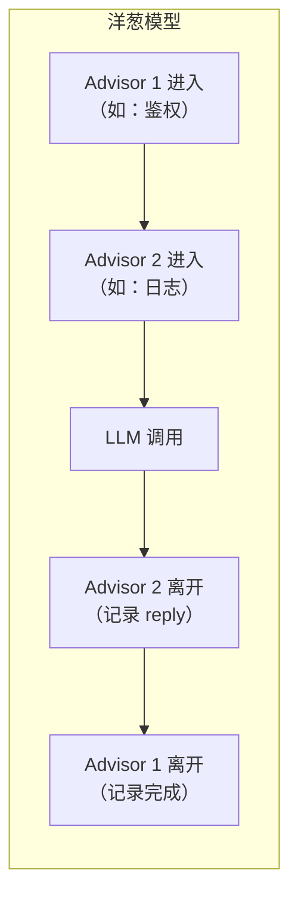

# 06 · Advisor 链

> 阶段：2 核心能力 · 难度：⭐⭐⭐ · 预计：1-2 天
> 前置：[05 流式输出](05-流式输出.md)
> 产出：理解 Advisor（AI 版 AOP），写出自定义 Advisor 实现日志/鉴权/审计等横切逻辑

---

## 你将学会

- Advisor 是什么：Spring AI 版的 Spring AOP
- Advisor 链的执行顺序（洋葱模型）
- 写一个日志 Advisor（记录每次调用的 prompt/reply/token）
- 写一个审计 Advisor（把所有调用记录到数据库）

---

## 为什么需要这个

你的 AI 应用上线后需要做这些事：
- 📝 记录每次对话的 prompt 和 reply（审计）
- 🔐 检查用户是否有权限调用（鉴权）
- 📊 统计 token 消耗（计费）
- 🚫 限制请求频率（限流）

这些逻辑和业务无关，但每个接口都需要。**如果在每个 Controller 方法里写一遍，代码会变得臃肿且难以维护。**

Advisor 就是解决这个问题的——把横切逻辑抽出来，像过滤器一样套在所有 AI 调用外面。

---

## 知识讲解

### 1. Advisor = AI 版的 AOP

如果你了解 Spring AOP（面向切面编程），Advisor 就是同一个概念应用到 AI 调用上：



| AOP 概念 | Advisor 对应 |
|---------|------------|
| 切面（Aspect） | Advisor |
| 切入点（Pointcut） | Advisor 自动拦截所有 ChatClient 调用 |
| 通知（Advice） | `adviseRequest` / `adviseResponse` |
| 连接点（JoinPoint） | ChatClient 请求/响应 |

### 2. Advisor 的两种类型

| 类型 | 接口 | 什么时候执行 | 典型用途 |
|------|------|-----------|---------|
| CallAdvisor | 拦截同步调用 | `.call()` 时 | 鉴权 / 审计 / 日志 |
| StreamAdvisor | 拦截流式调用 | `.stream()` 时 | 流式日志 / 流式限流 |

### 3. BaseAdvisor（同时拦截两种）

实际开发中，大多数 Advisor 需要同时处理同步和流式调用。用 `BaseAdvisor` 最方便：

```java
public class MyAdvisor implements BaseAdvisor {

    @Override
    public ChatClientRequest before(ChatClientRequest request) {
        // 请求发出前执行（可以修改 prompt）
        log.info("用户问题：{}", request.prompt());
        return request;
    }

    @Override
    public ChatClientResponse after(ChatClientResponse response) {
        // 响应返回后执行（可以修改 reply）
        log.info("AI 回复：{}", response.content());
        return response;
    }
}
```

---

## 动手实践

### Step 1：写一个日志 Advisor

```java
package demo.demo02.advisor;

import org.springframework.ai.chat.client.ChatClientRequest;
import org.springframework.ai.chat.client.ChatClientResponse;
import org.springframework.ai.chat.client.advisor.api.BaseAdvisor;
import org.slf4j.*;
import org.springframework.stereotype.Component;

@Component
public class LoggingAdvisor implements BaseAdvisor {

    private static final Logger log = LoggerFactory.getLogger(LoggingAdvisor.class);

    @Override
    public ChatClientRequest before(ChatClientRequest request) {
        // 记录请求信息
        String userText = request.prompt();
        log.info("📤 [LLM 请求] prompt={}字符", userText.length());

        // 也可以修改 prompt（比如注入额外信息）
        return request;
    }

    @Override
    public ChatClientResponse after(ChatClientResponse response) {
        // 记录响应信息
        String reply = response.chatResponse().getResult().getOutput().getText();
        var usage = response.chatResponse().getMetadata().getUsage();

        log.info("📥 [LLM 响应] reply={}字符 | tokens: input={} output={} total={}",
                reply.length(),
                usage.getPromptTokens(),
                usage.getCompletionTokens(),
                usage.getTotalTokens());

        return response;
    }

    @Override
    public int getOrder() {
        // 执行顺序（数字小的先执行）
        return 0;
    }
}
```

### Step 2：写一个 Token 计费 Advisor

```java
package demo.demo02.advisor;

import org.springframework.ai.chat.client.ChatClientRequest;
import org.springframework.ai.chat.client.ChatClientResponse;
import org.springframework.ai.chat.client.advisor.api.BaseAdvisor;
import org.springframework.stereotype.Component;

import java.util.concurrent.atomic.AtomicLong;

@Component
public class TokenBillingAdvisor implements BaseAdvisor {

    // 累计 token（生产环境存 Redis / 数据库）
    private final AtomicLong totalInputTokens = new AtomicLong();
    private final AtomicLong totalOutputTokens = new AtomicLong();

    // 价格（DeepSeek 示例，每百万 token）
    private static final double INPUT_PRICE_PER_M = 1.0;   // ¥1/百万 input token
    private static final double OUTPUT_PRICE_PER_M = 2.0;   // ¥2/百万 output token

    @Override
    public ChatClientRequest before(ChatClientRequest request) {
        return request;
    }

    @Override
    public ChatClientResponse after(ChatClientResponse response) {
        var usage = response.chatResponse().getMetadata().getUsage();

        long input = usage.getPromptTokens();
        long output = usage.getCompletionTokens();

        totalInputTokens.addAndGet(input);
        totalOutputTokens.addAndGet(output);

        return response;
    }

    public String getBillingReport() {
        double cost = (totalInputTokens.get() / 1_000_000.0 * INPUT_PRICE_PER_M)
                    + (totalOutputTokens.get() / 1_000_000.0 * OUTPUT_PRICE_PER_M);
        return String.format("Input: %d tokens | Output: %d tokens | Cost: ¥%.4f",
                totalInputTokens.get(), totalOutputTokens.get(), cost);
    }

    @Override
    public int getOrder() {
        return 10;  // 在 LoggingAdvisor 之后执行
    }
}
```

### Step 3：注册 Advisor

```java
@Configuration
public class ChatConfig {

    @Bean
    public ChatClient chatClient(
            ChatClient.Builder builder,
            ChatMemory memory,
            LoggingAdvisor loggingAdvisor,
            TokenBillingAdvisor billingAdvisor) {

        return builder
                .defaultAdvisors(
                    MessageChatMemoryAdvisor.builder(memory).build(),
                    loggingAdvisor,      // 注册日志 Advisor
                    billingAdvisor       // 注册计费 Advisor
                )
                .build();
    }
}
```

### Step 4：测试

```java
@RestController
@RequestMapping("/api")
public class ChatController {

    private final ChatClient chatClient;
    private final TokenBillingAdvisor billing;

    // ... 注入

    @GetMapping("/chat")
    public String chat(@RequestParam String q) {
        return chatClient.prompt().user(q).call().content();
    }

    @GetMapping("/billing")
    public String billing() {
        return billing.getBillingReport();
    }
}
```

```bash
curl "http://localhost:8080/api/chat?q=你好"
curl "http://localhost:8080/api/chat?q=什么是AI"
curl http://localhost:8080/api/billing
# Input: 52 tokens | Output: 45 tokens | Cost: ¥0.000142
```

同时在日志中你会看到：
```
📤 [LLM 请求] prompt=5字符
📥 [LLM 响应] reply=15字符 | tokens: input=5 output=15 total=20
```

---

## 常见坑

- ❌ **Advisor 顺序搞反** → `getOrder()` 数字小的先执行。鉴权应该放最前面
- ❌ **在 Advisor 中做耗时操作** → 会阻塞所有 AI 调用。耗时操作用异步
- ❌ **修改了 prompt 但没测试** → Advisor 修改 prompt 会影响 LLM 输出，要充分测试
- ❌ **流式调用忘了实现 StreamAdvisor** → 如果只实现了 CallAdvisor，流式调用不会触发

---

## 验收检查

- [ ] 日志 Advisor 能记录 prompt 和 reply
- [ ] 计费 Advisor 能累计 token 消耗
- [ ] 多个 Advisor 能按顺序执行（验证 getOrder）
- [ ] 能解释 Advisor 和 Spring AOP 的关系
- [ ] 理解洋葱模型的执行顺序

---

## 下一步

→ 下一篇：[07 项目 P2 知识库问答](07-项目P2-知识库问答.md) —— 把 RAG + 评估 + 流式 + Advisor 整合成完整项目
→ 概念卡壳？查 `理论字典/LLM基础.md`

---

## 随堂练习：Token 计费面板（45 分钟）

用 Advisor 拦截所有 LLM 调用，统计 token 消耗和费用。

**需求**：
```
GET /api/chat?q=你好       （正常聊天，同时被统计）
GET /api/billing            → 实时费用报告
```

**提示**：参考本篇的 `TokenBillingAdvisor`，加一个 `/api/billing` 接口返回 `Map.of("totalTokens", ..., "estimatedCost", ...)`。

**扩展**：按接口路径分别统计；接入 Micrometer 推送 Prometheus。

---

## 延伸阅读：Advisor 链深化路线

| 方向 | 文档 | 内容 |
|------|------|------|
| 安全 Advisor | [阶段4-27-安全防护深入](../阶段4-生产化/27-Agent安全防护深入.md) | 安全 Advisor 实战 |
| 语义防火墙 | [项目11-SentinelGuard Sprint1](../项目实践/11-企业项目-AI安全防御平台/Sprint1-语义防火墙.md) | SemanticFirewallAdvisor |
| 可观测性 | [阶段4-16-Agent可观测性MELT](../阶段4-生产化/16-Agent可观测性MELT.md) | Trace Advisor |
| 管控分离 | [阶段4-08-管控分离架构](../阶段4-生产化/08-管控分离架构.md) | 控制面 Advisor |
| 多租户 | [阶段4-18-多租户数据隔离](../阶段4-生产化/18-多租户数据隔离.md) | 租户隔离 Advisor |
