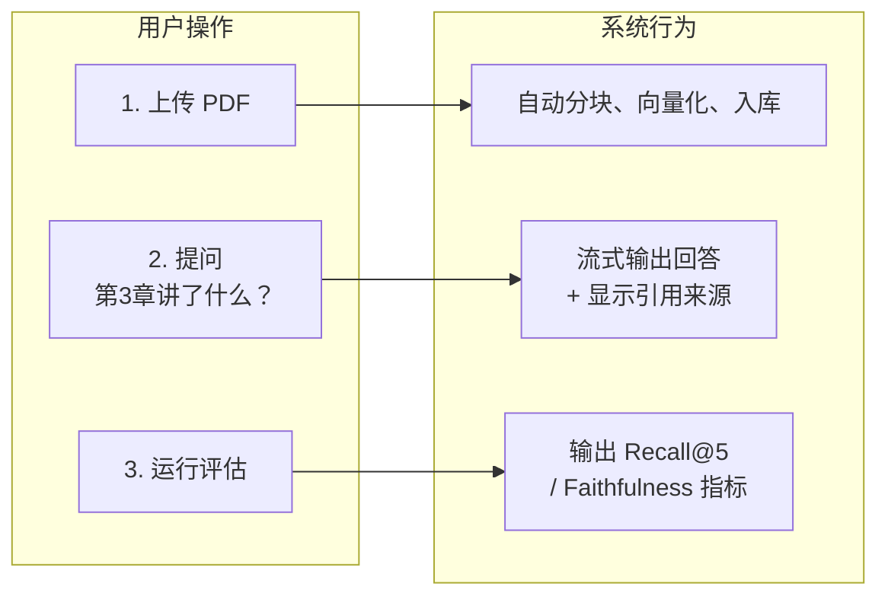

# 07 · 项目 P2：知识库问答

> 阶段：2 核心能力 · 难度：⭐⭐ · 预计：3-4 天
> 前置：[06 Advisor 链](06-Advisor链.md)
> 产出：一个完整的知识库问答系统——上传 PDF → 流式问答 + 质量评估

---

## 项目目标

你要做一个**个人知识库问答系统**：



**复用前面学的能力**：
- P1 的对话+记忆能力
- RAG 全链路
- 流式输出
- 评估方法论
- Advisor 链（日志 + 计费）

---

## 项目结构

```
src/main/java/demo/demo02/
├── Application.java
├── config/
│   └── ChatConfig.java           # ChatClient + Advisor 配置
├── rag/
│   └── RagService.java           # RAG 管道（加载→分块→入库→检索）
├── eval/
│   ├── TestSet.java              # 测试集定义
│   └── RagEvaluator.java         # 评估器
├── advisor/
│   ├── LoggingAdvisor.java       # 日志 Advisor
│   └── TokenBillingAdvisor.java  # 计费 Advisor
├── tools/
│   └── DatabaseTools.java        # 数据库工具
└── controller/
    ├── RagController.java         # 上传 + 问答接口
    ├── StreamController.java      # 流式问答
    └── EvalController.java        # 评估接口
```

---

## 动手实践

### Step 1：配置

```yaml
# application-demo02.yaml
server:
  port: 8081
spring:
  ai:
    openai:
      base-url: https://api.deepseek.com
      api-key: ${DEEPSEEK_API_KEY}
      chat:
        model: deepseek-chat
        temperature: 0.3          # RAG 场景用低 temperature，减少编造
```

### Step 2：RAG 服务（整合阶段 2 所学）

```java
package demo.demo02.rag;

import org.springframework.ai.document.*;
import org.springframework.ai.reader.pdf.*;
import org.springframework.ai.transformer.splitter.*;
import org.springframework.ai.vectorstore.*;
import org.springframework.stereotype.Service;
import org.springframework.core.io.Resource;
import java.util.List;

@Service
public class RagService {

    private final VectorStore vectorStore;

    public RagService(VectorStore vectorStore) {
        this.vectorStore = vectorStore;
    }

    public int ingest(Resource resource) {
        var reader = new PagePdfDocumentReader(resource);
        List<Document> docs = reader.get();

        var splitter = TokenTextSplitter.builder()
                .chunkSize(500).minChunkSizeChars(350)
                .minChunkLengthToEmbed(5).maxNumChunks(10000)
                .keepSeparator(true).build();
        List<Document> chunks = splitter.apply(docs);

        vectorStore.add(chunks);
        return chunks.size();
    }

    public List<Document> search(String query, int topK) {
        return vectorStore.similaritySearch(
            SearchRequest.builder().query(query).topK(topK).build());
    }
}
```

### Step 3：流式 RAG 问答接口

```java
package demo.demo02.controller;

import demo.demo02.rag.RagService;
import org.springframework.ai.chat.client.ChatClient;
import org.springframework.http.MediaType;
import org.springframework.web.bind.annotation.*;
import reactor.core.publisher.Flux;
import java.util.stream.Collectors;

@RestController
@RequestMapping("/api/kb")
public class KnowledgeBaseController {

    private final RagService ragService;
    private final ChatClient chatClient;

    public KnowledgeBaseController(RagService ragService, ChatClient chatClient) {
        this.ragService = ragService;
        this.chatClient = chatClient;
    }

    // 流式问答：边检索边生成边输出
    @GetMapping(value = "/ask", produces = MediaType.TEXT_EVENT_STREAM_VALUE)
    public Flux<String> ask(@RequestParam String q) {
        // 1. 检索
        var docs = ragService.search(q, 3);
        String context = docs.stream()
                .map(d -> d.getText())
                .collect(Collectors.joining("\n---\n"));

        // 2. 流式生成
        String prompt = """
            基于以下文档回答问题。如果文档中没有相关信息，说"根据已有文档无法回答"。

            文档：
            %s

            问题：%s
            """.formatted(context, q);

        return chatClient.prompt()
                .user(prompt)
                .stream()
                .content()
                .onErrorResume(e -> Flux.just("\n⚠️ 出错了：" + e.getMessage()));
    }
}
```

### Step 4：整合所有组件的 ChatConfig

```java
@Configuration
public class ChatConfig {

    @Bean
    public ChatMemory chatMemory() {
        return MessageWindowChatMemory.builder().maxMessages(20).build();
    }

    @Bean
    public ChatClient chatClient(
            ChatClient.Builder builder,
            ChatMemory memory,
            LoggingAdvisor logging,
            TokenBillingAdvisor billing) {

        return builder
                .defaultSystem("你是一个知识库助手，基于提供的文档回答问题。")
                .defaultAdvisors(
                    MessageChatMemoryAdvisor.builder(memory).build(),
                    logging,
                    billing)
                .build();
    }
}
```

### Step 5：前端页面

```html
<!-- src/main/resources/static/kb.html -->
<!DOCTYPE html>
<html>
<head>
    <meta charset="UTF-8">
    <title>知识库问答</title>
    <style>
        body { font-family: sans-serif; max-width: 900px; margin: 30px auto; padding: 0 20px; }
        .chat-box { background: #f5f5f5; padding: 20px; border-radius: 8px; min-height: 300px; margin-bottom: 15px; }
        .msg { margin: 10px 0; padding: 10px; border-radius: 6px; }
        .msg.user { background: #007bff; color: white; }
        .msg.ai { background: white; border: 1px solid #ddd; }
        input { width: 70%; padding: 10px; font-size: 16px; }
        button { padding: 10px 20px; font-size: 16px; cursor: pointer; }
    </style>
</head>
<body>
    <h1>📚 知识库问答</h1>
    <div class="chat-box" id="chat"></div>
    <input id="input" placeholder="输入问题..." onkeypress="if(event.key==='Enter')ask()">
    <button onclick="ask()">提问</button>

    <script>
        function ask() {
            const input = document.getElementById('input');
            const chat = document.getElementById('chat');
            const q = input.value.trim();
            if (!q) return;

            // 显示用户消息
            chat.innerHTML += `<div class="msg user">${q}</div>`;
            input.value = '';

            // 创建 AI 消息容器
            const aiDiv = document.createElement('div');
            aiDiv.className = 'msg ai';
            aiDiv.textContent = '思考中...';
            chat.appendChild(aiDiv);
            chat.scrollTop = chat.scrollHeight;

            // 流式请求
            const es = new EventSource(`/api/kb/ask?q=${encodeURIComponent(q)}`);
            aiDiv.textContent = '';

            es.onmessage = (e) => {
                aiDiv.textContent += e.data;
                chat.scrollTop = chat.scrollHeight;
            };
            es.onerror = () => { es.close(); };
        }
    </script>
</body>
</html>
```

### Step 6：完整流程测试

```bash
# 1. 上传文档
curl -F "file=@知识库文档.pdf" http://localhost:8081/api/kb/upload
# {"status":"ok","chunks":52}

# 2. 打开浏览器访问 http://localhost:8081/kb.html
# 3. 输入问题，看流式回答

# 4. 运行评估
curl -X POST http://localhost:8081/api/eval/run | jq .
# {"recallAt5": 0.85, "faithfulness": 0.78, ...}

# 5. 查看计费
curl http://localhost:8081/api/billing
# Input: 1520 tokens | Output: 830 tokens | Cost: ¥0.003180
```

---

## 验收检查（P2 项目标准）

- [ ] 能上传 PDF → 自动分块入库
- [ ] 能基于文档流式问答
- [ ] 文档中没有的信息会正确拒答（不编造）
- [ ] 有至少 30 条测试集
- [ ] 有 3 个量化指标（Recall@5 / Faithfulness / 拒答率）
- [ ] 有日志和计费 Advisor
- [ ] 前端页面可用
- [ ] Git 提交至少 10 次

---

## 🎉 阶段 2 完成

你已经从"能调 LLM"升级到了"能做有检索、有评估、有流式的真实 AI 应用"。接下来阶段 3 会让你的应用进化成真正的 **Agent**——能自主完成多步骤任务。

---

## 下一步

→ 进入 [阶段 3 Agent 工程化](../阶段3-Agent工程化/01-Agent循环.md) —— Agent Loop / 五大 Workflow / MCP / 安全
→ 概念卡壳？查 `理论字典/RAG原理.md`
