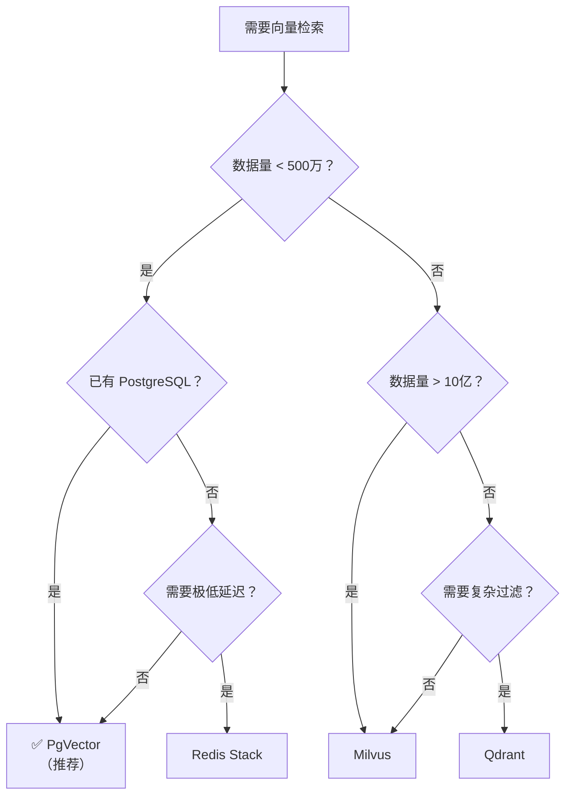

# 08 · 向量数据库选型与实践（补充篇）

> 阶段：2 核心能力 · 难度：⭐⭐⭐ · 预计：1 天
> 前置：[07 项目 P2 知识库问答](07-项目P2-知识库问答.md)
> 产出：掌握企业级向量数据库的选型决策和实战配置

---

## 为什么需要这个

阶段2-02 讲了向量检索原理，阶段2-03 讲了 RAG 全链路，但**向量数据库本身的选型和配置**是一个独立的工程决策，直接影响 RAG 的性能、成本和可维护性。

---

## 选型决策矩阵

| 向量库 | 类型 | 优点 | 缺点 | 适用场景 |
|--------|------|------|------|---------|
| **PgVector** | PostgreSQL 扩展 | 与业务数据同库、事务一致性、运维简单 | 百万级以上性能下降 | **推荐首选**（90% 场景） |
| **Redis Stack** | 内存数据库 | 极快、已有 Redis 可复用 | 内存成本高、数据量受限 | 缓存型语义检索 |
| **Milvus** | 专用向量数据库 | 十亿级高性能、分布式 | 运维复杂、独立部署 | 超大规模 |
| **Qdrant** | 专用向量数据库 | Rust 写的、性能好、过滤强 | 生态较新 | 中大规模、复杂过滤 |
| **Chroma** | 轻量嵌入式 | 零配置、开发友好 | 不适合生产 | 原型/测试 |
| **Elasticsearch** | 全文+向量 | 混合检索（BM25+向量）| 资源消耗大 | 已有 ES 的团队 |

### 决策流程



---

## PgVector 实战配置

### 依赖

```xml
<dependency>
    <groupId>org.springframework.ai</groupId>
    <artifactId>spring-ai-pgvector-store</artifactId>
</dependency>
```

### 配置

```yaml
spring:
  ai:
    vectorstore:
      pgvector:
        # 自动建表
        initialize-schema: true
        # 向量维度（取决于 Embedding 模型）
        dimensions: 1536
        # 距离计算方式
        distance-type: COSINE_DISTANCE
        # 索引类型
        index-type: HNSW
        # HNSW 参数
        hnsw:
          m: 16              # 每层最大连接数
          ef-construction: 64 # 构建时搜索宽度
```

### 索引选择

```sql
-- HNSW 索引（推荐——查询快，构建慢）
CREATE INDEX idx_docs_embedding ON documents
USING hnsw (embedding vector_cosine_ops)
WITH (m = 16, ef_construction = 64);

-- IVFFlat 索引（构建快，查询略慢）
CREATE INDEX idx_docs_embedding ON documents
USING ivfflat (embedding vector_cosine_ops)
WITH (lists = 100);  -- lists ≈ sqrt(row_count)
```

| 索引类型 | 构建速度 | 查询速度 | 召回率 | 推荐场景 |
|---------|---------|---------|-------|---------|
| **HNSW** | 慢 | 极快 | 高（99%+） | **推荐**（大多数场景） |
| **IVFFlat** | 快 | 快 | 中（95%） | 数据频繁变更 |
| 精确扫描 | N/A | 慢 | 100% | 数据量 < 10K |

### 多租户过滤

```java
@Service
public class MultiTenantVectorSearch {

    private final VectorStore vectorStore;

    /**
     * 按租户检索——关键：filterExpression
     */
    public List<Document> searchForTenant(String query, String tenantId, int topK) {
        return vectorStore.similaritySearch(
            SearchRequest.query(query)
                .withTopK(topK)
                .withSimilarityThreshold(0.7)
                .withFilterExpression("tenant_id == '" + tenantId + "'")
        );
    }

    /**
     * 多条件过滤
     */
    public List<Document> searchWithMetadata(String query, String tenantId,
                                              String category, String department) {
        return vectorStore.similaritySearch(
            SearchRequest.query(query)
                .withTopK(5)
                .withFilterExpression(
                    "tenant_id == '" + tenantId + "' && " +
                    "category == '" + category + "' && " +
                    "department == '" + department + "'"
                )
        );
    }
}
```

---

## 批量写入优化

```java
@Service
public class BatchIngestService {

    private final VectorStore vectorStore;

    /**
     * 批量写入向量——性能优化
     */
    public void batchIngest(List<Document> documents) {
        // 分批写入（每批 100 条）
        int batchSize = 100;
        for (int i = 0; i < documents.size(); i += batchSize) {
            int end = Math.min(i + batchSize, documents.size());
            List<Document> batch = documents.subList(i, end);

            // 添加元数据
            batch.forEach(doc -> {
                doc.getMetadata().putIfAbsent("ingested_at", Instant.now().toString());
                doc.getMetadata().putIfAbsent("source", "batch_ingest");
            });

            vectorStore.add(batch);
        }
    }

    /**
     * 删除租户的所有向量
     */
    public void deleteByTenant(String tenantId) {
        // PgVector 的删除
        vectorStore.delete(
            vectorStore.similaritySearch(
                SearchRequest.query(".*")
                    .withTopK(10000)
                    .withFilterExpression("tenant_id == '" + tenantId + "'")
            ).stream().map(Document::getId).toList()
        );
    }
}
```

---

## 性能基准参考

| 数据量 | HNSW 查询延迟 | 写入延迟 | 内存占用 |
|--------|-------------|---------|---------|
| 10K 文档 | < 5ms | < 10ms/doc | ~50MB |
| 100K 文档 | < 10ms | < 10ms/doc | ~500MB |
| 1M 文档 | < 20ms | < 10ms/doc | ~5GB |
| 10M 文档 | < 50ms | < 10ms/doc | ~50GB |

> ⚠️ 超过 500 万文档时，考虑迁移到 Milvus 或 Qdrant。

---

## 随堂练习：多租户知识库管理

> 实现一个支持多租户的文档管理 API：
> 1. POST `/api/kb/{tenantId}/upload` — 上传文档（分块→嵌入→存储，带 tenant_id 元数据）
> 2. GET `/api/kb/{tenantId}/search?q=xxx` — 按租户检索
> 3. DELETE `/api/kb/{tenantId}` — 删除租户的所有向量
> 4. 验证：租户 A 的查询不会返回租户 B 的文档

---

## 验收检查

- [ ] 理解不同向量库的优缺点和适用场景
- [ ] 能用 PgVector 配置 HNSW 索引
- [ ] 能实现多租户过滤检索
- [ ] 能实现批量写入优化
- [ ] 知道何时该从 PgVector 迁移到专用向量库

---

## 下一步

→ 进入 [阶段 3 Agent 工程化](../阶段3-Agent工程化/01-Agent循环.md)
