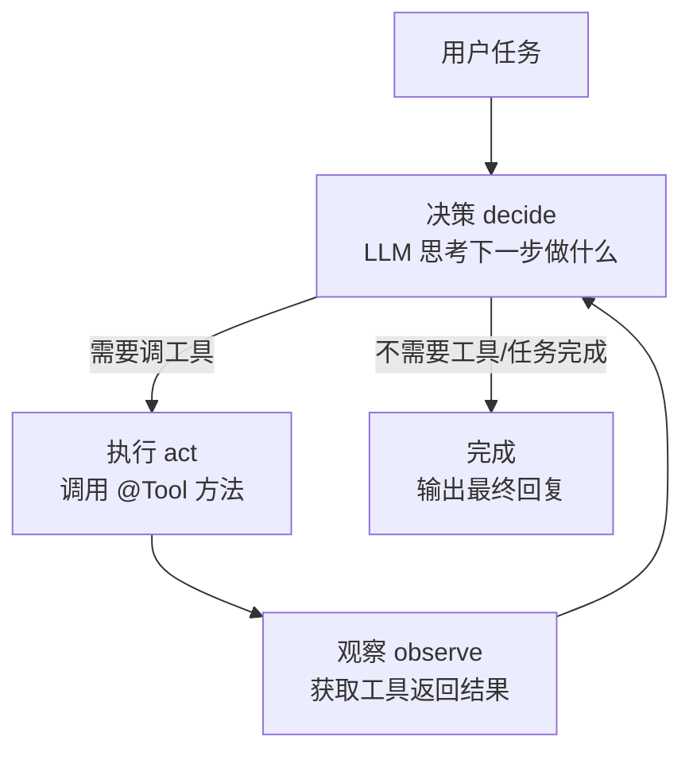
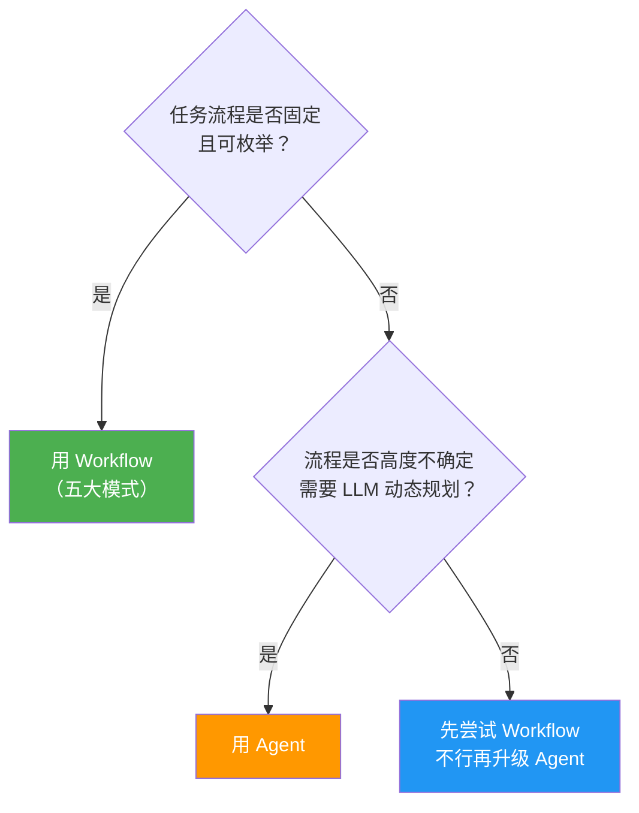

# 01 · Agent 循环

> 阶段：3 Agent 工程化 · 难度：⭐⭐⭐ · 预计：2 天
> 前置：[阶段 2 完成](../阶段2-核心能力/07-项目P2-知识库问答.md)
> 产出：理解 Agent 循环（decide-act-observe），用 Spring AI 跑通一个真正的 Agent

---

## 你将学会

- Agent 和普通 AI 应用的区别
- Agent 循环：`while(true) { 决策(); 执行(); 观察(); }`
- Spring AI 的 `ToolCallingAdvisor` 如何自动管理循环
- Workflow vs Agent：什么时候用哪个（黄金法则）

---

## 为什么需要这个

到目前为止，你的 AI 应用是"一问一答 + 工具"的模式——LLM 最多调一次工具就回复了。

但真实任务往往需要**多步骤**：

```
用户：帮我查一下用户张三的订单，如果订单超过 500 元，发一封优惠邮件

这个任务需要：
  1. 搜索用户（工具调用）
  2. 查询订单（工具调用）
  3. 判断金额（LLM 推理）
  4. 发邮件（工具调用）
  5. 汇总结果（LLM 生成）
```

这就是 Agent——它能**自主规划多步骤、在步骤间做决策、直到任务完成**。

---

## 知识讲解

### 1. Agent 的本质



这个循环就是 **ReAct 模式**（Reasoning + Acting）：

```
思考：用户要查张三的订单，我先搜索用户
行动：调用 searchUser("张三")
观察：找到 用户ID=5, 张三, zhangsan@example.com

思考：现在用用户ID查订单
行动：调用 getOrders(5)
观察：订单 #1234, 金额 ¥680

思考：680 > 500，需要发优惠邮件
行动：调用 sendEmail("zhangsan@example.com", "优惠内容")
观察：邮件已发送

思考：所有步骤完成，汇总结果
回复：已查询张三的订单（¥680），并发送了优惠邮件。
```

### 2. 普通调用 vs Agent 调用

```java
// 普通调用：LLM 最多调一次工具
String reply = chatClient.prompt()
        .user("几点了")
        .tools(timeTools)
        .call()
        .content();
// LLM: 调用 getTime → 得到结果 → 回复。一步到位。

// Agent 调用：LLM 可能调多次工具
String reply = chatClient.prompt()
        .user("查张三的订单，超过500就发优惠邮件")
        .tools(userTools, orderTools, emailTools)
        .call()
        .content();
// LLM: 调 searchUser → 观察 → 调 getOrders → 观察 → 判断 → 调 sendEmail → 观察 → 回复
// Spring AI 的 ToolCallingAdvisor 自动管理这个循环！
```

> 💡 **好消息**：Spring AI 自动管理 Agent 循环。你不需要手写 `while(true)`——`.call()` 内部自动循环直到 LLM 不再请求工具。

### 3. Workflow vs Agent：黄金法则

> **能用确定性工作流（DAG）解决的，绝不用自主 Agent。**

| 特征 | Workflow（确定性） | Agent（自主） |
|------|-------------------|-------------|
| 流程 | 固定步骤，你写死 | LLM 动态决定下一步 |
| 可预测性 | 高（每次一样） | 低（可能走不同路径） |
| 成本 | 可控 | 不可控（可能循环很多次） |
| 适用 | 步骤明确、可枚举 | 步骤不确定、需要灵活决策 |

**决策树**：



---

## 动手实践

### Step 1：实现多步骤任务

```java
package demo.demo03.agent;

import org.springframework.ai.chat.client.ChatClient;
import org.springframework.web.bind.annotation.*;
import demo.demo03.tools.*;

@RestController
@RequestMapping("/api/agent")
public class AgentController {

    private final ChatClient chatClient;

    public AgentController(ChatClient chatClient,
                          UserTools userTools,
                          OrderTools orderTools,
                          EmailTools emailTools) {
        this.chatClient = chatClient;
    }

    @GetMapping("/task")
    public String task(@RequestParam String instruction) {
        return chatClient.prompt()
                .system("""
                    你是一个任务执行 Agent。按照用户指令，逐步使用工具完成任务。
                    每次只执行一步，观察结果后再决定下一步。
                    任务完成后，用自然语言汇总结果。
                    """)
                .user(instruction)
                .tools(userTools, orderTools, emailTools)
                .call()
                .content();
    }
}
```

```bash
curl "http://localhost:8080/api/agent/task?q=查询张三的订单，超过500元就发优惠邮件"
# AI: 我来帮你处理：
# 1. 搜索用户"张三" → 找到用户ID=5
# 2. 查询订单 → 订单#1234，金额¥680
# 3. ¥680超过500元，发送优惠邮件到 zhangsan@example.com
# 已完成！张三的订单¥680已发送优惠邮件。
```

### Step 2：观察 Agent 的执行过程

开启 DEBUG 日志：

```yaml
logging:
  level:
    org.springframework.ai.chat: DEBUG
```

你会看到 Agent 的完整执行过程：
```
[DEBUG] LLM 请求 → tools: [searchUser, getOrders, sendEmail]
[DEBUG] LLM 返回 → tool_call: searchUser(name="张三")
[DEBUG] 执行 searchUser → 返回：用户ID=5
[DEBUG] LLM 请求（带工具结果）
[DEBUG] LLM 返回 → tool_call: getOrders(userId=5)
[DEBUG] 执行 getOrders → 返回：订单#1234, ¥680
[DEBUG] LLM 请求（带工具结果）
[DEBUG] LLM 返回 → tool_call: sendEmail(to="zhangsan@example.com", ...)
[DEBUG] 执行 sendEmail → 返回：邮件已发送
[DEBUG] LLM 请求（带工具结果）
[DEBUG] LLM 返回 → 最终回复（无工具调用）
```

### Step 3：对比 Workflow 方式

同一个任务用 Workflow（确定性步骤）实现：

```java
@GetMapping("/workflow-task")
public String workflowTask(@RequestParam String userName) {
    // 步骤 1：搜索用户（固定步骤）
    String userInfo = userTools.searchUser(userName);

    // 步骤 2：查订单
    Long userId = extractUserId(userInfo);
    String orders = orderTools.getOrders(userId);

    // 步骤 3：判断金额
    double amount = extractAmount(orders);

    // 步骤 4：发邮件（条件分支）
    if (amount > 500) {
        String email = extractEmail(userInfo);
        emailTools.sendEmail(email, "优惠内容");
        return userName + "的订单¥" + amount + "已发送优惠邮件";
    }

    return userName + "的订单¥" + amount + "未超过500元，不发邮件";
}
```

**对比**：
- Workflow：步骤固定，结果可预测，代码量多
- Agent：LLM 自己规划，代码量少，但结果不完全可预测

---

## 常见坑

- ❌ **工具描述不清导致 Agent 走弯路** → Agent 的决策完全依赖工具描述。描述不清 = Agent 迷路
- ❌ **没有终止保护** → Agent 可能无限循环。下一篇讲防失控
- ❌ **Agent 执行有副作用的操作** → 发邮件/删数据这类操作一定要有确认机制。阶段 4 讲可靠性
- ❌ **所有任务都用 Agent** → 黄金法则：能用 Workflow 的不用 Agent
- ❌ **工具粒度太粗** → "管理用户"这种工具让 LLM 不知道怎么传参，拆成 getUser/createUser/updateUser
- ❌ **工具之间有依赖但没告诉 LLM** → 如果 getOrders 需要 userId，在 searchUser 的返回值里带出 userId，让 LLM 自然衔接

---

## Agent vs Workflow 选型决策表

| 你的任务特征 | 推荐方案 | 示例 |
|-------------|---------|------|
| 步骤固定，顺序明确 | **Workflow: Chaining** | 翻译→审校→格式化 |
| 步骤固定，可并行 | **Workflow: Parallelization** | 多维度同时评审 |
| 分类后走不同分支 | **Workflow: Routing** | 按语言路由评审 |
| 分支数量不确定 | **Workflow: Orchestrator** | 动态分配评审员 |
| 需要质量控制循环 | **Workflow: Evaluator-Optimizer** | 生成→评估→改进 |
| 步骤完全不确定 | **Agent** | 开放式研究任务 |
| 步骤部分确定 | **Workflow 为主 + Agent 补充** | 编排框架 + 少量 Agent 节点 |

> 经验法则：**先尝试 Workflow，当某个节点确实需要自主决策时再局部升级为 Agent。** 不要一步到位用 Agent。

---

## 验收检查

- [ ] 能用 `.tools()` 注册多个工具让 Agent 自主编排
- [ ] 在日志中能看到 Agent 的多步执行过程
- [ ] 能用自然语言解释 Agent 循环（decide-act-observe）
- [ ] 能解释 Workflow vs Agent 的区别和选型原则
- [ ] 知道"能用 Workflow 就不用 Agent"

---

## 下一步

→ 下一篇：[02 五大 Workflow 模式](02-五大Workflow模式.md) —— Anthropic 的企业级 Workflow 设计模式
→ 概念卡壳？查 `理论字典/Agent范式.md`

---

## 延伸阅读

| 方向 | 文档 | 深化内容 |
|------|------|---------|
| 自我反思 | [阶段4-41-Agent自我反思与元认知](../阶段4-生产化/41-Agent自我反思与元认知.md) | Agent 从执行到反思的智能跃迁 |
| 记忆架构 | [阶段4-40-Agent记忆架构深度设计](../阶段4-生产化/40-Agent记忆架构深度设计.md) | 工作记忆/短期记忆/长期记忆三层模型 |
| Agent 调试 | [阶段5-11-Agent调试与根因分析](../阶段5-架构师/11-Agent调试与根因分析.md) | 非确定性 Agent 的 Trace 回放调试 |
| 速率限制 | [阶段5-09-Agent速率限制与背压设计](../阶段5-架构师/09-Agent速率限制与背压设计.md) | Agent 循环中的背压传播 |
| 编排理论 | [理论字典-Agent编排](../理论字典/Agent编排.md) | 多 Agent 编排模式决策树 |

---

## 随堂练习：多步骤日程管理 Agent（60 分钟）

让 Agent 自主完成多步骤任务：查团队成员 → 逐个发通知 → 创建日历事件 → 汇总。

**提示**：实现 `getTeamMembers()`、`sendNotification(name, msg)`、`createCalendarEvent(title, time)` 三个工具，注册到 ChatClient，用自然语言指令驱动 Agent。

**验收**：Agent 自动先查列表、再逐个通知、最后创建事件。用 DEBUG 日志观察完整执行链。
