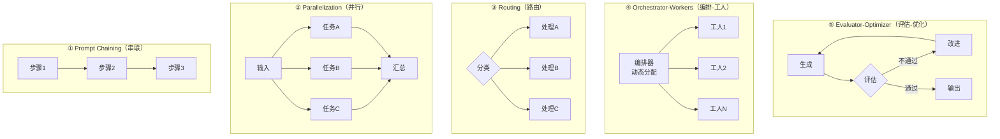
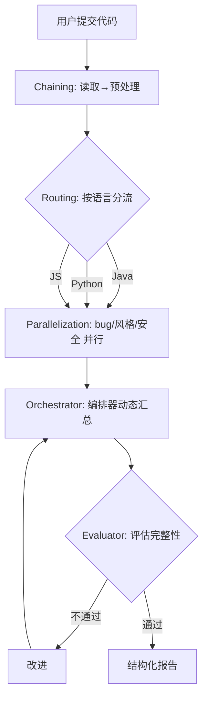

# 02 · 五大 Workflow 模式

> 阶段：3 Agent 工程化 · 难度：⭐⭐⭐⭐ · 预计：3 天
> 前置：[01 Agent 循环](01-Agent循环.md)
> 产出：掌握 Anthropic 五大 Workflow 模式，每个模式封装成可复用组件

---

## 你将学会

- Anthropic 五大 Workflow 模式：Chaining / Parallelization / Routing / Orchestrator-Workers / Evaluator-Optimizer
- 每个模式的适用场景和反模式
- 每个模式的 Java 实现
- 在真实项目中组合使用五种模式

---

## 为什么需要这个

> 来源：[Anthropic《Building Effective Agents》(2024-12-19)](https://www.anthropic.com/research/building-effective-agents)

企业级 Agent 的主流形态**不是自主 ReAct Agent**，而是**确定性 Workflow 模式**。Anthropic 总结了五种模式，覆盖 80% 的企业场景。

**核心原则：Workflow > Agent**——能用确定性 DAG 解决的，绝不用自主 Agent。

---

## 五大模式总览



---

## 模式 1：Prompt Chaining（串联）

**定义**：把一个大任务拆成多个串联的小步骤，每步的输出是下一步的输入。

**适用场景**：任务有明确的先后顺序。

```java
// 代码评审串联：读文件 → 分析 → 生成报告
public String codeReview(String filePath) {
    // 步骤 1：读取并理解代码
    String analysis = chatClient.prompt()
            .user("分析这段代码的功能和结构：\n" + Files.readString(Path.of(filePath)))
            .call().content();

    // 步骤 2：基于分析找问题
    String issues = chatClient.prompt()
            .user("基于以下分析，找出代码中的 bug 和风险：\n" + analysis)
            .call().content();

    // 步骤 3：生成结构化报告
    String report = chatClient.prompt()
            .user("把以下分析结果整理成结构化评审报告：\n" + issues)
            .call().content();

    return report;
}
```

---

## 模式 2：Parallelization（并行）

**定义**：同一任务并行跑多个实例，结果汇总。有两种子模式：
- **分段**：不同部分同时处理
- **投票**：同一任务跑 N 次取共识

**适用场景**：任务可以并行分解。

```java
// 代码评审并行：bug / 风格 / 安全 三个维度同时分析
public String parallelReview(String code) {
    // 三个维度并行分析
    CompletableFuture<String> bugAnalysis = CompletableFuture.supplyAsync(() ->
        chatClient.prompt()
            .user("找出这段代码中的 bug 和逻辑错误：\n" + code)
            .call().content()
    );

    CompletableFuture<String> styleAnalysis = CompletableFuture.supplyAsync(() ->
        chatClient.prompt()
            .user("审查这段代码的编码风格和可读性：\n" + code)
            .call().content()
    );

    CompletableFuture<String> securityAnalysis = CompletableFuture.supplyAsync(() ->
        chatClient.prompt()
            .user("检查这段代码的安全漏洞（注入/泄露/越权）：\n" + code)
            .call().content()
    );

    // 等待全部完成并汇总
    CompletableFuture.allOf(bugAnalysis, styleAnalysis, securityAnalysis).join();

    return """
        ## Bug 分析
        %s

        ## 风格审查
        %s

        ## 安全检查
        %s
        """.formatted(bugAnalysis.join(), styleAnalysis.join(), securityAnalysis.join());
}
```

---

## 模式 3：Routing（路由）

**定义**：先分类输入，再路由到不同的处理器。

**适用场景**：不同类型的输入需要不同的处理逻辑。

```java
// 代码评审路由：按编程语言路由到不同的评审员
public String routedReview(String code) {
    // 步骤 1：LLM 分类
    String language = chatClient.prompt()
            .user("判断以下代码是什么编程语言，只输出语言名（Java/Python/JavaScript/Other）：\n" + code)
            .call().content().trim();

    // 步骤 2：路由到对应评审员
    return switch (language) {
        case "Java" -> javaReviewer(code);
        case "Python" -> pythonReviewer(code);
        case "JavaScript" -> jsReviewer(code);
        default -> chatClient.prompt()
                .user("评审以下代码：\n" + code)
                .call().content();
    };
}

private String javaReviewer(String code) {
    return chatClient.prompt()
            .system("你是 Java 专家。检查空指针、资源泄露、线程安全、Spring 最佳实践。")
            .user(code)
            .call().content();
}
```

---

## 模式 4：Orchestrator-Workers（编排-工人）

**定义**：一个编排器 LLM 动态决定分配多少工人、做什么，工人完成后编排器汇总。

**与 Routing 的区别**：Routing 是你写死的分类规则；Orchestrator 是 LLM 动态决策。

**适用场景**：任务复杂度不确定，需要动态分配资源。

```java
// 代码评审编排：编排器根据代码复杂度决定派多少评审员
public String orchestratedReview(String code) {
    // 编排器：分析代码，决定需要哪些维度的评审
    String plan = chatClient.prompt()
            .system("""
                你是代码评审编排器。分析代码后，输出 JSON 格式的评审计划：
                {"dimensions": ["需要检查的维度"], "complexity": "简单/中等/复杂"}
                可选维度：bug, 风格, 安全, 性能, 可维护性, 并发安全
                """)
            .user(code)
            .call().content();

    // 解析计划
    ReviewPlan reviewPlan = parsePlan(plan);

    // 按计划动态派工人（并行）
    List<CompletableFuture<String>> workers = reviewPlan.dimensions().stream()
            .map(dim -> CompletableFuture.supplyAsync(() ->
                chatClient.prompt()
                    .system("你是" + dim + "方面的专家。")
                    .user("从" + dim + "角度审查：\n" + code)
                    .call().content()
            ))
            .toList();

    // 等待所有工人完成
    CompletableFuture.allOf(workers.toArray(CompletableFuture[]::new)).join();

    // 编排器汇总
    String allResults = workers.stream()
            .map(CompletableFuture::join)
            .collect(Collectors.joining("\n\n---\n\n"));

    return chatClient.prompt()
            .system("你是评审汇总员。把以下各维度评审结果整合成一份结构化报告。")
            .user(allResults)
            .call().content();
}
```

---

## 模式 5：Evaluator-Optimizer（评估-优化）

**定义**：生成 → 评估 → 改进的循环，直到评估通过或达到最大迭代次数。

**适用场景**：需要质量保证的任务（翻译、代码审查、文档生成）。

> ⚠️ **必须设 maxIter**——否则可能死循环！

```java
// 代码评审评估-优化：生成报告 → 评估完整性 → 改进 → 直到通过
public String evaluatedReview(String code, int maxIter) {
    // 步骤 1：生成初始评审报告
    String report = chatClient.prompt()
            .system("你是高级代码审查员。生成详细的代码评审报告。")
            .user(code)
            .call().content();

    for (int i = 0; i < maxIter; i++) {
        // 步骤 2：评估报告质量
        String evaluation = chatClient.prompt()
                .system("""
                    你是评审质量检查员。评估以下评审报告的完整性和准确性。
                    输出 JSON：{"pass": true/false, "issues": ["缺失的方面"]}
                    """)
                .user("代码：\n" + code + "\n\n评审报告：\n" + report)
                .call().content();

        EvalResult eval = parseEval(evaluation);

        // 评估通过 → 返回
        if (eval.pass()) {
            return report + "\n\n（经过 " + (i + 1) + " 轮评估优化）";
        }

        // 评估未通过 → 改进
        report = chatClient.prompt()
                .system("根据评审反馈改进你的代码评审报告。")
                .user("原报告：\n" + report + "\n\n需要改进的问题：\n" + String.join("\n", eval.issues()))
                .call().content();
    }

    return report + "\n\n（达到最大迭代次数 " + maxIter + "）";
}
```

---

## 组合使用：代码评审助手

一个真实的代码评审助手会**组合所有五种模式**：



> 这就是项目 P3 要实现的内容！

---

## 验收检查

- [ ] 能实现 Chaining 模式（串联步骤）
- [ ] 能实现 Parallelization 模式（并行 + 汇总）
- [ ] 能实现 Routing 模式（分类 + 路由）
- [ ] 能实现 Orchestrator-Workers 模式（动态分配）
- [ ] 能实现 Evaluator-Optimizer 模式（含 maxIter 防死循环）
- [ ] 能解释每个模式的适用场景和反模式

---

## 下一步

→ 下一篇：[03 Agent 防失控](03-Agent防失控.md) —— 三重保护让 Agent 不烧钱、不死循环
→ 概念卡壳？查 `理论字典/Agent范式.md`

---

## 随堂练习：智能客服路由分发器（45 分钟）

实现 Routing 模式：用户消息 → LLM 分类 → 路由到不同处理器。

**需求**：
```
"我的订单到哪了"     → ORDER  → 订单客服处理
"退款怎么操作"       → REFUND → 退款客服处理
"产品有什么功能"     → PRODUCT → 产品客服处理
```

**提示**：用 LLM 做分类器（只输出类别名），`switch` 路由到不同 system prompt 的 ChatClient 调用。

**验收**：分类准确率 > 90%（测 10 条对 9 条）。**扩展**：加 Evaluator 检查回复质量。

---

## 延伸阅读：编排深化路线

| 方向 | 文档 | 内容 |
|------|------|------|
| 多 Agent 编排 | [阶段5-01-多Agent编排](../阶段5-架构师/01-多Agent编排.md) | 从单 Agent 到多 Agent |
| 编排引擎选型 | [阶段5-05-编排引擎选型](../阶段5-架构师/05-编排引擎选型.md) | DAG vs 状态机 vs 自主 |
| 工作流实战 | [项目07-FlowEngine](../项目实践/07-企业项目-工作流引擎/00-总览.md) | DAG编排+审批+集成 |
| 智能编排 | [项目15-NexusOrchestra](../项目实践/15-企业项目-Agent智能编排平台/00-总览.md) | 上百Agent编排平台 |
| Saga 事务 | [阶段4-10-Saga补偿事务](../阶段4-生产化/10-Saga补偿事务.md) | 分布式事务补偿 |
| 编排理论 | [理论字典-Agent编排](../理论字典/Agent编排.md) | 五大模式决策树 |
| 自我反思 | [阶段4-41-自我反思与元认知](../阶段4-生产化/41-Agent自我反思与元认知.md) | Evaluator-Optimizer 的深化 |
