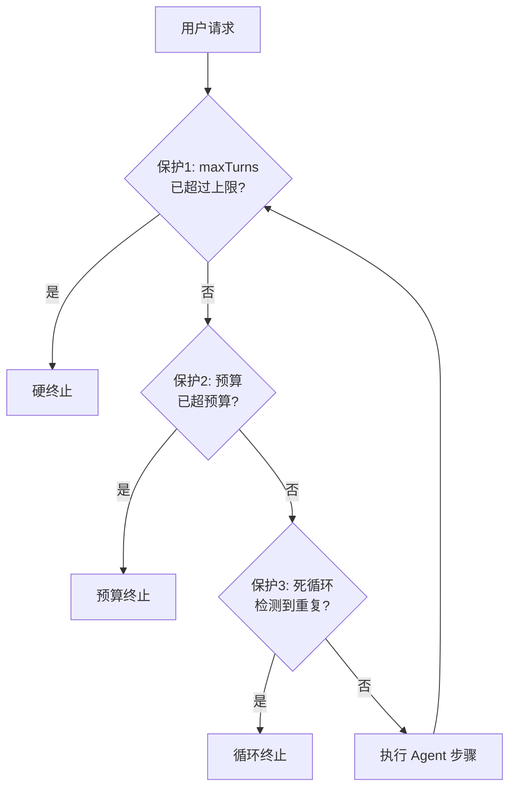

# 03 · Agent 防失控

> 阶段：3 Agent 工程化 · 难度：⭐⭐⭐ · 预计：1 天
> 前置：[02 五大 Workflow 模式](02-五大Workflow模式.md)
> 产出：实现 Agent 三重保护——maxTurns / 美元预算 / 死循环检测

---

## 你将学会

- Agent 失控的三种模式（无限循环 / 成本爆炸 / 死循环）
- 三重保护：maxTurns + 美元预算 + transitionReason 重复检测
- 用 Advisor 实现保护机制

---

## 为什么需要这个

Agent 是自主的——它可以自己决定调用多少次工具。如果出问题：

| 失控类型 | 后果 | 原因 |
|---------|------|------|
| 无限循环 | 永远不结束 | 没有终止条件 |
| 成本爆炸 | 烧光预算 | 每次循环都消耗 token |
| 死循环 | 看似在工作，实则原地转 | LLM 重复请求相同的工具 |

**没有三重保护的 Agent 不能上线。**

---

## 三重保护

### 保护 1：maxTurns（硬上限）

```java
// Agent 最多循环 10 次（硬终止）
int maxTurns = 10;

// 在 ToolCallingAdvisor 上配置
ChatClient client = ChatClient.builder(model)
    .defaultAdvisors(
        ToolCallingAdvisor.builder()
            .maxIterations(maxTurns)  // ← 硬上限
            .build()
    )
    .build();
```

### 保护 2：美元预算（成本上限）

```java
@Component
public class BudgetGuardAdvisor implements BaseAdvisor {

    private final AtomicLong totalTokens = new AtomicLong();
    private final long maxTokens = 50_000;  // 预算：5 万 token（约 ¥0.05）

    @Override
    public ChatClientResponse after(ChatClientResponse response) {
        long tokens = response.chatResponse().getMetadata().getUsage().getTotalTokens();
        long total = totalTokens.addAndGet(tokens);

        if (total > maxTokens) {
            throw new BudgetExceededException(
                "预算超限！已用 " + total + " tokens（预算 " + maxTokens + "）");
        }
        return response;
    }
}
```

### 保护 3：死循环检测（行为模式检测）

```java
@Component
public class LoopDetectionAdvisor implements BaseAdvisor {

    private final Deque<String> recentActions = new LinkedList<>();
    private static final int WINDOW_SIZE = 5;  // 检测最近 5 次操作

    @Override
    public ChatClientRequest before(ChatClientRequest request) {
        // 记录当前请求的特征（工具名 + 参数摘要）
        String signature = extractToolSignature(request);

        recentActions.addLast(signature);
        if (recentActions.size() > WINDOW_SIZE) {
            recentActions.removeFirst();
        }

        // 检测：如果最近 WINDOW_SIZE 次操作完全相同，判定为死循环
        if (recentActions.size() == WINDOW_SIZE && allSame(recentActions)) {
            throw new LoopDetectedException(
                "检测到死循环：Agent 连续 " + WINDOW_SIZE + " 次执行相同操作");
        }

        return request;
    }

    private boolean allSame(Deque<String> actions) {
        return new HashSet<>(actions).size() == 1;
    }
}
```

---

## 三重保护如何组合



三层保护从外到内依次检查：
1. **maxTurns** = 硬上限，兜底保护，防止任何情况下 Agent 永不停止
2. **预算** = 成本保护，防止单次任务消耗超过预期（按任务类型设不同预算）
3. **死循环** = 智能保护，检测行为模式重复，尽早终止无意义的循环

### 生产环境推荐配置

| 任务类型 | maxTurns | Token 预算 | 死循环窗口 |
|---------|---------|-----------|-----------|
| 简单问答（1-2 步） | 5 | 10,000 | 3 |
| 代码评审（3-5 步） | 10 | 50,000 | 5 |
| 运维操作（5-10 步） | 15 | 100,000 | 5 |
| 开放研究（10+ 步） | 30 | 500,000 | 8 |

> 原则：**宁可提前终止让用户重试，也不要让 Agent 烧光预算。**

---

## 验收检查

- [ ] Agent 有 maxTurns 硬上限（不会无限循环）
- [ ] 有美元预算保护（超过预算自动终止）
- [ ] 有死循环检测（相同操作重复触发时终止）
- [ ] 能解释"为什么 Agent 需要三重保护"
- [ ] 三重保护能正确触发（手动测试触发每一层）
- [ ] 有用户友好的终止信息（不是 stack trace）

---

## 下一步

→ 下一篇：[04 Prompt Injection 防御](04-PromptInjection防御.md)

---

## 延伸阅读：Agent 可靠性深化路线

| 方向 | 文档 | 内容 |
|------|------|------|
| 可靠性工程 | [阶段4-02-Agent可靠性工程](../阶段4-生产化/02-Agent可靠性工程.md) | 幂等/重试/补偿/持久化 |
| 速率限制 | [阶段5-09-速率限制与背压设计](../阶段5-架构师/09-Agent速率限制与背压设计.md) | 防止资源耗尽 |
| 熔断器 | [阶段5-10-健康检查与熔断器](../阶段5-架构师/10-Agent健康检查与熔断器.md) | Resilience4j 实战 |
| 事故响应 | [阶段4-38-事故响应与变更管理](../阶段4-生产化/38-Agent事故响应与变更管理.md) | Agent 事故处理 |
| 调试 | [阶段5-11-调试与根因分析](../阶段5-架构师/11-Agent调试与根因分析.md) | 非确定性 Agent 调试 |
| 可靠性理论 | [理论字典-可靠性工程](../理论字典/可靠性工程.md) | 核心概念速查 |
