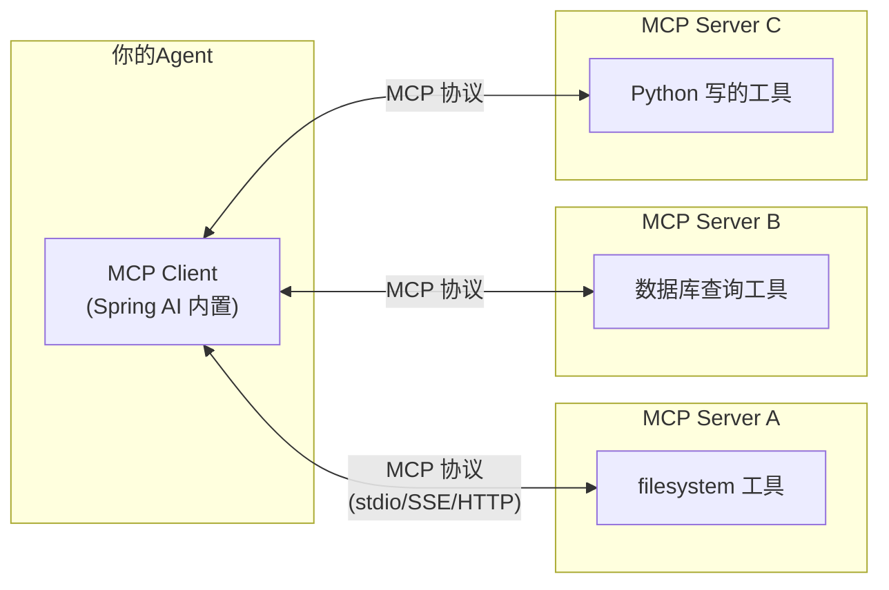

# 05 · MCP 协议入门

> 阶段：3 Agent 工程化 · 难度：⭐⭐⭐ · 预计：2 天
> 前置：[04 Prompt Injection 防御](04-PromptInjection防御.md)
> 产出：理解 MCP 协议，消费一个 MCP Server

---

## 你将学会

- MCP（Model Context Protocol）是什么，为什么它是 2026 年最重要的 Agent 协议
- MCP 三类能力：Tools / Resources / Prompts
- 在 Spring AI 中消费 MCP Server
- MCP vs 直接 @Tool 的区别

---

## 为什么需要这个

你的 `@Tool` 方法只能在本进程内使用——换一个框架（比如 LangChain4j）、换一种语言（比如 Python），就得重写。

**MCP 解决的就是这个问题**：把工具/资源/Prompt 标准化成一个协议。一次实现，任何支持 MCP 的框架都能消费。

> 来源：[行业调研](../调研/00-Agent架构师行业调研-2026.md)——MCP 是 2026 年工具接入的事实标准，也是 Agent 架构师最高 ROI 的单项投资。

---

## MCP 是什么



**类比**：MCP 之于 AI 工具，就像 USB 之于电脑外设——统一接口，即插即用。

### 三类能力

| 类型 | 作用 | 例子 |
|------|------|------|
| **Tools** | 让 LLM 执行操作 | 查数据库、发消息、读文件 |
| **Resources** | 给 LLM 提供数据 | 配置文件、文档、数据库 schema |
| **Prompts** | 预定义的 prompt 模板 | 代码评审模板、翻译模板 |

---

## 动手实践

### Step 1：消费一个现成的 MCP Server

先体验"当用户"——消费别人写好的 MCP Server：

```yaml
# application.yml —— 配置 MCP Client
spring:
  ai:
    mcp:
      client:
        stdio:
          servers:
            filesystem:
              command: npx
              args:
                - "@modelcontextprotocol/server-filesystem"
                - "/tmp/allowed-dir"
```

> 这会启动一个官方的 filesystem MCP Server，让你的 Agent 能读写指定目录。

### Step 2：在 ChatClient 中使用 MCP 工具

```java
@Bean
public ChatClient chatClient(ChatClient.Builder builder,
                              McpClient mcpClient) {
    return builder
            .defaultTools(mcpClient)  // MCP 工具自动注册
            .build();
}
```

```bash
curl "http://localhost:8080/api/chat?q=读取/tmp/allowed-dir目录下的文件列表"
# AI 会自动调用 filesystem MCP Server 的 list_files 工具
```

### Step 3：理解 MCP 的价值

```java
// 没有 MCP：每个框架的 @Tool 不互通
@Tool(description = "读文件")  // Spring AI 专用
public String readFile(String path) { ... }

// 有 MCP：写一次，处处可用
// Spring AI 的 Agent 可以调
// LangChain4j 的 Agent 可以调
// Python 的 Agent 可以调
// Claude Desktop 可以调
```

---

## 验收检查

- [ ] 能配置 MCP Client 连接一个外部 Server
- [ ] Agent 能通过 MCP 调用工具
- [ ] 能解释 MCP vs 直接 @Tool 的区别
- [ ] 理解 MCP 三类能力（Tools / Resources / Prompts）

---

## 下一步

→ 下一篇：[06 MCP Server 开发](06-MCPServer开发.md) —— 自己开发一个 MCP Server
