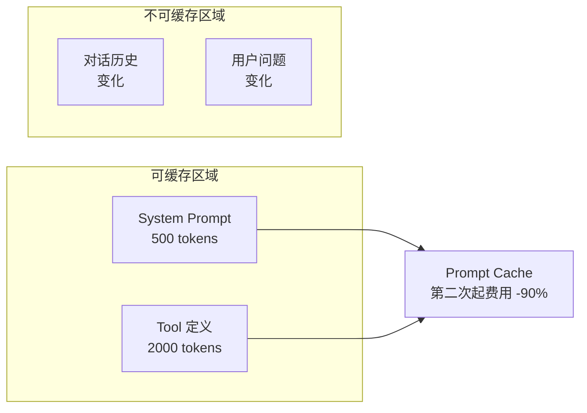

# 01 · 上下文工程（Context Engineering）

> 阶段：4 生产化 · 难度：⭐⭐⭐⭐ · 预计：2 天
> 前置：[阶段 3 完成](../阶段3-Agent工程化/08-项目P3-代码评审助手.md)
> 产出：掌握 2026 年的"新 Prompt 工程"——上下文预算、缓存优化、token 裁剪

---

## 你将学会

- 为什么 Context Engineering 正在取代 Prompt Engineering
- 上下文预算管理（把 context 当钱花）
- 四种上下文优化技术：缓存边界 / tool masking / 历史裁剪 / 语义压缩
- 用 Prompt Cache 降低 50-80% 成本

---

## 为什么需要这个

> 来源：[行业调研](../调研/00-Agent架构师行业调研-2026.md)——多个来源一致结论：**Context Engineering 是 2026 年 AI 产品的核心成本与质量学科，正在取代 Prompt Engineering。**

| 发现 | 数据 |
|------|------|
| Prompt caching 减少 API 成本 | **41-80%**（arXiv 论文） |
| 完整上下文工程可降本 | **10x**（FP8.co） |
| 长会话场景节省 | **50-80%**（ExplainX） |

**不优化上下文 = 把钱扔进垃圾桶。**

---

## 核心概念

### 1. 上下文预算（Context Budget）

每个请求的 token 是有限的（受 context window 限制），也是要花钱的。**把 token 当预算管理**：

| 组成部分 | Token 量 | 特性 |
|---------|---------|------|
| System Prompt | 500 | 固定，每次一样 ✅ 可缓存 |
| Tool 定义 | 2000 | 固定，每次一样 ✅ 可缓存 |
| 对话历史 | 3000 | 随对话增长 ❌ |
| RAG 检索结果 | 2000 | 按需变化 ❌ |
| 用户当前问题 | 50 | 变化部分 ❌ |
| **总计** | **7550** | |

**优化目标**：在不损失回答质量的前提下，减少这些 token。

### 2. 缓存边界（Cache Boundary）

如果 System Prompt + Tool 定义每次请求都一样，它们可以被**缓存**：



**关键操作**：把固定部分和变化部分的**边界划清楚**，让缓存命中。

---

## 四种优化技术

### 技术 1：Prompt Cache（最简单最有效）

```java
// Anthropic / DeepSeek 支持 prompt caching
// 把 system prompt 标记为可缓存

String systemPrompt = """
    [STATIC] 你是一个代码审查助手。
    [STATIC] 编码规范：
    - 使用驼峰命名
    - 方法不超过 50 行
    - 所有参数做非空校验
    ...（大量固定内容）
    """;

// 这部分每次一样 → 缓存命中 → 第二次起费用减少 90%
```

### 技术 2：Tool Masking（工具遮蔽）

Agent 注册了 20 个工具，但当前任务只需要 3 个。未使用的工具定义也在浪费 token：

```java
// 动态选择工具——只注册当前任务需要的
public String reviewCode(String code, String focus) {
    return switch (focus) {
        case "security" -> chatClient.prompt()
                .user(code)
                .tools(securityTools)      // 只注册安全工具
                .call().content();
        case "style" -> chatClient.prompt()
                .user(code)
                .tools(styleTools)         // 只注册风格工具
                .call().content();
        default -> chatClient.prompt()
                .user(code)
                .tools(allTools)
                .call().content();
    };
}
```

### 技术 3：对话历史裁剪

```java
// 不只按条数裁剪，还要按 token 预算裁剪
public String smartTrim(List<Message> history, int maxTokens) {
    int currentTokens = estimateTokens(history);
    if (currentTokens <= maxTokens) return history;

    // 策略：保留最近 N 条 + 第一条（system 设定）
    List<Message> result = new ArrayList<>();
    result.add(history.get(0));  // 保留 system

    // 从最后往前保留，直到达到预算
    int budget = maxTokens - estimateTokens(result);
    for (int i = history.size() - 1; i >= 1 && budget > 0; i--) {
        int msgTokens = estimateTokens(history.get(i));
        if (msgTokens <= budget) {
            result.add(1, history.get(i));  // 插入在 system 后面
            budget -= msgTokens;
        }
    }
    return result;
}
```

### 技术 4：语义压缩

用一个小模型把长历史压缩成摘要：

```java
// 对话超过 10 轮时，把前 5 轮压缩成摘要
if (history.size() > 10) {
    String oldMessages = history.subList(0, 5).stream()
            .map(Message::getText).collect(Collectors.joining("\n"));

    String summary = chatClient.prompt()
            .system("把以下对话总结成关键信息（不超过 200 字）")
            .user(oldMessages)
            .call().content();

    // 用摘要替代旧消息（从 2000 token 压缩到 ~100 token）
    history = history.subList(5, history.size());
    history.add(0, new SystemMessage(summary));
}
```

---

## 上下文优化效果对比表

| 优化技术 | 实现难度 | 成本节省 | 质量影响 | 推荐场景 |
|---------|---------|---------|---------|---------|
| Prompt Cache | ⭐ 简单 | 50-80% | 无（透明缓存） | 所有场景，**第一时间做** |
| Tool Masking | ⭐⭐ 中等 | 10-30% | 无或正面 | 工具 > 5 个时 |
| 历史裁剪 | ⭐⭐ 中等 | 20-40% | 轻微（可能丢上下文） | 长对话场景 |
| 语义压缩 | ⭐⭐⭐ 较难 | 30-50% | 中等（摘要丢失细节） | 超长对话 > 20 轮 |

> **实施顺序**：先做 Prompt Cache（ROI 最高），再做 Tool Masking，最后做历史裁剪和压缩。

---

## Token 预算估算速查

| 场景 | 推荐 token 预算 | 拆分建议 |
|------|---------------|---------|
| 简单问答 | 2,000 | System 300 + 历史 500 + 问题 200 + 回复 1000 |
| RAG 问答 | 6,000 | System 500 + 历史 1000 + 文档 2000 + 问题 200 + 回复 2300 |
| 代码评审 Agent | 15,000 | System 500 + 工具 2000 + 代码 5000 + 历史 2000 + 回复 5500 |
| 开放研究 Agent | 50,000 | System 1000 + 工具 3000 + 文档 10000 + 历史 5000 + 回复 31000 |

> DeepSeek 的 context window 是 64K（deepseek-chat），预算不能超过这个上限。

---

## 验收检查

- [ ] 理解上下文预算的概念
- [ ] 能划清缓存边界（固定 vs 变化）
- [ ] 实现了至少 2 种优化技术
- [ ] 能量化对比优化前后的 token 消耗

---

## 延伸阅读

本篇是上下文工程入门。以下文档从不同维度深化了上下文工程：

| 方向 | 文档 | 深化内容 |
|------|------|---------|
| 记忆架构 | [40-Agent记忆架构深度设计](40-Agent记忆架构深度设计.md) | 从工作记忆到长期记忆的完整架构 |
| 成本优化 | [28-LLM成本工程深入](28-LLM成本工程深入.md) | 上下文裁剪对成本的量化影响 |
| 推理加速 | [35-Agent推理加速与模型服务](35-Agent推理加速与模型服务.md) | KV Cache 复用与前缀缓存 |
| 前沿深水区 | [阶段6-Context Engineering深水区](../阶段6-前沿/02-ContextEngineering深水区.md) | 2026年最前沿的上下文工程研究 |
| 代码实战 | [项目08-CodeForge Sprint3](../项目实践/08-企业项目-代码生成平台/Sprint3-上下文工程.md) | Agent 代码生成中的上下文预算实战 |

---

## 下一步

→ 下一篇：[02 Agent 可靠性工程](02-Agent可靠性工程.md) —— 让 Agent 崩溃可恢复
