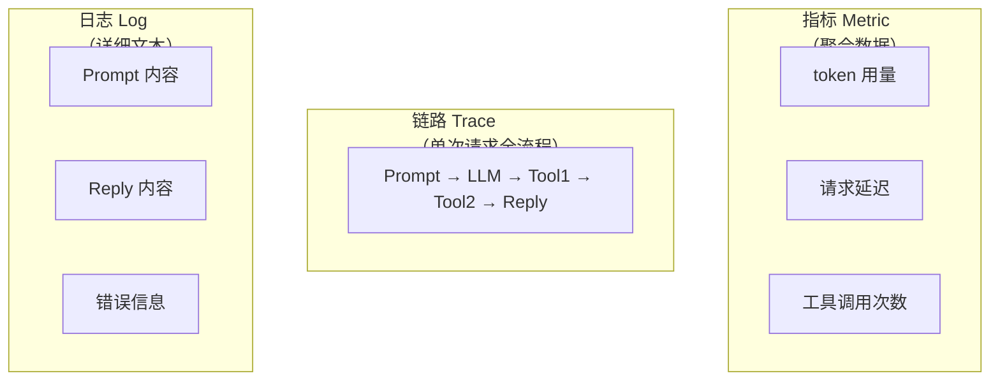

# 03 · 可观测性建设

> 阶段：4 生产化 · 难度：⭐⭐⭐⭐ · 预计：2 天
> 前置：[02 Agent 可靠性工程](02-Agent可靠性工程.md)
> 产出：搭建 AI 应用的全链路可观测性——每次调用都能追踪

---

## 你将学会

- AI 应用可观测性的三大支柱：Metric / Trace / Log
- 用 Micrometer + OpenTelemetry 打点
- 接入 Langfuse 做全链路 trace
- GenAI Semantic Conventions（行业标准指标）

---

## 为什么需要这个

AI 应用上线后你会面对这些问题：
- "用户说 AI 回答变差了，但我看不到发生了什么" → 需要 Trace
- "这个月 token 费用暴增，不知道是哪个接口的问题" → 需要 Metric
- "Agent 执行到一半出错了，哪个步骤出的问题？" → 需要步骤级 Trace

**没有可观测性的系统 = 黑箱系统，出问题只能猜。**

---

## 三大支柱



---

## 动手实践

### Step 1：Micrometer 指标打点

```java
@Component
public class AiMetrics {
    private final MeterRegistry registry;

    public AiMetrics(MeterRegistry registry) {
        this.registry = registry;
    }

    public void recordTokenUsage(String model, long inputTokens, long outputTokens) {
        // GenAI Semantic Conventions 标准指标名
        registry.counter("gen_ai.client.token.usage",
            "model", model, "type", "input").increment(inputTokens);
        registry.counter("gen_ai.client.token.usage",
            "model", model, "type", "output").increment(outputTokens);
    }

    public Timer.StartSample startRequest() {
        return Timer.start(registry);
    }

    public void recordLatency(Timer.StartSample sample, String model) {
        sample.stop(Timer.builder("gen_ai.client.operation")
            .tag("model", model).tag("operation", "chat")
            .register(registry));
    }
}
```

### Step 2：接入 Langfuse（AI 专用可观测平台）

```java
// Langfuse 可以记录每次 LLM 调用的完整 prompt + reply + token
@Component
public class LangfuseAdvisor implements BaseAdvisor {

    @Override
    public ChatClientRequest before(ChatClientRequest request) {
        // 记录 trace 开始
        return request;
    }

    @Override
    public ChatClientResponse after(ChatClientResponse response) {
        // 上传到 Langfuse：prompt + reply + token + 延迟
        // ...
        return response;
    }
}
```

### Step 3：步骤级 Trace（Agent 执行过程可视化）

```java
// 每个 Advisor / Tool 都加 trace span
@Tool(description = "查询用户")
@Observed(name = "tool.getUser", contextualName = "tool-call")
public String getUser(Long id) {
    // OpenTelemetry 会自动生成一个 span
    // 在 Langfuse/Jaeger 中可以看到完整的 Agent 执行链路
    return userDao.findById(id).toString();
}
```

---

## GenAI Semantic Conventions 速查

> OpenTelemetry 社区为 GenAI 定义的标准指标/标签。用标准命名才能跨工具复用。

| 指标/标签 | 含义 | 示例值 |
|----------|------|--------|
| `gen_ai.system` | LLM 提供商 | `deepseek` / `openai` |
| `gen_ai.request.model` | 模型名 | `deepseek-chat` |
| `gen_ai.operation.name` | 操作类型 | `chat` / `embedding` |
| `gen_ai.usage.input_tokens` | 输入 token | `1500` |
| `gen_ai.usage.output_tokens` | 输出 token | `800` |
| `gen_ai.tool.name` | 工具名 | `getUserById` |
| `gen_ai.response.finish_reason` | 结束原因 | `stop` / `tool_calls` |

> 用标准命名的好处：Langfuse、Jaeger、Grafana 等平台都能自动识别。

---

## 生产环境可观测性指标看板清单

```
实时看板（Grafana / Langfuse Dashboard）
├── 成本面板
│   ├── 每小时 token 消耗（按模型分）
│   ├── 每小时费用（¥/h）
│   └── 费用趋势（对比上周）
├── 性能面板
│   ├── P50/P95/P99 延迟
│   ├── 工具调用延迟分布
│   └── 流式首 token 延迟（TTFT）
├── 质量面板
│   ├── 工具调用成功率
│   ├── Agent 任务完成率
│   └── 用户反馈分数（👍/👎）
└── 告警
    ├── token 费用 > 预算阈值 → 告警
    ├── 错误率 > 5% → 告警
    └── P95 延迟 > 10s → 告警
```

---

## 验收检查

- [ ] 有 token 用量指标（按模型/类型区分）
- [ ] 有请求延迟指标
- [ ] 能在可观测平台看到单次请求的完整链路
- [ ] 能看到 Agent 的每个工具调用步骤
- [ ] 有告警规则（费用/错误率/延迟）

---

## 延伸阅读

本篇是可观测性入门。以下文档从不同维度深化可观测性：

| 方向 | 文档 | 深化内容 |
|------|------|---------|
| MELT 框架 | [16-Agent可观测性MELT](16-Agent可观测性MELT.md) | Metrics/Events/Logs/Traces 四维详解 |
| SLO 管理 | [36-Agent SLO管理](36-AgentSLO管理.md) | AI 系统的 SLO 设计与错误预算 |
| 调试方法论 | [阶段5-11-Agent调试与根因分析](../阶段5-架构师/11-Agent调试与根因分析.md) | Trace Replay 与 Diff-based 调试 |
| 底层速成 | [附录-可观测性速成](../附录/可观测性速成.md) | OpenTelemetry/Prometheus/Grafana 速查 |
| 事故响应 | [38-Agent事故响应与变更管理](38-Agent事故响应与变更管理.md) | Agent 事故分类与应急响应 |

---

## 下一步

→ 下一篇：[04 成本工程](04-成本工程.md)
