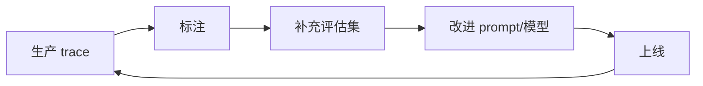
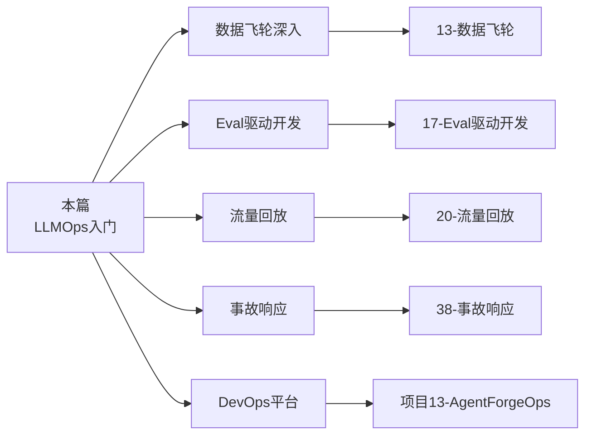

# 06 · LLMOps 与 CICD

> 阶段：4 生产化 · 难度：⭐⭐⭐⭐ · 预计：2 天
> 前置：[05 测试工程化](05-测试工程化.md)
> 产出：CI 集成评估 + 数据飞轮 + A/B 测试

---

## 你将学会

- CI/CD 集成评估（改 prompt 自动跑评估集）
- 数据飞轮（生产 trace → 标注 → 评估集 → 改进）
- A/B 测试方法论（线上分流 + 显著性检验）

---

## CI 集成评估

```yaml
# .github/workflows/eval.yml（或 GitLab CI）
name: LLM Eval Gate
on: [pull_request]

jobs:
  eval:
    steps:
      - name: 跑评估集
        run: |
          # 改了 prompt 或模型 → 跑评估
          # 指标不退化才能合并
          java -jar eval-runner.jar --threshold recall=0.80,faith=0.75
```

**原则**：**改 prompt 不跑评估 = 禁止合并**。

---

## 数据飞轮



> 评估集不是一次性的——它是**活的**，从生产中不断学习。

---

## 验收检查

- [ ] CI 流水线集成评估（PR 合并前跑评估集）
- [ ] 有数据飞轮设计（trace → 标注 → 评估）
- [ ] 理解 A/B 测试方法论

---

## 下一步

→ 下一篇：[07 项目 P4 运维 Agent](07-项目P4-运维Agent.md)

---

## 延伸阅读：LLMOps 深化路线

本篇是 LLMOps 入门。以下文档从不同维度深化 LLMOps 实践：



| 方向 | 文档 | 内容 |
|------|------|------|
| 数据飞轮 | [13-数据飞轮与持续改进](13-数据飞轮与持续改进.md) | MAPE 控制环 |
| Eval 驱动 | [17-Eval驱动开发](17-Eval驱动开发.md) | AI 测试金字塔 |
| 流量回放 | [20-流量回放与影子模式](20-流量回放与影子模式.md) | 安全发布 |
| SLO 管理 | [36-SLO管理](36-AgentSLO管理.md) | AI-SLO 指标体系 |
| 事故响应 | [38-事故响应与变更管理](38-Agent事故响应与变更管理.md) | Agent 事故分类 |
| DevOps 实战 | [项目13-AgentForgeOps](../项目实践/13-企业项目-AgentDevOps平台/00-总览.md) | 全生命周期 DevOps |
| LLMOps 理论 | [理论字典-LLMOps](../理论字典/LLMOps.md) | MLOps vs LLMOps 对比 |
| GitOps | [附录-GitOps与ArgoCD速成](../附录/GitOps与ArgoCD速成.md) | Argo CD 灰度发布 |
