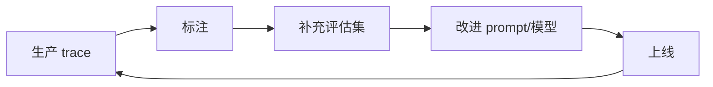

# 06 · LLMOps 与 CICD

> 阶段：4 生产化 · 难度：⭐⭐⭐⭐ · 预计：2 天
> 前置：[05 测试工程化](05-测试工程化.md)
> 产出：CI 集成评估 + 数据飞轮 + A/B 测试

---

## 你将学会

- CI/CD 集成评估（改 prompt 自动跑评估集）
- 数据飞轮（生产 trace → 标注 → 评估集 → 改进）
- A/B 测试方法论（线上分流 + 显著性检验）

---

## CI 集成评估

```yaml
# .github/workflows/eval.yml（或 GitLab CI）
name: LLM Eval Gate
on: [pull_request]

jobs:
  eval:
    steps:
      - name: 跑评估集
        run: |
          # 改了 prompt 或模型 → 跑评估
          # 指标不退化才能合并
          java -jar eval-runner.jar --threshold recall=0.80,faith=0.75
```

**原则**：**改 prompt 不跑评估 = 禁止合并**。

---

## 数据飞轮



> 评估集不是一次性的——它是**活的**，从生产中不断学习。

---

## 验收检查

- [ ] CI 流水线集成评估（PR 合并前跑评估集）
- [ ] 有数据飞轮设计（trace → 标注 → 评估）
- [ ] 理解 A/B 测试方法论

---

## 下一步

→ 下一篇：[07 项目 P4 运维 Agent](07-项目P4-运维Agent.md)
