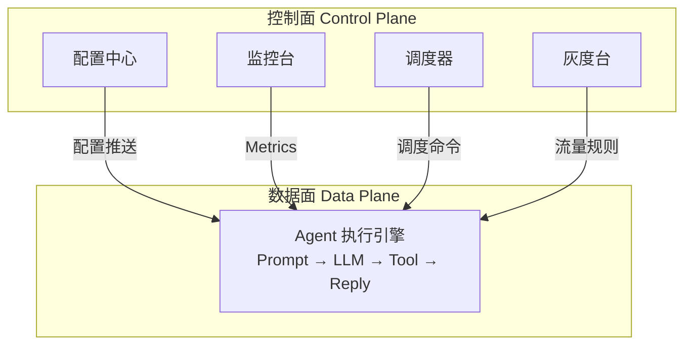
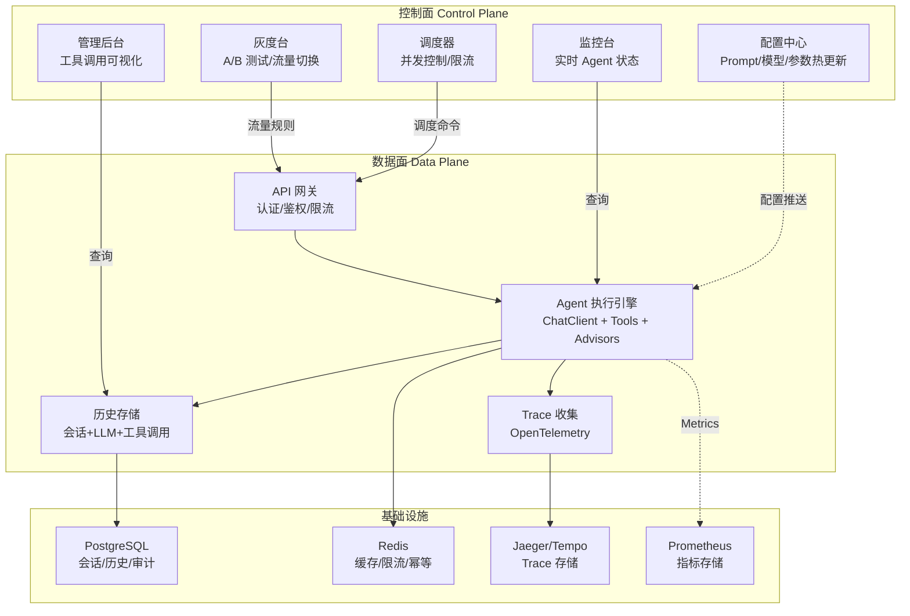

# 08 · 管控分离架构（补充篇）

> 阶段：4 生产化 · 难度：⭐⭐⭐⭐⭐ · 预计：2-3 天
> 前置：[07 项目 P4 运维 Agent](07-项目P4-运维Agent.md)
> 产出：掌握 Agent 系统的管控分离架构设计

---

## 为什么需要管控分离

企业级 Agent 系统和单体应用最大的区别：**控制面和数据面必须分离**。

传统应用：一个进程处理一切。Agent 平台：控制面管配置/监控/调度，数据面管执行。



| 维度 | 控制面 | 数据面 |
|------|-------|-------|
| 职责 | 管理、配置、监控、调度 | 执行 Agent 任务 |
| 变更频率 | 频繁（调参数、改 Prompt） | 不变（代码逻辑稳定） |
| 可用性要求 | 中（管理台宕机不影响用户） | 极高（用户直接依赖） |
| 性能要求 | 低（管理员用） | 高（响应用户请求） |
| 部署方式 | 可独立部署 | 大规模水平扩展 |

---

## 管控分离的五大支柱

### 支柱一：配置中心（动态配置不重启）

```java
package com.example.platform.config;

import org.springframework.cloud.context.config.annotation.RefreshScope;
import org.springframework.stereotype.Component;

/**
 * Agent 动态配置——从配置中心读取，支持热更新
 *
 * 没有 配置中心时：
 *   - 改 system prompt 要重启服务
 *   - 调模型参数要改代码
 *   - 切换模型要重新部署
 *
 * 有配置中心后：
 *   - 管理台改配置 → Agent 热更新
 *   - 用户无感知
 */
@RefreshScope
@Component
public class AgentConfig {

    // === Prompt 配置 ===
    private volatile String systemPrompt;
    private volatile String reviewerPrompt;

    // === 模型配置 ===
    private volatile String modelName = "deepseek-chat";
    private volatile double temperature = 0.7;
    private volatile int maxTokens = 2000;

    // === 工具配置 ===
    private volatile boolean enableSearchTool = true;
    private volatile boolean enableTicketTool = true;

    // === 防护配置 ===
    private volatile int maxTurns = 20;
    private volatile double budgetLimit = 0.5; // USD per session

    // === 特性开关 ===
    private volatile boolean enableCache = true;
    private volatile boolean enableMultiAgent = false;

    // Getters with defensive copies
    public String getSystemPrompt() { return systemPrompt; }
    public int getMaxTurns() { return maxTurns; }
    public double getBudgetLimit() { return budgetLimit; }
    public String getModelName() { return modelName; }
    public double getTemperature() { return temperature; }
    public boolean isEnableCache() { return enableCache; }
    public boolean isEnableMultiAgent() { return enableMultiAgent; }
    public boolean isEnableSearchTool() { return enableSearchTool; }
}
```

### 支柱二：Agent 调度器

```java
package com.example.platform.scheduler;

import org.springframework.stereotype.Component;
import java.util.*;
import java.util.concurrent.*;

/**
 * Agent 调度器——控制面核心
 *
 * 职责：
 * - 接收用户请求，路由到合适的 Agent
 * - 控制 Agent 并发数（防止资源耗尽）
 * - 管理 Agent 生命周期
 * - 限流与背压
 */
@Component
public class AgentScheduler {

    // 每个租户最大并发 Agent 数
    private final Map<String, Semaphore> tenantConcurrency = new ConcurrentHashMap<>();
    private final int maxConcurrentPerTenant = 10;

    // Agent 实例池
    private final Map<String, AgentInstance> activeAgents = new ConcurrentHashMap<>();

    /**
     * 调度一个 Agent 任务
     */
    public CompletableFuture<String> schedule(AgentTask task) {
        // 1. 获取租户并发许可
        Semaphore sem = tenantConcurrency.computeIfAbsent(
            task.tenantId(),
            k -> new Semaphore(maxConcurrentPerTenant)
        );

        if (!sem.tryAcquire()) {
            return CompletableFuture.failedFuture(
                new RuntimeException("并发数超限，请稍后重试")
            );
        }

        // 2. 创建 Agent 实例
        String agentId = UUID.randomUUID().toString();
        AgentInstance agent = new AgentInstance(agentId, task);
        activeAgents.put(agentId, agent);

        // 3. 异步执行
        return agent.execute()
            .whenComplete((result, error) -> {
                sem.release();
                activeAgents.remove(agentId);
            });
    }

    /**
     * 获取所有活跃 Agent 状态（监控台用）
     */
    public List<AgentStatus> getActiveAgents() {
        return activeAgents.values().stream()
            .map(AgentInstance::getStatus)
            .toList();
    }

    /**
     * 终止一个 Agent（管理员操作）
     */
    public boolean terminate(String agentId) {
        AgentInstance agent = activeAgents.get(agentId);
        if (agent != null) {
            agent.terminate();
            return true;
        }
        return false;
    }

    public record AgentTask(String tenantId, String userId, String instruction,
                            Map<String, Object> params) {}
}
```

### 支柱三：历史记录持久化

```java
package com.example.platform.history;

import org.springframework.jdbc.core.JdbcTemplate;
import org.springframework.stereotype.Component;
import java.time.Instant;
import java.util.*;

/**
 * 历史记录持久化——完整的会话+工具调用+LLM调用存储
 *
 * 企业级设计要点：
 * 1. 三层存储：会话 → 消息 → 步骤（工具调用）
 * 2. 支持回放（从历史重建对话）
 * 3. 支持审计（谁在什么时候做了什么）
 * 4. 支持分析（统计工具使用频率、LLM 调用成本）
 */
@Component
public class HistoryPersistenceService {

    private final JdbcTemplate jdbc;

    /**
     * 记录一次完整的 Agent 步骤（含 LLM 调用和工具调用）
     *
     * 一个 "步骤" = 一次 LLM 调用 + 可能的工具调用 + 工具结果
     */
    public void recordStep(AgentStep step) {
        // 1. 记录 LLM 调用
        jdbc.update("""
            INSERT INTO agent_llm_calls
                (step_id, session_id, model, system_prompt_hash, user_message,
                 assistant_response, prompt_tokens, completion_tokens, latency_ms, cost_usd, created_at)
            VALUES (?, ?, ?, ?, ?, ?, ?, ?, ?, ?, ?)
            """,
            step.stepId(), step.sessionId(), step.model(),
            step.systemPromptHash(), step.userMessage(),
            step.assistantResponse(),
            step.promptTokens(), step.completionTokens(),
            step.latencyMs(), step.costUsd(),
            Instant.now()
        );

        // 2. 记录工具调用（如果有）
        for (ToolInvocation invocation : step.toolInvocations()) {
            jdbc.update("""
                INSERT INTO agent_tool_calls
                    (step_id, session_id, tool_name, input_params, output_result,
                     success, latency_ms, created_at)
                VALUES (?, ?, ?, ?::jsonb, ?::jsonb, ?, ?, ?)
                """,
                step.stepId(), step.sessionId(),
                invocation.toolName(), invocation.inputJson(),
                invocation.outputJson(), invocation.success(),
                invocation.latencyMs(), Instant.now()
            );
        }
    }

    /**
     * 查询会话的完整历史（支持回放）
     */
    public SessionHistory getSessionHistory(String sessionId) {
        // 查所有步骤
        List<Map<String, Object>> steps = jdbc.queryForList(
            "SELECT * FROM agent_llm_calls WHERE session_id = ? ORDER BY created_at",
            sessionId
        );

        // 查所有工具调用
        List<Map<String, Object>> toolCalls = jdbc.queryForList(
            "SELECT * FROM agent_tool_calls WHERE session_id = ? ORDER BY created_at",
            sessionId
        );

        return new SessionHistory(sessionId, steps, toolCalls);
    }

    /**
     * 查询工具使用统计（分析用）
     */
    public List<ToolUsageStat> getToolUsageStats(String tenantId, int days) {
        return jdbc.query("""
            SELECT tool_name,
                   COUNT(*) as call_count,
                   AVG(latency_ms) as avg_latency,
                   SUM(CASE WHEN success THEN 1 ELSE 0 END)::float / COUNT(*) as success_rate
            FROM agent_tool_calls
            WHERE session_id IN (SELECT session_id FROM sessions WHERE tenant_id = ?)
              AND created_at > NOW() - INTERVAL '%d days'
            GROUP BY tool_name
            ORDER BY call_count DESC
            """.formatted(days),
            (rs, rowNum) -> new ToolUsageStat(
                rs.getString("tool_name"),
                rs.getLong("call_count"),
                rs.getDouble("avg_latency"),
                rs.getDouble("success_rate")
            ),
            tenantId
        );
    }

    // Records
    public record AgentStep(
        String stepId, String sessionId, String model,
        String systemPromptHash(), String userMessage(),
        String assistantResponse(),
        int promptTokens, int completionTokens,
        long latencyMs, double costUsd,
        List<ToolInvocation> toolInvocations
    ) {}

    public record ToolInvocation(
        String toolName, String inputJson, String outputJson,
        boolean success, long latencyMs
    ) {}

    public record SessionHistory(
        String sessionId,
        List<Map<String, Object>> llmCalls,
        List<Map<String, Object>> toolCalls
    ) {}

    public record ToolUsageStat(
        String toolName, long callCount, double avgLatency, double successRate
    ) {}
}
```

**DDL（数据表设计）**：

```sql
-- 会话表
CREATE TABLE sessions (
    id           VARCHAR(64) PRIMARY KEY,
    tenant_id    VARCHAR(64) NOT NULL,
    user_id      VARCHAR(64) NOT NULL,
    status       VARCHAR(16) DEFAULT 'ACTIVE', -- ACTIVE/CLOSED/ERROR
    created_at   TIMESTAMPTZ DEFAULT NOW(),
    closed_at    TIMESTAMPTZ,
    metadata     JSONB
);
CREATE INDEX idx_sessions_tenant ON sessions(tenant_id);
CREATE INDEX idx_sessions_user ON sessions(user_id);

-- LLM 调用记录（每个 Agent 步骤一条）
CREATE TABLE agent_llm_calls (
    id                  BIGSERIAL PRIMARY KEY,
    step_id             VARCHAR(64) NOT NULL,
    session_id          VARCHAR(64) NOT NULL REFERENCES sessions(id),
    model               VARCHAR(64),
    system_prompt_hash  VARCHAR(64),     -- 不存全文（省空间），存 hash
    user_message        TEXT,            -- 用户消息原文
    assistant_response  TEXT,            -- AI 回复原文
    prompt_tokens       INT,
    completion_tokens   INT,
    latency_ms          BIGINT,
    cost_usd            DECIMAL(10,6),
    created_at          TIMESTAMPTZ DEFAULT NOW()
);
CREATE INDEX idx_llm_calls_session ON agent_llm_calls(session_id);
CREATE INDEX idx_llm_calls_created ON agent_llm_calls(created_at DESC);

-- 工具调用记录（一次 LLM 调用可能触发多个工具调用）
CREATE TABLE agent_tool_calls (
    id            BIGSERIAL PRIMARY KEY,
    step_id       VARCHAR(64) NOT NULL,
    session_id    VARCHAR(64) NOT NULL REFERENCES sessions(id),
    tool_name     VARCHAR(64) NOT NULL,
    input_params  JSONB,           -- 工具输入参数
    output_result JSONB,           -- 工具返回结果
    success       BOOLEAN DEFAULT TRUE,
    latency_ms    BIGINT,
    created_at    TIMESTAMPTZ DEFAULT NOW()
);
CREATE INDEX idx_tool_calls_session ON agent_tool_calls(session_id);
CREATE INDEX idx_tool_calls_name ON agent_tool_calls(tool_name);
CREATE INDEX idx_tool_calls_created ON agent_tool_calls(created_at DESC);
```

### 支柱四：工具调用可视化

```java
package com.example.platform.visualization;

import org.springframework.stereotype.Component;
import java.util.*;

/**
 * 工具调用可视化数据生成
 *
 * 把 Agent 的执行过程转化为可视化的时间线：
 *
 * 时间线：
 * ┌─────────────────────────────────────────────────┐
 * │ [0.0s] 用户: "查一下我的订单状态"                │
 * │   ↓                                             │
 * │ [0.1s] LLM 调用 (deepseek-chat)                 │
 * │   ├── prompt_tokens: 350                        │
 * │   ├── 决策: 调用 searchOrder 工具               │
 * │   └── latency: 800ms                            │
 * │   ↓                                             │
 * │ [0.9s] 工具调用: searchOrder(userId="U123")     │
 * │   ├── 结果: 找到 3 条订单                       │
 * │   ├── latency: 120ms                            │
 * │   └── ✅ 成功                                   │
 * │   ↓                                             │
 * │ [1.0s] LLM 调用 (deepseek-chat)                 │
 * │   ├── prompt_tokens: 580                        │
 * │   ├── 决策: 生成最终回复                        │
 * │   └── latency: 600ms                            │
 * │   ↓                                             │
 * │ [1.6s] AI: "您有 3 条订单..."                   │
 * └─────────────────────────────────────────────────┘
 */
@Component
public class ToolCallVisualizer {

    /**
     * 生成时间线数据（前端可视化用）
     */
    public Timeline buildTimeline(String sessionId) {
        SessionHistory history = historyService.getSessionHistory(sessionId);

        List<TimelineEvent> events = new ArrayList<>();

        // 把 LLM 调用和工具调用合并为时间线
        for (var llmCall : history.llmCalls()) {
            events.add(new TimelineEvent(
                TimelineEventType.LLM_CALL,
                (String) llmCall.get("created_at"),
                Map.of(
                    "model", llmCall.get("model"),
                    "promptTokens", llmCall.get("prompt_tokens"),
                    "completionTokens", llmCall.get("completion_tokens"),
                    "latencyMs", llmCall.get("latency_ms"),
                    "costUsd", llmCall.get("cost_usd")
                )
            ));

            // 找这个 step 关联的工具调用
            String stepId = (String) llmCall.get("step_id");
            history.toolCalls().stream()
                .filter(tc -> stepId.equals(tc.get("step_id")))
                .forEach(tc -> events.add(new TimelineEvent(
                    TimelineEventType.TOOL_CALL,
                    (String) tc.get("created_at"),
                    Map.of(
                        "toolName", tc.get("tool_name"),
                        "input", tc.get("input_params"),
                        "output", tc.get("output_result"),
                        "success", tc.get("success"),
                        "latencyMs", tc.get("latency_ms")
                    )
                )));
        }

        return new Timeline(sessionId, events);
    }

    /**
     * 生成调用链路图（Mermaid 格式）
     */
    public String buildCallGraph(String sessionId) {
        var history = historyService.getSessionHistory(sessionId);

        var sb = new StringBuilder();
        sb.append("flowchart TD\n");
        sb.append("    User[\"👤 用户\"]\n");

        for (int i = 0; i < history.llmCalls().size(); i++) {
            var call = history.llmCalls().get(i);
            sb.append("    LLM").append(i).append("[\"🤖 LLM 调用 #")
              .append(i + 1).append("<br/>").append(call.get("model"))
              .append("<br/>").append(call.get("prompt_tokens")).append(" tokens\"]\n");

            if (i == 0) {
                sb.append("    User --> LLM0\n");
            } else {
                sb.append("    LLM").append(i - 1).append(" --> LLM").append(i).append("\n");
            }

            // 关联的工具调用
            String stepId = (String) call.get("step_id");
            history.toolCalls().stream()
                .filter(tc -> stepId.equals(tc.get("step_id")))
                .forEach(tc -> {
                    String toolNode = "Tool_" + stepId + "_" + tc.get("tool_name");
                    sb.append("    ").append(toolNode).append("[\"🔧 ")
                      .append(tc.get("tool_name"))
                      .append(tc.get("success").equals(true) ? " ✅" : " ❌")
                      .append("\"]\n");
                    sb.append("    LLM").append(i).append(" --> ").append(toolNode)
                      .append(" --> LLM").append(i).append("\n");
                });
        }

        return sb.toString();
    }

    public record Timeline(String sessionId, List<TimelineEvent> events) {}
    public record TimelineEvent(TimelineEventType type, String timestamp, Map<String, Object> data) {}
    public enum TimelineEventType {
        USER_MESSAGE, LLM_CALL, TOOL_CALL, AI_RESPONSE, ERROR
    }
}
```

### 支柱五：Trace 全链路可追溯

```java
package com.example.platform.trace;

import io.opentelemetry.api.trace.Span;
import io.opentelemetry.api.trace.Tracer;
import org.springframework.stereotype.Component;

/**
 * 全链路 Trace——从用户请求到每一步 LLM/工具调用
 *
 * 使用 OpenTelemetry 标准，接入 Jaeger/Tempo/Zipkin
 *
 * Trace 结构：
 * ┌─ user_request (root span)
 * │  ├─ agent_loop
 * │  │  ├─ llm_call #1
 * │  │  │  ├─ tool: searchOrder
 * │  │  │  └─ tool: getProfile
 * │  │  ├─ llm_call #2
 * │  │  └─ llm_call #3
 * │  └─ response_sent
 */
@Component
public class AgentTracer {

    private final Tracer tracer;

    /**
     * 开始一个完整的 Agent 请求 Trace
     */
    public Span startAgentTrace(String sessionId, String userId, String tenantId) {
        Span span = tracer.spanBuilder("agent.request")
            .setAttribute("session.id", sessionId)
            .setAttribute("user.id", userId)
            .setAttribute("tenant.id", tenantId)
            .setAttribute("gen_ai.system", "spring-ai")
            .setAttribute("gen_ai.operation.name", "agent")
            .startSpan();
        return span;
    }

    /**
     * 记录 LLM 调用 Span
     */
    public Span startLlmCallSpan(Span parentSpan, String model, int turn) {
        Span span = tracer.spanBuilder("llm.call")
            .setParent(io.opentelemetry.context.Context.current().with(parentSpan))
            .setAttribute("gen_ai.request.model", model)
            .setAttribute("gen_ai.operation.name", "chat")
            .setAttribute("agent.turn", turn)
            .startSpan();
        return span;
    }

    /**
     * 记录 LLM 调用结果
     */
    public void recordLlmResult(Span span, int promptTokens, int completionTokens,
                                 long latencyMs, double cost) {
        span.setAttribute("gen_ai.usage.prompt_tokens", promptTokens);
        span.setAttribute("gen_ai.usage.completion_tokens", completionTokens);
        span.setAttribute("latency_ms", latencyMs);
        span.setAttribute("cost_usd", cost);
        span.end();
    }

    /**
     * 记录工具调用 Span
     */
    public Span startToolCallSpan(Span parentSpan, String toolName) {
        return tracer.spanBuilder("tool." + toolName)
            .setParent(io.opentelemetry.context.Context.current().with(parentSpan))
            .setAttribute("tool.name", toolName)
            .startSpan();
    }

    /**
     * 记录工具调用结果
     */
    public void recordToolResult(Span span, boolean success, long latencyMs) {
        span.setAttribute("tool.success", success);
        span.setAttribute("latency_ms", latencyMs);
        if (!success) {
            span.recordException(new RuntimeException("Tool execution failed"));
        }
        span.end();
    }
}
```

---

## 管控分离架构完整图



---

## 验收检查

- [ ] 理解控制面和数据面分离的必要性
- [ ] 能实现动态配置中心（不重启更新 Prompt/参数）
- [ ] 能实现 Agent 调度器（并发控制/限流）
- [ ] 能实现三层历史记录持久化（会话→LLM调用→工具调用）
- [ ] 能实现工具调用时间线可视化
- [ ] 能实现全链路 Trace（OpenTelemetry 标准属性）

---

## 下一步

→ 下一篇：[09 Agent 配置中心](09-Agent配置中心.md)
