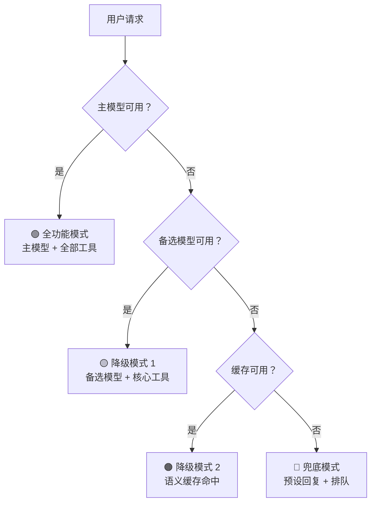

# 11 · 多模型故障切换与渐进降级（补充篇）

> 阶段：4 生产化 · 难度：⭐⭐⭐⭐ · 预计：2 天
> 前置：[10 Saga 补偿事务](10-Saga补偿事务.md)
> 产出：掌握多模型故障切换、级联降级、Agent 故障隔离

> 来源：[Sierra AI Multi-Model Router](https://sierra.ai/blog/model-failover) | [Zylos 降级模式研究](https://zylos.ai/research/2026-02-20-graceful-degradation-ai-agent-systems/)

---

## 为什么需要故障切换

研究数据显示：**多 Agent 系统在生产中无容错设计的失败率高达 41-86.7%**。核心问题：

| 故障类型 | 发生频率 | 无故障切换的后果 |
|---------|---------|----------------|
| LLM Provider 超时 | 每天 1-5 次 | 用户等 60 秒后看到 500 错误 |
| LLM Provider 限流（429） | 高峰期频繁 | 服务不可用 |
| LLM Provider 区域宕机 | 每月 1-2 次 | 全站不可用 |
| 模型输出质量下降 | 版本升级时 | 用户投诉但系统显示"正常" |
| 单个 Agent 死循环 | 偶发 | 消耗大量 Token 但无产出 |

---

## Multi-Model Router（多模型路由器）

### 核心设计（借鉴 Sierra AI）

```java
package com.example.failover;

import org.springframework.ai.chat.client.ChatClient;
import org.springframework.stereotype.Component;
import java.util.*;

/**
 * 多模型路由器
 *
 * 借鉴 Sierra AI 的 Multi-Model Router（MMR）：
 * 1. 为每个任务定义一个有序的模型列表
 * 2. 主模型失败时自动切换到备选模型
 * 3. 切换是"受控的"——确保输出质量不因模型切换而降低
 */
@Component
public class MultiModelRouter {

    // 模型健康状态（熔断器集成）
    private final Map<String, ModelHealth> modelHealth = new ConcurrentHashMap<>();

    // 任务→模型优先级列表
    private final Map<String, List<ModelConfig>> taskModels = Map.of(
        "chat", List.of(
            new ModelConfig("deepseek-chat", 0.7, 2000, 10),     // 主模型
            new ModelConfig("deepseek-reasoner", 0.7, 2000, 15), // 备选1
            new ModelConfig("gpt-4o-mini", 0.7, 2000, 30)        // 备选2
        ),
        "code", List.of(
            new ModelConfig("deepseek-coder", 0.1, 4000, 10),
            new ModelConfig("deepseek-chat", 0.1, 4000, 10)
        ),
        "summary", List.of(
            new ModelConfig("deepseek-chat", 0.0, 500, 5),
            new ModelConfig("gpt-4o-mini", 0.0, 500, 15)
        )
    );

    /**
     * 执行 LLM 调用，自动故障切换
     */
    public RouterResult call(String task, String prompt) {
        List<ModelConfig> models = taskModels.getOrDefault(task,
            taskModels.get("chat"));

        Exception lastError = null;

        for (ModelConfig model : models) {
            // 检查模型健康
            ModelHealth health = modelHealth.computeIfAbsent(
                model.name(), k -> ModelHealth.healthy());

            if (!health.isAvailable()) {
                continue; // 跳过不健康的模型
            }

            try {
                long start = System.currentTimeMillis();
                String result = doCall(model, prompt);
                long latency = System.currentTimeMillis() - start;

                // 标记成功
                modelHealth.get(model.name()).recordSuccess(latency);

                return new RouterResult(
                    result, model.name(), latency, models.indexOf(model) == 0
                );

            } catch (RateLimitException e) {
                // 429 → 标记限流，短暂不可用
                modelHealth.get(model.name()).markRateLimited(60); // 60 秒
                lastError = e;
                continue; // 切换到下一个模型

            } catch (TimeoutException e) {
                // 超时 → 标记不稳定
                modelHealth.get(model.name()).recordTimeout();
                lastError = e;
                continue;

            } catch (Exception e) {
                modelHealth.get(model.name()).recordError();
                lastError = e;
                continue;
            }
        }

        // 所有模型都失败了
        throw new AllModelsFailedException(
            "所有模型均不可用。最后错误：" + lastError.getMessage(), lastError);
    }

    private String doCall(ModelConfig model, String prompt) {
        // 实际调用逻辑
    }

    public record ModelConfig(
        String name, double temperature, int maxTokens, int timeoutSeconds
    ) {}

    public record RouterResult(
        String content, String modelUsed, long latencyMs, boolean primaryModel
    ) {
        /** 是否发生了故障切换 */
        public boolean failedOver() { return !primaryModel; }
    }

    /**
     * 模型健康状态（基于断路器模式）
     */
    public static class ModelHealth {
        private boolean available = true;
        private int consecutiveFailures = 0;
        private long unavailableUntil = 0;
        private final List<Long> recentLatencies = new ArrayList<>();

        public boolean isAvailable() {
            if (!available && System.currentTimeMillis() > unavailableUntil) {
                available = true; // 恢复
                consecutiveFailures = 0;
            }
            return available;
        }

        public void recordSuccess(long latencyMs) {
            consecutiveFailures = 0;
            available = true;
            recentLatencies.add(latencyMs);
            if (recentLatencies.size() > 100) recentLatencies.remove(0);
        }

        public void recordError() {
            consecutiveFailures++;
            if (consecutiveFailures >= 3) {
                available = false;
                unavailableUntil = System.currentTimeMillis() + 30000; // 30 秒后重试
            }
        }

        public void recordTimeout() { recordError(); }

        public void markRateLimited(int seconds) {
            available = false;
            unavailableUntil = System.currentTimeMillis() + seconds * 1000L;
        }
    }
}
```

---

## 渐进降级（Graceful Degradation）

### 三级降级策略



```java
package com.example.failover;

import org.springframework.stereotype.Component;

/**
 * 渐进降级管理器
 *
 * 研究表明：多 Agent 系统在生产中失败率 41-86.7%。
 * 渐进降级是把这个数字降到 < 1% 的关键。
 */
@Component
public class GracefulDegradationManager {

    private final MultiModelRouter modelRouter;
    private final SemanticCache semanticCache;
    private final ToolRegistry toolRegistry;

    /**
     * 执行请求，渐进降级
     */
    public DegradationResult execute(String task, String prompt, String sessionId) {
        // Level 0: 全功能模式
        try {
            var result = modelRouter.call(task, prompt);
            if (result.primaryModel()) {
                return DegradationResult.full(result);
            } else {
                // 主模型故障切换了——降级到 Level 1
                return DegradationResult.degradedLevel1(result);
            }
        } catch (AllModelsFailedException e) {
            // 所有模型都不可用
        }

        // Level 2: 语义缓存兜底
        String cached = semanticCache.lookup(prompt);
        if (cached != null) {
            return DegradationResult.degradedLevel2(cached);
        }

        // Level 3: 预设回复 + 排队
        return DegradationResult.fallback(
            "系统暂时繁忙，您的请求已加入队列，稍后会通过通知告知您结果。",
            queueForRetry(task, prompt, sessionId)
        );
    }

    /**
     * 工具降级——非核心工具不可用时，用核心工具继续
     */
    public Object[] getToolsForDegradationLevel(DegradationLevel level) {
        return switch (level) {
            case FULL -> toolRegistry.getEnabledTools();          // 全部工具
            case DEGRADED_L1 -> toolRegistry.getCoreTools();      // 核心工具
            case DEGRADED_L2 -> new Object[0];                    // 无工具（纯文本回复）
            case FALLBACK -> new Object[0];                       // 无工具
        };
    }

    private String queueForRetry(String task, String prompt, String sessionId) {
        // 放入重试队列
        return UUID.randomUUID().toString();
    }

    public enum DegradationLevel {
        FULL,          // 全功能
        DEGRADED_L1,   // 备选模型
        DEGRADED_L2,   // 缓存兜底
        FALLBACK       // 预设回复
    }

    public record DegradationResult(
        DegradationLevel level,
        String content,
        String modelUsed,
        boolean fromCache,
        String queueTicketId
    ) {
        static DegradationResult full(MultiModelRouter.RouterResult r) {
            return new DegradationResult(DegradationLevel.FULL, r.content(), r.modelUsed(), false, null);
        }
        static DegradationResult degradedLevel1(MultiModelRouter.RouterResult r) {
            return new DegradationResult(DegradationLevel.DEGRADED_L1, r.content(), r.modelUsed(), false, null);
        }
        static DegradationResult degradedLevel2(String cached) {
            return new DegradationResult(DegradationLevel.DEGRADED_L2, cached, "cache", true, null);
        }
        static DegradationResult fallback(String message, String ticketId) {
            return new DegradationResult(DegradationLevel.FALLBACK, message, "none", false, ticketId);
        }
    }
}
```

---

## Agent 故障隔离

### 多 Agent 系统的隔离设计

```java
package com.example.failover;

import org.springframework.stereotype.Component;
import java.util.*;
import java.util.concurrent.*;

/**
 * Agent 故障隔离器
 *
 * 一个 Agent 崩溃不应该拖垮整个平台。
 * 借鉴舱壁模式（Bulkhead Pattern）。
 */
@Component
public class AgentBulkhead {

    // 每个 Agent 类型有独立的线程池和资源限制
    private final Map<String, ExecutorService> agentPools = new ConcurrentHashMap<>();
    private final Map<String, Semaphore> agentConcurrencyLimits = new ConcurrentHashMap<>();

    /**
     * 在隔离的环境中执行 Agent
     */
    public <T> CompletableFuture<T> executeIsolated(
            String agentType, Callable<T> task) {

        ExecutorService pool = agentPools.computeIfAbsent(agentType, type ->
            Executors.newFixedThreadPool(5, r -> {
                Thread t = new Thread(r, "agent-" + type);
                t.setDaemon(true);
                return t;
            })
        );

        Semaphore limit = agentConcurrencyLimits.computeIfAbsent(agentType, type ->
            new Semaphore(10) // 每 Agent 类型最多 10 个并发
        );

        return CompletableFuture.supplyAsync(() -> {
            try {
                if (!limit.tryAcquire(30, TimeUnit.SECONDS)) {
                    throw new RuntimeException("Agent " + agentType + " 并发数超限");
                }
                return task.call();
            } catch (InterruptedException e) {
                Thread.currentThread().interrupt();
                throw new RuntimeException(e);
            } finally {
                limit.release();
            }
        }, pool).exceptionally(e -> {
            // 这个 Agent 类型的异常不会影响其他类型
            log.error("Agent {} 执行失败（已隔离）", agentType, e);
            throw new CompletionException(e);
        });
    }

    /**
     * 获取各 Agent 类型的健康状态
     */
    public Map<String, BulkheadHealth> getHealthStatus() {
        Map<String, BulkheadHealth> status = new HashMap<>();
        agentConcurrencyLimits.forEach((type, sem) -> {
            int active = 10 - sem.availablePermits();
            status.put(type, new BulkheadHealth(
                active, 10,
                (double) active / 10,
                active >= 10 ? "SATURATED" : "HEALTHY"
            ));
        });
        return status;
    }

    public record BulkheadHealth(
        int activeCount, int maxConcurrency,
        double utilization, String status
    ) {}
}
```

---

## 故障切换监控面板

```java
@RestController
@RequestMapping("/api/failover")
public class FailoverController {

    private final MultiModelRouter router;
    private final GracefulDegradationManager degradation;
    private final AgentBulkhead bulkhead;

    @GetMapping("/models/health")
    public Map<String, Object> modelHealth() {
        // 各模型的健康状态
    }

    @GetMapping("/degradation/status")
    public Map<String, Long> degradationStatus() {
        // 各降级级别的触发次数统计
    }

    @GetMapping("/bulkhead/status")
    public Map<String, AgentBulkhead.BulkheadHealth> bulkheadStatus() {
        return bulkhead.getHealthStatus();
    }
}
```

---

## 验收检查

- [ ] 能实现多模型路由器（有序故障切换）
- [ ] 能实现模型健康状态追踪（断路器）
- [ ] 能实现三级渐进降级
- [ ] 理解 Agent 舱壁隔离模式
- [ ] 能监控故障切换和降级状态

---

## 下一步

→ 下一篇：[12 成本归因与计费](12-成本归因与计费.md)

---

## 延伸阅读：多模型故障切换深化路线

| 方向 | 文档 | 内容 |
|------|------|------|
| 健康检查 | [阶段5-10-健康检查与熔断器](../阶段5-架构师/10-Agent健康检查与熔断器.md) | Resilience4j 熔断状态机 |
| 速率限制 | [阶段5-09-速率限制与背压设计](../阶段5-架构师/09-Agent速率限制与背压设计.md) | 防止级联故障 |
| 模型路由 | [理论字典-模型路由](../理论字典/模型路由.md) | 智能路由 + 级联路由 |
| 推理加速 | [35-推理加速](35-Agent推理加速与模型服务.md) | 自建推理服务降依赖 |
| 灾备多活 | [22-灾备与多活部署](22-灾备与多活部署.md) | 跨区域故障切换 |
| 可靠性实战 | [项目04-ReliabilityOps Sprint2](../项目实践/04-企业项目-Agent可靠性工程/Sprint2-故障切换与成本.md) | 完整故障切换实战 |
