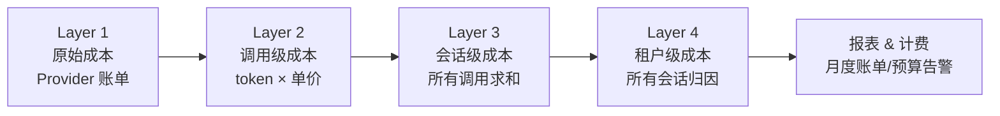

# 12 · 成本归因与计费（补充篇）

> 阶段：4 生产化 · 难度：⭐⭐⭐⭐ · 预计：2 天
> 前置：[11 多模型故障切换](11-多模型故障切换.md)
> 产出：掌握 Agent 系统的精确成本追踪、租户计费、预算告警

> 来源：[AWS Bedrock Cost Attribution](https://aws.amazon.com/blogs/machine-learning/introducing-granular-cost-attribution-for-amazon-bedrock/) | [Trussed Multi-Tenancy AI Cost](https://feeds.trussed.ai/blog/multi-tenancy-ai-service-cost-allocation) | [Mavvrik AI Cost Visibility](https://www.mavvrik.ai/blog/ai-cost-visibility/)

---

## 为什么需要成本归因

企业 AI 平台的核心问题：**一个共享的 Agent 基础设施上跑了 N 个租户，月底 LLM 账单 $23,000——谁该付多少？**

| 没有成本归因 | 有成本归因 |
|------------|----------|
| "平台花了 $23K，不知道谁用的" | "租户 A 用了 $12K，租户 B 用了 $8K，内部研发 $3K" |
| 无法对客户计费 | 可以精确 chargeback |
| 无法发现异常用量 | "租户 A 昨天用量是平时的 50 倍——可能在死循环" |
| 无法设置预算限制 | 每个租户有月预算，超限自动降级 |

---

## 四层成本链



---

## 成本追踪实现

### Token 用量记录器

```java
package com.example.cost;

import org.springframework.stereotype.Component;
import java.util.concurrent.*;

/**
 * Token 用量记录器
 *
 * 在每次 LLM 调用后记录：
 * - 租户 ID、会话 ID、Agent 类型
 * - 模型名称、输入 token、输出 token
 * - 单价、总成本
 */
@Component
public class CostTracker {

    // 模型定价表（每百万 token 的美元价格）
    private static final Map<String, ModelPricing> PRICING = Map.of(
        "deepseek-chat", new ModelPricing(0.14, 0.28),
        "deepseek-coder", new ModelPricing(0.14, 0.28),
        "deepseek-reasoner", new ModelPricing(0.55, 2.19),
        "gpt-4o-mini", new ModelPricing(0.15, 0.60),
        "gpt-4o", new ModelPricing(2.50, 10.00)
    );

    private final CostRecordRepository repository;

    /**
     * 记录一次 LLM 调用的成本
     */
    public void record(CostRecord record) {
        ModelPricing pricing = PRICING.getOrDefault(
            record.modelName(), PRICING.get("deepseek-chat"));

        double inputCost = (record.inputTokens() / 1_000_000.0) * pricing.inputPerMillion();
        double outputCost = (record.outputTokens() / 1_000_000.0) * pricing.outputPerMillion();
        double totalCost = inputCost + outputCost;

        record = new CostRecord(
            record.tenantId(), record.sessionId(), record.agentType(),
            record.modelName(), record.inputTokens(), record.outputTokens(),
            inputCost, outputCost, totalCost,
            Instant.now()
        );

        repository.save(record);
    }

    /**
     * 获取租户在时间范围内的总成本
     */
    public TenantCostSummary getTenantCost(String tenantId, Instant from, Instant to) {
        List<CostRecord> records = repository.findByTenantAndTimeRange(tenantId, from, to);

        double totalCost = records.stream().mapToDouble(CostRecord::totalCost).sum();
        long totalInputTokens = records.stream().mapToLong(CostRecord::inputTokens).sum();
        long totalOutputTokens = records.stream().mapToLong(CostRecord::outputTokens).sum();

        // 按 Agent 类型分摊
        Map<String, Double> costByAgent = records.stream()
            .collect(Collectors.groupingBy(
                CostRecord::agentType,
                Collectors.summingDouble(CostRecord::totalCost)
            ));

        // 按模型分摊
        Map<String, Double> costByModel = records.stream()
            .collect(Collectors.groupingBy(
                CostRecord::modelName,
                Collectors.summingDouble(CostRecord::totalCost)
            ));

        // 按天汇总（趋势分析）
        Map<String, Double> costByDay = records.stream()
            .collect(Collectors.groupingBy(
                r -> r.timestamp().toString().substring(0, 10), // YYYY-MM-DD
                Collectors.summingDouble(CostRecord::totalCost)
            ));

        return new TenantCostSummary(
            tenantId, totalCost, totalInputTokens, totalOutputTokens,
            costByAgent, costByModel, costByDay,
            records.size()
        );
    }

    public record ModelPricing(double inputPerMillion, double outputPerMillion) {}

    public record CostRecord(
        String tenantId, String sessionId, String agentType,
        String modelName, long inputTokens, long outputTokens,
        double inputCost, double outputCost, double totalCost,
        Instant timestamp
    ) {}

    public record TenantCostSummary(
        String tenantId, double totalCost,
        long totalInputTokens, long totalOutputTokens,
        Map<String, Double> costByAgent,
        Map<String, Double> costByModel,
        Map<String, Double> costByDay,
        long totalCalls
    ) {}
}
```

### Advisor 集成——自动成本追踪

```java
package com.example.cost;

import org.springframework.ai.chat.client.advisor.*;
import org.springframework.stereotype.Component;

/**
 * 成本追踪 Advisor
 *
 * 自动拦截每次 LLM 调用，提取 token 用量并记录成本。
 * 集成到 Spring AI Advisor 链中。
 */
@Component
public class CostTrackingAdvisor implements CallAdvisor {

    private final CostTracker costTracker;

    /**
     * 从上下文获取租户信息
     * 这些值由上游 Advisor（如 TenantContextAdvisor）设置
     */
    @Override
    public AdvisedResponse adviseCall(AdvisedRequest request, CallAdvisorChain chain) {
        String tenantId = adviseRequest.context().getOrDefault("tenantId", "internal");
        String sessionId = adviseRequest.context().getOrDefault("sessionId", "unknown");
        String agentType = adviseRequest.context().getOrDefault("agentType", "default");
        String modelName = adviseRequest.chatOptions().getModel();

        // 执行调用
        AdvisedResponse response = chain.nextCall(request);

        // 从响应中提取 token 用量
        Usage usage = response.response().getMetadata().getUsage();

        // 异步记录成本（不阻塞主流程）
        CompletableFuture.runAsync(() -> {
            costTracker.record(new CostTracker.CostRecord(
                tenantId, sessionId, agentType,
                modelName,
                usage.getPromptTokens(),
                usage.getCompletionTokens(),
                0, 0, 0, // 由 CostTracker 内部计算
                Instant.now()
            ));
        });

        return response;
    }

    @Override
    public int getOrder() { return 50; } // 在安全/日志之后
}
```

---

## 预算管理与自动降级

```java
package com.example.cost;

import org.springframework.stereotype.Component;

/**
 * 租户预算管理器
 *
 * 当租户成本接近预算时自动降级：
 * - 80% → 切换到更便宜的模型
 * - 95% → 限制并发
 * - 100% → 拒绝新请求
 */
@Component
public class BudgetManager {

    private final CostTracker costTracker;
    private final Map<String, TenantBudget> budgets = new ConcurrentHashMap<>();

    /**
     * 检查租户是否可以继续使用
     */
    public BudgetCheckResult checkBudget(String tenantId) {
        TenantBudget budget = budgets.get(tenantId);
        if (budget == null) return BudgetCheckResult.ok(); // 无预算限制

        // 获取当月已用
        Instant monthStart = Instant.now()
            .atZone(ZoneId.systemDefault())
            .withDayOfMonth(1).withHour(0).withMinute(0).withSecond(0)
            .toInstant();

        var summary = costTracker.getTenantCost(tenantId, monthStart, Instant.now());
        double usage = summary.totalCost();
        double ratio = usage / budget.monthlyBudget();

        if (ratio >= 1.0) {
            return BudgetCheckResult.exceeded(usage, budget.monthlyBudget());
        } else if (ratio >= 0.95) {
            return BudgetCheckResult.critical(usage, budget.monthlyBudget());
        } else if (ratio >= 0.80) {
            return BudgetCheckResult.warning(usage, budget.monthlyBudget());
        } else {
            return BudgetCheckResult.ok(usage, budget.monthlyBudget());
        }
    }

    public record TenantBudget(String tenantId, double monthlyBudget) {}

    public record BudgetCheckResult(
        BudgetStatus status, double used, double budget, double ratio
    ) {
        static BudgetCheckResult ok() { return new BudgetCheckResult(BudgetStatus.OK, 0, 0, 0); }
        static BudgetCheckResult ok(double used, double budget) {
            return new BudgetCheckResult(BudgetStatus.OK, used, budget, used/budget);
        }
        static BudgetCheckResult warning(double used, double budget) {
            return new BudgetCheckResult(BudgetStatus.WARNING, used, budget, used/budget);
        }
        static BudgetCheckResult critical(double used, double budget) {
            return new BudgetCheckResult(BudgetStatus.CRITICAL, used, budget, used/budget);
        }
        static BudgetCheckResult exceeded(double used, double budget) {
            return new BudgetCheckResult(BudgetStatus.EXCEEDED, used, budget, used/budget);
        }
    }

    public enum BudgetStatus {
        OK,        // 正常
        WARNING,   // 80%+ → 切换便宜模型
        CRITICAL,  // 95%+ → 限制并发
        EXCEEDED   // 100% → 拒绝
    }
}
```

### 预算限流 Advisor

```java
@Component
public class BudgetEnforcementAdvisor implements CallAdvisor {

    private final BudgetManager budgetManager;
    private final MultiModelRouter modelRouter;

    @Override
    public AdvisedResponse adviseCall(AdvisedRequest request, CallAdvisorChain chain) {
        String tenantId = request.context().getOrDefault("tenantId", "internal");

        var budget = budgetManager.checkBudget(tenantId);

        switch (budget.status()) {
            case EXCEEDED:
                // 预算已耗尽——拒绝
                throw new BudgetExceededException(
                    "租户 " + tenantId + " 当月预算已用尽 ($"
                    + budget.used() + "/$" + budget.budget() + ")"
                );

            case CRITICAL:
                // 95%+ —— 强制使用最便宜的模型
                request = request.mutate()
                    .withChatOptions(ChatOptionsBuilder.builder()
                        .withModel("gpt-4o-mini") // 最便宜的
                        .build())
                    .build();
                break;

            case WARNING:
                // 80%+ —— 建议使用便宜模型（记录告警但不强制）
                log.warn("租户 {} 成本告警：${}/${} ({}%)",
                    tenantId, budget.used(), budget.budget(),
                    String.format("%.0f", budget.ratio() * 100));
                break;

            case OK:
                // 正常
                break;
        }

        return chain.nextCall(request);
    }

    @Override
    public int getOrder() { return 40; } // 在成本追踪之前
}
```

---

## 成本报表 API

```java
@RestController
@RequestMapping("/api/cost")
public class CostController {

    private final CostTracker costTracker;
    private final BudgetManager budgetManager;

    /**
     * 租户月度成本报表
     */
    @GetMapping("/tenant/{tenantId}/summary")
    public CostTracker.TenantCostSummary tenantSummary(
            @PathVariable String tenantId,
            @RequestParam(required = false) String from,
            @RequestParam(required = false) String to) {
        // ...
    }

    /**
     * 全平台成本总览（管理员视角）
     */
    @GetMapping("/platform/overview")
    public PlatformCostOverview platformOverview() {
        // 按租户排列成本
        // 显示总成本趋势
        // 异常用量检测
    }

    /**
     * 设置租户预算
     */
    @PostMapping("/tenant/{tenantId}/budget")
    public void setBudget(@PathVariable String tenantId,
                          @RequestBody double monthlyBudget) {
        // ...
    }

    /**
     * 成本预测（基于历史趋势）
     */
    @GetMapping("/tenant/{tenantId}/forecast")
    public CostForecast forecast(@PathVariable String tenantId) {
        // 基于过去 30 天的日均成本 × 剩余天数
        // 预测月底总成本
    }
}
```

---

## 成本优化策略矩阵

| 策略 | 节省幅度 | 实现难度 | 副作用 |
|------|---------|---------|-------|
| **缓存命中** | 30-50% | 低 | 非实时 |
| **模型降级（复杂→简单任务）** | 40-60% | 中 | 质量可能下降 |
| **Prompt 压缩** | 10-25% | 中 | 信息丢失风险 |
| **Batch API** | 50% | 低 | 延迟增加 |
| **KV Cache 命中** | 60-90%（输入） | 高 | 需 Provider 支持 |
| **提前停止** | 10-20%（输出） | 中 | 回复可能不完整 |

---

## DDL：成本记录表

```sql
CREATE TABLE cost_records (
    id              BIGSERIAL PRIMARY KEY,
    tenant_id       VARCHAR(64) NOT NULL,
    session_id      VARCHAR(128) NOT NULL,
    agent_type      VARCHAR(64) NOT NULL,
    model_name      VARCHAR(64) NOT NULL,
    input_tokens    INTEGER NOT NULL,
    output_tokens   INTEGER NOT NULL,
    input_cost      DECIMAL(10,6) NOT NULL,
    output_cost     DECIMAL(10,6) NOT NULL,
    total_cost      DECIMAL(10,6) NOT NULL,
    recorded_at     TIMESTAMPTZ NOT NULL DEFAULT NOW()
);

-- 按租户+月查询
CREATE INDEX idx_cost_tenant_month ON cost_records (tenant_id, DATE_TRUNC('month', recorded_at));
-- 按 Agent 类型分析
CREATE INDEX idx_cost_agent ON cost_records (agent_type, recorded_at);

-- 租户预算表
CREATE TABLE tenant_budgets (
    tenant_id       VARCHAR(64) PRIMARY KEY,
    monthly_budget  DECIMAL(10,2) NOT NULL,
    updated_at      TIMESTAMPTZ NOT NULL DEFAULT NOW()
);
```

---

## 验收检查

- [ ] 能实现四层成本追踪（调用→会话→租户→平台）
- [ ] 能通过 Advisor 自动记录 token 成本
- [ ] 能实现四级预算管理（OK→WARNING→CRITICAL→EXCEEDED）
- [ ] 能实现预算触发自动降级
- [ ] 能生成租户月度成本报表
- [ ] 理解成本优化策略矩阵

---

## 下一步

→ 下一篇：[13 数据飞轮与持续改进](13-数据飞轮与持续改进.md)
