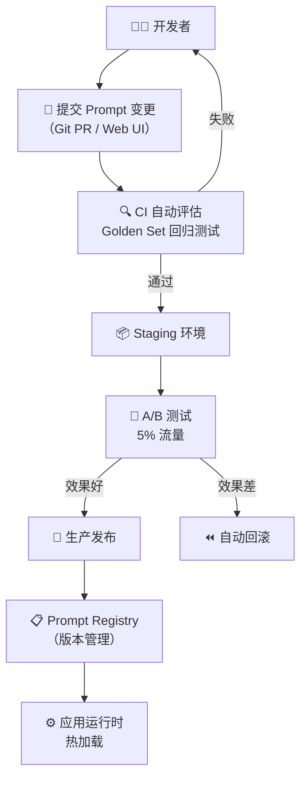

# 14 · Prompt 工程化管理（补充篇）

> 阶段：4 生产化 · 难度：⭐⭐⭐⭐ · 预计：2 天
> 前置：[13 数据飞轮与持续改进](13-数据飞轮与持续改进.md)
> 产出：掌握 Prompt as Code——版本管理、A/B 测试、评估流水线、热部署

> 来源：[Atlan Centralized Prompt Management](https://atlan.com/know/ai-agent/centralized-prompt-management-for-enterprise/) | [Future AGI: Best Prompt Management Platforms 2026](https://futureagi.com/blog/best-enterprise-prompt-management-platforms-in-2026/)

---

## 为什么 Prompt 需要工程化管理

在团队中，Prompt 管理面临以下挑战：

| 问题 | 后果 |
|------|------|
| Prompt 硬编码在 Java 类里 | 改一个字需要重新编译部署 |
| 多人修改同一个 Prompt | 互相覆盖，无法追溯 |
| 改了 Prompt 不知道效果变好还是变差 | 生产事故 |
| 不同环境（dev/staging/prod）用不同 Prompt | 手动同步容易遗漏 |
| 新人不知道某个 Prompt 为什么这么写 | 知识断层 |

**Prompt as Code** 的核心理念：**把 Prompt 当代码一样管理——版本化、可审查、可测试、可回滚。**

---

## Prompt 管理架构



---

## Prompt 注册中心

### 数据模型

```java
package com.example.prompt;

/**
 * Prompt 注册中心实体
 */
public class PromptDefinition {
    private String id;                    // 唯一标识：e.g., "customer-service-greeting"
    private String name;                  // 人类可读名
    private String version;               // 语义版本：1.2.0
    private String category;              // 分类：system / few-shot / template
    private String content;               // Prompt 文本（支持变量插值）
    private Map<String, Object> variables; // 变量定义
    private String model;                 // 推荐模型
    private Double temperature;           // 推荐温度
    private Integer maxTokens;            // 推荐 max_tokens
    private PromptStatus status;          // DRAFT / REVIEW / ACTIVE / ARCHIVED
    private String author;                // 创建者
    private String changeLog;             // 变更说明
    private Instant createdAt;
    private Instant updatedAt;
}

public enum PromptStatus {
    DRAFT,      // 草稿
    REVIEW,     // 待审核
    ACTIVE,     // 生产在用
    ARCHIVED    // 已归档（可回滚）
}
```

### Prompt Registry

```java
package com.example.prompt;

import org.springframework.stereotype.Component;
import java.util.*;
import java.util.concurrent.ConcurrentHashMap;

/**
 * Prompt 注册中心
 *
 * 核心功能：
 * 1. 存储 Prompt 的所有版本
 * 2. 支持 ACTIVE 版本切换
 * 3. 支持回滚到任意历史版本
 * 4. 发布变更事件（热加载）
 */
@Component
public class PromptRegistry {

    private final PromptVersionRepository repository;
    private final PromptEventBus eventBus;

    // 内存缓存：promptId → 当前 ACTIVE 版本
    private final Map<String, PromptDefinition> activeCache = new ConcurrentHashMap<>();

    /**
     * 获取当前 Active 版本
     */
    public PromptDefinition getActive(String promptId) {
        return activeCache.computeIfAbsent(promptId, id ->
            repository.findActiveVersion(id).orElseThrow(() ->
                new PromptNotFoundException(promptId))
        );
    }

    /**
     * 发布新版本
     */
    public PromptDefinition publish(PromptDefinition newVersion) {
        // 1. 版本号必须递增
        PromptDefinition current = repository.findLatestVersion(newVersion.id());
        if (current != null && !isNewerVersion(newVersion.version(), current.version())) {
            throw new VersionConflictException(
                "版本 " + newVersion.version() + " 不大于当前最新 " + current.version()
            );
        }

        // 2. 保存新版本
        newVersion.setStatus(PromptStatus.ACTIVE);
        newVersion.setUpdatedAt(Instant.now());
        repository.save(newVersion);

        // 3. 将旧版本标记为 ARCHIVED
        if (current != null) {
            repository.updateStatus(current.id(), current.version(),
                PromptStatus.ARCHIVED);
        }

        // 4. 更新缓存
        activeCache.put(newVersion.id(), newVersion);

        // 5. 发布变更事件（触发热加载）
        eventBus.publish(new PromptChangedEvent(
            newVersion.id(),
            current != null ? current.version() : null,
            newVersion.version()
        ));

        return newVersion;
    }

    /**
     * 回滚到指定版本
     */
    public PromptDefinition rollback(String promptId, String targetVersion) {
        PromptDefinition target = repository.findVersion(promptId, targetVersion)
            .orElseThrow(() -> new PromptNotFoundException(promptId + "@" + targetVersion));

        target.setStatus(PromptStatus.ACTIVE);
        target.setUpdatedAt(Instant.now());
        repository.save(target);

        activeCache.put(promptId, target);
        eventBus.publish(new PromptChangedEvent(
            promptId, null, targetVersion
        ));

        return target;
    }

    /**
     * 版本历史
     */
    public List<PromptDefinition> getVersionHistory(String promptId) {
        return repository.findAllVersions(promptId);
    }

    private boolean isNewerVersion(String newVer, String oldVer) {
        String[] newParts = newVer.split("\\.");
        String[] oldParts = oldVer.split("\\.");
        for (int i = 0; i < 3; i++) {
            int n = Integer.parseInt(newParts[i]);
            int o = Integer.parseInt(oldParts[i]);
            if (n > o) return true;
            if (n < o) return false;
        }
        return false;
    }
}
```

---

## Prompt 热加载

```java
package com.example.prompt;

import org.springframework.ai.chat.client.ChatClient;
import org.springframework.stereotype.Component;

/**
 * Prompt 热加载器
 *
 * 监听 Prompt 变更事件，自动更新运行中的 ChatClient。
 * 无需重启应用。
 */
@Component
public class PromptHotReloader {

    private final PromptRegistry registry;
    private final Map<String, ChatClient> clientCache = new ConcurrentHashMap<>();

    /**
     * 构建/获取一个使用指定 Prompt 的 ChatClient
     */
    public ChatClient client(String promptId, ChatClient.Builder builder) {
        return clientCache.computeIfAbsent(promptId, id -> {
            PromptDefinition prompt = registry.getActive(id);
            return buildClient(builder, prompt);
        });
    }

    /**
     * 监听 Prompt 变更——自动更新缓存
     */
    @EventListener
    public void onPromptChanged(PromptChangedEvent event) {
        log.info("Prompt {} 变更：{} → {}，热加载中...",
            event.promptId(), event.oldVersion(), event.newVersion());

        // 清除缓存，下次调用会重新构建
        clientCache.remove(event.promptId());
    }

    private ChatClient buildClient(ChatClient.Builder builder, PromptDefinition prompt) {
        return builder
            .defaultSystem(prompt.getContent())
            .defaultOptions(OpenAiChatOptions.builder()
                .withModel(prompt.getModel())
                .withTemperature(prompt.getTemperature().floatValue())
                .withMaxTokens(prompt.getMaxTokens())
                .build())
            .build();
    }
}
```

---

## Prompt A/B 测试

```java
package com.example.prompt;

import org.springframework.stereotype.Component;
import java.util.*;

/**
 * Prompt A/B 测试管理器
 *
 * 将一定比例的流量路由到新版本 Prompt，对比效果。
 */
@Component
public class PromptABTestManager {

    private final PromptRegistry registry;
    private final InteractionCollector collector; // 来自数据飞轮

    // 进行中的实验
    private final Map<String, ABExperiment> experiments = new ConcurrentHashMap<>();

    /**
     * 创建 A/B 实验
     */
    public ABExperiment createExperiment(String promptId, String variantVersion,
                                          double trafficPercentage) {
        ABExperiment experiment = new ABExperiment(
            UUID.randomUUID().toString(),
            promptId,
            registry.getActive(promptId).version(), // control 版本
            variantVersion,                          // 实验版本
            trafficPercentage,
            Instant.now(),
            null, // 结束时间
            ExperimentStatus.RUNNING
        );
        experiments.put(experiment.id(), experiment);
        return experiment;
    }

    /**
     * 决定使用哪个版本
     */
    public String selectVersion(String promptId, String sessionId) {
        // 查找该 promptId 的进行中实验
        ABExperiment experiment = experiments.values().stream()
            .filter(e -> e.promptId().equals(promptId) && e.status() == ExperimentStatus.RUNNING)
            .findFirst().orElse(null);

        if (experiment == null) {
            return registry.getActive(promptId).version(); // 无实验，用 active
        }

        // 基于会话 ID 哈希分流
        int hash = Math.abs(sessionId.hashCode()) % 100;
        if (hash < experiment.trafficPercentage()) {
            return experiment.variantVersion(); // 实验组
        } else {
            return experiment.controlVersion(); // 对照组
        }
    }

    /**
     * 评估实验结果
     */
    public ExperimentResult evaluate(String experimentId) {
        ABExperiment experiment = experiments.get(experimentId);
        // 从 InteractionCollector 获取两组的满意度数据
        // 对比 control vs variant 的满意度率
        // 如果 variant 显著更好 → 建议发布
        // 如果 variant 显著更差 → 建议停止
    }

    public record ABExperiment(
        String id, String promptId,
        String controlVersion, String variantVersion,
        double trafficPercentage,
        Instant startedAt, Instant endedAt,
        ExperimentStatus status
    ) {}

    public enum ExperimentStatus { RUNNING, COMPLETED, STOPPED }
}
```

---

## Prompt CI 评估流水线

```java
package com.example.prompt;

import org.springframework.stereotype.Component;

/**
 * Prompt CI 评估器
 *
 * 新版本 Prompt 发布前，自动用 Golden Set 回归测试。
 */
@Component
public class PromptCIEvaluator {

    private final GoldenSetManager goldenSet;
    private final ChatClient.Builder clientBuilder;

    /**
     * 评估一个 Prompt 变更
     */
    public CIEvaluationResult evaluate(PromptDefinition candidate) {
        // 构建使用新 Prompt 的 ChatClient
        ChatClient testClient = clientBuilder
            .defaultSystem(candidate.getContent())
            .defaultOptions(OpenAiChatOptions.builder()
                .withModel(candidate.getModel())
                .withTemperature(candidate.getTemperature().floatValue())
                .build())
            .build();

        // 用 Golden Set 回归测试
        GoldenSetManager.RegressionResult regression =
            goldenSet.runRegression(testClient);

        // 判定
        CIStatus status;
        if (regression.passRate() >= 0.95) {
            status = CIStatus.PASS;
        } else if (regression.passRate() >= 0.85) {
            status = CIStatus.WARN; // 需要人工确认
        } else {
            status = CIStatus.FAIL;
        }

        return new CIEvaluationResult(
            candidate.id(), candidate.version(),
            regression, status
        );
    }

    public record CIEvaluationResult(
        String promptId, String version,
        GoldenSetManager.RegressionResult regression,
        CIStatus status
    ) {}

    public enum CIStatus { PASS, WARN, FAIL }
}
```

---

## Prompt 管理 API

```java
@RestController
@RequestMapping("/api/prompts")
public class PromptController {

    private final PromptRegistry registry;
    private final PromptABTestManager abTestManager;
    private final PromptCIEvaluator ciEvaluator;

    /** 获取当前 Active 版本 */
    @GetMapping("/{promptId}")
    public PromptDefinition get(@PathVariable String promptId) {
        return registry.getActive(promptId);
    }

    /** 版本历史 */
    @GetMapping("/{promptId}/history")
    public List<PromptDefinition> history(@PathVariable String promptId) {
        return registry.getVersionHistory(promptId);
    }

    /** 创建/更新 Prompt（触发 CI 评估） */
    @PostMapping("/{promptId}/versions")
    public CIEvaluationResult createVersion(
            @PathVariable String promptId,
            @RequestBody PromptDefinition newVersion) {
        // 1. CI 评估
        var result = ciEvaluator.evaluate(newVersion);
        // 2. 如果通过 → 发布
        if (result.status() == PromptCIEvaluator.CIStatus.PASS) {
            registry.publish(newVersion);
        }
        return result;
    }

    /** 回滚 */
    @PostMapping("/{promptId}/rollback/{version}")
    public PromptDefinition rollback(@PathVariable String promptId,
                                     @PathVariable String version) {
        return registry.rollback(promptId, version);
    }

    /** 创建 A/B 测试 */
    @PostMapping("/{promptId}/ab-test")
    public ABExperiment createABTest(@PathVariable String promptId,
                                     @RequestBody CreateABTestRequest request) {
        return abTestManager.createExperiment(promptId,
            request.variantVersion(), request.trafficPercentage());
    }

    /** A/B 测试结果 */
    @GetMapping("/ab-test/{experimentId}/result")
    public ExperimentResult abTestResult(@PathVariable String experimentId) {
        return abTestManager.evaluate(experimentId);
    }
}
```

---

## DDL：Prompt 管理表

```sql
CREATE TABLE prompt_definitions (
    id              VARCHAR(128) NOT NULL,   -- e.g., "customer-service-greeting"
    version         VARCHAR(32) NOT NULL,    -- e.g., "1.2.0"
    name            VARCHAR(256),
    category        VARCHAR(64),
    content         TEXT NOT NULL,
    variables       JSONB,
    model           VARCHAR(64),
    temperature     DECIMAL(3,2),
    max_tokens      INTEGER,
    status          VARCHAR(32) NOT NULL,    -- DRAFT/REVIEW/ACTIVE/ARCHIVED
    author          VARCHAR(128),
    change_log      TEXT,
    created_at      TIMESTAMPTZ NOT NULL DEFAULT NOW(),
    updated_at      TIMESTAMPTZ NOT NULL DEFAULT NOW(),
    PRIMARY KEY (id, version)
);

CREATE INDEX idx_prompt_active ON prompt_definitions (id) WHERE status = 'ACTIVE';
```

---

## 验收检查

- [ ] 理解 Prompt as Code 的核心理念
- [ ] 能实现 Prompt 注册中心（版本管理 + ACTIVE 切换）
- [ ] 能实现 Prompt 热加载（事件驱动）
- [ ] 能实现 Prompt A/B 测试（流量分桶）
- [ ] 能实现 Prompt CI 评估流水线（Golden Set 回归）
- [ ] 能实现 Prompt 回滚

---

## 下一步

→ 下一篇：[15 Agent 安全审计](15-Agent安全审计.md)
