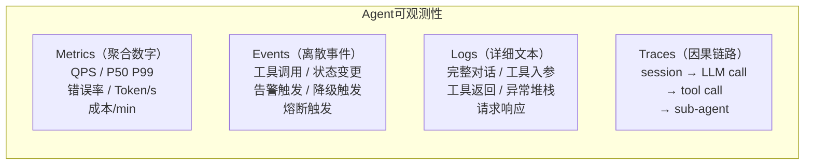

# Agent 可观测性 · MELT 框架

> **一句话**：Metrics（指标）、Events（事件）、Logs（日志）、Traces（链路）——让 Agent 的每一次决策都可追溯、可审计、可治理。

---

## 为什么传统 APM 不够用？

传统 APM（Application Performance Monitoring）只关注：请求量、延迟、错误率、资源使用。

Agent 系统多了一层**非确定性**——同样的输入，不同时间可能得到不同输出。你还需要追踪：

| 传统 APM | Agent 额外需要 |
|---------|--------------|
| HTTP 请求延迟 | LLM 首 Token 延迟（TTFT） |
| 错误率 | 幻觉率、工具调用失败率 |
| QPS | Token 吞吐量、成本/请求 |
| 服务调用链 | Agent 推理链（Thought→Action→Observation） |
| 无 | Prompt 版本、模型版本、温度参数 |

---

## MELT 四支柱



---

## 代码实现

### 1. Metrics（指标聚合）

```java
package com.enterprise.observability.metrics;

import io.micrometer.core.instrument.*;
import org.springframework.stereotype.Component;
import java.util.concurrent.TimeUnit;

/**
 * Agent 指标采集器
 *
 * 核心指标分三类：
 * - 性能：TTFT、E2E 延迟、Token 吞吐
 * - 质量：工具成功率、幻觉标记数
 * - 资源：并发会话数、成本速率
 */
@Component
public class AgentMetrics {

    private final MeterRegistry registry;

    // === 计时器 ===
    private final Timer llmCallTimer;       // LLM 调用总耗时
    private final Timer ttftTimer;          // 首 Token 延迟
    private final Timer toolCallTimer;      // 工具调用耗时

    // === 计数器 ===
    private final Counter toolSuccessCounter;
    private final Counter toolFailureCounter;
    private final Counter hallucinationCounter;

    // === 量表 ===
    private final AtomicInteger activeSessions = new AtomicInteger(0);

    public AgentMetrics(MeterRegistry registry) {
        this.registry = registry;

        this.llmCallTimer = Timer.builder("agent.llm.call.duration")
            .description("LLM 调用总耗时")
            .publishPercentiles(0.5, 0.95, 0.99)
            .register(registry);

        this.ttftTimer = Timer.builder("agent.llm.ttft")
            .description("首 Token 延迟")
            .publishPercentiles(0.5, 0.95)
            .register(registry);

        this.toolCallTimer = Timer.builder("agent.tool.call.duration")
            .description("工具调用耗时")
            .tag("tool", "unknown")
            .publishPercentiles(0.5, 0.95)
            .register(registry);

        this.toolSuccessCounter = Counter.builder("agent.tool.calls")
            .tag("result", "success")
            .register(registry);

        this.toolFailureCounter = Counter.builder("agent.tool.calls")
            .tag("result", "failure")
            .register(registry);

        this.hallucinationCounter = Counter.builder("agent.quality.hallucination")
            .description("检测到的幻觉次数")
            .register(registry);

        // 活跃会话数
        registry.gauge("agent.sessions.active", activeSessions);
    }

    /** 记录 LLM 调用 */
    public void recordLlmCall(long totalMs, long ttftMs, int inputTokens, int outputTokens) {
        llmCallTimer.record(totalMs, TimeUnit.MILLISECONDS);
        ttftTimer.record(ttftMs, TimeUnit.MILLISECONDS);

        // Token 作为 Distribution Summary（可以统计 P50/P99）
        registry.summary("agent.llm.tokens")
            .record(inputTokens + outputTokens);
    }

    /** 记录工具调用 */
    public void recordToolCall(String toolName, long durationMs, boolean success) {
        Timer.builder("agent.tool.call.duration")
            .tag("tool", toolName)
            .register(registry)
            .record(durationMs, TimeUnit.MILLISECONDS);

        if (success) toolSuccessCounter.increment();
        else toolFailureCounter.increment();
    }

    /** 记录幻觉 */
    public void recordHallucination(String type) {
        Counter.builder("agent.quality.hallucination")
            .tag("type", type)
            .register(registry)
            .increment();
    }

    public void sessionStarted() { activeSessions.incrementAndGet(); }
    public void sessionEnded() { activeSessions.decrementAndGet(); }
}
```

### 2. Events（关键事件）

```java
package com.enterprise.observability.events;

import org.springframework.context.ApplicationEvent;
import org.springframework.context.event.EventListener;
import org.springframework.stereotype.Component;

/**
 * Agent 关键事件
 *
 * 和 Metrics 的区别：Metrics 是数字聚合，Events 是离散的关键动作。
 * 例如：降级触发、熔断打开、预算超限、安全拦截。
 */
@Component
public class AgentEventLogger {

    @EventListener
    public void onAgentEvent(AgentEvent event) {
        // 结构化输出，方便 Loki/ELK 采集
        System.out.printf("""
            [AGENT_EVENT] {
              "type": "%s",
              "agentType": "%s",
              "sessionId": "%s",
              "detail": "%s",
              "timestamp": "%s"
            }
            %n""", event.type(), event.agentType(), event.sessionId(),
                event.detail(), event.timestamp());
    }

    /** 事件类型枚举 */
    public enum EventType {
        SESSION_STARTED, SESSION_ENDED,
        TOOL_CALLED, TOOL_FAILED,
        DEGRADATION_TRIGGERED,     // 触发降级
        CIRCUIT_BREAKER_OPENED,     // 熔断打开
        BUDGET_EXCEEDED,            // 预算超限
        SECURITY_BLOCKED,           // 安全拦截
        HALLUCINATION_DETECTED,     // 幻觉检测
        MODEL_SWITCHED              // 模型切换
    }

    public record AgentEvent(
        EventType type, String agentType,
        String sessionId, String detail,
        String timestamp
    ) {}
}
```

### 3. Traces（分布式链路）

```java
package com.enterprise.observability.traces;

import io.opentelemetry.api.trace.*;
import io.opentelemetry.api.trace.propagation.*;
import io.opentelemetry.context.Context;
import org.springframework.stereotype.Component;

/**
 * Agent 链路追踪
 *
 * 一个用户请求的完整链路：
 *
 * [session.start] ── [llm.call#1] ── [tool.call: queryDB] ── [llm.call#2] ── [session.end]
 *      │                  │                  │                   │
 *      │                  ├─ model: deepseek │                   │
 *      │                  ├─ inputTokens: 500│                   │
 *      │                  ├─ outputTokens:120│                   │
 *      │                  └─ ttft: 850ms      │                   │
 *      │                                     ├─ tool: queryDB     │
 *      │                                     ├─ duration: 45ms    │
 *      │                                     └─ result: success   │
 *      └─ userId: user-123, tenantId: acme-corp
 */
@Component
public class AgentTracer {

    private final Tracer tracer;

    public AgentTracer(Tracer tracer) {
        this.tracer = tracer;
    }

    /** 创建会话 Span */
    public Span startSessionSpan(String sessionId, String userId, String tenantId) {
        return tracer.spanBuilder("session." + sessionId)
            .setAttribute("agent.session.id", sessionId)
            .setAttribute("agent.user.id", userId)
            .setAttribute("agent.tenant.id", tenantId)
            .setAttribute("agent.start.time", System.currentTimeMillis())
            .startSpan();
    }

    /** 创建 LLM 调用 Span */
    public Span startLlmSpan(Context parent, String model, String promptVersion) {
        return tracer.spanBuilder("llm.call")
            .setParent(parent)
            .setAttribute("llm.model", model)
            .setAttribute("llm.prompt.version", promptVersion)
            .setAttribute("llm.temperature", 0.7)
            .startSpan();
    }

    /** 创建工具调用 Span */
    public Span startToolSpan(Context parent, String toolName, String params) {
        return tracer.spanBuilder("tool." + toolName)
            .setParent(parent)
            .setAttribute("tool.name", toolName)
            .setAttribute("tool.params", params)
            .startSpan();
    }

    /** 完成 Span 并记录结果 */
    public void endSpan(Span span, boolean success, String error) {
        if (success) {
            span.setAttribute("result", "success");
        } else {
            span.setAttribute("result", "error");
            span.setAttribute("error.message", error);
            span.setStatus(StatusCode.ERROR);
        }
        span.end();
    }
}
```

### 4. 统一 Advisor 集成

```java
package com.enterprise.observability;

import org.springframework.ai.chat.client.advisor.api.*;
import org.springframework.stereotype.Component;

/**
 * 可观测性 Advisor——无侵入式采集 MELT
 *
 * 挂在 Advisor 链上，自动采集每次 LLM 调用的 Metrics + Traces。
 */
@Component
public class ObservabilityAdvisor implements CallAdvisor {

    private final AgentMetrics metrics;
    private final AgentTracer tracer;

    @Override
    public AdvisedResponse adviseCall(AdvisedRequest request, CallAdvisorChain chain) {
        String sessionId = request.chatParams().get("sessionId");
        Span sessionSpan = tracer.startSessionSpan(
            sessionId, getUserId(request), getTenantId(request));

        long start = System.currentTimeMillis();
        try {
            AdvisedResponse response = chain.nextCall(request);

            long duration = System.currentTimeMillis() - start;
            metrics.recordLlmCall(duration, extractTtft(response),
                extractInputTokens(response), extractOutputTokens(response));

            return response;
        } catch (Exception e) {
            metrics.recordToolCall("llm", System.currentTimeMillis() - start, false);
            tracer.endSpan(sessionSpan, false, e.getMessage());
            throw e;
        } finally {
            tracer.endSpan(sessionSpan, true, null);
        }
    }

    @Override
    public int getOrder() { return Integer.MIN_VALUE + 100; }
    // 最高优先级——最外层包住所有其他 Advisor
}
```

---

## Grafana 看板核心面板

| 面板 | PromQL / 查询 | 告警阈值 |
|------|-------------|---------|
| LLM P99 延迟 | `histogram_quantile(0.99, agent_llm_call_duration_bucket)` | > 10s |
| 首 Token 延迟 | `histogram_quantile(0.5, agent_llm_ttft_bucket)` | > 3s |
| 工具失败率 | `rate(agent_tool_calls_total{result="failure"}[5m]) / rate(agent_tool_calls_total[5m])` | > 10% |
| 活跃会话数 | `agent_sessions_active` | > 1000 |
| 幻觉率 | `rate(agent_quality_hallucination_total[1h]) / rate(agent_llm_call_duration_count[1h])` | > 5% |

---

## 关键收获

| 传统监控 | Agent 可观测性 |
|---------|--------------|
| 只看技术指标 | 技术 + 质量 + 成本三维 |
| 结构化日志 | + 推理链路 Trace |
| 被动告警 | + 主动幻觉检测 |
| 服务级 | 会话级 + 租户级 |

→ 返回 [阶段4 目录](../00-README.md)
