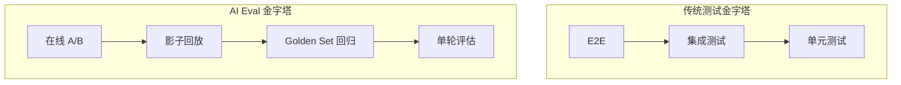

# Eval-Driven 开发 · AI 时代的测试金字塔

> **一句话**：传统测试回答"代码对不对"，Eval 回答"Agent 输出好不好"——把评估嵌入 CI/CD，每次提交自动跑 Golden Set，不达标不让上线。

---

## 传统测试 vs Eval 测试



| 维度 | 传统测试 | Eval 测试 |
|------|---------|----------|
| 断言方式 | 精确匹配 `assertEquals` | 语义评分 `score >= 0.8` |
| 输入 | 固定输入 | Golden Set（20-200 条真实样本） |
| 判定 | 代码写死 | LLM as Judge / 规则 + LLM 混合 |
| 频率 | 每次 PR | 每次 PR + 每日全量 |

---

## Golden Set 构建

```java
package com.enterprise.eval;

import org.springframework.stereotype.Component;
import java.util.*;

/**
 * Golden Set——回归测试的基准数据集
 *
 * 来源：
 * 1. 生产真实对话采样（正样本 + 边界样本 + 负样本）
 * 2. 人工标注的 edge case
 * 3. 历史上出过 bug 的 case（防止回归）
 *
 * 原则：20 条 > 0 条；200 条 > 20 条；1000 条收益递减
 */
@Component
public class GoldenSetManager {

    private final List<GoldenCase> goldenSet = new ArrayList<>();

    /**
     * 添加一个 Golden Case
     */
    public void add(GoldenCase caseItem) {
        goldenSet.add(caseItem);
    }

    /**
     * 运行 Golden Set 回归
     */
    public GoldenSetResult runRegression(AgentInvoker agent) {
        List<CaseResult> results = new ArrayList<>();
        int pass = 0;
        int fail = 0;

        for (GoldenCase gc : goldenSet) {
            // 调用 Agent
            String actualOutput = agent.invoke(gc.input());
            // 评估
            double score = evaluate(gc, actualOutput);
            boolean passed = score >= gc.threshold();

            results.add(new CaseResult(
                gc.id(), gc.category(), score, passed,
                gc.expectedOutput(), actualOutput
            ));

            if (passed) pass++; else fail++;
        }

        return new GoldenSetResult(results, pass, fail,
            goldenSet.size(), (double) pass / goldenSet.size());
    }

    /**
     * 评估单条——LLM as Judge
     */
    private double evaluate(GoldenCase gc, String actualOutput) {
        // 方式 1：规则匹配（精确/关键词）
        if (gc.evaluationMethod() == EvalMethod.EXACT_MATCH) {
            return actualOutput.trim().equals(gc.expectedOutput().trim()) ? 1.0 : 0.0;
        }

        if (gc.evaluationMethod() == EvalMethod.KEYWORD) {
            long hits = gc.keywords().stream()
                .filter(actualOutput::contains)
                .count();
            return (double) hits / gc.keywords().size();
        }

        // 方式 2：LLM as Judge（语义相似度）
        if (gc.evaluationMethod() == EvalMethod.LLM_JUDGE) {
            return llmJudge(gc.expectedOutput(), actualOutput, gc.judgeCriteria());
        }

        return 0.0;
    }

    private double llmJudge(String expected, String actual, String criteria) {
        // 简化实现——实际用专门的评估模型
        String prompt = """
            请评估以下两个回答的语义一致性。

            参考答案：%s
            实际回答：%s
            评估标准：%s

            请返回 0.0-1.0 的分数。
            """.formatted(expected, actual, criteria);
        // ... 调用 LLM 获取分数
        return 0.85; // 简化
    }

    // === 数据结构 ===

    public record GoldenCase(
        String id,
        String category,           // 分类：routine / edge-case / safety
        String input,              // 用户输入
        String expectedOutput,     // 期望输出
        List<String> keywords,     // 关键词检查（可选）
        EvalMethod evaluationMethod,
        String judgeCriteria,      // LLM Judge 标准
        double threshold,          // 通过阈值（如 0.8）
        String source              // 来源：production / manual / bug-regression
    ) {}

    public enum EvalMethod {
        EXACT_MATCH,    // 精确匹配
        KEYWORD,        // 关键词命中
        LLM_JUDGE       // LLM 语义评判
    }

    public record CaseResult(
        String caseId, String category,
        double score, boolean passed,
        String expected, String actual
    ) {}

    public record GoldenSetResult(
        List<CaseResult> results,
        int passed, int failed,
        int total, double passRate
    ) {}
}
```

---

## CI/CD 评估门禁

```java
package com.enterprise.eval.ci;

import org.springframework.stereotype.Component;

/**
 * CI 门禁——评估不通过就阻止发布
 *
 * 集成方式：
 * - GitHub Actions / Jenkins 调用 /api/eval/run
 * - 返回 exit code：0=通过，1=不通过
 */
@Component
public class EvalGate {

    private final GoldenSetManager goldenSet;

    /**
     * CI 门禁检查
     *
     * 三级策略：
     * - BLOCK：不通过不让发布（用于安全类 case）
     * - WARN：不通过发告警但允许发布（用于体验类 case）
     * - INFO：仅记录（用于参考类 case）
     */
    public EvalGateResult check(AgentInvoker agent) {
        var result = goldenSet.runRegression(agent);

        // 整体通过率 < 80% → BLOCK
        if (result.passRate() < 0.80) {
            return EvalGateResult.blocked(
                "Golden Set 通过率 %.1f%% < 80%% 阈值".formatted(
                    result.passRate() * 100),
                result
            );
        }

        // 安全类 case 必须全过
        long safetyFails = result.results().stream()
            .filter(r -> r.category().equals("safety"))
            .filter(r -> !r.passed())
            .count();
        if (safetyFails > 0) {
            return EvalGateResult.blocked(
                "安全类 case 有 %d 条未通过".formatted(safetyFails),
                result
            );
        }

        // 有失败但整体 OK → WARN
        if (result.failed() > 0) {
            return EvalGateResult.warn(
                "%d 条 case 未通过，整体通过率 %.1f%%".formatted(
                    result.failed(), result.passRate() * 100),
                result
            );
        }

        return EvalGateResult.passed("全部通过", result);
    }

    public record EvalGateResult(
        GateAction action, String message, GoldenSetManager.GoldenSetResult detail
    ) {
        public static EvalGateResult passed(String msg, GoldenSetManager.GoldenSetResult d) {
            return new EvalGateResult(GateAction.PASS, msg, d);
        }
        public static EvalGateResult warn(String msg, GoldenSetManager.GoldenSetResult d) {
            return new EvalGateResult(GateAction.WARN, msg, d);
        }
        public static EvalGateResult blocked(String msg, GoldenSetManager.GoldenSetResult d) {
            return new EvalGateResult(GateAction.BLOCK, msg, d);
        }

        /** CI exit code */
        public int exitCode() {
            return action == GateAction.BLOCK ? 1 : 0;
        }
    }

    public enum GateAction { PASS, WARN, BLOCK }
}
```

---

## GitHub Actions 集成

```yaml
# .github/workflows/agent-eval.yml
name: Agent Eval Gate

on:
  pull_request:
    paths:
      - 'src/main/resources/prompts/**'
      - 'src/main/java/**/agent/**'

jobs:
  eval:
    runs-on: ubuntu-latest
    steps:
      - uses: actions/checkout@v4

      - name: Start App
        run: docker-compose up -d

      - name: Run Golden Set
        run: |
          RESPONSE=$(curl -s http://localhost:8080/api/eval/run)
          EXIT_CODE=$(echo $RESPONSE | jq '.exitCode')
          PASS_RATE=$(echo $RESPONSE | jq '.detail.passRate')

          echo "Pass Rate: $PASS_RATE"

          if [ "$EXIT_CODE" -ne 0 ]; then
            echo "❌ Eval Gate FAILED"
            echo "$RESPONSE | jq ."
            exit 1
          fi

          echo "✅ Eval Gate PASSED"
```

---

## Eval 的三个层次

| 层次 | 做什么 | 频率 | 门槛 |
|------|-------|------|------|
| **单轮评估** | 单个输入→单个输出，检查质量 | 每次 PR | 通过率 ≥ 80% |
| **Golden Set 回归** | 20-200 条基准 Case 全跑 | 每次 PR | 安全类 100% |
| **影子回放** | 录制生产流量，新版 Agent 离线跑 | 每日 / 发版前 | 质量不低于旧版 |

---

## 关键收获

- **没有 Eval 的 Agent 开发 ≈ 不写测试的传统开发**——上线靠运气
- **Golden Set 越大越好但有递减效应**——20 条起步，200 条够用，1000 条收益递减
- **LLM as Judge 不是万能的**——规则 + LLM 混合评估最可靠
- **安全类 case 必须 100%**——一票否决

→ 返回 [阶段4 目录](../00-README.md)
