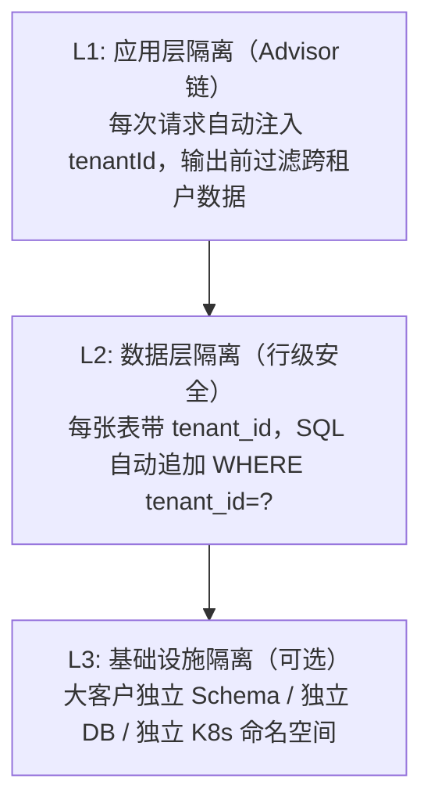

# 多租户数据隔离 · Agent 时代的租户安全

> **一句话**：B2B AI Agent 最致命的风险是租户 A 的数据"泄漏"到租户 B 的上下文——GDPR 罚款、客户流失、信任崩塌。

---

## 三层隔离模型



---

## L1: 应用层隔离——租户 Advisor

```java
package com.enterprise.tenant;

import org.springframework.ai.chat.client.advisor.api.*;
import org.springframework.stereotype.Component;
import java.util.*;

/**
 * 租户隔离 Advisor
 *
 * 核心逻辑：
 * 1. 从请求中提取 tenantId
 * 2. 注入到 ChatParams，整个调用链可访问
 * 3. 输出后扫描，确保不包含其他租户的敏感信息
 */
@Component
public class TenantIsolationAdvisor implements CallAdvisor {

    @Override
    public AdvisedResponse adviseCall(AdvisedRequest request, CallAdvisorChain chain) {
        // 1. 确保有 tenantId
        String tenantId = request.chatParams().get("tenantId");
        if (tenantId == null || tenantId.isBlank()) {
            throw new SecurityException("缺少 tenantId，拒绝执行");
        }

        // 2. 注入系统提示——告诉 LLM 当前租户
        String enhancedSystemPrompt = """
            当前租户：%s
            安全规则：
            - 只能访问当前租户的数据
            - 不得在回答中引用其他租户的信息
            """.formatted(tenantId);

        AdvisedRequest enriched = AdvisedRequest.from(request)
            .withSystemText(enhancedSystemPrompt)
            .build();

        // 3. 调用
        AdvisedResponse response = chain.nextCall(enriched);

        // 4. 输出安全检查
        String output = response.responseContent();
        if (containsOtherTenantData(output, tenantId)) {
            // 记录安全事件
            securityAuditLog(tenantId, "CROSS_TENANT_LEAK", output);
            // 替换为安全回复
            return sanitizedResponse(response);
        }

        return response;
    }

    /**
     * 检查输出是否包含其他租户数据
     */
    private boolean containsOtherTenantData(String output, String currentTenant) {
        // 检查已知的其他租户标识（从 DB 加载）
        List<String> knownTenants = tenantService.getAllTenantCodes();
        knownTenants.remove(currentTenant);

        for (String other : knownTenants) {
            if (output.contains(other)) {
                return true;
            }
        }
        return false;
    }

    @Override
    public int getOrder() { return -200; }  // 安全层高优先级
}
```

---

## L2: 数据层隔离——行级安全

```java
package com.enterprise.tenant;

import org.springframework.jdbc.core.JdbcTemplate;
import org.springframework.stereotype.Component;
import java.util.*;

/**
 * 租户感知的数据访问层
 *
 * 所有查询自动追加 tenant_id 条件。
 * 这不是靠开发者"记得加 WHERE"——而是框架层强制。
 */
@Component
public class TenantAwareRepository {

    private final JdbcTemplate jdbc;
    private final TenantContext tenantContext;

    /**
     * 查询——自动加 tenant_id 条件
     */
    public <T> List<T> query(String sql, Object[] params, RowMapper<T> mapper) {
        String tenantSafeSql = injectTenantFilter(sql);
        Object[] tenantParams = appendTenantId(params);

        return jdbc.query(tenantSafeSql, tenantParams, mapper);
    }

    /**
     * SQL 注入租户过滤
     *
     * "SELECT * FROM documents WHERE status = ?"
     * →
     * "SELECT * FROM documents WHERE status = ? AND tenant_id = ?"
     */
    private String injectTenantFilter(String sql) {
        String tenantId = tenantContext.getCurrentTenant();
        if (tenantId == null) {
            throw new SecurityException("无租户上下文，拒绝查询");
        }

        String upper = sql.toUpperCase();
        if (upper.contains("WHERE")) {
            // 已有 WHERE → 追加 AND
            return sql.replaceAll("(?i)WHERE", "WHERE tenant_id = '" + tenantId + "' AND ");
        } else if (upper.contains("ORDER BY") || upper.contains("GROUP BY")) {
            return sql.replaceAll("(?i)ORDER BY|GROUP BY",
                "WHERE tenant_id = '" + tenantId + "' $0");
        } else {
            return sql + " WHERE tenant_id = '" + tenantId + "'";
        }
    }

    private Object[] appendTenantId(Object[] params) {
        Object[] result = new Object[params.length + 1];
        System.arraycopy(params, 0, result, 0, params.length);
        result[params.length] = tenantContext.getCurrentTenant();
        return result;
    }
}

/**
 * 租户上下文（ThreadLocal）
 *
 * 每次请求从 JWT / Header 中解析 tenantId，放入 ThreadLocal。
 * 整个请求生命周期内可访问。
 */
@Component
class TenantContext {

    private final ThreadLocal<String> currentTenant = new ThreadLocal<>();

    public void setCurrentTenant(String tenantId) {
        currentTenant.set(tenantId);
    }

    public String getCurrentTenant() {
        String tenant = currentTenant.get();
        if (tenant == null) {
            throw new SecurityException("无租户上下文");
        }
        return tenant;
    }

    public void clear() {
        currentTenant.remove();
    }
}
```

---

## L3: RAG 层隔离——向量搜索隔离

```java
package com.enterprise.tenant;

import org.springframework.stereotype.Component;
import java.util.*;

/**
 * 租户隔离的向量搜索
 *
 * RAG 是租户泄漏的重灾区：
 * 租户 A 的用户问问题 → 向量搜索命中了租户 B 的文档 → Agent 回答了
 *
 * 解决方案：向量库的 metadata 强制带 tenant_id，搜索时必须过滤。
 */
@Component
public class TenantSafeVectorSearch {

    /**
     * 安全的向量搜索——必须带 tenantId 过滤
     */
    public List<Chunk> search(float[] queryVector, String tenantId, int topK) {
        // 使用 PgVector 的 pre-filter
        // 先 WHERE tenant_id = ? 再做向量相似度排序
        return jdbc.query("""
            SELECT id, content, tenant_id,
                   embedding <=> ? AS distance
            FROM document_chunks
            WHERE tenant_id = ?     -- ← 强制租户隔离
            ORDER BY embedding <=> ?
            LIMIT ?
            """, (rs, i) -> new Chunk(
                rs.getString("id"),
                rs.getString("content"),
                rs.getString("tenant_id"),
                rs.getFloat("distance")
            ),
            new PgVectorFloatArray(queryVector),
            tenantId,                    // ← 租户参数
            new PgVectorFloatArray(queryVector),
            topK);
    }

    /**
     * 验证结果——防御性检查
     *
     * 即使 SQL 出了 bug，这里也能兜底。
     */
    public List<Chunk> safeSearch(float[] vec, String tenantId, int topK) {
        List<Chunk> results = search(vec, tenantId, topK);

        // 防御性验证：所有结果必须属于当前租户
        for (Chunk c : results) {
            if (!c.tenantId().equals(tenantId)) {
                throw new SecurityException(
                    "严重安全事件：向量搜索返回了跨租户数据！"
                    + "期望=" + tenantId + " 实际=" + c.tenantId());
            }
        }

        return results;
    }

    public record Chunk(String id, String content, String tenantId, float distance) {}
}
```

---

## 隔离策略对比

| 策略 | 隔离强度 | 成本 | 适用场景 |
|------|---------|------|---------|
| **行级隔离**（tenant_id 列） | ⭐⭐⭐ | 低 | 中小客户，SaaS 标准 |
| **Schema 隔离**（每租户一个 Schema） | ⭐⭐⭐⭐ | 中 | 中型客户，合规要求高 |
| **DB 隔离**（每租户独立 DB） | ⭐⭐⭐⭐⭐ | 高 | 大客户，强合规 |
| **K8s 命名空间隔离** | ⭐⭐⭐⭐⭐ | 很高 | 超大客户，私有部署 |

---

## GDPR 被遗忘权

```java
/**
 * GDPR Right to be Forgotten
 *
 * 用户要求删除数据时：
 * 1. 删除所有对话记录
 * 2. 删除向量库中的文档
 * 3. 清除缓存中的关联数据
 * 4. 记录删除日志（审计需要）
 */
@Component
public class GdprDataService {

    public DeletionResult deleteUser(String tenantId, String userId) {
        // 1. 删除对话历史
        int chats = jdbc.update(
            "DELETE FROM chat_messages WHERE tenant_id = ? AND user_id = ?",
            tenantId, userId);

        // 2. 删除向量库
        int vectors = jdbc.update(
            "DELETE FROM document_chunks WHERE tenant_id = ? AND uploaded_by = ?",
            tenantId, userId);

        // 3. 清除 Redis 缓存
        Set<String> keys = redis.keys("session:" + tenantId + ":" + userId + "*");
        if (keys != null && !keys.isEmpty()) {
            redis.delete(keys);
        }

        // 4. 审计日志（记录已删除，但不保留内容）
        jdbc.update("""
            INSERT INTO deletion_audit
            (tenant_id, user_id, deleted_chats, deleted_vectors, deleted_at)
            VALUES (?, ?, ?, ?, NOW())
            """, tenantId, userId, chats, vectors);

        return new DeletionResult(userId, chats, vectors, Instant.now());
    }
}
```

---

## 关键收获

| 风险 | 后果 | 对策 |
|------|------|------|
| RAG 跨租户 | GDPR 罚款 | 向量搜索 pre-filter tenant_id |
| LLM 回答泄漏 | 客户流失 | 输出层扫描已知租户标识 |
| SQL 忘加 WHERE | 数据泄露 | 框架层强制注入 tenant_id |
| 被遗忘权 | 合规违规 | 端到端删除 + 审计日志 |

→ 返回 [阶段4 目录](../00-README.md)
