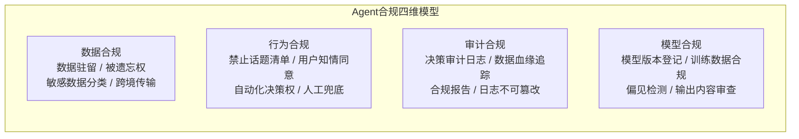
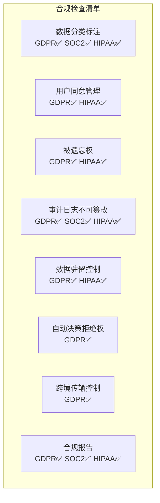

# Agent 合规审计 · GDPR / SOC2 / 数据治理

> **一句话**：企业级 Agent 上线不只是技术问题——数据驻留、用户同意、审计追溯、合规报告，每一项不过关都不能进采购短名单。

---

## 合规框架速览



---

## 代码实现

### 1. 数据分类与标注

```java
package com.enterprise.compliance;

import java.util.regex.*;

/**
 * 敏感数据分类器
 *
 * 在数据进入 Agent 之前，自动识别并标注敏感级别。
 */
public class DataClassifier {

    public SensitivityLevel classify(String text) {
        // PII：个人身份信息
        if (PII_PATTERNS.matcher(text).find()) return SensitivityLevel.PII;
        // PHI：医疗健康信息
        if (PHI_PATTERNS.matcher(text).find()) return SensitivityLevel.PHI;
        // PCI：支付卡信息
        if (PCI_PATTERNS.matcher(text).find()) return SensitivityLevel.PCI;
        // 机密
        if (CONFIDENTIAL.matcher(text).find()) return SensitivityLevel.CONFIDENTIAL;

        return SensitivityLevel.PUBLIC;
    }

    // 中国身份证号
    private static final Pattern ID_CARD =
        Pattern.compile("\\d{17}[\\dXx]");
    // 手机号
    private static final Pattern PHONE =
        Pattern.compile("1[3-9]\\d{9}");
    // 邮箱
    private static final Pattern EMAIL =
        Pattern.compile("[\\w.-]+@[\\w.-]+\\.\\w+");
    // 银行卡号
    private static final Pattern BANK_CARD =
        Pattern.compile("\\d{16,19}");

    private static final Pattern PII_PATTERNS =
        Pattern.compile(ID_CARD.pattern() + "|" + PHONE.pattern()
            + "|" + EMAIL.pattern());
    private static final Pattern PHI_PATTERNS =
        Pattern.compile("(?i)(诊断|处方|病历|检查结果| HIV |癌症|精神)");
    private static final Pattern PCI_PATTERNS =
        Pattern.compile(BANK_CARD.pattern() + "|\\d{4}[\\s-]?\\d{4}[\\s-]?\\d{4}[\\s-]?\\d{4}");
    private static final Pattern CONFIDENTIAL =
        Pattern.compile("(?i)(机密|绝密|内部|confidential|top secret)");

    public enum SensitivityLevel {
        PUBLIC, INTERNAL, CONFIDENTIAL, PII, PHI, PCI
    }
}
```

### 2. 合规策略引擎

```java
package com.enterprise.compliance;

import org.springframework.stereotype.Component;
import java.util.*;

/**
 * 合规策略引擎
 *
 * 根据数据敏感级别 + 用户所在地区，决定 Agent 的处理策略。
 */
@Component
public class CompliancePolicyEngine {

    /**
     * 检查请求是否合规
     */
    public ComplianceDecision check(ComplianceContext ctx) {
        List<String> violations = new ArrayList<>();
        List<String> requiredActions = new ArrayList<>();

        // 1. 数据驻留检查
        if (ctx.sensitivity() == DataClassifier.SensitivityLevel.PHI
            && ctx.userRegion().equals("EU")
            && !ctx.dataResidency().equals("EU")) {
            violations.add("PHI 数据必须存储在 EU 区域");
        }

        // 2. 用户同意检查
        if (ctx.sensitivity().ordinal() >= DataClassifier.SensitivityLevel.PII.ordinal()
            && !ctx.userConsent().aiProcessing()) {
            violations.add("用户未同意 AI 处理敏感数据");
        }

        // 3. 自动化决策权（GDPR Article 22）
        if (ctx.isAutomatedDecision() && !ctx.userConsent().automatedDecision()) {
            violations.add("涉及自动决策但用户未授权");
            requiredActions.add("转人工处理");
        }

        // 4. 跨境数据传输
        if (ctx.crossBorderTransfer()
            && !hasAdequacyDecision(ctx.userRegion(), ctx.processingRegion())) {
            requiredActions.add("需要 SCC（标准合同条款）");
        }

        if (!violations.isEmpty()) {
            return ComplianceDecision.block(violations, requiredActions);
        }

        return ComplianceDecision.allow(requiredActions);
    }

    private boolean hasAdequacyDecision(String from, String to) {
        // 简化——实际查 GDPR adequacy decision 表
        return true;
    }

    public record ComplianceContext(
        String userId, String userRegion(),
        String dataResidency(), String processingRegion(),
        DataClassifier.SensitivityLevel sensitivity,
        UserConsent userConsent,
        boolean crossBorderTransfer,
        boolean isAutomatedDecision
    ) {}

    public record UserConsent(
        boolean aiProcessing,       // 同意 AI 处理
        boolean dataRetention,      // 同意数据留存
        boolean automatedDecision,  // 同意自动决策
        boolean marketing,          // 同意营销
        Instant consentAt           // 同意时间
    ) {}

    public record ComplianceDecision(
        boolean allowed,
        List<String> violations,
        List<String> requiredActions
    ) {
        public static ComplianceDecision allow(List<String> actions) {
            return new ComplianceDecision(true, List.of(), actions);
        }
        public static ComplianceDecision block(List<String> v, List<String> a) {
            return new ComplianceDecision(false, v, a);
        }
    }
}
```

### 3. 不可篡改审计日志

```java
package com.enterprise.compliance;

import org.springframework.stereotype.Component;
import java.nio.charset.StandardCharsets;
import java.security.*;

/**
 * 不可篡改审计日志
 *
 * SOC2 Type II 要求：审计日志不可被修改或删除。
 * 实现方式：每条日志附带前一条的 Hash，形成链式结构。
 */
@Component
public class ImmutableAuditLog {

    private String previousHash = "GENESIS";

    /**
     * 记录 Agent 决策
     */
    public void logDecision(AgentDecision decision) {
        String record = serialize(decision);
        String hash = sha256(record + previousHash);

        // 写入只追加表（append-only）
        jdbc.update("""
            INSERT INTO audit_log
            (id, timestamp, tenant_id, user_id, agent_type,
             decision, input_hash, output_hash,
             model_version, prompt_version,
             record_hash, previous_hash)
            VALUES (?, NOW(), ?, ?, ?, ?, ?, ?, ?, ?, ?, ?)
            """,
            UUID.randomUUID().toString(),
            decision.tenantId(), decision.userId(),
            decision.agentType(), decision.decision(),
            hash(decision.input()), hash(decision.output()),
            decision.modelVersion(), decision.promptVersion(),
            hash, previousHash);

        previousHash = hash;
    }

    /**
     * 验证日志链完整性
     */
    public boolean verifyChain() {
        var rows = jdbc.queryForList(
            "SELECT record_hash, previous_hash FROM audit_log ORDER BY timestamp");

        String prev = "GENESIS";
        for (var row : rows) {
            String expectedPrev = prev;
            String actualPrev = (String) row.get("previous_hash");
            if (!expectedPrev.equals(actualPrev)) {
                return false;  // 链断裂——有篡改！
            }
            prev = (String) row.get("record_hash");
        }
        return true;
    }

    private String sha256(String input) {
        try {
            MessageDigest md = MessageDigest.getInstance("SHA-256");
            byte[] hash = md.digest(input.getBytes(StandardCharsets.UTF_8));
            StringBuilder sb = new StringBuilder();
            for (byte b : hash) sb.append(String.format("%02x", b));
            return sb.toString();
        } catch (NoSuchAlgorithmException e) {
            throw new RuntimeException(e);
        }
    }

    private String hash(String content) {
        return content != null ? sha256(content).substring(0, 16) : "null";
    }

    private String serialize(AgentDecision d) {
        return d.tenantId() + "|" + d.userId() + "|" + d.decision()
            + "|" + d.modelVersion() + "|" + d.promptVersion();
    }

    public record AgentDecision(
        String tenantId, String userId,
        String agentType, String decision,
        String input, String output,
        String modelVersion, String promptVersion
    ) {}
}
```

### 4. 合规报告生成

```java
/**
 * 月度合规报告（自动生成）
 */
@Component
public class ComplianceReportService {

    public ComplianceReport generateMonthly(String tenantId, YearMonth month) {
        return new ComplianceReport(
            tenantId, month,
            // AI 处理请求总数
            countAiRequests(tenantId, month),
            // 被合规策略拦截数
            countBlocked(tenantId, month),
            // 敏感数据检测次数
            countSensitiveData(tenantId, month),
            // 用户行使被遗忘权次数
            countDeletionRequests(tenantId, month),
            // 审计日志完整性
            verifyAuditChain(),
            // 数据驻留合规率
            calculateResidencyCompliance(tenantId, month),
            // 导出为 PDF / JSON
            "SOC2-Report-" + tenantId + "-" + month + ".pdf"
        );
    }

    public record ComplianceReport(
        String tenantId, YearMonth month,
        int totalAiRequests, int blockedRequests,
        int sensitiveDataDetections, int deletionRequests,
        boolean auditChainValid,
        double residencyComplianceRate,
        String exportFile
    ) {}
}
```

---

## 合规检查清单



---

## 关键收获

- **合规不是上线后才想的**——架构设计阶段就要内嵌
- **审计日志不可篡改**——链式 Hash + 只追加表
- **数据分类是一切的起点**——不知道哪些是敏感数据，就谈不上保护
- **GDPR Article 22**：用户有权拒绝纯自动化决策——Agent 系统必须有人工兜底

→ 返回 [阶段4 目录](../00-README.md)
