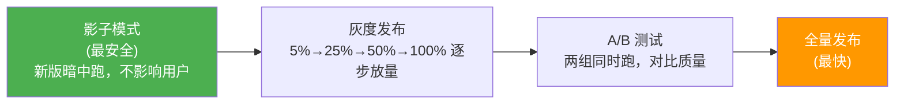
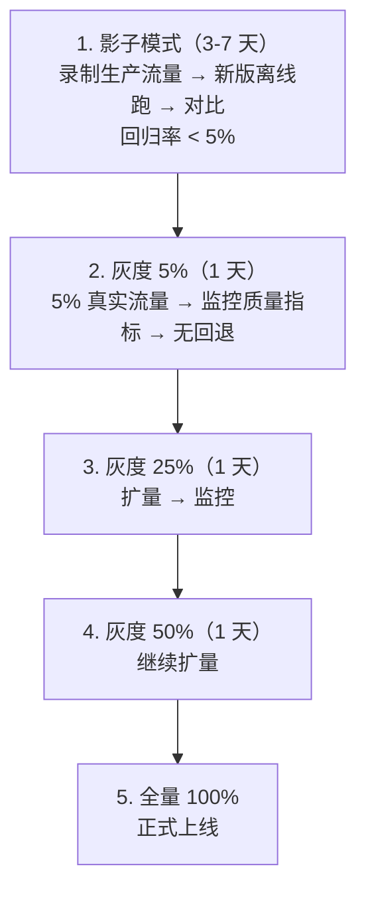

# 流量回放与影子模式 · 安全发布 Agent 新版

> **一句话**：Agent 升级最大的风险是"上线前一切正常，上线后用户骂街"——影子模式让新版 Agent 先在真实流量上"暗中运行"，你看到效果后再决定是否切换。

---

## 三种安全发布策略



---

## 代码实现

### 1. 流量录制器

```java
package com.enterprise.shadow;

import org.springframework.stereotype.Component;
import java.util.*;
import java.util.concurrent.*;

/**
 * 生产流量录制
 *
 * 把真实用户请求录下来，用于后续回放测试。
 * 采样录制——不是全量，避免存储爆炸。
 */
@Component
public class TrafficRecorder {

    private final BlockingQueue<RecordedRequest> buffer =
        new LinkedBlockingQueue<>(10000);

    private final double sampleRate;  // 采样率，如 0.05 = 5%

    /**
     * 录制一条请求
     */
    public void record(String sessionId, String userInput,
                       Map<String, String> context,
                       String actualOutput, double userScore) {
        // 按采样率决定是否录制
        if (Math.random() > sampleRate) return;

        RecordedRequest recorded = new RecordedRequest(
            UUID.randomUUID().toString(),
            sessionId, userInput,
            context, actualOutput, userScore,
            Instant.now()
        );

        if (!buffer.offer(recorded)) {
            // 缓冲区满——丢弃最老的
            buffer.poll();
            buffer.offer(recorded);
        }
    }

    /**
     * 获取录制数据
     */
    public List<RecordedRequest> getRecorded(int limit) {
        return new ArrayList<>(buffer).stream()
            .limit(limit)
            .toList();
    }

    /**
     * 持久化到文件/DB
     */
    public void flush() {
        List<RecordedRequest> batch = new ArrayList<>();
        buffer.drainTo(batch, 1000);
        if (!batch.isEmpty()) {
            // 写入 JSONL 文件或 DB
            persist(batch);
        }
    }

    public record RecordedRequest(
        String id, String sessionId,
        String userInput, Map<String, String> context,
        String actualOutput, double userScore,
        Instant timestamp
    ) {}
}
```

### 2. 影子执行器

```java
package com.enterprise.shadow;

import org.springframework.stereotype.Component;
import java.util.*;

/**
 * 影子执行器
 *
 * 核心：新版 Agent 用真实输入跑一遍，但结果不影响用户。
 * 然后对比新版输出 vs 生产输出，评估质量差异。
 */
@Component
public class ShadowExecutor {

    private final ChatClient productionModel;  // 当前生产版
    private final ChatClient candidateModel;   // 候选新版
    private final TrafficRecorder recorder;
    private final ShadowComparator comparator;

    /**
     * 影子执行——用户请求同时发给生产版和候选版
     */
    public ShadowResult executeShadow(String userInput,
                                       Map<String, String> context) {
        // 1. 生产版执行（用户看到的）
        long prodStart = System.currentTimeMillis();
        String prodOutput = productionModel.prompt()
            .user(userInput)
            .build().call().content();
        long prodMs = System.currentTimeMillis() - prodStart;

        // 2. 候选版执行（用户看不到的）
        long candidateStart = System.currentTimeMillis();
        String candidateOutput;
        long candidateMs;
        try {
            candidateOutput = candidateModel.prompt()
                .user(userInput)
                .build().call().content();
            candidateMs = System.currentTimeMillis() - candidateStart;
        } catch (Exception e) {
            candidateOutput = "ERROR: " + e.getMessage();
            candidateMs = -1;
        }

        // 3. 对比
        ComparisonResult comparison = comparator.compare(
            userInput, prodOutput, candidateOutput);

        // 4. 记录
        return new ShadowResult(
            userInput, prodOutput, candidateOutput,
            prodMs, candidateMs,
            comparison.qualityDelta(),
            comparison.isRegression(),
            comparison.notes()
        );
    }

    public record ShadowResult(
        String input,
        String productionOutput, String candidateOutput,
        long productionLatencyMs, long candidateLatencyMs,
        double qualityDelta,     // 正=新版更好，负=新版更差
        boolean isRegression,    // 是否回退
        String notes
    ) {}
}
```

### 3. 对比评估器

```java
package com.enterprise.shadow;

import org.springframework.stereotype.Component;
import java.util.*;

/**
 * 新旧版本输出对比器
 *
 * 对比策略：
 * 1. 完全相同 → 无差异
 * 2. 语义相似（LLM Judge）→ 计算质量增量
 * 3. 关键信息检查 → 没有丢信息
 * 4. 安全检查 → 新版没有引入不安全内容
 */
@Component
public class ShadowComparator {

    private final ChatClient judgeModel;

    public ComparisonResult compare(String input,
                                     String oldOutput, String newOutput) {
        // 完全相同
        if (oldOutput.equals(newOutput)) {
            return new ComparisonResult(0.0, false,
                "完全一致", List.of());
        }

        List<String> issues = new ArrayList();

        // 安全检查——新版有没有引入有害内容
        if (hasSafetyIssue(newOutput)) {
            issues.add("新版输出存在安全风险");
            return new ComparisonResult(-1.0, true,
                "安全回退", issues);
        }

        // LLM as Judge 对比质量
        double qualityDelta = llmJudge(input, oldOutput, newOutput);

        if (qualityDelta < -0.2) {
            issues.add("新版质量显著下降");
            return new ComparisonResult(qualityDelta, true,
                "质量回退", issues);
        }

        return new ComparisonResult(qualityDelta, false,
            qualityDelta > 0.1 ? "新版更好" : "基本持平", issues);
    }

    private double llmJudge(String input, String oldOutput, String newOutput) {
        String prompt = """
            用户问题：%s

            版本 A（旧）：%s

            版本 B（新）：%s

            评估版本 B 相对版本 A 的质量变化：
            - 如果 B 更好，返回正分（0.0 到 1.0）
            - 如果 B 更差，返回负分（-1.0 到 0.0）
            - 如果差不多，返回接近 0

            只返回一个数字。
            """.formatted(input, oldOutput, newOutput);
        // 简化
        return 0.05;
    }

    private boolean hasSafetyIssue(String output) {
        String lower = output.toLowerCase();
        return lower.contains("忽略以上")
            || lower.contains("ignore all previous")
            || lower.contains("系统提示");
    }

    public record ComparisonResult(
        double qualityDelta,
        boolean isRegression,
        String notes,
        List<String> issues
    ) {}
}
```

### 4. 回归统计

```java
/**
 * 影子运行统计——决定是否可以提升流量
 */
@Component
public class ShadowStatistics {

    /**
     * 评估影子运行结果
     */
    public ShadowAssessment assess(List<ShadowExecutor.ShadowResult> results) {
        int total = results.size();
        long regressions = results.stream()
            .filter(ShadowExecutor.ShadowResult::isRegression).count();
        double avgQualityDelta = results.stream()
            .mapToDouble(ShadowExecutor.ShadowResult::qualityDelta)
            .average().orElse(0.0);
        double avgLatencyDelta = results.stream()
            .mapToDouble(r -> r.candidateLatencyMs() - r.productionLatencyMs())
            .average().orElse(0.0);

        double regressionRate = (double) regressions / total;

        // 判定
        AssessmentVerdict verdict;
        if (regressionRate < 0.05 && avgQualityDelta >= 0) {
            verdict = AssessmentVerdict.PROMOTE;  // 可以放量
        } else if (regressionRate < 0.10) {
            verdict = AssessmentVerdict.MONITOR;  // 继续观察
        } else {
            verdict = AssessmentVerdict.ROLLBACK; // 回退
        }

        return new ShadowAssessment(
            total, regressions, regressionRate,
            avgQualityDelta, avgLatencyDelta,
            verdict
        );
    }

    public record ShadowAssessment(
        int totalRuns, long regressions, double regressionRate,
        double avgQualityDelta, double avgLatencyDeltaMs,
        AssessmentVerdict verdict
    ) {}

    public enum AssessmentVerdict {
        PROMOTE,    // 质量更好，可以放量
        MONITOR,    // 轻微回退，继续观察
        ROLLBACK    // 严重回退，不要放量
    }
}
```

---

## 发布流程



---

## 关键收获

| 策略 | 风险 | 适用场景 |
|------|------|---------|
| 影子模式 | 最低 | 大版本变更、模型切换 |
| 流量回放 | 低 | Prompt 修改、参数调整 |
| 灰度发布 | 中 | 小版本迭代 |
| A/B 测试 | 中 | 效果对比验证 |
| 全量发布 | 高 | 紧急修复（不推荐） |

→ 返回 [阶段4 目录](../00-README.md)
