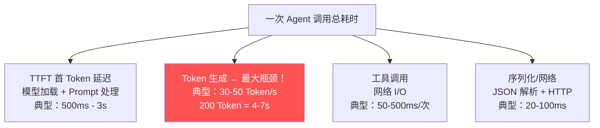

# Agent 性能调优 · Token 与延迟优化

> **一句话**：Agent 的延迟 = LLM 生成时间 + 工具调用时间 + 网络时间——砍 Token 等于砍延迟，砍延迟等于砍成本。

---

## 性能瓶颈在哪？



**核心结论**：Token 生成是最大瓶颈。砍 50% 输出 Token ≈ 砍 50% 延迟。

---

## 六大优化手段

### 手段 1：Prompt 精简——砍输入 Token

```java
/**
 * Prompt Token 分析器
 *
 * 大多数 Agent 的 Prompt 都有 30-50% 的冗余。
 */
@Component
public class PromptOptimizer {

    /**
     * 分析 Prompt 的 Token 浪费
     */
    public PromptAnalysis analyze(String prompt) {
        int totalTokens = estimateTokens(prompt);

        List<String> wastes = new ArrayList<>();
        int wastedTokens = 0;

        // 检查 1：重复的指令
        if (countOccurrences(prompt, "你是") > 1) {
            wastes.add("重复的角色定义");
            wastedTokens += 20;
        }

        // 检查 2：过长的示例（Few-shot 过度）
        if (prompt.split("示例").length > 4) {
            wastes.add("Few-shot 示例过多");
            wastedTokens += 200;
        }

        // 检查 3：不必要的格式说明
        if (prompt.contains("请按照以下 JSON 格式")
            && prompt.contains("{") && prompt.contains("}")) {
            // JSON schema 本身就消耗大量 Token
            wastes.add("冗长的 JSON schema");
            wastedTokens += 100;
        }

        // 检查 4：历史对话过长
        // ... 检查 context window 使用情况

        double wasteRate = (double) wastedTokens / totalTokens;
        return new PromptAnalysis(totalTokens, wastedTokens, wasteRate, wastes);
    }

    /**
     * 精简 Prompt
     */
    public String optimize(String prompt) {
        return prompt
            // 移除重复的角色定义
            .replaceAll("(?s)(你是.*?)(你是.*?)(?=$)", "$1")
            // 精简格式说明
            .replace("请按照以下JSON格式输出：", "输出JSON：")
            // 移除多余空行
            .replaceAll("\n{3,}", "\n\n");
    }

    private int estimateTokens(String text) {
        // 粗略估计：中文 1 字 ≈ 2 Token，英文 4 字符 ≈ 1 Token
        return (int) (text.length() * 1.5);
    }

    public record PromptAnalysis(
        int totalTokens, int wastedTokens,
        double wasteRate, List<String> wastes
    ) {}
}
```

### 手段 2：语义缓存——砍重复调用

```java
/**
 * 语义缓存
 *
 * 用户问 "怎么重置密码" 和 "密码忘了怎么办"
 * → 语义相同 → 命中缓存 → 跳过 LLM 调用
 *
 * 缓存命中率 20-40% = 直接砍 20-40% 的延迟和成本
 */
@Component
public class SemanticCache {

    private final VectorStore vectorStore;  // PgVector

    public Optional<String> tryCache(String userInput, String tenantId) {
        // 1. 生成输入的向量
        float[] queryVec = embedding(input);

        // 2. 在缓存中找语义相似的
        List<CachedResponse> hits = vectorStore.search(
            queryVec, tenantId, topK=1, threshold=0.95);

        if (!hits.isEmpty()) {
            CachedResponse hit = hits.get(0);
            // 3. 检查缓存是否过期
            if (hit.createdAt().isAfter(Instant.now().minus(24, HOURS))) {
                return Optional.of(hit.response());
            }
        }
        return Optional.empty();
    }

    public void put(String input, String response, String tenantId) {
        vectorStore.store(embedding(input), response, tenantId);
    }
}
```

### 手段 3：模型路由——简单问题用快模型

```java
/**
 * 智能模型路由
 *
 * 80% 的请求是简单问题 → 用快速小模型
 * 20% 的请求是复杂问题 → 用强力大模型
 *
 * 平均延迟降低 40-60%
 */
@Component
public class ModelRouter {

    public String route(String userInput) {
        // 规则 1：关键词路由
        if (isSimpleQuery(userInput)) {
            return "deepseek-chat";      // 快速模型
        }

        // 规则 2：Token 估算路由
        int estimatedTokens = estimateTokens(userInput);
        if (estimatedTokens > 2000) {
            return "deepseek-chat";      // 长输入也用快速模型
        }

        // 规则 3：复杂推理用大模型
        if (requiresReasoning(userInput)) {
            return "deepseek-reasoner";  // 强力模型
        }

        return "deepseek-chat";  // 默认快速
    }

    private boolean isSimpleQuery(String input) {
        return input.length() < 50
            && SIMPLE_PATTERNS.matcher(input).find();
    }

    private static final Pattern SIMPLE_PATTERNS =
        Pattern.compile("(?i)(你好|hi|hello|谢谢|帮我查|是什么|怎么用)");
}
```

### 手段 4：流式输出——砍感知延迟

```java
/**
 * 流式输出 → 用户看到首 Token 的延迟从 5s 降到 0.5s
 *
 * 虽然 E2E 延迟没变，但用户感知延迟大幅缩短。
 */
@GetMapping(value = "/chat/stream", produces = MediaType.TEXT_EVENT_STREAM_VALUE)
public Flux<String> streamChat(@RequestParam String message) {
    return chatClient.prompt()
        .user(message)
        .stream()
        .content()
        // 首个 Token 到达时记录 TTFT
        .doOnNext(first -> ttftMetrics.record(System.currentTimeMillis() - start));
}
```

### 手段 5：工具并行调用

```java
/**
 * 并行工具调用 → 总耗时 = max(各工具)，而不是 sum(各工具)
 *
 * 串行：DB查询(200ms) + API调用(500ms) + 搜索(300ms) = 1000ms
 * 并行：max(DB查询, API调用, 搜索) = 500ms
 */
public CompletableFuture<ToolResults> parallelToolCall(
        List<ToolCall> toolCalls) {

    // 所有工具并行执行
    List<CompletableFuture<ToolResult>> futures = toolCalls.stream()
        .map(tc -> CompletableFuture.supplyAsync(
            () -> executeTool(tc), toolExecutor))
        .toList();

    // 等待全部完成
    return CompletableFuture.allOf(futures.toArray(new CompletableFuture[0]))
        .thenApply(v -> futures.stream()
            .map(CompletableFuture::join)
            .collect(toCollection()));
}
```

### 手段 6：上下文窗口管理——砍历史 Token

```java
/**
 * 上下文压缩——长对话的 Token 爆炸
 *
 * 10 轮对话后，历史消息可能占 3000+ Token
 * 压缩策略：旧消息摘要 + 近期消息保留
 */
@Component
public class ContextCompressor {

    public List<Message> compress(List<Message> history) {
        if (history.size() <= 6) return history;

        // 保留最近 4 条
        List<Message> recent = history.subList(history.size() - 4, history.size());

        // 旧消息摘要
        String oldSummary = summarize(history.subList(0, history.size() - 4));

        // 组装：摘要 + 近期消息
        List<Message> compressed = new ArrayList<>();
        compressed.add(new SystemMessage("之前的对话摘要：" + oldSummary));
        compressed.addAll(recent);

        return compressed;  // Token 从 3000 降到 ~800
    }

    private String summarize(List<Message> old) {
        // 用 LLM 做摘要
        return chatClient.prompt()
            .system("把以下对话压缩成 100 字以内的摘要，保留关键信息。")
            .user(messagesToString(old))
            .call().content();
    }
}
```

---

## 性能基准与 SLO

| 指标 | 优秀 | 可接受 | 不可接受 |
|------|------|--------|---------|
| TTFT | < 800ms | < 2s | > 3s |
| E2E 延迟 | < 3s | < 8s | > 15s |
| Token 效率 | < 200 Token/回复 | < 500 | > 1000 |
| 工具调用延迟 | < 100ms | < 300ms | > 1s |
| 缓存命中率 | > 30% | > 10% | < 5% |

---

## 优化效果矩阵

| 手段 | 延迟降低 | 成本降低 | 实现难度 |
|------|---------|---------|---------|
| Prompt 精简 | 10-20% | 10-20% | ⭐⭐ |
| 语义缓存 | 20-40% | 20-40% | ⭐⭐⭐ |
| 模型路由 | 30-50% | 40-60% | ⭐⭐ |
| 流式输出 | 80% 感知延迟 | 0% | ⭐ |
| 工具并行 | 30-60% | 0% | ⭐⭐⭐ |
| 上下文压缩 | 15-30% | 15-30% | ⭐⭐⭐ |

→ 返回 [阶段4 目录](../00-README.md)

---

## 延伸阅读：性能调优深化路线

| 方向 | 文档 | 内容 |
|------|------|------|
| 推理加速 | [35-推理加速与模型服务](35-Agent推理加速与模型服务.md) | vLLM/量化/KV Cache |
| 推理前沿 | [阶段6-10-推理优化前沿](../阶段6-前沿/10-Agent推理优化前沿.md) | PagedAttention/Speculative Decoding |
| 上下文工程 | [01-上下文工程](01-上下文工程.md) | Token 裁剪优化 |
| 成本工程 | [28-LLM成本工程深入](28-LLM成本工程深入.md) | 性能与成本平衡 |
| 模型路由 | [理论字典-模型路由](../理论字典/模型路由.md) | 简单任务走小模型 |
| 模型蒸馏 | [阶段6-08-模型蒸馏](../阶段6-前沿/08-模型蒸馏与小模型部署.md) | 小模型边缘部署 |
