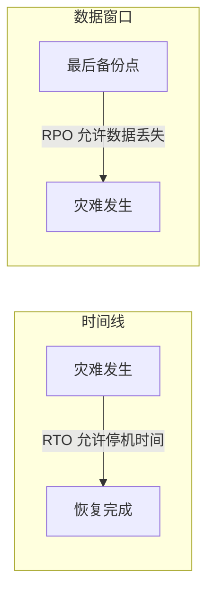

# 灾备与多活部署 · Agent 系统的灾难恢复

> **一句话**：你的 Agent 跑在单个 Region、单个 DB 上——一次云厂商故障，所有用户的 AI 助手集体宕机。

---

## RTO / RPO 概念



| SLO | 含义 | Agent 典型 |
|-----|------|-----------|
| RTO | 恢复时间目标 | < 5 分钟 |
| RPO | 数据丢失目标 | < 1 分钟 |

---

## 架构模式

**模式 1：主备（Active-Passive）**

> RTO: 5-15 min　RPO: 1-5 min

**模式 2：双活（Active-Active）**

> RTO: ≈ 0　RPO: ≈ 0

**模式 3：多活 + 就近路由**

> 按用户地理位置路由，数据驻留合规

---

## 代码实现

### 1. 健康探测与故障转移

```java
package com.enterprise.dr;

import org.springframework.stereotype.Component;
import java.util.*;
import java.util.concurrent.*;

/**
 * 区域健康探测 + 自动故障转移
 */
@Component
public class RegionFailoverManager {

    private final Map<String, RegionHealth> regions = new ConcurrentHashMap<>();

    /**
     * 区域健康状态
     */
    public enum RegionStatus {
        HEALTHY,      // 健康，正常接流量
        DEGRADED,     // 降级（延迟升高），减少流量
        UNHEALTHY,    // 不健康，停止接流量
        ISOLATED      // 隔离（手动摘除）
    }

    public record RegionHealth(
        String region,           // 如 "bj-east", "sh-south"
        String endpoint,         // Agent 服务地址
        RegionStatus status,
        double healthScore,      // 0.0-1.0
        long lastCheckMs,
        int consecutiveFailures
    ) {}

    /**
     * 选择最优区域
     */
    public RegionHealth selectRegion(String userLocation) {
        return regions.values().stream()
            .filter(r -> r.status() == RegionStatus.HEALTHY)
            .filter(r -> r.healthScore() > 0.7)
            .min(Comparator.comparingDouble(
                r -> distance(userLocation, r.region())))
            .orElseThrow(() -> new RuntimeException("无可用区域"));
    }

    /**
     * 健康探测任务（每 10 秒）
     */
    @Scheduled(fixedRate = 10_000)
    public void healthCheck() {
        for (String region : regions.keySet()) {
            CompletableFuture.runAsync(() -> probe(region));
        }
    }

    private void probe(String region) {
        long start = System.currentTimeMillis();
        try {
            // 调用区域 Agent 的健康检查接口
            String url = regions.get(region).endpoint() + "/actuator/health";
            String result = restClient.get().uri(url).retrieve().body(String.class);
            long latency = System.currentTimeMillis() - start;

            // 更新健康分数
            updateHealth(region, latency, true);

        } catch (Exception e) {
            updateHealth(region, -1, false);
        }
    }

    private void updateHealth(String region, long latency, boolean success) {
        RegionHealth current = regions.get(region);
        int failures = success ? 0 : current.consecutiveFailures() + 1;

        // 计算健康分数
        double score = success
            ? Math.max(0, 1.0 - (latency / 5000.0))  // 延迟越低分越高
            : Math.max(0, current.healthScore() - 0.3);  // 失败扣分

        // 状态判定
        RegionStatus status;
        if (failures >= 3) status = RegionStatus.UNHEALTHY;
        else if (score < 0.5) status = RegionStatus.DEGRADED;
        else status = RegionStatus.HEALTHY;

        regions.put(region, new RegionHealth(
            region, current.endpoint(), status, score,
            System.currentTimeMillis(), failures
        ));
    }

    private double distance(String a, String b) {
        // 简化——实际用地理位置坐标计算
        return Math.random();
    }
}
```

### 2. 会话级灾备

```java
package com.enterprise.dr;

import org.springframework.stereotype.Component;
import java.util.*;

/**
 * Agent 会话级灾备
 *
 * 用户和 Agent 的对话不能因为区域故障中断。
 * 会话状态实时同步到备区域。
 */
@Component
public class SessionReplicationService {

    /**
     * 同步会话状态到备区域
     */
    public void replicate(SessionState state) {
        // 1. 序列化
        String serialized = serialize(state);

        // 2. 写入主区域（同步）
        redisPrimary.setex(
            "session:" + state.sessionId(),
            3600,  // TTL 1 小时
            serialized);

        // 3. 异步同步到备区域
        CompletableFuture.runAsync(() -> {
            try {
                redisBackup.setex(
                    "session:" + state.sessionId(),
                    3600,
                    serialized);
            } catch (Exception e) {
                // 记录同步失败，后续补偿
                logReplicationFailure(state.sessionId(), e);
            }
        });
    }

    /**
     * 从备区域恢复会话
     */
    public Optional<SessionState> recover(String sessionId) {
        // 先查主区域
        String data = redisPrimary.get("session:" + sessionId);
        if (data != null) {
            return Optional.of(deserialize(data));
        }

        // 主区域没有 → 查备区域
        data = redisBackup.get("session:" + sessionId);
        if (data != null) {
            // 恢复到主区域
            redisPrimary.setex("session:" + sessionId, 3600, data);
            return Optional.of(deserialize(data));
        }

        return Optional.empty();
    }

    public record SessionState(
        String sessionId, String userId, String tenantId,
        List<Message> history,
        String currentRegion,
        Instant lastActiveAt
    ) {}
}
```

### 3. 自动化灾备 Runbook

```java
/**
 * 自动故障转移 Runbook
 *
 * 当一个区域不可用时，自动执行：
 * 1. 摘除故障区域流量
 * 2. 将用户路由到健康区域
 * 3. 恢复会话状态
 * 4. 告警通知
 * 5. 人工 Go/No-Go 决策点
 */
@Component
public class FailoverRunbook {

    public FailoverResult execute(String failingRegion) {
        // Step 1: 标记故障区域
        failoverManager.markRegion(failingRegion,
            RegionFailoverManager.RegionStatus.UNHEALTHY);

        // Step 2: 确保有健康区域可以接管
        List<RegionHealth> healthy = failoverManager
            .getHealthyRegions();
        if (healthy.isEmpty()) {
            alertService.page("全区域故障！无法故障转移！");
            return FailoverResult.failed("无健康区域");
        }

        // Step 3: 通知值班
        alertService.notify("正在执行故障转移："
            + failingRegion + " → " + healthy.get(0).region());

        // Step 4: 会话恢复
        // 用户的下一个请求会自动路由到新区域
        // 新区域从备 Redis 恢复会话状态

        return FailoverResult.success(
            failingRegion,
            healthy.get(0).region(),
            "故障转移完成，用户会话已恢复");
    }
}
```

---

## 灾备演练

```bash
# 1. 模拟区域故障
curl -X POST http://ops-platform/api/chaos/region-down \
  -d '{"region":"bj-east","duration":300}'

# 2. 观察
# → 10 秒内：健康探测发现 bj-east 不可用
# → 15 秒内：流量自动切换到 sh-south
# → 30 秒内：用户会话从备份恢复
# → 5 分钟后：bj-east 恢复，流量逐渐切回

# 3. 验证 RTO/RPO
# → RTO（恢复时间）：< 30s ✓
# → RPO（数据丢失）：< 10s ✓（异步同步窗口）
```

---

## 关键收获

| 维度 | 主备 | 双活 | 多活 |
|------|------|------|------|
| RTO | 5-15 min | ≈ 0 | ≈ 0 |
| RPO | 1-5 min | ≈ 0 | ≈ 0 |
| 成本 | 1.5x | 2x | 3x+ |
| 复杂度 | 中 | 高 | 很高 |
| 适用 | 中等关键 | 高关键 | 全球服务 |

→ 返回 [阶段4 目录](../00-README.md)

---

## 延伸阅读：灾备深化路线

| 方向 | 文档 | 内容 |
|------|------|------|
| 可靠性工程 | [02-Agent可靠性工程](02-Agent可靠性工程.md) | 幂等/重试/持久化 |
| 多模型故障切换 | [11-多模型故障切换](11-多模型故障切换.md) | LLM Provider 故障切换 |
| 健康检查 | [阶段5-10-健康检查与熔断器](../阶段5-架构师/10-Agent健康检查与熔断器.md) | 多维度健康检查 |
| 容量规划 | [24-容量规划与弹性伸缩](24-容量规划与弹性伸缩.md) | 弹性伸缩设计 |
| SLO 管理 | [36-SLO管理](36-AgentSLO管理.md) | RTO/RPO 与 SLO 对齐 |
| Docker/K8s | [附录-Docker与Kubernetes速成](../附录/Docker与Kubernetes速成.md) | K8s 部署实践 |
