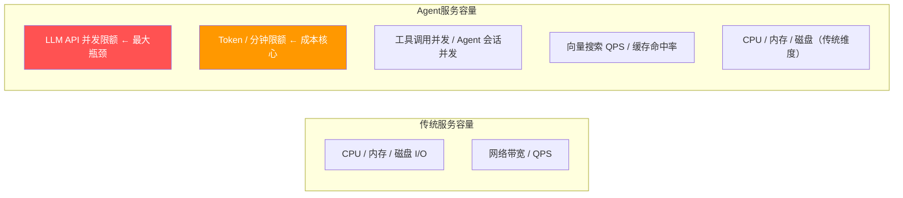

# 容量规划与弹性伸缩 · Agent 资源管理

> **一句话**：Agent 系统的资源消耗和传统服务完全不同——一个用户可能触发 10 次 LLM 调用 + 5 次工具调用——你需要知道"1000 个用户到底需要多少 GPU / 多少 Token 配额"。

---

## 容量维度



---

## 代码实现

### 1. 容量模型

```java
package com.enterprise.capacity;

import org.springframework.stereotype.Component;

/**
 * Agent 容量模型
 *
 * 精确计算"N 个并发用户需要多少资源"。
 */
@Component
public class CapacityModel {

    /**
     * 计算资源需求
     *
     * 输入：预期并发用户数
     * 输出：每个维度的资源需求
     */
    public CapacityRequirement calculate(int concurrentUsers) {
        // 假设每个用户平均一次交互包含：
        // - 1-3 次 LLM 调用（Agent 循环）
        // - 1-2 次工具调用
        // - 每次回复 ~200 output token

        // LLM 并发
        // LLM API 通常限制并发（如 DeepSeek 默认 10-50 并发）
        int llmConcurrencyPerUser = 2;  // 平均 2 个并发 LLM 请求
        int requiredLlmConcurrency = concurrentUsers * llmConcurrencyPerUser;

        // Token 需求
        int avgInputTokensPerCall = 500;
        int avgOutputTokensPerCall = 200;
        int callsPerInteraction = 2;  // Agent 循环平均 2 轮
        int tokensPerInteraction = (avgInputTokensPerCall + avgOutputTokensPerCall) * callsPerInteraction;

        // 假设每个用户每分钟 1 次交互
        int tokensPerMinute = concurrentUsers * tokensPerInteraction;

        // 工具调用
        int toolCallsPerUser = 2;
        int requiredToolConcurrency = concurrentUsers * toolCallsPerUser / 3;  // 不是同时调

        // 向量搜索
        int ragQueriesPerUser = 1;
        int requiredVectorQps = concurrentUsers * ragQueriesPerUser / 60;

        // Redis 缓存
        int redisConnections = concurrentUsers * 2;  // 会话 + 缓存

        // 数据库连接
        int dbConnections = concurrentUsers / 5;  // 连接池复用

        return new CapacityRequirement(
            requiredLlmConcurrency,
            tokensPerMinute,
            requiredToolConcurrency,
            requiredVectorQps,
            redisConnections,
            dbConnections,
            concurrentUsers
        );
    }

    public record CapacityRequirement(
        int llmConcurrency,       // LLM 并发数
        int tokensPerMinute,      // Token/分钟
        int toolConcurrency,      // 工具并发
        int vectorSearchQps,      // 向量搜索 QPS
        int redisConnections,     // Redis 连接
        int dbConnections,        // DB 连接
        int concurrentUsers       // 并发用户
    ) {

        public String formatReport() {
            return """
                ╔══════════════════════════════════════╗
                ║       容量规划报告（%d 并发用户）       ║
                ╠══════════════════════════════════════╣
                ║ LLM 并发需求：%d                     ║
                ║ Token/分钟：%d                       ║
                ║ 工具并发：%d                         ║
                ║ 向量搜索 QPS：%.1f                   ║
                ║ Redis 连接：%d                       ║
                ║ DB 连接：%d                          ║
                ║ 预估成本/月：¥%,.2f                 ║
                ╚══════════════════════════════════════╝
                """.formatted(
                concurrentUsers,
                llmConcurrency,
                tokensPerMinute,
                toolConcurrency,
                (double) vectorSearchQps,
                redisConnections,
                dbConnections,
                estimateMonthlyCost()
            );
        }

        public double estimateMonthlyCost() {
            // Token 成本（DeepSeek 定价简化）
            double tokenCostPerMonth = tokensPerMinute * 60 * 24 * 30 * 0.001 / 1_000_000 * 14.0;
            // 基础设施成本
            double infraCost = 3000;  // 服务器
            return tokenCostPerMonth + infraCost;
        }
    }
}
```

### 2. 弹性伸缩控制器

```java
package com.enterprise.capacity;

import org.springframework.stereotype.Component;
import java.util.concurrent.*;

/**
 * Agent 弹性伸缩
 *
 * 和传统 HPA（Horizontal Pod Autoscaler）不同：
 * Agent 的瓶颈不是 CPU/内存，而是 LLM API 限额和 Token 配额。
 */
@Component
public class AgentAutoscaler {

    private final CapacityMonitor monitor;

    /**
     * 伸缩决策
     */
    public ScalingDecision evaluate() {
        // 当前负载
        double llmConcurrencyUsage = monitor.getLlmConcurrencyUsage();  // 0.0-1.0
        double tokenBudgetUsage = monitor.getTokenBudgetUsage();        // 0.0-1.0
        int activeSessions = monitor.getActiveSessions();
        double avgResponseTime = monitor.getAvgResponseTimeMs();

        // 扩容条件
        if (llmConcurrencyUsage > 0.8 || avgResponseTime > 8000) {
            return ScalingDecision.scaleUp(
                "LLM 并发使用率 %.0f%% 或平均延迟 %.0fms".formatted(
                    llmConcurrencyUsage * 100, avgResponseTime),
                calculateScaleUpCount(llmConcurrencyUsage)
            );
        }

        // 缩容条件
        if (llmConcurrencyUsage < 0.3 && activeSessions < 10) {
            return ScalingDecision.scaleDown(
                "LLM 并发使用率 %.0f%%，活跃会话 %d".formatted(
                    llmConcurrencyUsage * 100, activeSessions),
                1  // 减少一个实例
            );
        }

        return ScalingDecision.hold();
    }

    /**
     * 计算需要扩容多少
     */
    private int calculateScaleUpCount(double usage) {
        // 目标使用率 70%
        double overloadRatio = usage / 0.7;
        return (int) Math.ceil(overloadRatio) - 1;
    }

    public record ScalingDecision(
        Action action,
        String reason,
        int instanceDelta
    ) {
        public static ScalingDecision scaleUp(String reason, int delta) {
            return new ScalingDecision(Action.SCALE_UP, reason, delta);
        }
        public static ScalingDecision scaleDown(String reason, int delta) {
            return new ScalingDecision(Action.SCALE_DOWN, reason, -delta);
        }
        public static ScalingDecision hold() {
            return new ScalingDecision(Action.HOLD, "负载正常", 0);
        }
    }

    public enum Action { SCALE_UP, SCALE_DOWN, HOLD }
}

/**
 * 容量监控——实时采集负载指标
 */
@Component
class CapacityMonitor {

    private final AgentMetrics metrics;

    public double getLlmConcurrencyUsage() {
        // 当前 LLM 并发 / 配额
        int current = metrics.getCurrentLlmConcurrency();
        int limit = metrics.getLlmConcurrencyLimit();
        return (double) current / limit;
    }

    public double getTokenBudgetUsage() {
        // 今日已用 Token / 今日配额
        long used = metrics.getTokensUsedToday();
        long budget = metrics.getDailyTokenBudget();
        return (double) used / budget;
    }

    public int getActiveSessions() {
        return metrics.getActiveSessionCount();
    }

    public double getAvgResponseTimeMs() {
        return metrics.getAvgE2ELatencyMs();
    }
}
```

### 3. 限流保护

```java
/**
 * 多维限流器
 *
 * Agent 系统需要多维限流：
 * 1. 用户级：防止单用户刷接口
 * 2. 租户级：防止大租户挤占小租户
 * 3. 平台级：防止整体超载
 */
@Component
public class MultiDimensionalRateLimiter {

    /**
     * 检查是否允许请求
     */
    public RateLimitResult check(String userId, String tenantId) {
        // 1. 用户级限流
        if (!userLimiter.tryAcquire(userId)) {
            return RateLimitResult.denied("USER_RATE_LIMIT",
                "用户请求过于频繁，请稍后重试");
        }

        // 2. 租户级限流
        if (!tenantLimiter.tryAcquire(tenantId)) {
            return RateLimitResult.denied("TENANT_RATE_LIMIT",
                "租户并发已达上限，请升级套餐");
        }

        // 3. 平台级限流
        if (!platformLimiter.tryAcquire()) {
            return RateLimitResult.denied("PLATFORM_CAPACITY",
                "系统繁忙，请稍后重试");
        }

        return RateLimitResult.allowed();
    }

    /**
     * 用户级：10 次/分钟
     */
    private final RateLimiter userLimiter =
        RateLimiter.create(10.0);  // Guava RateLimiter

    /**
     * 租户级：根据套餐等级
     */
    private final Map<String, RateLimiter> tenantLimiters = new ConcurrentHashMap<>();

    private boolean tenantLimiter_tryAcquire(String tenantId) {
        TenantPlan plan = tenantService.getPlan(tenantId);
        RateLimiter limiter = tenantLimiters.computeIfAbsent(tenantId,
            k -> RateLimiter.create(plan.rpmLimit()));  // 如 Free=50, Pro=500, Enterprise=5000
        return limiter.tryAcquire();
    }

    /**
     * 平台级：基于 LLM 并发容量
     */
    private final Semaphore platformLimiter = new Semaphore(100);  // 最多 100 并发

    public record RateLimitResult(boolean allowed, String reason, String message) {
        public static RateLimitResult allowed() {
            return new RateLimitResult(true, null, null);
        }
        public static RateLimitResult denied(String reason, String message) {
            return new RateLimitResult(false, reason, message);
        }
    }
}
```

---

## 容量规划速算表

| 并发用户 | LLM 并发 | Token/分钟 | 月成本估算 | 适用方案 |
|---------|---------|-----------|-----------|---------|
| 10 | 20 | 14,000 | ¥3,500 | 单实例 |
| 100 | 200 | 140,000 | ¥9,000 | 3-5 实例 |
| 1,000 | 2,000 | 1,400,000 | ¥40,000 | K8s + 专线 |
| 10,000 | 20,000 | 14,000,000 | ¥350,000 | 多区域 + 专线 |

---

## 关键收获

- **Agent 容量 ≠ 传统容量**——LLM API 限额才是真正瓶颈
- **Token 是新的 QPS**——用 Token/分钟来衡量容量
- **多维限流**——用户 + 租户 + 平台三层保护
- **成本和容量正相关**——容量规划就是成本规划

→ 返回 [阶段4 目录](../00-README.md)

---

## 延伸阅读：容量规划深化路线

| 方向 | 文档 | 内容 |
|------|------|------|
| 速率限制 | [阶段5-09-速率限制与背压设计](../阶段5-架构师/09-Agent速率限制与背压设计.md) | Token/分钟限流 |
| 推理加速 | [35-推理加速与模型服务](35-Agent推理加速与模型服务.md) | GPU 资源调度 |
| 成本工程 | [28-LLM成本工程深入](28-LLM成本工程深入.md) | 容量=成本 |
| 模型路由 | [理论字典-模型路由](../理论字典/模型路由.md) | 负载分流 |
| 灾备多活 | [22-灾备与多活部署](22-灾备与多活部署.md) | 多区域容量规划 |
| K8s 部署 | [附录-Docker与Kubernetes速成](../附录/Docker与Kubernetes速成.md) | HPA 自动扩缩容 |
