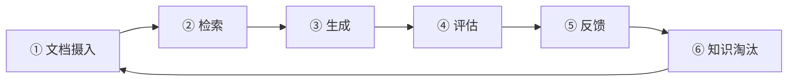

# 知识管理与 RAG 评估 · 构建自进化的知识闭环

> **一句话**：RAG 不是"上传文档就完了"——文档过时了怎么办？检索结果不准怎么办？回答质量怎么量化？你需要一个知识管理闭环。

---

## 知识管理闭环



---

## 代码实现

### 1. 文档生命周期管理

```java
package com.enterprise.knowledge;

import org.springframework.stereotype.Component;
import java.util.*;

/**
 * 文档生命周期管理
 *
 * 每一篇文档都有状态：
 * ACTIVE → 文档有效，参与检索
 * STALE → 文档可能过时（标记审查）
 * ARCHIVED → 文档已归档，不参与检索
 */
@Component
public class DocumentLifecycleManager {

    /**
     * 定期检查文档新鲜度
     */
    @Scheduled(cron = "0 0 2 * * *")  // 每天凌晨 2 点
    public void checkFreshness() {
        List<DocumentMeta> docs = loadAllDocuments();

        for (DocumentMeta doc : docs) {
            DocumentFreshness freshness = assessFreshness(doc);

            switch (freshness) {
                case FRESH -> {} // 无需操作
                case AGING -> markAsStale(doc);
                case STALE -> notifyOwner(doc);
                case OUTDATED -> archive(doc);
            }
        }
    }

    /**
     * 评估文档新鲜度
     */
    private DocumentFreshness assessFreshness(DocumentMeta doc) {
        // 因素 1：文档年龄
        long ageDays = Duration.between(doc.uploadedAt(), Instant.now()).toDays();

        // 因素 2：最近被引用次数（RAG 命中率）
        int recentHits = doc.hitCountLast30Days();

        // 因素 3：用户反馈（基于 RAG 回答的差评率）
        double negativeFeedbackRate = doc.negativeFeedbackRate();

        if (ageDays > 180 && recentHits == 0) return DocumentFreshness.OUTDATED;
        if (ageDays > 90 && negativeFeedbackRate > 0.3) return DocumentFreshness.STALE;
        if (ageDays > 60) return DocumentFreshness.AGING;
        return DocumentFreshness.FRESH;
    }

    private void markAsStale(DocumentMeta doc) {
        updateStatus(doc.id(), "STALE");
        // 通知文档所有者审查
        notifyOwner(doc);
    }

    private void archive(DocumentMeta doc) {
        updateStatus(doc.id(), "ARCHIVED");
        // 从向量库中移除
        vectorStore.delete(doc.id());
        // 保留原文备份
        backupToColdStorage(doc);
    }

    public record DocumentMeta(
        String id, String title, String tenantId,
        Instant uploadedAt, String uploadedBy,
        int hitCountLast30Days,
        double negativeFeedbackRate,
        String status
    ) {}

    public enum DocumentFreshness { FRESH, AGING, STALE, OUTDATED }
}
```

### 2. RAG 质量评估

```java
package com.enterprise.knowledge;

import org.springframework.stereotype.Component;
import java.util.*;

/**
 * RAG 质量评估器
 *
 * 回答 "RAG 到底好不好" 这个问题：
 * 1. 检索准确率：检索到的文档和问题相关吗？
 * 2. 检索覆盖率：需要的信息都检索到了吗？
 * 3. 引用准确率：回答中的引用正确吗？
 * 4. 幻觉率：回答有没有编造信息？
 */
@Component
public class RagQualityEvaluator {

    private final ChatClient judgeModel;

    /**
     * 评估单次 RAG 交互
     */
    public RagQualityReport evaluate(RagInteraction interaction) {
        // 1. 检索质量
        RetrievalQuality retrieval = assessRetrieval(
            interaction.query(),
            interaction.retrievedChunks()
        );

        // 2. 生成质量
        GenerationQuality generation = assessGeneration(
            interaction.query(),
            interaction.retrievedChunks(),
            interaction.generatedAnswer()
        );

        // 3. 用户反馈（如果有）
        double userScore = interaction.userFeedback() != null
            ? interaction.userFeedback().score() : -1;

        return new RagQualityReport(
            interaction.query(),
            retrieval.relevanceScore(),
            retrieval.coverageScore(),
            generation.faithfulnessScore(),   // 忠实度（无幻觉）
            generation.answerRelevanceScore(),// 回答相关性
            userScore
        );
    }

    /**
     * 检索质量评估
     */
    private RetrievalQuality assessRetrieval(String query, List<Chunk> chunks) {
        // 用 LLM 评估每个检索到的 chunk 是否和 query 相关
        int relevantCount = 0;
        for (Chunk chunk : chunks) {
            String prompt = """
                用户问题：%s
                检索片段：%s

                这个片段和问题相关吗？只回答 YES 或 NO。
                """.formatted(query, chunk.content().substring(0,
                    Math.min(200, chunk.content().length())));

            String verdict = judgeModel.prompt()
                .user(prompt).call().content().trim().toUpperCase();

            if (verdict.startsWith("YES")) relevantCount++;
        }

        double relevance = chunks.isEmpty() ? 0 : (double) relevantCount / chunks.size();
        // 覆盖率：是否能从检索到的 chunk 拼出完整答案
        double coverage = assessCoverage(query, chunks);

        return new RetrievalQuality(relevance, coverage);
    }

    /**
     * 生成质量——忠实度（幻觉检测）
     */
    private GenerationQuality assessGeneration(
            String query, List<Chunk> chunks, String answer) {

        String prompt = """
            用户问题：%s

            知识库内容：
            %s

            Agent 回答：
            %s

            请评估：
            1. 回答中的每个事实是否都能在知识库内容中找到依据？（忠实度）
            2. 回答是否真正回答了用户的问题？（相关性）

            返回 JSON：{"faithfulness": 0.0-1.0, "answerRelevance": 0.0-1.0}
            """.formatted(query,
                chunks.stream().map(Chunk::content)
                    .reduce("", (a, b) -> a + "\n" + b),
                answer);

        String json = judgeModel.prompt().user(prompt).call().content();
        // 解析 JSON...
        return new GenerationQuality(0.85, 0.90); // 简化
    }

    private double assessCoverage(String query, List<Chunk> chunks) {
        String prompt = """
            用户问题：%s

            检索到的内容能否完整回答这个问题？
            返回 0.0（完全不能）到 1.0（完全覆盖）。
            """.formatted(query);
        // 简化
        return 0.75;
    }

    // === 数据结构 ===

    public record RagInteraction(
        String query,
        List<Chunk> retrievedChunks,
        String generatedAnswer,
        UserFeedback userFeedback
    ) {}

    public record Chunk(String id, String content, String docId, float score) {}

    public record UserFeedback(int score, String comment) {} // score: 1-5

    public record RetrievalQuality(double relevanceScore, double coverageScore) {}
    public record GenerationQuality(double faithfulnessScore, double answerRelevanceScore) {}

    public record RagQualityReport(
        String query,
        double retrievalRelevance,  // 检索准确率
        double retrievalCoverage,   // 检索覆盖率
        double faithfulness,        // 忠实度（无幻觉）
        double answerRelevance,     // 回答相关性
        double userScore            // 用户评分
    ) {
        public double overallScore() {
            return (retrievalRelevance * 0.2
                + retrievalCoverage * 0.15
                + faithfulness * 0.3
                + answerRelevance * 0.2
                + (userScore >= 0 ? userScore / 5.0 * 0.15 : 0));
        }
    }
}
```

### 3. 知识自进化

```java
/**
 * 知识缺口检测
 *
 * 当 Agent 无法回答时，记录"知识缺口"。
 * 积累后通知知识管理员补充文档。
 */
@Component
public class KnowledgeGapDetector {

    private final List<KnowledgeGap> gaps = new CopyOnWriteArrayList<>();

    /**
     * 检测知识缺口
     */
    public void detect(RagQualityEvaluator.RagInteraction interaction) {
        // 信号 1：检索覆盖率低
        // 信号 2：回答忠实度低（Agent 可能在编造）
        // 信号 3：用户给了差评

        if (interaction.userFeedback() != null
            && interaction.userFeedback().score() <= 2) {
            gaps.add(new KnowledgeGap(
                UUID.randomUUID().toString(),
                interaction.query(),
                "USER_NEGATIVE_FEEDBACK",
                "用户对回答不满意，可能存在知识缺口",
                Instant.now()
            ));
        }

        // 定期通知
        if (gaps.size() >= 10) {
            notifyKnowledgeManager();
        }
    }

    public record KnowledgeGap(
        String id, String query,
        String signalType, String description,
        Instant detectedAt
    ) {}
}
```

---

## RAG 质量基线

| 指标 | 优秀 | 可接受 | 不可接受 |
|------|------|--------|---------|
| 检索准确率 | > 90% | > 70% | < 50% |
| 检索覆盖率 | > 85% | > 60% | < 40% |
| 忠实度（无幻觉） | > 95% | > 80% | < 70% |
| 回答相关性 | > 90% | > 75% | < 60% |
| 用户满意度 | > 4.0/5 | > 3.5/5 | < 3.0/5 |

---

## 关键收获

- **文档有生命周期**——不是上传就不管了，需要定期审查和淘汰
- **RAG 质量可以量化**——检索准确率 + 覆盖率 + 忠实度 + 相关性
- **知识缺口检测**——用户的差评是最好的知识缺口信号
- **知识管理是闭环**——不是一次性上传，而是持续迭代

→ 返回 [阶段4 目录](../00-README.md)
