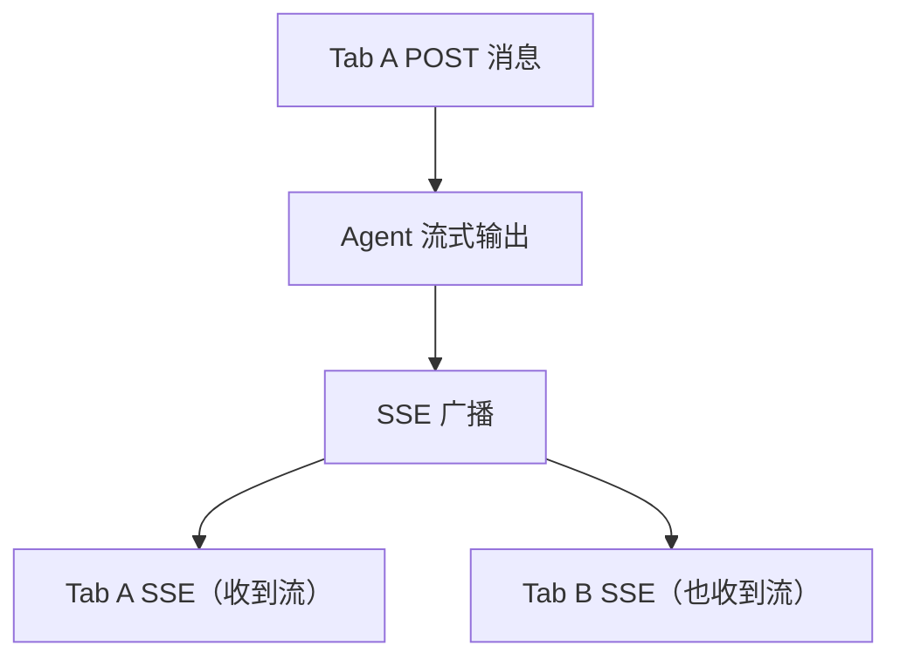
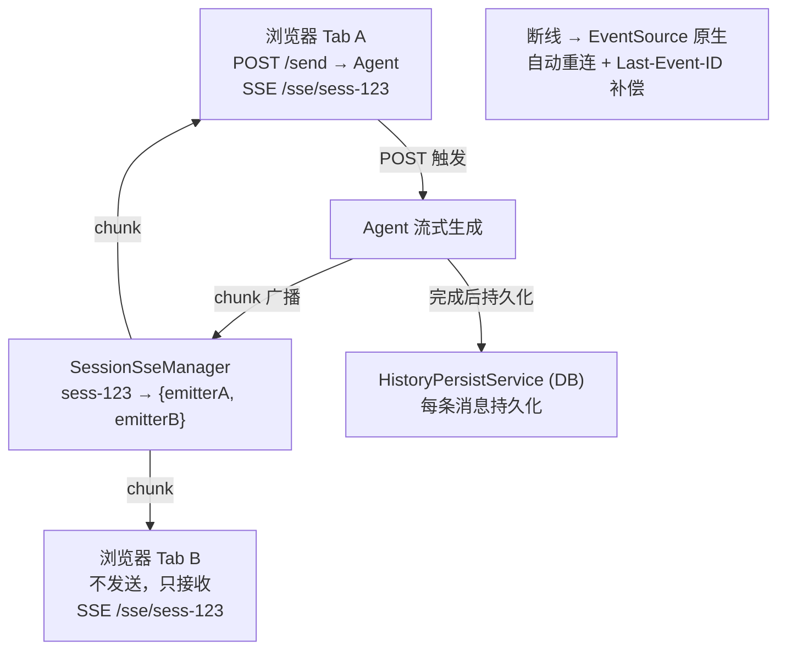

# 历史持久化与多端流式同步

> **一句话**：Agent 对话不能"刷新页面就丢"——你需要持久化三层历史（会话/调用/工具），并且支持同一会话在多个浏览器标签页同时接收流式输出。

---

## 技术选型：为什么选 SSE 而不是 WebSocket？

| 维度 | SSE ✅ | WebSocket |
|------|--------|-----------|
| **通信模式** | 单向流（服务端→客户端），天然适配 Agent 流式输出 | 双向，但 Agent 场景只需要"请求→流式响应" |
| **基础设施** | 就是 HTTP，Nginx/网关/CDN 零配置 | 需要 Upgrade 支持，网关/防火墙可能拦截 |
| **断线重连** | 浏览器**原生自动重连** + `Last-Event-ID` 头 | 需要自己写重连 + 补偿逻辑 |
| **鉴权** | 标准 HTTP Header/Token，和 REST API 一致 | 需要自己设计握手鉴权 |
| **Spring AI 对接** | `.stream()` 返回 `Flux<String>`，天然映射 `text/event-stream` | 需要额外 WebSocket Handler 封装 |

**结论**：Agent 对话是"用户 POST 一条消息 → 服务端流式返回 Token"的单向流。SSE 是企业级 AI 对话的标准选型——WebSocket 的双向能力在这里是浪费，还会增加部署复杂度。

**多端同步方案**：同一 session 的多个 SSE 连接，通过服务端 `SseEmitter` 广播实现。用户在 Tab B 打开时，发起一个新的 SSE 连接订阅同一 session 的流式输出。

---

## 一、三层历史持久化

### 存储模型

```sql
-- 第一层：会话
CREATE TABLE chat_sessions (
    id              VARCHAR(64) PRIMARY KEY,
    user_id         VARCHAR(64) NOT NULL,
    tenant_id       VARCHAR(64) NOT NULL,
    title           VARCHAR(200),        -- 自动生成的会话标题
    status          VARCHAR(20) DEFAULT 'active',  -- active / archived
    created_at      TIMESTAMPTZ DEFAULT NOW(),
    updated_at      TIMESTAMPTZ DEFAULT NOW(),
    last_message_at TIMESTAMPTZ DEFAULT NOW()
);

-- 第二层：消息（每条用户/Agent 消息）
CREATE TABLE chat_messages (
    id              VARCHAR(64) PRIMARY KEY,
    session_id      VARCHAR(64) NOT NULL REFERENCES chat_sessions(id),
    role            VARCHAR(20) NOT NULL,  -- user / assistant / system
    content         TEXT NOT NULL,
    token_count     INT,
    model_version   VARCHAR(50),           -- 哪个模型生成的
    prompt_version  VARCHAR(50),
    created_at      TIMESTAMPTZ DEFAULT NOW()
);

-- 第三层：调用详情（LLM 调用 + 工具调用的完整记录）
CREATE TABLE agent_llm_calls (
    id              VARCHAR(64) PRIMARY KEY,
    message_id      VARCHAR(64) NOT NULL REFERENCES chat_messages(id),
    input_tokens    INT,
    output_tokens   INT,
    ttft_ms         INT,                   -- 首 Token 延迟
    total_ms        INT,                   -- 总耗时
    temperature     REAL,
    status          VARCHAR(20),           -- success / error / timeout
    error_message   TEXT
);

CREATE TABLE agent_tool_calls (
    id              VARCHAR(64) PRIMARY KEY,
    llm_call_id     VARCHAR(64) NOT NULL REFERENCES agent_llm_calls(id),
    tool_name       VARCHAR(100) NOT NULL,
    tool_params     JSONB,                 -- 入参
    tool_result     TEXT,                  -- 返回
    duration_ms     INT,
    status          VARCHAR(20)            -- success / error
);
```

### 持久化服务

```java
package com.enterprise.persistence;

import org.springframework.stereotype.Service;
import java.util.*;

/**
 * 三层历史持久化
 *
 * 每次 Agent 交互都会写三层：
 * 1. chat_messages：用户看到的消息
 * 2. agent_llm_calls：LLM 调用的技术细节
 * 3. agent_tool_calls：工具调用的入参出参
 */
@Service
public class HistoryPersistenceService {

    private final JdbcTemplate jdbc;

    /**
     * 保存一条完整的 Agent 响应
     */
    public void saveAgentResponse(AgentResponse response) {
        String messageId = response.messageId();

        // 1. 保存消息
        jdbc.update("""
            INSERT INTO chat_messages
            (id, session_id, role, content, token_count, model_version, prompt_version)
            VALUES (?, ?, 'assistant', ?, ?, ?, ?)
            """,
            messageId, response.sessionId(),
            response.content(), response.totalTokens(),
            response.modelVersion(), response.promptVersion());

        // 2. 保存 LLM 调用详情
        jdbc.update("""
            INSERT INTO agent_llm_calls
            (id, message_id, input_tokens, output_tokens, ttft_ms, total_ms,
             temperature, status)
            VALUES (?, ?, ?, ?, ?, ?, ?, ?)
            """,
            UUID.randomUUID().toString(), messageId,
            response.inputTokens(), response.outputTokens(),
            response.ttftMs(), response.totalMs(),
            response.temperature(), response.status());

        // 3. 保存工具调用
        for (ToolCallRecord tc : response.toolCalls()) {
            jdbc.update("""
                INSERT INTO agent_tool_calls
                (id, llm_call_id, tool_name, tool_params, tool_result,
                 duration_ms, status)
                VALUES (?, ?, ?, ?::jsonb, ?, ?, ?)
                """,
                tc.id(), messageId, tc.toolName(),
                tc.paramsJson(), tc.result(),
                tc.durationMs(), tc.status());
        }

        // 4. 更新会话最后消息时间
        jdbc.update("""
            UPDATE chat_sessions
            SET last_message_at = NOW(), updated_at = NOW()
            WHERE id = ?
            """, response.sessionId());
    }

    /**
     * 加载会话历史（只取消息层——用户可见的）
     */
    public List<ChatMessage> loadHistory(String sessionId, int limit) {
        return jdbc.query("""
            SELECT * FROM chat_messages
            WHERE session_id = ?
            ORDER BY created_at DESC
            LIMIT ?
            """, (rs, i) -> new ChatMessage(
                rs.getString("id"),
                rs.getString("session_id"),
                rs.getString("role"),
                rs.getString("content"),
                rs.getInt("token_count"),
                rs.getTimestamp("created_at")
            ), sessionId, limit);
    }

    /**
     * 加载某条消息的完整调用链（调试/审计用）
     */
    public CallChain loadCallChain(String messageId) {
        var llmCall = jdbc.queryForMap(
            "SELECT * FROM agent_llm_calls WHERE message_id = ?",
            messageId);

        List<ToolCallRecord> tools = jdbc.query(
            "SELECT * FROM agent_tool_calls WHERE llm_call_id = ?",
            (rs, i) -> new ToolCallRecord(
                rs.getString("id"), rs.getString("tool_name"),
                rs.getString("tool_params"), rs.getString("tool_result"),
                rs.getInt("duration_ms"), rs.getString("status")
            ), llmCall.get("id"));

        return new CallChain(llmCall, tools);
    }
}
```

---

## 二、多端 SSE 流式同步

### 为什么是多端同步？



**核心设计**：
- 用户输入用 `POST` 发送（不需要长连接）
- Agent 流式输出用 `SSE`（`text/event-stream`）
- 同一 session 的所有 SSE 连接都能收到流式输出
- Tab B 打开时，`GET` 拉取已有历史 + 新建 SSE 连接接收后续流式 chunk

### SSE 连接管理

```java
package com.enterprise.streaming;

import org.springframework.stereotype.Component;
import org.springframework.web.servlet.mvc.method.annotation.SseEmitter;
import java.util.*;
import java.util.concurrent.*;

/**
 * 会话级 SSE 连接管理
 *
 * 同一个 sessionId 可能有多个 SseEmitter（多标签页/多设备）。
 * Agent 流式输出时，广播到该 session 的所有 SSE 连接。
 */
@Component
public class SessionSseManager {

    // sessionId → 所有的 SSE 连接
    private final Map<String, Set<SseEmitter>> sessionEmitters =
        new ConcurrentHashMap<>();

    /**
     * 用户打开了一个 SSE 连接（如新标签页打开同一会话）
     */
    public SseEmitter subscribe(String sessionId) {
        // 超时 5 分钟——用户可能长时间不操作
        SseEmitter emitter = new SseEmitter(300_000L);

        sessionEmitters.computeIfAbsent(sessionId,
            k -> ConcurrentHashMap.newKeySet()).add(emitter);

        // 连接关闭时清理
        emitter.onCompletion(() -> unsubscribe(sessionId, emitter));
        emitter.onTimeout(() -> unsubscribe(sessionId, emitter));
        emitter.onError(e -> unsubscribe(sessionId, emitter));

        System.out.println("[SSE] Session " + sessionId
            + " 现在有 " + getEmitterCount(sessionId) + " 个连接");

        return emitter;
    }

    private void unsubscribe(String sessionId, SseEmitter emitter) {
        Set<SseEmitter> emitters = sessionEmitters.get(sessionId);
        if (emitters != null) {
            emitters.remove(emitter);
            if (emitters.isEmpty()) {
                sessionEmitters.remove(sessionId);
            }
        }
    }

    /**
     * 广播流式 chunk 到该 session 的所有 SSE 连接
     *
     * 每个 chunk 带一个递增的 eventId，
     * 浏览器断线重连时通过 Last-Event-ID 头自动补回缺失的 chunk。
     */
    public void broadcastChunk(String sessionId, String messageId,
                                int chunkIndex, String chunk) {
        Set<SseEmitter> emitters = sessionEmitters.get(sessionId);
        if (emitters == null) return;

        for (SseEmitter emitter : emitters) {
            try {
                // SSE 的 id 字段 = Last-Event-ID，浏览器原生支持断线补偿
                emitter.send(SseEmitter.event()
                    .id(messageId + "-" + chunkIndex)
                    .name("chunk")
                    .data(chunk)
                    .build());
            } catch (Exception e) {
                // 发送失败 = 连接已断，清理
                unsubscribe(sessionId, emitter);
            }
        }
    }

    /**
     * 广播流式完成
     */
    public void broadcastComplete(String sessionId, String messageId) {
        broadcast(sessionId, "complete",
            "{\"messageId\":\"" + messageId + "\"}");
    }

    /**
     * 广播错误
     */
    public void broadcastError(String sessionId, String error) {
        broadcast(sessionId, "error",
            "{\"message\":\"" + error + "\"}");
    }

    private void broadcast(String sessionId, String eventName, String data) {
        Set<SseEmitter> emitters = sessionEmitters.get(sessionId);
        if (emitters == null) return;

        for (SseEmitter emitter : emitters) {
            try {
                emitter.send(SseEmitter.event()
                    .name(eventName)
                    .data(data)
                    .build());
            } catch (Exception e) {
                unsubscribe(sessionId, emitter);
            }
        }
    }

    public int getEmitterCount(String sessionId) {
        Set<SseEmitter> emitters = sessionEmitters.get(sessionId);
        return emitters != null ? emitters.size() : 0;
    }
}
```

### SSE Controller

```java
package com.enterprise.streaming;

import org.springframework.http.MediaType;
import org.springframework.web.bind.annotation.*;
import org.springframework.web.servlet.mvc.method.annotation.SseEmitter;

@RestController
@RequestMapping("/api/chat")
public class ChatSseController {

    private final SessionSseManager sseManager;
    private final StreamingAgentService agentService;

    /**
     * SSE 订阅——建立流式连接
     *
     * 浏览器调用：
     * new EventSource("/api/chat/sse/sess-123")
     *
     * 同一 session 的多个标签页各自建立独立 SSE 连接，
     * 服务端广播时全部收到。
     */
    @GetMapping(value = "/sse/{sessionId}", produces = MediaType.TEXT_EVENT_STREAM_VALUE)
    public SseEmitter subscribe(@PathVariable String sessionId) {
        return sseManager.subscribe(sessionId);
    }

    /**
     * 发送消息——POST 一条，Agent 流式输出通过 SSE 广播
     *
     * 用户输入不走 SSE（不需要长连接），直接 POST。
     * Agent 的流式 chunk 通过 SSE 广播到所有标签页。
     */
    @PostMapping("/{sessionId}/send")
    public SendResponse send(@PathVariable String sessionId,
                              @RequestBody SendRequest request) {
        // 异步触发 Agent 流式生成
        agentService.streamChatAsync(sessionId, request.message());

        return new SendResponse("accepted", sessionId);
    }

    public record SendRequest(String message) {}
    public record SendResponse(String status, String sessionId) {}
}
```

### Agent 流式服务（SSE + 持久化整合）

```java
package com.enterprise.streaming;

import org.springframework.stereotype.Service;

/**
 * 流式 Agent 服务
 *
 * 关键：流式输出的同时拼接完整内容，结束后持久化。
 * 每个 chunk 通过 SSE 广播到同一 session 的所有标签页。
 */
@Service
public class StreamingAgentService {

    private final ChatClient chatClient;
    private final HistoryPersistenceService historyService;
    private final SessionSseManager sseManager;

    /**
     * 异步流式对话
     */
    public void streamChatAsync(String sessionId, String userInput) {
        CompletableFuture.runAsync(() -> {
            // 1. 持久化用户消息
            String userMsgId = historyService.saveUserMessage(sessionId, userInput);

            // 2. 加载历史
            List<ChatMessage> history = historyService.loadHistory(sessionId, 20);

            // 3. 流式生成
            String agentMsgId = UUID.randomUUID().toString();
            StringBuilder fullResponse = new StringBuilder();
            long start = System.currentTimeMillis();
            int[] ttft = {-1};
            int[] chunkIndex = {0};

            chatClient.prompt()
                .messages(history)
                .user(userInput)
                .stream()
                .content()
                .doOnNext(chunk -> {
                    if (ttft[0] == -1)
                        ttft[0] = (int) (System.currentTimeMillis() - start);

                    fullResponse.append(chunk);

                    // ★ 广播 chunk 到该 session 的所有 SSE 连接
                    sseManager.broadcastChunk(
                        sessionId, agentMsgId, chunkIndex[0]++, chunk);
                })
                .doOnComplete(() -> {
                    long total = System.currentTimeMillis() - start;

                    // 4. 持久化完整 Agent 响应
                    historyService.saveAgentResponse(AgentResponse.builder()
                        .messageId(agentMsgId)
                        .sessionId(sessionId)
                        .content(fullResponse.toString())
                        .ttftMs(ttft[0])
                        .totalMs((int) total)
                        .build());

                    // 5. 广播完成
                    sseManager.broadcastComplete(sessionId, agentMsgId);
                })
                .doOnError(e -> {
                    sseManager.broadcastError(sessionId, e.getMessage());
                })
                .subscribe();
        });
    }
}
```

---

## 三、断线重连与消息补偿

SSE 原生支持断线重连——浏览器 `EventSource` API 在连接断开时自动重连，并通过 `Last-Event-ID` 请求头告诉服务端"我最后收到的是哪条"。

### 方式 1：SSE 原生 Last-Event-ID

```java
@GetMapping(value = "/sse/{sessionId}", produces = MediaType.TEXT_EVENT_STREAM_VALUE)
public SseEmitter subscribe(
        @PathVariable String sessionId,
        @RequestHeader(value = "Last-Event-ID", required = false) String lastEventId) {

    SseEmitter emitter = sseManager.subscribe(sessionId);

    // 如果有 Last-Event-ID，补发缺失的 chunk
    if (lastEventId != null) {
        List<String> missedChunks = historyService
            .getChunksAfter(sessionId, lastEventId);
        for (String chunk : missedChunks) {
            try {
                emitter.send(SseEmitter.event().data(chunk).build());
            } catch (Exception e) {
                break;
            }
        }
    }

    return emitter;
}
```

### 方式 2：REST 补偿查询

```java
/**
 * 断线补偿——从指定消息 ID 之后的所有消息
 *
 * 适用于：SSE 连接已断开且重连失败，
 * 前端用 REST API 拉取错过的消息。
 */
@GetMapping("/sessions/{sessionId}/since/{lastMessageId}")
public List<ChatMessage> sinceLastSeen(
        @PathVariable String sessionId,
        @PathVariable String lastMessageId) {

    Instant lastTime = getMessageTime(lastMessageId);

    return jdbc.query("""
        SELECT * FROM chat_messages
        WHERE session_id = ?
          AND created_at > ?
        ORDER BY created_at ASC
        """, (rs, i) -> new ChatMessage(
            rs.getString("id"),
            rs.getString("session_id"),
            rs.getString("role"),
            rs.getString("content"),
            rs.getInt("token_count"),
            rs.getTimestamp("created_at")
        ), sessionId, lastTime);
}
```

---

## 四、前端多端同步逻辑（SSE）

```javascript
let eventSource = null;
let lastMessageId = null;

function connect(sessionId) {
    // SSE——浏览器原生 EventSource
    eventSource = new EventSource(`/api/chat/sse/${sessionId}`);

    eventSource.onopen = () => {
        console.log('SSE 已连接');
    };

    // 流式 chunk
    eventSource.addEventListener('chunk', (event) => {
        // event.id = Last-Event-ID（断线重连时浏览器自动带上）
        // event.data = chunk 内容
        appendChunk(event.data);
    });

    // 流式完成
    eventSource.addEventListener('complete', (event) => {
        const data = JSON.parse(event.data);
        lastMessageId = data.messageId;
    });

    // 错误
    eventSource.addEventListener('error', (event) => {
        console.log('SSE 断开，浏览器将自动重连...');
        // EventSource 原生自动重连，不需要 setTimeout
    });
}

// 发送消息——普通 POST
async function send(sessionId, message) {
    await fetch(`/api/chat/${sessionId}/send`, {
        method: 'POST',
        headers: { 'Content-Type': 'application/json' },
        body: JSON.stringify({ message })
    });
    // Agent 的流式输出会通过 SSE 自动推送过来
}

// Tab B 打开时：先拉历史，再连 SSE
async function openSessionInNewTab(sessionId) {
    // 1. 拉取已有历史
    const history = await fetch(`/api/sessions/${sessionId}/messages`).then(r => r.json());
    renderHistory(history);

    // 2. 连接 SSE 接收后续流式输出
    connect(sessionId);
}
```

---

## 五、架构全景



---

## 关键收获

| 问题 | 方案 |
|------|------|
| 历史刷新不丢 | 三层持久化（session → message → call chain） |
| 多标签页同时收到 | SSE 广播 + SessionSseManager |
| 网络断线不丢消息 | SSE 原生 `Last-Event-ID` + REST 补偿 |
| 流式 + 持久化 | 边流边拼接，完成后一次性持久化 |
| 技术选型 | **SSE > WebSocket**——单向流、原生重连、基础设施友好 |
| 调试审计 | 第三层 call chain 可回溯每次工具调用 |

→ 返回 [阶段4 目录](../00-README.md)
