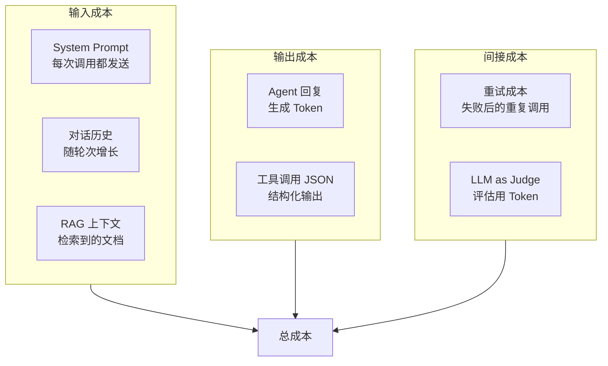
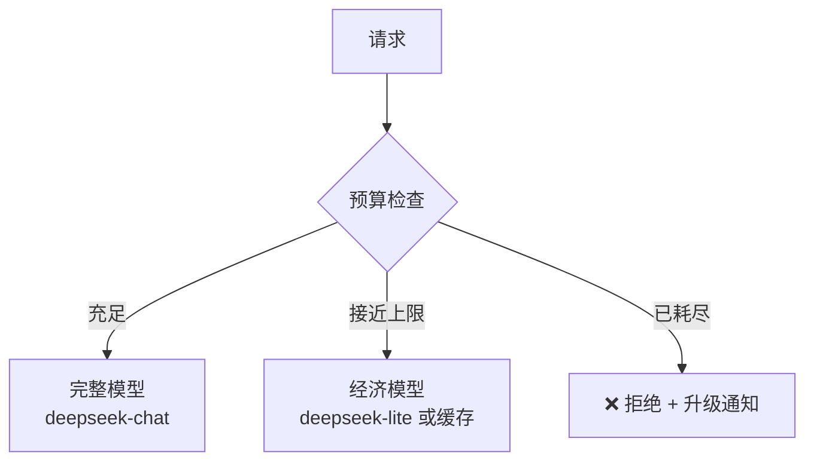
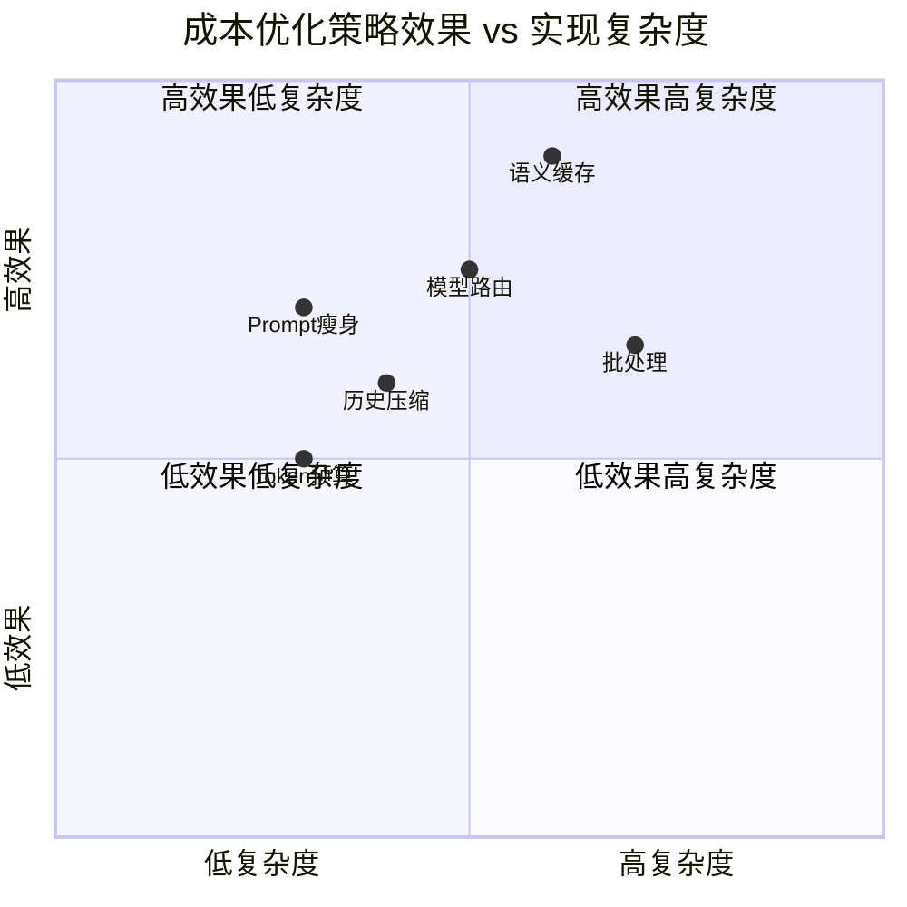

# 28-LLM成本工程深入

> **前置阅读**：[21-Agent性能调优](21-Agent性能调优.md)、[24-容量规划与弹性伸缩](24-容量规划与弹性伸缩.md)
>
> **核心问题**：你的 Agent 每月烧多少钱？Token 是 Agent 的"燃料"——不管理成本，企业级 Agent 就是烧钱机器。

---

## 成本模型



### Token 定价模型（以 DeepSeek 为例）

| 项目 | 单价 | 说明 |
|------|------|------|
| 输入 Token | ¥0.001 / 1K | 每千 Token 输入成本 |
| 输出 Token | ¥0.002 / 1K | 输出比输入贵 ~2 倍 |
| 缓存命中 | ¥0.0001 / 1K | 缓存输入降价 90% |

> **关键洞察**：输出 Token 的成本是输入的 2 倍。控制输出长度比控制输入更有效。

---

## 一、Token 预算管理器

### 1.1 多层预算控制

```java
@Service
public class TokenBudgetManager {

    // 预算层级
    private final Map<String, Budget> sessionBudgets = new ConcurrentHashMap<>();
    private final Map<String, Budget> tenantBudgets = new ConcurrentHashMap<>();
    private final AtomicLong platformBudget = new AtomicLong(0);

    // 预算配置
    private static final long SESSION_DAILY_BUDGET = 100_000;   // 10万 Token/天/会话
    private static final long TENANT_MONTHLY_BUDGET = 10_000_000; // 1000万/月/租户
    private static final long PLATFORM_MONTHLY_BUDGET = 500_000_000; // 5亿/月/平台

    /**
     * 检查是否在预算内
     */
    public BudgetCheckResult check(String tenantId, String sessionId,
            int estimatedTokens) {
        // 从小到大检查
        if (!withinSessionBudget(sessionId, estimatedTokens))
            return BudgetCheckResult.denied("会话预算耗尽");
        if (!withinTenantBudget(tenantId, estimatedTokens))
            return BudgetCheckResult.denied("租户月预算耗尽");
        if (!withinPlatformBudget(estimatedTokens))
            return BudgetCheckResult.denied("平台预算耗尽");

        return BudgetCheckResult.approved();
    }

    /**
     * 记录实际消耗
     */
    public void record(String tenantId, String sessionId,
            int inputTokens, int outputTokens) {
        var totalTokens = inputTokens + outputTokens;
        sessionBudgets.computeIfAbsent(sessionId,
            k -> new Budget(SESSION_DAILY_BUDGET)).consume(totalTokens);
        tenantBudgets.computeIfAbsent(tenantId,
            k -> new Budget(TENANT_MONTHLY_BUDGET)).consume(totalTokens);
        platformBudget.addAndGet(totalTokens);

        // 接近预算时预警
        checkBudgetAlerts(tenantId, sessionId);
    }

    private void checkBudgetAlerts(String tenantId, String sessionId) {
        var tenantUsage = tenantBudgets.get(tenantId);
        if (tenantUsage != null) {
            var ratio = tenantUsage.used() / (double) tenantUsage.limit();
            if (ratio > 0.8) {
                alertService.send(AlertLevel.WARNING,
                    "租户 " + tenantId + " 月预算使用 "
                    + String.format("%.0f%%", ratio * 100));
            }
        }
    }
}

record Budget(long limit) {
    private long used = 0;
    void consume(int tokens) { used += tokens; }
    long used() { return used; }
    boolean within(int estimate) { return used + estimate <= limit; }
}
```

### 1.2 预算耗尽降级策略



```java
@Service
public class BudgetAwareModelRouter {

    private final TokenBudgetManager budget;

    /**
     * 根据剩余预算选择模型
     */
    public String selectModel(String tenantId, String sessionId) {
        var remaining = budget.remainingBudget(tenantId, sessionId);

        if (remaining > 50_000) {
            return "deepseek-chat";      // 完整模型
        } else if (remaining > 5_000) {
            return "deepseek-lite";       // 轻量模型
        } else {
            return "cache-only";          // 只用缓存
        }
    }
}
```

---

## 二、语义缓存

### 2.1 向量相似度缓存

```java
@Service
public class SemanticCacheService {

    private final VectorStore vectorStore;
    private final CacheRepository cacheRepo;

    private static final double SIMILARITY_THRESHOLD = 0.92;

    /**
     * 语义缓存查找
     * "年假多少天" 和 "年假有几天" 应命中同一个缓存
     */
    public Optional<CacheEntry> lookup(String query, String tenantId) {
        // 1. 精确匹配（最快）
        var exact = cacheRepo.exactMatch(query, tenantId);
        if (exact.isPresent()) return exact;

        // 2. 语义相似匹配
        var similar = vectorStore.similaritySearch(
            SearchRequest.builder()
                .query(query)
                .topK(3)
                .filterExpression("tenantId == '" + tenantId
                    + "' AND type == 'cache'")
                .similarityThreshold(SIMILARITY_THRESHOLD)
                .build());

        if (!similar.isEmpty()) {
            var doc = similar.get(0);
            var cacheId = doc.getMetadata().get("cacheId").toString();
            return cacheRepo.findById(cacheId);
        }

        return Optional.empty();
    }

    /**
     * 写入缓存
     */
    public void store(String query, String response,
            String tenantId, int tokensSaved) {
        var entry = new CacheEntry(
            UUID.randomUUID().toString(),
            query, response, tenantId,
            tokensSaved,
            Instant.now(),
            1  // hit count
        );
        cacheRepo.save(entry);

        // 同时写入向量库用于语义检索
        vectorStore.add(List.of(new Document(query,
            Map.of("type", "cache",
                   "cacheId", entry.id(),
                   "tenantId", tenantId))));
    }
}
```

### 2.2 缓存策略对比

| 策略 | 命中率 | 适用场景 | 实现复杂度 |
|------|--------|---------|-----------|
| 精确匹配 | ~10% | FAQ 固定问题 | ⭐ |
| 语义缓存 | ~30% | 客服、知识问答 | ⭐⭐⭐ |
| TTL 过期 | - | 时效性强的数据 | ⭐⭐ |
| LRU 淘汰 | - | 有限存储空间 | ⭐⭐ |

---

## 三、智能模型路由

### 3.1 基于复杂度的路由

```java
@Service
public class ComplexityModelRouter {

    private final ChatClient chatClient;

    /**
     * 快速评估问题复杂度，选择最经济的模型
     */
    public RoutedRequest route(String userInput) {
        var complexity = assessComplexity(userInput);

        return switch (complexity) {
            case SIMPLE -> new RoutedRequest(
                "deepseek-lite",    // 轻量模型
                0.3,                // 温度低
                500                 // 最大输出 500
            );

            case MEDIUM -> new RoutedRequest(
                "deepseek-chat",    // 标准模型
                0.7,
                1000
            );

            case COMPLEX -> new RoutedRequest(
                "deepseek-r1",      // 推理模型
                0.7,
                2000
            );
        };
    }

    private Complexity assessComplexity(String input) {
        // 规则快速判断
        if (input.length() < 20) return Complexity.SIMPLE;
        if (input.contains("分析") || input.contains("推理")
            || input.contains("为什么")) return Complexity.COMPLEX;
        if (input.contains("解释") || input.contains("对比")
            || input.contains("设计")) return Complexity.MEDIUM;

        // 默认中等
        return Complexity.MEDIUM;
    }
}

enum Complexity { SIMPLE, MEDIUM, COMPLEX }
record RoutedRequest(String model, double temperature, int maxTokens) {}
```

---

## 四、Prompt 瘦身

### 4.1 Prompt 冗余分析

```java
@Service
public class PromptOptimizer {

    private final ChatClient chatClient;

    /**
     * 分析 Prompt 中的冗余内容
     */
    public OptimizationReport analyze(String systemPrompt) {
        var prompt = """
            分析以下 System Prompt 的 Token 效率。

            System Prompt（{tokenCount} tokens）：
            {prompt}

            请找出：
            1. redundantParts: 重复或冗余的内容
            2. overSpecified: 过度详细的说明（可以简化）
            3. unnecessary: 不必要的部分（对任务无帮助）
            4. optimizedVersion: 优化后的版本（保持相同效果）
            5. estimatedSaving: 预计节省的 Token 数

            返回 JSON。
            """;

        var tokenCount = estimateTokens(systemPrompt);
        var json = chatClient.prompt()
            .user(u -> u.text(prompt)
                .param("tokenCount", tokenCount)
                .param("prompt", systemPrompt))
            .call().content();

        return parseReport(json);
    }

    /**
     * 上下文压缩：总结旧对话而非全量保留
     */
    public String compressHistory(List<Message> history,
            int targetTokens) {
        // 将旧消息总结为一段摘要
        var historyText = history.stream()
            .map(m -> m.getText())
            .collect(Collectors.joining("\n"));

        var summary = chatClient.prompt()
            .user(u -> u.text("""
                将以下对话历史总结为简洁的要点（不超过 {target} tokens）。
                保留关键信息：用户意图、已做的决定、未解决的问题。

                对话历史：
                {history}
                """)
                .param("target", targetTokens)
                .param("history", historyText))
            .call().content();

        return summary;
    }
}
```

### 4.2 成本优化效果矩阵



---

## 五、成本看板

### 5.1 实时成本监控 API

```java
@RestController
@RequestMapping("/api/cost")
public class CostDashboardController {

    private final TokenBudgetManager budget;
    private final SemanticCacheService cache;

    @GetMapping("/summary")
    public CostSummary summary(@RequestParam String tenantId) {
        var tenantUsage = budget.getTenantUsage(tenantId);
        return CostSummary.builder()
            .monthlyBudget(tenantUsage.limit())
            .monthlyUsed(tenantUsage.used())
            .monthlyRemaining(tenantUsage.remaining())
            .dailyAverage(tenantUsage.dailyAverage())
            .projectedMonthly(tenantUsage.projectedMonthEnd())
            .cacheHitRate(cache.getHitRate(tenantId))
            .cacheTokensSaved(cache.getTotalSaved(tenantId))
            .estimatedCostCny(tenantUsage.used() * 0.0015 / 1000)
            .build();
    }

    /**
     * 成本趋势流（SSE）
     */
    @GetMapping(value = "/stream",
            produces = MediaType.TEXT_EVENT_STREAM_VALUE)
    public Flux<ServerSentEvent<CostSummary>> stream(
            @RequestParam String tenantId) {
        return Flux.interval(Duration.ofMinutes(5))
            .map(i -> ServerSentEvent.<CostSummary>builder()
                .event("cost-update")
                .data(summary(tenantId))
                .build());
    }
}
```

---

## 总结：成本工程优先级

| 优先级 | 策略 | 预期节省 | 实现时间 |
|--------|------|---------|---------|
| P0 | Prompt 瘦身（去除冗余指令） | 20-30% | 1 天 |
| P0 | 精确缓存（FAQ 场景） | 10-15% | 2 天 |
| P1 | 语义缓存（向量相似） | 20-30% | 3-5 天 |
| P1 | 模型路由（简单→轻量） | 30-40% | 3 天 |
| P2 | 历史压缩（总结替代全量） | 15-25% | 2 天 |
| P2 | Token 预算管理 | 防超额 | 2 天 |

> **关键原则**：先做 P0（投入产出比最高），再做 P1，P2 视预算压力决定。

---

## 延伸阅读：成本工程深化路线

| 方向 | 文档 | 内容 |
|------|------|------|
| 成本入门 | [04-成本工程](04-成本工程.md) | 4 层成本优化基础 |
| 成本归因 | [12-成本归因与计费](12-成本归因与计费.md) | 多租户成本拆分 |
| 推理加速 | [35-Agent推理加速与模型服务](35-Agent推理加速与模型服务.md) | 自建推理降本 |
| 模型蒸馏 | [阶段6-08-模型蒸馏与小模型部署](../阶段6-前沿/08-模型蒸馏与小模型部署.md) | 小模型替代方案 |
| 推理优化 | [阶段6-10-Agent推理优化前沿](../阶段6-前沿/10-Agent推理优化前沿.md) | vLLM/Speculative Decoding |
| 商业 ROI | [阶段6-12-Agent商业ROI与价值度量](../阶段6-前沿/12-Agent商业ROI与价值度量.md) | 价值量化框架 |
| 模型路由 | [理论字典-模型路由](../理论字典/模型路由.md) | 智能路由降本 |
| 成本实战 | [项目04-ReliabilityOps Sprint2](../项目实践/04-企业项目-Agent可靠性工程/Sprint2-故障切换与成本.md) | 故障切换+成本工程实战 |
