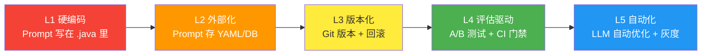
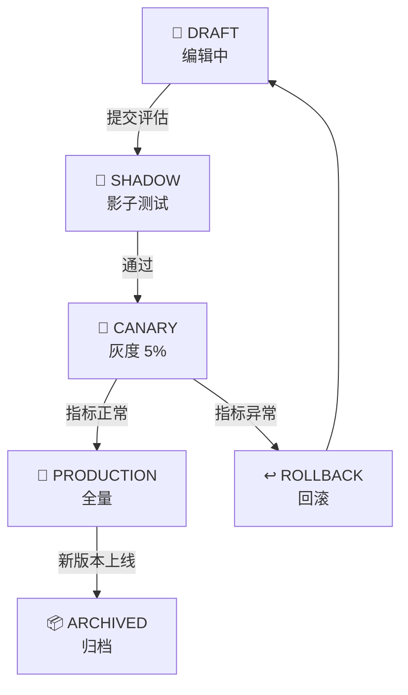
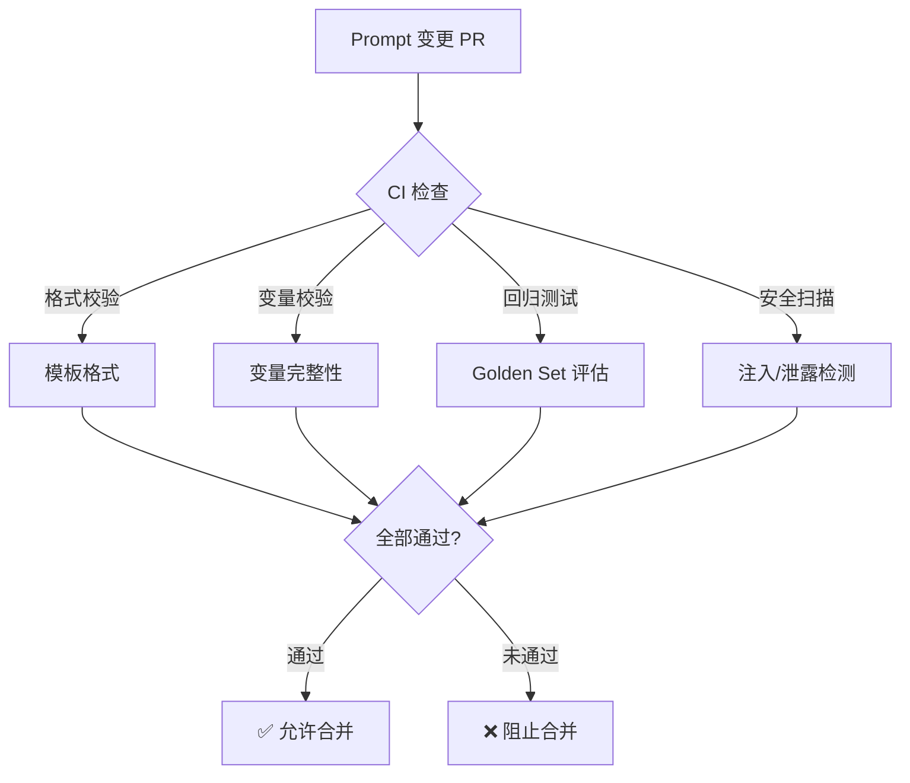

# 29-Prompt工程化管理

> **前置阅读**：[08-Advisor链与管道注入](../阶段3-工程化/08-Advisor链与管道注入.md)、[17-Eval驱动开发](17-Eval驱动开发.md)
>
> **核心问题**：Prompt 不是"写在代码里的一行字符串"——它是 Agent 的核心资产。没有版本控制、没有 A/B 测试、没有灰度发布的 Prompt 管理是灾难。

---

## Prompt 管理成熟度模型



| 级级 | 特征 | 痛点 |
|------|------|------|
| L1 | Prompt 硬编码在 Java 类中 | 改 Prompt 要重新编译部署 |
| L2 | Prompt 外部化到 YAML/数据库 | 没有版本追溯 |
| L3 | Prompt 有版本号 + 可回滚 | 没有评估验证 |
| L4 | Prompt 变更走 A/B + CI 门禁 | 手动触发 |
| L5 | LLM 自动分析 + 优化 + 灰度 | 初始搭建成本高 |

---

## 一、Prompt 外部化与模板引擎

### 1.1 Prompt 模板存储

```java
/**
 * Prompt 模板实体
 */
public record PromptTemplate(
    String id,
    String name,           // 模板名称
    String category,       // 分类：system / user / tool
    String content,        // 模板内容（含变量占位符）
    String version,        // 语义版本号
    List<PromptVariable> variables,  // 变量定义
    PromptMetadata metadata
) {}

public record PromptVariable(
    String name,
    String description,
    boolean required,
    String defaultValue
) {}

public record PromptMetadata(
    String author,
    Instant createdAt,
    Instant updatedAt,
    String changeLog,        // 本次修改说明
    EvalScore baselineScore, // 基线评估分数
    List<String> tags
) {}

public record EvalScore(
    double passRate,
    double avgLatencyMs,
    double avgTokenUsage
) {}
```

### 1.2 模板引擎

```java
@Service
public class PromptTemplateEngine {

    private final PromptTemplateRepository repo;

    /**
     * 渲染 Prompt 模板
     * 支持 {variable} 占位符 + 条件块 + 循环
     */
    public String render(String templateName, String version,
            Map<String, Object> variables) {
        var template = repo.findByNameAndVersion(templateName, version)
            .orElseThrow(() -> new TemplateNotFoundException(templateName));

        // 验证必填变量
        validateVariables(template, variables);

        // 渲染
        var rendered = template.content();
        for (var entry : variables.entrySet()) {
            rendered = rendered.replace("{" + entry.getKey() + "}",
                String.valueOf(entry.getValue()));
        }

        return rendered;
    }

    /**
     * 按租户定制渲染
     */
    public String renderForTenant(String templateName,
            String tenantId, Map<String, Object> variables) {
        // 先查租户定制版
        var tenantTemplate = repo.findTenantOverride(
            templateName, tenantId);
        var version = tenantTemplate.orElseGet(
            () -> repo.findGlobalActive(templateName));

        return render(templateName, version.version(), variables);
    }
}
```

---

## 二、Prompt 版本控制

### 2.1 版本注册表



```java
@Service
public class PromptVersionRegistry {

    /**
     * 发布新版本 Prompt
     */
    public PromptVersion publish(String templateName,
            String newContent, String changeLog) {
        var current = repo.findActiveVersion(templateName);
        var newVersion = new PromptTemplate(
            UUID.randomUUID().toString(),
            templateName,
            current.category(),
            newContent,
            incrementVersion(current.version()),
            current.variables(),
            new PromptMetadata(
                "system",
                Instant.now(),
                Instant.now(),
                changeLog,
                null,  // 待评估
                List.of()
            )
        );

        // 状态：DRAFT
        newVersion.setStatus(PromptStatus.DRAFT);
        repo.save(newVersion);

        return newVersion;
    }

    /**
     * 版本升级流转
     */
    public void transition(String templateName, String version,
            PromptStatus target) {
        var prompt = repo.findByNameAndVersion(templateName, version);

        // 状态机校验
        validateTransition(prompt.getStatus(), target);

        switch (target) {
            case SHADOW -> startShadow(prompt);
            case CANARY -> startCanary(prompt);
            case PRODUCTION -> promoteToProduction(prompt);
            case ARCHIVED -> archive(prompt);
        }
    }

    private void promoteToProduction(PromptTemplate prompt) {
        // 将当前 PRODUCTION 版本降级为 ARCHIVED
        repo.findActiveVersion(prompt.name())
            .setStatus(PromptStatus.ARCHIVED);

        // 新版本升级为 PRODUCTION
        prompt.setStatus(PromptStatus.PRODUCTION);
        repo.save(prompt);
    }
}

enum PromptStatus { DRAFT, SHADOW, CANARY, PRODUCTION, ARCHIVED }
```

### 2.2 版本对比工具

```java
@Service
public class PromptDiffService {

    /**
     * 对比两个版本 Prompt 的差异
     */
    public PromptDiff diff(String templateName,
            String versionA, String versionB) {
        var promptA = repo.findByNameAndVersion(templateName, versionA);
        var promptB = repo.findByNameAndVersion(templateName, versionB);

        // 文本差异
        var textDiff = computeTextDiff(promptA.content(), promptB.content());

        // 预估影响
        var tokenDelta = estimateTokens(promptB.content())
                        - estimateTokens(promptA.content());

        // 评估分数对比
        var scoreDelta = compareScores(
            promptA.metadata().baselineScore(),
            promptB.metadata().baselineScore());

        return new PromptDiff(textDiff, tokenDelta, scoreDelta);
    }
}
```

---

## 三、Prompt A/B 测试

### 3.1 实验管理器

```java
@Service
public class PromptExperimentManager {

    /**
     * 创建 A/B 实验
     */
    public Experiment createExperiment(ExperimentConfig config) {
        // config 包含：
        // - controlVersion: 当前生产版本
        // - treatmentVersion: 候选版本
        // - trafficSplit: 流量分配比例
        // - minSampleSize: 最小样本量
        // - successMetrics: 成功指标定义
        // - duration: 实验时长

        var experiment = new Experiment(
            UUID.randomUUID().toString(),
            config.templateName(),
            config.controlVersion(),
            config.treatmentVersion(),
            config.trafficSplit(),
            ExperimentStatus.RUNNING,
            Instant.now(),
            config.duration()
        );

        repo.save(experiment);
        return experiment;
    }

    /**
     * 为请求分配实验组
     */
    public String assignVersion(String templateName, String userId) {
        var experiment = repo.findActiveByTemplate(templateName);
        if (experiment == null) {
            return registry.getActiveVersion(templateName).version();
        }

        // 基于 userId 的稳定哈希分配
        var hash = Math.abs(userId.hashCode()) % 100;
        return hash < experiment.trafficSplit()
            ? experiment.treatmentVersion()
            : experiment.controlVersion();
    }

    /**
     * 评估实验结果
     */
    public ExperimentResult evaluate(String experimentId) {
        var experiment = repo.findById(experimentId);
        var controlResults = collectResults(
            experiment.templateName(), experiment.controlVersion());
        var treatmentResults = collectResults(
            experiment.templateName(), experiment.treatmentVersion());

        return ExperimentResult.builder()
            .controlScore(computeMetrics(controlResults))
            .treatmentScore(computeMetrics(treatmentResults))
            .significantDifference(
                isStatisticallySignificant(controlResults, treatmentResults))
            .recommendation(decideRecommendation(
                controlResults, treatmentResults))
            .build();
    }
}
```

---

## 四、Prompt 变更 CI 门禁

### 4.1 Prompt PR 检查



```java
@Service
public class PromptCIGateService {

    private final PromptTemplateRepository repo;
    private final GoldenSetEvaluator evaluator;
    private final PromptInjectionDetector injectionDetector;

    /**
     * CI 门禁：Prompt 变更必须通过所有检查
     */
    public CIGateResult check(PromptChangeRequest change) {
        var checks = new ArrayList<CheckResult>();

        // 1. 格式校验：占位符是否合法
        checks.add(validateFormat(change));

        // 2. 变量校验：所有 required 变量都有值
        checks.add(validateVariables(change));

        // 3. 回归测试：新版本不能比旧版本差
        var evalResult = evaluator.evaluate(
            change.newContent(), change.templateName());
        checks.add(evalResult.passed()
            ? CheckResult.pass("回归测试", evalResult.score())
            : CheckResult.fail("回归测试", evalResult.failures()));

        // 4. 安全扫描：Prompt 不能包含可注入内容
        var injectionCheck = injectionDetector.detect(change.newContent());
        checks.add(injectionCheck.blocked()
            ? CheckResult.fail("安全扫描", injectionCheck.reason())
            : CheckResult.pass("安全扫描", null));

        // 5. Token 效率：新版本不能大幅增加 Token
        var tokenDelta = estimateTokens(change.newContent())
                        - estimateTokens(change.oldContent());
        if (tokenDelta > 500) {
            checks.add(CheckResult.warn("Token 效率",
                "新版本增加 " + tokenDelta + " tokens"));
        }

        // 判定
        var allPassed = checks.stream()
            .allMatch(c -> c.status() != CheckStatus.FAIL);
        return new CIGateResult(allPassed, checks);
    }
}
```

---

## 五、Prompt 管理看板

### 5.1 管理界面 API

```java
@RestController
@RequestMapping("/api/prompts")
public class PromptManagementController {

    /**
     * 列出所有 Prompt 模板
     */
    @GetMapping
    public List<PromptSummary> listTemplates(
            @RequestParam(required = false) String category) {
        return repo.listAll(category).stream()
            .map(this::toSummary)
            .toList();
    }

    /**
     * 查看版本历史
     */
    @GetMapping("/{name}/versions")
    public List<VersionHistory> versions(@PathVariable String name) {
        return repo.getVersionHistory(name);
    }

    /**
     * 版本对比
     */
    @GetMapping("/{name}/diff")
    public PromptDiff diff(@PathVariable String name,
            @RequestParam String v1, @RequestParam String v2) {
        return diffService.diff(name, v1, v2);
    }

    /**
     * 活跃实验
     */
    @GetMapping("/experiments/active")
    public List<Experiment> activeExperiments() {
        return experimentRepo.findByStatus(ExperimentStatus.RUNNING);
    }

    /**
     * 实时 Prompt 性能流（SSE）
     */
    @GetMapping(value = "/performance/stream",
            produces = MediaType.TEXT_EVENT_STREAM_VALUE)
    public Flux<ServerSentEvent<PromptMetrics>> performanceStream() {
        return Flux.interval(Duration.ofMinutes(1))
            .map(i -> ServerSentEvent.<PromptMetrics>builder()
                .event("metrics")
                .data(collectAllMetrics())
                .build());
    }
}
```

---

## 总结：Prompt 工程化检查清单

| 维度 | 检查项 | 状态 |
|------|--------|------|
| 外部化 | Prompt 不在 Java 代码中硬编码 | ☐ |
| 版本化 | 每个 Prompt 有版本号 + 变更记录 | ☐ |
| 可回滚 | 能在 1 分钟内回滚到上一个版本 | ☐ |
| 评估门禁 | Prompt 变更必须通过 Golden Set 回归 | ☐ |
| A/B 测试 | 新版本上线前经过 A/B 对比 | ☐ |
| 灰度发布 | 新版本先灰度 5% → 50% → 100% | ☐ |
| 安全扫描 | Prompt 变更经过注入检测 | ☐ |
| Token 效率 | Prompt 变更不能大幅增加 Token | ☐ |
| 审计追踪 | 所有 Prompt 变更有审计日志 | ☐ |
| 多租户 | 支持租户级 Prompt 定制 | ☐ |
