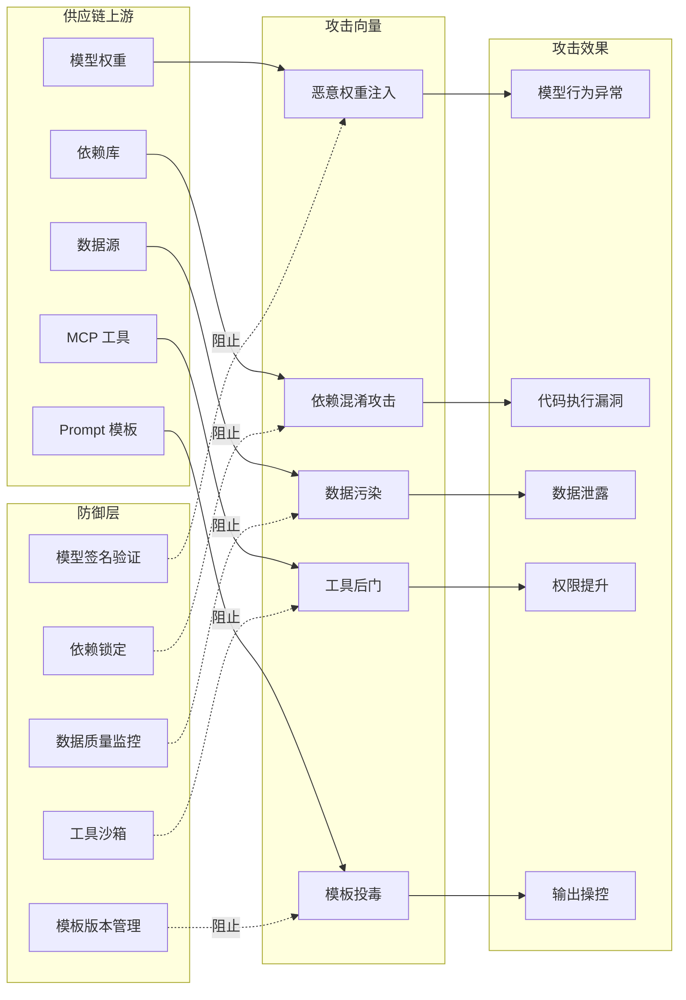
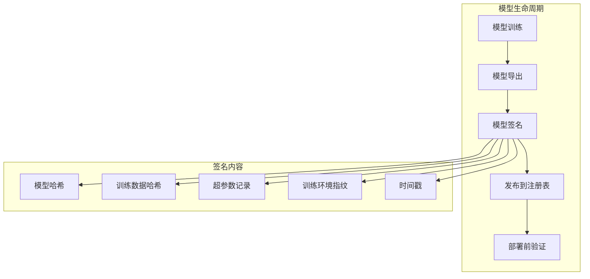
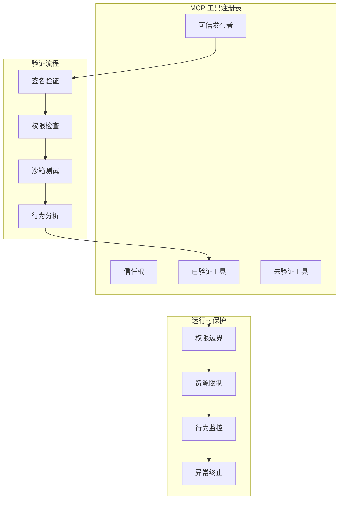
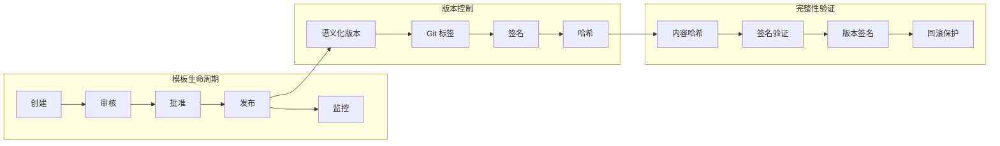
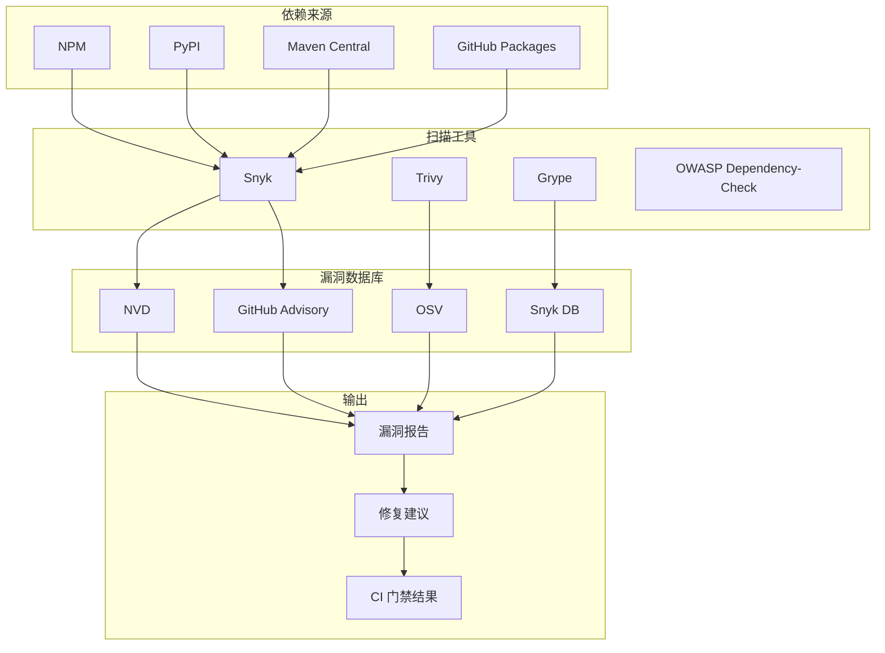
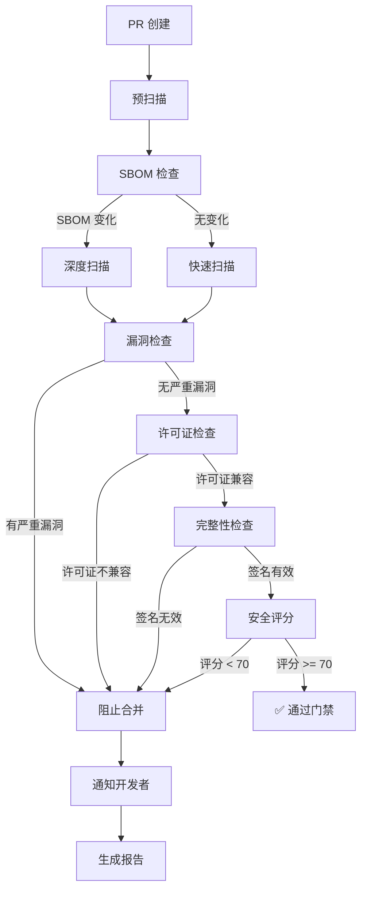

# 32 · Agent 供应链安全（Supply Chain Security）

> 阶段：4 生产化 · 难度：⭐⭐⭐⭐⭐ · 预计：3 天
> 前置：[31 Agent 红队对抗测试](31-Agent红队对抗测试.md)
> 产出：掌握 Agent 系统的供应链威胁模型、模型来源验证、MCP 工具安全、供应链 CI 门禁

> 来源：[NIST SSDF](https://nvlpubs.nist.gov/nistpubs/SpecialPublications/NIST.SP.800-218.pdf) | [SLSA](https://slsa.dev/) | [AI-SBOM](https://www.accenture.com/us-us/insights/industry/ai-sbom-artificial-intelligence)

---

## Agent 供应链威胁全景

### 攻击链路图



### 传统供应链 vs Agent 供应链

| 维度 | 传统软件供应链 | Agent 供应链 |
|------|--------------|------------|
| 主要组件 | 源代码 → 依赖库 → 容器镜像 | 模型权重 + MCP 工具 + Prompt 模板 |
| 信任链 | 代码签名 → SBOM → 构建签名 | 模型签名 + 工具认证 + 模板版本 |
| 攻击面 | 恶意依赖、 compromised 密钥 | 模型投毒、工具劫持、提示注入 |
| 验证手段 | 数字签名、哈希校验 | 模型指纹、行为监控、输出验证 |
| 供应链层级 | 3-5 层 | 7-10 层（模型→数据→预训练→微调→量化→工具→部署） |

---

## 模型来源验证

### 模型供应链完整性



### Java 实现：模型来源验证器

```java
package com.example.supplychain.model;

import org.springframework.stereotype.Component;
import java.security.*;
import java.nio.file.*;
import java.util.*;

/**
 * 模型来源验证器
 *
 * 验证模型权重的完整性和来源可信度
 */
@Component
public class ModelProvenanceVerifier {

    private final PublicKey trustedPublisherKey;
    private final ModelRegistry registry;

    /**
     * 验证模型文件
     */
    public VerificationResult verifyModel(Path modelPath, ModelManifest manifest) {
        List<VerificationIssue> issues = new ArrayList<>();

        // 1. 验证模型哈希
        String actualHash = computeModelHash(modelPath);
        if (!actualHash.equals(manifest.modelHash())) {
            issues.add(new VerificationIssue(
                Severity.HIGH,
                "模型哈希不匹配",
                "期望: " + manifest.modelHash() + ", 实际: " + actualHash
            ));
        }

        // 2. 验证数字签名
        if (!verifySignature(modelPath, manifest.signature())) {
            issues.add(new VerificationIssue(
                Severity.CRITICAL,
                "模型签名验证失败",
                "模型可能被篡改或来自不可信来源"
            ));
        }

        // 3. 验证发布者
        if (!manifest.publisher().equals(trustedPublisher)) {
            issues.add(new VerificationIssue(
                Severity.MEDIUM,
                "发布者不在信任列表中",
                "发布者: " + manifest.publisher()
            ));
        }

        // 4. 验证模型元数据
        if (!verifyMetadata(manifest)) {
            issues.add(new VerificationIssue(
                Severity.LOW,
                "模型元数据不完整",
                "缺少必要字段"
            ));
        }

        // 5. 检查吊销状态
        if (isModelRevoked(manifest.modelId())) {
            issues.add(new VerificationIssue(
                Severity.CRITICAL,
                "模型已被吊销",
                "模型 ID: " + manifest.modelId()
            ));
        }

        return new VerificationResult(
            issues.isEmpty(),
            issues,
            issues.stream().mapToInt(i -> i.severity().ordinal).max()
        );
    }

    /**
     * 计算模型文件哈希
     */
    private String computeModelHash(Path modelPath) {
        try {
            MessageDigest digest = MessageDigest.getInstance("SHA-256");
            byte[] fileBytes = Files.readAllBytes(modelPath);
            byte[] hash = digest.digest(fileBytes);
            return Base64.getEncoder().encodeToString(hash);
        } catch (Exception e) {
            throw new ModelVerificationException("无法计算模型哈希", e);
        }
    }

    /**
     * 验证数字签名
     */
    private boolean verifySignature(Path modelPath, String signature) {
        try {
            Signature sig = Signature.getInstance("SHA256withRSA");
            sig.initVerify(trustedPublisherKey);
            sig.update(Files.readAllBytes(modelPath));
            return sig.verify(Base64.getDecoder().decode(signature));
        } catch (Exception e) {
            return false;
        }
    }

    /**
     * 验证 SBOM for AI
     */
    public boolean verifyAiSbom(AiSbom sbom) {
        // 验证训练数据来源
        // 验证依赖的基座模型
        // 验证使用的框架版本
        return true;
    }

    record VerificationResult(
        boolean passed,
        List<VerificationIssue> issues,
        int maxSeverity
    ) {
        public boolean isCritical() {
            return maxSeverity >= Severity.CRITICAL.ordinal;
        }
    }

    record VerificationIssue(Severity severity, String title, String description) {}
    enum Severity { LOW, MEDIUM, HIGH, CRITICAL }
}

/**
 * 模型清单
 */
record ModelManifest(
    String modelId,
    String modelHash,
    String signature,
    String publisher,
    String version,
    Instant publishedAt,
    Map<String, String> metadata
) {}

/**
 * AI SBOM (Software Bill of Materials for AI)
 */
record AiSbom(
    String modelId,
    List<TrainingDataSource> trainingData,
    BaseModelInfo baseModel,
    FrameworkInfo framework,
    List<ModelDependency> dependencies
) {}

record TrainingDataSource(String source, String hash, String version) {}
record BaseModelInfo(String modelId, String version, String provider) {}
record FrameworkInfo(String name, String version) {}
record ModelDependency(String name, String version, String hash) {}
```

### AI-SBOM 示例

```java
package com.example.supplychain.sbom;

/**
 * AI SBOM 构建器
 *
 * 为 AI 模型创建软件物料清单
 */
public class AiSbomBuilder {

    /**
     * 创建标准 AI-SBOM
     */
    public AiSbom buildSbom(ModelTrainingContext context) {
        return new AiSbom(
            context.getModelId(),
            
            // 训练数据来源
            List.of(
                new TrainingDataSource(
                    "s3://trusted-data/corpus-v1",
                    computeDataHash("s3://trusted-data/corpus-v1"),
                    "v1.0"
                ),
                new TrainingDataSource(
                    "s3://trusted-data/synthetic-v2",
                    computeDataHash("s3://trusted-data/synthetic-v2"),
                    "v2.0"
                )
            ),
            
            // 基座模型信息
            new BaseModelInfo(
                "deepseek-chat",
                "v2.5",
                "deepseek"
            ),
            
            // 框架信息
            new FrameworkInfo(
                "pytorch",
                "2.1.0"
            ),
            
            // 依赖项
            List.of(
                new ModelDependency("transformers", "4.35.0", "abc123"),
                new ModelDependency("accelerate", "0.24.0", "def456"),
                new ModelDependency("sentencepiece", "0.1.99", "ghi789")
            )
        );
    }

    /**
     * 导出为 SPDX 格式
     */
    public String exportSpdx(AiSbom sbom) {
        // SPDX 2.3 格式，添加 AI 特定字段
        return """
            SPDXVersion: SPDX-2.3
            DataLicense: CC0-1.0
            SPDXID: SPDXRef-DOCUMENT
            DocumentName: %s
            DocumentNamespace: https://example.com/spdx/ai/%s
            
            PackageName: %s
            PackageDownloadLocation: %s
            FilesAnalyzed: false
            PackageVerificationCode: %s
            
            AiModelId: %s
            AiBaseModel: %s@%s
            AiTrainingDataHash: %s
            AiFramework: %s@%s
            """.formatted(
            sbom.modelId(), sbom.modelId(),
            sbom.modelId(),
            getModelLocation(sbom.modelId()),
            getModelHash(sbom.modelId()),
            sbom.modelId(),
            sbom.baseModel().modelId(), sbom.baseModel().version(),
            getTrainingDataHash(sbom),
            sbom.framework().name(), sbom.framework().version()
        );
    }
}
```

---

## MCP 工具供应链安全

### 工具来源审计



### Java 实现：工具完整性检查器

```java
package com.example.supplychain.tool;

import org.springframework.stereotype.Component;
import java.util.*;
import java.security.*;

/**
 * MCP 工具完整性检查器
 *
 * 确保 MCP 工具来自可信来源，未被篡改
 */
@Component
public class ToolIntegrityChecker {

    private final Set<String> trustedToolSources;
    private final Map<String, ToolSignature> knownSignatures;

    /**
     * 验证 MCP 工具
     */
    public ToolVerificationResult verifyTool(McpTool tool) {
        List<String> issues = new ArrayList<>();

        // 1. 验证工具来源
        if (!trustedToolSources.contains(tool.source())) {
            issues.add("工具来源不在信任列表中: " + tool.source());
        }

        // 2. 验证工具签名
        ToolSignature expectedSig = knownSignatures.get(tool.toolId());
        if (expectedSig != null) {
            if (!verifyToolSignature(tool, expectedSig)) {
                issues.add("工具签名验证失败，可能被篡改");
            }
        }

        // 3. 验证工具哈希
        String actualHash = computeToolHash(tool);
        if (!actualHash.equals(tool.expectedHash())) {
            issues.add("工具哈希不匹配");
        }

        // 4. 检查工具权限
        if (!verifyToolPermissions(tool)) {
            issues.add("工具请求了过度权限");
        }

        // 5. 检查已知漏洞
        List<Vulnerability> vulns = checkKnownVulnerabilities(tool);
        if (!vulns.isEmpty()) {
            issues.add("工具存在已知漏洞: " + vulns);
        }

        return new ToolVerificationResult(
            issues.isEmpty(),
            issues,
            calculateRiskLevel(issues)
        );
    }

    /**
     * 验证工具权限声明
     */
    private boolean verifyToolPermissions(McpTool tool) {
        // 检查工具声明的权限是否与实际使用的权限一致
        Set<String> declaredPermissions = tool.declaredPermissions();
        Set<String> actualPermissions = analyzeActualPermissions(tool);

        // 工具不应请求超出其功能所需的权限
        return !actualPermissions.stream()
            .anyMatch(p -> !declaredPermissions.contains(p));
    }

    /**
     * 检查已知漏洞
     */
    private List<Vulnerability> checkKnownVulnerabilities(McpTool tool) {
        // 查询漏洞数据库
        return vulnerabilityDatabase.query(tool.toolId(), tool.version());
    }

    /**
     * 生成工具 SBOM
     */
    public ToolSbom generateToolSbom(McpTool tool) {
        return new ToolSbom(
            tool.toolId(),
            tool.version(),
            tool.source(),
            computeToolHash(tool),
            analyzeDependencies(tool),
            tool.declaredPermissions(),
            List.of() // 依赖项
        );
    }

    private String computeToolHash(McpTool tool) {
        // 计算工具代码的哈希
        return "";
    }

    private Set<String> analyzeActualPermissions(McpTool tool) {
        // 静态分析工具代码，确定实际需要的权限
        return Set.of();
    }

    private List<ToolDependency> analyzeDependencies(McpTool tool) {
        // 分析工具的依赖项
        return List.of();
    }

    private RiskLevel calculateRiskLevel(List<String> issues) {
        if (issues.isEmpty()) return RiskLevel.LOW;
        if (issues.stream().anyMatch(i -> i.contains("签名验证失败"))) {
            return RiskLevel.CRITICAL;
        }
        if (issues.size() > 3) return RiskLevel.HIGH;
        return RiskLevel.MEDIUM;
    }
}

/**
 * MCP 工具定义
 */
record McpTool(
    String toolId,
    String version,
    String source,
    String expectedHash,
    Set<String> declaredPermissions,
    String toolCode
) {}

/**
 * 工具验证结果
 */
record ToolVerificationResult(
    boolean trusted,
    List<String> issues,
    RiskLevel riskLevel
) {}

/**
 * 工具 SBOM
 */
record ToolSbom(
    String toolId,
    String version,
    String source,
    String hash,
    List<ToolDependency> dependencies,
    Set<String> permissions,
    List<String> licenses
) {}

record ToolDependency(String name, String version, String hash) {}

enum RiskLevel { LOW, MEDIUM, HIGH, CRITICAL }
```

---

## Prompt 模板版本管理

### 模板完整性验证



### Java 实现：Prompt 模板验证器

```java
package com.example.supplychain.prompt;

import org.springframework.stereotype.Component;
import java.util.*;
import java.security.*;

/**
 * Prompt 模板完整性验证器
 *
 * 确保 Prompt 模板未被篡改，版本可追溯
 */
@Component
public class PromptTemplateValidator {

    private final Map<String, TemplateVersion> templateRegistry;
    private final SignatureVerifier signatureVerifier;

    /**
     * 验证 Prompt 模板
     */
    public ValidationResult validateTemplate(PromptTemplate template) {
        List<String> issues = new ArrayList<>();

        // 1. 验证模板签名
        if (!verifyTemplateSignature(template)) {
            issues.add("模板签名无效");
        }

        // 2. 验证版本完整性
        TemplateVersion registered = templateRegistry.get(template.id());
        if (registered != null) {
            if (!isVersionValid(registered, template)) {
                issues.add("模板版本不一致，可能被回滚攻击");
            }
        }

        // 3. 验证内容哈希
        String actualHash = computeContentHash(template.content());
        if (!actualHash.equals(template.contentHash())) {
            issues.add("模板内容哈希不匹配");
        }

        // 4. 检查敏感信息
        if (containsSensitiveInfo(template)) {
            issues.add("模板包含疑似敏感信息");
        }

        // 5. 验证变量声明
        if (!validateVariableDeclarations(template)) {
            issues.add("模板变量声明不完整");
        }

        return new ValidationResult(
            issues.isEmpty(),
            issues,
            template.version()
        );
    }

    /**
     * 注册新模板版本
     */
    public void registerTemplate(PromptTemplate template, String approver) {
        TemplateVersion version = new TemplateVersion(
            template.id(),
            template.version(),
            template.contentHash(),
            template.signature(),
            Instant.now(),
            approver
        );

        // 验证签名
        if (!verifyTemplateSignature(template)) {
            throw new TemplateValidationException("模板签名无效");
        }

        // 检查版本冲突
        if (templateRegistry.containsKey(template.id())) {
            TemplateVersion existing = templateRegistry.get(template.id());
            if (!isNewerVersion(template.version(), existing.version())) {
                throw new TemplateValidationException(
                    "版本号必须大于当前版本: " + existing.version()
                );
            }
        }

        templateRegistry.put(template.id(), version);
    }

    /**
     * 获取模板版本历史
     */
    public List<TemplateVersion> getVersionHistory(String templateId) {
        List<TemplateVersion> history = new ArrayList<>();
        // 从数据库或配置中心获取完整历史
        return history;
    }

    /**
     * 比较两个模板版本
     */
    public TemplateDiff diffTemplates(String templateId, String v1, String v2) {
        return TemplateDiff.compute(
            getTemplateContent(templateId, v1),
            getTemplateContent(templateId, v2)
        );
    }

    private boolean isNewerVersion(String v1, String v2) {
        // 语义化版本比较
        return v1.compareTo(v2) > 0;
    }

    private boolean isVersionValid(TemplateVersion registered, 
                                   PromptTemplate current) {
        // 检查版本号是否递增（防止回滚攻击）
        return true;
    }

    private String computeContentHash(String content) {
        try {
            MessageDigest digest = MessageDigest.getInstance("SHA-256");
            byte[] hash = digest.digest(content.getBytes());
            return Base64.getEncoder().encodeToString(hash);
        } catch (Exception e) {
            throw new RuntimeException(e);
        }
    }

    private boolean verifyTemplateSignature(PromptTemplate template) {
        return signatureVerifier.verify(
            template.content(), 
            template.signature()
        );
    }

    private boolean containsSensitiveInfo(PromptTemplate template) {
        String content = template.content().toLowerCase();
        return content.contains("api_key") ||
               content.contains("password") ||
               content.contains("secret");
    }

    private boolean validateVariableDeclarations(PromptTemplate template) {
        // 确保所有使用的变量都有声明和默认值
        return true;
    }

    private String getTemplateContent(String templateId, String version) {
        // 从存储获取指定版本的内容
        return "";
    }
}

/**
 * Prompt 模板定义
 */
record PromptTemplate(
    String id,
    String version,
    String content,
    String contentHash,
    String signature,
    Map<String, VariableDeclaration> variables
) {}

record VariableDeclaration(String name, String type, String defaultValue, String description) {}

record TemplateVersion(
    String templateId,
    String version,
    String contentHash,
    String signature,
    Instant createdAt,
    String approver
) {}

record ValidationResult(
    boolean valid,
    List<String> issues,
    String version
) {}

class TemplateValidationException extends RuntimeException {
    public TemplateValidationException(String message) {
        super(message);
    }
}
```

---

## 第三方依赖漏洞扫描

### 依赖安全检查



### Java 实现：供应链安全扫描器

```java
package com.example.supplychain.scan;

import org.springframework.stereotype.Component;
import java.util.*;
import java.util.concurrent.*;

/**
 * 供应链安全扫描器
 *
 * 集成多个漏洞数据库，全面扫描依赖项
 */
@Component
public class SupplyChainScanner {

    private final SnykClient snykClient;
    private final TrivyClient trivyClient;
    private final VulnerabilityDatabase vulnerabilityDb;
    private final ExecutorService scannerPool;

    /**
     * 扫描完整依赖树
     */
    public ScanReport scanDependencies(DependencyTree dependencies) {
        List<ScanResult> results = new ArrayList<>();
        List<CompletableFuture<ScanResult>> futures = new ArrayList<>();

        // 并行扫描每个依赖
        for (Dependency dep : dependencies.all()) {
            futures.add(scanDependency(dep));
        }

        // 等待所有扫描完成
        CompletableFuture.allOf(futures.toArray(new CompletableFuture[0])).join();

        for (var future : futures) {
            try {
                results.add(future.get());
            } catch (Exception e) {
                // 记录扫描失败
            }
        }

        return aggregateResults(results);
    }

    /**
     * 扫描单个依赖
     */
    private CompletableFuture<ScanResult> scanDependency(Dependency dep) {
        return CompletableFuture.supplyAsync(() -> {
            List<Vulnerability> vulns = new ArrayList<>();

            // 从多个来源查询漏洞
            vulns.addAll(snykClient.queryVulnerabilities(dep));
            vulns.addAll(trivyClient.queryVulnerabilities(dep));
            vulns.addAll(vulnerabilityDb.query(dep.name(), dep.version()));

            // 去重
            vulns = deduplicateVulnerabilities(vulns);

            return new ScanResult(dep, vulns);
        }, scannerPool);
    }

    /**
     * 生成 SBOM
     */
    public SbomDocument generateSbom(ProjectInfo project) {
        return new SbomDocument(
            project.name(),
            project.version(),
            collectDependencies(project),
            scanDependencies(project.dependencies())
        );
    }

    /**
     * CI 门禁检查
     */
    public boolean checkCiGate(ScanReport report, SecurityPolicy policy) {
        // 检查是否有严重漏洞
        if (report.hasCriticalVulnerabilities()) {
            return false;
        }

        // 检查漏洞数量是否超过阈值
        if (report.totalVulnerabilities() > policy.maxAllowedVulnerabilities()) {
            return false;
        }

        // 检查是否有修复方案可用
        if (report.hasFixableVulnerabilities() && 
            policy.requireFixableToBeFixed()) {
            return false;
        }

        return true;
    }

    private List<Vulnerability> deduplicateVulnerabilities(
            List<Vulnerability> vulns) {
        Map<String, Vulnerability> unique = new HashMap<>();
        for (Vulnerability v : vulns) {
            unique.putIfAbsent(v.cveId(), v);
        }
        return new ArrayList<>(unique.values());
    }

    private ScanReport aggregateResults(List<ScanResult> results) {
        // 聚合所有扫描结果
        return new ScanReport(results);
    }

    private List<Dependency> collectDependencies(ProjectInfo project) {
        // 收集所有依赖
        return List.of();
    }
}

/**
 * 依赖项定义
 */
record Dependency(String name, String version, String type, String hash) {}

/**
 * 漏洞信息
 */
record Vulnerability(
    String cveId,
    Severity severity,
    String description,
    String affectedVersion,
    String fixedVersion,
    String referenceUrl
) {}

enum Severity { LOW, MEDIUM, HIGH, CRITICAL }

/**
 * 扫描结果
 */
record ScanResult(Dependency dependency, List<Vulnerability> vulnerabilities) {}

/**
 * 扫描报告
 */
class ScanReport {
    private final List<ScanResult> results;

    public ScanReport(List<ScanResult> results) {
        this.results = results;
    }

    public boolean hasCriticalVulnerabilities() {
        return results.stream()
            .flatMap(r -> r.vulnerabilities().stream())
            .anyMatch(v -> v.severity() == Severity.CRITICAL);
    }

    public int totalVulnerabilities() {
        return results.stream()
            .mapToInt(r -> r.vulnerabilities().size())
            .sum();
    }

    public boolean hasFixableVulnerabilities() {
        return results.stream()
            .flatMap(r -> r.vulnerabilities().stream())
            .anyMatch(v -> v.fixedVersion() != null);
    }
}

/**
 * 安全策略
 */
record SecurityPolicy(
    int maxAllowedVulnerabilities,
    boolean requireFixableToBeFixed,
    Set<String> allowedLicenses
) {}
```

---

## 供应链安全 CI 门禁

### 门禁流程



### Java 实现：供应链门禁

```java
package com.example.supplychain.gate;

import org.springframework.stereotype.Component;
import java.util.*;

/**
 * 供应链安全 CI 门禁
 *
 * 在 CI/CD 流程中检查供应链安全
 */
@Component
public class SupplyChainGate {

    private final SupplyChainScanner scanner;
    private final ModelProvenanceVerifier modelVerifier;
    private final ToolIntegrityChecker toolChecker;
    private final PromptTemplateValidator templateValidator;

    /**
     * 检查是否允许合并
     */
    public GateResult checkMerge(PullRequest pr, ProjectChanges changes) {
        List<GateIssue> issues = new ArrayList<>();

        // 1. 扫描依赖项
        if (changes.hasDependencyChanges()) {
            ScanReport report = scanner.scanDependencies(
                changes.getNewDependencies()
            );
            
            if (report.hasCriticalVulnerabilities()) {
                issues.add(new GateIssue(
                    IssueType.CRITICAL_VULNERABILITY,
                    "存在严重漏洞",
                    "请修复所有严重漏洞后再合并"
                ));
            }
        }

        // 2. 验证模型来源（如果模型文件变化）
        if (changes.hasModelChanges()) {
            for (ModelChange model : changes.getChangedModels()) {
                VerificationResult result = modelVerifier.verifyModel(
                    model.path(), 
                    model.manifest()
                );
                
                if (!result.passed()) {
                    issues.add(new GateIssue(
                        IssueType.MODEL_VERIFICATION_FAILED,
                        "模型验证失败: " + model.modelId(),
                        String.join(", ", result.issues())
                    ));
                }
            }
        }

        // 3. 检查 MCP 工具
        if (changes.hasToolChanges()) {
            for (McpTool tool : changes.getChangedTools()) {
                ToolVerificationResult result = toolChecker.verifyTool(tool);
                
                if (result.riskLevel() == RiskLevel.CRITICAL) {
                    issues.add(new GateIssue(
                        IssueType.UNTRUSTED_TOOL,
                        "MCP 工具不可信: " + tool.toolId(),
                        String.join(", ", result.issues())
                    ));
                }
            }
        }

        // 4. 验证 Prompt 模板
        if (changes.hasTemplateChanges()) {
            for (PromptTemplate template : changes.getChangedTemplates()) {
                ValidationResult result = templateValidator.validateTemplate(template);
                
                if (!result.valid()) {
                    issues.add(new GateIssue(
                        IssueType.TEMPLATE_VALIDATION_FAILED,
                        "Prompt 模板验证失败: " + template.id(),
                        String.join(", ", result.issues())
                    ));
                }
            }
        }

        // 5. 检查 SBOM 变化
        if (changes.hasSbomChanges()) {
            if (!verifySbomIntegrity(changes.getSbom())) {
                issues.add(new GateIssue(
                    IssueType.SBOM_INVALID,
                    "SBOM 完整性验证失败",
                    "SBOM 可能被篡改"
                ));
            }
        }

        // 6. 计算安全评分
        int score = calculateSecurityScore(issues);

        return new GateResult(
            score >= 70, // 阈值
            score,
            issues
        );
    }

    /**
     * 生成门禁报告
     */
    public GateReport generateReport(GateResult result) {
        return GateReport.builder()
            .passed(result.passed())
            .score(result.score())
            .issues(result.issues())
            .timestamp(Instant.now())
            .build();
    }

    private int calculateSecurityScore(List<GateIssue> issues) {
        int baseScore = 100;
        
        for (GateIssue issue : issues) {
            baseScore -= switch (issue.type()) {
                case CRITICAL_VULNERABILITY -> 30;
                case MODEL_VERIFICATION_FAILED -> 25;
                case UNTRUSTED_TOOL -> 20;
                case TEMPLATE_VALIDATION_FAILED -> 15;
                case SBOM_INVALID -> 10;
            };
        }
        
        return Math.max(0, baseScore);
    }

    private boolean verifySbomIntegrity(SbomDocument sbom) {
        // 验证 SBOM 签名和哈希
        return true;
    }
}

/**
 * 门禁结果
 */
record GateResult(
    boolean passed,
    int score,
    List<GateIssue> issues
) {}

/**
 * 门禁问题
 */
record GateIssue(
    IssueType type,
    String title,
    String description
) {}

enum IssueType {
    CRITICAL_VULNERABILITY,
    MODEL_VERIFICATION_FAILED,
    UNTRUSTED_TOOL,
    TEMPLATE_VALIDATION_FAILED,
    SBOM_INVALID
}

/**
 * 门禁报告
 */
@Builder
class GateReport {
    private boolean passed;
    private int score;
    private List<GateIssue> issues;
    private Instant timestamp;
    
    // getters...
}
```

---

## 验收检查

- [ ] 理解 Agent 供应链的 5 个攻击向量
- [ ] 能实现模型来源验证（签名 + 哈希 + AI-SBOM）
- [ ] 能实现 MCP 工具完整性检查
- [ ] 能实现 Prompt 模板版本管理
- [ ] 能集成 Snyk/Trivy 进行依赖漏洞扫描
- [ ] 能实现供应链安全 CI 门禁
- [ ] 能生成完整的 SBOM 文档

---

## 下一步

→ 下一篇：[33 Agent 密钥与凭证管理](33-Agent密钥与凭证管理.md)
