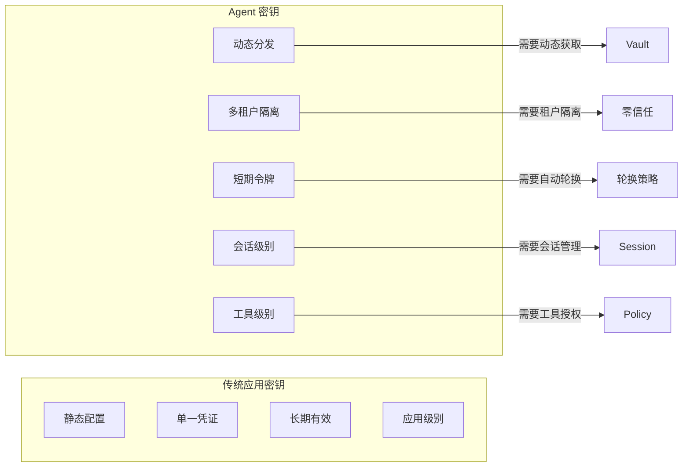
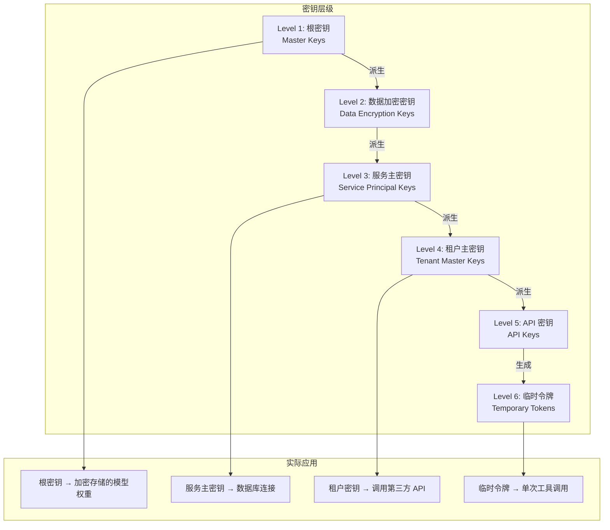
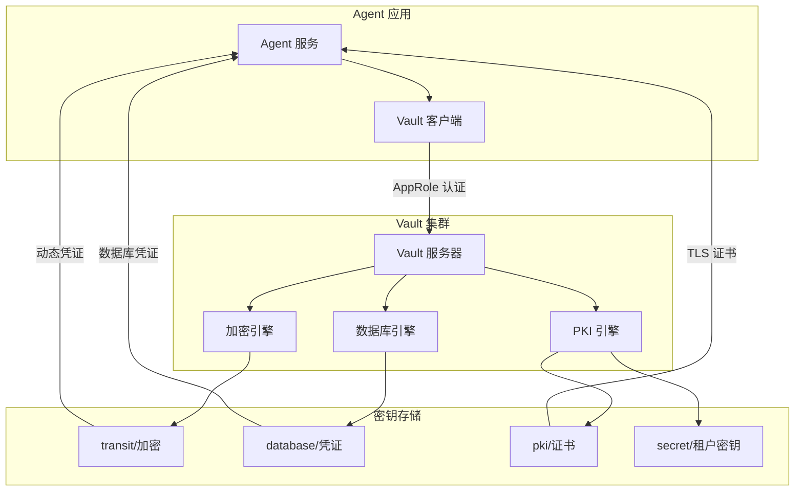
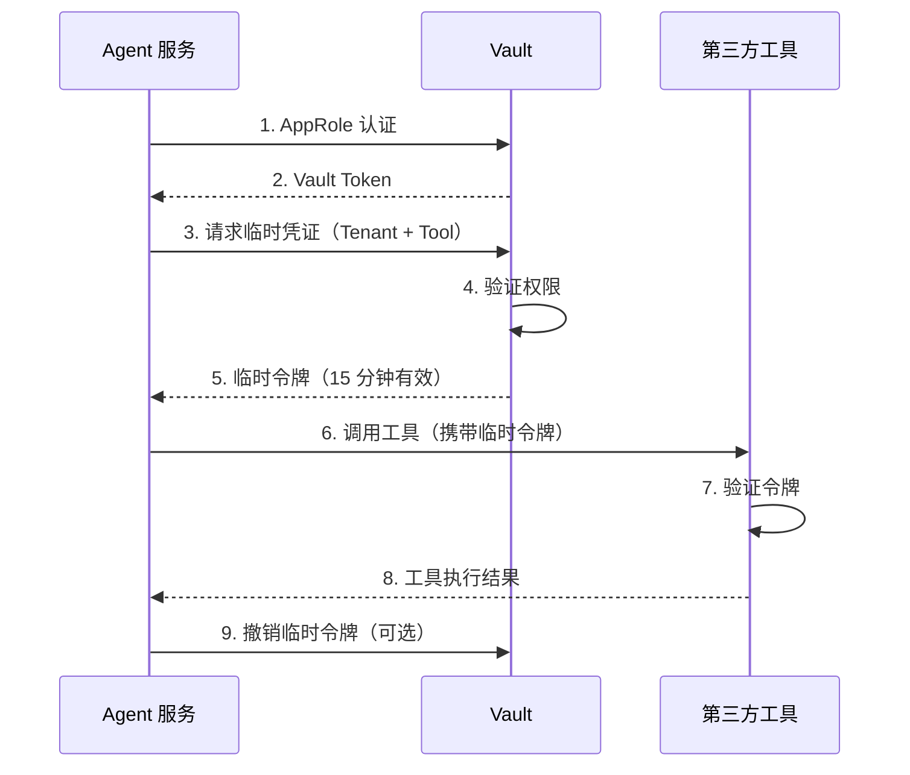
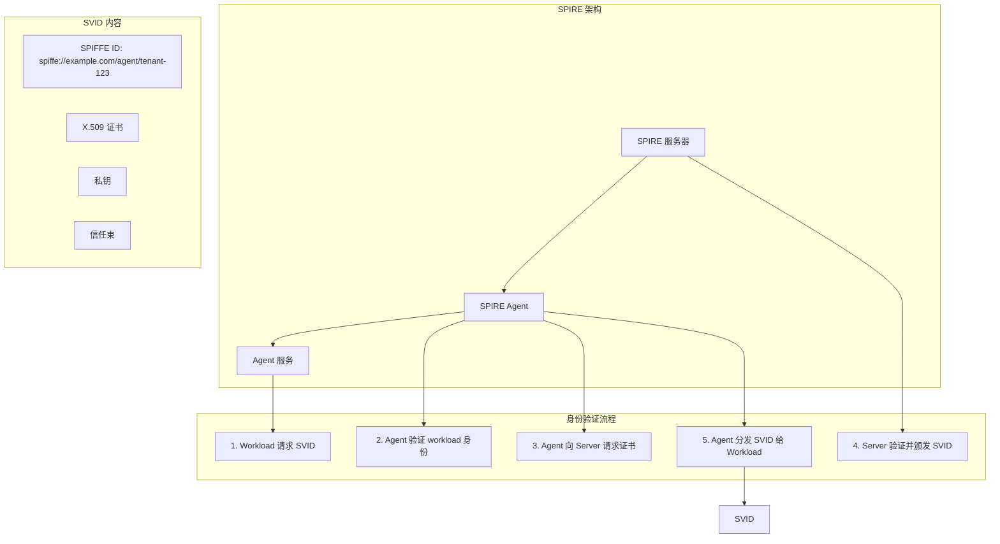
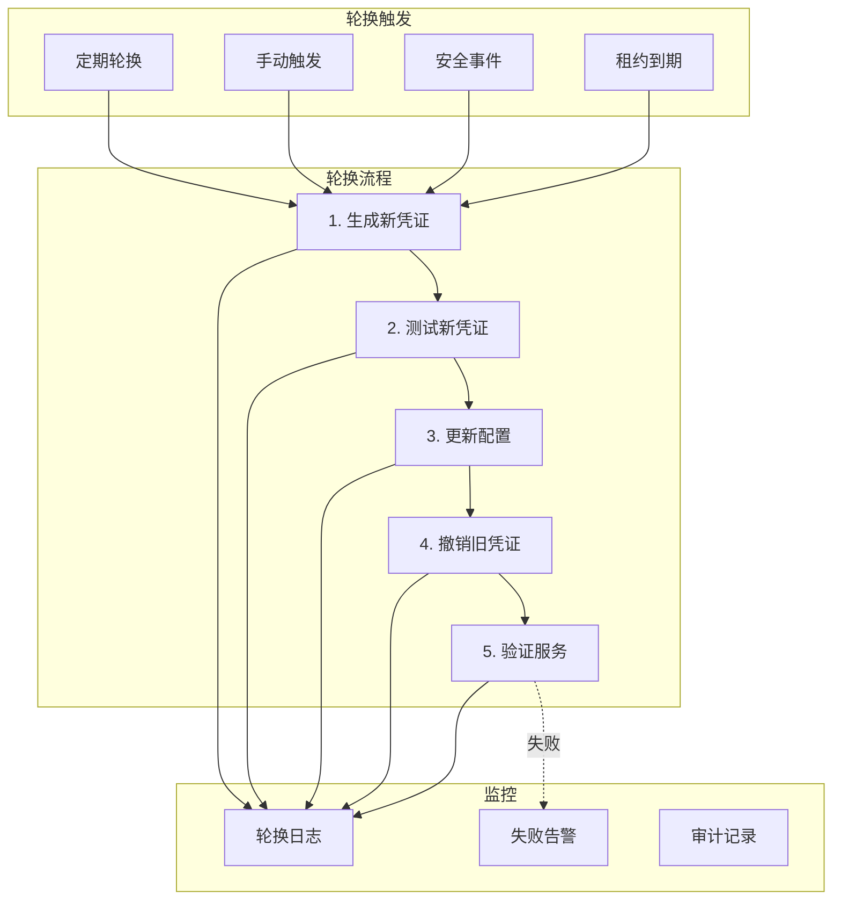
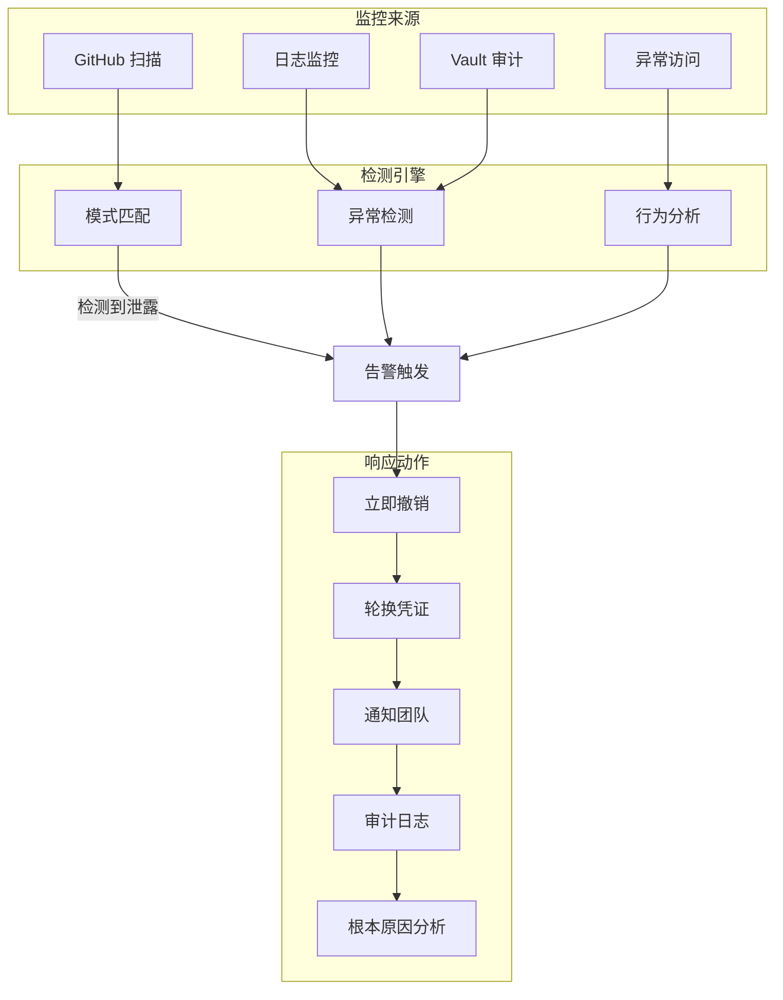
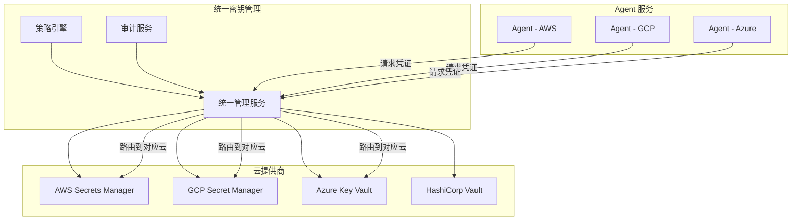

# 33 · Agent 密钥与凭证管理（Secret Management）

> 阶段：4 生产化 · 难度：⭐⭐⭐⭐⭐ · 预计：3 天
> 前置：[32 Agent 供应链安全](32-Agent供应链安全.md)
> 产出：掌握 Agent 系统的密钥层级架构、Vault 集成、动态凭证分发、零信任认证

> 来源：[HashiCorp Vault](https://www.vaultproject.io/) | [SPIFFE/SPIRE](https://spiffe.io/) | [NIST SP 800-57](https://csrc.nist.gov/publications/detail/sp/800-57-part-1/rev-5/final)

---

## 为什么 Agent 需要专门的密钥管理

### Agent 密钥特性



| 维度 | 传统应用 | Agent 系统 |
|------|---------|-----------|
| 密钥数量 | 固定（数据库、API 等） | 动态（每个租户、每个工具调用） |
| 生命周期 | 长期（月/年） | 短期（会话/临时） |
| 分发方式 | 启动时加载 | 运行时动态获取 |
| 隔离级别 | 应用级别 | 租户级别 + 工具级别 |
| 泄露影响 | 单个应用 | 可能跨租户泄露 |

---

## 密钥层级架构

### 分层设计



### Java 实现：密钥层级管理

```java
package com.example.security.secret;

import org.springframework.stereotype.Component;
import javax.crypto.*;
import java.security.*;
import java.util.*;

/**
 * 密钥层级管理器
 *
 * 实现多层密钥派生和管理
 */
@Component
public class KeyHierarchyManager {

    private final KeyStore rootKeyStore;
    private final Map<String, Dek> dataEncryptionKeys;
    private final Map<String, ServiceKey> serviceKeys;
    private final Map<String, TenantKey> tenantKeys;

    /**
     * 初始化密钥层级
     */
    public void initialize() {
        // Level 1: 根密钥（从 HSM 或 Vault 获取）
        SecretKey rootKey = loadRootKey();
        
        // Level 2: 数据加密密钥（DEK）
        Dek dek = deriveDataEncryptionKey(rootKey, "agent-db");
        dataEncryptionKeys.put("agent-db", dek);
        
        // Level 3: 服务主密钥
        ServiceKey serviceKey = deriveServiceKey(rootKey, "agent-service");
        serviceKeys.put("agent-service", serviceKey);
    }

    /**
     * 派生数据加密密钥
     */
    private Dek deriveDataEncryptionKey(SecretKey rootKey, String context) {
        try {
            // 使用 HKDF 派生密钥
            SecretKeyFactory hkdf = SecretKeyFactory.getInstance("HKDFWithHmacSHA256");
            
            HKDFParameterSpec spec = new HKDFParameterSpec(
                null,  // salt
                context.getBytes(),  // info
                256   // key length
            );
            
            SecretKey dek = hkdf.generateSecret(spec);
            
            return new Dek(
                Base64.getEncoder().encodeToString(dek.getEncoded()),
                Instant.now(),
                Instant.now().plus(90, ChronoUnit.DAYS) // 90 天有效期
            );
        } catch (Exception e) {
            throw new KeyDerivationException("无法派生数据加密密钥", e);
        }
    }

    /**
     * 为租户派生密钥
     */
    public TenantKey deriveTenantKey(String tenantId) {
        ServiceKey serviceKey = serviceKeys.get("agent-service");
        SecretKey root = decodeKey(serviceKey.encodedKey());
        
        // 使用租户 ID 作为上下文
        Dek tenantDek = deriveDataEncryptionKey(root, tenantId);
        
        return new TenantKey(
            tenantId,
            tenantDek.encodedKey(),
            Instant.now(),
            Instant.now().plus(30, ChronoUnit.DAYS), // 30 天
            Set.of("api_call", "database", "storage") // 权限范围
        );
    }

    /**
     * 生成临时令牌
     */
    public TemporaryToken generateTemporaryToken(String tenantId, String toolName) {
        TenantKey tenantKey = tenantKeys.get(tenantId);
        
        // 使用 JWT 或类似格式
        String token = generateJwt(
            tenantKey.encodedKey(),
            Map.of(
                "tenant", tenantId,
                "tool", toolName,
                "exp", Instant.now().plus(15, ChronoUnit.MINUTES).getEpochSecond()
            )
        );
        
        return new TemporaryToken(
            token,
            Instant.now(),
            Instant.now().plus(15, ChronoUnit.MINUTES),
            Set.of(toolName) // 仅限指定工具
        );
    }

    private SecretKey loadRootKey() {
        // 从 HSM 或 Vault 加载
        return null;
    }

    private SecretKey decodeKey(String encoded) {
        try {
            byte[] keyBytes = Base64.getDecoder().decode(encoded);
            return new SecretKeySpec(keyBytes, "AES");
        } catch (Exception e) {
            throw new RuntimeException(e);
        }
    }

    private String generateJwt(String secret, Map<String, Object> claims) {
        // JWT 生成逻辑
        return "";
    }
}

/**
 * 数据加密密钥
 */
record Dek(String encodedKey, Instant createdAt, Instant expiresAt) {}

/**
 * 服务主密钥
 */
record ServiceKey(String encodedKey, String serviceId, Instant createdAt, Instant expiresAt) {}

/**
 * 租户主密钥
 */
record TenantKey(
    String tenantId,
    String encodedKey,
    Instant createdAt,
    Instant expiresAt,
    Set<String> permissions
) {}

/**
 * 临时令牌
 */
record TemporaryToken(
    String token,
    Instant issuedAt,
    Instant expiresAt,
    Set<String> allowedTools
) {}
```

---

## HashiCorp Vault 集成

### 架构设计



### Java 实现：Vault Secret 提供者

```java
package com.example.security.secret.vault;

import org.springframework.stereotype.Component;
import org.springframework.vault.core.*;
import org.springframework.vault.support.*;

/**
 * HashiCorp Vault Secret 提供者
 *
 * 从 Vault 动态获取密钥和凭证
 */
@Component
public class VaultSecretProvider {

    private final VaultTemplate vaultTemplate;
    private final TransitVaultOperations transitOps;
    private final LeasesVaultOperations leaseOps;

    /**
     * 获取租户 API 密钥
     */
    public ApiCredentials getTenantApiCredentials(String tenantId, String provider) {
        String path = "secret/data/tenants/" + tenantId + "/" + provider;
        
        VaultResponseSupport response = vaultTemplate.read(path);
        
        if (response == null || !response.getData().containsKey("api_key")) {
            throw new SecretNotFoundException(
                "未找到租户 " + tenantId + " 的 " + provider + " 凭证"
            );
        }

        @SuppressWarnings("unchecked")
        Map<String, String> data = (Map<String, String>) response.getData();
        
        return new ApiCredentials(
            data.get("api_key"),
            data.getOrDefault("api_secret", ""),
            parseLeaseId(response.getLeaseId())
        );
    }

    /**
     * 获取数据库凭证（动态）
     */
    public DatabaseCredentials getDatabaseCredentials(String dbName) {
        String path = "database/creds/" + dbName;
        
        VaultResponseSupport response = vaultTemplate.read(path);
        
        @SuppressWarnings("unchecked")
        Map<String, String> data = (Map<String, String>) response.getData();
        
        return new DatabaseCredentials(
            data.get("username"),
            data.get("password"),
            parseLeaseId(response.getLeaseId())
        );
    }

    /**
     * 加密数据
     */
    public String encrypt(String plaintext, String keyName) {
        return transitOps.encrypt(keyName, plaintext);
    }

    /**
     * 解密数据
     */
    public String decrypt(String ciphertext, String keyName) {
        return transitOps.decrypt(keyName, ciphertext);
    }

    /**
     * 续租租约
     */
    public void renewLease(String leaseId, long increment) {
        leaseOps.renew(leaseId, increment);
    }

    /**
     * 撤销租约
     */
    public void revokeLease(String leaseId) {
        leaseOps.revoke(leaseId);
    }

    private LeaseId parseLeaseId(String leaseIdStr) {
        return new LeaseId(leaseIdStr);
    }
}

/**
 * API 凭证
 */
record ApiCredentials(String apiKey, String apiSecret, LeaseId leaseId) {}

/**
 * 数据库凭证
 */
record DatabaseCredentials(String username, String password, LeaseId leaseId) {}

/**
 * 租约 ID
 */
record LeaseId(String id) {
    public boolean isExpired() {
        return false; // 检查租约是否过期
    }
}

class SecretNotFoundException extends RuntimeException {
    public SecretNotFoundException(String message) {
        super(message);
    }
}
```

### 数据库凭证自动轮换

```java
package com.example.security.secret.vault;

import org.springframework.scheduling.annotation.Scheduled;
import org.springframework.stereotype.Component;
import java.util.*;

/**
 * 数据库凭证轮换调度器
 *
 * 定期轮换数据库凭证，防止长期使用同一凭证
 */
@Component
public class DatabaseCredentialRotator {

    private final VaultSecretProvider vaultProvider;
    private final Map<String, LeaseId> activeLeases;

    /**
     * 每 24 小时轮换数据库凭证
     */
    @Scheduled(cron = "0 0 */24 * * ?")
    public void rotateCredentials() {
        List<String> databases = List.of("agent_db", "analytics_db", "cache_db");
        
        for (String db : databases) {
            try {
                // 1. 获取新凭证
                DatabaseCredentials newCreds = vaultProvider.getDatabaseCredentials(db);
                
                // 2. 更新应用配置
                updateApplicationConfig(db, newCreds);
                
                // 3. 撤销旧租约
                LeaseId oldLease = activeLeases.get(db);
                if (oldLease != null) {
                    vaultProvider.revokeLease(oldLease.id());
                }
                
                // 4. 保存新租约
                activeLeases.put(db, newCreds.leaseId());
                
            } catch (Exception e) {
                // 记录失败，下次重试
            }
        }
    }

    private void updateApplicationConfig(String db, DatabaseCredentials creds) {
        // 动态更新数据源配置
        // 可以通过配置中心或 JMX 实现
    }
}
```

---

## Agent 凭证动态分发

### 分发流程



### Java 实现：动态凭证管理器

```java
package com.example.security.secret.dynamic;

import org.springframework.stereotype.Component;
import java.util.*;
import java.util.concurrent.*;

/**
 * 动态凭证管理器
 *
 * 为 Agent 会话动态分发和回收凭证
 */
@Component
public class DynamicCredentialManager {

    private final VaultSecretProvider vaultProvider;
    private final Map<String, SessionCredentials> sessionCredentials;
    private final ScheduledExecutorService cleanupExecutor;

    /**
     * 为会话创建凭证
     */
    public SessionCredentials createCredentialsForSession(String sessionId, 
                                                          String tenantId, 
                                                          Set<String> requiredTools) {
        
        Map<String, ToolCredentials> toolCredentials = new HashMap<>();
        
        // 为每个需要的工具获取临时凭证
        for (String tool : requiredTools) {
            String vaultPath = getVaultPathForTool(tool);
            
            try {
                // 从 Vault 获取工具专用凭证
                ToolCredentials creds = vaultProvider.getToolCredentials(
                    tenantId, 
                    tool
                );
                toolCredentials.put(tool, creds);
                
            } catch (Exception e) {
                // 工具凭证获取失败
                throw new CredentialProvisionException(
                    "无法为工具 " + tool + " 获取凭证", e
                );
            }
        }
        
        SessionCredentials sessionCreds = new SessionCredentials(
            sessionId,
            tenantId,
            toolCredentials,
            Instant.now(),
            Instant.now().plus(30, ChronoUnit.MINUTES)
        );
        
        sessionCredentials.put(sessionId, sessionCreds);
        
        // 安排自动清理
        scheduleCleanup(sessionId, sessionCreds.expiresAt());
        
        return sessionCreds;
    }

    /**
     * 获取会话的凭证
     */
    public Optional<ToolCredentials> getCredentialsForTool(String sessionId, 
                                                          String toolName) {
        SessionCredentials sessionCreds = sessionCredentials.get(sessionId);
        
        if (sessionCreds == null) {
            return Optional.empty();
        }
        
        if (sessionCreds.expiresAt().isBefore(Instant.now())) {
            // 会话已过期
            cleanupSession(sessionId);
            return Optional.empty();
        }
        
        return Optional.ofNullable(sessionCreds.toolCredentials().get(toolName));
    }

    /**
     * 撤销会话的所有凭证
     */
    public void revokeSession(String sessionId) {
        SessionCredentials sessionCreds = sessionCredentials.get(sessionId);
        
        if (sessionCreds == null) {
            return;
        }
        
        // 撤销所有工具的 Vault 租约
        for (ToolCredentials creds : sessionCreds.toolCredentials().values()) {
            try {
                vaultProvider.revokeLease(creds.leaseId().id());
            } catch (Exception e) {
                // 记录撤销失败
            }
        }
        
        sessionCredentials.remove(sessionId);
    }

    /**
     * 安排定时清理
     */
    private void scheduleCleanup(String sessionId, Instant expiresAt) {
        long delay = Duration.between(Instant.now(), expiresAt).toMillis();
        
        cleanupExecutor.schedule(() -> {
            cleanupSession(sessionId);
        }, delay, TimeUnit.MILLISECONDS);
    }

    private void cleanupSession(String sessionId) {
        SessionCredentials removed = sessionCredentials.remove(sessionId);
        if (removed != null) {
            // 撤销 Vault 租约
            revokeSession(sessionId);
        }
    }

    private String getVaultPathForTool(String toolName) {
        return "secret/data/tools/" + toolName;
    }
}

/**
 * 会话凭证
 */
record SessionCredentials(
    String sessionId,
    String tenantId,
    Map<String, ToolCredentials> toolCredentials,
    Instant createdAt,
    Instant expiresAt
) {}

/**
 * 工具凭证
 */
record ToolCredentials(
    String toolName,
    Map<String, String> credentials,
    LeaseId leaseId,
    Instant expiresAt
) {}
```

---

## 零信任架构下的 Agent 认证

### SPIFFE/SPIRE 架构



### Java 实现：SPIFFE 证书验证器

```java
package com.example.security.spiffe;

import org.springframework.stereotype.Component;
import java.security.*;
import java.security.cert.*;
import java.util.*;

/**
 * SPIFFE/SPIRE 证书验证器
 *
 * 验证 SPIFFE 身份和证书
 */
@Component
public class SpiffeCertificateVerifier {

    private final Set<X509Certificate> trustedBundles;

    /**
     * 验证 SPIFFE 证书
     */
    public VerificationResult verifyCertificate(X509Certificate cert) {
        try {
            // 1. 验证签名（使用信任束）
            verifySignature(cert);
            
            // 2. 提取 SPIFFE ID
            String spiffeId = extractSpiffeId(cert);
            if (spiffeId == null) {
                return VerificationResult.failed("证书不包含 SPIFFE ID");
            }
            
            // 3. 验证 SPIFFE ID 格式
            if (!isValidSpiffeId(spiffeId)) {
                return VerificationResult.failed("SPIFFE ID 格式无效");
            }
            
            // 4. 验证有效期
            cert.checkValidity();
            
            // 5. 验证身份
            SpiffeIdentity identity = parseSpiffeId(spiffeId);
            if (!isAuthorized(identity)) {
                return VerificationResult.failed("身份未被授权");
            }
            
            return VerificationResult.success(identity);
            
        } catch (Exception e) {
            return VerificationResult.failed("证书验证失败: " + e.getMessage());
        }
    }

    /**
     * 提取 SPIFFE ID
     */
    private String extractSpiffeId(X509Certificate cert) {
        try {
            // 从 SAN (Subject Alternative Name) 扩展提取
            Collection<List<?>> sans = cert.getSubjectAlternativeNames();
            
            if (sans != null) {
                for (List<?> san : sans) {
                    Integer type = (Integer) san.get(0);
                    if (type == 6) { // URI
                        String uri = (String) san.get(1);
                        if (uri.startsWith("spiffe://")) {
                            return uri;
                        }
                    }
                }
            }
            return null;
        } catch (Exception e) {
            return null;
        }
    }

    /**
     * 解析 SPIFFE ID
     */
    private SpiffeIdentity parseSpiffeId(String spiffeId) {
        // spiffe://example.com/agent/tenant-123
        String[] parts = spiffeId.replace("spiffe://", "").split("/", 3);
        
        return new SpiffeIdentity(
            parts[0], // trust domain
            parts[1], // workload type
            parts[2]  // workload ID
        );
    }

    private boolean isValidSpiffeId(String spiffeId) {
        return spiffeId != null && 
               spiffeId.startsWith("spiffe://") &&
               spiffeId.split("/").length >= 4;
    }

    private boolean isAuthorized(SpiffeIdentity identity) {
        // 检查身份是否在授权列表中
        return identity.trustDomain().equals("example.com") &&
               (identity.workloadType().equals("agent") ||
                identity.workloadType().equals("tool"));
    }

    private void verifySignature(X509Certificate cert) throws CertificateException {
        // 使用信任束验证证书签名
    }
}

/**
 * SPIFFE 身份
 */
record SpiffeIdentity(
    String trustDomain,
    String workloadType,
    String workloadId
) {
    public String toSpiffeId() {
        return String.format("spiffe://%s/%s/%s", 
            trustDomain, workloadType, workloadId);
    }
}

/**
 * 验证结果
 */
record VerificationResult(
    boolean success,
    SpiffeIdentity identity,
    String errorMessage
) {
    static VerificationResult success(SpiffeIdentity identity) {
        return new VerificationResult(true, identity, null);
    }
    static VerificationResult failed(String message) {
        return new VerificationResult(false, null, message);
    }
}
```

---

## 凭证轮换与过期管理

### 轮换策略



### Java 实现：令牌轮换调度器

```java
package com.example.security.secret.rotation;

import org.springframework.scheduling.annotation.Scheduled;
import org.springframework.stereotype.Component;
import java.util.*;

/**
 * 令牌轮换调度器
 *
 * 自动轮换即将过期的凭证
 */
@Component
public class TokenRotationScheduler {

    private final DynamicCredentialManager credentialManager;
    private final Map<String, RotationState> rotationStates;

    /**
     * 每小时检查即将过期的凭证
     */
    @Scheduled(cron = "0 0 * * * ?")
    public void checkAndRotateExpiringCredentials() {
        Instant threshold = Instant.now().plus(6, ChronoUnit.HOURS); // 6 小时后过期
        
        List<String> toRotate = findExpiringCredentials(threshold);
        
        for (String credentialId : toRotate) {
            rotateCredential(credentialId);
        }
    }

    /**
     * 轮换单个凭证
     */
    public void rotateCredential(String credentialId) {
        RotationState state = rotationStates.get(credentialId);
        
        if (state != null && state.status() == RotationStatus.IN_PROGRESS) {
            // 已经在轮换中，跳过
            return;
        }
        
        state = new RotationState(
            credentialId,
            RotationStatus.IN_PROGRESS,
            Instant.now()
        );
        rotationStates.put(credentialId, state);
        
        try {
            // 1. 获取新凭证
            Object newCredential = obtainNewCredential(credentialId);
            
            // 2. 验证新凭证可用性
            if (!testCredential(newCredential)) {
                throw new RotationException("新凭证测试失败");
            }
            
            // 3. 更新配置
            updateConfiguration(credentialId, newCredential);
            
            // 4. 撤销旧凭证
            revokeOldCredential(credentialId);
            
            // 5. 更新状态
            state = new RotationState(
                credentialId,
                RotationStatus.SUCCESS,
                Instant.now()
            );
            rotationStates.put(credentialId, state);
            
        } catch (Exception e) {
            state = new RotationState(
                credentialId,
                RotationStatus.FAILED,
                Instant.now()
            );
            rotationStates.put(credentialId, state);
            
            // 发送告警
            alertRotationFailure(credentialId, e);
        }
    }

    /**
     * 紧急轮换（响应安全事件）
     */
    public void emergencyRotation(String credentialId) {
        // 立即轮换，不等待正常周期
        rotateCredential(credentialId);
    }

    private List<String> findExpiringCredentials(Instant threshold) {
        // 查询即将过期的凭证
        return List.of();
    }

    private Object obtainNewCredential(String credentialId) {
        // 从 Vault 获取新凭证
        return null;
    }

    private boolean testCredential(Object credential) {
        // 测试凭证是否可用
        return true;
    }

    private void updateConfiguration(String credentialId, Object newCredential) {
        // 动态更新配置
    }

    private void revokeOldCredential(String credentialId) {
        // 撤销旧凭证
    }

    private void alertRotationFailure(String credentialId, Exception e) {
        // 发送告警
    }
}

/**
 * 轮换状态
 */
record RotationState(
    String credentialId,
    RotationStatus status,
    Instant timestamp
) {}

enum RotationStatus {
    PENDING,
    IN_PROGRESS,
    SUCCESS,
    FAILED
}
```

---

## 密钥泄露检测与应急响应

### 泄露检测流程



### Java 实现：泄露检测器

```java
package com.example.security.secret.leak;

import org.springframework.stereotype.Component;
import java.util.*;
import java.util.regex.*;

/**
 * 密钥泄露检测器
 *
 * 检测密钥是否在代码仓库、日志等地方泄露
 */
@Component
public class SecretLeakDetector {

    private static final List<Pattern> SECRET_PATTERNS = List.of(
        // API Keys
        Pattern.compile("(?i)api[_-]?key[\"']?\\s*[:=]\\s*[\"']?([a-z0-9]{32,})[\"']?"),
        Pattern.compile("(?i)(sk-|AKIA|ghp_|gho_|ghu_|ghs_|ghr_)[a-zA-Z0-9]{20,}"),
        
        // Database URLs
        Pattern.compile("(?i)(mysql|postgres|mongodb)://[^\\s:\"']+:[^\\s:\"']+@[^\\s:\"']+"),
        
        // JWT Tokens
        Pattern.compile("eyJ[a-zA-Z0-9_-]+\\.eyJ[a-zA-Z0-9_-]+\\.[a-zA-Z0-9_-]+"),
        
        // Vault Tokens
        Pattern.compile("s\\.[a-zA-Z0-9]{20,}")
    );

    /**
     * 扫描代码查找泄露的密钥
     */
    public List<LeakFinding> scanCodebase(String repositoryUrl) {
        List<LeakFinding> findings = new ArrayList<>();
        
        // 获取所有文件
        List<String> files = getRepositoryFiles(repositoryUrl);
        
        for (String file : files) {
            String content = readFileContent(file);
            
            for (Pattern pattern : SECRET_PATTERNS) {
                Matcher matcher = pattern.matcher(content);
                
                while (matcher.find()) {
                    findings.add(new LeakFinding(
                        file,
                        matcher.group(1),
                        LeakSeverity.HIGH,
                        "检测到疑似密钥泄露"
                    ));
                }
            }
        }
        
        return findings;
    }

    /**
     * 扫描日志查找泄露的密钥
     */
    public List<LeakFinding> scanLogs(String logPath) {
        // 实现类似逻辑
        return List.of();
    }

    /**
     * 应急响应
     */
    public void respondToLeak(LeakFinding leak) {
        // 1. 立即撤销泄露的凭证
        revokeCredential(leak.leakedSecret());
        
        // 2. 生成新凭证
        String newCredential = generateNewCredential();
        
        // 3. 通知团队
        notifyTeam(leak, newCredential);
        
        // 4. 记录事件
        recordLeakIncident(leak);
    }

    private void revokeCredential(String credentialId) {
        // 通过 Vault 撤销
    }

    private String generateNewCredential() {
        // 生成新凭证
        return "";
    }

    private void notifyTeam(LeakFinding leak, String newCredential) {
        // 发送通知
    }

    private void recordLeakIncident(LeakFinding leak) {
        // 记录到审计日志
    }

    private List<String> getRepositoryFiles(String repositoryUrl) {
        return List.of();
    }

    private String readFileContent(String file) {
        return "";
    }
}

/**
 * 泄露发现
 */
record LeakFinding(
    String source,
    String leakedSecret,
    LeakSeverity severity,
    String description
) {}

enum LeakSeverity { LOW, MEDIUM, HIGH, CRITICAL }
```

---

## 多云环境下的统一密钥管理

### 多云架构



### Java 实现：多云密钥管理器

```java
package com.example.security.secret.multi;

import org.springframework.stereotype.Component;
import java.util.*;

/**
 * 多云密钥管理器
 *
 * 统一管理多个云提供商的密钥
 */
@Component
public class CloudSecretManager {

    private final Map<String, CloudSecretProvider> providers;
    private final SecretRoutingPolicy routingPolicy;

    /**
     * 获取密钥（自动路由到对应云）
     */
    public SecretValue getSecret(String secretId, String cloudHint) {
        CloudSecretProvider provider = resolveProvider(secretId, cloudHint);
        
        return provider.getSecret(secretId);
    }

    /**
     * 创建密钥（自动选择目标云）
     */
    public void createSecret(String secretId, SecretValue value, 
                             String preferredCloud) {
        CloudSecretProvider provider = providers.get(preferredCloud);
        
        if (provider == null) {
            throw new UnsupportedCloudException(
                "不支持的云提供商: " + preferredCloud
            );
        }
        
        provider.createSecret(secretId, value);
    }

    /**
     * 同步密钥到多个云
     */
    public void syncSecret(String secretId, Set<String> targetClouds) {
        SecretValue value = getSecret(secretId, null);
        
        for (String cloud : targetClouds) {
            CloudSecretProvider provider = providers.get(cloud);
            if (provider != null) {
                provider.createSecret(secretId, value);
            }
        }
    }

    /**
     * 轮换密钥（所有云）
     */
    public void rotateSecret(String secretId) {
        for (CloudSecretProvider provider : providers.values()) {
            try {
                provider.rotateSecret(secretId);
            } catch (Exception e) {
                // 记录失败，继续轮换其他云
            }
        }
    }

    /**
     * 撤销密钥（所有云）
     */
    public void revokeSecret(String secretId) {
        for (CloudSecretProvider provider : providers.values()) {
            provider.deleteSecret(secretId);
        }
    }

    private CloudSecretProvider resolveProvider(String secretId, String hint) {
        if (hint != null && providers.containsKey(hint)) {
            return providers.get(hint);
        }
        
        // 根据策略路由
        return routingPolicy.route(secretId);
    }
}

/**
 * 云提供商接口
 */
interface CloudSecretProvider {
    SecretValue getSecret(String secretId);
    void createSecret(String secretId, SecretValue value);
    void rotateSecret(String secretId);
    void deleteSecret(String secretId);
}

/**
 * 密钥值
 */
record SecretValue(String value, Map<String, String> metadata) {}
```

---

## 验收检查

- [ ] 理解 Agent 密钥与传统应用密钥的区别
- [ ] 能实现密钥层级架构（6 层派生）
- [ ] 能集成 HashiCorp Vault 获取动态凭证
- [ ] 能实现动态凭证分发和会话管理
- [ ] 能实现 SPIFFE/SPIRE 证书验证
- [ ] 能实现凭证轮换调度
- [ ] 能实现密钥泄露检测和应急响应
- [ ] 能实现多云环境统一密钥管理

---

## 下一步

→ 下一篇：[34 Agent 数据管线工程](34-Agent数据管线工程.md)
