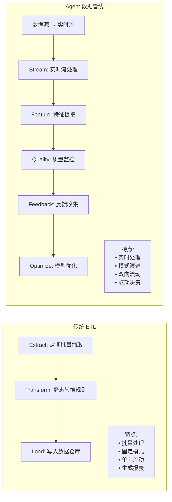
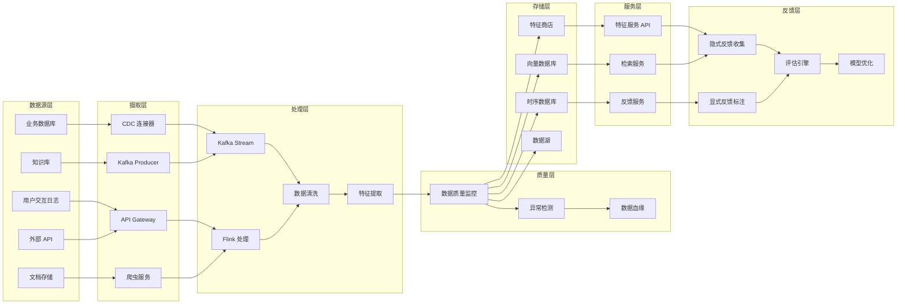
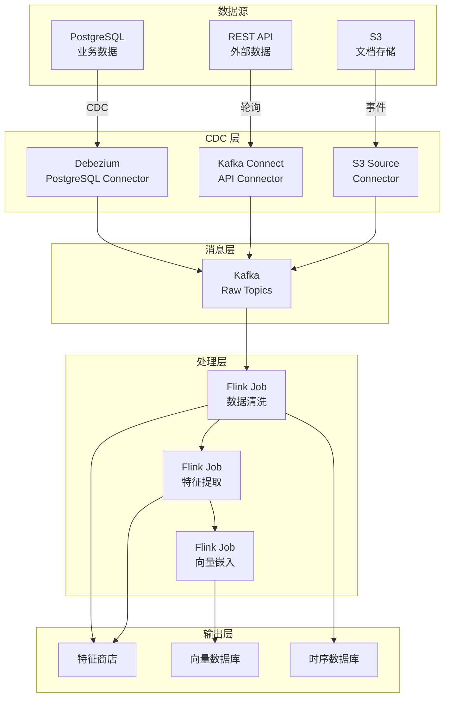
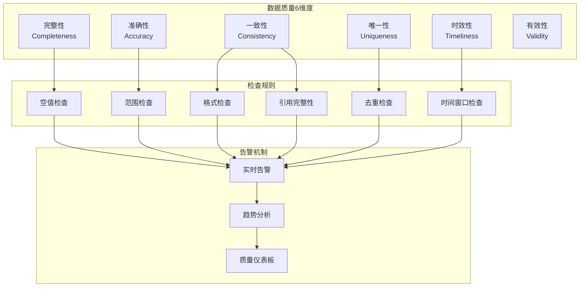
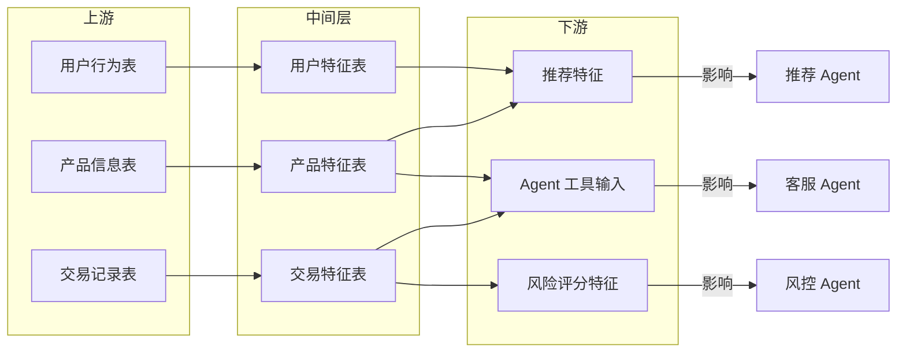
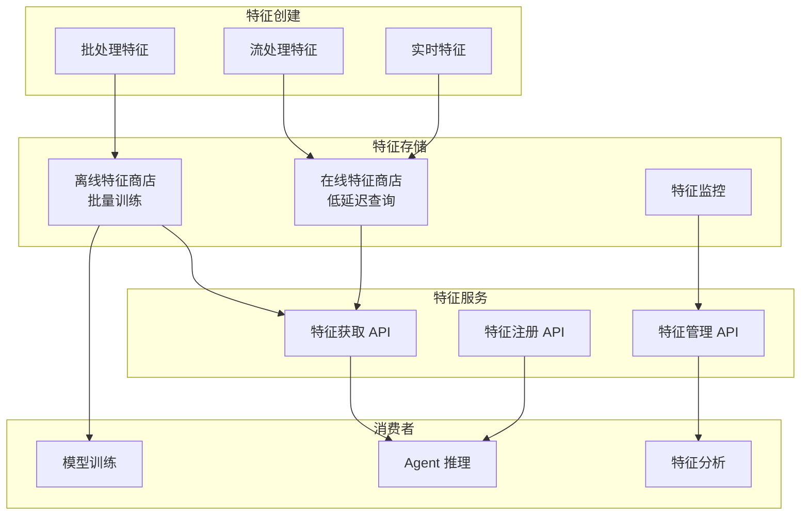
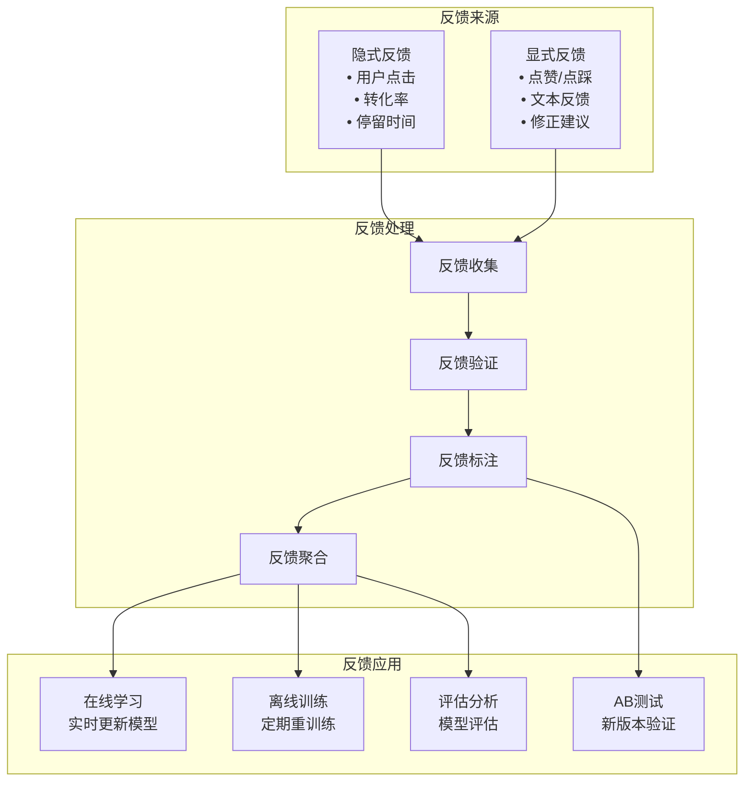
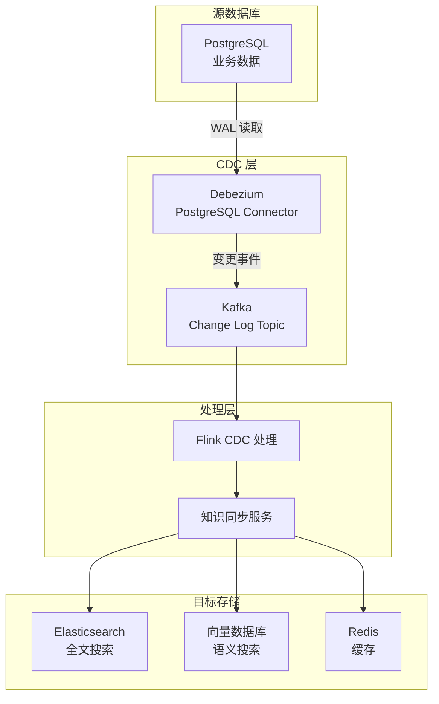

# 34 · Agent 数据管线工程（Data Pipeline Engineering）

> 阶段：4 生产化 · 难度：⭐⭐⭐⭐⭐ · 预计：3 天
> 前置：[33 Agent 密钥与凭证管理](33-Agent密钥与凭证管理.md)
> 产出：掌握 Agent 数据管线架构、实时数据摄取、质量监控、特征商店、反馈闭环

> 来源：[Data Engineering for AI Systems](https://www.databricks.com/blog/data-engineering-ai) | [Feature Stores for ML](https://www.featurestore.org/) | [CDC Patterns](https://debezium.io/documentation/reference/

---

## Agent 数据管线 vs 传统 ETL

### 对比分析



| 维度 | 传统 ETL | Agent 数据管线 |
|------|---------|--------------|
| 数据源 | 关系型数据库、文件 | 多模态：文本、图像、语音、视频、结构化数据 |
| 处理模式 | 批量（T+1） | 实时 + 批量混合 |
| 数据质量 | 基本验证 | 6 维度质量监控 |
| 数据用途 | BI 报表、决策支持 | Agent 推理、工具调用、模型训练 |
| 反馈闭环 | 无 | 隐式 + 显式反馈 → 模型优化 |
| 模式变化 | 需要手动迁移 | 自动模式演进 |

---

## 数据管线全貌

### 端到端架构



---

## 实时数据摄取架构

### Kafka + Flink 流处理



### Java 实现：数据管线编排器

```java
package com.example.data.pipeline;

import org.springframework.stereotype.Component;
import java.util.*;
import java.util.concurrent.*;

/**
 * Agent 数据管线编排器
 *
 * 协调数据从源到存储的整个流程
 */
@Component
public class DataPipelineOrchestrator {

    private final List<DataIngestor> ingestors;
    private final List<DataProcessor> processors;
    private final List<DataSink> sinks;
    private final ExecutorService pipelineExecutor;

    /**
     * 启动完整管线
     */
    public PipelineResult runPipeline(PipelineConfig config) {
        PipelineResult result = new PipelineResult(config.pipelineId());

        try {
            // 1. 摄取阶段
            List<IngestionResult> ingestionResults = 
                executeIngestion(config.sources());

            // 2. 处理阶段
            List<ProcessingResult> processingResults = 
                executeProcessing(ingestionResults, config.processors());

            // 3. 输出阶段
            List<SinkResult> sinkResults = 
                executeSinks(processingResults, config.sinks());

            // 4. 质量检查
            QualityReport qualityReport = 
                checkDataQuality(sinkResults, config.qualityRules());

            return result.withIngestion(ingestionResults)
                        .withProcessing(processingResults)
                        .withSinks(sinkResults)
                        .withQuality(qualityReport);

        } catch (Exception e) {
            return result.withError(e);
        }
    }

    /**
     * 摄取数据
     */
    private List<IngestionResult> executeIngestion(
            List<DataSource> sources) {
        
        List<CompletableFuture<IngestionResult>> futures = new ArrayList<>();

        for (DataSource source : sources) {
            futures.add(CompletableFuture.supplyAsync(() -> {
                DataIngestor ingestor = findIngestor(source.type());
                return ingestor.ingest(source);
            }, pipelineExecutor));
        }

        return waitForAll(futures);
    }

    /**
     * 处理数据
     */
    private List<ProcessingResult> executeProcessing(
            List<IngestionResult> ingestionResults,
            List<ProcessorConfig> processorConfigs) {
        
        List<CompletableFuture<ProcessingResult>> futures = new ArrayList<>();

        for (IngestionResult ingestion : ingestionResults) {
            for (ProcessorConfig config : processorConfigs) {
                futures.add(CompletableFuture.supplyAsync(() -> {
                    DataProcessor processor = findProcessor(config.type());
                    return processor.process(ingestion.data(), config);
                }, pipelineExecutor));
            }
        }

        return waitForAll(futures);
    }

    /**
     * 输出到存储
     */
    private List<SinkResult> executeSinks(
            List<ProcessingResult> processingResults,
            List<SinkConfig> sinkConfigs) {
        
        List<CompletableFuture<SinkResult>> futures = new ArrayList<>();

        for (ProcessingResult processing : processingResults) {
            for (SinkConfig config : sinkConfigs) {
                futures.add(CompletableFuture.supplyAsync(() -> {
                    DataSink sink = findSink(config.type());
                    return sink.write(processing.data(), config);
                }, pipelineExecutor));
            }
        }

        return waitForAll(futures);
    }

    /**
     * 数据质量检查
     */
    private QualityReport checkDataQuality(
            List<SinkResult> sinkResults,
            QualityRules rules) {
        
        QualityReport report = new QualityReport();

        for (SinkResult result : sinkResults) {
            // 检查完整性
            boolean complete = rules.checkCompleteness(result.data());

            // 检查准确性
            boolean accurate = rules.checkAccuracy(result.data());

            // 检查一致性
            boolean consistent = rules.checkConsistency(result.data());

            // 检查时效性
            boolean timely = rules.checkTimeliness(result.data());

            report.addMetric(result.sinkId(), new QualityMetrics(
                complete, accurate, consistent, timely
            ));
        }

        return report;
    }

    private <T> List<T> waitForAll(List<CompletableFuture<T>> futures) {
        CompletableFuture.allOf(futures.toArray(new CompletableFuture[0])).join();
        return futures.stream()
            .map(CompletableFuture::join)
            .toList();
    }

    private DataIngestor findIngestor(String type) {
        return ingestors.stream()
            .filter(i -> i.supports(type))
            .findFirst()
            .orElseThrow();
    }

    private DataProcessor findProcessor(String type) {
        return processors.stream()
            .filter(p -> p.supports(type))
            .findFirst()
            .orElseThrow();
    }

    private DataSink findSink(String type) {
        return sinks.stream()
            .filter(s -> s.supports(type))
            .findFirst()
            .orElseThrow();
    }
}

/**
 * 数据摄取器接口
 */
interface DataIngestor {
    IngestionResult ingest(DataSource source);
    boolean supports(String type);
}

/**
 * 数据处理器接口
 */
interface DataProcessor {
    ProcessingResult process(DataBatch data, ProcessorConfig config);
    boolean supports(String type);
}

/**
 * 数据输出接口
 */
interface DataSink {
    SinkResult write(DataBatch data, SinkConfig config);
    boolean supports(String type);
}

/**
 * 管线配置
 */
record PipelineConfig(
    String pipelineId,
    List<DataSource> sources,
    List<ProcessorConfig> processors,
    List<SinkConfig> sinks,
    QualityRules qualityRules
) {}

/**
 * 管线结果
 */
class PipelineResult {
    private final String pipelineId;
    private List<IngestionResult> ingestionResults;
    private List<ProcessingResult> processingResults;
    private List<SinkResult> sinkResults;
    private QualityReport qualityReport;
    private Exception error;

    public PipelineResult withIngestion(List<IngestionResult> results) {
        this.ingestionResults = results;
        return this;
    }

    public PipelineResult withProcessing(List<ProcessingResult> results) {
        this.processingResults = results;
        return this;
    }

    public PipelineResult withSinks(List<SinkResult> results) {
        this.sinkResults = results;
        return this;
    }

    public PipelineResult withQuality(QualityReport report) {
        this.qualityReport = report;
        return this;
    }

    public PipelineResult withError(Exception e) {
        this.error = e;
        return this;
    }

    public boolean isSuccess() {
        return error == null && 
               qualityReport != null && 
               qualityReport.isAcceptable();
    }
}

/**
 * 质量报告
 */
class QualityReport {
    private final Map<String, QualityMetrics> metrics = new HashMap<>();

    public void addMetric(String sinkId, QualityMetrics metric) {
        metrics.put(sinkId, metric);
    }

    public boolean isAcceptable() {
        return metrics.values().stream()
            .allMatch(m -> m.complete() && m.accurate());
    }
}

record QualityMetrics(
    boolean complete,
    boolean accurate,
    boolean consistent,
    boolean timely
) {}
```

---

## 数据质量监控框架

### 6 维度监控



### Java 实现：质量监控器

```java
package com.example.data.quality;

import org.springframework.stereotype.Component;
import java.util.*;
import java.util.stream.*;

/**
 * 数据质量监控器
 *
 * 监控 6 维度数据质量
 */
@Component
public class DataQualityMonitor {

    private final List<QualityCheck> checks;
    private final QualityMetricsStore metricsStore;

    /**
     * 检查数据质量
     */
    public QualityScore checkQuality(DataBatch batch) {
        QualityScore score = new QualityScore(batch.batchId());

        // 1. 完整性检查
        boolean complete = checkCompleteness(batch);
        score.addDimension("completeness", complete ? 100 : 0);

        // 2. 准确性检查
        boolean accurate = checkAccuracy(batch);
        score.addDimension("accuracy", accurate ? 100 : 0);

        // 3. 一致性检查
        boolean consistent = checkConsistency(batch);
        score.addDimension("consistency", consistent ? 100 : 0);

        // 4. 时效性检查
        int timelyScore = checkTimeliness(batch);
        score.addDimension("timeliness", timelyScore);

        // 5. 唯一性检查
        boolean unique = checkUniqueness(batch);
        score.addDimension("uniqueness", unique ? 100 : 0);

        // 6. 有效性检查
        boolean valid = checkValidity(batch);
        score.addDimension("validity", valid ? 100 : 0);

        // 存储指标
        metricsStore.save(score);

        return score;
    }

    /**
     * 完整性检查
     */
    private boolean checkCompleteness(DataBatch batch) {
        // 检查必填字段是否为空
        return batch.rows().stream()
            .allMatch(row -> {
                for (String requiredField : batch.schema().requiredFields()) {
                    if (row.get(requiredField) == null) {
                        return false;
                    }
                }
                return true;
            });
    }

    /**
     * 准确性检查
     */
    private boolean checkAccuracy(DataBatch batch) {
        // 检查数值是否在合理范围
        return batch.rows().stream()
            .allMatch(row -> {
                for (Field field : batch.schema().numericFields()) {
                    Object value = row.get(field.name());
                    if (value instanceof Number number) {
                        if (!field.inRange(number.doubleValue())) {
                            return false;
                        }
                    }
                }
                return true;
            });
    }

    /**
     * 一致性检查
     */
    private boolean checkConsistency(DataBatch batch) {
        // 检查引用完整性
        return batch.rows().stream()
            .allMatch(row -> {
                for (Reference ref : batch.schema().references()) {
                    Object value = row.get(ref.sourceField());
                    if (value != null && !ref.isValid(value)) {
                        return false;
                    }
                }
                return true;
            });
    }

    /**
     * 时效性检查（返回分数）
     */
    private int checkTimeliness(DataBatch batch) {
        Instant now = Instant.now();
        Instant batchTime = batch.timestamp();

        // 数据延迟评分
        long delayMinutes = ChronoUnit.MINUTES.between(batchTime, now);

        if (delayMinutes < 5) return 100;
        if (delayMinutes < 15) return 80;
        if (delayMinutes < 30) return 60;
        if (delayMinutes < 60) return 40;
        return 20;
    }

    /**
     * 唯一性检查
     */
    private boolean checkUniqueness(DataBatch batch) {
        // 检查主键是否唯一
        Set<Object> uniqueKeys = new HashSet<>();

        return batch.rows().stream()
            .allMatch(row -> {
                Object key = row.get(batch.schema().primaryKey());
                return uniqueKeys.add(key);
            });
    }

    /**
     * 有效性检查
     */
    private boolean checkValidity(DataBatch batch) {
        // 检查格式是否正确
        return batch.rows().stream()
            .allMatch(row -> {
                for (Field field : batch.schema().formatFields()) {
                    Object value = row.get(field.name());
                    if (value != null && !field.matchesFormat(value)) {
                        return false;
                    }
                }
                return true;
            });
    }
}

/**
 * 数据批次
 */
record DataBatch(
    String batchId,
    Instant timestamp,
    DataSchema schema,
    List<Map<String, Object>> rows
) {}

/**
 * 数据模式
 */
record DataSchema(
    String primaryKey,
    List<String> requiredFields,
    List<Field> numericFields,
    List<Reference> references,
    List<Field> formatFields
) {}

/**
 * 字段定义
 */
record Field(String name, Object min, Object max, String format) {
    public boolean inRange(double value) {
        return value >= ((Number) min).doubleValue() && 
               value <= ((Number) max).doubleValue();
    }

    public boolean matchesFormat(Object value) {
        // 格式匹配逻辑
        return true;
    }
}

/**
 * 引用关系
 */
record Reference(String sourceField, String targetTable) {
    public boolean isValid(Object value) {
        // 检查引用是否存在
        return true;
    }
}

/**
 * 质量分数
 */
class QualityScore {
    private final String batchId;
    private final Map<String, Integer> dimensions = new HashMap<>();

    public QualityScore(String batchId) {
        this.batchId = batchId;
    }

    public void addDimension(String dimension, int score) {
        dimensions.put(dimension, score);
    }

    public int overallScore() {
        return dimensions.values().stream()
            .mapToInt(Integer::intValue)
            .sum() / dimensions.size();
    }

    public boolean isAcceptable() {
        return overallScore() >= 80; // 80 分及格
    }
}
```

---

## 数据血缘追踪

### 血缘关系图



### Java 实现：血缘追踪器

```java
package com.example.data.lineage;

import org.springframework.stereotype.Component;
import java.util.*;
import java.util.concurrent.*;

/**
 * 数据血缘追踪器
 *
 * 追踪数据从源头到终点的完整链路
 */
@Component
public class DataLineageTracker {

    private final LineageGraph graph;
    private final LineageStore lineageStore;

    /**
     * 记录数据变换
     */
    public void recordTransformation(DataTransformation transformation) {
        LineageEdge edge = new LineageEdge(
            transformation.sourceId(),
            transformation.targetId(),
            transformation.transformationType(),
            transformation.timestamp(),
            transformation.metadata()
        );

        graph.addEdge(edge);
        lineageStore.save(edge);
    }

    /**
     * 追踪数据源头
     */
    public List<LineagePath> traceLineage(String dataId) {
        List<LineagePath> paths = new ArrayList<>();
        Set<String> visited = new HashSet<>();

        // 深度优先搜索所有源头
        dfsSearch(dataId, new LineagePath(), visited, paths);

        return paths;
    }

    /**
     * 查找受影响的数据
     */
    public List<String> findImpact(String sourceId) {
        List<String> impacted = new ArrayList<>();
        Set<String> visited = new HashSet<>();

        // 广度优先搜索所有下游
        Queue<String> queue = new LinkedList<>();
        queue.add(sourceId);
        visited.add(sourceId);

        while (!queue.isEmpty()) {
            String current = queue.poll();
            List<String> downstream = graph.getDownstream(current);

            for (String target : downstream) {
                if (visited.add(target)) {
                    impacted.add(target);
                    queue.add(target);
                }
            }
        }

        return impacted;
    }

    /**
     * 可视化血缘关系
     */
    public String visualizeLineage(String dataId) {
        List<LineagePath> paths = traceLineage(dataId);

        StringBuilder mermaid = new StringBuilder();
        mermaid.append("graph LR\n");

        Set<String> nodes = new HashSet<>();
        Set<String> edges = new HashSet<>();

        for (LineagePath path : paths) {
            for (LineageEdge edge : path.edges()) {
                nodes.add(edge.source());
                nodes.add(edge.target());

                String edgeKey = edge.source() + " --> " + edge.target();
                if (edges.add(edgeKey)) {
                    mermaid.append("    ")
                          .append(edge.source())
                          .append(" --> ")
                          .append(edge.target())
                          .append("\n");
                }
            }
        }

        // 添加节点样式
        for (String node : nodes) {
            mermaid.append("    ")
                  .append(node)
                  .append("[")
                  .append(node)
                  .append("]\n");
        }

        return mermaid.toString();
    }

    private void dfsSearch(String current, LineagePath path, 
                         Set<String> visited, List<LineagePath> paths) {
        if (visited.contains(current)) {
            return;
        }

        visited.add(current);

        // 如果是源头节点，保存路径
        if (graph.isSource(current)) {
            paths.add(new LineagePath(path.edges()));
            return;
        }

        // 继续向上搜索
        for (LineageEdge edge : graph.getUpstreamEdges(current)) {
            LineagePath newPath = path.withEdge(edge);
            dfsSearch(edge.source(), newPath, new HashSet<>(visited), paths);
        }
    }
}

/**
 * 血缘图
 */
class LineageGraph {
    private final Map<String, List<LineageEdge>> upstreamEdges = new HashMap<>();
    private final Map<String, List<LineageEdge>> downstreamEdges = new HashMap<>();

    public void addEdge(LineageEdge edge) {
        upstreamEdges.computeIfAbsent(edge.target(), k -> new ArrayList<>())
                   .add(edge);
        downstreamEdges.computeIfAbsent(edge.source(), k -> new ArrayList<>())
                      .add(edge);
    }

    public List<LineageEdge> getUpstreamEdges(String nodeId) {
        return upstreamEdges.getOrDefault(nodeId, List.of());
    }

    public List<String> getDownstream(String nodeId) {
        return downstreamEdges.getOrDefault(nodeId, List.of())
            .stream()
            .map(LineageEdge::target)
            .toList();
    }

    public boolean isSource(String nodeId) {
        return !upstreamEdges.containsKey(nodeId) || 
               upstreamEdges.get(nodeId).isEmpty();
    }
}

/**
 * 血缘边
 */
record LineageEdge(
    String source,
    String target,
    String transformationType,
    Instant timestamp,
    Map<String, String> metadata
) {}

/**
 * 血缘路径
 */
record LineagePath(List<LineageEdge> edges) {
    public LineagePath withEdge(LineageEdge edge) {
        List<LineageEdge> newEdges = new ArrayList<>(this.edges);
        newEdges.add(edge);
        return new LineagePath(newEdges);
    }
}

/**
 * 数据变换
 */
record DataTransformation(
    String transformationId,
    String sourceId,
    String targetId,
    String transformationType,
    Instant timestamp,
    Map<String, String> metadata
) {}
```

---

## 特征商店设计

### 特征存储架构



### Java 实现：特征商店服务

```java
package com.example.data.features;

import org.springframework.stereotype.Component;
import java.util.*;
import java.util.concurrent.*;

/**
 * 特征商店服务
 *
 * 管理特征的注册、存储和检索
 */
@Component
public class FeatureStoreService {

    private final OnlineFeatureStore onlineStore;
    private final OfflineFeatureStore offlineStore;
    private final FeatureRegistry registry;

    /**
     * 获取特征（在线）
     */
 public Map<String, Object> getFeatures(String entityId, 
                                         Set<String> featureNames) {
        // 1. 从在线商店获取
        Map<String, Object> features = onlineStore.get(entityId, featureNames);
        
        // 2. 检查缺失的特征
        Set<String> missing = new HashSet<>(featureNames);
        missing.removeAll(features.keySet());
        
        if (!missing.isEmpty()) {
            // 3. 从离线商店回填
            Map<String, Object> offline = offlineStore.get(entityId, missing);
            features.putAll(offline);
            
            // 4. 回填到在线商店
            onlineStore.put(entityId, offline);
        }
        
        return features;
    }

    /**
     * 注册特征
     */
    public void registerFeature(FeatureDefinition definition) {
        // 验证特征定义
        validateDefinition(definition);
        
        // 保存到注册表
        registry.save(definition);
        
        // 创建存储
        onlineStore.createFeature(definition);
        offlineStore.createFeature(definition);
    }

    /**
     * 写入特征值
     */
    public void putFeatures(String entityId, Map<String, Object> features) {
        // 写入在线商店
        onlineStore.put(entityId, features);
        
        // 异步写入离线商店
        CompletableFuture.runAsync(() -> {
            offlineStore.put(entityId, features);
        });
    }

    /**
     * 批量获取特征（用于训练）
     */
    public Dataset getTrainingFeatures(Set<String> featureNames, 
                                       TimeRange timeRange) {
        return offlineStore.getBatch(featureNames, timeRange);
    }

    /**
     * 特征监控
     */
    public FeatureMonitorReport monitorFeatures(Set<String> featureNames) {
        FeatureMonitorReport report = new FeatureMonitorReport();
        
        for (String featureName : featureNames) {
            FeatureDefinition def = registry.get(featureName);
            
            // 检查数据新鲜度
            Instant lastUpdate = onlineStore.getLastUpdateTime(featureName);
            boolean fresh = lastUpdate.isAfter(
                Instant.now().minus(def.max staleness())
            );
            
            // 检查数据分布
            DataDistribution distribution = onlineStore.getDistribution(featureName);
            boolean normal = distribution.isWithinExpectedBounds(def.expectedBounds());
            
            report.addFeature(featureName, fresh, normal);
        }
        
        return report;
    }

    private void validateDefinition(FeatureDefinition definition) {
        // 验证特征定义的有效性
    }
}

/**
 * 特征定义
 */
record FeatureDefinition(
    String name,
    FeatureType type,
    Object defaultValue,
    Duration maxStaleness,
    DistributionBounds expectedBounds,
    Map<String, String> metadata
) {}

enum FeatureType {
    NUMERICAL, CATEGORICAL, TEXT, VECTOR, BOOLEAN
}

/**
 * 在线特征商店
 */
interface OnlineFeatureStore {
    Map<String, Object> get(String entityId, Set<String> featureNames);
    void put(String entityId, Map<String, Object> features);
    void createFeature(FeatureDefinition definition);
    Instant getLastUpdateTime(String featureName);
    DataDistribution getDistribution(String featureName);
}

/**
 * 离线特征商店
 */
interface OfflineFeatureStore {
    Map<String, Object> get(String entityId, Set<String> featureNames);
    void put(String entityId, Map<String, Object> features);
    void createFeature(FeatureDefinition definition);
    Dataset getBatch(Set<String> featureNames, TimeRange timeRange);
}

/**
 * 数据集
 */
record Dataset(List<FeatureRow> rows) {}

/**
 * 特征行
 */
record FeatureRow(String entityId, Map<String, Object> features) {}

/**
 * 特征监控报告
 */
class FeatureMonitorReport {
    private final Map<String, FeatureStatus> statuses = new HashMap<>();

    public void addFeature(String featureName, boolean fresh, boolean normal) {
        statuses.put(featureName, new FeatureStatus(featureName, fresh, normal));
    }

    public List<String> getUnhealthyFeatures() {
        return statuses.entrySet().stream()
            .filter(e -> !e.getValue().healthy())
            .map(Map.Entry::getKey)
            .toList();
    }
}

record FeatureStatus(String featureName, boolean fresh, boolean normal) {
    public boolean healthy() {
        return fresh && normal;
    }
}

record DataDistribution(double mean, double std, double min, double max) {
    public boolean isWithinExpectedBounds(DistributionBounds bounds) {
        return mean >= bounds.minMean() && mean <= bounds.maxMean();
    }
}

record DistributionBounds(double minMean, double maxMean) {}
```

---

## Agent 反馈数据闭环

### 反馈收集架构



### Java 实现：反馈收集器

```java
package com.example.data.feedback;

import org.springframework.stereotype.Component;
import java.util.*;
import java.util.concurrent.*;

/**
 * Agent 反馈收集器
 *
 * 收集隐式和显式反馈，驱动模型优化
 */
@Component
public class FeedbackCollector {

    private final FeedbackStore feedbackStore;
    private final FeedbackValidator validator;
    private final ModelUpdater modelUpdater;

    /**
     * 收集隐式反馈
     */
    public void collectImplicitFeedback(ImplicitFeedbackEvent event) {
        // 验证反馈
        if (!validator.validateImplicit(event)) {
            return;
        }

        // 保存反馈
        feedbackStore.saveImplicit(event);

        // 触发实时更新
        if (shouldTriggerOnlineUpdate(event)) {
            triggerOnlineUpdate(event);
        }
    }

    /**
     * 收集显式反馈
     */
    public void collectExplicitFeedback(ExplicitFeedbackEvent event) {
        // 验证反馈
        if (!validator.validateExplicit(event)) {
            return;
        }

        // 保存反馈
        feedbackStore.saveExplicit(event);

        // 如果是负面反馈，触发分析
        if (event.sentiment() == Sentiment.NEGATIVE) {
            analyzeNegativeFeedback(event);
        }
    }

    /**
     * 获取反馈汇总
     */
    public FeedbackSummary getFeedbackSummary(String agentId, 
                                              TimeRange timeRange) {
        // 统计显式反馈
        SentimentStats explicit = feedbackStore.getExplicitStats(
            agentId, timeRange
        );

        // 统计隐式反馈
        ImplicitMetrics implicit = feedbackStore.getImplicitMetrics(
            agentId, timeRange
        );

        return new FeedbackSummary(agentId, timeRange, explicit, implicit);
    }

    /**
     * 准备训练数据
     */
    public Dataset prepareTrainingData(String agentId, TimeRange timeRange) {
        // 获取所有反馈
        List<ExplicitFeedbackEvent> explicit = 
            feedbackStore.getExplicitFeedback(agentId, timeRange);
        List<ImplicitFeedbackEvent> implicit = 
            feedbackStore.getImplicitFeedback(agentId, timeRange);

        // 转换为训练样本
        List<TrainingExample> examples = new ArrayList<>();

        for (ExplicitFeedbackEvent event : explicit) {
            examples.add(new TrainingExample(
                event.query(),
                event.response(),
                event.rating() > 3 ? 1.0 : 0.0,
                event.metadata()
            ));
        }

        for (ImplicitFeedbackEvent event : implicit) {
            examples.add(new TrainingExample(
                event.query(),
                event.response(),
                event.engagementScore(),
                event.metadata()
            ));
        }

        return new Dataset(examples);
    }

    private boolean shouldTriggerOnlineUpdate(ImplicitFeedbackEvent event) {
        // 判断是否需要触发在线更新
        return event.engagementScore() > 0.8 || 
               event.engagementScore() < 0.2;
    }

    private void triggerOnlineUpdate(ImplicitFeedbackEvent event) {
        // 触发在线学习
        modelUpdater.updateOnline(event);
    }

    private void analyzeNegativeFeedback(ExplicitFeedbackEvent event) {
        // 分析负面反馈的原因
    }
}

/**
 * 隐式反馈事件
 */
record ImplicitFeedbackEvent(
    String sessionId,
    String agentId,
    String query,
    String response,
    double engagementScore,  // 0-1
    Map<String, Object> metadata
) {}

/**
 * 显式反馈事件
 */
record ExplicitFeedbackEvent(
    String sessionId,
    String agentId,
    String query,
    String response,
    int rating,  // 1-5
    String comment,
    Sentiment sentiment,
    Map<String, Object> metadata
) {}

enum Sentiment {
    POSITIVE, NEUTRAL, NEGATIVE
}

/**
 * 反馈汇总
 */
record FeedbackSummary(
    String agentId,
    TimeRange timeRange,
    SentimentStats explicitStats,
    ImplicitMetrics implicitMetrics
) {}

record SentimentStats(
    int positive,
    int neutral,
    int negative,
    double averageRating
) {}

record ImplicitMetrics(
    double averageEngagement,
    double conversionRate,
    double averageSessionDuration
) {}

/**
 * 训练样本
 */
record TrainingExample(
    String query,
    String response,
    double label,
    Map<String, Object> features
) {}
```

---

## CDC 在知识同步中的应用

### CDC 数据流



### Java 实现：CDC 同步服务

```java
package com.example.data.cdc;

import org.springframework.stereotype.Component;
import java.util.*;
import java.util.concurrent.*;

/**
 * CDC 知识同步服务
 *
 * 通过 CDC 实时同步业务数据到知识库
 */
@Component
public class CdcKnowledgeSync {

    private final CdcEventConsumer cdcConsumer;
    private final KnowledgeBase knowledgeBase;
    private final VectorStore vectorStore;

    /**
     * 启动 CDC 同步
     */
    public void startSync() {
        cdcConsumer.subscribe("postgres.public.products", this::handleProductChange);
        cdcConsumer.subscribe("postgres.public.orders", this::handleOrderChange);
        cdcConsumer.subscribe("postgres.public.users", this::handleUserChange);
    }

    /**
     * 处理产品变更
     */
    private void handleProductChange(CdcEvent event) {
        switch (event.operation()) {
            case CREATE:
                createProduct(event.after());
                break;
            case UPDATE:
                updateProduct(event.before(), event.after());
                break;
            case DELETE:
                deleteProduct(event.before());
                break;
        }
    }

    /**
     * 创建产品
     */
    private void createProduct(Map<String, Object> data) {
        String productId = (String) data.get("id");
        String productName = (String) data.get("name");
        String description = (String) data.get("description");

        // 1. 写入知识库
        KnowledgeDocument doc = new KnowledgeDocument(
            "product_" + productId,
            "产品",
            productName + ": " + description,
            data
        );
        knowledgeBase.index(doc);

        // 2. 生成向量嵌入
        float[] embedding = vectorStore.generateEmbedding(
            doc.content()
        );

        // 3. 存储向量
        vectorStore.insert(productId, embedding, data);
    }

    /**
     * 更新产品
     */
    private void updateProduct(Map<String, Object> before, 
                              Map<String, Object> after) {
        String productId = (String) after.get("id");

        // 1. 更新知识库
        KnowledgeDocument doc = new KnowledgeDocument(
            "product_" + productId,
            "产品",
            after.get("name") + ": " + after.get("description"),
            after
        );
        knowledgeBase.update(doc);

        // 2. 更新向量
        float[] embedding = vectorStore.generateEmbedding(doc.content());
        vectorStore.update(productId, embedding, after);
    }

    /**
     * 删除产品
     */
    private void deleteProduct(Map<String, Object> before) {
        String productId = (String) before.get("id");

        // 1. 从知识库删除
        knowledgeBase.delete("product_" + productId);

        // 2. 从向量存储删除
        vectorStore.delete(productId);
    }

    private void handleOrderChange(CdcEvent event) {
        // 处理订单变更...
    }

    private void handleUserChange(CdcEvent event) {
        // 处理用户变更...
    }
}

/**
 * CDC 事件
 */
record CdcEvent(
    String source,
    String table,
    Operation operation,
    Map<String, Object> before,
    Map<String, Object> after,
    Instant timestamp
) {}

enum Operation { CREATE, READ, UPDATE, DELETE }

/**
 * 知识文档
 */
record KnowledgeDocument(
    String id,
    String type,
    String content,
    Map<String, Object> metadata
) {}

/**
 * 向量存储接口
 */
interface VectorStore {
    float[] generateEmbedding(String text);
    void insert(String id, float[] vector, Map<String, Object> metadata);
    void update(String id, float[] vector, Map<String, Object> metadata);
    void delete(String id);
}

/**
 * CDC 事件消费者
 */
interface CdcEventConsumer {
    void subscribe(String topic, java.util.function.Consumer<CdcEvent> handler);
}
```

---

## 验收检查

- [ ] 理解 Agent 数据管线与传统 ETL 的区别
- [ ] 能实现数据管线编排器（摄取→处理→存储）
- [ ] 能实现 6 维度数据质量监控
- [ ] 能实现数据血缘追踪
- [ ] 能实现特征商店（在线 + 离线）
- [ ] 能实现反馈数据闭环（隐式 + 显式）
- [ ] 能使用 CDC 实现知识同步
- [ ] 能集成 Flink 进行实时流处理

---

## 下一步

→ 进入 [阶段 5 架构师](../阶段5-架构师/01-多Agent编排.md) —— 从系统设计者视角统筹 Agent 架构
