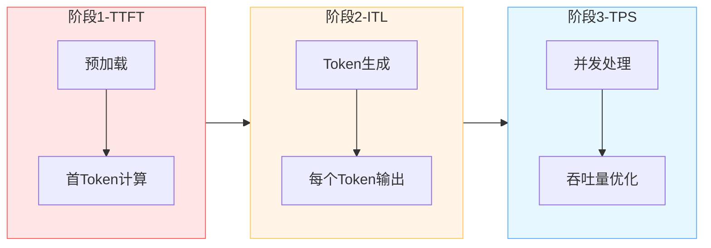
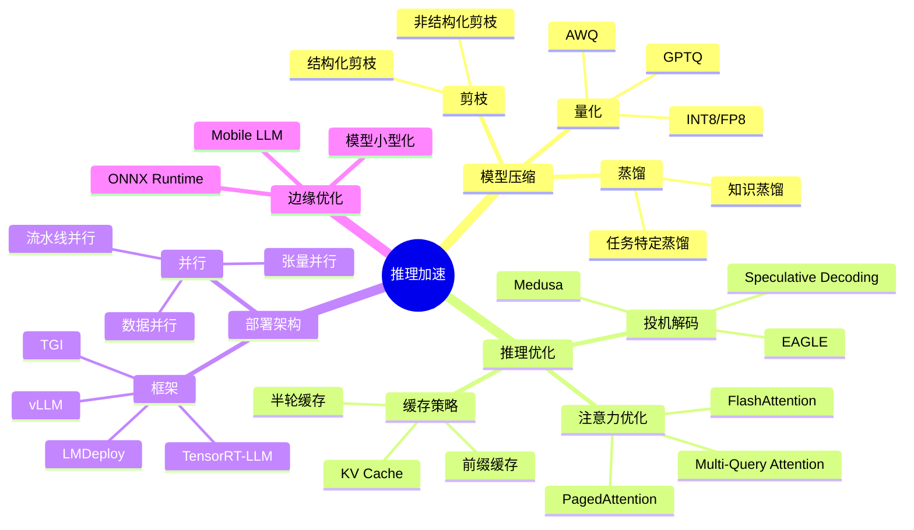
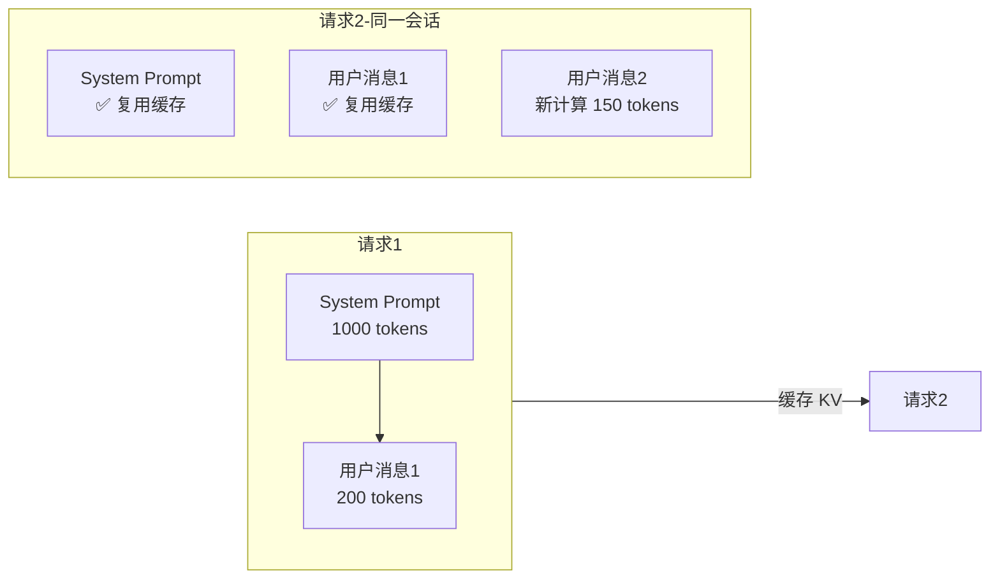
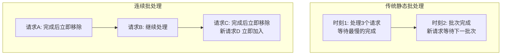
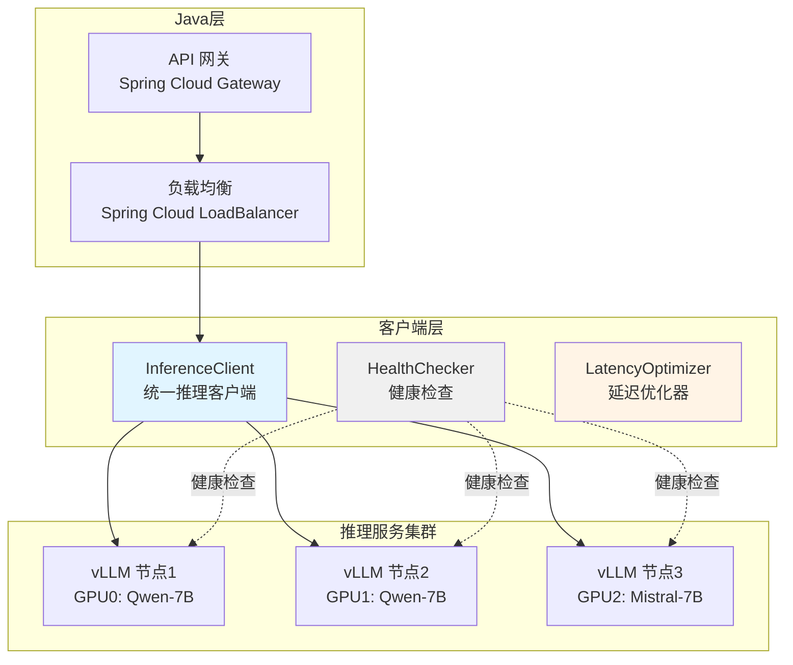
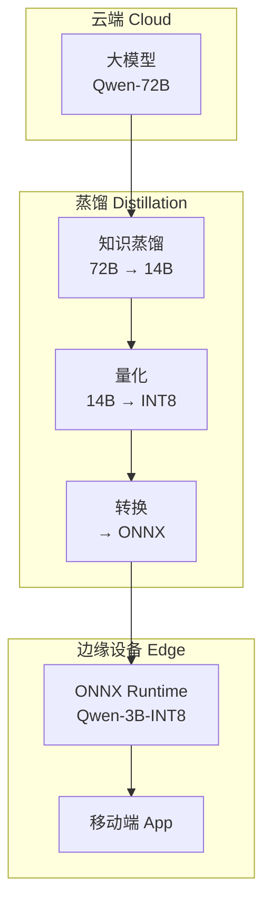

# 35 · Agent 推理加速与模型服务（Inference Acceleration）

> 阶段：4 生产化 · 难度：⭐⭐⭐⭐⭐ · 预计：3-5 天
> 前置：[11 多模型故障切换](11-多模型故障切换.md)、[16 Agent 可观测性 MELT](16-Agent可观测性MELT.md)
> 产出：掌握 Agent 系统的推理加速技术栈与自建模型服务能力

---

## 为什么推理加速对 Agent 至关重要

**Agent 的延迟是多轮 LLM 调用的叠加效应**。

| 场景 | 单轮延迟 | 轮数 | 总延迟 | 用户体验 |
|------|---------|-----|-------|---------|
| 简单问答 | 2s | 1 | 2s | ✅ 可接受 |
| 工具调用 | 1.5s | 3 | 4.5s | ⚠️ 略慢 |
| 复杂推理 | 2s | 8 | 16s | ❌ 不可接受 |
| 多 Agent 协作 | 1.8s | 15 | 27s | ❁❁ 用户流失 |

现实场景：一个订票 Agent 需要 8-12 轮对话（查航班 → 比价 → 筛选 → 调用预订接口 → 确认 → 支付），如果每轮 2s，总延迟 16-24s，用户直接流失。

---

## 延迟瓶颈分析

### 推理三阶段



| 指标 | 全称 | 定义 | 瓶颈点 | 优化方向 |
|------|------|------|-------|---------|
| TTFT | Time To First Token | 从请求到首个 Token 到达 | 模型加载、Prompt 处理、首次前向传播 | 模型预热、KV Cache、Prompt 压缩 |
| ITL | Inter-Token Latency | 相邻 Token 间延迟 | 单次前向传播时间、显存带宽 | 量化、投机解码、算子融合 |
| TPS | Tokens Per Second | 总吞吐量 | 批处理效率、GPU 利用率 | 连续批处理、PagedAttention、多 GPU 并行 |

---

## 推理加速技术全景



---

## vLLM vs Text-Generation-Inference

### 技术对比

| 维度 | vLLM | TGI (Text Generation Inference) |
|------|------|---------------------------------|
| 核心技术 | PagedAttention | FlashAttention + quantization |
| 吞吐量 | 极高（连续批处理） | 高 |
| 内存效率 | 优秀（页式 KV Cache） | 良好 |
| 模型支持 | 丰富（Llama/Mistral/Qwen等） | Hugging Face 全系列 |
| 部署难度 | 中等 | 简单（Docker 一键部署） |
| 生产案例 | Anthropic、 Together AI | Hugging Face Inference Endpoints |
| Java 调用 | HTTP / gRPC | HTTP / OpenAI API 兼容 |

### vLLM 部署示例

```bash
# 启动 vLLM 服务（单 GPU）
docker run --gpus all \
  -p 8000:8000 \
  --ipc=host \
  -e CUDA_VISIBLE_DEVICES=0 \
  vllm/vllm-openai:latest \
  --model Qwen/Qwen2.5-7B-Instruct \
  --tensor-parallel-size 1 \
  --max-model-len 32768 \
  --gpu-memory-utilization 0.9 \
  --enable-prefix-caching \
  --dtype float16
```

**关键参数说明**：
- `--tensor-parallel-size`: 多 GPU 张量并行
- `--max-model-len`: 最大上下文长度
- `--gpu-memory-utilization`: GPU 显存利用率（0.9 = 90%）
- `--enable-prefix-caching`: 前缀缓存（System Prompt 复用）
- `--dtype`: 数据类型（float16/bf16/int8）

---

## 模型量化实战

### 量化方法对比

| 方法 | 精度 | 模型大小 | 精度损失 | 推理加速 | 部署难度 |
|------|------|---------|---------|---------|---------|
| FP16 | 16-bit | 1x | 无 | 基准 | 低 |
| INT8 | 8-bit | 0.5x | <2% | 1.5-2x | 中 |
| GPTQ | 4-bit | 0.35x | 2-4% | 2-3x | 中 |
| AWQ | 4-bit | 0.35x | 1-3% | 2.5-3.5x | 低 |
| FP8 | 8-bit | 0.5x | <1% | 1.8-2.2x | 高（需 H100） |

### GPTQ 量化实战

```bash
# 安装 AutoGPTQ
pip install auto-gptq

# 量化模型（7B 需约 30GB 显存）
python -m auto_gptq.cli \
  --model Qwen/Qwen2.5-7B-Instruct \
  --quantization_config quant_config.json \
  --save_path ./qwen2.5-7b-gptq-4bit
```

`quant_config.json` 示例：
```json
{
  "bits": 4,
  "group_size": 128,
  "damp_percent": 0.01,
  "desc_act": true,
  "sym": true,
  "true_sequential": true
}
```

### vLLM 加载量化模型

```bash
vllm serve Qwen/Qwen2.5-7B-Instruct-GPTQ \
  --quantization gptq \
  --max-model-len 8192 \
  --gpu-memory-utilization 0.9
```

---

## 流式推理优化

### KV Cache 复用



**vLLM 前缀缓存配置**：
```bash
--enable-prefix-caching
--max-num-seqs 256  -- 最大并发序列数
--max-num-batched-tokens 8192  -- 每批最大 token 数
```

### 连续批处理（Continuous Batching）



---

## Java 调用自建推理服务架构



---

## Java 实现代码

### 1. InferenceClient 统一推理客户端

```java
package com.enterprise.inference;

import org.springframework.ai.chat.client.ChatClient;
import org.springframework.ai.openai.OpenAiChatOptions;
import org.springframework.stereotype.Service;
import org.springframework.web.reactive.function.client.WebClient;
import reactor.core.publisher.Flux;

import java.time.Duration;
import java.util.Map;

/**
 * 统一推理客户端——对接自建 vLLM/TGI 服务
 *
 * 核心能力：
 * - 兼容 OpenAI API（vLLM/TGI 都支持）
 * - 流式输出（SSE）
 * - 超时控制
 * - 自动重试（幂等）
 */
@Service
public class InferenceClient {

    private final WebClient webClient;
    private final ChatClient chatClient;

    public InferenceClient(WebClient.Builder builder) {
        this.webClient = builder
            .baseUrl("http://localhost:8000")  // vLLM 地址
            .build();

        this.chatClient = ChatClient.builder(builder)
            .defaultOptions(OpenAiChatOptions.builder()
                .withModel("Qwen/Qwen2.5-7B-Instruct")
                .withTemperature(0.7)
                .withMaxTokens(2000)
                .build())
            .build();
    }

    /**
     * 流式推理——SSE 返回
     */
    public Flux<String> streamChat(String prompt, Map<String, Object> params) {
        return webClient.post()
            .uri("/v1/chat/completions")
            .bodyValue(Map.of(
                "model", params.getOrDefault("model", "Qwen/Qwen2.5-7B-Instruct"),
                "messages", new Object[]{Map.of("role", "user", "content", prompt)},
                "stream", true,
                "temperature", params.getOrDefault("temperature", 0.7),
                "max_tokens", params.getOrDefault("max_tokens", 2000)
            ))
            .retrieve()
            .bodyToFlux(String.class)
            .timeout(Duration.ofSeconds(30))
            .doOnError(error -> {
                // 推理失败告警
                InferenceMetrics.recordInferenceError(error.getClass().getSimpleName());
            });
    }

    /**
     * 非流式推理（适合简单场景）
     */
    public String chat(String prompt) {
        return chatClient.prompt()
            .user(prompt)
            .call()
            .content();
    }

    /**
     * 带 Prompt 前缀缓存的推理（复用 System Prompt）
     */
    public Flux<String> cachedChat(String systemPrompt, String userMessage) {
        return webClient.post()
            .uri("/v1/chat/completions")
            .bodyValue(Map.of(
                "model", "Qwen/Qwen2.5-7B-Instruct",
                "messages", new Object[]{
                    Map.of("role", "system", "content", systemPrompt),
                    Map.of("role", "user", "content", userMessage)
                },
                "stream", true,
                "cache_prompt", true  // vLLM 前缀缓存
            ))
            .retrieve()
            .bodyToFlux(String.class);
    }
}
```

### 2. LatencyOptimizer 延迟优化器

```java
package com.enterprise.inference;

import org.springframework.stereotype.Component;
import java.util.concurrent.*;

/**
 * 延迟优化器——减少 Agent 端到端延迟
 *
 * 优化策略：
 * 1. Prompt 压缩（去除冗余）
 * 2. 请求预取（预判下一步）
 * 3. 模型选择（简单任务用小模型）
 * 4. 并行工具调用（减少轮数）
 */
@Component
public class LatencyOptimizer {

    private final ExecutorService executor = Executors.newFixedThreadPool(4);

    /**
     * Prompt 压缩——保留核心信息
     */
    public String compressPrompt(String originalPrompt) {
        // 策略1：去除连续空行
        String compressed = originalPrompt.replaceAll("\\n{3,}", "\\n\\n");

        // 策略2：缩短常见指令（需模型理解）
        compressed = compressed
            .replace("请详细分析", "分析")
            .replace("根据以上信息", "综上")
            .replace("需要注意的是", "注意：");

        // 策略3：截断过长历史（保留最近 N 轮）
        if (compressed.length() > 4000) {
            compressed = "...[历史截断]...\\n\\n" +
                compressed.substring(compressed.length() - 3000);
        }

        return compressed;
    }

    /**
     * 智能模型选择——根据任务复杂度
     */
    public String selectModel(String task) {
        // 简单任务用小模型（快）
        if (isSimpleTask(task)) {
            return "Qwen/Qwen2.5-3B-Instruct";  // 3B 模型更快
        }
        // 复杂任务用大模型（准）
        return "Qwen/Qwen2.5-7B-Instruct";
    }

    private boolean isSimpleTask(String task) {
        // 启发式规则
        return task.length() < 500 &&
               !task.contains("分析") &&
               !task.contains("推理") &&
               !task.contains("比较");
    }

    /**
     * 并行工具调用——减少 LLM 轮数
     */
    public <T> CompletableFuture<Map<String, T>> parallelCall(
        Map<String, Callable<T>> tasks) {

        Map<String, CompletableFuture<T>> futures = new java.util.HashMap<>();

        tasks.forEach((name, task) -> {
            futures.put(name, CompletableFuture.supplyAsync(
                () -> {
                    try { return task.call(); }
                    catch (Exception e) { throw new RuntimeException(e); }
                },
                executor
            ));
        });

        // 等待全部完成
        CompletableFuture<Void> allOf = CompletableFuture.allOf(
            futures.values().toArray(new CompletableFuture[0])
        );

        return allOf.thenApply(v -> {
            Map<String, T> results = new java.util.HashMap<>();
            futures.forEach((name, future) -> {
                try { results.put(name, future.get()); }
                catch (Exception e) { results.put(name, null); }
            });
            return results;
        });
    }
}
```

### 3. ModelServerHealthChecker 健康检查

```java
package com.enterprise.inference;

import org.springframework.stereotype.Component;
import org.springframework.web.reactive.function.client.WebClient;
import reactor.core.publisher.Mono;

import java.time.Duration;
import java.util.concurrent.ConcurrentHashMap;

/**
 * 模型服务器健康检查——主动探测+自动剔除
 *
 * 检查维度：
 * 1. 健康端点（/health）
 * 2. 推理延迟（超过阈值告警）
 * 3. GPU 显存使用（OOM 前预警）
 * 4. 错误率（连续失败剔除）
 */
@Component
public class ModelServerHealthChecker {

    private final WebClient webClient;
    private final ConcurrentHashMap<String, ServerHealth> healthMap = new ConcurrentHashMap<>();

    public ModelServerHealthChecker() {
        this.webClient = WebClient.builder().build();
    }

    /**
     * 检查单个服务器
     */
    public Mono<HealthStatus> check(String endpoint) {
        return webClient.get()
            .uri(endpoint + "/health")
            .retrieve()
            .bodyToMono(String.class)
            .timeout(Duration.ofSeconds(3))
            .map(body -> HealthStatus.HEALTHY)
            .onErrorResume(e -> {
                // 分类错误
                if (e instanceof java.util.concurrent.TimeoutException) {
                    return Mono.just(HealthStatus.TIMEOUT);
                }
                return Mono.just(HealthStatus.UNHEALTHY);
            })
            .doOnNext(status -> {
                healthMap.put(endpoint, new ServerHealth(status, System.currentTimeMillis()));
            });
    }

    /**
     * 检查推理质量（探测请求）
     */
    public Mono<InferenceQuality> probeInference(String endpoint) {
        return webClient.post()
            .uri(endpoint + "/v1/chat/completions")
            .bodyValue(Map.of(
                "model", "test-model",
                "messages", new Object[]{Map.of("role", "user", "content", "1+1=?")},
                "max_tokens", 10
            ))
            .retrieve()
            .bodyToMono(String.class)
            .timeout(Duration.ofSeconds(5))
            .map(response -> {
                // 简单验证响应包含 "2"
                return response.contains("2") ?
                    InferenceQuality.GOOD : InferenceQuality.POOR;
            })
            .onErrorReturn(InferenceQuality.FAILED)
            .doOnNext(quality -> {
                // 质量差告警
                if (quality != InferenceQuality.GOOD) {
                    InferenceMetrics.recordQualityIssue(endpoint);
                }
            });
    }

    public enum HealthStatus { HEALTHY, UNHEALTHY, TIMEOUT }
    public enum InferenceQuality { GOOD, POOR, FAILED }

    public record ServerHealth(HealthStatus status, long checkTimestamp) {}
}
```

---

## GPU 资源调度与多租户隔离

```java
package com.enterprise.inference;

import org.springframework.stereotype.Component;
import java.util.concurrent.*;

/**
 * GPU 资源调度器——多租户隔离
 *
 * 隔离策略：
 * 1. 硬隔离：GPU 分组（物理隔离）
 * 2. 软隔离：请求队列 + 限流
 * 3. 优先级：VIP 租户优先
 */
@Component
public class GpuResourceScheduler {

    // 每个租户的并发限制
    private final ConcurrentHashMap<String, Semaphore> tenantLimits = new ConcurrentHashMap<>();

    // VIP 租户队列
    private final PriorityBlockingQueue<InferenceTask> vipQueue = new PriorityBlockingQueue<>(
        100, Comparator.comparing(InferenceTask::priority).reversed()
    );

    // 普通租户队列
    private final BlockingQueue<InferenceTask> normalQueue = new LinkedBlockingQueue<>(1000);

    /**
     * 调度推理任务
     */
    public CompletableFuture<String> schedule(InferenceTask task) {
        // 1. 检查租户并发限制
        Semaphore sem = tenantLimits.computeIfAbsent(
            task.tenantId(),
            k -> new Semaphore(task.isVip() ? 10 : 2)  // VIP 10 并发，普通 2
        );

        if (!sem.tryAcquire()) {
            return CompletableFuture.failedFuture(
                new RuntimeException("租户并发数超限")
            );
        }

        // 2. 加入队列
        if (task.isVip()) {
            vipQueue.offer(task);
        } else {
            normalQueue.offer(task);
        }

        // 3. 异步执行
        return CompletableFuture.supplyAsync(() -> {
            try {
                return execute(task);
            } finally {
                sem.release();
            }
        });
    }

    private String execute(InferenceTask task) {
        // 调用推理服务
        return inferenceService.call(task.model(), task.prompt());
    }

    public record InferenceTask(
        String tenantId, String userId,
        String model, String prompt,
        boolean isVip, int priority
    ) {}
}
```

---

## 边缘部署方案



### 边缘部署检查清单

- [ ] 模型蒸馏到 3B 以下
- [ ] INT8/INT4 量化
- [ ] 转换为 ONNX 格式
- [ ] ONNX Runtime 移动端集成
- [ ] 离线推理能力
- [ ] 模型差分更新（只下载变化的参数）
- [ ] 端云协同（边缘处理+云端兜底）

---

## 性能基准测试方法论

```java
package com.enterprise.inference;

import org.springframework.stereotype.Component;
import java.util.concurrent.*;
import java.util.concurrent.atomic.*;

/**
 * 推理性能基准测试
 *
 * 测试维度：
 * 1. TTFT (Time To First Token)
 * 2. ITL (Inter-Token Latency)
 * 3. TPS (Tokens Per Second)
 * 4. 并发吞吐量
 * 5. 显存占用
 */
@Component
public class InferenceBenchmark {

    /**
     * TTFT 测试
     */
    public BenchmarkResult testTTFT(String endpoint, String prompt, int iterations) {
        AtomicLong totalTTFT = new AtomicLong(0);
        AtomicInteger count = new AtomicInteger(0);

        ExecutorService executor = Executors.newFixedThreadPool(10);

        for (int i = 0; i < iterations; i++) {
            executor.submit(() -> {
                long start = System.nanoTime();
                String firstToken = inferenceClient.streamChat(prompt)
                    .blockFirst(Duration.ofSeconds(10));
                long ttft = System.nanoTime() - start;

                totalTTFT.addAndGet(ttft);
                count.incrementAndGet();
            });
        }

        executor.shutdown();
        try { executor.awaitTermination(60, TimeUnit.SECONDS); }
        catch (InterruptedException e) { Thread.currentThread().interrupt(); }

        return new BenchmarkResult(
            "TTFT",
            totalTTFT.get() / count.get() / 1_000_000.0,  // ms
            0, 0, count.get()
        );
    }

    /**
     * 并发吞吐量测试
     */
    public ThroughputResult testThroughput(String endpoint, int concurrency, int duration) {
        AtomicInteger totalRequests = new AtomicInteger(0);
        AtomicInteger totalTokens = new AtomicInteger(0);

        CountDownLatch latch = new CountDownLatch(concurrency);
        ExecutorService executor = Executors.newFixedThreadPool(concurrency);

        long endTime = System.currentTimeMillis() + duration * 1000;

        for (int i = 0; i < concurrency; i++) {
            executor.submit(() -> {
                while (System.currentTimeMillis() < endTime) {
                    try {
                        String response = inferenceClient.chat("test prompt");
                        totalRequests.incrementAndGet();
                        totalTokens.addAndGet(estimateTokens(response));
                    } catch (Exception e) {
                        // 忽略错误，继续测试
                    }
                }
                latch.countDown();
            });
        }

        try { latch.await(); }
        catch (InterruptedException e) { Thread.currentThread().interrupt(); }

        double rps = (double) totalRequests.get() / duration;
        double tps = (double) totalTokens.get() / duration;

        return new ThroughputResult(rps, tps, totalRequests.get());
    }

    private int estimateTokens(String text) {
        // 粗略估算：1 token ≈ 4 字符（英文）或 2 字符（中文）
        return text.length() / 3;
    }

    public record BenchmarkResult(
        String metric, double avgMs, double p50, double p99, int samples
    ) {}

    public record ThroughputResult(double rps, double tps, int totalRequests) {}
}
```

---

## 验收检查

- [ ] 理解推理加速对 Agent 多轮对话的放大效应
- [ ] 能部署 vLLM/TGI 推理服务
- [ ] 能进行模型量化（GPTQ/AWQ/INT8）
- [ ] 能实现 Java InferenceClient（流式+非流式）
- [ ] 能实现健康检查与自动剔除
- [ ] 能进行性能基准测试（TTFT/TPS/并发）
- [ ] 能设计多租户 GPU 资源隔离方案

---

## 下一步

→ 下一篇：[36 Agent SLO 管理与服务质量保障](36-AgentSLO管理.md)
