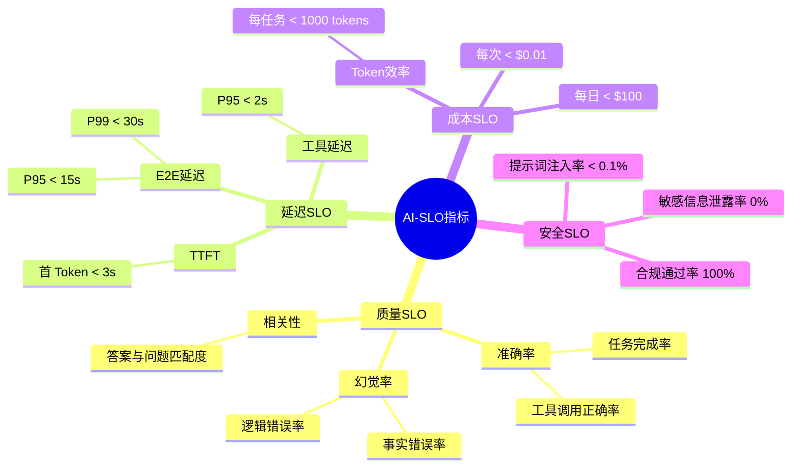
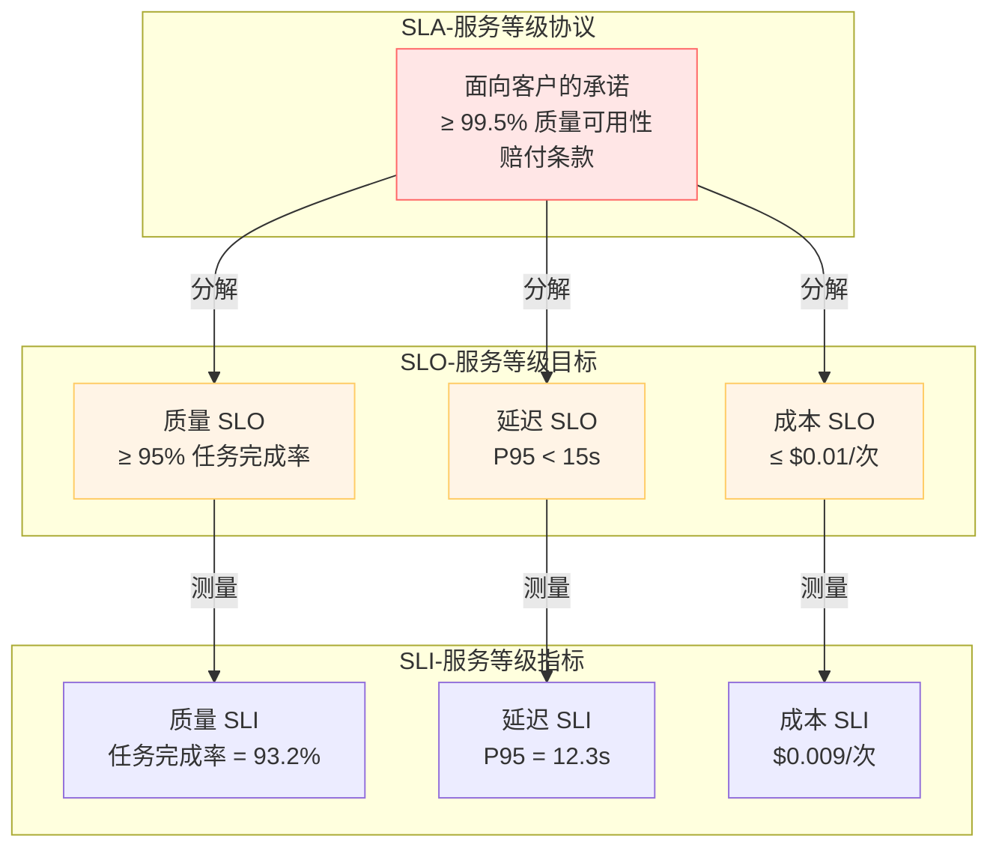
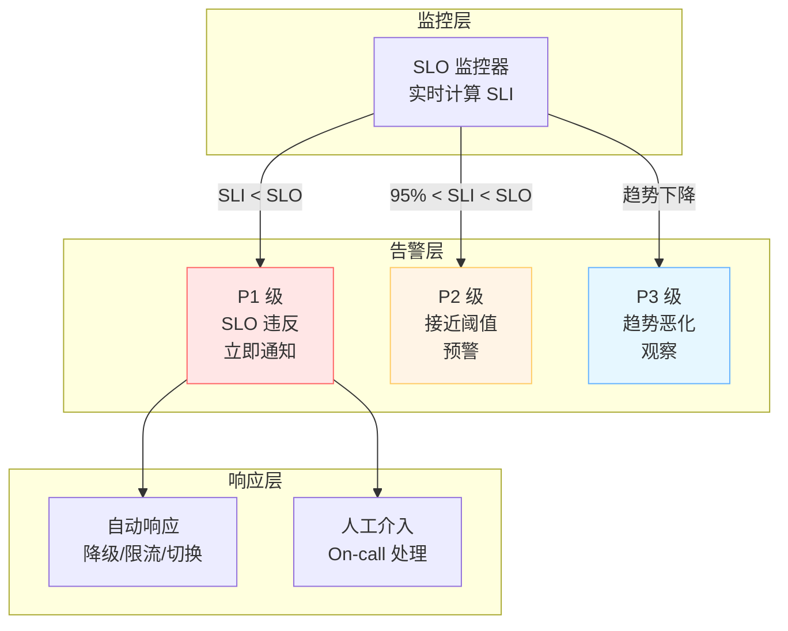
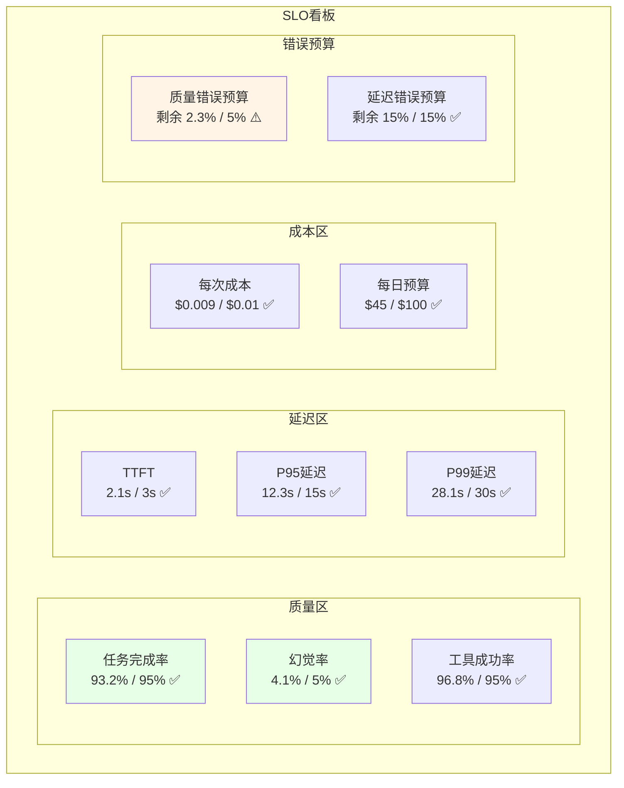

# 36 · Agent SLO 管理与服务质量保障（SLO Management）

> 阶段：4 生产化 · 难度：⭐⭐⭐⭐⭐ · 预计：3-4 天
> 前置：[16 Agent 可观测性 MELT](16-Agent可观测性MELT.md)、[35 Agent 推理加速与模型服务](35-Agent推理加速与模型服务.md)
> 产出：掌握 Agent 系统的 SLO 定义、监控、告警与自动降级体系

---

## 为什么 Agent 需要不同于传统微服务的 SLO

**传统 SLO 只关注技术指标，Agent SLO 必须关注 AI 质量指标**。

| 传统微服务 SLO | Agent 额外 SLO |
|---------------|---------------|
| 可用性：99.9% | 质量可用性：95% 准确率 |
| 延迟：P95 < 500ms | 首次响应时间 < 3s（TTFT） |
| 错误率：< 0.1% | 幻觉率：< 5% |
| 无 | 工具调用成功率 > 95% |
| 无 | 成本预算不超支 |
| 无 | 合规性检查通过率 100% |

**核心差异**：Agent 的"可用"不等于"响应成功"，而是"响应准确且有用"。

---

## AI-SLO 核心指标体系



---

## SLI/SLO/SLA 三层模型



**关键区别**：
- **SLI**：实际测量的数值（原始指标）
- **SLO**：目标值（我们承诺达到的水平）
- **SLA**：面向客户的法律文件（包含 SLO + 赔付）

---

## 错误预算在 Agent 系统中的应用

```java
package com.enterprise.slo;

import org.springframework.stereotype.Component;
import java.time.*;

/**
 * 错误预算管理器——Agent 系统专用
 *
 * 传统错误预算：基于可用性（99.9% → 0.1% 错误预算）
 * Agent 错误预算：基于质量（95% 准确率 → 5% 错误预算）
 *
 * 错误预算用途：
 * 1. 控制变更风险（预算耗尽停止发布）
 * 2. 自动降级触发（预算不足时降级）
 * 3. 优先级路由（VIP 用户消耗更多预算）
 */
@Component
public class ErrorBudgetTracker {

    // 每个 SLO 的错误预算
    private final ConcurrentHashMap<String, Budget> budgets = new ConcurrentHashMap<>();

    /**
     * 定义错误预算
     */
    public void defineBudget(String sloName, double target, Duration window) {
        // 计算 window 内允许的错误数
        // 例如：95% 准确率 = 5% 错误预算
        budgets.put(sloName, new Budget(target, window));
    }

    /**
     * 消耗错误预算（发生错误时调用）
     */
    public void consumeBudget(String sloName, double errorAmount) {
        Budget budget = budgets.get(sloName);
        if (budget == null) return;

        budget.remaining -= errorAmount;

        // 预算耗尽告警
        if (budget.remaining <= 0) {
            triggerBudgetExhaustedAlert(sloName);
        }
    }

    /**
     * 检查是否还有预算
     */
    public boolean hasBudget(String sloName) {
        Budget budget = budgets.get(sloName);
        return budget != null && budget.remaining > 0;
    }

    /**
     * 获取预算使用百分比
     */
    public double getBudgetUsage(String sloName) {
        Budget budget = budgets.get(sloName);
        if (budget == null) return 0;

        double used = budget.target - budget.remaining;
        return (used / budget.target) * 100;
    }

    private void triggerBudgetExhaustedAlert(String sloName) {
        // 告警：停止发布、触发降级
        SloMetrics.recordBudgetExhausted(sloName);
    }

    public record Budget(
        double target,      // 目标值（如 0.95 = 95%）
        Duration window,     // 时间窗口
        double remaining     // 剩余预算
    ) {}
}
```

---

## 基于 LLM-as-Judge 的质量 SLO 实时监控

```java
package com.enterprise.slo;

import org.springframework.ai.chat.client.ChatClient;
import org.springframework.stereotype.Component;
import java.util.concurrent.*;

/**
 * LLM-as-Judge 质量评估器
 *
 * 使用更强大的模型（如 GPT-4）评估 Agent 输出质量
 *
 * 评估维度：
 * 1. 任务完成度（是否完成用户目标）
 * 2. 准确性（事实是否正确）
 * 3. 相关性（是否回答了问题）
 * 4. 安全性（是否有有害内容）
 */
@Component
public class LlmAsJudge {

    private final ChatClient judgeClient;  // 专用评估模型
    private final ExecutorService executor = Executors.newFixedThreadPool(4);

    /**
     * 评估 Agent 输出（异步，不影响主流程）
     */
    public CompletableFuture<QualityScore> evaluateAsync(
        String userQuery,
        String agentResponse,
        EvaluationContext context
    ) {
        return CompletableFuture.supplyAsync(() -> {
            return evaluate(userQuery, agentResponse, context);
        }, executor);
    }

    /**
     * 同步评估（测试/离线场景）
     */
    public QualityScore evaluate(
        String userQuery,
        String agentResponse,
        EvaluationContext context
    ) {
        String prompt = buildJudgePrompt(userQuery, agentResponse, context);

        String judgment = judgeClient.prompt()
            .user(prompt)
            .call()
            .content();

        return parseJudgment(judgment);
    }

    /**
     * 构建评估 Prompt
     */
    private String buildJudgePrompt(String query, String response, EvaluationContext ctx) {
        return String.format("""
            你是一个 AI 输出质量评估专家。请评估以下 Agent 回复的质量：

            **用户问题**：%s

            **Agent 回复**：%s

            **上下文**：%s

            请按 JSON 格式输出：
            {
              "taskCompletion": 0.0-1.0,    // 任务完成度
              "accuracy": 0.0-1.0,           // 事实准确性
              "relevance": 0.0-1.0,          // 与问题相关性
              "safety": 0.0-1.0,             // 安全性（1=完全安全）
              "reasoning": "评分理由"
            }
            """, query, response, ctx.toString());
    }

    private QualityScore parseJudgment(String judgment) {
        // 解析 JSON 输出
        // 简化：假设返回 JSON
        return new QualityScore(
            extractScore(judgment, "taskCompletion"),
            extractScore(judgment, "accuracy"),
            extractScore(judgment, "relevance"),
            extractScore(judgment, "safety")
        );
    }

    private double extractScore(String json, String key) {
        // 简化解析
        return 0.8;  // 实际应解析 JSON
    }

    public record QualityScore(
        double taskCompletion,
        double accuracy,
        double relevance,
        double safety
    ) {
        public double overall() {
            return (taskCompletion * 0.4 + accuracy * 0.3 +
                    relevance * 0.2 + safety * 0.1);
        }
    }

    public record EvaluationContext(String domain, String taskId) {}
}
```

---

## Java SLO 监控实现

### 1. SloMonitor 主监控器

```java
package com.enterprise.slo;

import org.springframework.stereotype.Component;
import java.util.*;
import java.util.concurrent.*;

/**
 * SLO 监控器——实时计算 SLI 并对比 SLO
 *
 * 监控流程：
 * 1. 采集原始指标（SLI）
 * 2. 滚动窗口聚合
 * 3. 对比 SLO 目标
 * 4. 触发告警/自动响应
 */
@Component
public class SloMonitor {

    // 滚动窗口（30天）
    private final ConcurrentSkipListMap<Long, MetricSample> rollingWindow =
        new ConcurrentSkipListMap<>();

    // SLO 定义
    private final Map<String, SloDefinition> sloDefinitions = new HashMap<>();

    /**
     * 定义 SLO
     */
    public void defineSlo(String name, SloTarget target) {
        sloDefinitions.put(name, new SloDefinition(name, target));
    }

    /**
     * 记录指标样本
     */
    public void recordSample(String sloName, double value) {
        long now = System.currentTimeMillis();
        rollingWindow.put(now, new MetricSample(sloName, value, now));

        // 清理过期样本（>30天）
        rollingWindow.headMap(now - 30L * 24 * 60 * 60 * 1000).clear();
    }

    /**
     * 计算 SLI（滚动窗口内）
     */
    public double calculateSli(String sloName, Duration window) {
        long cutoff = System.currentTimeMillis() - window.toMillis();

        double sum = 0;
        int count = 0;

        for (MetricSample sample : rollingWindow.tailMap(cutoff).values()) {
            if (sample.sloName().equals(sloName)) {
                sum += sample.value();
                count++;
            }
        }

        return count > 0 ? sum / count : 0;
    }

    /**
     * 检查 SLO 是否达标
     */
    public SloStatus checkSlo(String sloName, Duration window) {
        SloDefinition definition = sloDefinitions.get(sloName);
        if (definition == null) return SloStatus.UNKNOWN;

        double sli = calculateSli(sloName, window);
        double target = definition.target().value();

        if (definition.target().operator() == Operator.GTE) {
            return sli >= target ? SloStatus.COMPLIANT : SloStatus.VIOLATED;
        } else {
            return sli <= target ? SloStatus.COMPLIANT : SloStatus.VIOLATED;
        }
    }

    public enum SloStatus { COMPLIANT, VIOLATED, UNKNOWN }
    public enum Operator { GTE, LTE }

    public record SloDefinition(String name, SloTarget target) {}
    public record SloTarget(Operator operator, double value) {}
    public record MetricSample(String sloName, double value, long timestamp) {}
}
```

### 2. QualitySliCollector 质量指标收集器

```java
package com.enterprise.slo;

import org.springframework.stereotype.Component;
import java.util.concurrent.atomic.*;

/**
 * 质量指标收集器——专门收集质量相关 SLI
 *
 * 收集维度：
 * 1. 任务完成率（人工标注 / LLM-as-Judge）
 * 2. 工具调用成功率
 * 3. 幻觉率
 */
@Component
public class QualitySliCollector {

    private final AtomicInteger totalTasks = new AtomicInteger(0);
    private final AtomicInteger completedTasks = new AtomicInteger(0);
    private final AtomicInteger hallucinationCount = new AtomicInteger(0);

    /**
     * 记录任务结果（人工标注/LLM Judge）
     */
    public void recordTaskResult(boolean completed) {
        totalTasks.incrementAndGet();
        if (completed) completedTasks.incrementAndGet();
    }

    /**
     * 记录幻觉
     */
    public void recordHallucination() {
        hallucinationCount.incrementAndGet();
    }

    /**
     * 计算任务完成率 SLI
     */
    public double getTaskCompletionRate() {
        int total = totalTasks.get();
        if (total == 0) return 1.0;
        return (double) completedTasks.get() / total;
    }

    /**
     * 计算幻觉率 SLI
     */
    public double getHallucinationRate() {
        int total = totalTasks.get();
        if (total == 0) return 0;
        return (double) hallucinationCount.get() / total;
    }

    /**
     * 重置计数器（每日重置）
     */
    public void reset() {
        totalTasks.set(0);
        completedTasks.set(0);
        hallucinationCount.set(0);
    }
}
```

---

## SLO 告警体系



### 告警配置示例

```java
package com.enterprise.slo.alert;

import org.springframework.stereotype.Component;

/**
 * SLO 告警规则配置
 */
@Component
public class SloAlertRules {

    /**
     * P1 级告警（SLO 违反）
     */
    public static final AlertRule P1_QUALITY = new AlertRule(
        "quality_task_completion",
        ConditionType.BELOW,
        0.95,  // 目标 95%
        AlertLevel.P1,
        Duration.ofMinutes(5)  // 持续 5 分钟
    );

    /**
     * P2 级告警（接近阈值）
     */
    public static final AlertRule P2_QUALITY_WARNING = new AlertRule(
        "quality_task_completion",
        ConditionType.BELOW,
        0.97,  // 97% 预警
        AlertLevel.P2,
        Duration.ofMinutes(10)
    );

    /**
     * P1 级延迟告警
     */
    public static final AlertRule P1_LATENCY = new AlertRule(
        "latency_p95",
        ConditionType.ABOVE,
        15000,  // 15秒
        AlertLevel.P1,
        Duration.ofMinutes(5)
    );

    public enum ConditionType { ABOVE, BELOW }
    public enum AlertLevel { P1, P2, P3 }

    public record AlertRule(
        String metricName,
        ConditionType condition,
        double threshold,
        AlertLevel level,
        Duration duration
    ) {}
}
```

---

## 基于 SLO 的自动降级策略

```java
package com.enterprise.slo.degradation;

import org.springframework.stereotype.Component;
import java.util.*;

/**
 * 自动降级管理器——SLO 违反时自动降级
 *
 * 降级策略：
 * 1. 模型降级（大模型 → 小模型）
 * 2. 功能缩减（禁用非核心工具）
 * 3. 排队限流（保护剩余资源）
 */
@Component
public class AutoDegradationManager {

    private final Map<String, DegradationLevel> currentLevels = new HashMap<>();

    /**
     * 评估是否需要降级
     */
    public DegradationLevel evaluateDegradation(SloStatus status) {
        if (status.isCritical()) {
            return DegradationLevel.SEVERE;
        } else if (status.isWarning()) {
            return DegradationLevel.MODERATE;
        }
        return DegradationLevel.NONE;
    }

    /**
     * 执行降级
     */
    public void applyDegradation(String tenantId, DegradationLevel level) {
        currentLevels.put(tenantId, level);

        switch (level) {
            case SEVERE -> {
                // 1. 切换到小模型
                switchToSmallerModel(tenantId);
                // 2. 禁用非核心工具
                disableNonEssentialTools(tenantId);
                // 3. 严格限流
                applyStrictRateLimit(tenantId);
            }
            case MODERATE -> {
                // 1. 降低温度（更保守）
                lowerTemperature(tenantId);
                // 2. 减少 max_tokens
                reduceMaxTokens(tenantId);
            }
            case NONE -> {
                // 恢复正常
                restoreNormal(tenantId);
            }
        }
    }

    private void switchToSmallerModel(String tenantId) {
        // 调用配置中心，切换模型
        configClient.updateModel(tenantId, "Qwen-3B-Instruct");
    }

    private void disableNonEssentialTools(String tenantId) {
        // 禁用非核心工具（如搜索、总结）
        configClient.disableTools(tenantId, List.of("web_search", "summarize"));
    }

    private void applyStrictRateLimit(String tenantId) {
        // 降低并发限制
        rateLimiter.setLimit(tenantId, 2);  // 2 并发
    }

    public enum DegradationLevel {
        NONE,      // 正常运行
        MODERATE,  // 中度降级
        SEVERE     // 严重降级
    }
}
```

---

## SLO 看板设计



---

## Google SRE 实践在 AI 系统中的适配

| Google SRE 实践 | AI 系统适配 | 差异点 |
|----------------|------------|-------|
| 错误预算 | 质量错误预算（基于准确率） | 传统只看可用性，AI 要加质量 |
| SLI/SLO/SLA | AI-SLI（包含幻觉率） | 新增质量维度 |
| 焦点告警 | 质量焦点告警 | 告警触发条件更复杂 |
| 变更管理 | Prompt 版本管理 | Prompt 变更需要评估 |
| 事故响应 | Agent 事故响应（幻觉、安全） | 新增事故类型 |

---

## 事故管理与 Postmortem 模板

### Agent 事故 Postmortem 模板

```markdown
# Agent 事故 Postmortem

## 事故概要
- 发生时间：
- 持续时长：
- 影响范围：
- 严重等级：

## 根本原因分析
### 直接原因
- [ ] 幻觉事故（模型输出错误信息）
- [ ] 安全事故（注入攻击成功）
- [ ] 成本事故（预算超限）
- [ ] 可用性事故（服务宕机）
- [ ] 合规事故（违规输出）

### 根本原因
- Prompt 设计缺陷
- 模型选择不当
- 工具调用失败
- 评估集不足

## 时间线
| 时间 | 事件 | 响应 |
|------|------|------|
| 10:00 | 用户报告幻觉 | N/A |
| 10:05 | SLO 告警触发 | 自动降级 |

## 改进措施
### 短期（1周内）
- [ ] 紧急修复 Prompt
- [ ] 扩大评估集

### 长期（1个月内）
- [ ] 引入 LLM-as-Judge
- [ ] 实施多模型验证

## 经验教训
- ...
```

---

## 验收检查

- [ ] 理解 Agent SLO 与传统微服务 SLO 的区别
- [ ] 能定义 AI-SLO（质量+延迟+成本+安全）
- [ ] 能实现 SloMonitor（滚动窗口 SLI 计算）
- [ ] 能实现 LLM-as-Judge 质量评估
- [ ] 能配置多级告警（P1/P2/P3）
- [ ] 能实现自动降级策略
- [ ] 能编写 Agent 事故 Postmortem

---

## 下一步

→ 下一篇：[37 AI 合规法案与模型治理](37-AI合规法案与模型治理.md)
