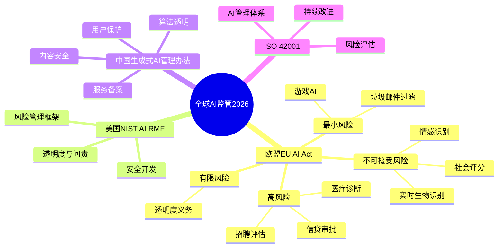
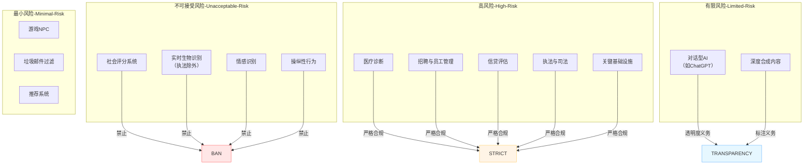
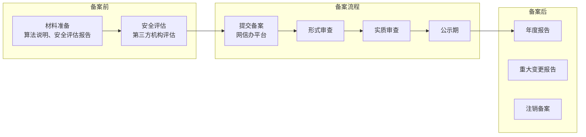
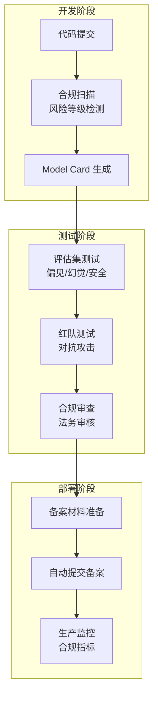

# 37 · AI 合规法案与模型治理（AI Act & Model Governance）

> 阶段：4 生产化 · 难度：⭐⭐⭐⭐⭐ · 预计：4-5 天
> 前置：[15 Agent 安全审计](15-Agent安全审计.md)、[36 Agent SLO 管理](36-AgentSLO管理.md)
> 产出：掌握全球 AI 监管框架、合规实践与模型治理体系

---

## 2026 年全球 AI 监管全景



---

## EU AI Act 风险分级体系



### EU AI Act 合规要求表

| 风险等级 | 核心义务 | 合规成本 | 罚款上限 |
|---------|---------|---------|---------|
| 不可接受 | 禁止投放市场 | N/A | 7% 全球营收 |
| 高风险 | 风险管理系统、数据治理、透明度、人工监督、准确性、 robustness | 高 | 3-5% 全球营收 |
| 有限风险 | 透明度义务（告知用户是 AI） | 低 | 1-2% 全球营收 |
| 最小风险 | 自愿守则 | 极低 | 警告 |

---

## Agent 系统合规映射表

```java
package com.enterprise.compliance;

import org.springframework.stereotype.Component;
import java.util.*;

/**
 * Agent 系统合规映射表
 *
 * 将 Agent 功能映射到监管要求：
 * 1. EU AI Act（风险等级）
 * 2. 中国生成式 AI（备案、内容安全）
 * 3. NIST AI RMF（风险管理）
 */
@Component
public class AgentComplianceMap {

    /**
     * Agent 功能 → 风险等级映射
     */
    public enum RiskLevel {
        UNACCEPTABLE,  // 禁止
        HIGH,          // 高风险（严格合规）
        LIMITED,       // 有限风险（透明度）
        MINIMAL        // 最小风险
    }

    public Map<AgentCapability, RiskLevel> getRiskMapping() {
        return Map.of(
            // 不可接受
            AgentCapability.SOCIAL_SCORING, RiskLevel.UNACCEPTABLE,
            AgentCapability.REAL_TIME_BIOMETRIC, RiskLevel.UNACCEPTABLE,

            // 高风险
            AgentCapability.MEDICAL_DIAGNOSIS, RiskLevel.HIGH,
            AgentCapability.HIRING_EVALUATION, RiskLevel.HIGH,
            AgentCapability.CREDIT_ASSESSMENT, RiskLevel.HIGH,
            AgentCapability.LEGAL_ADVICE, RiskLevel.HIGH,

            // 有限风险
            AgentCapability.CUSTOMER_SERVICE, RiskLevel.LIMITED,
            AgentCapability.CONTENT_GENERATION, RiskLevel.LIMITED,
            AgentCapability.EDUCATION_TUTOR, RiskLevel.LIMITED,

            // 最小风险
            AgentCapability.GAME_NPC, RiskLevel.MINIMAL,
            AgentCapability.SPAM_FILTER, RiskLevel.MINIMAL
        );
    }

    /**
     * 获取合规检查清单
     */
    public List<String> getComplianceChecklist(RiskLevel level) {
        return switch (level) {
            case UNACCEPTABLE -> List.of(
                "❌ 禁止实施此功能"
            );
            case HIGH -> List.of(
                "✓ 建立风险管理系统",
                "✓ 数据治理与质量保证",
                "✓ 技术文档留存",
                "✓ 人工监督机制",
                "✓ 准确性与 robustness 测试",
                "✓ 用户告知与解释权"
            );
            case LIMITED -> List.of(
                "✓ 透明度义务（告知是 AI）",
                "✓ 深度合成内容标注"
            );
            case MINIMAL -> List.of(
                "✓ 自愿遵守 AI 守则"
            );
        };
    }

    public enum AgentCapability {
        SOCIAL_SCORING, REAL_TIME_BIOMETRIC,
        MEDICAL_DIAGNOSIS, HIRING_EVALUATION,
        CREDIT_ASSESSMENT, LEGAL_ADVICE,
        CUSTOMER_SERVICE, CONTENT_GENERATION,
        EDUCATION_TUTOR, GAME_NPC, SPAM_FILTER
    }
}
```

---

## 模型卡（Model Card）与数据卡（Data Card）标准化

### Model Card 模板

```markdown
# 模型卡：Qwen2.5-7B-Instruct

## 基本信息
- 模型名称：Qwen2.5-7B-Instruct
- 版本：v2.5-7b
- 类型：大型语言模型
- 参数量：7B
- 许可证：Apache 2.0

## 预期用途
- 主要用途：对话式 AI、内容生成、问答
- 禁止用途：医疗诊断、法律建议、金融决策
- 目标用户：企业开发者

## 性能指标
- 准确率（MMLU）：78.5%
- 幻觉率（内部评估）：4.2%
- TTFT：2.1s（A100 GPU）
- P95 延迟：12.3s

## 训练数据
- 数据来源：公开网页、书籍、代码
- 时间范围：截至 2024年6月
- 数据规模：3T tokens
- 去重措施：✓
- PII 过滤：✓

## 限制与风险
- 知识截止：2024年6月
- 幻觉倾向：中等
- 偏见风险：语言偏见（中文为主）
- 对抗攻击：中等脆弱

## 合规状态
- EU AI Act：有限风险
- 中国网信办：已备案
- GDPR：符合

## 版本历史
- v2.5-7b (2024-08)：增加多轮对话能力
- v2.0-7b (2024-06)：初始版本
```

### Java Model Card 生成器

```java
package com.enterprise.compliance;

import org.springframework.stereotype.Component;
import java.time.LocalDate;
import java.util.*;

/**
 * 模型卡生成器——自动化生成合规文档
 */
@Component
public class ModelCardGenerator {

    /**
     * 生成模型卡
     */
    public ModelCard generate(ModelInfo info) {
        return new ModelCard(
            info.name(),
            info.version(),
            determineRiskLevel(info),
            buildUseCases(info),
            buildPerformanceMetrics(info),
            buildTrainingDataInfo(info),
            buildLimitations(info),
            LocalDate.now()
        );
    }

    private RiskLevel determineRiskLevel(ModelInfo info) {
        // 根据用途确定风险等级
        if (info.useCases().contains("medical_diagnosis")) {
            return RiskLevel.HIGH;
        }
        if (info.useCases().contains("customer_service")) {
            return RiskLevel.LIMITED;
        }
        return RiskLevel.MINIMAL;
    }

    private String buildUseCases(ModelInfo info) {
        return String.format("""
            ## 预期用途
            - 主要用途：%s
            - 禁止用途：%s
            - 目标用户：%s
            """,
            String.join(", info.primaryUseCases()),
            String.join(", info.prohibitedUseCases()),
            info.targetUsers()
        );
    }

    public record ModelCard(
        String name, String version, RiskLevel riskLevel,
        String useCases, String performance, String trainingData,
        String limitations, LocalDate generatedAt
    ) {}

    public record ModelInfo(
        String name, String version,
        List<String> primaryUseCases,
        List<String> prohibitedUseCases,
        String targetUsers,
        List<String> useCases
    ) {}
}
```

---

## 算法备案与透明度义务

### 中国算法备案流程



### Java 合规检查实现

```java
package com.enterprise.compliance;

import org.springframework.stereotype.Component;
import java.util.*;

/**
 * 合规检查器——Agent 系统合规自动化
 *
 * 检查维度：
 * 1. EU AI Act 风险等级
 * 2. 中国算法备案状态
 * 3. 内容安全（敏感词、政治内容）
 * 4. 用户权利保障（解释权、更正权）
 */
@Component
public class ComplianceChecker {

    private final Map<String, ComplianceStatus> modelStatus = new HashMap<>();

    /**
     * 检查模型合规状态
     */
    public ComplianceStatus checkModel(String modelName) {
        ComplianceStatus cached = modelStatus.get(modelName);
        if (cached != null) return cached;

        // 检查各项合规要求
        boolean euAiActCompliant = checkEuAiAct(modelName);
        boolean chinaFiling = checkChinaFiling(modelName);
        boolean contentSafety = checkContentSafety(modelName);

        ComplianceStatus status = new ComplianceStatus(
            modelName,
            euAiActCompliant,
            chinaFiling,
            contentSafety,
            euAiActCompliant && chinaFiling && contentSafety
        );

        modelStatus.put(modelName, status);
        return status;
    }

    /**
     * 检查 EU AI Act 合规性
     */
    private boolean checkEuAiAct(String modelName) {
        // 1. 检查风险等级
        RiskLevel risk = determineRiskLevel(modelName);
        if (risk == RiskLevel.UNACCEPTABLE) {
            return false;  // 不可接受风险 = 不合规
        }

        // 2. 高风险检查严格合规措施
        if (risk == RiskLevel.HIGH) {
            return hasRiskManagement(modelName) &&
                   hasHumanOversight(modelName) &&
                   hasTechnicalDocumentation(modelName);
        }

        // 3. 有限风险检查透明度
        if (risk == RiskLevel.LIMITED) {
            return hasTransparencyDisclosure(modelName);
        }

        return true;  // 最小风险默认合规
    }

    /**
     * 检查中国算法备案状态
     */
    private boolean checkChinaFiling(String modelName) {
        // 查询备案数据库
        return filingDatabase.isFiled(modelName);
    }

    /**
     * 检查内容安全能力
     */
    private boolean checkContentSafety(String modelName) {
        // 检查是否有敏感词过滤
        return hasSensitiveWordFilter(modelName) &&
               hasPoliticalContentFilter(modelName);
    }

    public record ComplianceStatus(
        String modelName,
        boolean euAiActCompliant,
        boolean chinaFiling,
        boolean contentSafety,
        boolean overallCompliant
    ) {}
}
```

---

## 版权治理（训练数据版权+输出版权归属）

```java
package com.enterprise.compliance.copyright;

import org.springframework.stereotype.Component;
import java.util.*;

/**
 * 版权治理器
 *
 * 核心问题：
 * 1. 训练数据版权（是否获得授权）
 * 2. 输出版权归属（用户 vs AI 公司 vs 混合）
 */
@Component
public class CopyrightGovernance {

    /**
     * 训练数据版权记录
     */
    public record TrainingDataSource(
        String source,
        String license,  // MIT/Apache/GPL/Commercial
        boolean hasPermission,
        LocalDate acquiredDate
    ) {}

    /**
     * 输出版权归属策略
     */
    public enum CopyrightOwner {
        USER,           // 用户拥有完整版权
        COMPANY,        // AI 公司拥有版权
        SHARED,         // 共享版权
        PUBLIC_DOMAIN   // 公有领域
    }

    /**
     * 确定输出版权归属
     */
    public CopyrightOwner determineOutputCopyright(InputContext context) {
        // 策略1：用户创作内容 → 用户拥有
        if (context.isUserCreativeWork()) {
            return CopyrightOwner.USER;
        }

        // 策略2：纯 AI 生成 → 公司拥有
        if (context.isPureAiGeneration()) {
            return CopyrightOwner.COMPANY;
        }

        // 策略3：协作创作 → 共享
        if (context.isCollaborative()) {
            return CopyrightOwner.SHARED;
        }

        // 默认：用户拥有
        return CopyrightOwner.USER;
    }

    public record InputContext(
        boolean isUserCreativeWork,
        boolean isPureAiGeneration,
        boolean isCollaborative
    ) {}
}
```

---

## 用户权利保障（知情权/解释权/拒绝权/更正权）

```java
package com.enterprise.compliance.user;

import org.springframework.stereotype.Component;
import java.util.*;

/**
 * 用户权利保障——EU AI Act 核心要求
 *
 * 权利清单：
 * 1. 知情权：用户有权知道是 AI 在交互
 * 2. 解释权：用户有权要求解释 AI 决策
 * 3. 拒绝权：用户有权拒绝 AI 处理
 * 4. 更正权：用户有权更正 AI 输出错误
 */
@Component
public class UserRightsGuarantor {

    /**
     * 知情权——告知用户是 AI
     */
    public String discloseAiInteraction() {
        return "本服务由 AI 驱动，请谨慎对待其建议。";
    }

    /**
     * 解释权——生成 AI 决策解释
     */
    public String generateExplanation(AgentDecision decision) {
        return String.format("""
            ## AI 决策解释

            **决策结果**：%s

            **决策依据**：
            - 调用工具：%s
            - 工具结果：%s

            **置信度**：%s

            **不确定性来源**：%s

            **建议**：%s
            """,
            decision.result(),
            decision.toolsCalled(),
            decision.toolResults(),
            decision.confidence(),
            decision.uncertaintySources(),
            decision.recommendation()
        );
    }

    /**
     * 拒绝权——允许用户选择人工服务
     */
    public void enableHumanOptOut(String userId) {
        userPreferences.setPreference(userId, "ai_enabled", false);
        routingService.routeToHuman(userId);
    }

    /**
     * 更正权——允许用户标记错误
     */
    public void enableCorrection(String userId, String sessionId, String error) {
        // 1. 记录错误
        errorLog.log(userId, sessionId, error);

        // 2. 反馈到训练集
        feedbackCollector.collect(userId, sessionId, error);

        // 3. 触发模型更新
        if (errorCount > threshold) {
            triggerModelUpdate();
        }
    }

    public record AgentDecision(
        String result,
        List<String> toolsCalled,
        Map<String, String> toolResults,
        double confidence,
        List<String> uncertaintySources,
        String recommendation
    ) {}
}
```

---

## 合规自动化 Pipeline



---

## 跨境数据流动合规

```java
package com.enterprise.compliance.crossborder;

import org.springframework.stereotype.Component;
import java.util.*;

/**
 * 跨境数据流动合规器
 *
 * 核心法规：
 * 1. GDPR：欧盟数据保护
 * 2. 中国数据出境安全评估办法
 * 3. 美国 CLOUD Act
 */
@Component
public class CrossBorderCompliance {

    /**
     * 检查数据跨境合规性
     */
    public boolean checkCrossBorderTransfer(DataTransfer transfer) {
        // 1. 检查数据来源地
        String sourceRegion = transfer.sourceRegion();
        String destRegion = transfer.destRegion();

        // 2. 欧盟 → 非欧盟：需要 GDPR 合规
        if (sourceRegion.equals("EU") && !destRegion.equals("EU")) {
            return checkGdprCompliance(transfer);
        }

        // 3. 中国 → 境外：需要安全评估
        if (sourceRegion.equals("CN") && !destRegion.equals("CN")) {
            return checkChinaSecurityAssessment(transfer);
        }

        return true;  // 同区域内无需额外检查
    }

    /**
     * GDPR 合规检查
     */
    private boolean checkGdprCompliance(DataTransfer transfer) {
        // 检查是否有充分性认定
        if (hasAdequacyDecision(transfer.destRegion())) {
            return true;
        }

        // 检查是否有标准合同条款（SCC）
        if (hasStandardContractualClauses(transfer)) {
            return true;
        }

        // 检查是否有约束性企业规则（BCR）
        if (hasBindingCorporateRules(transfer)) {
            return true;
        }

        return false;
    }

    /**
     * 中国数据出境安全评估
     */
    private boolean checkChinaSecurityAssessment(DataTransfer transfer) {
        // 1. 检查数据量
        if (transfer.dataVolume() > 1_000_000) {  // 100万人以上
            return hasPassedSecurityAssessment(transfer);
        }

        // 2. 检查是否重要数据
        if (transfer.containsCriticalData()) {
            return hasPassedSecurityAssessment(transfer);
        }

        // 3. 否则只需个人信息保护认证
        return hasPersonalInfoProtectionCert(transfer);
    }

    private boolean hasAdequacyDecision(String region) {
        // 日本、英国、韩国等有充分性认定
        return Set.of("JP", "GB", "KR").contains(region);
    }

    public record DataTransfer(
        String sourceRegion, String destRegion,
        long dataVolume, boolean containsCriticalData
    ) {}
}
```

---

## 验收检查

- [ ] 理解 2026 年全球 AI 监管全景（EU AI Act/NIST/中国/ISO）
- [ ] 能进行 Agent 系统风险分级（不可接受/高/有限/最小）
- [ ] 能生成标准化 Model Card 与 Data Card
- [ ] 能实现合规检查器（EU AI Act/中国备案）
- [ ] 能实现用户权利保障（知情权/解释权/拒绝权/更正权）
- [ ] 能处理跨境数据流动合规（GDPR/中国数据出境）
- [ ] 能设计合规自动化 Pipeline

---

## 下一步

→ 下一篇：[38 Agent 事故响应与变更管理](38-Agent事故响应与变更管理.md)
