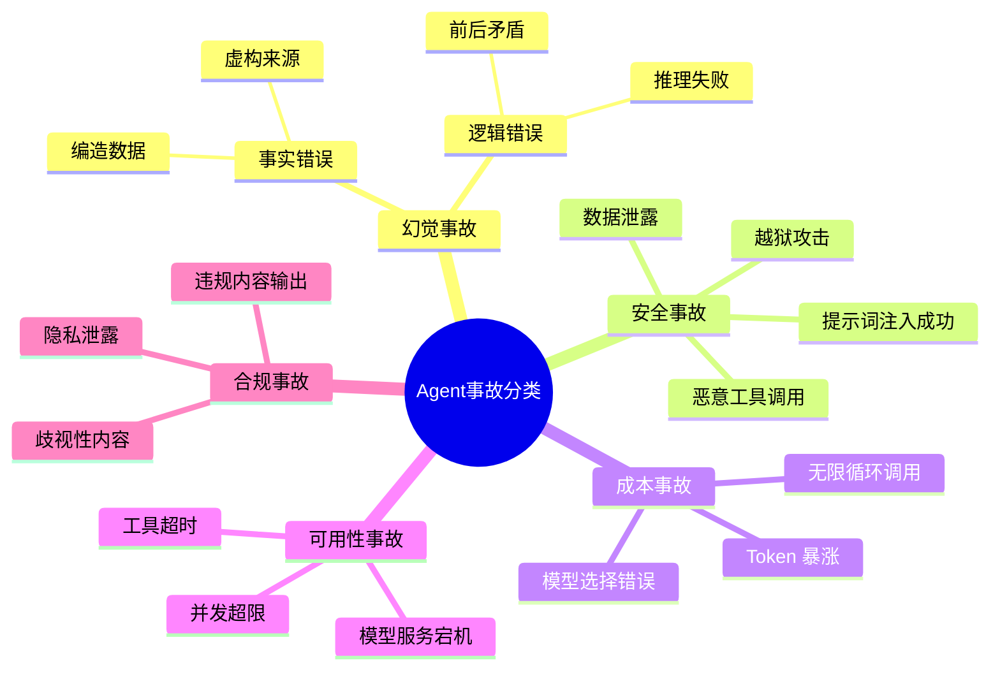
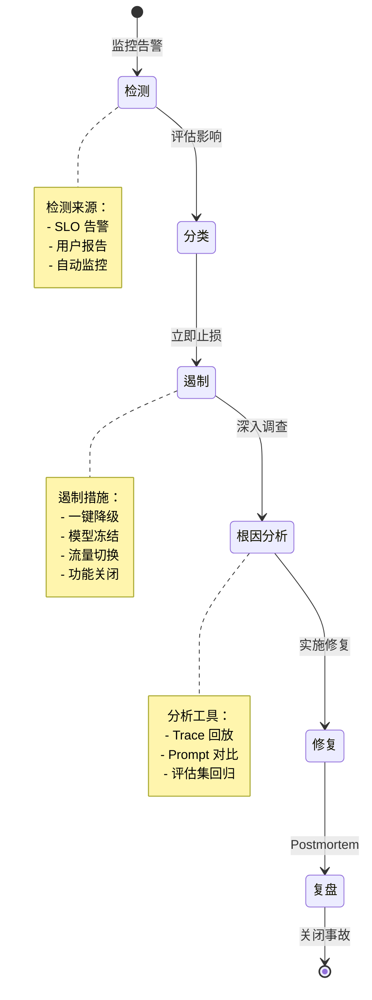
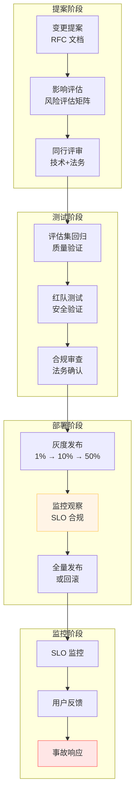

# 38 · Agent 事故响应与变更管理（Incident Response & Change Management）

> 阶段：4 生产化 · 难度：⭐⭐⭐⭐⭐ · 预计：3-4 天
> 前置：[36 Agent SLO 管理](36-AgentSLO管理.md)、[15 Agent 安全审计](15-Agent安全审计.md)
> 产出：掌握 Agent 特有的事故响应流程与变更管理体系

---

## 为什么 Agent 事故比传统软件事故更复杂

| 维度 | 传统软件 | Agent 系统 |
|------|---------|-----------|
| 确定性 | 相同输入 → 相同输出 | 相同输入 → 不同输出（非确定性） |
| 故障模式 | 代码 bug、依赖故障 | + 幻觉、偏见、工具调用错误 |
| 调试难度 | 日志可重现 | 无法完全重现（模型权重不变但概率不同） |
| 测试覆盖 | 单元测试可达高覆盖 | 无法测试所有可能的模型输出 |
| 涌现行为 | 无 | 意外能力突然出现 |
| 修复验证 | 部署后立即可验证 | 需长期观察（可能引入新问题） |

**核心挑战**：Agent 的事故往往不是"出错"，而是"意料之外的正确"——模型按训练做了事，但结果不符合人类预期。

---

## Agent 事故分类体系



---

## 事故响应生命周期



---

## Agent 级事故响应工具箱

```java
package com.enterprise.incident;

import org.springframework.stereotype.Component;
import java.util.*;
import java.util.concurrent.*;

/**
 * Agent 事故响应工具箱——快速止损
 *
 * 核心能力：
 * 1. 一键降级（降低风险）
 * 2. 模型冻结（停止更新）
 * 3. 流量切换（隔离影响）
 * 4. 会话快照（保存现场）
 */
@Component
public class IncidentResponseToolkit {

    /**
     * 一键降级——立即降低 Agent 风险
     */
    public DegradationResult emergencyDegradation(String incidentId) {
        // 1. 降低模型温度（更保守）
        configClient.updateTemperature(0.1);

        // 2. 切换到更小的模型（更稳定）
        configClient.switchModel("Qwen-3B-Instruct");

        // 3. 禁用高风险工具
        configClient.disableTools(List.of("web_search", "code_execution"));

        // 4. 严格限流
        rateLimiter.setGlobalLimit(10);  // 10 QPS

        // 5. 启用人工审核
        auditService.enableManualApproval();

        return new DegradationResult(true, List.of(
            "温度降低到 0.1",
            "切换到 Qwen-3B",
            "禁用高风险工具",
            "限流到 10 QPS",
            "启用人工审核"
        ));
    }

    /**
     * 模型冻结——停止模型更新
     */
    public void freezeModel(String modelVersion) {
        // 1. 标记版本为冻结
        versionControl.freeze(modelVersion);

        // 2. 阻止新版本部署
        deploymentGate.block("模型冻结期间禁止部署");

        // 3. 记录冻结原因
        auditLog.log("MODEL_FROZEN", modelVersion, "事故响应");
    }

    /**
     * 流量切换——快速隔离影响
     */
    public void switchTraffic(String incidentId, TrafficStrategy strategy) {
        switch (strategy) {
            case MAINTENANCE_MODE -> {
                // 维护模式：返回静态消息
                router.enableMaintenanceMode();
            }
            -> {
                // 仅降级服务：切换到备用模型
                router.routeToBackupModel();
            }
            -> {
                // 金丝雀隔离：仅 10% 流量到新模型
                router.setCanaryRatio(0.1);
            }
            -> {
                // 完全下线：停止服务
                router.shutdown();
            }
        }
    }

    /**
     * 会话快照——保存事故现场
     */
    public SessionSnapshot captureSession(String sessionId) {
        // 1. 获取完整会话历史
        ConversationHistory history = historyService.getHistory(sessionId);

        // 2. 获取当时使用的配置
        AgentConfig config = configService.getConfigAtTime(
            sessionId, history.startTime()
        );

        // 3. 获取当时使用的模型版本
        String modelVersion = versionControl.getModelAtTime(
            history.startTime()
        );

        // 4. 保存到事故库
        String snapshotId = incidentRepository.saveSnapshot(
            sessionId, history, config, modelVersion
        );

        return new SessionSnapshot(snapshotId, sessionId, config, modelVersion);
    }

    public enum TrafficStrategy {
        MAINTENANCE_MODE, BACKUP_ONLY, CANARY_ISOLATION, SHUTDOWN
    }

    public record DegradationResult(
        boolean success, List<String> actionsTaken
    ) {}

    public record SessionSnapshot(
        String snapshotId, String sessionId,
        AgentConfig config, String modelVersion
    ) {}
}
```

---

## 快速回滚机制

```java
package com.enterprise.incident;

import org.springframework.stereotype.Component;
import java.util.*;

/**
 * 快速回滚管理器——多维度回滚能力
 *
 * 回滚维度：
 * 1. Prompt 版本回滚（立即生效）
 * 2. 模型版本回滚（可能需要模型加载时间）
 * 3. 配置回滚（温度、Top-p 等参数）
 */
@Component
public class RollbackManager {

    private final Map<String, VersionHistory> versionHistories = new HashMap<>();

    /**
     * Prompt 回滚
     */
    public void rollbackPrompt(String targetVersion) {
        // 1. 获取目标版本 Prompt
        String prompt = versionControl.getPromptVersion(targetVersion);

        // 2. 部署
        configClient.updateSystemPrompt(prompt);

        // 3. 记录回滚
        auditLog.log("PROMPT_ROLLBACK", targetVersion);
    }

    /**
     * 模型回滚
     */
    public void rollbackModel(String targetVersion) {
        // 1. 检查目标模型是否可用
        if (!modelRegistry.isAvailable(targetVersion)) {
            throw new IllegalStateException("目标模型版本不可用: " + targetVersion);
        }

        // 2. 切换流量
        trafficSwitcher.switchModel(targetVersion);

        // 3. 等待模型就绪（可能需要几分钟）
        waitForModelReady(targetVersion, Duration.ofMinutes(5));

        // 4. 记录回滚
        auditLog.log("MODEL_ROLLBACK", targetVersion);
    }

    /**
     * 配置回滚
     */
    public void rollbackConfig(String timestamp) {
        // 1. 获取历史配置
        AgentConfig config = configHistory.getConfigAt(timestamp);

        // 2. 应用配置
        configClient.applyConfig(config);

        // 3. 记录回滚
        auditLog.log("CONFIG_ROLLBACK", timestamp);
    }

    /**
     * 一键回滚——回滚所有变更
     */
    public void fullRollback(String baseline) {
        // 1. 停止当前版本
        deploymentGate.stopCurrentVersion();

        // 2. 回滚到基线版本
        rollbackPrompt(baseline + "-prompt");
        rollbackModel(baseline + "-model");
        rollbackConfig(baseline + "-config");

        // 3. 验证回滚成功
        if (!healthChecker.isHealthy()) {
            throw new IllegalStateException("回滚后服务不健康");
        }
    }

    private void waitForModelReady(String version, Duration timeout) {
        long deadline = System.currentTimeMillis() + timeout.toMillis();
        while (System.currentTimeMillis() < deadline) {
            if (modelRegistry.isReady(version)) {
                return;
            }
            try { Thread.sleep(5000); }
            catch (InterruptedException e) { Thread.currentThread().interrupt(); }
        }
        throw new IllegalStateException("模型回滚超时: " + version);
    }
}
```

---

## Java 事故响应控制器

```java
package com.enterprise.incident;

import org.springframework.web.bind.annotation.*;
import org.springframework.stereotype.Controller;
import java.util.concurrent.*;

/**
 * 事故响应控制器——On-call 操作入口
 */
@Controller
@RequestMapping("/incidents")
public class IncidentResponseController {

    private final IncidentResponseToolkit toolkit;
    private final RollbackManager rollbackManager;
    private final IncidentRepository incidentRepo;

    /**
     * 创建事故记录
     */
    @PostMapping
    public String createIncident(@RequestBody IncidentRequest request) {
        Incident incident = Incident.create(
            request.severity(),
            request.description(),
            request.affectedSystems()
        );

        incidentRepo.save(incident);

        // 高危事故自动触发降级
        if (incident.severity() == Severity.P1) {
            toolkit.emergencyDegradation(incident.id());
        }

        return "redirect:/incidents/" + incident.id();
    }

    /**
     * 更新事故状态
     */
    @PostMapping("/{id}/status")
    public String updateStatus(
        @PathVariable String id,
        @RequestParam IncidentStatus status
    ) {
        Incident incident = incidentRepo.findById(id);
        incident.updateStatus(status);
        incidentRepo.save(incident);

        // 状态变更通知
        notificationService.notifyOnCall(
            String.format("事故 %s 状态变更为 %s", id, status)
        );

        return "redirect:/incidents/" + id;
    }

    /**
     * 执行回滚
     */
    @PostMapping("/{id}/rollback")
    public String executeRollback(
        @PathVariable String id,
        @RequestBody RollbackRequest request
    ) {
        Incident incident = incidentRepo.findById(id);

        switch (request.rollbackType()) {
            case PROMPT -> rollbackManager.rollbackPrompt(request.targetVersion());
            case MODEL -> rollbackManager.rollbackModel(request.targetVersion());
            case CONFIG -> rollbackManager.rollbackConfig(request.targetVersion());
            case FULL -> rollbackManager.fullRollback(request.baseline());
        }

        incident.addAction("执行回滚: " + request.rollbackType());
        incidentRepo.save(incident);

        return "redirect:/incidents/" + id;
    }

    /**
     * 捕获会话快照
     */
    @PostMapping("/{id}/snapshots")
    public String captureSnapshot(
        @PathVariable String id,
        @RequestParam String sessionId
    ) {
        SessionSnapshot snapshot = toolkit.captureSession(sessionId);

        Incident incident = incidentRepo.findById(id);
        incident.addSnapshot(snapshot);
        incidentRepo.save(incident);

        return "redirect:/incidents/" + id;
    }

    public enum IncidentStatus { DETECTED, INVESTIGATING, CONTAINED, RESOLVED, CLOSED }
    public enum RollbackType { PROMPT, MODEL, CONFIG, FULL }
}
```

---

## 变更管理流程



### Agent 变更评估框架

```java
package com.enterprise.change;

import org.springframework.stereotype.Component;
import java.util.*;

/**
 * Agent 变更评估框架
 *
 * 评估维度：
 * 1. 风险评估矩阵（影响 × 概率）
 * 2. 评估集回归（质量验证）
 * 3. 安全审查（红队测试）
 * 4. 合规审查（法务确认）
 */
@Component
public class ChangeEvaluationFramework {

    /**
     * 风险评估矩阵
     */
    public RiskLevel assessRisk(ChangeRequest change) {
        int impactScore = assessImpact(change);
        int probabilityScore = assessProbability(change);

        int totalScore = impactScore * probabilityScore;

        return switch (totalScore) {
            case int s when s > 15 -> RiskLevel.CRITICAL;
            case int s when s > 8  -> RiskLevel.HIGH;
            case int s when s > 3  -> RiskLevel.MEDIUM;
            default                -> RiskLevel.LOW;
        };
    }

    /**
     * 影响评估（1-5分）
     */
    private int assessImpact(ChangeRequest change) {
        int score = 1;

        // 影响用户数
        if (change.affectedUsers() > 100000) score += 3;
        else if (change.affectedUsers() > 10000) score += 2;
        else if (change.affectedUsers() > 1000) score += 1;

        // 核心功能
        if (change.isCoreFunction()) score += 2;

        // 安全影响
        if (change.affectsSecurity()) score += 2;

        return Math.min(score, 5);
    }

    /**
     * 概率评估（1-5分）
     */
    private int assessProbability(ChangeRequest change) {
        int score = 1;

        // 变更复杂度
        if (change.complexity() == Complexity.HIGH) score += 2;
        else if (change.complexity() == Complexity.MEDIUM) score += 1;

        // 历史故障率
        double historicalFailureRate = getHistoricalFailureRate(change.type());
        if (historicalFailureRate > 0.1) score += 2;
        else if (historicalFailureRate > 0.05) score += 1;

        return Math.min(score, 5);
    }

    /**
     * 评估集回归
     */
    public RegressionResult runRegression(ChangeRequest change) {
        // 1. 获取评估集
        List<EvaluationCase> evalSet = evaluationRepository.getSet(change.domain());

        // 2. 运行评估
        List<EvaluationResult> results = new ArrayList<>();
        for (EvaluationCase testCase : evalSet) {
            EvaluationResult result = evaluate(testCase, change);
            results.add(result);
        }

        // 3. 统计
        double passRate = results.stream()
            .filterToDouble(EvaluationResult::passed)
            .average()
            .orElse(0);

        return new RegressionResult(
            passRate,
            results.stream().filter(r -> !r.passed()).toList(),
            results.size()
        );
    }

    private double getHistoricalFailureRate(ChangeType type) {
        // 从历史数据计算
        return 0.03;  // 示例
    }

    public enum RiskLevel { CRITICAL, HIGH, MEDIUM, LOW }
    public enum Complexity { LOW, MEDIUM, HIGH }
}
```

---

## Postmortem 模板与改进追踪

```markdown
# Agent 事故 Postmortem

## 元信息
- 事故ID：INC-2024-08-001
- 发生时间：2024-08-09 10:23:15 UTC
- 持续时长：45分钟
- 影响用户：约12,000人
- 严重等级：P1
- 负责人：@on-call

## 执行摘要
> 一句话：客户服务 Agent 在 45 分钟内对 5% 的查询提供了错误建议，导致客户投诉激增。

## 影响分析
### 用户影响
- 受影响用户数：12,000
- 受影响功能：客户服务对话
- 用户体验：收到错误的退换货政策信息

### 业务影响
- 客服工单增加：+300%
- 用户投诉增加：+250%
- 预估财务损失：$15,000（客服加班费）

## 时间线
| 时间（UTC） | 事件 | 响应 |
|------------|------|------|
| 10:23 | 监控告警：任务完成率降至 85% | 自动告警 |
| 10:25 | On-call 确认告警 | 开始调查 |
| 10:28 | 确认范围：影响所有客户服务会话 | 声明事故 |
| 10:30 | 执行一键降级 | 风险降低 |
| 10:35 | 确认根因：新 Prompt 导致事实错误 | 准备回滚 |
| 10:40 | Prompt 回滚到 v2.3 | 正在验证 |
| 10:45 | 验证通过，SLO 恢复 | 持续监控 |
| 11:08 | 关闭事故 | 进入复盘 |

## 根本原因分析
### 直接原因
- Prompt 修改引入了错误的产品信息

### 根本原因
- Prompt 变更未经过评估集回归测试
- 缺少产品信息的事实校验机制

### 贡献因素
- 变更时间选择不当（业务高峰期）
- 评估集未覆盖新引入的产品

## 解决措施
### 立即措施（已完成）
- [x] 一键降级
- [x] Prompt 回滚到 v2.3
- [x] 通知受影响用户

### 短期措施（1周内）
- [ ] 实施 Prompt 变更的评估集回归
- [ ] 建立产品信息的事实校验 API
- [ ] 调整变更窗口到业务低谷期

### 长期措施（1季度内）
- [ ] 建立完整的 Prompt 版本管理
- [ ] 实施 LLM-as-Judge 质量监控
- [ ] 建立变更风险评估框架

## 经验教训
### 做得好的地方
- 自动告警及时触发
- 一键降级快速止损
- 团队响应迅速

### 需要改进的地方
- Prompt 变更缺少评估验证
- 评估集覆盖不足
- 变更窗口选择不当

## 改进追踪
| 措施 | 负责人 | 目标完成时间 | 状态 |
|------|-------|------------|------|
| Prompt 评估集回归 | @platform-team | 2024-08-15 | 进行中 |
| 事实校验 API | @data-team | 2024-08-20 | 待开始 |
| 变更窗口调整 | @ops-team | 2024-08-12 | 已完成 |

## 相关链接
- 事故日志：[Logs](https://logs.example.com/incident/INC-2024-08-001)
- Trace 追踪：[Traces](https://traces.example.com/incident/INC-2024-08-001)
- 会话快照：[Snapshots](https://snapshots.example.com/incident/INC-2024-08-001)

---
*最后更新：2024-08-09 15:30 UTC*
```

---

## 与 PagerDuty/ONCALL 集成

```java
package com.enterprise.incident.integration;

import org.springframework.stereotype.Component;
import java.util.*;

/**
 * 告警集成——对接 PagerDuty/Opsgenie/企业微信
 *
 * 集成点：
 * 1. SLO 违反告警 → PagerDuty
 * 2. 事故创建 → On-call 通知
 * 3. 事故更新 → 状态同步
 * 4. 回滚完成 → 关闭告警
 */
@Component
public class AlertIntegration {

    private final PagerDutyClient pagerDuty;
    private final WechatWorkClient wechat;

    /**
     * 触发告警
     */
    public void triggerAlert(AlertCondition condition) {
        // 1. 评估严重程度
        Severity severity = assessSeverity(condition);

        // 2. 创建 PagerDuty 事件
        pagerDuty.createEvent(PagerDutyEvent.builder()
            .severity(severity)
            .summary(condition.summary())
            .detail(condition.detail())
            .build());

        // 3. 发送企业微信通知
        if (severity == Severity.P1) {
            wechat.sendEmergencyMessage(
                String.format("🚨 %s\n\n%s", condition.summary(), condition.detail())
            );
        }
    }

    /**
     * 事故通知 On-call
     */
    public void notifyOnCall(Incident incident) {
        // 1. 获取 On-call 值班表
        List<String> onCallUsers = rosterService.getOnCallUsers(incident.severity());

        // 2. 通知所有人
        for (String user : onCallUsers) {
            wechat.sendToUser(user, String.format("""
                🔔 **事故通知**

                **ID**：%s
                **等级**：%s
                **描述**：%s
                **影响**：%s

                请立即处理。
                """,
                incident.id(),
                incident.severity(),
                incident.description(),
                incident.affectedSystems()
            ));
        }

        // 3. 记录通知时间
        incident.notifiedAt(Instant.now());
    }

    /**
     * 更新事故状态
     */
    public void updateIncidentStatus(String incidentId, IncidentStatus status) {
        // 1. 更新 PagerDuty
        pagerDuty.updateIncident(incidentId, status);

        // 2. 通知相关方
        if (status == IncidentStatus.RESOLVED) {
            wechat.sendToChannel("#incidents", String.format("""
                ✅ **事故已解决**

                **ID**：%s
                **持续时间**：%s

                Postmortem 链接：%s
                """,
                incidentId,
                Duration.between(start, end),
                postmortemUrl
            ));
        }
    }

    private Severity assessSeverity(AlertCondition condition) {
        // 根据条件评估严重程度
        if (condition.sloViolation() && condition.critical()) {
            return Severity.P1;
        }
        if (condition.sloViolation()) {
            return Severity.P2;
        }
        return Severity.P3;
    }

    public enum Severity { P1, P2, P3 }
    public enum IncidentStatus { INVESTIGATING, CONTAINED, RESOLVED }
}
```

---

## 验收检查

- [ ] 理解 Agent 事故与传统软件事故的区别
- [ ] 能分类 Agent 事故（幻觉/安全/成本/可用性/合规）
- [ ] 能实现事故响应工具箱（降级/冻结/切换/快照）
- [ ] 能实现快速回滚（Prompt/模型/配置）
- [ ] 能设计变更管理流程（提案→评估→灰度→全量）
- [ ] 能实施变更评估框架（风险矩阵+评估集回归）
- [ ] 能编写 Agent 事故 Postmortem
- [ ] 能集成 PagerDuty/Opsgenie 告警

---

## 阶段4完成

恭喜！你已完成阶段4「生产化」的所有学习。

### 核心收获

- **可靠性**：Agent 多轮对话的可靠性工程、故障切换
- **可观测性**：MELT 框架、全链路追踪
- **成本**：成本归因、计费、优化
- **治理**：SLO 管理、合规、事故响应

### 下一步

→ [阶段5 架构师](../阶段5-架构师/00-README.md)
