# 39 · Agent 反馈闭环与用户体验（Feedback Loop & UX）

## 概述

在 Agent 系统的生产化过程中，建立完善的反馈闭环是持续改进 Agent 能力的核心引擎。不同于传统软件系统，Agent 系统的行为具有概率性和不确定性，同样的输入可能产生不同的输出，这使得持续的反馈收集、分析和优化变得至关重要。

本文将深入探讨如何构建一个完整的 Agent 反馈闭环系统，从反馈采集的全链路设计，到基于反馈的自动优化机制，再到用户体验指标体系的建立，帮助企业级 Agent 系统实现真正的持续学习和进化。

## 为什么需要反馈闭环

### Agent 系统的特殊性

传统软件系统的行为是确定性的，同样的输入总是产生相同的输出。但 Agent 系统基于大语言模型，其行为具有以下特点：

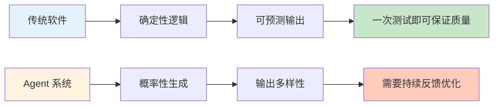

### 反馈闭环的核心价值

1. **质量保障**：捕获和修复错误输出，避免用户流失
2. **持续改进**：从真实使用场景中学习，不断提升 Agent 能力
3. **用户参与**：让用户成为 Agent 进化的参与者，提升归属感
4. **风险控制**：及时发现和处理有害、偏见或不当输出
5. **产品洞察**：了解用户真实需求和使用模式

### 反馈闭环的 ROI 分析

| 投入项 | 短期成本 | 长期收益 |
|--------|---------|---------|
| 反馈 UI 开发 | 2-4 周开发时间 | 错误率降低 30-50% |
| 反馈数据存储 | 基础设施成本增加 15% | 用户留存提升 20% |
| 数据分析 pipeline | 数据工程投入 1-2 人/月 | 产品决策速度提升 3 倍 |
| A/B 测试框架 | 初始投入 + 持续运营成本 | 优化效果提升 2-5 倍 |

## 反馈采集全链路设计

### 完整反馈链路

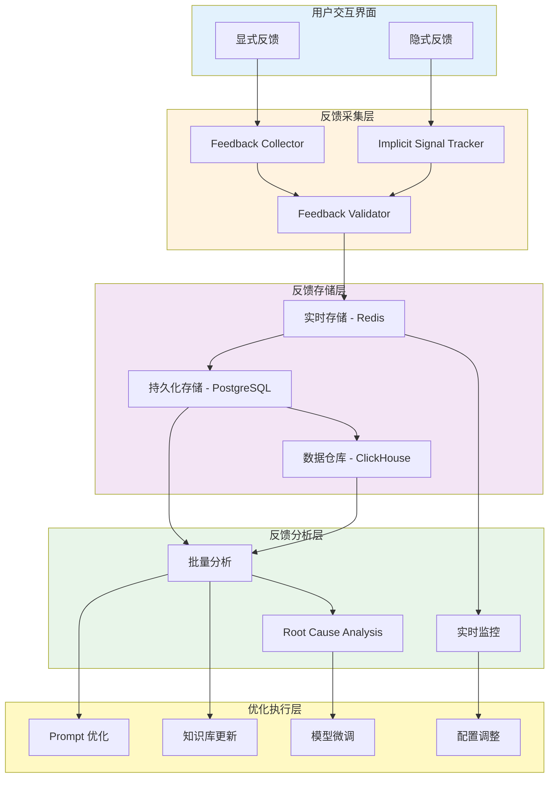

### 隐式反馈信号

隐式反馈是用户在使用过程中自然产生的行为信号，不需要用户主动提供：

| 反馈类型 | 信号含义 | 收集方式 | 可信度 |
|---------|---------|---------|--------|
| 停留时间 | 输出有用性 | 前端埋点 | 中 |
| 复制操作 | 内容价值 | 剪贴板监听 | 高 |
| 重试次数 | 初次输出质量 | 请求日志 | 高 |
| 中断操作 | 输出问题 | 取消事件 | 高 |
| 修改程度 | 输出准确性 | 编辑距离 | 中 |
| 后续对话 | 上下文连贯性 | 会话连续性 | 中 |

### 显式反馈机制

显式反馈需要用户主动提供，通常通过 UI 交互收集：

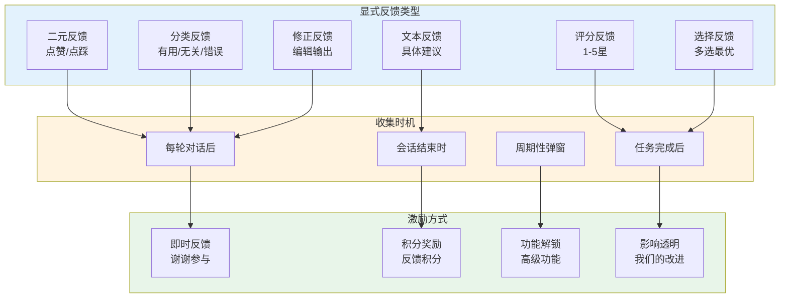

## 反馈 UI 设计模式

### 模式一：点赞/点踩（Thumbs Up/Down）

最简单直接的反馈方式，适合快速收集大量反馈数据。

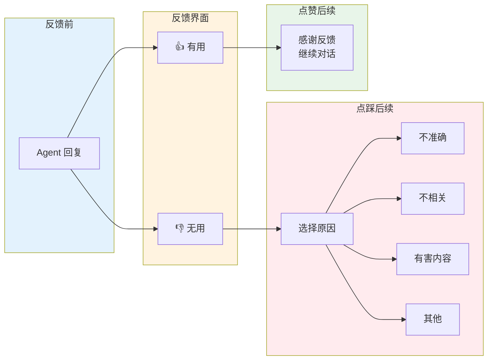

**实现要点**：
- 位置：每个 Agent 回复下方
- 时效：可随时修改（最后一次为准）
- 可选：点踩时询问具体原因
- 隐私：默认匿名，可选提供联系方式

### 模式二：结构化评分

对 Agent 输出的多个维度进行评分，提供更细致的反馈。

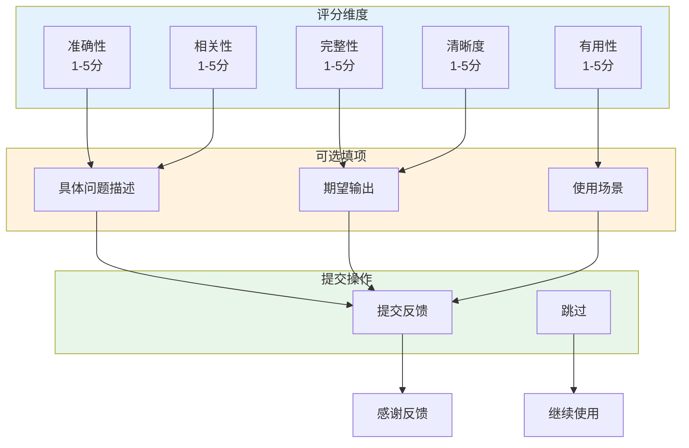

**使用场景**：
- 重要任务完成后（如代码生成、报告生成）
- 用户主动触发深度反馈
- 周期性抽样（每 10 次交互 1 次）

### 模式三：对话修正

允许用户直接修改 Agent 输出，将修正后的内容作为反馈。

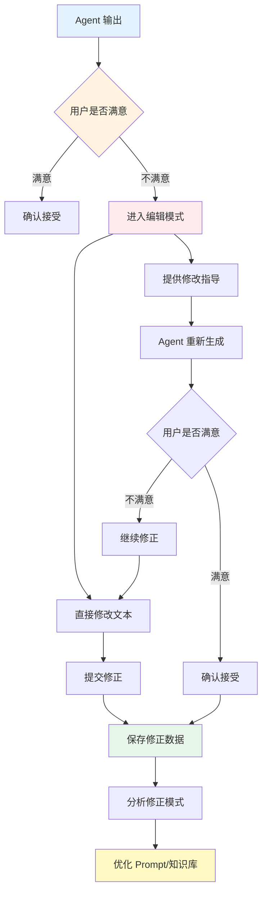

**技术实现**：
- 使用 diff 算法计算修改内容
- 关联原始输出和修正后输出
- 提取修改模式（如：补充细节、纠正错误、调整语气）

### 模式四：选择最优

提供多个候选输出，让用户选择最好的。

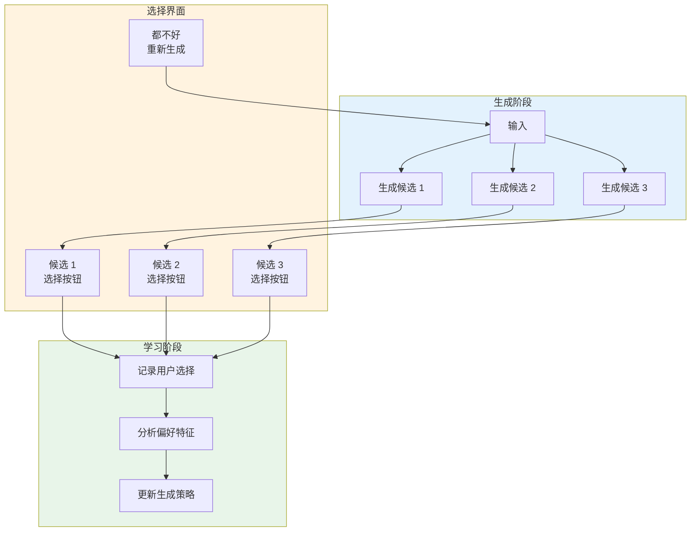

**适用场景**：
- 创意生成（如文案、标题）
- 多方案问题（如代码实现方案）
- 风格化输出（如不同语气的回复）

## Human-in-the-Loop 架构

### HITL 系统架构

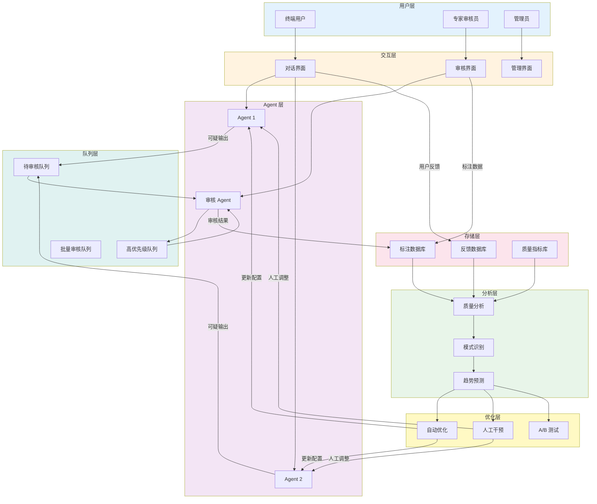

### 审核触发机制

| 触发条件 | 审核级别 | 处理方式 | SLA |
|---------|---------|---------|-----|
| 低置信度输出 | 中 | 专家审核 | 24 小时 |
| 敏感话题 | 高 | 管理员审核 | 4 小时 |
| 用户投诉 | 高 | 优先审核 | 1 小时 |
| 批量导入 | 低 | 抽样审核 | 72 小时 |
| 新模型部署 | 高 | 全面审核 | 完成后 48 小时 |

### 人工审核界面设计

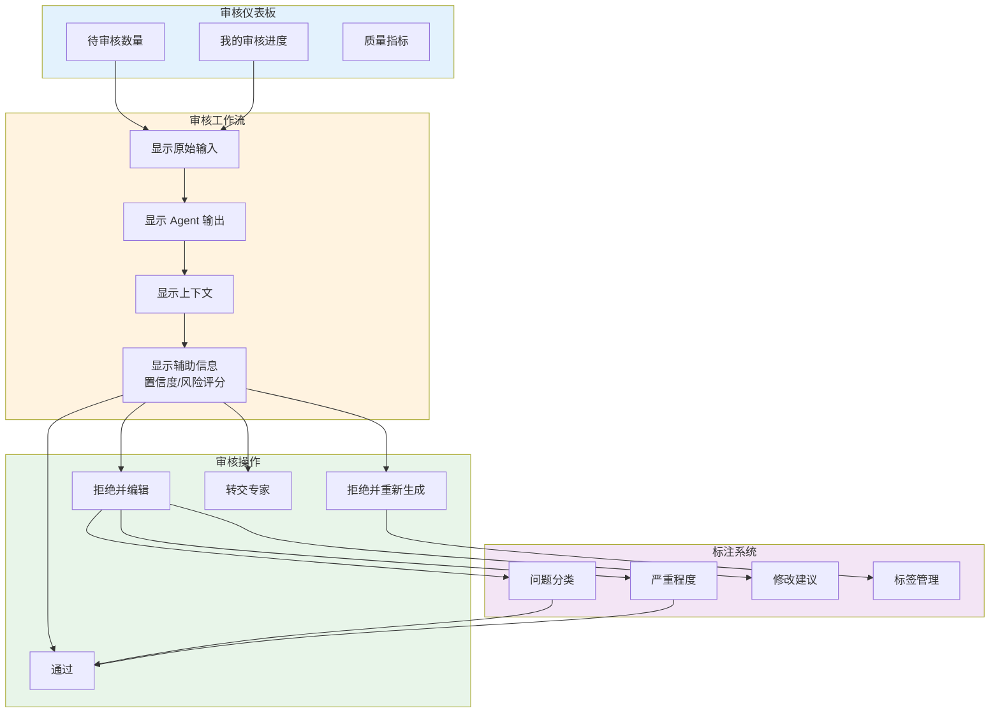

## 反馈数据质量保障

### 噪声过滤机制

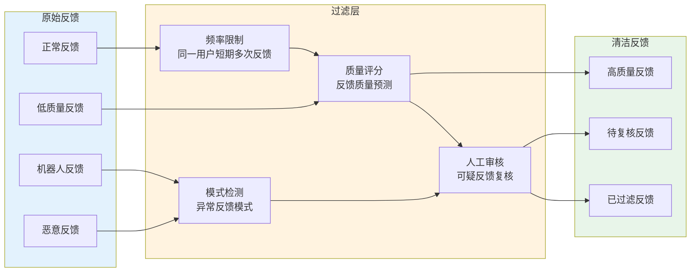

### 矛盾处理策略

当出现矛盾反馈时（同一输出既有正面又有负面评价）：

| 矛盾类型 | 处理策略 | 权重分配 |
|---------|---------|---------|
| 不同用户矛盾 | 按用户信誉权重 | 信誉高者权重 3x |
| 同一用户自相矛盾 | 以最新反馈为准 | 最新反馈权重 5x |
| 显式 vs 隐式矛盾 | 显式反馈优先 | 显式权重 2x |
| 批量矛盾检测 | 标记待人工审核 | 暂不用于自动优化 |

### 标注一致性保障

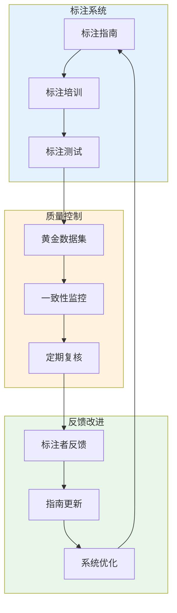

**关键指标**：
- 标注者间一致性（IAA）：目标 > 0.8
- 与黄金数据集一致性：目标 > 0.9
- 标注时间分布：检测异常标注速度

## Java 实现方案

### FeedbackCollector 实现

```java
package com.enterprise.agent.feedback;

import org.springframework.stereotype.Component;
import org.springframework.data.redis.core.RedisTemplate;
import lombok.RequiredArgsConstructor;
import lombok.extern.slf4j.Slf4j;
import com.fasterxml.jackson.databind.ObjectMapper;

import java.time.Duration;
import java.time.LocalDateTime;
import java.util.Map;
import java.util.UUID;
import java.util.concurrent.CompletableFuture;

/**
 * Agent 反馈收集器
 * 
 * 功能：
 * 1. 收集显式和隐式反馈
 * 2. 实时缓存和批量持久化
 * 3. 反馈验证和质量评分
 * 4. 异步处理避免影响用户体验
 */
@Slf4j
@Component
@RequiredArgsConstructor
public class FeedbackCollector {
    
    private final RedisTemplate<String, Object> redisTemplate;
    private final FeedbackValidator feedbackValidator;
    private final FeedbackQualityScorer qualityScorer;
    private final ObjectMapper objectMapper;
    
    private static final String FEEDBACK_QUEUE = "agent:feedback:queue";
    private static final String FEEDBACK_PREFIX = "agent:feedback:";
    
    /**
     * 收集显式反馈
     * 
     * @param feedback 反馈数据
     * @return 反馈ID
     */
    public CompletableFuture<String> collectExplicitFeedback(ExplicitFeedback feedback) {
        return CompletableFuture.supplyAsync(() -> {
            try {
                // 验证反馈数据
                ValidationResult validation = feedbackValidator.validate(feedback);
                if (!validation.isValid()) {
                    log.warn("Invalid feedback: {}", validation.getReason());
                    throw new IllegalArgumentException(validation.getReason());
                }
                
                // 生成反馈ID
                String feedbackId = generateFeedbackId();
                feedback.setFeedbackId(feedbackId);
                feedback.setTimestamp(LocalDateTime.now());
                
                // 质量评分
                double qualityScore = qualityScorer.score(feedback);
                feedback.setQualityScore(qualityScore);
                
                // 实时缓存（24小时）
                String cacheKey = FEEDBACK_PREFIX + feedbackId;
                redisTemplate.opsForValue().set(cacheKey, feedback, Duration.ofHours(24));
                
                // 加入持久化队列
                redisTemplate.opsForList().rightPush(FEEDBACK_QUEUE, feedbackId);
                
                log.info("Collected explicit feedback: id={}, score={}, type={}", 
                    feedbackId, qualityScore, feedback.getFeedbackType());
                
                return feedbackId;
                
            } catch (Exception e) {
                log.error("Failed to collect explicit feedback", e);
                throw new FeedbackCollectionException("Failed to collect feedback", e);
            }
        });
    }
    
    /**
     * 收集隐式反馈
     * 
     * @param implicitSignal 隐式信号
     * @return 是否成功记录
     */
    public CompletableFuture<Boolean> collectImplicitFeedback(ImplicitSignal implicitSignal) {
        return CompletableFuture.supplyAsync(() -> {
            try {
                // 验证信号数据
                if (!feedbackValidator.validateImplicitSignal(implicitSignal)) {
                    return false;
                }
                
                // 聚合短期信号（同一会话的相同类型信号）
                String aggregateKey = "implicit:aggregate:" + implicitSignal.getSessionId() 
                    + ":" + implicitSignal.getSignalType();
                
                // 使用 Redis Hash 聚合
                redisTemplate.opsForHash().increment(aggregateKey, "count", 1);
                redisTemplate.expire(aggregateKey, Duration.ofMinutes(30));
                
                // 定期批量处理
                if (shouldFlushAggregate(aggregateKey)) {
                    flushAggregateSignals(aggregateKey, implicitSignal.getSignalType());
                }
                
                return true;
                
            } catch (Exception e) {
                log.error("Failed to collect implicit feedback", e);
                return false;
            }
        });
    }
    
    /**
     * 批量收集反馈（用于导入或批量处理）
     * 
     * @param feedbacks 反馈列表
     * @return 成功数量
     */
    public CompletableFuture<Integer> collectBatch(java.util.List<ExplicitFeedback> feedbacks) {
        return CompletableFuture.supplyAsync(() -> {
            int successCount = 0;
            
            for (ExplicitFeedback feedback : feedbacks) {
                try {
                    collectExplicitFeedback(feedback).get();
                    successCount++;
                } catch (Exception e) {
                    log.error("Failed to collect feedback in batch", e);
                }
            }
            
            log.info("Batch collection complete: {}/{} successful", successCount, feedbacks.size());
            return successCount;
        });
    }
    
    private String generateFeedbackId() {
        return "fb-" + UUID.randomUUID().toString().substring(0, 8);
    }
    
    private boolean shouldFlushAggregate(String aggregateKey) {
        Object count = redisTemplate.opsForHash().get(aggregateKey, "count");
        return count != null && ((Long) count) >= 5; // 每5个信号聚合一次
    }
    
    private void flushAggregateSignals(String aggregateKey, String signalType) {
        // 实现信号聚合逻辑
        // ... 将聚合后的信号转换为显式反馈
        log.debug("Flushing aggregate signals: key={}, type={}", aggregateKey, signalType);
    }
}
```

### ImplicitSignalTracker 实现

```java
package com.enterprise.agent.feedback;

import org.springframework.stereotype.Component;
import org.springframework.data.redis.core.RedisTemplate;
import lombok.RequiredArgsConstructor;
import lombok.extern.slf4j.Slf4j;

import java.time.Duration;
import java.time.LocalDateTime;
import java.util.Map;
import java.util.concurrent.ConcurrentHashMap;

/**
 * 隐式反馈信号追踪器
 * 
 * 追踪用户在使用过程中的各种隐式信号：
 * - 停留时间
 * - 复制操作
 * - 重试次数
 * - 中断操作
 * - 修改程度
 * - 后续对话行为
 */
@Slf4j
@Component
@RequiredArgsConstructor
public class ImplicitSignalTracker {
    
    private final RedisTemplate<String, Object> redisTemplate;
    
    // 会话级别的信号缓存
    private final Map<String, SessionSignals> sessionCache = new ConcurrentHashMap<>();
    
    private static final String SESSION_PREFIX = "implicit:session:";
    private static final Duration SESSION_TTL = Duration.ofHours(2);
    
    /**
     * 记录停留时间信号
     * 
     * @param sessionId 会话ID
     * @param responseId 响应ID
     * @param duration 停留时长（秒）
     */
    public void trackDwellTime(String sessionId, String responseId, long duration) {
        SessionSignals signals = getSessionSignals(sessionId);
        
        // 停留时间分析
        DwellQuality quality = analyzeDwellTime(duration);
        
        signals.addSignal(ImplicitSignal.builder()
            .sessionId(sessionId)
            .responseId(responseId)
            .signalType(SignalType.DWELL_TIME)
            .timestamp(LocalDateTime.now())
            .value(duration)
            .quality(quality)
            .build());
        
        // 超短停留时间可能表示不满意
        if (quality == DwellQuality.VERY_SHORT) {
            signals.setPotentialDissatisfaction(true);
        }
        
        updateSessionSignals(sessionId, signals);
    }
    
    /**
     * 记录复制操作
     * 
     * @param sessionId 会话ID
     * @param responseId 响应ID
     * @param copiedContent 复制的内容
     */
    public void trackCopyAction(String sessionId, String responseId, String copiedContent) {
        SessionSignals signals = getSessionSignals(sessionId);
        
        signals.addSignal(ImplicitSignal.builder()
            .sessionId(sessionId)
            .responseId(responseId)
            .signalType(SignalType.COPY)
            .timestamp(LocalDateTime.now())
            .value(copiedContent.length())
            .metadata(Map.of("content_preview", 
                copiedContent.substring(0, Math.min(50, copiedContent.length()))))
            .build());
        
        // 复制操作通常是正面信号
        signals.incrementPositiveSignals();
        
        updateSessionSignals(sessionId, signals);
    }
    
    /**
     * 记录重试行为
     * 
     * @param sessionId 会话ID
     * @param originalPrompt 原始提示
     * @param retryPrompt 重试提示（可能有修改）
     */
    public void trackRetry(String sessionId, String originalPrompt, String retryPrompt) {
        SessionSignals signals = getSessionSignals(sessionId);
        
        // 计算提示修改程度
        double modificationDegree = calculateModificationDegree(originalPrompt, retryPrompt);
        
        signals.addSignal(ImplicitSignal.builder()
            .sessionId(sessionId)
            .signalType(SignalType.RETRY)
            .timestamp(LocalDateTime.now())
            .value(modificationDegree)
            .metadata(Map.of(
                "original_length", originalPrompt.length(),
                "retry_length", retryPrompt.length()
            ))
            .build());
        
        // 重试通常是负面信号
        signals.incrementNegativeSignals();
        
        // 高修改度可能表示 Agent 误解了意图
        if (modificationDegree > 0.5) {
            signals.setPossibleMisunderstanding(true);
        }
        
        updateSessionSignals(sessionId, signals);
    }
    
    /**
     * 记录中断操作
     * 
     * @param sessionId 会话ID
     * @param responseId 响应ID
     * @param interruptType 中断类型（cancel/regenerate/new_query）
     */
    public void trackInterruption(String sessionId, String responseId, InterruptType interruptType) {
        SessionSignals signals = getSessionSignals(sessionId);
        
        signals.addSignal(ImplicitSignal.builder()
            .sessionId(sessionId)
            .responseId(responseId)
            .signalType(SignalType.INTERRUPTION)
            .timestamp(LocalDateTime.now())
            .value(interruptType.name())
            .build());
        
        // 中断通常是负面信号
        signals.incrementNegativeSignals();
        
        // 重新生成表示当前输出不满意
        if (interruptType == InterruptType.REGENERATE) {
            signals.setPossibleQualityIssue(true);
        }
        
        updateSessionSignals(sessionId, signals);
    }
    
    /**
     * 获取会话的隐式信号摘要
     * 
     * @param sessionId 会话ID
     * @return 信号摘要
     */
    public SignalSummary getSignalSummary(String sessionId) {
        SessionSignals signals = getSessionSignals(sessionId);
        
        return SignalSummary.builder()
            .sessionId(sessionId)
            .totalSignals(signals.getTotalSignals())
            .positiveSignals(signals.getPositiveSignals())
            .negativeSignals(signals.getNegativeSignals())
            .satisfactionScore(calculateSatisfactionScore(signals))
            .possibleIssues(identifiyPossibleIssues(signals))
            .build();
    }
    
    private SessionSignals getSessionSignals(String sessionId) {
        // 先从本地缓存获取
        SessionSignals signals = sessionCache.get(sessionId);
        
        if (signals == null) {
            // 从 Redis 获取
            String key = SESSION_PREFIX + sessionId;
            signals = (SessionSignals) redisTemplate.opsForValue().get(key);
            
            if (signals == null) {
                signals = new SessionSignals(sessionId);
            }
            
            sessionCache.put(sessionId, signals);
        }
        
        return signals;
    }
    
    private void updateSessionSignals(String sessionId, SessionSignals signals) {
        // 更新本地缓存
        sessionCache.put(sessionId, signals);
        
        // 更新 Redis
        String key = SESSION_PREFIX + sessionId;
        redisTemplate.opsForValue().set(key, signals, SESSION_TTL);
    }
    
    private DwellQuality analyzeDwellTime(long duration) {
        if (duration < 3) return DwellQuality.VERY_SHORT;
        if (duration < 10) return DwellQuality.SHORT;
        if (duration < 60) return DwellQuality.NORMAL;
        if (duration < 300) return DwellQuality.LONG;
        return DwellQuality.VERY_LONG;
    }
    
    private double calculateModificationDegree(String original, String retry) {
        // 简单实现：基于编辑距离
        int maxLen = Math.max(original.length(), retry.length());
        if (maxLen == 0) return 0.0;
        
        // 这里可以使用更复杂的算法，如 Levenshtein 距离
        int edits = Math.abs(original.length() - retry.length());
        return (double) edits / maxLen;
    }
    
    private double calculateSatisfactionScore(SessionSignals signals) {
        if (signals.getTotalSignals() == 0) return 0.5;
        
        double positiveRatio = (double) signals.getPositiveSignals() / signals.getTotalSignals();
        double negativeRatio = (double) signals.getNegativeSignals() / signals.getTotalSignals();
        
        return positiveRatio - negativeRatio; // 范围 [-1, 1]
    }
    
    private java.util.List<String> identifiyPossibleIssues(SessionSignals signals) {
        java.util.List<String> issues = new java.util.ArrayList<>();
        
        if (signals.isPotentialDissatisfaction()) {
            issues.add("potential_dissatisfaction");
        }
        if (signals.isPossibleMisunderstanding()) {
            issues.add("possible_misunderstanding");
        }
        if (signals.isPossibleQualityIssue()) {
            issues.add("possible_quality_issue");
        }
        
        return issues;
    }
}
```

### FeedbackAggregator 实现

```java
package com.enterprise.agent.feedback;

import org.springframework.stereotype.Component;
import org.springframework.data.redis.core.RedisTemplate;
import lombok.RequiredArgsConstructor;
import lombok.extern.slf4j.Slf4j;
import com.fasterxml.jackson.databind.ObjectMapper;

import java.time.LocalDateTime;
import java.time.temporal.ChronoUnit;
import java.util.*;
import java.util.stream.Collectors;

/**
 * 反馈数据聚合器
 * 
 * 功能：
 * 1. 聚合多维度反馈数据
 * 2. 计算统计指标
 * 3. 识别模式和趋势
 * 4. 生成优化建议
 */
@Slf4j
@Component
@RequiredArgsConstructor
public class FeedbackAggregator {
    
    private final FeedbackRepository feedbackRepository;
    private final ObjectMapper objectMapper;
    
    /**
     * 按时间范围聚合反馈
     * 
     * @param startTime 开始时间
     * @param endTime 结束时间
     * @param aggregationLevel 聚合粒度（hourly/daily/weekly）
     * @return 聚合结果
     */
    public TimeSeriesAggregation aggregateByTimeRange(
            LocalDateTime startTime, 
            LocalDateTime endTime,
            AggregationLevel aggregationLevel) {
        
        List<Feedback> feedbacks = feedbackRepository.findByTimestampBetween(startTime, endTime);
        
        Map<LocalDateTime, FeedbackMetrics> timeSeries = new HashMap<>();
        
        for (Feedback feedback : feedbacks) {
            LocalDateTime timeKey = bucketTime(feedback.getTimestamp(), aggregationLevel);
            
            timeSeries.computeIfAbsent(timeKey, k -> new FeedbackMetrics())
                .addFeedback(feedback);
        }
        
        return TimeSeriesAggregation.builder()
            .startTime(startTime)
            .endTime(endTime)
            .aggregationLevel(aggregationLevel)
            .timeSeries(timeSeries)
            .overallMetrics(calculateOverallMetrics(feedbacks))
            .trends(calculateTrends(timeSeries))
            .build();
    }
    
    /**
     * 按维度聚合反馈
     * 
     * @param dimension 聚合维度（agent_type/user_id/prompt_template）
     * @param startTime 开始时间
     * @param endTime 结束时间
     * @return 聚合结果
     */
    public DimensionAggregation aggregateByDimension(
            String dimension,
            LocalDateTime startTime,
            LocalDateTime endTime) {
        
        List<Feedback> feedbacks = feedbackRepository.findByTimestampBetween(startTime, endTime);
        
        Map<String, FeedbackMetrics> dimensionMetrics = feedbacks.stream()
            .collect(Collectors.groupingBy(
                f -> getDimensionValue(f, dimension),
                Collectors.reducing(
                    new FeedbackMetrics(),
                    FeedbackMetrics::addFeedback,
                    FeedbackMetrics::merge
                )
            ));
        
        return DimensionAggregation.builder()
            .dimension(dimension)
            .startTime(startTime)
            .endTime(endTime)
            .dimensionMetrics(dimensionMetrics)
            .topPerformers(identifyTopPerformers(dimensionMetrics))
            .underPerformers(identifyUnderPerformers(dimensionMetrics))
            .build();
    }
    
    /**
     * 分析反馈模式
     * 
     * @param feedbacks 反馈列表
     * @return 模式分析结果
     */
    public PatternAnalysis analyzePatterns(List<Feedback> feedbacks) {
        // 按问题类型分组
        Map<String, Long> problemTypes = feedbacks.stream()
            .filter(f -> f.getProblemType() != null)
            .collect(Collectors.groupingBy(
                Feedback::getProblemType,
                Collectors.counting()
            ));
        
        // 按严重程度分组
        Map<String, Long> severityDistribution = feedbacks.stream()
            .filter(f -> f.getSeverity() != null)
            .collect(Collectors.groupingBy(
                f -> f.getSeverity().name(),
                Collectors.counting()
            ));
        
        // 按Agent类型分组
        Map<String, List<Feedback>> agentFeedbacks = feedbacks.stream()
            .collect(Collectors.groupingBy(Feedback::getAgentType));
        
        // 识别热点问题
        List<HotSpotIssue> hotSpots = identifyHotSpotIssues(agentFeedbacks);
        
        return PatternAnalysis.builder()
            .totalFeedbacks(feedbacks.size())
            .problemTypes(problemTypes)
            .severityDistribution(severityDistribution)
            .hotSpotIssues(hotSpots)
            .recommendations(generateRecommendations(hotSpots))
            .build();
    }
    
    /**
     * 计算净推荐值（NPS）
     * 
     * @param startTime 开始时间
     * @param endTime 结束时间
     * @return NPS 分数
     */
    public NPSResult calculateNPS(LocalDateTime startTime, LocalDateTime endTime) {
        List<Feedback> feedbacks = feedbackRepository
            .findByTimestampBetween(startTime, endTime);
        
        long promoters = feedbacks.stream()
            .filter(f -> f.getRating() >= 9)
            .count();
        
        long detractors = feedbacks.stream()
            .filter(f -> f.getRating() <= 6)
            .count();
        
        long total = feedbacks.size();
        
        if (total == 0) {
            return NPSResult.builder()
                .npsScore(0)
                .promotersPercentage(0)
                .detractorsPercentage(0)
                .build();
        }
        
        double promotersPercentage = (double) promoters / total * 100;
        double detractorsPercentage = (double) detractors / total * 100;
        int npsScore = (int) (promotersPercentage - detractorsPercentage);
        
        return NPSResult.builder()
            .npsScore(npsScore)
            .promotersPercentage(promotersPercentage)
            .detractorsPercentage(detractorsPercentage)
            .totalResponses(total)
            .build();
    }
    
    private LocalDateTime bucketTime(LocalDateTime time, AggregationLevel level) {
        return switch (level) {
            case HOURLY -> time.truncatedTo(ChronoUnit.HOURS);
            case DAILY -> time.truncatedTo(ChronoUnit.DAYS);
            case WEEKLY -> time.truncatedTo(ChronoUnit.WEEKS);
            case MONTHLY -> time.truncatedTo(ChronoUnit.MONTHS);
        };
    }
    
    private FeedbackMetrics calculateOverallMetrics(List<Feedback> feedbacks) {
        FeedbackMetrics metrics = new FeedbackMetrics();
        feedbacks.forEach(metrics::addFeedback);
        return metrics;
    }
    
    private Map<String, Trend> calculateTrends(Map<LocalDateTime, FeedbackMetrics> timeSeries) {
        // 简化的趋势计算
        Map<String, Trend> trends = new HashMap<>();
        
        if (timeSeries.size() < 2) {
            return trends;
        }
        
        List<LocalDateTime> sortedTimes = new ArrayList<>(timeSeries.keySet());
        Collections.sort(sortedTimes);
        
        // 计算满意度趋势
        double firstSatisfaction = timeSeries.get(sortedTimes.get(0)).getSatisfactionRate();
        double lastSatisfaction = timeSeries.get(sortedTimes.get(sortedTimes.size() - 1)).getSatisfactionRate();
        
        trends.put("satisfaction", new Trend(
            firstSatisfaction,
            lastSatisfaction,
            lastSatisfaction - firstSatisfaction,
            calculateTrendDirection(lastSatisfaction, firstSatisfaction)
        ));
        
        return trends;
    }
    
    private TrendDirection calculateTrendDirection(double current, double previous) {
        double change = current - previous;
        if (change > 0.05) return TrendDirection.IMPROVING;
        if (change < -0.05) return TrendDirection.DECLINING;
        return TrendDirection.STABLE;
    }
    
    private List<HotSpotIssue> identifyHotSpotIssues(Map<String, List<Feedback>> agentFeedbacks) {
        List<HotSpotIssue> hotSpots = new ArrayList<>();
        
        for (Map.Entry<String, List<Feedback>> entry : agentFeedbacks.entrySet()) {
            String agentType = entry.getKey();
            List<Feedback> agentSpecificFeedbacks = entry.getValue();
            
            // 计算该 Agent 的问题频率
            long negativeCount = agentSpecificFeedbacks.stream()
                .filter(f -> f.getSentiment() == Sentiment.NEGATIVE)
                .count();
            
            double negativeRate = (double) negativeCount / agentSpecificFeedbacks.size();
            
            if (negativeRate > 0.2) { // 负面率超过 20%
                // 找出最常见的问题
                Map<String, Long> problemCounts = agentSpecificFeedbacks.stream()
                    .filter(f -> f.getProblemType() != null)
                    .collect(Collectors.groupingBy(Feedback::getProblemType, Collectors.counting()));
                
                String mostCommonProblem = problemCounts.entrySet().stream()
                    .max(Map.Entry.comparingByValue())
                    .map(Map.Entry::getKey)
                    .orElse("unknown");
                
                hotSpots.add(HotSpotIssue.builder()
                    .agentType(agentType)
                    .negativeRate(negativeRate)
                    .mostCommonProblem(mostCommonProblem)
                    .affectedCount((int) negativeCount)
                    .priority(calculatePriority(negativeRate, negativeCount))
                    .build());
            }
        }
        
        return hotSpots.stream()
            .sorted(Comparator.comparing(HotSpotIssue::getPriority).reversed())
            .collect(Collectors.toList());
    }
    
    private List<String> generateRecommendations(List<HotSpotIssue> hotSpots) {
        return hotSpots.stream()
            .map(issue -> String.format(
                "Agent '%s' needs attention: %.1f%% negative rate, mostly '%s' issues",
                issue.getAgentType(),
                issue.getNegativeRate() * 100,
                issue.getMostCommonProblem()
            ))
            .collect(Collectors.toList());
    }
}
```

## 基于反馈的自动优化闭环

### RLHF-Lite 实现

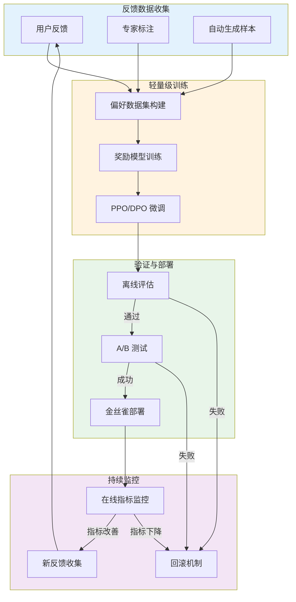

### Prompt 自动调优

```java
package com.enterprise.agent.feedback.optimization;

import org.springframework.stereotype.Component;
import org.springframework.ai.openai.OpenAiChatClient;
import lombok.RequiredArgsConstructor;
import lombok.extern.slf4j.Slf4j;

import java.util.List;
import java.util.Map;
import java.util.Comparator;

/**
 * 基于 A/B 测试的 Prompt 自动调优器
 */
@Slf4j
@Component
@RequiredArgsConstructor
public class PromptAutoTuner {
    
    private final OpenAiChatClient chatClient;
    private final PromptTemplateRepository templateRepository;
    private final ABTestManager abTestManager;
    private final FeedbackAnalyzer feedbackAnalyzer;
    
    /**
     * 生成 Prompt 变体
     * 
     * @param baseTemplate 基础模板
     * @return 候选变体列表
     */
    public List<PromptVariant> generateVariants(PromptTemplate baseTemplate) {
        List<PromptVariant> variants = new java.util.ArrayList<>();
        
        // 变体1：增加示例
        variants.add(PromptVariant.builder()
            .templateId(baseTemplate.getId())
            .variantName("more_examples")
            .prompt(enhanceWithExamples(baseTemplate.getPrompt()))
            .build());
        
        // 变体2：调整指令语气
        variants.add(PromptVariant.builder()
            .templateId(baseTemplate.getId())
            .variantName("formal_tone")
            .prompt(adjustTone(baseTemplate.getPrompt(), Tone.FORMAL))
            .build());
        
        // 变体3：增加约束
        variants.add(PromptVariant.builder()
            .templateId(baseTemplate.getId())
            .variantName("with_constraints")
            .prompt(addConstraints(baseTemplate.getPrompt()))
            .build());
        
        // 变体4：简化指令
        variants.add(PromptVariant.builder()
            .templateId(baseTemplate.getId())
            .variantName("simplified")
            .prompt(simplifyInstructions(baseTemplate.getPrompt()))
            .build());
        
        return variants;
    }
    
    /**
     * 启动 A/B 测试
     * 
     * @param variants 候选变体
     * @return A/B 测试配置
     */
    public ABTestConfig launchABTest(List<PromptVariant> variants) {
        // 创建 A/B 测试
        String testId = abTestManager.createTest(
            "prompt_optimization_" + System.currentTimeMillis(),
            variants.size(),
            Duration.ofDays(7) // 运行7天
        );
        
        // 配置流量分配
        for (int i = 0; i < variants.size(); i++) {
            abTestManager.configureVariant(testId, i, variants.get(i), 100.0 / variants.size());
        }
        
        return ABTestConfig.builder()
            .testId(testId)
            .variants(variants)
            .duration(Duration.ofDays(7))
            .successMetric("satisfaction_rate")
            .minSampleSize(1000)
            .build();
    }
    
    /**
     * 分析 A/B 测试结果并选择获胜者
     * 
     * @param testId A/B 测试ID
     * @return 获胜变体
     */
    public PromptVariant selectWinner(String testId) {
        Map<Integer, VariantMetrics> metrics = abTestManager.getTestMetrics(testId);
        
        // 找出指标最好的变体
        return metrics.entrySet().stream()
            .max(Comparator.comparing(e -> e.getValue().getSuccessRate()))
            .map(entry -> {
                PromptVariant winner = abTestManager.getVariant(testId, entry.getKey());
                
                // 检查统计显著性
                if (isStatisticallySignificant(metrics, entry.getKey())) {
                    log.info("Statistically significant winner found: variant={}", winner.getVariantName());
                    
                    // 自动部署获胜变体
                    deployWinner(winner);
                } else {
                    log.warn("No statistically significant winner found");
                }
                
                return winner;
            })
            .orElse(null);
    }
    
    /**
     * 自动优化迭代
     * 
     * @param templateId 模板ID
     * @param iterations 迭代次数
     */
    public void autoOptimize(String templateId, int iterations) {
        PromptTemplate current = templateRepository.findById(templateId).orElseThrow();
        
        for (int i = 0; i < iterations; i++) {
            log.info("Starting optimization iteration {}/{}", i + 1, iterations);
            
            // 生成变体
            List<PromptVariant> variants = generateVariants(current);
            
            // 启动 A/B 测试
            ABTestConfig test = launchABTest(variants);
            
            // 等待测试完成
            waitForTestCompletion(test.getTestId());
            
            // 选择获胜者
            PromptVariant winner = selectWinner(test.getTestId());
            
            if (winner != null && isImprovement(winner, current)) {
                log.info("Improvement found: {}", winner.getVariantName());
                current = updateFromVariant(current, winner);
            } else {
                log.info("No improvement found in iteration {}", i + 1);
            }
        }
    }
    
    private String enhanceWithExamples(String basePrompt) {
        return basePrompt + "\n\nExample outputs:\n1. [Good example]\n2. [Another good example]";
    }
    
    private String adjustTone(String basePrompt, Tone tone) {
        String prefix = switch (tone) {
            case FORMAL -> "Please provide a formal and professional response to the following request:\n\n";
            case CASUAL -> "Here's a request - feel free to respond in a conversational tone:\n\n";
            case TECHNICAL -> "Provide a technically accurate and detailed response:\n\n";
        };
        return prefix + basePrompt;
    }
    
    private String addConstraints(String basePrompt) {
        return basePrompt + "\n\nConstraints:\n- Keep response under 500 words\n- Use clear structure with headings\n- Avoid jargon when possible";
    }
    
    private String simplifyInstructions(String basePrompt) {
        // 使用 LLM 简化指令
        return chatClient.call(
            "Simplify and clarify the following instructions while preserving all essential information:\n\n" + basePrompt
        );
    }
    
    private boolean isStatisticallySignificant(Map<Integer, VariantMetrics> metrics, int winnerId) {
        VariantMetrics winner = metrics.get(winnerId);
        
        // 检查样本量
        if (winner.getSampleSize() < 1000) {
            return false;
        }
        
        // 简单的统计显著性检查（实际应使用 t-test）
        double improvementRate = winner.getImprovementOverBaseline();
        return improvementRate > 0.05 && winner.getPValue() < 0.05;
    }
    
    private void deployWinner(PromptVariant winner) {
        templateRepository.updatePrompt(winner.getTemplateId(), winner.getPrompt());
        log.info("Deployed winning variant: {}", winner.getVariantName());
    }
    
    private boolean isImprovement(PromptVariant variant, PromptTemplate baseline) {
        // 获取两个版本的指标比较
        double variantScore = feedbackAnalyzer.getAverageScore(variant.getVariantName());
        double baselineScore = feedbackAnalyzer.getAverageScore(baseline.getName());
        
        return variantScore > baselineScore * 1.05; // 至少提升 5%
    }
    
    private PromptTemplate updateFromVariant(PromptTemplate template, PromptVariant variant) {
        template.setPrompt(variant.getPrompt());
        template.setVersion(template.getVersion() + 1);
        templateRepository.save(template);
        return template;
    }
}
```

### 偏好学习实现

```java
package com.enterprise.agent.feedback.optimization;

import org.springframework.stereotype.Component;
import lombok.RequiredArgsConstructor;
import lombok.extern.slf4j.Slf4j;
import org.springframework.ai.openai.OpenAiChatClient;

import java.util.*;
import java.util.stream.Collectors;

/**
 * 基于用户偏好的学习系统
 * 
 * 从用户选择中学习偏好模式，用于生成更符合用户期望的输出
 */
@Slf4j
@Component
@RequiredArgsConstructor
public class PreferenceLearning {
    
    private final OpenAiChatClient chatClient;
    private final PreferenceRepository preferenceRepository;
    private final FeedbackCollector feedbackCollector;
    
    /**
     * 记录用户偏好
     * 
     * @param userId 用户ID
     * @param options 选项列表
     * @param selectedIndex 选择的索引
     * @param context 上下文信息
     */
    public void recordPreference(String userId, List<String> options, int selectedIndex, Map<String, Object> context) {
        UserPreference preference = UserPreference.builder()
            .userId(userId)
            .timestamp(LocalDateTime.now())
            .selectedOption(options.get(selectedIndex))
            .rejectedOptions(new ArrayList<>(options))
            .rejectedOptions.remove(selectedIndex)
            .context(context)
            .features(extractFeatures(options.get(selectedIndex), context))
            .build();
        
        preferenceRepository.save(preference);
        
        // 触发模型更新（异步）
        triggerModelUpdate(userId);
    }
    
    /**
     * 提取偏好特征
     * 
     * @param selectedOption 选择的选项
     * @param context 上下文
     * @return 特征向量
     */
    private Map<String, Double> extractFeatures(String selectedOption, Map<String, Object> context) {
        Map<String, Double> features = new HashMap<>();
        
        // 长度偏好
        features.put("length", (double) selectedOption.length());
        
        // 结构偏好（是否使用列表）
        features.put("uses_list", selectedOption.contains("•") || selectedOption.contains("-") ? 1.0 : 0.0);
        
        // 语气偏好
        features.put("formal_tone", calculateFormality(selectedOption));
        
        // 详细程度
        features.put("detail_level", calculateDetailLevel(selectedOption));
        
        // 技术深度
        features.put("technical_depth", calculateTechnicalDepth(selectedOption));
        
        return features;
    }
    
    /**
     * 获取用户偏好模型
     * 
     * @param userId 用户ID
     * @return 偏好模型
     */
    public UserPreferenceModel getUserPreferenceModel(String userId) {
        List<UserPreference> preferences = preferenceRepository.findByUserId(userId);
        
        if (preferences.isEmpty()) {
            return UserPreferenceModel.defaultModel();
        }
        
        // 聚合特征
        Map<String, Double> aggregatedFeatures = preferences.stream()
            .flatMap(p -> p.getFeatures().entrySet().stream())
            .collect(Collectors.groupingBy(
                Map.Entry::getKey,
                Collectors.averagingDouble(Map.Entry::getValue)
            ));
        
        return UserPreferenceModel.builder()
            .userId(userId)
            .preferences(aggregatedFeatures)
            .confidence(calculateConfidence(preferences.size()))
            .lastUpdated(LocalDateTime.now())
            .build();
    }
    
    /**
     * 应用用户偏好生成个性化输出
     * 
     * @param userId 用户ID
     * @param basePrompt 基础提示
     * @return 个性化输出
     */
    public String generatePersonalized(String userId, String basePrompt) {
        UserPreferenceModel model = getUserPreferenceModel(userId);
        
        // 构建偏好指令
        String preferenceInstructions = buildPreferenceInstructions(model);
        
        // 组合提示
        String personalizedPrompt = String.format(
            "%s\n\nUser preferences:\n%s\n\nOriginal request:\n%s",
            preferenceInstructions,
            formatPreferences(model.getPreferences()),
            basePrompt
        );
        
        return chatClient.call(personalizedPrompt);
    }
    
    private String buildPreferenceInstructions(UserPreferenceModel model) {
        StringBuilder instructions = new StringBuilder();
        
        Map<String, Double> prefs = model.getPreferences();
        
        // 长度偏好
        if (prefs.containsKey("length")) {
            double avgLength = prefs.get("length");
            if (avgLength < 200) {
                instructions.append("Keep responses concise and to the point (under 200 words). ");
            } else if (avgLength > 500) {
                instructions.append("Provide detailed and comprehensive responses. ");
            }
        }
        
        // 结构偏好
        if (prefs.containsKey("uses_list")) {
            double useList = prefs.get("uses_list");
            if (useList > 0.7) {
                instructions.append("Use bullet points or numbered lists for clarity. ");
            }
        }
        
        // 语气偏好
        if (prefs.containsKey("formal_tone")) {
            double formality = prefs.get("formal_tone");
            if (formality > 0.7) {
                instructions.append("Maintain a formal and professional tone. ");
            } else if (formality < 0.3) {
                instructions.append("Use a conversational and friendly tone. ");
            }
        }
        
        return instructions.toString();
    }
    
    private String formatPreferences(Map<String, Double> preferences) {
        return preferences.entrySet().stream()
            .map(e -> String.format("- %s: %.2f", e.getKey(), e.getValue()))
            .collect(Collectors.joining("\n"));
    }
    
    private void triggerModelUpdate(String userId) {
        // 异步更新用户偏好模型
        CompletableFuture.runAsync(() -> {
            UserPreferenceModel model = getUserPreferenceModel(userId);
            // 可以在这里触发增量训练或模型更新
            log.debug("Updated preference model for user: {}", userId);
        });
    }
    
    private double calculateFormality(String text) {
        // 简单实现：基于特定词汇的使用
        String formalWords = "therefore,consequently,furthermore,moreover,hence";
        String informalWords = "yeah,okay,cool,awesome,gotcha";
        
        long formalCount = Arrays.stream(formalWords.split(","))
            .filter(word -> text.toLowerCase().contains(word))
            .count();
        
        long informalCount = Arrays.stream(informalWords.split(","))
            .filter(word -> text.toLowerCase().contains(word))
            .count();
        
        return (double) formalCount / (formalCount + informalCount + 1);
    }
    
    private double calculateDetailLevel(String text) {
        // 基于句子数量和长度
        String[] sentences = text.split("[.!?]");
        return sentences.length > 0 ? (double) text.length() / sentences.length : 0;
    }
    
    private double calculateTechnicalDepth(String text) {
        // 基于技术词汇的使用
        String technicalWords = "algorithm,implementation,architecture,optimization,performance";
        return Arrays.stream(technicalWords.split(","))
            .filter(word -> text.toLowerCase().contains(word))
            .count();
    }
    
    private double calculateConfidence(int sampleSize) {
        // 样本量越大，置信度越高
        return Math.min(1.0, sampleSize / 100.0);
    }
}
```

## A/B 测试框架设计

### A/B 测试流程

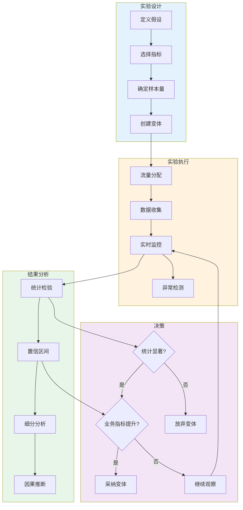

### A/B 测试管理器实现

```java
package com.enterprise.agent.feedback.abtest;

import org.springframework.stereotype.Component;
import org.springframework.data.redis.core.RedisTemplate;
import lombok.RequiredArgsConstructor;
import lombok.extern.slf4j.Slf4j;
import com.fasterxml.jackson.databind.ObjectMapper;

import java.time.Duration;
import java.time.LocalDateTime;
import java.util.*;
import java.util.concurrent.ThreadLocalRandom;

/**
 * Agent 系统 A/B 测试管理器
 * 
 * 功能：
 * 1. 创建和管理 A/B 测试
 * 2. 流量分配和一致性保证
 * 3. 实时数据收集和监控
 * 4. 统计显著性检验
 * 5. 自动化决策支持
 */
@Slf4j
@Component
@RequiredArgsConstructor
public class ABTestManager {
    
    private final RedisTemplate<String, Object> redisTemplate;
    private final ObjectMapper objectMapper;
    private final StatisticalAnalyzer statisticalAnalyzer;
    
    private static final String TEST_PREFIX = "abtest:";
    private static final String ALLOCATION_PREFIX = "abtest:allocation:";
    
    /**
     * 创建新的 A/B 测试
     * 
     * @param testName 测试名称
     * @param variantCount 变体数量
     * @param duration 测试时长
     * @return 测试ID
     */
    public String createTest(String testName, int variantCount, Duration duration) {
        String testId = generateTestId();
        
        ABTest test = ABTest.builder()
            .testId(testId)
            .testName(testName)
            .status(TestStatus.CREATED)
            .variantCount(variantCount)
            .startTime(LocalDateTime.now())
            .endTime(LocalDateTime.now().plus(duration))
            .variants(new ArrayList<>())
            .allocations(new HashMap<>())
            .metrics(new HashMap<>())
            .build();
        
        // 持久化测试配置
        String testKey = TEST_PREFIX + testId;
        redisTemplate.opsForValue().set(testKey, test, duration.plus(Duration.ofDays(7)));
        
        log.info("Created A/B test: id={}, name={}, variants={}", testId, testName, variantCount);
        
        return testId;
    }
    
    /**
     * 配置测试变体
     * 
     * @param testId 测试ID
     * @param variantIndex 变体索引
     * @param variant 变体配置
     * @param trafficPercentage 流量百分比
     */
    public void configureVariant(String testId, int variantIndex, Object variant, double trafficPercentage) {
        ABTest test = getTest(testId);
        
        TestVariant testVariant = TestVariant.builder()
            .variantIndex(variantIndex)
            .variantConfig(variant)
            .trafficPercentage(trafficPercentage)
            .metrics(new VariantMetrics())
            .build();
        
        test.getVariants().add(testVariant);
        
        // 更新测试配置
        saveTest(testId, test);
        
        log.info("Configured variant: test={}, variant={}, traffic={}%", 
            testId, variantIndex, trafficPercentage);
    }
    
    /**
     * 启动测试
     * 
     * @param testId 测试ID
     */
    public void startTest(String testId) {
        ABTest test = getTest(testId);
        test.setStatus(TestStatus.RUNNING);
        saveTest(testId, test);
        
        log.info("Started A/B test: {}", testId);
    }
    
    /**
     * 分配用户到变体（一致性保证）
     * 
     * @param testId 测试ID
     * @param userId 用户ID
     * @return 变体索引
     */
    public int assignVariant(String testId, String userId) {
        // 先检查是否已经分配过
        String allocationKey = ALLOCATION_PREFIX + testId + ":" + userId;
        Integer cachedAssignment = (Integer) redisTemplate.opsForValue().get(allocationKey);
        
        if (cachedAssignment != null) {
            return cachedAssignment;
        }
        
        // 获取测试配置
        ABTest test = getTest(testId);
        if (test.getStatus() != TestStatus.RUNNING) {
            throw new IllegalStateException("Test is not running");
        }
        
        // 基于用户ID的哈希进行一致性分配
        int variantIndex = consistentAssign(userId, test.getVariants());
        
        // 缓存分配结果
        redisTemplate.opsForValue().set(allocationKey, variantIndex, Duration.ofDays(30));
        
        return variantIndex;
    }
    
    /**
     * 记录变体指标
     * 
     * @param testId 测试ID
     * @param variantIndex 变体索引
     * @param userId 用户ID
     * @param metricName 指标名称
     * @param value 指标值
     */
    public void recordMetric(String testId, int variantIndex, String userId, String metricName, double value) {
        ABTest test = getTest(testId);
        
        // 找到对应的变体
        TestVariant variant = test.getVariants().stream()
            .filter(v -> v.getVariantIndex() == variantIndex)
            .findFirst()
            .orElseThrow(() -> new IllegalArgumentException("Invalid variant index"));
        
        // 记录指标
        variant.getMetrics().addMetric(metricName, value);
        
        // 更新测试配置
        saveTest(testId, test);
        
        log.debug("Recorded metric: test={}, variant={}, metric={}, value={}", 
            testId, variantIndex, metricName, value);
    }
    
    /**
     * 获取测试结果
     * 
     * @param testId 测试ID
     * @return 测试结果
     */
    public ABTestResult getTestResult(String testId) {
        ABTest test = getTest(testId);
        
        // 计算每个变体的统计指标
        Map<Integer, VariantStatistics> statistics = new HashMap<>();
        
        for (TestVariant variant : test.getVariants()) {
            VariantMetrics metrics = variant.getMetrics();
            
            VariantStats stats = statisticalAnalyzer.calculateStatistics(
                metrics.getPrimaryMetrics(),
                test.getControlMetrics()
            );
            
            statistics.put(variant.getVariantIndex(), 
                VariantStatistics.builder()
                    .variantIndex(variant.getVariantIndex())
                    .sampleSize(metrics.getSampleSize())
                    .mean(metrics.getMean())
                    .confidenceInterval(stats.getConfidenceInterval())
                    .pValue(stats.getPValue())
                    .statisticallySignificant(stats.isStatisticallySignificant())
                    .improvementPercentage(stats.getImprovementPercentage())
                    .build());
        }
        
        return ABTestResult.builder()
            .testId(testId)
            .testName(test.getTestName())
            .status(test.getStatus())
            .statistics(statistics)
            .winner(identifyWinner(statistics))
            .recommendation(generateRecommendation(statistics))
            .build();
    }
    
    /**
     * 结束测试并应用获胜变体
     * 
     * @param testId 测试ID
     */
    public void concludeTest(String testId) {
        ABTest test = getTest(testId);
        test.setStatus(TestStatus.COMPLETED);
        saveTest(testId, test);
        
        // 获取结果
        ABTestResult result = getTestResult(testId);
        
        if (result.getWinner().isPresent()) {
            int winnerIndex = result.getWinner().get();
            
            log.info("Test concluded: winner={}, recommendation={}", 
                winnerIndex, result.getRecommendation());
            
            // 这里可以触发自动部署获胜变体的逻辑
        } else {
            log.info("Test concluded: no clear winner found");
        }
    }
    
    private String generateTestId() {
        return "test-" + UUID.randomUUID().toString().substring(0, 8);
    }
    
    private int consistentAssign(String userId, List<TestVariant> variants) {
        // 计算用户ID的哈希值
        int hash = userId.hashCode();
        int positiveHash = Math.abs(hash);
        
        // 基于流量百分比进行分配
        double cumulative = 0.0;
        int assignedVariant = 0;
        
        for (TestVariant variant : variants) {
            cumulative += variant.getTrafficPercentage();
            if ((positiveHash % 100) < cumulative * 100) {
                assignedVariant = variant.getVariantIndex();
                break;
            }
        }
        
        return assignedVariant;
    }
    
    private Optional<Integer> identifyWinner(Map<Integer, VariantStatistics> statistics) {
        return statistics.entrySet().stream()
            .filter(e -> e.getValue().isStatisticallySignificant())
            .filter(e -> e.getValue().getImprovementPercentage() > 5) // 至少提升5%
            .max(Comparator.comparing(e -> e.getValue().getImprovementPercentage()))
            .map(Map.Entry::getKey);
    }
    
    private String generateRecommendation(Map<Integer, VariantStatistics> statistics) {
        Optional<Integer> winner = identifyWinner(statistics);
        
        if (winner.isPresent()) {
            return String.format("Adopt variant %d with %.1f%% improvement (p=%.3f)", 
                winner.get(),
                statistics.get(winner.get()).getImprovementPercentage(),
                statistics.get(winner.get()).getPValue());
        } else {
            return "No statistically significant winner found. Continue test or reconsider hypothesis.";
        }
    }
}
```

## 用户体验指标体系

### 核心 UX 指标

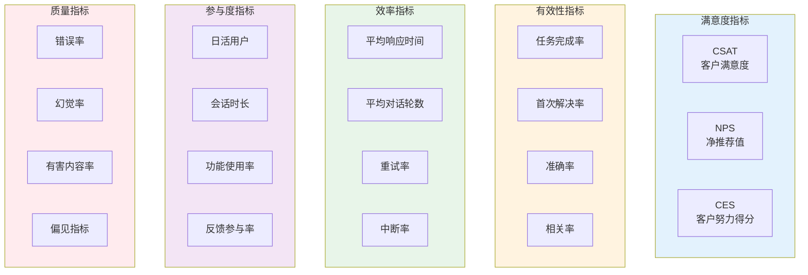

### CSAT（客户满意度）计算

```java
package com.enterprise.agent.metrics;

import org.springframework.stereotype.Component;
import lombok.RequiredArgsConstructor;
import lombok.extern.slf4j.Slf4j;

import java.time.LocalDateTime;
import java.util.List;

/**
 * 客户满意度（CSAT）计算器
 */
@Slf4j
@Component
@RequiredArgsConstructor
public class CSATCalculator {
    
    private final FeedbackRepository feedbackRepository;
    
    /**
     * 计算指定时间范围的 CSAT 分数
     * 
     * CSAT = (5星数量 × 5 + 4星数量 × 4 + ... + 1星数量 × 1) / 总评价数
     * 
     * @param startTime 开始时间
     * @param endTime 结束时间
     * @return CSAT 结果
     */
    public CSATResult calculateCSAT(LocalDateTime startTime, LocalDateTime endTime) {
        List<Feedback> feedbacks = feedbackRepository.findByTimestampBetween(startTime, endTime);
        
        if (feedbacks.isEmpty()) {
            return CSATResult.empty();
        }
        
        // 按星级统计
        int[] ratingCounts = new int[5]; // 1-5星
        double sum = 0;
        
        for (Feedback feedback : feedbacks) {
            if (feedback.getRating() >= 1 && feedback.getRating() <= 5) {
                ratingCounts[feedback.getRating() - 1]++;
                sum += feedback.getRating();
            }
        }
        
        double csatScore = sum / feedbacks.size();
        
        return CSATResult.builder()
            .score(csatScore)
            .totalResponses(feedbacks.size())
            .ratingDistribution(ratingCounts)
            .timeRange(startTime + " to " + endTime)
            .benchmark(getIndustryBenchmark())
            .build();
    }
    
    /**
     * 按维度计算 CSAT
     * 
     * @param dimension 维度名称（agent_type/user_group/etc）
     * @param startTime 开始时间
     * @param endTime 结束时间
     * @return 分维度 CSAT 结果
     */
    public DimensionCSATResult calculateCSATByDimension(
            String dimension,
            LocalDateTime startTime,
            LocalDateTime endTime) {
        
        List<Feedback> feedbacks = feedbackRepository.findByTimestampBetween(startTime, endTime);
        
        // 按维度分组
        Map<String, List<Feedback>> grouped = feedbacks.stream()
            .collect(Collectors.groupingBy(f -> getDimensionValue(f, dimension)));
        
        Map<String, CSATResult> csatByDimension = new HashMap<>();
        
        for (Map.Entry<String, List<Feedback>> entry : grouped.entrySet()) {
            String dimValue = entry.getKey();
            List<Feedback> dimFeedbacks = entry.getValue();
            
            double sum = dimFeedbacks.stream()
                .mapToInt(Feedback::getRating)
                .average()
                .orElse(0.0);
            
            csatByDimension.put(dimValue, CSATResult.builder()
                .score(sum)
                .totalResponses(dimFeedbacks.size())
                .build());
        }
        
        return DimensionCSATResult.builder()
            .dimension(dimension)
            .startTime(startTime)
            .endTime(endTime)
            .results(csatByDimension)
            .topPerformers(getTopPerformers(csatByDimension))
            .underPerformers(getUnderPerformers(csatByDimension))
            .build();
    }
    
    private double getIndustryBenchmark() {
        // 返回行业基准值
        return 4.2; // 示例值
    }
    
    private String getDimensionValue(Feedback feedback, String dimension) {
        return switch (dimension) {
            case "agent_type" -> feedback.getAgentType();
            case "user_group" -> feedback.getUserGroup();
            case "prompt_template" -> feedback.getPromptTemplate();
            default -> "unknown";
        };
    }
}
```

### NPS（净推荐值）计算

```java
package com.enterprise.agent.metrics;

import org.springframework.stereotype.Component;
import lombok.RequiredArgsConstructor;
import lombok.extern.slf4j.Slf4j;

import java.time.LocalDateTime;
import java.util.List;

/**
 * 净推荐值（NPS）计算器
 * 
 * NPS = 推荐者% - 贬损者%
 * - 推荐者：打分 9-10
 * - 被动者：打分 7-8
 * - 贬损者：打分 0-6
 */
@Slf4j
@Component
@RequiredArgsConstructor
public class NPSCalculator {
    
    private final FeedbackRepository feedbackRepository;
    
    /**
     * 计算 NPS 分数
     * 
     * @param startTime 开始时间
     * @param endTime 结束时间
     * @return NPS 结果
     */
    public NPSResult calculateNPS(LocalDateTime startTime, LocalDateTime endTime) {
        List<Feedback> feedbacks = feedbackRepository.findByTimestampBetween(startTime, endTime);
        
        if (feedbacks.isEmpty()) {
            return NPSResult.empty();
        }
        
        long promoters = 0;   // 9-10分
        long passives = 0;    // 7-8分
        long detractors = 0;   // 0-6分
        
        for (Feedback feedback : feedbacks) {
            int rating = feedback.getRating();
            if (rating >= 9) {
                promoters++;
            } else if (rating >= 7) {
                passives++;
            } else {
                detractors++;
            }
        }
        
        long total = feedbacks.size();
        
        double promotersPercentage = (double) promoters / total * 100;
        double detractorsPercentage = (double) detractors / total * 100;
        int npsScore = (int) (promotersPercentage - detractorsPercentage);
        
        return NPSResult.builder()
            .score(npsScore)
            .promotersPercentage(promotersPercentage)
            .passivesPercentage((double) passives / total * 100)
            .detractorsPercentage(detractorsPercentage)
            .totalResponses(total)
            .category(categorizeNPS(npsScore))
            .timeRange(startTime + " to " + endTime)
            .trend(calculateTrend(startTime, endTime))
            .build();
    }
    
    private NPSCategory categorizeNPS(int score) {
        if (score >= 70) return NPSCategory.EXCELLENT;
        if (score >= 50) return NPSCategory.GOOD;
        if (score >= 30) return NPSCategory.FAIR;
        if (score >= 0) return NPSCategory.POOR;
        return NPSCategory.VERY_POOR;
    }
    
    private Trend calculateTrend(LocalDateTime startTime, LocalDateTime endTime) {
        // 计算与上期相比的趋势
        Duration period = Duration.between(startTime, endTime);
        LocalDateTime prevStartTime = startTime.minus(period);
        LocalDateTime prevEndTime = startTime;
        
        NPSResult previous = calculateNPS(prevStartTime, prevEndTime);
        
        int currentScore = calculateNPS(startTime, endTime).getScore();
        int change = currentScore - previous.getScore();
        
        if (change > 5) return Trend.IMPROVING;
        if (change < -5) return Trend.DECLINING;
        return Trend.STABLE;
    }
}
```

### 任务完成率追踪

```java
package com.enterprise.agent.metrics;

import org.springframework.stereotype.Component;
import lombok.RequiredArgsConstructor;
import lombok.extern.slf4j.Slf4j;
import org.springframework.data.redis.core.RedisTemplate;

import java.time.Duration;
import java.time.LocalDateTime;
import java.util.*;
import java.util.concurrent.TimeUnit;

/**
 * 任务完成率追踪器
 * 
 * 追踪 Agent 是否成功完成用户任务
 */
@Slf4j
@Component
@RequiredArgsConstructor
public class TaskCompletionTracker {
    
    private final RedisTemplate<String, Object> redisTemplate;
    
    private static final String TASK_PREFIX = "task:";
    private static final Duration TASK_TIMEOUT = Duration.ofHours(24);
    
    /**
     * 记录任务开始
     * 
     * @param sessionId 会话ID
     * @param taskId 任务ID
     * @param taskType 任务类型
     * @param taskDescription 任务描述
     */
    public void recordTaskStart(String sessionId, String taskId, String taskType, String taskDescription) {
        TaskInfo task = TaskInfo.builder()
            .taskId(taskId)
            .sessionId(sessionId)
            .taskType(taskType)
            .taskDescription(taskDescription)
            .startTime(LocalDateTime.now())
            .status(TaskStatus.IN_PROGRESS)
            .build();
        
        String key = TASK_PREFIX + taskId;
        redisTemplate.opsForValue().set(key, task, TASK_TIMEOUT);
        
        log.debug("Recorded task start: id={}, type={}", taskId, taskType);
    }
    
    /**
     * 记录任务完成
     * 
     * @param taskId 任务ID
     * @param completionState 完成状态
     * @param outputQuality 输出质量评分
     */
    public void recordTaskCompletion(String taskId, CompletionState completionState, Double outputQuality) {
        String key = TASK_PREFIX + taskId;
        TaskInfo task = (TaskInfo) redisTemplate.opsForValue().get(key);
        
        if (task != null) {
            task.setEndTime(LocalDateTime.now());
            task.setStatus(TaskStatus.COMPLETED);
            task.setCompletionState(completionState);
            task.setOutputQuality(outputQuality);
            
            redisTemplate.opsForValue().set(key, task, TASK_TIMEOUT);
            
            log.info("Recorded task completion: id={}, state={}, quality={}", 
                taskId, completionState, outputQuality);
        }
    }
    
    /**
     * 记录任务失败
     * 
     * @param taskId 任务ID
     * @param failureReason 失败原因
     * @param errorDetails 错误详情
     */
    public void recordTaskFailure(String taskId, String failureReason, String errorDetails) {
        String key = TASK_PREFIX + taskId;
        TaskInfo task = (TaskInfo) redisTemplate.opsForValue().get(key);
        
        if (task != null) {
            task.setEndTime(LocalDateTime.now());
            task.setStatus(TaskStatus.FAILED);
            task.setFailureReason(failureReason);
            task.setErrorDetails(errorDetails);
            
            redisTemplate.opsForValue().set(key, task, TASK_TIMEOUT);
            
            log.warn("Recorded task failure: id={}, reason={}", taskId, failureReason);
        }
    }
    
    /**
     * 计算任务完成率
     * 
     * @param startTime 开始时间
     * @param endTime 结束时间
     * @param taskType 任务类型（可选）
     * @return 完成率统计
     */
    public CompletionRateStats calculateCompletionRate(
            LocalDateTime startTime, 
            LocalDateTime endTime, 
            String taskType) {
        
        // 扫描任务数据
        Set<String> keys = redisTemplate.keys(TASK_PREFIX + "*");
        
        int totalTasks = 0;
        int completedTasks = 0;
        int failedTasks = 0;
        int timeoutTasks = 0;
        
        Map<String, Integer> completionByType = new HashMap<>();
        Map<String, Integer> failureReasons = new HashMap<>();
        
        for (String key : keys) {
            TaskInfo task = (TaskInfo) redisTemplate.opsForValue().get(key);
            
            // 时间范围过滤
            if (task.getStartTime().isBefore(startTime) || task.getStartTime().isAfter(endTime)) {
                continue;
            }
            
            // 任务类型过滤
            if (taskType != null && !task.getTaskType().equals(taskType)) {
                continue;
            }
            
            totalTasks++;
            
            switch (task.getStatus()) {
                case COMPLETED:
                    completedTasks++;
                    completionByType.merge(task.getTaskType(), 1, Integer::sum);
                    break;
                case FAILED:
                    failedTasks++;
                    failureReasons.merge(task.getFailureReason(), 1, Integer::sum);
                    break;
                case IN_PROGRESS:
                    // 检查是否超时
                    if (task.getStartTime().plus(TASK_TIMEOUT).isBefore(LocalDateTime.now())) {
                        timeoutTasks++;
                    }
                    break;
            }
        }
        
        double completionRate = totalTasks > 0 ? (double) completedTasks / totalTasks : 0;
        
        return CompletionRateStats.builder()
            .timeRange(startTime + " to " + endTime)
            .taskType(taskType)
            .totalTasks(totalTasks)
            .completedTasks(completedTasks)
            .failedTasks(failedTasks)
            .timeoutTasks(timeoutTasks)
            .completionRate(completionRate)
            .completionByType(completionByType)
            .topFailureReasons(getTopReasons(failureReasons, 5))
            .build();
    }
}
```

## 检查清单

### 反馈采集设计检查清单

- [ ] **显式反馈机制**
  - [ ] 每轮对话后提供点赞/点踩选项
  - [ ] 重要任务完成后提供结构化评分
  - [ ] 提供文本反馈输入框
  - [ ] 支持对话修正和编辑功能

- [ ] **隐式反馈收集**
  - [ ] 追踪停留时间
  - [ ] 监控重试和中断行为
  - [ ] 记录复制和修改操作
  - [ ] 分析后续对话模式

- [ ] **反馈 UI 设计**
  - [ ] 反馈按钮位置一致
  - [ ] 移动端友好设计
  - [ ] 提供反馈激励说明
  - [ ] 支持随时修改反馈

- [ ] **数据质量保障**
  - [ ] 实施频率限制
  - [ ] 检测和过滤机器人反馈
  - [ ] 验证反馈数据完整性
  - [ ] 建立标注一致性检查

### HITL 实施检查清单

- [ ] **审核工作流**
  - [ ] 定义审核触发条件
  - [ ] 设置不同级别审核队列
  - [ ] 建立审核 SLA
  - [ ] 配置审核权限

- [ ] **审核界面**
  - [ ] 显示原始输入和 Agent 输出
  - [ ] 提供辅助信息（置信度、风险评分）
  - [ ] 支持快速审核操作
  - [ ] 提供问题分类和标签

- [ ] **标注系统**
  - [ ] 编写标注指南
  - [ ] 培训标注人员
  - [ ] 建立黄金数据集
  - [ ] 监控标注一致性

- [ ] **审核效率**
  - [ ] 优先级队列管理
  - [ ] 批量审核支持
  - [ ] 快捷键和自动化工具
  - [ ] 审核绩效统计

### 优化闭环检查清单

- [ ] **自动优化机制**
  - [ ] Prompt 自动调优
  - [ ] 知识库自动更新
  - [ ] 配置参数优化
  - [ ] 模型版本切换

- [ ] **A/B 测试框架**
  - [ ] 测试假设定义
  - [ ] 样本量计算
  - [ ] 流量分配策略
  - [ ] 统计显著性检验

- [ ] **RLHF-Lite**
  - [ ] 偏好数据收集
  - [ ] 奖励模型训练
  - [ ] 离线评估验证
  - [ ] 金丝雀部署

- [ ] **偏好学习**
  - [ ] 用户偏好建模
  - [ ] 特征工程
  - [ ] 个性化生成
  - [ ] 隐私保护

### 指标监控检查清单

- [ ] **核心指标定义**
  - [ ] CSAT 计算
  - [ ] NPS 追踪
  - [ ] 任务完成率
  - [ ] 首次解决率

- [ ] **细分分析**
  - [ ] 按 Agent 类型分析
  - [ ] 按用户群组分析
  - [ ] 按时间趋势分析
  - [ ] 按任务类型分析

- [ ] **监控和告警**
  - [ ] 实时指标监控
  - [ ] 异常检测和告警
  - [ ] 趋势分析
  - [ ] 自动报告生成

- [ ] **业务对齐**
  - [ ] 指标与业务目标对齐
  - [ ] ROI 分析
  - [ ] 基准对比
  - [ ] 定期 review

---

**文档版本**: v1.0  
**最后更新**: 2024-08-09  
**维护者**: 企业级 Agent 架构师团队
