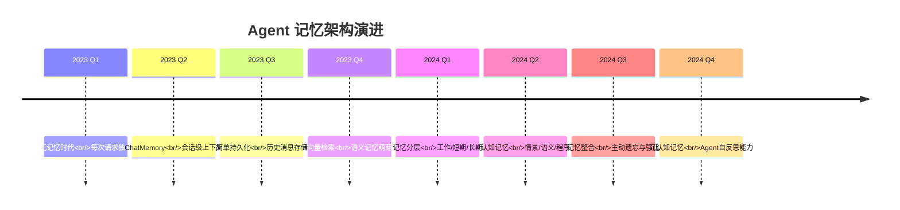
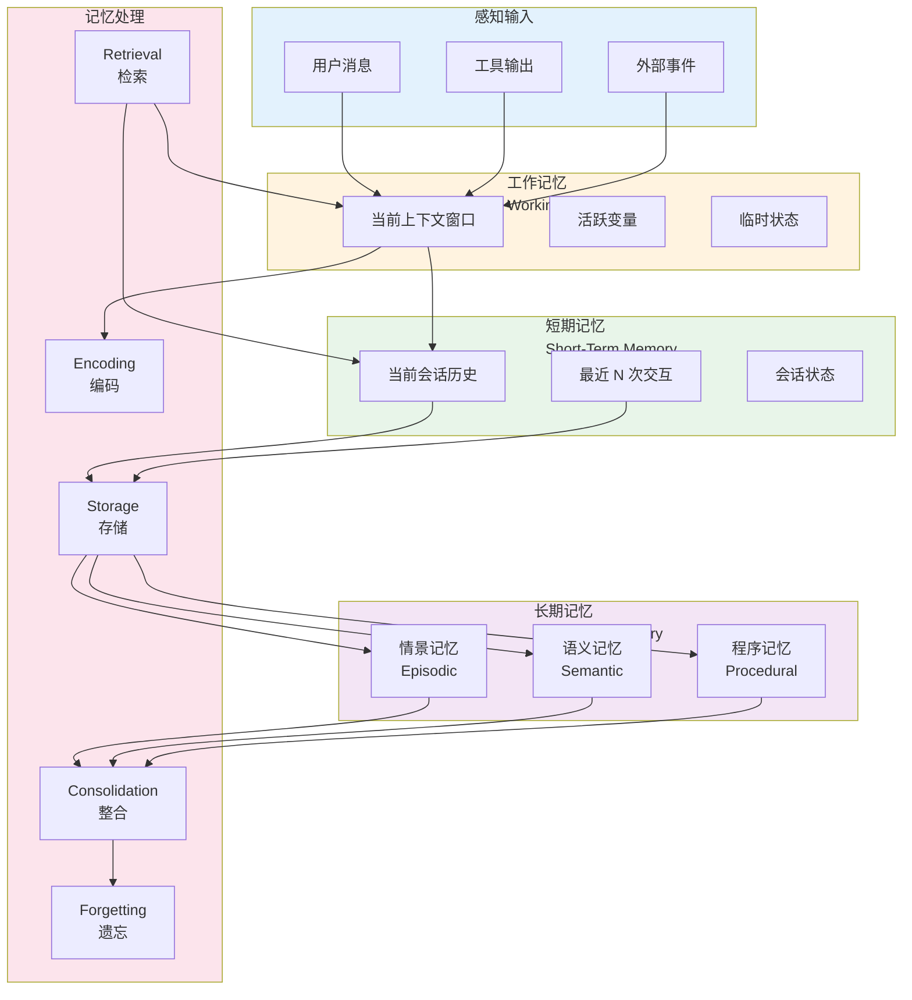
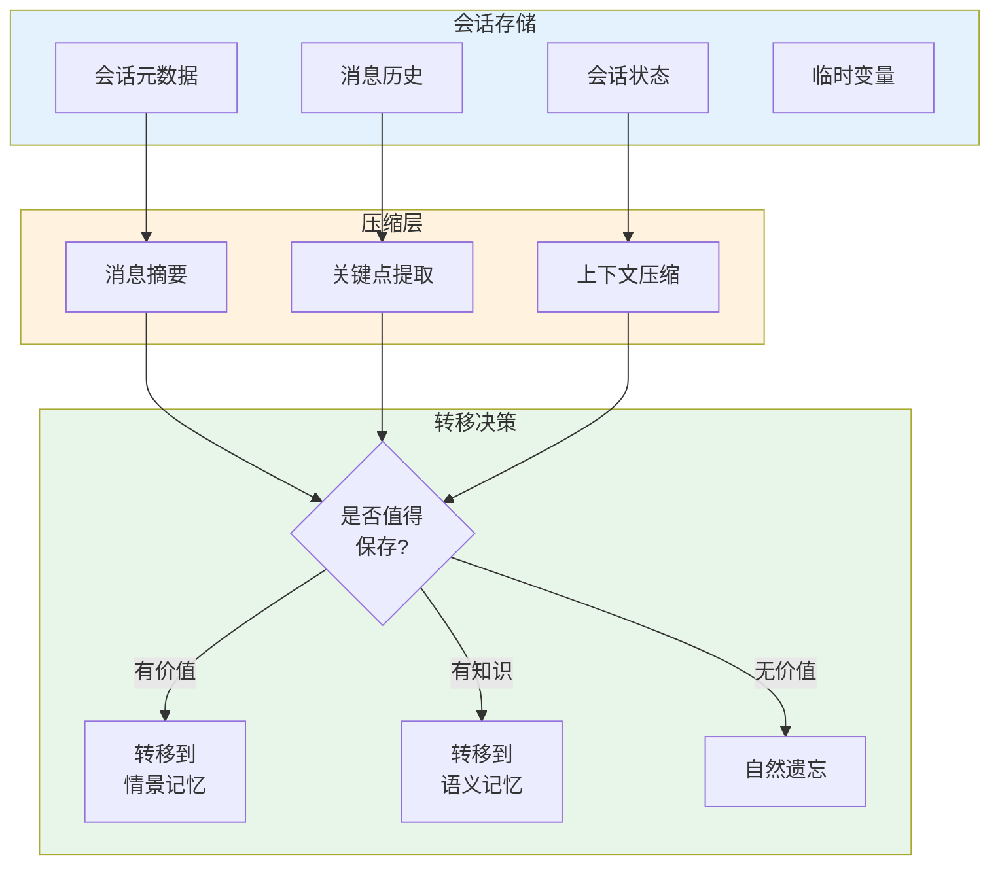
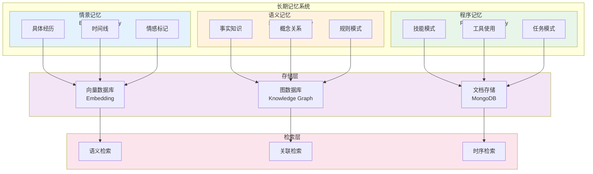
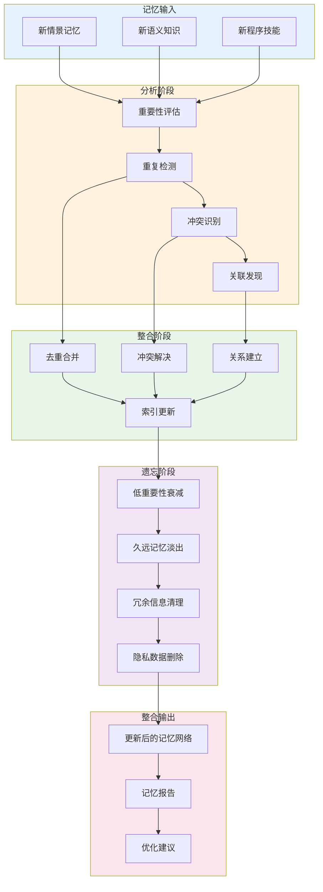
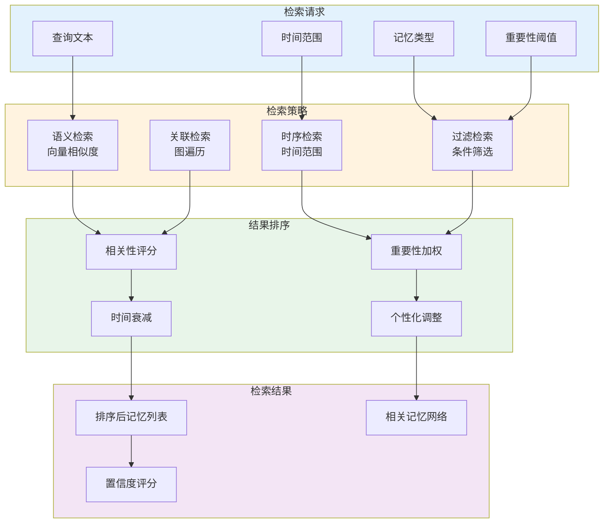

# 40 · Agent 记忆架构深度设计（Memory Architecture）

## 概述

在人类智能中，记忆是认知的核心能力。同样的，Agent 系统的记忆能力决定了其智能的上限。从简单的 ChatSessionContext 到复杂的认知记忆架构，Agent 记忆系统的演进是迈向真正智能 Agent 的关键路径。

本文将深入探讨企业级 Agent 的记忆架构设计，从记忆的三层模型（工作记忆、短期记忆、长期记忆），到不同类型的记忆存储与检索策略，再到记忆整合（consolidation）过程，为构建具有持续学习能力的 Agent 提供完整的架构指南和实现方案。

## 从 ChatMemory 到认知记忆架构

### 记忆架构演进历程



### 为什么需要复杂的记忆架构

| 记忆能力 | 业务价值 | 技术挑战 |
|---------|---------|---------|
| 跨会话记忆 | 个性化体验、长期关系维护 | 存储成本、检索效率、隐私合规 |
| 情景记忆 | 从经验中学习、避免重复错误 | 记忆质量评估、重要性排序 |
| 语义记忆 | 知识积累、专业能力提升 | 知识图谱构建、冲突解决 |
| 程序记忆 | 技能固化、效率提升 | 模式识别、迁移学习 |
| 记忆整合 | 认知负荷优化、智能遗忘 | 整合策略、遗忘机制 |

### 记忆架构的核心设计原则

1. **分层原则**：不同时效和访问频率的数据使用不同的存储策略
2. **渐进遗忘**：非重要记忆自然衰减，释放存储空间
3. **检索效率**：平衡召回率和精确率，支持多维度检索
4. **隐私保护**：用户可控的记忆访问和删除机制
5. **可解释性**：记忆来源和重要性的透明展示

## 记忆三层模型

### 完整记忆架构



### 工作记忆（Working Memory）

工作记忆是 Agent 的"当前意识"，包含正在处理的信息和活跃状态。

**特性**：
- 容量有限：受限于 LLM 上下文窗口
- 快速访问：毫秒级读取
- 易失性：会话结束即清除
- 主动管理：信息密度优化

**工作记忆管理策略**：

```java
package com.enterprise.agent.memory.working;

import org.springframework.stereotype.Component;
import lombok.RequiredArgsConstructor;
import lombok.extern.slf4j.Slf4j;
import org.springframework.ai.chat.messages.Message;

import java.util.ArrayList;
import java.util.List;
import java.util.PriorityQueue;

/**
 * 工作记忆管理器
 * 
 * 功能：
 * 1. 上下文窗口管理
 * 2. 信息密度优化
 * 3. 重要性排序
 * 4. Token 预算分配
 */
@Slf4j
@Component
@RequiredArgsConstructor
public class WorkingMemoryManager {
    
    private final TokenCounter tokenCounter;
    private final MessageCompressor messageCompressor;
    
    private final int maxTokens = 8000; // 假设模型上下文窗口
    private final int reserveTokens = 1000; // 预留 space
    
    /**
     * 优化工作记忆内容
     * 
     * @param messages 当前消息列表
     * @param currentInput 当前输入
     * @return 优化后的消息列表
     */
    public List<Message> optimizeWorkingMemory(List<Message> messages, Message currentInput) {
        // 计算当前 token 使用
        int currentTokens = tokenCounter.count(messages);
        int inputTokens = tokenCounter.count(List.of(currentInput));
        
        // 检查是否需要压缩
        int availableTokens = maxTokens - reserveTokens - inputTokens;
        
        if (currentTokens <= availableTokens) {
            // 无需压缩
            List<Message> result = new ArrayList<>(messages);
            result.add(currentInput);
            return result;
        }
        
        // 需要压缩，使用优先队列按重要性排序
        PriorityQueue<MessageWithImportance> queue = new PriorityQueue<>(
            messages.size(),
            (a, b) -> Double.compare(b.importance, a.importance)
        );
        
        for (Message message : messages) {
            double importance = calculateImportance(message, messages);
            queue.add(new MessageWithImportance(message, importance));
        }
        
        // 选择最重要的消息直到达到 token 预算
        List<Message> optimized = new ArrayList<>();
        int usedTokens = 0;
        
        while (!queue.isEmpty() && usedTokens < availableTokens) {
            MessageWithImportance mwi = queue.poll();
            int messageTokens = tokenCounter.count(List.of(mwi.message));
            
            if (usedTokens + messageTokens <= availableTokens) {
                optimized.add(mwi.message);
                usedTokens += messageTokens;
            } else {
                // 尝试压缩消息
                Message compressed = messageCompressor.compress(mwi.message);
                int compressedTokens = tokenCounter.count(List.of(compressed));
                
                if (usedTokens + compressedTokens <= availableTokens) {
                    optimized.add(compressed);
                    usedTokens += compressedTokens;
                }
            }
        }
        
        // 添加当前输入
        optimized.add(currentInput);
        
        log.info("Optimized working memory: {} -> {} messages, {} -> {} tokens",
            messages.size(), optimized.size(), currentTokens, usedTokens + inputTokens);
        
        return optimized;
    }
    
    /**
     * 计算消息重要性
     * 
     * 考虑因素：
     * - 时间衰减（越近越重要）
     * - 内容类型（系统指令、用户输入、工具输出）
     * - 信息密度（关键信息密度）
     * - 引用关系（被其他消息引用的重要性）
     */
    private double calculateImportance(Message message, List<Message> context) {
        double score = 0.0;
        
        // 1. 基础分数基于消息类型
        score += switch (message.getMessageType()) {
            case SYSTEM -> 1.0;      // 系统指令最重要
            case USER -> 0.8;        // 用户输入很重要
            case ASSISTANT -> 0.5;   // Assistant 输出次之
            case TOOL -> 0.3;        // 工具输出可以压缩
        };
        
        // 2. 时间衰减
        // 在实际实现中，消息应该有时间戳
        // int index = context.indexOf(message);
        // double timeDecay = 1.0 / (1.0 + 0.1 * (context.size() - index));
        // score *= timeDecay;
        
        // 3. 信息密度
        double infoDensity = calculateInformationDensity(message);
        score *= (0.5 + infoDensity); // 调整为 0.5-1.5 倍
        
        return score;
    }
    
    private double calculateInformationDensity(Message message) {
        String content = message.getContent();
        
        // 简单实现：基于关键词密度
        String[] keywords = {"error", "important", "critical", "注意", "重要", "错误"};
        int keywordCount = 0;
        
        for (String keyword : keywords) {
            if (content.toLowerCase().contains(keyword)) {
                keywordCount++;
            }
        }
        
        return Math.min(1.0, keywordCount * 0.2);
    }
    
    private record MessageWithImportance(Message message, double importance) {}
}
```

### 短期记忆（Short-Term Memory）

短期记忆存储当前会话的信息，会话结束后可选择转移到长期记忆或遗忘。

**特性**：
- 会话级别：一次对话周期
- 容量较大：不受上下文窗口限制
- 中等访问速度：秒级检索
- 可持久化：Redis 或数据库存储

**短期记忆架构**：



**短期记忆实现**：

```java
package com.enterprise.agent.memory.shortterm;

import org.springframework.stereotype.Component;
import org.springframework.data.redis.core.RedisTemplate;
import lombok.RequiredArgsConstructor;
import lombok.extern.slf4j.Slf4j;
import com.fasterxml.jackson.databind.ObjectMapper;

import java.time.Duration;
import java.time.LocalDateTime;
import java.util.List;

/**
 * 短期记忆存储
 * 
 * 特性：
 * 1. Redis 存储，快速访问
 * 2. 会话 TTL 自动过期
 * 3. 自动压缩和摘要
 * 4. 转移到长期记忆的决策
 */
@Slf4j
@Component
@RequiredArgsConstructor
public class ShortTermMemoryStore {
    
    private final RedisTemplate<String, Object> redisTemplate;
    private final ObjectMapper objectMapper;
    private final MemoryTransferDecider transferDecider;
    
    private static final String SESSION_PREFIX = "stm:session:";
    private static final String MESSAGES_PREFIX = "stm:messages:";
    private static final String STATE_PREFIX = "stm:state:";
    private static final Duration DEFAULT_TTL = Duration.ofHours(24);
    
    /**
     * 保存会话消息
     * 
     * @param sessionId 会话ID
     * @param messages 消息列表
     */
    public void saveMessages(String sessionId, List<ChatMessage> messages) {
        String key = MESSAGES_PREFIX + sessionId;
        redisTemplate.opsForValue().set(key, messages, DEFAULT_TTL);
        
        log.debug("Saved {} messages for session: {}", messages.size(), sessionId);
    }
    
    /**
     * 获取会话消息
     * 
     * @param sessionId 会话ID
     * @return 消息列表
     */
    public List<ChatMessage> getMessages(String sessionId) {
        String key = MESSAGES_PREFIX + sessionId;
        Object messages = redisTemplate.opsForValue().get(key);
        
        return messages != null ? (List<ChatMessage>) messages : List.of();
    }
    
    /**
     * 保存会话状态
     * 
     * @param sessionId 会话ID
     * @param state 状态对象
     */
    public void saveState(String sessionId, SessionState state) {
        String key = STATE_PREFIX + sessionId;
        redisTemplate.opsForValue().set(key, state, DEFAULT_TTL);
    }
    
    /**
     * 获取会话状态
     * 
     * @param sessionId 会话ID
     * @return 状态对象
     */
    public SessionState getState(String sessionId) {
        String key = STATE_PREFIX + sessionId;
        Object state = redisTemplate.opsForValue().get(key);
        
        return state != null ? (SessionState) state : SessionState.empty();
    }
    
    /**
     * 会话结束时的处理
     * 
     * @param sessionId 会话ID
     */
    public void onSessionEnd(String sessionId) {
        List<ChatMessage> messages = getMessages(sessionId);
        SessionState state = getState(sessionId);
        
        // 创建会话摘要
        SessionSummary summary = createSessionSummary(messages, state);
        
        // 决定是否转移到长期记忆
        TransferDecision decision = transferDecider.decide(summary);
        
        switch (decision.getAction()) {
            case TRANSFER_TO_EPISODIC:
                transferToEpisodicMemory(summary);
                break;
            case TRANSFER_TO_SEMANTIC:
                transferToSemanticMemory(summary);
                break;
            case FORGET:
                // 让 Redis 自动过期
                log.info("Session marked for forgetting: {}", sessionId);
                break;
        }
    }
    
    private SessionSummary createSessionSummary(List<ChatMessage> messages, SessionState state) {
        return SessionSummary.builder()
            .sessionId(sessionId)
            .startTime(state.getStartTime())
            .endTime(LocalDateTime.now())
            .messageCount(messages.size())
            .messages(messages)
            .keyTopics(extractKeyTopics(messages))
            .userGoals(state.getUserGoals())
            .completionState(state.getCompletionState())
            .build();
    }
    
    private List<String> extractKeyTopics(List<ChatMessage> messages) {
        // 实现主题提取逻辑
        // 可以使用 LLM 或传统 NLP 方法
        return List.of("topic1", "topic2"); // 示例
    }
    
    private void transferToEpisodicMemory(SessionSummary summary) {
        // 实现转移到情景记忆的逻辑
        log.info("Transferring to episodic memory: {}", summary.getSessionId());
    }
    
    private void transferToSemanticMemory(SessionSummary summary) {
        // 实现转移到语义记忆的逻辑
        log.info("Transferring to semantic memory: {}", summary.getSessionId());
    }
}
```

### 长期记忆（Long-Term Memory）

长期记忆是 Agent 的"知识和经验库"，跨会话持久化。

**三层长期记忆架构**：



## 情景记忆（Episodic Memory）

情景记忆存储 Agent 的具体经历和事件。

### 情景记忆数据模型

```java
package com.enterprise.agent.memory.episodic;

import lombok.Builder;
import lombok.Data;
import java.time.LocalDateTime;
import java.util.List;
import java.util.Map;

/**
 * 情景记忆条目
 * 
 * 记录一次具体的交互或事件
 */
@Data
@Builder
public class EpisodicMemory {
    /**
     * 记忆唯一ID
     */
    private String memoryId;
    
    /**
     * 记忆时间
     */
    private LocalDateTime timestamp;
    
    /**
     * 关联的用户
     */
    private String userId;
    
    /**
     * 记忆类型
     */
    private EpisodicType type;
    
    /**
     * 事件描述
     */
    private String description;
    
    /**
     * 关键内容
     */
    private String content;
    
    /**
     * 上下文信息
     */
    private Map<String, Object> context;
    
    /**
     * 情感标记
     */
    private Sentiment sentiment;
    
    /**
     * 重要性评分（0-1）
     */
    private double importance;
    
    /**
     * 访问频率（用于遗忘机制）
     */
    private int accessCount;
    
    /**
     * 最后访问时间
     */
    private LocalDateTime lastAccessTime;
    
    /**
     * 关联的其他记忆
     */
    private List<String> relatedMemories;
    
    /**
     * 向量嵌入（用于语义检索）
     */
    private float[] embedding;
}

/**
 * 情景记忆类型
 */
public enum EpisodicType {
    /** 用户交互 */
    USER_INTERACTION,
    /** 工具使用 */
    TOOL_USAGE,
    /** 错误经历 */
    ERROR_EXPERIENCE,
    /** 成功案例 */
    SUCCESS_CASE,
    /** 重要决策 */
    IMPORTANT_DECISION,
    /** 学到的教训 */
    LESSON_LEARNED
}

/**
 * 情感标记
 */
public enum Sentiment {
    VERY_NEGATIVE(-0.9),
    NEGATIVE(-0.5),
    NEUTRAL(0.0),
    POSITIVE(0.5),
    VERY_POSITIVE(0.9);
    
    private final double score;
    
    Sentiment(double score) {
        this.score = score;
    }
    
    public double getScore() {
        return score;
    }
}
```

### 情景记忆存储实现

```java
package com.enterprise.agent.memory.episodic;

import org.springframework.stereotype.Component;
import org.springframework.data.mongodb.core.MongoTemplate;
import org.springframework.data.mongodb.core.query.Criteria;
import org.springframework.data.mongodb.core.query.Query;
import lombok.RequiredArgsConstructor;
import lombok.extern.slf4j.Slf4j;
import org.springframework.ai.embedding.EmbeddingClient;

import java.time.LocalDateTime;
import java.util.List;
import java.util.UUID;

/**
 * 情景记忆存储
 * 
 * 使用 MongoDB 存储情景记忆，支持向量检索
 */
@Slf4j
@Component
@RequiredArgsConstructor
public class EpisodicMemoryStore {
    
    private final MongoTemplate mongoTemplate;
    private final EmbeddingClient embeddingClient;
    
    /**
     * 保存情景记忆
     * 
     * @param memory 记忆内容
     * @return 记忆ID
     */
    public String save(EpisodicMemory memory) {
        // 生成ID
        if (memory.getMemoryId() == null) {
            memory.setMemoryId("episodic-" + UUID.randomUUID());
        }
        
        // 设置时间戳
        if (memory.getTimestamp() == null) {
            memory.setTimestamp(LocalDateTime.now());
        }
        
        // 计算嵌入
        if (memory.getEmbedding() == null) {
            String textForEmbedding = memory.getDescription() + " " + memory.getContent();
            memory.setEmbedding(embeddingClient.embed(textForEmbedding));
        }
        
        // 保存到数据库
        mongoTemplate.save(memory);
        
        log.info("Saved episodic memory: id={}, type={}, importance={}", 
            memory.getMemoryId(), memory.getType(), memory.getImportance());
        
        return memory.getMemoryId();
    }
    
    /**
     * 按时间范围检索记忆
     * 
     * @param startTime 开始时间
     * @param endTime 结束时间
     * @return 记忆列表
     */
    public List<EpisodicMemory> findByTimeRange(LocalDateTime startTime, LocalDateTime endTime) {
        Query query = Query.query(
            Criteria.where("timestamp").gte(startTime).lte(endTime)
        );
        return mongoTemplate.find(query, EpisodicMemory.class);
    }
    
    /**
     * 按类型检索记忆
     * 
     * @param type 记忆类型
     * @return 记忆列表
     */
    public List<EpisodicMemory> findByType(EpisodicType type) {
        Query query = Query.query(Criteria.where("type").is(type));
        return mongoTemplate.find(query, EpisodicMemory.class);
    }
    
    /**
     * 按重要性检索记忆
     * 
     * @param minImportance 最小重要性
     * @param limit 限制数量
     * @return 记忆列表
     */
    public List<EpisodicMemory> findByImportance(double minImportance, int limit) {
        Query query = Query.query(
            Criteria.where("importance").gte(minImportance)
        ).limit(limit);
        
        return mongoTemplate.find(query, EpisodicMemory.class);
    }
    
    /**
     * 语义检索记忆
     * 
     * @param queryText 查询文本
     * @param limit 返回数量
     * @return 相似记忆列表
     */
    public List<EpisodicMemory> semanticSearch(String queryText, int limit) {
        // 计算查询向量
        float[] queryEmbedding = embeddingClient.embed(queryText);
        
        // 执行向量检索
        // 这里需要根据使用的向量数据库实现
        // 以下是伪代码
        
        List<EpisodicMemory> allMemories = mongoTemplate.findAll(EpisodicMemory.class);
        
        // 计算相似度并排序
        return allMemories.stream()
            .filter(m -> m.getEmbedding() != null)
            .map(m -> new SimilarityResult(m, cosineSimilarity(queryEmbedding, m.getEmbedding())))
            .filter(s -> s.similarity > 0.7) // 相似度阈值
            .sorted((a, b) -> Double.compare(b.similarity, a.similarity))
            .limit(limit)
            .map(SimilarityResult::memory)
            .toList();
    }
    
    /**
     * 更新访问统计（用于遗忘机制）
     * 
     * @param memoryId 记忆ID
     */
    public void recordAccess(String memoryId) {
        EpisodicMemory memory = mongoTemplate.findById(memoryId, EpisodicMemory.class);
        if (memory != null) {
            memory.setAccessCount(memory.getAccessCount() + 1);
            memory.setLastAccessTime(LocalDateTime.now());
            mongoTemplate.save(memory);
        }
    }
    
    private double cosineSimilarity(float[] a, float[] b) {
        if (a.length != b.length) {
            throw new IllegalArgumentException("Vectors must have same length");
        }
        
        double dotProduct = 0.0;
        double normA = 0.0;
        double normB = 0.0;
        
        for (int i = 0; i < a.length; i++) {
            dotProduct += a[i] * b[i];
            normA += a[i] * a[i];
            normB += b[i] * b[i];
        }
        
        return dotProduct / (Math.sqrt(normA) * Math.sqrt(normB));
    }
    
    private record SimilarityResult(EpisodicMemory memory, double similarity) {}
}
```

## 语义记忆（Semantic Memory）

语义记忆存储结构化的知识和概念。

### 语义记忆数据模型

```java
package com.enterprise.agent.memory.semantic;

import lombok.Builder;
import lombok.Data;
import java.util.List;
import java.util.Map;

/**
 * 语义记忆 - 知识节点
 */
@Data
@Builder
public class SemanticMemory {
    /**
     * 知识节点ID
     */
    private String nodeId;
    
    /**
     * 知识类型
     */
    private KnowledgeType type;
    
    /**
     * 概念名称
     */
    private String concept;
    
    /**
     * 定义/描述
     */
    private String definition;
    
    /**
     * 属性
     */
    private Map<String, Object> attributes;
    
    /**
     * 关系（边）
     */
    private List<KnowledgeRelation> relations;
    
    /**
     * 证据来源
     */
    private List<String> sources;
    
    /**
     * 置信度
     */
    private double confidence;
    
    /**
     * 创建时间
     */
    private long createdAt;
    
    /**
     * 最后更新时间
     */
    private long updatedAt;
}

/**
 * 知识类型
 */
public enum KnowledgeType {
    /** 概念 */
    CONCEPT,
    /** 事实 */
    FACT,
    /** 规则 */
    RULE,
    /** 模式 */
    PATTERN
}

/**
 * 知识关系
 */
@Data
@Builder
public class KnowledgeRelation {
    /**
     * 关系类型
     */
    private RelationType type;
    
    /**
     * 目标节点
     */
    private String targetNode;
    
    /**
     * 关系权重
     */
    private double weight;
    
    /**
     * 关系属性
     */
    private Map<String, Object> attributes;
}

/**
 * 关系类型
 */
public enum RelationType {
    /** 是一种 */
    IS_A,
    /** 包含 */
    CONTAINS,
    /** 导致 */
    CAUSES,
    ** 相似于 */
    SIMILAR_TO,
    /** 依赖 */
    DEPENDS_ON,
    ** 先于 */
    PRECEDES,
    ** 位于 */
    LOCATED_AT
}
```

### 语义记忆的图存储

```java
package com.enterprise.agent.memory.semantic;

import org.springframework.stereotype.Component;
import lombok.RequiredArgsConstructor;
import lombok.extern.slf4j.Slf4j;
import org.springframework.data.neo4j.core.Neo4jClient;

import java.util.List;
import java.util.Map;

/**
 * 语义记忆图数据库存储
 * 
 * 使用 Neo4j 存储知识图谱
 */
@Slf4j
@Component
@RequiredArgsConstructor
public class SemanticMemoryGraphStore {
    
    private final Neo4jClient neo4jClient;
    
    /**
     * 创建知识节点
     * 
     * @param memory 知识节点
     * @return 节点ID
     */
    public String createNode(SemanticMemory memory) {
        String cypher = """
            CREATE (n:Knowledge {
                id: $id,
                type: $type,
                concept: $concept,
                definition: $definition,
                confidence: $confidence,
                createdAt: $createdAt
            })
            RETURN n.id as id
            """;
        
        Map<String, Object> parameters = Map.of(
            "id", memory.getNodeId(),
            "type", memory.getType().name(),
            "concept", memory.getConcept(),
            "definition", memory.getDefinition(),
            "confidence", memory.getConfidence(),
            "createdAt", System.currentTimeMillis()
        );
        
        String nodeId = neo4jClient.query(cypher)
            .bindAll(parameters)
            .fetch()
            .one()
            .map(row -> (String) row.get("id"))
            .orElse(null);
        
        log.info("Created semantic node: id={}, concept={}", nodeId, memory.getConcept());
        
        return nodeId;
    }
    
    /**
     * 创建关系
     * 
     * @param sourceId 源节点ID
     * @param relation 关系
     */
    public void createRelation(String sourceId, KnowledgeRelation relation) {
        String cypher = String.format("""
            MATCH (source:Knowledge {id: $sourceId})
            MATCH (target:Knowledge {id: $targetId})
            CREATE (source)-[r:%s {
                weight: $weight,
                attributes: $attributes
            }]->(target)
            """, relation.getType().name());
        
        Map<String, Object> parameters = Map.of(
            "sourceId", sourceId,
            "targetId", relation.getTargetNode(),
            "weight", relation.getWeight(),
            "attributes", relation.getAttributes()
        );
        
        neo4jClient.query(cypher)
            .bindAll(parameters)
            .run();
        
        log.debug("Created relation: {} -> {}", sourceId, relation.getTargetNode());
    }
    
    /**
     * 查询相关概念
     * 
     * @param conceptId 概念ID
     * @param relationTypes 关系类型过滤
     * @param maxDepth 最大深度
     * @return 相关概念列表
     */
    public List<SemanticMemory> findRelatedConcepts(
            String conceptId,
            List<RelationType> relationTypes,
            int maxDepth) {
        
        String typeFilter = relationTypes.isEmpty() ? "" : 
            ":T" + String.join("|T", relationTypes.stream().map(Enum::name).toList());
        
        String cypher = String.format("""
            MATCH (source:Knowledge {id: $conceptId})
            MATCH (source)-[%s*1..%d]-(related:Knowledge)
            RETURN related
            LIMIT 100
            """, typeFilter, maxDepth);
        
        return neo4jClient.query(cypher)
            .bind("conceptId").to(conceptId)
            .fetch()
            .all()
            .stream()
            .map(row -> mapToSemanticMemory(row.get("related")))
            .toList();
    }
    
    /**
     * 推理查询
     * 
     * @param startNode 起始节点
     * @param endNode 目标节点
     * @return 路径
     */
    public List<List<String>> findPath(String startNode, String endNode) {
        String cypher = """
            MATCH path = shortestPath(
                (start:Knowledge {id: $startId})-[*]-(end:Knowledge {id: $endId})
            )
            RETURN [node in nodes(path) | node.concept] as path
            """;
        
        return neo4jClient.query(cypher)
            .bind("startId").to(startNode)
            .bind("endId").to(endNode)
            .fetch()
            .all()
            .stream()
            .map(row -> (List<String>) row.get("path"))
            .toList();
    }
    
    private SemanticMemory mapToSemanticMemory(Object node) {
        // 实现 Neo4j 节点到 SemanticMemory 的映射
        // ...
        return null;
    }
}
```

## 程序记忆（Procedural Memory）

程序记忆存储技能和工具使用模式。

### 程序记忆数据模型

```java
package com.enterprise.agent.memory.procedural;

import lombok.Builder;
import lombok.Data;
import java.util.List;
import java.util.Map;

/**
 * 程序记忆 - 技能模式
 */
@Data
@Builder
public class ProceduralMemory {
    /**
     * 技能ID
     */
    private String skillId;
    
    /**
     * 技能名称
     */
    private String skillName;
    
    /**
     * 技能类型
     */
    private SkillType type;
    
    /**
     * 触发条件
     */
    private List<TriggerCondition> triggers;
    
    /**
     * 执行步骤
     */
    private List<ExecutionStep> steps;
    
    /**
     * 成功率
     */
    private double successRate;
    
    /**
     * 使用次数
     */
    private int usageCount;
    
    /**
     * 平均执行时间（毫秒）
     */
    private long avgExecutionTime;
    
    /**
     * 相关工具
     */
    private List<String> relatedTools;
    
    /**
     * 成功案例
     */
    private List<String> successCases;
    
    /**
     * 失败案例
     */
    private List<String> failureCases;
}

/**
 * 技能类型
 */
public enum SkillType {
    /** 工具使用模式 */
    TOOL_USAGE_PATTERN,
    /** 问题解决流程 */
    PROBLEM_SOLVING,
    /** 代码生成模式 */
    CODE_GENERATION,
    /** 数据处理流程 */
    DATA_PROCESSING,
    /** 交互模式 */
    INTERACTION_PATTERN
}

/**
 * 触发条件
 */
@Data
@Builder
public class TriggerCondition {
    /**
     * 条件类型
     */
    private ConditionType type;
    
    /**
     * 条件参数
     */
    private Map<String, Object> parameters;
    
    /**
     * 置信度阈值
     */
    private double confidenceThreshold;
}

/**
 * 执行步骤
 */
@Data
@Builder
public class ExecutionStep {
    /**
     * 步骤类型
     */
    private StepType type;
    
    /**
     * 动作描述
     */
    private String action;
    
    /**
     * 参数
     */
    private Map<String, Object> parameters;
    
    /**
     * 预期结果
     */
    private String expectedOutcome;
    
    /**
     * 失败处理
     */
    private String failureHandling;
}
```

### 程序记忆学习

```java
package com.enterprise.agent.memory.procedural;

import org.springframework.stereotype.Component;
import lombok.RequiredArgsConstructor;
import lombok.extern.slf4j.Slf4j;
import org.springframework.data.mongodb.core.MongoTemplate;

import java.util.List;
import java.util.Map;

/**
 * 程序记忆学习器
 * 
 * 从 Agent 的成功执行中学习技能模式
 */
@Slf4j
@Component
@RequiredArgsConstructor
public class ProceduralMemoryLearner {
    
    private final MongoTemplate mongoTemplate;
    private final PatternExtractor patternExtractor;
    
    /**
     * 从执行记录中学习
     * 
     * @param executionRecord 执行记录
     */
    public void learnFromExecution(ExecutionRecord executionRecord) {
        // 只从成功的执行中学习
        if (!executionRecord.isSuccess()) {
            return;
        }
        
        // 提取模式
        List<ProceduralMemory> patterns = patternExtractor.extractPatterns(executionRecord);
        
        for (ProceduralMemory pattern : patterns) {
            // 检查是否已存在相似技能
            ProceduralMemory existing = findSimilarSkill(pattern);
            
            if (existing != null) {
                // 更新现有技能
                updateSkill(existing, executionRecord);
            } else {
                // 创建新技能
                createSkill(pattern);
            }
        }
    }
    
    /**
     * 查找相似技能
     * 
     * @param pattern 模式
     * @return 相似技能
     */
    private ProceduralMemory findSimilarSkill(ProceduralMemory pattern) {
        // 基于技能名称和类型查找
        // 在实际实现中可以使用更复杂的相似度计算
        
        List<ProceduralMemory> candidates = mongoTemplate.find(
            Query.query(
                Criteria.where("skillName").is(pattern.getSkillName())
                .and("type").is(pattern.getType())
            ),
            ProceduralMemory.class
        );
        
        return candidates.isEmpty() ? null : candidates.get(0);
    }
    
    /**
     * 更新技能
     * 
     * @param skill 现有技能
     * @param record 执行记录
     */
    private void updateSkill(ProceduralMemory skill, ExecutionRecord record) {
        // 更新成功率
        double newSuccessRate = (skill.getSuccessRate() * skill.getUsageCount() + 1) / 
            (skill.getUsageCount() + 1);
        skill.setSuccessRate(newSuccessRate);
        
        // 更新使用次数
        skill.setUsageCount(skill.getUsageCount() + 1);
        
        // 更新平均执行时间
        long newAvgTime = (skill.getAvgExecutionTime() * skill.getUsageCount() + 
            record.getExecutionTime()) / (skill.getUsageCount() + 1);
        skill.setAvgExecutionTime(newAvgTime);
        
        // 添加成功案例
        skill.getSuccessCases().add(record.getRecordId());
        
        mongoTemplate.save(skill);
        
        log.debug("Updated skill: id={}, successRate={}", skill.getSkillId(), newSuccessRate);
    }
    
    /**
     * 创建新技能
     * 
     * @param pattern 模式
     */
    private void createSkill(ProceduralMemory pattern) {
        mongoTemplate.save(pattern);
        log.info("Created new skill: name={}, type={}", pattern.getSkillName(), pattern.getType());
    }
}
```

## 记忆整合（Consolidation）

### 整合过程流程



### 记忆整合器实现

```java
package com.enterprise.agent.memory.consolidation;

import org.springframework.stereotype.Component;
import lombok.RequiredArgsConstructor;
import lombok.extern.slf4j.Slf4j;
import org.springframework.scheduling.annotation.Scheduled;

import java.time.LocalDateTime;
import java.util.List;

/**
 * 记忆整合器
 * 
 * 定期执行记忆整合：
 * 1. 合并重复记忆
 * 2. 解决冲突
 * 3. 建立关联
 * 4. 应用遗忘机制
 */
@Slf4j
@Component
@RequiredArgsConstructor
public class MemoryConsolidator {
    
    private final EpisodicMemoryStore episodicStore;
    private final SemanticMemoryGraphStore semanticStore;
    private final ProceduralMemoryStore proceduralStore;
    private final MemoryAnalyzer memoryAnalyzer;
    private final ForgettingMechanism forgettingMechanism;
    
    /**
     * 每日执行整合任务
     */
    @Scheduled(cron = "0 0 2 * * ?") // 每天凌晨2点
    public void dailyConsolidation() {
        log.info("Starting daily memory consolidation");
        
        LocalDateTime startTime = LocalDateTime.now().minusDays(1);
        
        // 1. 分析新记忆
        MemoryAnalysisReport analysis = memoryAnalyzer.analyzeNewMemories(startTime);
        
        // 2. 整合情景记忆
        consolidateEpisodicMemories(analysis.getNewEpisodicMemories());
        
        // 3. 整合语义记忆
        consolidateSemanticMemories(analysis.getNewSemanticMemories());
        
        // 4. 整合程序记忆
        consolidateProceduralMemories(analysis.getNewProceduralMemories());
        
        // 5. 应用遗忘机制
        applyForgettingMechanism();
        
        // 6. 生成报告
        ConsolidationReport report = generateReport();
        
        log.info("Memory consolidation completed: {}", report);
    }
    
    private void consolidateEpisodicMemories(List<EpisodicMemory> memories) {
        for (EpisodicMemory memory : memories) {
            // 检查是否有相似记忆
            List<EpisodicMemory> similarMemories = episodicStore.semanticSearch(
                memory.getDescription(), 5
            );
            
            if (!similarMemories.isEmpty()) {
                // 合并相似记忆
                mergeMemories(memory, similarMemories.get(0));
            } else {
                // 检查是否可以提取语义知识
                extractSemanticKnowledge(memory);
            }
        }
    }
    
    private void mergeMemories(EpisodicMemory newMemory, EpisodicMemory existingMemory) {
        // 合并策略：保留重要性更高的，或合并内容
        if (newMemory.getImportance() > existingMemory.getImportance()) {
            // 用新记忆替换旧记忆
            episodicStore.save(newMemory);
            log.debug("Replaced memory with higher importance: {}", newMemory.getMemoryId());
        } else {
            // 增强现有记忆的访问计数
            episodicStore.recordAccess(existingMemory.getMemoryId());
            log.debug("Enhanced existing memory: {}", existingMemory.getMemoryId());
        }
    }
    
    private void extractSemanticKnowledge(EpisodicMemory memory) {
        // 使用 LLM 从情景记忆中提取语义知识
        // 这是从具体经验到抽象知识的转化过程
        
        String extractionPrompt = String.format(
            "从以下事件中提取可复用的知识或规则：\n\n事件：%s\n\n提取的知识：",
            memory.getDescription()
        );
        
        // 调用 LLM 提取知识
        // String extractedKnowledge = llmClient.call(extractionPrompt);
        
        // 创建语义记忆节点
        // semanticStore.createNode(buildSemanticMemory(extractedKnowledge));
        
        log.debug("Extracted semantic knowledge from episodic memory: {}", memory.getMemoryId());
    }
    
    private void applyForgettingMechanism() {
        // 对低重要性、低访问频率的记忆应用遗忘
        forgettingMechanism.forgetLowImportanceMemories(0.1); // 重要性 < 0.1
        forgettingMechanism.forgetInfrequentlyAccessedMemories(30); // 30天未访问
    }
    
    private ConsolidationReport generateReport() {
        return ConsolidationReport.builder()
            .timestamp(LocalDateTime.now())
            .consolidatedEpisodicCount(0)
            .consolidatedSemanticCount(0)
            .consolidatedProceduralCount(0)
            .forgottenCount(0)
            .build();
    }
}
```

### 遗忘机制

```java
package com.enterprise.agent.memory.consolidation;

import org.springframework.stereotype.Component;
import lombok.RequiredArgsConstructor;
import lombok.extern.slf4j.Slf4j;
import org.springframework.data.mongodb.core.MongoTemplate;

import java.time.LocalDateTime;
import java.util.List;

/**
 * 遗忘机制
 * 
 * 模拟人类的遗忘过程：
 * 1. 时间衰减：越久远的记忆越淡
 * 2. 频率依赖：访问频率高的记忆保留更久
 * 3. 重要性过滤：重要记忆不易遗忘
 * 4. 主动遗忘：隐私数据、错误信息主动删除
 */
@Slf4j
@Component
@RequiredArgsConstructor
public class ForgettingMechanism {
    
    private final MongoTemplate mongoTemplate;
    private final EpisodicMemoryStore episodicStore;
    
    /**
     * 遗忘低重要性记忆
     * 
     * @param importanceThreshold 重要性阈值
     */
    public void forgetLowImportanceMemories(double importanceThreshold) {
        List<EpisodicMemory> lowImportance = episodicStore.findByImportance(importanceThreshold, 1000);
        
        for (EpisodicMemory memory : lowImportance) {
            // 计算遗忘概率
            double forgetProbability = calculateForgetProbability(memory);
            
            if (Math.random() < forgetProbability) {
                deleteMemory(memory);
            }
        }
        
        log.info("Processed {} low importance memories", lowImportance.size());
    }
    
    /**
     * 遗忘不常访问的记忆
     * 
     * @param days 未访问天数
     */
    public void forgetInfrequentlyAccessedMemories(int days) {
        LocalDateTime threshold = LocalDateTime.now().minusDays(days);
        
        Query query = Query.query(
            Criteria.where("lastAccessTime").lt(threshold)
        );
        
        List<EpisodicMemory> oldMemories = mongoTemplate.find(query, EpisodicMemory.class);
        
        for (EpisodicMemory memory : oldMemories) {
            // 考虑重要性和访问历史
            if (memory.getImportance() < 0.3 && memory.getAccessCount() < 2) {
                deleteMemory(memory);
            }
        }
        
        log.info("Processed {} old memories", oldMemories.size());
    }
    
    /**
     * 主动删除隐私数据
     * 
     * @param userId 用户ID
     */
    public void forgetPrivacyData(String userId) {
        Query query = Query.query(
            Criteria.where("userId").is(userId)
            .and("context.privacy").is(true)
        );
        
        List<EpisodicMemory> privacyMemories = mongoTemplate.find(query, EpisodicMemory.class);
        
        for (EpisodicMemory memory : privacyMemories) {
            deleteMemory(memory);
            log.info("Deleted privacy memory: id={}", memory.getMemoryId());
        }
    }
    
    /**
     * 计算遗忘概率
     * 
     * 基于以下因素：
     * - 时间衰减：Ebbinghaus 遗忘曲线
     * - 重要性：重要性越高，遗忘越慢
     * - 访问频率：访问越多，遗忘越慢
     */
    private double calculateForgetProbability(EpisodicMemory memory) {
        // 时间衰减（天数）
        long daysSinceCreation = java.time.temporal.ChronoUnit.DAYS.between(
            memory.getTimestamp(), LocalDateTime.now()
        );
        
        // Ebbinghaus 遗忘曲线简化版
        double timeDecay = Math.exp(-daysSinceCreation / 30.0); // 30天半衰期
        
        // 重要性调整
        double importanceFactor = 1.0 - memory.getImportance();
        
        // 访问频率调整
        double accessFactor = 1.0 / (1.0 + memory.getAccessCount() * 0.1);
        
        // 综合遗忘概率
        double forgetProbability = timeDecay * importanceFactor * accessFactor;
        
        return Math.min(1.0, forgetProbability);
    }
    
    private void deleteMemory(EpisodicMemory memory) {
        mongoTemplate.remove(memory);
        log.debug("Forgot memory: id={}", memory.getMemoryId());
    }
}
```

## 记忆检索策略

### 多维度检索



### 记忆检索器实现

```java
package com.enterprise.agent.memory.retrieval;

import org.springframework.stereotype.Component;
import lombok.RequiredArgsConstructor;
import lombok.extern.slf4j.Slf4j;
import org.springframework.ai.embedding.EmbeddingClient;

import java.time.LocalDateTime;
import java.util.List;
import java.util.Map;
import java.util.stream.Collectors;

/**
 * 记忆检索器
 * 
 * 支持多维度、多策略的智能记忆检索
 */
@Slf4j
@Component
@RequiredArgsConstructor
public class MemoryRetriever {
    
    private final EpisodicMemoryStore episodicStore;
    private final SemanticMemoryGraphStore semanticStore;
    private final ProceduralMemoryStore proceduralStore;
    private final EmbeddingClient embeddingClient;
    
    /**
     * 综合检索
     * 
     * @param request 检索请求
     * @return 检索结果
     */
    public MemoryRetrievalResult retrieve(MemoryRetrievalRequest request) {
        // 1. 语义检索（情景记忆）
        List<EpisodicMemory> episodicResults = episodicStore.semanticSearch(
            request.getQueryText(),
            request.getLimit()
        );
        
        // 2. 关联检索（语义记忆）
        List<SemanticMemory> semanticResults = semanticStore.findRelatedConcepts(
            request.getQueryText(),
            request.getRelationTypes(),
            request.getMaxDepth()
        );
        
        // 3. 技能检索（程序记忆）
        List<ProceduralMemory> proceduralResults = proceduralStore.findByRelevance(
            request.getQueryText(),
            request.getLimit()
        );
        
        // 4. 综合排序
        List<MemoryWithScore> allMemories = new ArrayList<>();
        
        episodicResults.forEach(m -> allMemories.add(
            new MemoryWithScore(m, calculateRelevanceScore(m, request))
        ));
        
        semanticResults.forEach(m -> allMemories.add(
            new MemoryWithScore(m, calculateRelevanceScore(m, request))
        ));
        
        proceduralResults.forEach(m -> allMemories.add(
            new MemoryWithScore(m, calculateRelevanceScore(m, request))
        ));
        
        // 按相关性排序
        allMemories.sort((a, b) -> Double.compare(b.score, a.score));
        
        // 5. 应用过滤器
        List<MemoryWithScore> filtered = applyFilters(allMemories, request.getFilters());
        
        // 6. 限制数量
        List<MemoryWithScore> limited = filtered.stream()
            .limit(request.getLimit())
            .toList();
        
        return MemoryRetrievalResult.builder()
            .query(request.getQueryText())
            .results(limited)
            .totalCount(limited.size())
            .retrievedAt(LocalDateTime.now())
            .build();
    }
    
    /**
     * 计算相关性得分
     * 
     * 综合考虑：
     * - 语义相似度
     * - 重要性权重
     * - 时间衰减
     * - 个性化因素
     */
    private double calculateRelevanceScore(Object memory, MemoryRetrievalRequest request) {
        double score = 0.0;
        
        if (memory instanceof EpisodicMemory episodic) {
            // 语义相似度（已在前面的检索中计算）
            // 这里假设已经有一个相似度分数
            double semanticSimilarity = 0.8; // 示例值
            
            // 重要性权重
            double importanceWeight = episodic.getImportance();
            
            // 时间衰减
            long daysSinceCreation = java.time.temporal.ChronoUnit.DAYS.between(
                episodic.getTimestamp(), LocalDateTime.now()
            );
            double timeDecay = Math.exp(-daysSinceCreation / 365.0); // 一年半衰期
            
            // 访问频率增强
            double accessBoost = Math.log(1 + episodic.getAccessCount()) * 0.1;
            
            score = semanticSimilarity * (0.3 + importanceWeight * 0.4) * timeDecay + accessBoost;
            
        } else if (memory instanceof SemanticMemory semantic) {
            // 语义记忆的评分
            score = semantic.getConfidence();
            
        } else if (memory instanceof ProceduralMemory procedural) {
            // 程序记忆的评分
            score = procedural.getSuccessRate() * 0.7 + 
                   Math.log(1 + procedural.getUsageCount()) * 0.3;
        }
        
        return score;
    }
    
    /**
     * 应用过滤器
     */
    private List<MemoryWithScore> applyFilters(
            List<MemoryWithScore> memories,
            Map<String, Object> filters) {
        
        return memories.stream()
            .filter(m -> {
                // 时间范围过滤
                if (filters.containsKey("startTime") && filters.containsKey("endTime")) {
                    // 实现时间过滤逻辑
                }
                
                // 重要性过滤
                if (filters.containsKey("minImportance")) {
                    double minImportance = (double) filters.get("minImportance");
                    if (m.memory instanceof EpisodicMemory episodic) {
                        if (episodic.getImportance() < minImportance) {
                            return false;
                        }
                    }
                }
                
                // 记忆类型过滤
                if (filters.containsKey("memoryTypes")) {
                    // 实现类型过滤逻辑
                }
                
                return true;
            })
            .toList();
    }
    
    private record MemoryWithScore(Object memory, double score) {}
}
```

## 检查清单

### 记忆架构设计检查清单

- [ ] **三层记忆模型**
  - [ ] 工作记忆：上下文窗口管理
  - [ ] 短期记忆：会话存储
  - [ ] 长期记忆：持久化知识库

- [ ] **工作记忆优化**
  - [ ] Token 预算管理
  - [ ] 信息密度计算
  - [ ] 重要性排序
  - [ ] 消息压缩策略

- [ ] **情景记忆实现**
  - [ ] 事件记录和编码
  - [ ] 情感标记
  - [ ] 重要性评分
  - [ ] 向量嵌入和检索

- [ ] **语义记忆实现**
  - [ ] 知识图谱构建
  - [ ] 关系定义和存储
  - [ ] 推理查询支持
  - [ ] 冲突解决机制

- [ ] **程序记忆实现**
  - [ ] 技能模式提取
  - [ ] 成功率追踪
  - [ ] 工具使用模式
  - [ ] 执行步骤记录

- [ ] **记忆整合机制**
  - [ ] 重复记忆合并
  - [ ] 冲突检测和解决
  - [ ] 关联关系建立
  - [ ] 定期整合任务

- [ ] **遗忘机制**
  - [ ] 时间衰减策略
  - [ ] 重要性过滤
  - [ ] 访问频率追踪
  - [ ] 隐私数据主动删除

- [ ] **检索优化**
  - [ ] 多维度检索支持
  - [ ] 相关性评分算法
  - [ ] 个性化排序
  - [ ] 检索结果缓存

### 隐私和合规检查清单

- [ ] **数据保护**
  - [ ] 用户数据加密存储
  - [ ] 访问权限控制
  - [ ] 审计日志记录
  - [ ] 数据脱敏处理

- [ ] **用户权利**
  - [ ] 记忆查看接口
  - [ ] 记忆删除功能
  - [ ] 记忆导出功能
  - [ ] 遗忘权实现

- [ ] **合规要求**
  - [ ] GDPR 合规检查
  - [ ] 数据保留策略
  - [ ] 跨境传输规则
  - [ ] 同意管理

---

**文档版本**: v1.0  
**最后更新**: 2024-08-09  
**维护者**: 企业级 Agent 架构师团队
