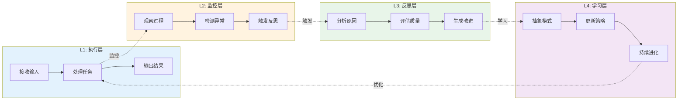
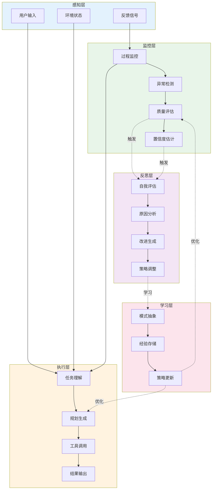
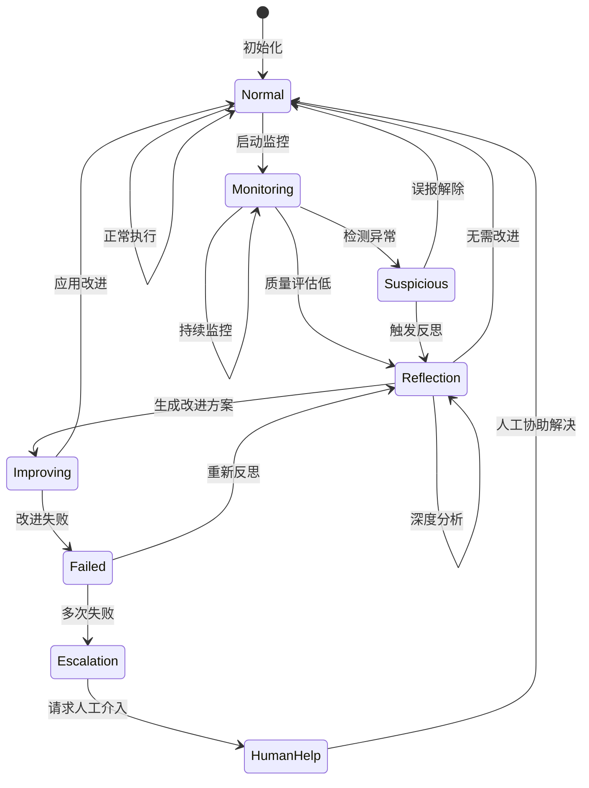
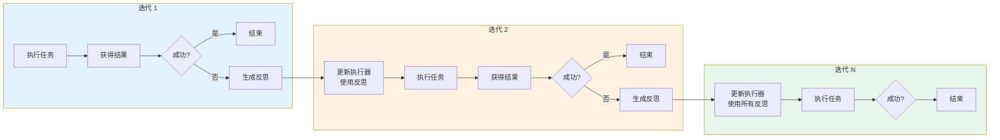
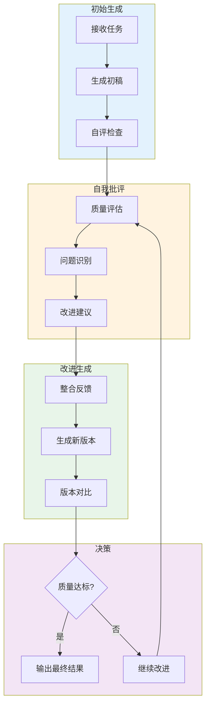
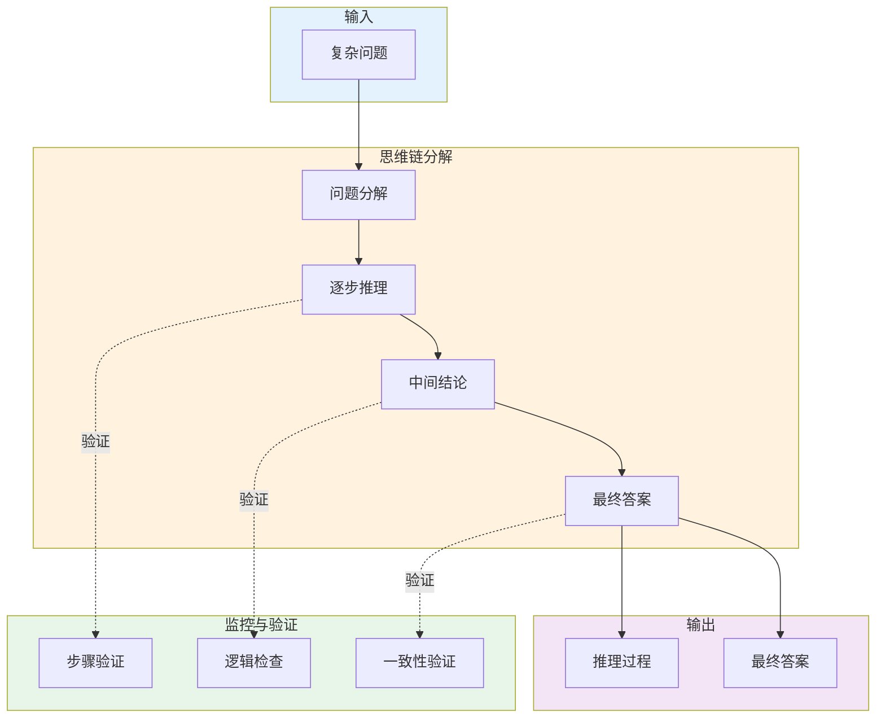
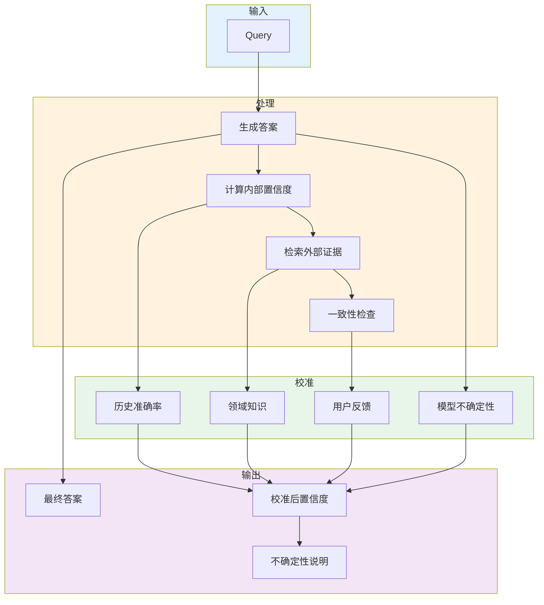
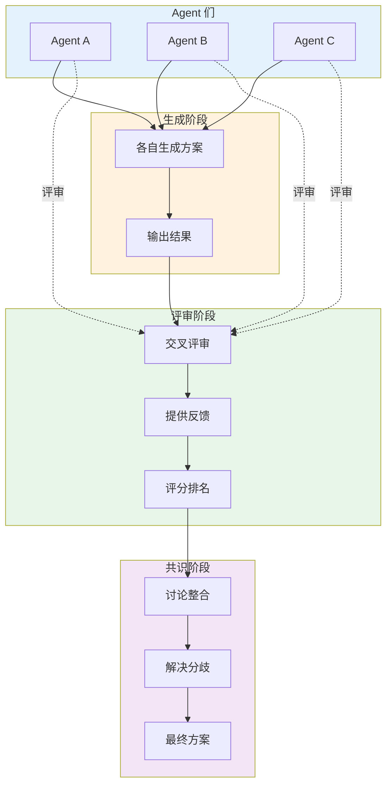
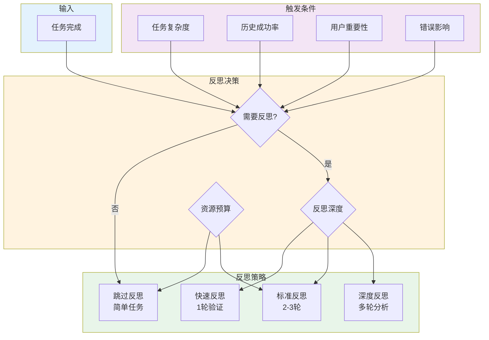

# 41 · Agent 自我反思与元认知（Self-Reflection & Metacognition）

## 概述

元认知（Metacognition）——"关于思考的思考"——是人类智能的核心特征，也是 Agent 系统从工具走向真正智能体的关键跃迁。具备元认知能力的 Agent 不仅能够执行任务，还能监控自己的思考过程、评估自己的输出质量、从错误中学习，并不断改进自身的行为模式。

本文将深入探讨 Agent 自我反思与元认知的架构设计，从理论基础到工程实现，涵盖 Reflexion 模式、Self-Refine 循环、思维链与思维树的应用，以及置信度校准和多 Agent 互相评审等高级主题。

## 为什么 Agent 需要自我反思能力

### 从执行到反思的智能跃迁



### 元认知能力的核心价值

| 能力维度 | 业务价值 | 技术实现难度 |
|---------|---------|------------|
| 错误自检 | 减少幻觉输出、提升可靠性 | 中等 |
| 质量自评 | 智能重试、自动优化 | 高 |
| 从失败学习 | 持续改进、避免重复错误 | 高 |
| 置信度校准 | 知道"不知道"、主动求助 | 中 |
| 策略调整 | 适应不同场景、效率提升 | 高 |
| 经验积累 | 跨会话学习、能力进化 | 很高 |

### 元认知架构的 ROI 分析

**投入成本**：
- 开发周期：2-3 个月
- 计算开销：增加 20-40% 推理成本
- 维护复杂度：中等偏高

**收益**：
- 输出质量提升：准确率提高 15-30%
- 用户满意度：提高 20-25%
- 支持成本：人工介入减少 30-50%
- 持续改进：无需人工调优即可提升

## 元认知架构设计

### 完整元认知流程



### 元认知状态机



## Reflexion 模式

### Reflexion 框架概述

Reflexion 是一种让 Agent 从失败中学习的框架，通过语言反馈实现自我改进。



### Reflexion 实现

```java
package com.enterprise.agent.reflection;

import org.springframework.stereotype.Component;
import lombok.RequiredArgsConstructor;
import lombok.extern.slf4j.Slf4j;
import org.springframework.ai.chat.client.ChatClient;
import org.springframework.ai.chat.client.advisor.MessageChatMemoryAdvisor;

import java.util.ArrayList;
import java.util.List;

/**
 * Reflexion 自我反思框架实现
 * 
 * 让 Agent 从失败中学习并改进自己的行为
 */
@Slf4j
@Component
@RequiredArgsConstructor
public class ReflexionEngine {
    
    private final ChatClient chatClient;
    private final ReflectionMemory reflectionMemory;
    private final TaskExecutor taskExecutor;
    private final SuccessEvaluator successEvaluator;
    
    private static final int MAX_REFLECTION_ITERATIONS = 3;
    
    /**
     * 使用 Reflexion 执行任务
     * 
     * @param task 任务描述
     * @param context 上下文
     * @return 执行结果
     */
    public TaskResult executeWithReflexion(String task, Map<String, Object> context) {
        List<Reflection> previousReflections = new ArrayList<>();
        
        for (int iteration = 0; iteration < MAX_REFLECTION_ITERATIONS; iteration++) {
            log.info("Reflexion iteration {}/{}", iteration + 1, MAX_REFLECTION_ITERATIONS);
            
            // 构建执行器 prompt（包含之前的反思）
            String executorPrompt = buildExecutorPrompt(task, previousReflections, context);
            
            // 执行任务
            TaskResult result = taskExecutor.execute(executorPrompt, context);
            
            // 评估成功与否
            SuccessEvaluation evaluation = successEvaluator.evaluate(result, task);
            
            if (evaluation.isSuccessful()) {
                log.info("Task succeeded on iteration {}", iteration + 1);
                
                // 保存成功的经验
                if (!previousReflections.isEmpty()) {
                    reflectionMemory.saveSuccessfulExperience(task, previousReflections, result);
                }
                
                return result;
            }
            
            // 生成反思
            Reflection reflection = generateReflection(result, evaluation, previousReflections);
            previousReflections.add(reflection);
            
            log.info("Generated reflection: {}", reflection.getSelfCritique());
        }
        
        // 达到最大迭代次数，返回最后的结果
        log.warn("Max iterations reached, returning last result");
        return taskExecutor.getLastResult();
    }
    
    /**
     * 构建执行器 prompt
     */
    private String buildExecutorPrompt(String task, List<Reflection> reflections, Map<String, Object> context) {
        StringBuilder prompt = new StringBuilder();
        
        prompt.append("You are a task executor. Given a task, execute it to the best of your ability.\n\n");
        prompt.append("Task: ").append(task).append("\n\n");
        
        if (!reflections.isEmpty()) {
            prompt.append("Previous reflections on your performance:\n");
            for (int i = 0; i < reflections.size(); i++) {
                Reflection r = reflections.get(i);
                prompt.append(String.format("Reflection %d: %s\n", i + 1, r.getSelfCritique()));
            }
            prompt.append("\nUse these reflections to improve your execution.\n\n");
        }
        
        if (!context.isEmpty()) {
            prompt.append("Context:\n");
            context.forEach((k, v) -> prompt.append(String.format("- %s: %s\n", k, v)));
            prompt.append("\n");
        }
        
        prompt.append("Execute the task:");
        
        return prompt.toString();
    }
    
    /**
     * 生成自我反思
     */
    private Reflection generateReflection(TaskResult result, SuccessEvaluation evaluation, List<Reflection> previousReflections) {
        String reflectionPrompt = buildReflectionPrompt(result, evaluation, previousReflections);
        
        String reflectionText = chatClient.prompt()
            .user(reflectionPrompt)
            .call()
            .content();
        
        return Reflection.builder()
            .iteration(previousReflections.size() + 1)
            .taskResult(result)
            .evaluation(evaluation)
            .selfCritique(reflectionText)
            .timestamp(LocalDateTime.now())
            .build();
    }
    
    /**
     * 构建反思 prompt
     */
    private String buildReflectionPrompt(TaskResult result, SuccessEvaluation evaluation, List<Reflection> previousReflections) {
        StringBuilder prompt = new StringBuilder();
        
        prompt.append("You are a self-reflective AI. Analyze the following task execution and provide constructive criticism.\n\n");
        
        prompt.append("Original Task: ").append(result.getOriginalTask()).append("\n\n");
        prompt.append("Your Execution: ").append(result.getExecution()).append("\n\n");
        prompt.append("Result: ").append(result.getOutput()).append("\n\n");
        
        prompt.append("Evaluation:\n");
        prompt.append("- Success: ").append(evaluation.isSuccessful()).append("\n");
        prompt.append("- Issues: ").append(String.join(", ", evaluation.getIssues())).append("\n\n");
        
        if (!previousReflections.isEmpty()) {
            prompt.append("Previous Reflections you made:\n");
            for (int i = 0; i < previousReflections.size(); i++) {
                prompt.append(String.format("%d. %s\n", i + 1, previousReflections.get(i).getSelfCritique()));
            }
            prompt.append("\nDid you address these issues? If not, why?\n\n");
        }
        
        prompt.append("Provide a self-critique that:\n");
        prompt.append("1. Identifies what went wrong\n");
        prompt.append("2. Explains why it went wrong\n");
        prompt.append("3. Suggests specific improvements\n");
        prompt.append("4. Is actionable for future iterations\n\n");
        
        prompt.append("Your self-critique:");
        
        return prompt.toString();
    }
}
```

### Reflexion 记忆管理

```java
package com.enterprise.agent.reflection;

import org.springframework.stereotype.Component;
import lombok.RequiredArgsConstructor;
import lombok.extern.slf4j.Slf4j;
import org.springframework.data.mongodb.core.MongoTemplate;

import java.time.LocalDateTime;
import java.util.List;

/**
 * 反思记忆存储
 * 
 * 存储成功的反思经验，用于未来类似任务的参考
 */
@Slf4j
@Component
@RequiredArgsConstructor
public class ReflectionMemory {
    
    private final MongoTemplate mongoTemplate;
    
    /**
     * 保存成功的经验
     */
    public void saveSuccessfulExperience(String task, List<Reflection> reflections, TaskResult result) {
        ReflectionExperience experience = ReflectionExperience.builder()
            .taskType(classifyTaskType(task))
            .task(task)
            .reflections(reflections)
            .successfulResult(result)
            .timestamp(LocalDateTime.now())
            .embedding(embedTask(task)) // 向量化用于检索
            .build();
        
        mongoTemplate.save(experience);
        log.info("Saved successful reflection experience: taskType={}", experience.getTaskType());
    }
    
    /**
     * 检索相关的反思经验
     */
    public List<ReflectionExperience> retrieveRelevantExperiences(String task, int limit) {
        float[] taskEmbedding = embedTask(task);
        
        // 向量检索相关经验
        // 这里简化为按任务类型查找
        String taskType = classifyTaskType(task);
        
        return mongoTemplate.find(
            Query.query(Criteria.where("taskType").is(taskType))
                .with(Sort.by(Sort.Direction.DESC, "timestamp"))
                .limit(limit),
            ReflectionExperience.class
        );
    }
    
    private String classifyTaskType(String task) {
        // 简单的任务分类逻辑
        if (task.contains("code") || task.contains("function")) return "coding";
        if (task.contains("write") || task.contains("text")) return "writing";
        if (task.contains("analyze") || task.contains("data")) return "analysis";
        return "general";
    }
    
    private float[] embedTask(String task) {
        // 实际实现应该使用 embedding 模型
        return new float[0];
    }
}
```

## Self-Refine 模式

### Self-Refine 循环



### Self-Refine 实现

```java
package com.enterprise.agent.selfrefine;

import org.springframework.stereotype.Component;
import lombok.RequiredArgsConstructor;
import lombok.extern.slf4j.Slf4j;
import org.springframework.ai.chat.client.ChatClient;

import java.util.ArrayList;
import java.util.List;

/**
 * Self-Refine 自我改进引擎
 * 
 * Agent 通过自评和改进循环不断提升输出质量
 */
@Slf4j
@Component
@RequiredArgsConstructor
public class SelfRefineEngine {
    
    private final ChatClient chatClient;
    private final QualityEvaluator qualityEvaluator;
    
    private static final int MAX_REFINE_ITERATIONS = 5;
    private static final double QUALITY_THRESHOLD = 0.85;
    
    /**
     * 使用 Self-Refine 生成内容
     * 
     * @param task 任务描述
     * @return 最终结果
     */
    public RefinementResult generateWithRefine(String task) {
        List<RefinementIteration> iterations = new ArrayList<>();
        
        // 初始生成
        String currentOutput = chatClient.prompt()
            .user(task)
            .call()
            .content();
        
        iterations.add(RefinementIteration.builder()
            .iteration(0)
            .output(currentOutput)
            .qualityScore(qualityEvaluator.evaluate(currentOutput, task))
            .build());
        
        // 改进循环
        for (int i = 1; i <= MAX_REFINE_ITERATIONS; i++) {
            log.debug("Refinement iteration {}/{}", i, MAX_REFINE_ITERATIONS);
            
            // 自我批评
            Critique critique = generateCritique(task, currentOutput);
            
            // 基于批评改进
            currentOutput = refineOutput(task, currentOutput, critique);
            
            // 评估质量
            double qualityScore = qualityEvaluator.evaluate(currentOutput, task);
            
            iterations.add(RefinementIteration.builder()
                .iteration(i)
                .output(currentOutput)
                .critique(critique)
                .qualityScore(qualityScore)
                .build());
            
            log.debug("Quality score: {}", qualityScore);
            
            // 质量达标则停止
            if (qualityScore >= QUALITY_THRESHOLD) {
                log.info("Quality threshold reached at iteration {}", i);
                break;
            }
            
            // 检查是否有实质改进
            if (!hasSubstantialImprovement(iterations)) {
                log.info("No substantial improvement, stopping at iteration {}", i);
                break;
            }
        }
        
        return RefinementResult.builder()
            .task(task)
            .finalOutput(currentOutput)
            .iterations(iterations)
            .finalQualityScore(iterations.get(iterations.size() - 1).getQualityScore())
            .build();
    }
    
    /**
     * 生成自我批评
     */
    private Critique generateCritique(String task, String output) {
        String critiquePrompt = String.format("""
            Task: %s
            
            Current Output:
            %s
            
            Analyze the output and provide specific, actionable feedback for improvement.
            Focus on:
            1. Completeness: Did we address all aspects of the task?
            2. Accuracy: Is the information correct and precise?
            3. Clarity: Is the explanation clear and well-structured?
            4. Quality: What specific improvements can be made?
            
            Provide your critique in the following format:
            CRITIQUE:
            [Your analysis]
            
            IMPROVEMENTS:
            1. [Specific improvement 1]
            2. [Specific improvement 2]
            3. [Specific improvement 3]
            """, task, output);
        
        String critique = chatClient.prompt()
            .user(critiquePrompt)
            .call()
            .content();
        
        return Critique.builder()
            .feedback(critique)
            .timestamp(LocalDateTime.now())
            .build();
    }
    
    /**
     * 基于批评改进输出
     */
    private String refineOutput(String task, String currentOutput, Critique critique) {
        String refinePrompt = String.format("""
            Task: %s
            
            Current Output:
            %s
            
            Critique:
            %s
            
            Based on the critique, generate an improved version of the output.
            Address each point raised in the critique and make the output better.
            """, task, currentOutput, critique.getFeedback());
        
        return chatClient.prompt()
            .user(refinePrompt)
            .call()
            .content();
    }
    
    /**
     * 检查是否有实质改进
     */
    private boolean hasSubstantialImprovement(List<RefinementIteration> iterations) {
        if (iterations.size() < 2) return true;
        
        double recentImprovement = iterations.get(iterations.size() - 1).getQualityScore() - 
                                  iterations.get(iterations.size() - 2).getQualityScore();
        
        return recentImprovement > 0.05; // 至少提升 5%
    }
}
```

## 思维链与思维树

### CoT 在 Agent 中的应用



### CoT 实现策略

```java
package com.enterprise.agent.reasoning;

import org.springframework.stereotype.Component;
import lombok.RequiredArgsConstructor;
import lombok.extern.slf4j.Slf4j;
import org.springframework.ai.chat.client.ChatClient;

import java.util.ArrayList;
import java.util.List;

/**
 * 思维链（Chain of Thought）推理引擎
 * 
 * 让 Agent 展示推理过程，提高复杂问题的解决能力
 */
@Slf4j
@Component
@RequiredArgsConstructor
public class ChainOfThoughtEngine {
    
    private final ChatClient chatClient;
    private final ReasoningStepValidator stepValidator;
    
    /**
     * 使用思维链解决问题
     * 
     * @param problem 问题描述
     * @return 推理结果
     */
    public CoTResult solveWithCoT(String problem) {
        String cotPrompt = buildCoTPrompt(problem);
        
        String response = chatClient.prompt()
            .user(cotPrompt)
            .call()
            .content();
        
        // 解析推理过程
        List<ReasoningStep> steps = parseReasoningSteps(response);
        
        // 验证每个步骤
        List<ReasoningStep> validatedSteps = new ArrayList<>();
        for (ReasoningStep step : steps) {
            StepValidation validation = stepValidator.validate(step, problem, validatedSteps);
            
            if (validation.isValid()) {
                validatedSteps.add(step);
            } else {
                log.warn("Invalid reasoning step: {}", validation.getReason());
                // 尝试修正或重新生成
            }
        }
        
        // 提取最终答案
        String finalAnswer = extractFinalAnswer(response);
        
        return CoTResult.builder()
            .problem(problem)
            .reasoningSteps(validatedSteps)
            .finalAnswer(finalAnswer)
            .confidence(calculateOverallConfidence(validatedSteps))
            .build();
    }
    
    /**
     * 构建思维链 prompt
     */
    private String buildCoTPrompt(String problem) {
        return String.format("""
            Solve the following problem step by step. Show your reasoning process.
            
            Problem: %s
            
            Instructions:
            1. Break down the problem into smaller parts
            2. Solve each part systematically
            3. Explain your reasoning for each step
            4. Build on previous steps to reach the final answer
            5. Clearly state your final answer
            
            Format your response as:
            Step 1: [First step of reasoning]
            [Explanation]
            
            Step 2: [Second step of reasoning]
            [Explanation]
            
            ...
            
            Final Answer: [Your final answer]
            """, problem);
    }
    
    /**
     * 解析推理步骤
     */
    private List<ReasoningStep> parseReasoningSteps(String response) {
        List<ReasoningStep> steps = new ArrayList<>();
        
        // 简化的解析逻辑
        String[] lines = response.split("\n");
        ReasoningStep currentStep = null;
        StringBuilder explanation = new StringBuilder();
        
        for (String line : lines) {
            if (line.trim().startsWith("Step ") && line.contains(":")) {
                // 保存前一步
                if (currentStep != null) {
                    currentStep.setExplanation(explanation.toString().trim());
                    steps.add(currentStep);
                }
                
                // 开始新步骤
                String stepText = line.substring(line.indexOf(":") + 1).trim();
                currentStep = ReasoningStep.builder()
                    .stepNumber(steps.size() + 1)
                    .statement(stepText)
                    .build();
                explanation = new StringBuilder();
            } else if (currentStep != null) {
                explanation.append(line).append("\n");
            }
        }
        
        // 保存最后一步
        if (currentStep != null) {
            currentStep.setExplanation(explanation.toString().trim());
            steps.add(currentStep);
        }
        
        return steps;
    }
    
    private String extractFinalAnswer(String response) {
        // 提取 "Final Answer:" 后的内容
        int index = response.indexOf("Final Answer:");
        if (index >= 0) {
            return response.substring(index + "Final Answer:".length()).trim();
        }
        return "";
    }
    
    private double calculateOverallConfidence(List<ReasoningStep> steps) {
        // 基于步骤质量和连贯性计算整体置信度
        return steps.isEmpty() ? 0.0 : 
               steps.stream().mapToDouble(ReasoningStep::getConfidence).average().orElse(0.0);
    }
}
```

### 思维树（Tree of Thoughts）实现

```java
package com.enterprise.agent.reasoning;

import org.springframework.stereotype.Component;
import lombok.RequiredArgsConstructor;
import lombok.extern.slf4j.Slf4j;
import org.springframework.ai.chat.client.ChatClient;

import java.util.*;

/**
 * 思维树（Tree of Thoughts）推理引擎
 * 
 * 探索多个推理路径，选择最优解
 */
@Slf4j
@Component
@RequiredArgsConstructor
public class TreeOfThoughtsEngine {
    
    private final ChatClient chatClient;
    private final ThoughtEvaluator thoughtEvaluator;
    
    private static final int MAX_THOUGHTS_PER_NODE = 3;
    private static final int MAX_DEPTH = 4;
    
    /**
     * 使用思维树解决问题
     * 
     * @param problem 问题
     * @return 解决方案
     */
    public ToTResult solveWithToT(String problem) {
        ThoughtNode root = ThoughtNode.builder()
            .thought(problem)
            .depth(0)
            .children(new ArrayList<>())
            .build();
        
        // BFS 搜索
        Queue<ThoughtNode> queue = new LinkedList<>();
        queue.add(root);
        
        ThoughtNode bestSolution = null;
        double bestScore = 0.0;
        
        while (!queue.isEmpty() && queue.size() < 100) { // 限制搜索空间
            ThoughtNode current = queue.poll();
            
            if (current.getDepth() >= MAX_DEPTH) {
                continue;
            }
            
            // 生成子思路
            List<ThoughtNode> children = generateChildThoughts(current, problem);
            current.setChildren(children);
            
            // 评估每个子思路
            for (ThoughtNode child : children) {
                double score = thoughtEvaluator.evaluate(child, problem);
                child.setScore(score);
                
                if (score > bestScore) {
                    bestScore = score;
                    bestSolution = child;
                }
                
                // 选择性地继续探索
                if (shouldContinue(score)) {
                    queue.add(child);
                }
            }
        }
        
        // 回溯最佳路径
        List<String> solutionPath = backtrackPath(bestSolution);
        
        return ToTResult.builder()
            .problem(problem)
            .solutionPath(solutionPath)
            .bestSolution(bestSolution != null ? bestSolution.getThought() : "")
            .confidence(bestScore)
            .nodesExplored(countNodes(root))
            .build();
    }
    
    /**
     * 生成子思路
     */
    private List<ThoughtNode> generateChildThoughts(ThoughtNode parent, String problem) {
        String prompt = String.format("""
            Given the current thought in solving a problem, generate %d distinct next thoughts that advance the reasoning.
            
            Problem: %s
            Current thought: %s
            
            Generate %d different approaches to continue from this thought.
            Format each thought on a new line starting with "Thought:".
            """, MAX_THOUGHTS_PER_NODE, problem, parent.getThought(), MAX_THOUGHTS_PER_NODE);
        
        String response = chatClient.prompt()
            .user(prompt)
            .call()
            .content();
        
        // 解析响应生成子节点
        List<ThoughtNode> children = new ArrayList<>();
        String[] lines = response.split("\n");
        
        int depth = parent.getDepth() + 1;
        for (String line : lines) {
            if (line.trim().startsWith("Thought:")) {
                String thought = line.substring("Thought:".length()).trim();
                if (!thought.isEmpty()) {
                    children.add(ThoughtNode.builder()
                        .thought(thought)
                        .depth(depth)
                        .parent(parent)
                        .children(new ArrayList<>())
                        .build());
                }
            }
        }
        
        return children;
    }
    
    /**
     * 决定是否继续探索
     */
    private boolean shouldContinue(double score) {
        // 继续探索有潜力的路径
        return score > 0.3;
    }
    
    /**
     * 回溯最佳路径
     */
    private List<String> backtrackPath(ThoughtNode node) {
        List<String> path = new ArrayList<>();
        ThoughtNode current = node;
        
        while (current != null) {
            path.add(0, current.getThought());
            current = current.getParent();
        }
        
        return path;
    }
    
    private int countNodes(ThoughtNode root) {
        if (root == null) return 0;
        
        int count = 1;
        for (ThoughtNode child : root.getChildren()) {
            count += countNodes(child);
        }
        return count;
    }
}
```

## 置信度校准

### 置信度估计架构



### 置信度校准器实现

```java
package com.enterprise.agent.confidence;

import org.springframework.stereotype.Component;
import lombok.RequiredArgsConstructor;
import lombok.extern.slf4j.Slf4j;
import org.springframework.ai.chat.client.ChatClient;

import java.util.Map;

/**
 * 置信度校准器
 * 
 * 让 Agent 知道自己"不知道什么"，并提供准确的置信度估计
 */
@Slf4j
@Component
@RequiredArgsConstructor
public class ConfidenceCalibrator {
    
    private final ChatClient chatClient;
    private final ConfidenceHistoryRepository historyRepository;
    private final ExternalKnowledgeRetriever knowledgeRetriever;
    
    /**
     * 校准置信度
     * 
     * @param query 查询
     * @param answer 答案
     * @param rawConfidence 原始置信度
     * @return 校准后的置信度
     */
    public CalibratedConfidence calibrate(String query, String answer, double rawConfidence) {
        // 1. 历史准确率调整
        double historicalAdjustment = calculateHistoricalAdjustment(query);
        
        // 2. 外部证据验证
        double externalSupport = findExternalSupport(query, answer);
        
        // 3. 自我一致性检查
        double consistencyScore = checkSelfConsistency(query, answer);
        
        // 4. 知识覆盖度
        double knowledgeCoverage = calculateKnowledgeCoverage(query);
        
        // 综合校准
        double calibratedScore = calculateCalibratedScore(
            rawConfidence,
            historicalAdjustment,
            externalSupport,
            consistencyScore,
            knowledgeCoverage
        );
        
        // 生成不确定性说明
        String uncertaintyExplanation = generateUncertaintyExplanation(
            calibratedScore,
            Map.of(
                "historical", historicalAdjustment,
                "external", externalSupport,
                "consistency", consistencyScore,
                "coverage", knowledgeCoverage
            )
        );
        
        return CalibratedConfidence.builder()
            .originalConfidence(rawConfidence)
            .calibratedConfidence(calibratedScore)
            .uncertaintyLevel(categorizeUncertainty(calibratedScore))
            .explanation(uncertaintyExplanation)
            .shouldRequestHelp(calibratedScore < 0.6)
            .build();
    }
    
    /**
     * 计算历史调整因子
     */
    private double calculateHistoricalAdjustment(String query) {
        // 查询该类型问题的历史准确率
        String queryType = classifyQuery(query);
        double historicalAccuracy = historyRepository.getAccuracyForQueryType(queryType);
        
        // 调整因子：如果历史准确率低，降低置信度
        return historicalAccuracy;
    }
    
    /**
     * 查找外部支持
     */
    private double findExternalSupport(String query, String answer) {
        // 检索外部知识源验证答案
        List<KnowledgeFragment> fragments = knowledgeRetriever.retrieve(query, 5);
        
        if (fragments.isEmpty()) {
            return 0.5; // 中性
        }
        
        // 计算答案与外部知识的一致性
        double supportScore = 0.0;
        for (KnowledgeFragment fragment : fragments) {
            supportScore += calculateAnswerAnswerSimilarity(answer, fragment.getContent());
        }
        
        return supportScore / fragments.size();
    }
    
    /**
     * 自我一致性检查
     */
    private double checkSelfConsistency(String query, String answer) {
        // 多次生成答案，检查一致性
        int samples = 3;
        int consistent = 0;
        
        for (int i = 0; i < samples; i++) {
            String alternativeAnswer = chatClient.prompt()
                .user(query)
                .call()
                .content();
            
            if (calculateAnswerAnswerSimilarity(answer, alternativeAnswer) > 0.7) {
                consistent++;
            }
        }
        
        return (double) consistent / samples;
    }
    
    /**
     * 计算知识覆盖度
     */
    private double calculateKnowledgeCoverage(String query) {
        // 检查查询的主题是否在 Agent 的知识范围内
        String topic = extractTopic(query);
        return historyRepository.getKnowledgeCoverage(topic);
    }
    
    /**
     * 计算校准分数
     */
    private double calculateCalibratedScore(
            double rawConfidence,
            double historical,
            double external,
            double consistency,
            double coverage) {
        
        // 加权综合
        double[] weights = {0.3, 0.25, 0.2, 0.15, 0.1};
        double[] scores = {rawConfidence, historical, external, consistency, coverage};
        
        double weighted = 0.0;
        for (int i = 0; i < weights.length; i++) {
            weighted += weights[i] * scores[i];
        }
        
        return weighted;
    }
    
    /**
     * 生成不确定性说明
     */
    private String generateUncertaintyExplanation(double score, Map<String, Double> factors) {
        if (score >= 0.8) {
            return "High confidence in this answer based on strong supporting evidence and consistency.";
        } else if (score >= 0.6) {
            return "Moderately confident. Some uncertainty due to limited external validation.";
        } else {
            return "Low confidence. Recommend consulting additional sources or human expertise.";
        }
    }
    
    private String classifyQuery(String query) {
        // 简单的查询分类
        if (query.contains("code") || query.contains("programming")) return "coding";
        if (query.contains("fact") || query.contains("what is")) return "factual";
        if (query.contains("how to") || query.contains("explain")) return "explanation";
        return "general";
    }
    
    private String extractTopic(String query) {
        // 简化的主题提取
        return query.split("\\s+")[0];
    }
    
    private double calculateAnswerAnswerSimilarity(String answer1, String answer2) {
        // 简化的相似度计算
        // 实际实现应该使用更复杂的算法
        String[] words1 = answer1.toLowerCase().split("\\s+");
        String[] words2 = answer2.toLowerCase().split("\\s+");
        
        Set<String> set1 = Set.of(words1);
        Set<String> set2 = Set.of(words2);
        
        Set<String> intersection = new HashSet<>(set1);
        intersection.retainAll(set2);
        
        Set<String> union = new HashSet<>(set1);
        union.addAll(set2);
        
        return union.isEmpty() ? 0.0 : (double) intersection.size() / union.size();
    }
    
    private UncertaintyLevel categorizeUncertainty(double score) {
        if (score >= 0.8) return UncertaintyLevel.LOW;
        if (score >= 0.6) return UncertaintyLevel.MEDIUM;
        return UncertaintyLevel.HIGH;
    }
}
```

## 多 Agent 互相评审

### Peer Review 架构



### Peer Review 实现

```java
package com.enterprise.agent.peerreview;

import org.springframework.stereotype.Component;
import lombok.RequiredArgsConstructor;
import lombok.extern.slf4j.Slf4j;
import org.springframework.ai.chat.client.ChatClient;

import java.util.*;
import java.util.concurrent.CompletableFuture;

/**
 * 多 Agent 互相评审系统
 * 
 * 通过 Agent 之间的互相评审提高输出质量和可靠性
 */
@Slf4j
@Component
@RequiredArgsConstructor
public class PeerReviewSystem {
    
    private final ChatClient chatClient;
    private final List<AgentPeer> agents;
    private final ConsensusBuilder consensusBuilder;
    
    /**
     * 执行带同行评审的任务
     * 
     * @param task 任务
     * @return 评审后的结果
     */
    public PeerReviewResult executeWithPeerReview(String task) {
        log.info("Starting peer review for task: {}", task);
        
        // 1. 并行生成方案
        Map<AgentPeer, String> proposals = generateProposals(task);
        
        // 2. 交叉评审
        Map<AgentPeer, List<Review>> reviews = conductPeerReviews(task, proposals);
        
        // 3. 计算综合评分
        Map<String, Double> scores = calculateAggregateScores(proposals, reviews);
        
        // 4. 达成共识
        String finalProposal = consensusBuilder.buildConsensus(proposals, reviews);
        
        return PeerReviewResult.builder()
            .task(task)
            .proposals(proposals)
            .reviews(reviews)
            .scores(scores)
            .finalProposal(finalProposal)
            .confidence(assessConsensus(scores))
            .build();
    }
    
    /**
     * 生成各 Agent 的提案
     */
    private Map<AgentPeer, String> generateProposals(String task) {
        Map<AgentPeer, String> proposals = new HashMap<>();
        
        List<CompletableFuture<Void>> futures = agents.stream()
            .map(agent -> CompletableFuture.runAsync(() -> {
                try {
                    String proposal = agent.generateProposal(task);
                    proposals.put(agent, proposal);
                    log.debug("Generated proposal from agent: {}", agent.getName());
                } catch (Exception e) {
                    log.error("Agent {} failed to generate proposal", agent.getName(), e);
                }
            }))
            .toList();
        
        // 等待所有提案完成
        CompletableFuture.allOf(futures.toArray(new CompletableFuture[0])).join();
        
        return proposals;
    }
    
    /**
     * 进行同行评审
     */
    private Map<AgentPeer, List<Review>> conductPeerReviews(
            String task,
            Map<AgentPeer, String> proposals) {
        
        Map<AgentPeer, List<Review>> allReviews = new HashMap<>();
        
        for (AgentPeer reviewer : agents) {
            List<Review> reviews = new ArrayList<>();
            
            for (AgentPeer author : agents) {
                if (author.equals(reviewer)) {
                    continue; // 不评审自己的
                }
                
                String proposal = proposals.get(author);
                if (proposal == null || proposal.isEmpty()) {
                    continue;
                }
                
                try {
                    Review review = reviewer.review(task, proposal, author);
                    reviews.add(review);
                    log.debug("Review from {} for {}: score={}", 
                        reviewer.getName(), author.getName(), review.getScore());
                } catch (Exception e) {
                    log.error("Review failed for agent {}", reviewer.getName(), e);
                }
            }
            
            allReviews.put(reviewer, reviews);
        }
        
        return allReviews;
    }
    
    /**
     * 计算综合评分
     */
    private Map<String, Double> calculateAggregateScores(
            Map<AgentPeer, String> proposals,
            Map<AgentPeer, List<Review>> reviews) {
        
        Map<String, Double> scores = new HashMap<>();
        
        for (Map.Entry<AgentPeer, String> entry : proposals.entrySet()) {
            AgentPeer author = entry.getKey();
            String proposal = entry.getValue();
            
            // 收集该提案的所有评审
            List<Review> proposalReviews = reviews.values().stream()
                .flatMap(list -> list.stream())
                .filter(r -> r.getAuthor().equals(author))
                .toList();
            
            // 计算平均分
            double avgScore = proposalReviews.isEmpty() ? 0.0 :
                proposalReviews.stream()
                    .mapToDouble(Review::getScore)
                    .average()
                    .orElse(0.0);
            
            scores.put(proposal, avgScore);
        }
        
        return scores;
    }
    
    /**
     * 评估共识程度
     */
    private double assessConsensus(Map<String, Double> scores) {
        if (scores.isEmpty()) return 0.0;
        
        double variance = calculateVariance(scores.values());
        // 方差越小，共识越高
        return 1.0 / (1.0 + variance);
    }
    
    private double calculateVariance(Collection<Double> values) {
        double mean = values.stream().mapToDouble(Double::doubleValue).average().orElse(0.0);
        return values.stream()
            .mapToDouble(v -> Math.pow(v - mean, 2))
            .average()
            .orElse(0.0);
    }
}
```

## 反思深度控制

### 反思策略决策



### 反思控制器实现

```java
package com.enterprise.agent.reflection;

import org.springframework.stereotype.Component;
import lombok.RequiredArgsConstructor;
import lombok.extern.slf4j.Slf4j;

import java.time.Duration;
import java.util.Map;

/**
 * 反思深度控制器
 * 
 * 决定何时反思、反思多久、何时停止，避免过度反思影响效率
 */
@Slf4j
@Component
@RequiredArgsConstructor
public class ReflectionController {
    
    private final ReflectionConfig config;
    private final ResourceMonitor resourceMonitor;
    
    /**
     * 决定是否需要反思
     */
    public boolean shouldReflect(TaskContext context, TaskResult result) {
        // 1. 检查任务复杂度
        double complexity = assessComplexity(context);
        if (complexity < config.getMinComplexityThreshold()) {
            return false;
        }
        
        // 2. 检查历史成功率
        double historicalSuccess = getHistoricalSuccessRate(context);
        if (historicalSuccess > config.getHighSuccessThreshold()) {
            return false;
        }
        
        // 3. 检查结果质量
        double quality = result.getQualityScore();
        if (quality > config.getHighQualityThreshold()) {
            return false;
        }
        
        // 4. 检查资源预算
        if (!resourceMonitor.hasBudgetForReflection()) {
            log.warn("Insufficient resources for reflection");
            return false;
        }
        
        // 5. 检查用户重要性
        if (context.isUserVIP() && quality < config.getVIPQualityThreshold()) {
            return true;
        }
        
        return true;
    }
    
    /**
     * 确定反思深度
     */
    public ReflectionDepth determineDepth(TaskContext context, TaskResult result) {
        double complexity = assessComplexity(context);
        double quality = result.getQualityScore();
        double impact = assessFailureImpact(context);
        
        // 综合评分决定深度
        double score = (complexity * 0.4) + ((1 - quality) * 0.4) + (impact * 0.2);
        
        if (score > 0.8) return ReflectionDepth.DEEP;
        if (score > 0.5) return ReflectionDepth.STANDARD;
        if (score > 0.3) return ReflectionDepth.QUICK;
        return ReflectionDepth.MINIMAL;
    }
    
    /**
     * 检查是否应该停止反思
     */
    public boolean shouldStopReflection(ReflectionSession session) {
        // 1. 达到最大迭代次数
        if (session.getIterationCount() >= session.getMaxIterations()) {
            log.info("Max iterations reached");
            return true;
        }
        
        // 2. 质量达标
        if (session.getCurrentQuality() >= config.getTargetQuality()) {
            log.info("Target quality achieved");
            return true;
        }
        
        // 3. 改进停滞
        if (hasConverged(session)) {
            log.info("Reflection converged");
            return true;
        }
        
        // 4. 超时
        if (session.getDuration().compareTo(config.getMaxReflectionTime()) > 0) {
            log.warn("Reflection timeout");
            return true;
        }
        
        // 5. 资源耗尽
        if (!resourceMonitor.hasBudgetForReflection()) {
            log.warn("Resources exhausted");
            return true;
        }
        
        return false;
    }
    
    private double assessComplexity(TaskContext context) {
        // 基于多个因素评估复杂度
        double score = 0.0;
        
        // 输入长度
        score += Math.min(1.0, context.getInputLength() / 1000.0) * 0.2;
        
        // 任务类型
        if (context.getTaskType() == TaskType.CODE_GENERATION) score += 0.3;
        if (context.getTaskType() == TaskType.MULTI_STEP_REASONING) score += 0.4;
        
        // 涉及的工具数
        score += Math.min(1.0, context.getToolCount() / 5.0) * 0.2;
        
        // 依赖复杂度
        score += Math.min(1.0, context.getDependencyCount() / 10.0) * 0.3;
        
        return Math.min(1.0, score);
    }
    
    private double getHistoricalSuccessRate(TaskContext context) {
        // 查询历史成功率
        // 实际实现应该查询数据库
        return 0.8;
    }
    
    private double assessFailureImpact(TaskContext context) {
        // 评估失败的影响
        if (context.isUserVIP()) return 0.9;
        if (context.isProduction()) return 0.8;
        if (context.isSafetyCritical()) return 1.0;
        return 0.3;
    }
    
    private boolean hasConverged(ReflectionSession session) {
        // 检查最近几次迭代的质量改进是否微小
        if (session.getQualityHistory().size() < 3) {
            return false;
        }
        
        List<Double> history = session.getQualityHistory();
        double recentImprovement = history.get(history.size() - 1) - history.get(history.size() - 3);
        
        return recentImprovement < config.getConvergenceThreshold();
    }
}
```

## 检查清单

### 自我反思能力检查清单

- [ ] **Reflexion 模式**
  - [ ] 从失败中提取反思
  - [ ] 反思记忆存储
  - [ ] 跨会话经验复用
  - [ ] 迭代改进机制

- [ ] **Self-Refine 循环**
  - [ ] 自我质量评估
  - [ ] 建设性批评生成
  - [ ] 改进方案实施
  - [ ] 收敛判断

- [ ] **思维链应用**
  - [ ] 问题分解能力
  - [ ] 推理步骤展示
  - [ ] 逻辑验证
  - [ ] 最终答案提取

- [ ] **思维树探索**
  - [ ] 多路径生成
  - [ ] 思路评估
  - [ ] 最佳路径选择
  - [ ] 搜索空间控制

### 元认知架构检查清单

- [ ] **监控系统**
  - [ ] 实时过程监控
  - [ ] 异常检测
  - [ ] 质量评估
  - [ ] 置信度估计

- [ ] **置信度校准**
  - [ ] 历史准确率调整
  - [ ] 外部证据验证
  - [ ] 自我一致性检查
  - [ ] 不确定性说明

- [ ] **Peer Review 系统**
  - [ ] 多 Agent 并行生成
  - [ ] 交叉评审机制
  - [ ] 共识达成
  - [ ] 结果整合

- [ ] **反思控制**
  - [ ] 反思需求判断
  - [ ] 深度策略选择
  - [ ] 停止条件设置
  - [ ] 资源预算管理

### 质量保障检查清单

- [ ] **输出质量**
  - [ ] 准确性验证
  - [ ] 完整性检查
  - [ ] 一致性评估
  - [ ] 有害性检测

- [ ] **过程监控**
  - [ ] 执行轨迹记录
  - [ ] 中间结果验证
  - [ ] 异常处理
  - [ ] 回滚机制

- [ ] **持续改进**
  - [ ] 经验抽象
  - [ ] 模式学习
  - [ ] 策略更新
  - [ ] 效果评估

---

**文档版本**: v1.0  
**最后更新**: 2024-08-09  
**维护者**: 企业级 Agent 架构师团队
