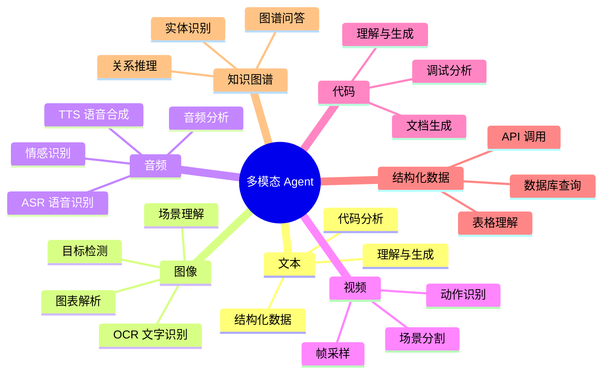
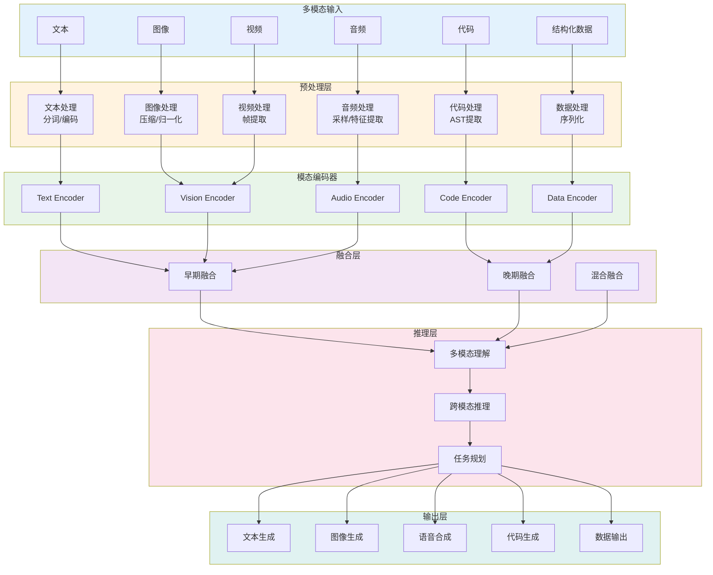
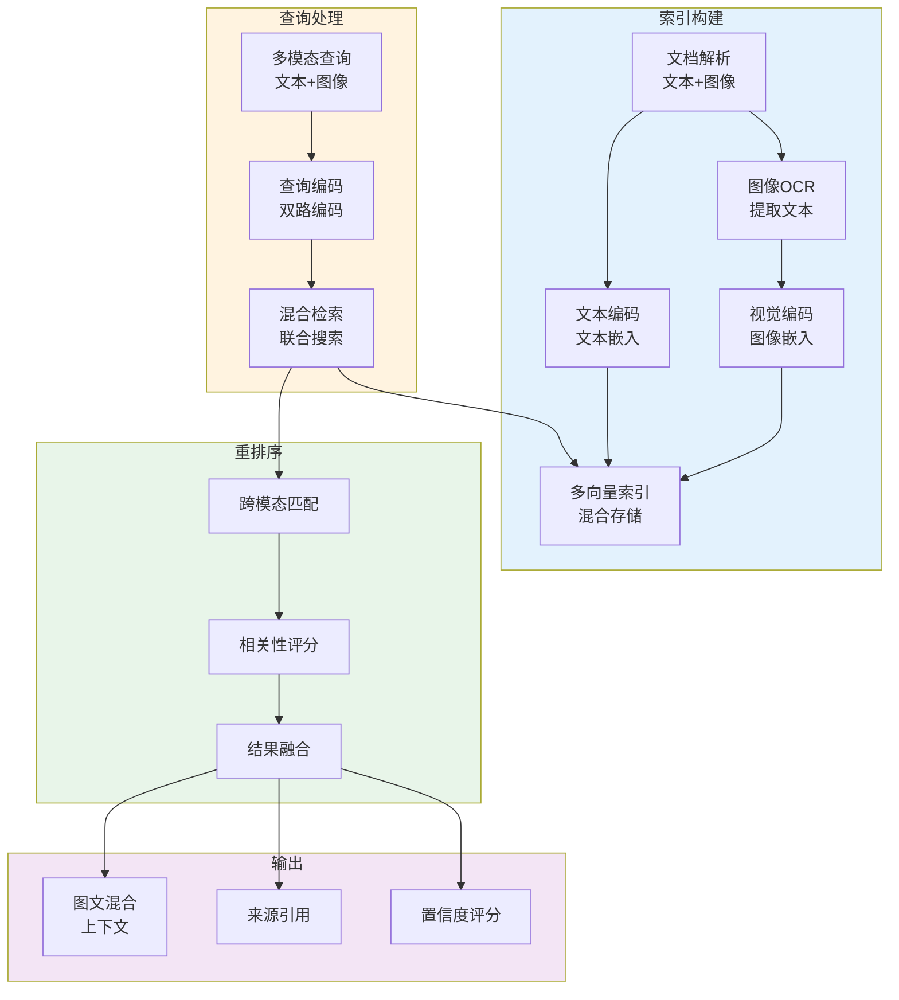
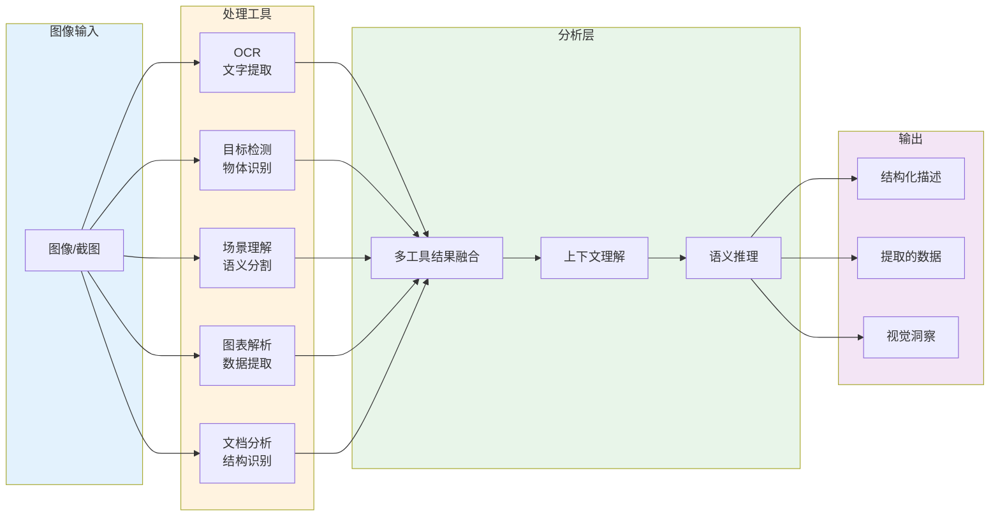
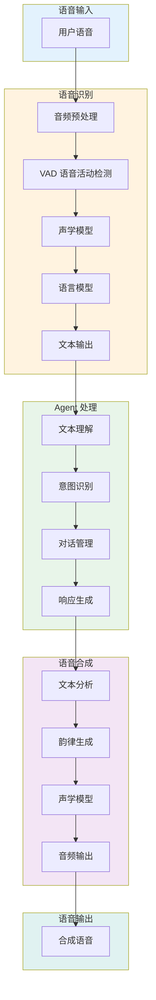
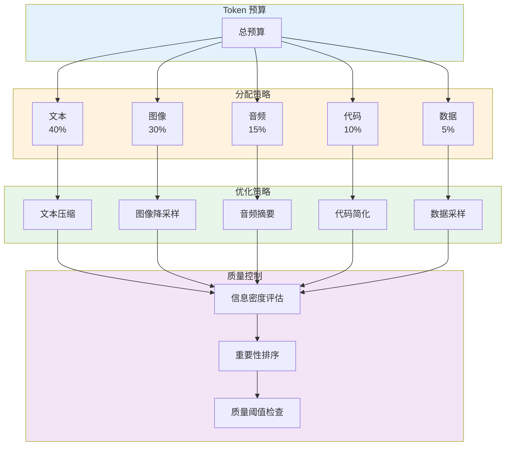
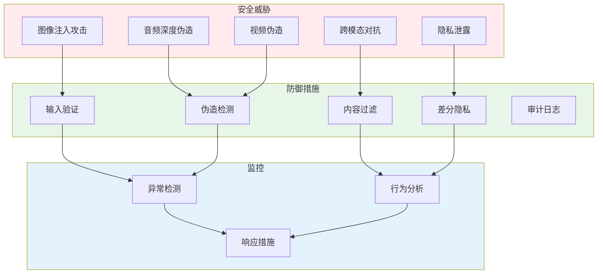
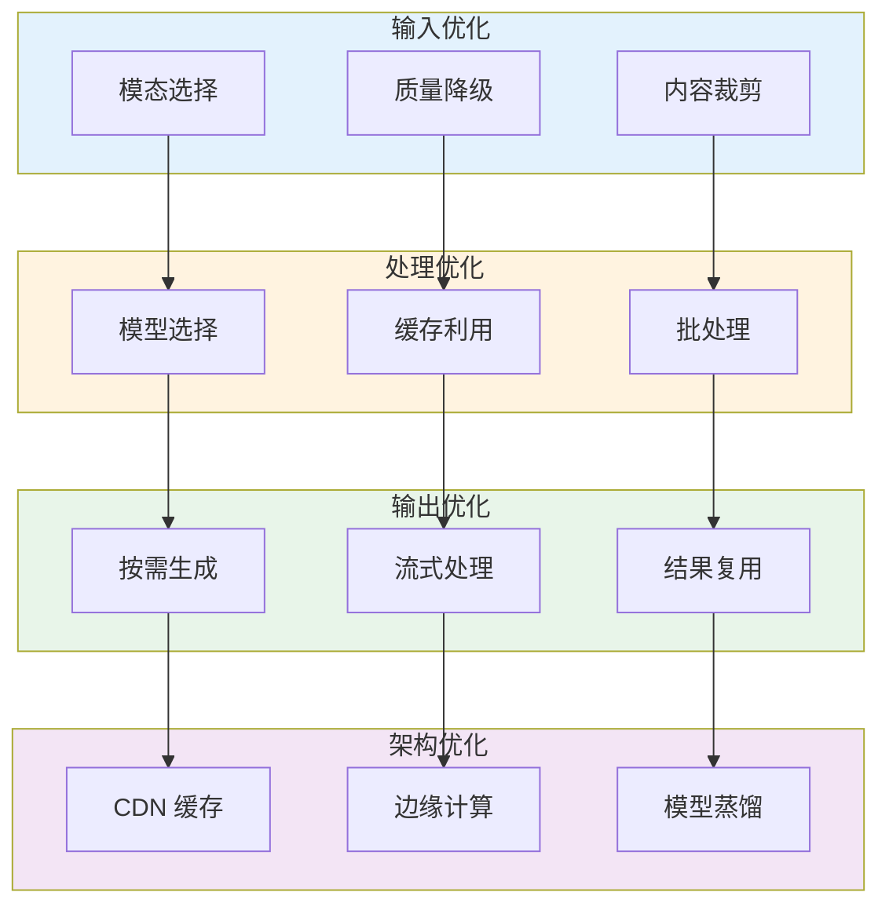

# 42 · 多模态 Agent 工程化（Multimodal Agent Engineering）

## 概述

从纯文本到多模态，Agent 系统正在经历能力维度的重大扩展。多模态 Agent 不仅能够理解和生成文本，还能处理图像、音频、视频、代码、结构化数据等多种模态的信息，真正接近人类的感知能力边界。

然而，多模态能力的工程化带来了巨大的挑战：不同模态的统一处理架构、跨模态对齐与检索、多模态上下文工程、成本控制（多模态比纯文本贵 10-50 倍）、安全性考量等。本文将深入探讨企业级多模态 Agent 的工程化实践。

## 从纯文本到多模态的演进

### 能力维度扩展



### 技术栈演进

| 时代 | 模态 | 核心技术 | 典型应用 |
|-----|------|---------|---------|
| 1.0 | 单模态文本 | RAG + LLM | 文档问答、代码助手 |
| 2.0 | 文本 + 图像 | Vision-Language Model | 图像描述、图表问答 |
| 3.0 | 多模态融合 | Multimodal LLM | 复杂文档理解、视频分析 |
| 4.0 | 原生多模态 | GPT-4V, Gemini Ultra | 全能助手、创意生成 |

### 多模态业务价值

| 业务场景 | 模态需求 | 价值提升 |
|---------|---------|---------|
| 客户服务 | 文本 + 语音 | 用户满意度 +25% |
| 内容审核 | 图像 + 文本 + 音频 | 准确率 +40% |
| 医疗诊断 | 图像 + 文本 + 结构化数据 | 诊断效率 +50% |
| 教育培训 | 视频 + 文本 + 交互 | 学习效果 +35% |
| 创意设计 | 图像 + 文本 | 创作效率 +100% |

## 多模态 Agent 架构设计

### 统一处理架构



### 模态适配器实现

```java
package com.enterprise.agent.multimodal;

import org.springframework.stereotype.Component;
import lombok.RequiredArgsConstructor;
import lombok.extern.slf4j.Slf4j;
import org.springframework.ai.image.ImageClient;
import org.springframework.ai.audio.AudioClient;
import org.springframework.ai.video.VideoClient;

import java.util.Map;

/**
 * 多模态适配器
 * 
 * 统一处理不同模态的输入和输出
 */
@Slf4j
@Component
@RequiredArgsConstructor
public class ModalityAdapter {
    
    private final ImageClient imageClient;
    private final AudioClient audioClient;
    private final VideoClient videoClient;
    private final TextProcessor textProcessor;
    private final CodeProcessor codeProcessor;
    private final DataProcessor dataProcessor;
    
    /**
     * 编码输入为统一表示
     * 
     * @param input 原始输入
     * @return 编码后的表示
     */
    public UnifiedRepresentation encode(MultimodalInput input) {
        UnifiedRepresentation.Builder builder = UnifiedRepresentation.builder();
        
        // 处理文本
        if (input.getText() != null) {
            builder.textEmbedding(textProcessor.encode(input.getText()));
            builder.textContent(input.getText());
        }
        
        // 处理图像
        if (input.getImages() != null && !input.getImages().isEmpty()) {
            for (ImageInput image : input.getImages()) {
                ImageEncoding encoding = imageClient.encode(image);
                builder.addImageEncoding(encoding);
            }
        }
        
        // 处理音频
        if (input.getAudio() != null) {
            AudioEncoding encoding = audioClient.encode(input.getAudio());
            builder.audioEncoding(encoding);
        }
        
        // 处理视频
        if (input.getVideo() != null) {
            VideoEncoding encoding = videoClient.encode(input.getVideo());
            builder.videoEncoding(encoding);
        }
        
        // 处理代码
        if (input.getCode() != null) {
            CodeEncoding encoding = codeProcessor.encode(input.getCode());
            builder.codeEncoding(encoding);
        }
        
        // 处理结构化数据
        if (input.getStructuredData() != null) {
            DataEncoding encoding = dataProcessor.encode(input.getStructuredData());
            builder.dataEncoding(encoding);
        }
        
        return builder.build();
    }
    
    /**
     * 解码模型输出为具体模态
     * 
     * @param output 模型输出
     * @param modality 目标模态
     * @return 解码后的内容
     */
    public Object decode(ModelOutput output, Modality modality) {
        return switch (modality) {
            case TEXT -> textProcessor.decode(output);
            case IMAGE -> imageClient.decode(output);
            case AUDIO -> audioClient.decode(output);
            case CODE -> codeProcessor.decode(output);
            case DATA -> dataProcessor.decode(output);
            default -> throw new UnsupportedOperationException("Unsupported modality: " + modality);
        };
    }
    
    /**
     * 获取模态统计信息
     * 
     * @param input 输入
     * @return 统计信息
     */
    public ModalityStats getStats(MultimodalInput input) {
        ModalityStats stats = new ModalityStats();
        
        if (input.getText() != null) {
            stats.addTextStats(calculateTextStats(input.getText()));
        }
        
        if (input.getImages() != null) {
            stats.addImageStats(input.getImages().size(), calculateTotalImageSize(input.getImages()));
        }
        
        if (input.getAudio() != null) {
            stats.addAudioStats(input.getAudio().getDuration(), input.getAudio().getSampleRate());
        }
        
        if (input.getVideo() != null) {
            stats.addVideoStats(input.getVideo().getDuration(), input.getVideo().getResolution());
        }
        
        return stats;
    }
    
    private Map<String, Object> calculateTextStats(String text) {
        return Map.of(
            "length", text.length(),
            "tokens", textProcessor.estimateTokens(text),
            "languages", textProcessor.detectLanguages(text)
        );
    }
    
    private long calculateTotalImageSize(List<ImageInput> images) {
        return images.stream()
            .mapToLong(ImageInput::getSize)
            .sum();
    }
}
```

## 多模态 RAG

### 图文混合检索



### 多模态 RAG 实现

```java
package com.enterprise.agent.multimodal.rag;

import org.springframework.stereotype.Component;
import lombok.RequiredArgsConstructor;
import lombok.extern.slf4j.Slf4j;
import org.springframework.ai.document.Document;
import org.springframework.ai.vectorstore.VectorStore;
import org.springframework.ai.vision.VisionEncoder;

import java.util.List;
import java.util.stream.Collectors;

/**
 * 多模态 RAG 实现
 * 
 * 支持文本和图像的混合检索
 */
@Slf4j
@Component
@RequiredArgsConstructor
public class MultimodalRAG {
    
    private final VectorStore vectorStore;
    private final VisionEncoder visionEncoder;
    private final ImageOCR imageOCR;
    private final CrossModalRanker crossModalRanker;
    
    /**
     * 多模态检索
     * 
     * @param query 查询
     * @param topK 返回数量
     * @return 检索结果
     */
    public List<MultimodalDocument> retrieve(MultimodalQuery query, int topK) {
        // 1. 文本检索
        List<MultimodalDocument> textResults = List.of();
        if (query.getTextQuery() != null) {
            textResults = retrieveByText(query.getTextQuery(), topK);
        }
        
        // 2. 图像检索
        List<MultimodalDocument> imageResults = List.of();
        if (query.getImageQuery() != null) {
            imageResults = retrieveByImage(query.getImageQuery(), topK);
        }
        
        // 3. 混合检索
        if (query.getTextQuery() != null && query.getImageQuery() != null) {
            return crossModalRanker.rerank(textResults, imageResults, query, topK);
        }
        
        // 4. 单模态返回
        return query.getTextQuery() != null ? textResults : imageResults;
    }
    
    /**
     * 文本检索
     */
    private List<MultimodalDocument> retrieveByText(String textQuery, int topK) {
        return vectorStore.similaritySearch(textQuery, topK).stream()
            .map(this::toMultimodalDocument)
            .collect(Collectors.toList());
    }
    
    /**
     * 图像检索
     */
    private List<MultimodalDocument> retrieveByImage(ImageInput imageQuery, int topK) {
        // 对查询图像编码
        float[] imageEmbedding = visionEncoder.encode(imageQuery);
        
        // 向量检索
        List<Document> results = vectorStore.similaritySearch(imageEmbedding, topK);
        
        return results.stream()
            .map(this::toMultimodalDocument)
            .collect(Collectors.toList());
    }
    
    /**
     * 索引多模态文档
     */
    public void index(MultimodalDocument document) {
        // 文本编码
        if (document.getText() != null) {
            document.setTextEmbedding(embedText(document.getText()));
        }
        
        // 图像编码
        if (document.getImages() != null) {
            for (ImageInput image : document.getImages()) {
                // OCR 提取文本
                String extractedText = imageOCR.extractText(image);
                if (extractedText != null) {
                    document.addExtractedText(extractedText);
                }
                
                // 图像嵌入
                float[] imageEmbedding = visionEncoder.encode(image);
                document.addImageEmbedding(imageEmbedding);
            }
        }
        
        // 存储到向量库
        vectorStore.add(document.toDocuments());
    }
    
    private float[] embedText(String text) {
        // 文本编码实现
        return new float[0];
    }
    
    private MultimodalDocument toMultimodalDocument(Document doc) {
        // 转换逻辑
        return new MultimodalDocument();
    }
}
```

### 跨模态对齐

```java
package com.enterprise.agent.multimodal.rag;

import org.springframework.stereotype.Component;
import lombok.extern.slf4j.Slf4j;
import org.springframework.ai.embedding.EmbeddingClient;

import java.util.List;

/**
 * 跨模态对齐器
 * 
 * 对齐不同模态的嵌入空间
 */
@Slf4j
@Component
public class CrossModalAligner {
    
    private final EmbeddingClient textEmbedding;
    private final VisionEncoder visionEncoder;
    private final AlignmentModel alignmentModel;
    
    /**
     * 对齐跨模态嵌入
     * 
     * @param textEmbedding 文本嵌入
     * @param imageEmbedding 图像嵌入
     * @return 对齐后的联合嵌入
     */
    public float[] alignCrossModal(float[] textEmbedding, float[] imageEmbedding) {
        // 使用训练好的对齐模型
        return alignmentModel.align(textEmbedding, imageEmbedding);
    }
    
    /**
     * 计算跨模态相似度
     * 
     * @param text 文本
     * @param image 图像
     * @return 相似度分数
     */
    public double calculateSimilarity(String text, ImageInput image) {
        float[] textEmbedding = textEmbedding.embed(text);
        float[] imageEmbedding = visionEncoder.encode(image);
        
        float[] aligned = alignCrossModal(textEmbedding, imageEmbedding);
        
        // 计算与联合空间的相似度
        return cosineSimilarity(aligned, textEmbedding);
    }
    
    /**
     * 批量对齐和检索
     * 
     * @param query 查询
     * @param candidates 候选文档
     * @return 排序后的候选
     */
    public List<MultimodalDocument> alignAndRank(
            MultimodalQuery query,
            List<MultimodalDocument> candidates) {
        
        return candidates.stream()
            .map(doc -> {
                double score = calculateCrossModalScore(query, doc);
                return new ScoredDocument(doc, score);
            })
            .sorted((a, b) -> Double.compare(b.score(), a.score()))
            .limit(10)
            .map(ScoredDocument::document)
            .toList();
    }
    
    private double calculateCrossModalScore(MultimodalQuery query, MultimodalDocument doc) {
        double score = 0.0;
        
        // 文本-文本相似度
        if (query.getTextQuery() != null && doc.getText() != null) {
            score += textSimilarity(query.getTextQuery(), doc.getText()) * 0.4;
        }
        
        // 图像-图像相似度
        if (query.getImageQuery() != null && doc.getImages() != null) {
            score += imageSimilarity(query.getImageQuery(), doc.getImages().get(0)) * 0.4;
        }
        
        // 跨模态相似度
        if (query.getTextQuery() != null && doc.getImages() != null) {
            score += calculateSimilarity(query.getTextQuery(), doc.getImages().get(0)) * 0.2;
        }
        
        return score;
    }
    
    private double textSimilarity(String text1, String text2) {
        float[] emb1 = textEmbedding.embed(text1);
        float[] emb2 = textEmbedding.embed(text2);
        return cosineSimilarity(emb1, emb2);
    }
    
    private double imageSimilarity(ImageInput img1, ImageInput img2) {
        float[] emb1 = visionEncoder.encode(img1);
        float[] emb2 = visionEncoder.encode(img2);
        return cosineSimilarity(emb1, emb2);
    }
    
    private double cosineSimilarity(float[] a, float[] b) {
        double dotProduct = 0.0;
        double normA = 0.0;
        double normB = 0.0;
        
        for (int i = 0; i < a.length; i++) {
            dotProduct += a[i] * b[i];
            normA += a[i] * a[i];
            normB += b[i] * b[i];
        }
        
        return dotProduct / (Math.sqrt(normA) * Math.sqrt(normB));
    }
    
    private record ScoredDocument(MultimodalDocument document, double score) {}
}
```

## 视觉理解工具集成

### 视觉工具链



### 视觉工具实现

```java
package com.enterprise.agent.multimodal.vision;

import org.springframework.stereotype.Component;
import lombok.RequiredArgsConstructor;
import lombok.extern.slf4j.Slf4j;
import org.springframework.ai.vision.VisionClient;

import java.util.List;
import java.util.Map;

/**
 * 视觉理解工具集成
 * 
 * 集成多种视觉理解工具
 */
@Slf4j
@Component
@RequiredArgsConstructor
public class VisionToolKit {
    
    private final VisionClient visionClient;
    private final OCREngine ocrEngine;
    private final ObjectDetector objectDetector;
    private final SceneParser sceneParser;
    private final ChartAnalyzer chartAnalyzer;
    private final DocumentAnalyzer documentAnalyzer;
    
    /**
     * 综合图像理解
     * 
     * @param image 输入图像
     * @param task 理解任务
     * @return 理解结果
     */
    public VisionUnderstandingResult understand(ImageInput image, VisionTask task) {
        VisionUnderstandingResult.Builder builder = VisionUnderstandingResult.builder();
        
        switch (task.getType()) {
            case GENERAL -> {
                // 通用视觉理解
                builder.generalDescription(visionClient.describe(image));
            }
            
            case OCR -> {
                // 文字提取
                String text = ocrEngine.extractText(image);
                builder.extractedText(text);
                builder.textLocations(ocrEngine.getTextLocations(image));
            }
            
            case OBJECT_DETECTION -> {
                // 目标检测
                List<DetectedObject> objects = objectDetector.detect(image);
                builder.detectedObjects(objects);
            }
            
            case SCENE_UNDERSTANDING -> {
                // 场景理解
                SceneUnderstanding scene = sceneParser.parse(image);
                builder.sceneUnderstanding(scene);
            }
            
            case CHART_ANALYSIS -> {
                // 图表分析
                ChartData chartData = chartAnalyzer.analyze(image);
                builder.chartData(chartData);
            }
            
            case DOCUMENT_ANALYSIS -> {
                // 文档分析
                DocumentStructure structure = documentAnalyzer.analyze(image);
                builder.documentStructure(structure);
                
                // 同时进行 OCR
                String text = ocrEngine.extractText(image);
                builder.extractedText(text);
            }
            
            case COMPREHENSIVE -> {
                // 综合理解：使用多种工具
                builder.generalDescription(visionClient.describe(image));
                builder.extractedText(ocrEngine.extractText(image));
                builder.detectedObjects(objectDetector.detect(image));
                builder.sceneUnderstanding(sceneParser.parse(image));
            }
        }
        
        return builder.build();
    }
    
    /**
     * 视觉问答
     * 
     * @param image 图像
     * @param question 问题
     * @return 答案
     */
    public String ask(ImageInput image, String question) {
        return visionClient.ask(image, question);
    }
    
    /**
     * 图表数据提取
     * 
     * @param image 图表图像
     * @return 提取的数据
     */
    public ChartData extractChartData(ImageInput image) {
        ChartData chartData = chartAnalyzer.analyze(image);
        
        // 验证提取的数据
        if (!chartData.isValid()) {
            // 尝试使用视觉理解作为备选
            String description = visionClient.describe(image);
            chartData = chartAnalyzer.parseFromDescription(description);
        }
        
        return chartData;
    }
    
    /**
     * 文档结构化提取
     * 
     * @param image 文档图像
     * @return 结构化内容
     */
    public StructuredDocument extractDocument(ImageInput image) {
        // 分析文档结构
        DocumentStructure structure = documentAnalyzer.analyze(image);
        
        // 提取文本
        String text = ocrEngine.extractText(image);
        
        // 组合结构化信息
        return StructuredDocument.builder()
            .structure(structure)
            .text(text)
            .fields(extractFields(text, structure))
            .tables(extractTables(text, structure))
            .build();
    }
    
    private Map<String, String> extractFields(String text, DocumentStructure structure) {
        // 从结构和文本中提取字段
        return Map.of();
    }
    
    private List<TableData> extractTables(String text, DocumentStructure structure) {
        // 提取表格数据
        return List.of();
    }
}
```

## 语音 Agent 管线

### 全链路语音处理



### 语音 Agent 实现

```java
package com.enterprise.agent.multimodal.voice;

import org.springframework.stereotype.Component;
import lombok.RequiredArgsConstructor;
import lombok.extern.slf4j.Slf4j;
import org.springframework.ai.audio.AudioClient;
import org.springframework.ai.chat.client.ChatClient;

import java.util.concurrent.CompletableFuture;

/**
 * 语音 Agent 管线
 * 
 * 处理语音输入和输出的完整流程
 */
@Slf4j
@Component
@RequiredArgsConstructor
public class VoiceAgentPipeline {
    
    private final AudioClient audioClient;
    private final ChatClient chatClient;
    private final VADDetector vadDetector;
    private final VoiceActivityMonitor voiceActivityMonitor;
    
    /**
     * 处理语音输入并生成语音响应
     * 
     * @param audioInput 音频输入
     * @return 音频响应
     */
    public AudioOutput process(AudioInput audioInput) {
        // 1. 语音活动检测
        if (!vadDetector.hasSpeech(audioInput)) {
            return AudioOutput.empty();
        }
        
        // 2. 语音识别（异步）
        CompletableFuture<String> asrFuture = CompletableFuture.supplyAsync(() -> {
            return audioClient.stt(audioInput);
        });
        
        // 3. 等待识别结果并处理
        String transcript = asrFuture.join();
        log.info("Transcript: {}", transcript);
        
        // 4. Agent 处理
        String response = chatClient.prompt()
            .user(transcript)
            .call()
            .content();
        
        log.info("Response: {}", response);
        
        // 5. 语音合成
        CompletableFuture<AudioOutput> ttsFuture = CompletableFuture.supplyAsync(() -> {
            return audioClient.tts(response);
        });
        
        return ttsFuture.join();
    }
    
    /**
     * 流式处理（降低延迟）
     * 
     * @param audioStream 音频流
     * @return 音频响应流
     */
    public java.io.InputStream processStreaming(java.io.InputStream audioStream) {
        // 实现流式处理
        // 1. 实时 VAD
        // 2. 流式 ASR
        // 3. Agent 处理
        // 4. 流式 TTS
        
        return audioStream;
    }
    
    /**
     * 语音活动监控
     * 
     * @param audioInput 音频输入
     * @return 语音活动信息
     */
    public VoiceActivityInfo monitorVoiceActivity(AudioInput audioInput) {
        return voiceActivityMonitor.analyze(audioInput);
    }
}
```

## 多模态上下文工程

### Token 预算分配



### 上下文管理器实现

```java
package com.enterprise.agent.multimodal.context;

import org.springframework.stereotype.Component;
import lombok.RequiredArgsConstructor;
import lombok.extern.slf4j.Slf4j;
import org.springframework.ai.chat.client.ChatClient;

import java.util.HashMap;
import java.util.Map;

/**
 * 多模态上下文管理器
 * 
 * 管理不同模态的上下文和 token 预算
 */
@Slf4j
@Component
@RequiredArgsConstructor
public class MultimodalContextManager {
    
    private final TokenBudgetManager budgetManager;
    private final ModalityCompressor compressor;
    
    private static final int MAX_CONTEXT_TOKENS = 128000; // GPT-4V 上下文
    private static final int RESERVE_TOKENS = 4000; // 预留输出
    
    /**
     * 构建多模态上下文
     * 
     * @param inputs 输入列表
     * @return 优化后的上下文
     */
    public MultimodalContext buildContext(java.util.List<MultimodalInput> inputs) {
        // 1. 计算各模态的 token 消耗
        Map<Modality, Integer> tokenCosts = calculateTokenCosts(inputs);
        
        // 2. 分配 token 预算
        Map<Modality, Integer> budgets = allocateBudgets(tokenCosts);
        
        // 3. 根据预算优化内容
        MultimodalContext.Builder builder = MultimodalContext.builder();
        
        for (MultimodalInput input : inputs) {
            Modality modality = input.getPrimaryModality();
            int budget = budgets.get(modality);
            
            OptimizedInput optimized = compressor.compress(input, budget);
            builder.addInput(optimized);
        }
        
        return builder.build();
    }
    
    /**
     * 计算各模态的 token 消耗
     */
    private Map<Modality, Integer> calculateTokenCosts(java.util.List<MultimodalInput> inputs) {
        Map<Modality, Integer> costs = new HashMap<>();
        
        for (MultimodalInput input : inputs) {
            Modality modality = input.getPrimaryModality();
            int cost = estimateTokenCost(input);
            costs.merge(modality, cost, Integer::sum);
        }
        
        return costs;
    }
    
    /**
     * 分配 token 预算
     * 
     * 策略：
     * - 文本：40%
     * - 图像：30%
     * - 音频：15%
     * - 代码：10%
     * - 数据：5%
     */
    private Map<Modality, Integer> allocateBudgets(Map<Modality, Integer> costs) {
        int totalBudget = MAX_CONTEXT_TOKENS - RESERVE_TOKENS;
        Map<Modality, Integer> budgets = new HashMap<>();
        
        // 预定义分配比例
        Map<Modality, Double> allocations = Map.of(
            Modality.TEXT, 0.40,
            Modality.IMAGE, 0.30,
            Modality.AUDIO, 0.15,
            Modality.CODE, 0.10,
            Modality.DATA, 0.05
        );
        
        for (Map.Entry<Modality, Double> entry : allocations.entrySet()) {
            Modality modality = entry.getKey();
            double ratio = entry.getValue();
            budgets.put(modality, (int) (totalBudget * ratio));
        }
        
        return budgets;
    }
    
    /**
     * 估算 token 消耗
     */
    private int estimateTokenCost(MultimodalInput input) {
        return switch (input.getPrimaryModality()) {
            case TEXT -> estimateTextTokens(input.getText());
            case IMAGE -> estimateImageTokens(input.getImages());
            case AUDIO -> estimateAudioTokens(input.getAudio());
            case CODE -> estimateCodeTokens(input.getCode());
            case DATA -> estimateDataTokens(input.getStructuredData());
            default -> 0;
        };
    }
    
    private int estimateTextTokens(String text) {
        // 粗略估算：1 token ≈ 4 characters
        return text.length() / 4;
    }
    
    private int estimateImageTokens(java.util.List<ImageInput> images) {
        // GPT-4V 定价：高分辨率图像更贵
        return images.size() * 1100; // 基础估算
    }
    
    private int estimateAudioTokens(AudioInput audio) {
        // 音频时长相关
        return (int) (audio.getDuration().getSeconds() * 100); // 粗略估算
    }
    
    private int estimateCodeTokens(String code) {
        // 代码通常比普通文本更密集
        return code.length() / 3;
    }
    
    private int estimateDataTokens(Object data) {
        // JSON 序列化后估算
        String serialized = serializeData(data);
        return serialized.length() / 4;
    }
    
    private String serializeData(Object data) {
        // 简化的序列化
        return data.toString();
    }
}
```

## 多模态安全

### 安全威胁矩阵



### 安全检测器实现

```java
package com.enterprise.agent.multimodal.security;

import org.springframework.stereotype.Component;
import lombok.RequiredArgsConstructor;
import lombok.extern.slf4j.Slf4j;
import org.springframework.ai.vision.VisionClient;

import java.util.List;

/**
 * 多模态安全检测器
 * 
 * 检测各种多模态安全威胁
 */
@Slf4j
@Component
@RequiredArgsConstructor
public class MultimodalSecurityDetector {
    
    private final VisionClient visionClient;
    private final AudioForensicDetector audioForensicDetector;
    private final ContentModerator contentModerator;
    private final InjectionDetector injectionDetector;
    
    /**
     * 综合安全检测
     * 
     * @param input 多模态输入
     * @return 检测结果
     */
    public SecurityScanResult scan(MultimodalInput input) {
        SecurityScanResult.Builder resultBuilder = SecurityScanResult.builder();
        
        // 1. 图像安全检测
        if (input.getImages() != null) {
            for (ImageInput image : input.getImages()) {
                ImageSecurityResult imageResult = scanImage(image);
                resultBuilder.addImageResult(imageResult);
                
                if (!imageResult.isSafe()) {
                    resultBuilder.markUnsafe();
                }
            }
        }
        
        // 2. 音频伪造检测
        if (input.getAudio() != null) {
            AudioSecurityResult audioResult = scanAudio(input.getAudio());
            resultBuilder.setAudioResult(audioResult);
            
            if (!audioResult.isAuthentic()) {
                resultBuilder.markSuspicious();
            }
        }
        
        // 3. 内容审核
        ContentModerationResult moderationResult = moderateContent(input);
        resultBuilder.setModerationResult(moderationResult);
        
        if (!moderationResult.isApproved()) {
            resultBuilder.markRejected();
        }
        
        // 4. 注入攻击检测
        InjectionResult injectionResult = detectInjection(input);
        resultBuilder.setInjectionResult(injectionResult);
        
        if (injectionResult.isDetected()) {
            resultBuilder.markCompromised();
        }
        
        return resultBuilder.build();
    }
    
    /**
     * 图像安全检测
     */
    private ImageSecurityResult scanImage(ImageInput image) {
        // 1. 恶意内容检测
        boolean hasMaliciousContent = visionClient.detectMaliciousContent(image);
        
        // 2. 图像注入检测
        boolean hasInjection = injectionDetector.detectImageInjection(image);
        
        // 3. 隐私信息检测
        boolean hasPrivacyInfo = visionClient.detectPrivacyInfo(image);
        
        return ImageSecurityResult.builder()
            .safe(!hasMaliciousContent && !hasInjection)
            .hasMaliciousContent(hasMaliciousContent)
            .hasInjection(hasInjection)
            .hasPrivacyInfo(hasPrivacyInfo)
            .build();
    }
    
    /**
     * 音频伪造检测
     */
    private AudioSecurityResult scanAudio(AudioInput audio) {
        // 音频取证分析
        double authenticityScore = audioForensicDetector.analyzeAuthenticity(audio);
        
        // 深度伪造检测
        boolean isDeepfake = audioForensicDetector.detectDeepfake(audio);
        
        // 语音克隆检测
        boolean isCloned = audioForensicDetector.detectVoiceCloning(audio);
        
        return AudioSecurityResult.builder()
            .authentic(authenticityScore > 0.8 && !isDeepfake && !isCloned)
            .authenticityScore(authenticityScore)
            .isDeepfake(isDeepfake)
            .isCloned(isCloned)
            .build();
    }
    
    /**
     * 内容审核
     */
    private ContentModerationResult moderateContent(MultimodalInput input) {
        // 多模态内容审核
        boolean approved = contentModerator.approve(input);
        
        List<String> policyViolations = contentModerator.getViolations(input);
        
        return ContentModerationResult.builder()
            .approved(approved)
            .violations(policyViolations)
            .build();
    }
    
    /**
     * 注入攻击检测
     */
    private InjectionResult detectInjection(MultimodalInput input) {
        // 检测各种注入攻击
        boolean promptInjection = injectionDetector.detectPromptInjection(input);
        boolean imageInjection = injectionDetector.detectImageInjection(input);
        boolean audioInjection = injectionDetector.detectAudioInjection(input);
        
        return InjectionResult.builder()
            .detected(promptInjection || imageInjection || audioInjection)
            .promptInjection(promptInjection)
            .imageInjection(imageInjection)
            .audioInjection(audioInjection)
            .build();
    }
}
```

## 成本优化

### 成本对比分析

| 模态组合 | 输入成本 | 输出成本 | 相对于文本的倍数 |
|---------|---------|---------|----------------|
| 纯文本 | 1x | 1x | 1x |
| 文本 + 图像 | 10x | 1x | 7x |
| 文本 + 音频 | 5x | 2x | 4x |
| 文本 + 视频 | 50x | 1x | 30x |
| 全模态 | 100x | 5x | 60x |

### 优化策略



### 成本优化器实现

```java
package com.enterprise.agent.multimodal.optimization;

import org.springframework.stereotype.Component;
import lombok.RequiredArgsConstructor;
import lombok.extern.slf4j.Slf4j;
import org.springframework.cache.CacheManager;

import java.util.Map;

/**
 * 多模态成本优化器
 * 
 * 优化多模态处理的成本
 */
@Slf4j
@Component
@RequiredArgsConstructor
public class CostOptimizer {
    
    private final ModelSelector modelSelector;
    private final CacheManager cacheManager;
    private final QualityManager qualityManager;
    
    private static final Map<Modality, Double> COST_MULTIPLIERS = Map.of(
        Modality.TEXT, 1.0,
        Modality.IMAGE, 10.0,
        Modality.AUDIO, 5.0,
        Modality.VIDEO, 50.0,
        Modality.CODE, 2.0,
        Modality.DATA, 1.5
    );
    
    /**
     * 估算处理成本
     * 
     * @param input 输入
     * @return 预估成本
     */
    public CostEstimation estimateCost(MultimodalInput input) {
        double totalCost = 0.0;
        Map<Modality, Double> breakdown = new HashMap<>();
        
        // 计算各模态的成本
        if (input.getText() != null) {
            double textCost = calculateTextCost(input.getText());
            breakdown.put(Modality.TEXT, textCost);
            totalCost += textCost;
        }
        
        if (input.getImages() != null) {
            double imageCost = calculateImageCost(input.getImages());
            breakdown.put(Modality.IMAGE, imageCost);
            totalCost += imageCost;
        }
        
        if (input.getAudio() != null) {
            double audioCost = calculateAudioCost(input.getAudio());
            breakdown.put(Modality.AUDIO, audioCost);
            totalCost += audioCost;
        }
        
        return CostEstimation.builder()
            .totalCost(totalCost)
            .breakdown(breakdown)
            .build();
    }
    
    /**
     * 优化输入以降低成本
     * 
     * @param input 原始输入
     * @param budget 成本预算
     * @return 优化后的输入
     */
    public MultimodalInput optimizeWithinBudget(MultimodalInput input, double budget) {
        CostEstimation estimation = estimateCost(input);
        
        if (estimation.getTotalCost() <= budget) {
            return input; // 无需优化
        }
        
        // 需要优化
        MultimodalInput.Builder optimized = MultimodalInput.builder();
        
        // 策略1：降低图像质量
        if (input.getImages() != null) {
            List<ImageInput> optimizedImages = optimizeImages(input.getImages(), budget * 0.3);
            optimized.images(optimizedImages);
        }
        
        // 策略2：压缩文本
        if (input.getText() != null) {
            String optimizedText = optimizeText(input.getText(), budget * 0.2);
            optimized.text(optimizedText);
        }
        
        // 策略3：音频摘要
        if (input.getAudio() != null) {
            AudioInput optimizedAudio = optimizeAudio(input.getAudio(), budget * 0.2);
            optimized.audio(optimizedAudio);
        }
        
        // 策略4：选择合适模型
        ModelSelection modelSelection = modelSelector.selectForBudget(budget);
        optimized.modelSelection(modelSelection);
        
        return optimized.build();
    }
    
    /**
     * 图像优化
     */
    private List<ImageInput> optimizeImages(List<ImageInput> images, double budget) {
        // 1. 降采样
        // 2. 裁剪
        // 3. 压缩
        // 4. 移除低优先级图像
        
        return images.stream()
            .filter(img -> img.getPriority() > 0.5)
            .map(img -> img.downsample(0.8))
            .toList();
    }
    
    /**
     * 文本优化
     */
    private String optimizeText(String text, double budget) {
        // 1. 移除冗余
        // 2. 压缩重复信息
        // 3. 保留关键内容
        
        return text; // 简化实现
    }
    
    /**
     * 音频优化
     */
    private AudioInput optimizeAudio(AudioInput audio, double budget) {
        // 1. 降低采样率
        // 2. 转换为单声道
        // 3. 摘要化
        
        return audio; // 简化实现
    }
    
    private double calculateTextCost(String text) {
        int tokens = text.length() / 4;
        return tokens * 0.00001; // GPT-4 价格示例
    }
    
    private double calculateImageCost(List<ImageInput> images) {
        return images.size() * 0.01; // 示例价格
    }
    
    private double calculateAudioCost(AudioInput audio) {
        return audio.getDuration().getSeconds() * 0.0001; // 示例价格
    }
}
```

## 检查清单

### 架构设计检查清单

- [ ] **统一处理架构**
  - [ ] 模态编码器选择
  - [ ] 融合策略设计
  - [ ] 输入输出适配
  - [ ] 扩展性考虑

- [ ] **多模态 RAG**
  - [ ] 索引构建策略
  - [ ] 图文混合检索
  - [ ] 跨模态对齐
  - [ ] 重排序机制

- [ ] **视觉工具集成**
  - [ ] OCR 能力
  - [ ] 目标检测
  - [ ] 场景理解
  - [ ] 图表解析
  - [ ] 文档分析

- [ ] **语音管线**
  - [ ] ASR 集成
  - [ ] TTS 集成
  - [ ] VAD 检测
  - [ ] 流式处理
  - [ ] 延迟优化

### 工程实现检查清单

- [ ] **上下文管理**
  - [ ] Token 预算分配
  - [ ] 模态压缩策略
  - [ ] 质量控制机制
  - [ ] 优先级排序

- [ ] **安全防护**
  - [ ] 图像注入检测
  - [ ] 音频伪造检测
  - [ ] 内容审核
  - [ ] 隐私保护

- [ ] **成本控制**
  - [ ] 成本估算
  - [ ] 预算管理
  - [ ] 优化策略
  - [ ] 模型选择

- [ ] **性能优化**
  - [ ] 缓存策略
  - [ ] 批处理
  - [ ] 并行处理
  - [ ] CDN 利用

### 部署运维检查清单

- [ ] **资源管理**
  - [ ] GPU 资源分配
  - [ ] 存储容量规划
  - [ ] 带宽预估
  - [ ] 弹性伸缩

- [ ] **监控告警**
  - [ ] 成本监控
  - [ ] 延迟监控
  - [ ] 质量监控
  - [ ] 资源监控

- [ ] **灰度发布**
  - [ ] A/B 测试
  - [ ] 金丝雀部署
  - [ ] 回滚预案
  - [ ] 用户反馈

---

**文档版本**: v1.0  
**最后更新**: 2024-08-09  
**维护者**: 企业级 Agent 架构师团队
