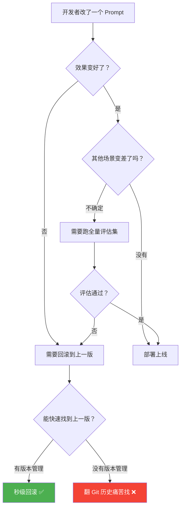
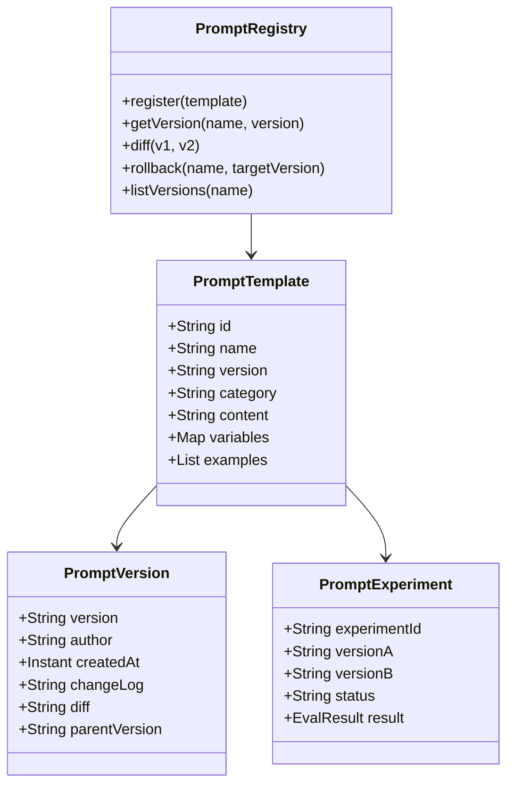
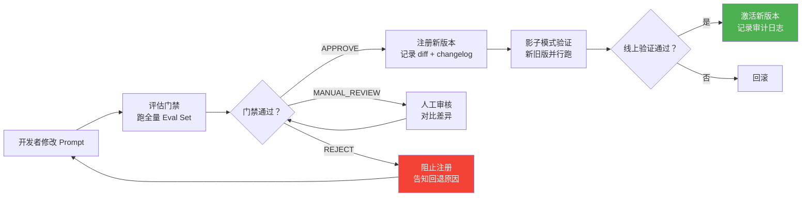
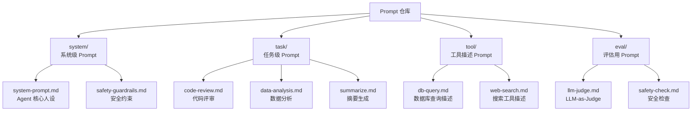

# Agent 特征工程与 Prompt 版本管理

> **一句话**：Prompt 不是"写一次就完"的字符串——它是 Agent 的"源代码"，需要版本管理、差异对比、回滚和 A/B 实验。

---

## 为什么 Prompt 需要版本管理？



**真实场景**：
- 团队 5 个人同时改 Prompt，互相覆盖
- 改完发现某个场景效果暴跌，但不知道改了什么导致
- 需要对比两个 Prompt 版本的效果差异
- 合规审计要求记录"谁在什么时候改了什么"

---

## Prompt 资产模型



---

## 核心实现

### 1. Prompt 注册中心

```java
package com.enterprise.prompt;

import org.springframework.stereotype.Component;
import java.util.*;
import java.util.concurrent.ConcurrentHashMap;

/**
 * Prompt 注册中心
 *
 * 每个 Prompt 有唯一 name + version，支持：
 * - 注册新版本
 * - 按 name+version 精确获取
 * - 版本间 diff
 * - 快速回滚
 */
@Component
public class PromptRegistry {

    // name -> 版本历史（按时间排序）
    private final Map<String, List<PromptVersion>> registry = new ConcurrentHashMap<>();

    // name -> 当前激活版本
    private final Map<String, String> activeVersions = new ConcurrentHashMap<>();

    /**
     * 注册新版本
     */
    public PromptVersion register(String name, String content,
                                   String author, String changeLog) {
        List<PromptVersion> history = registry.computeIfAbsent(
            name, k -> new ArrayList<>());

        String parentVersion = activeVersions.get(name);
        String newVersion = nextVersion(parentVersion, history);

        // 生成 diff
        String diff = parentVersion != null
            ? diffContent(getVersion(name, parentVersion).content(), content)
            : "(initial version)";

        PromptVersion pv = new PromptVersion(
            newVersion, name, content, author,
            Instant.now(), changeLog, diff, parentVersion
        );

        history.add(pv);
        activeVersions.put(name, newVersion);
        return pv;
    }

    /**
     * 获取指定版本
     */
    public PromptVersion getVersion(String name, String version) {
        return registry.getOrDefault(name, List.of()).stream()
            .filter(v -> v.version().equals(version))
            .findFirst()
            .orElseThrow(() -> new IllegalArgumentException(
                "Prompt not found: " + name + "@" + version));
    }

    /**
     * 获取当前激活版本
     */
    public PromptVersion getActive(String name) {
        String version = activeVersions.get(name);
        if (version == null) {
            throw new IllegalArgumentException("No active version for: " + name);
        }
        return getVersion(name, version);
    }

    /**
     * 回滚到指定版本
     */
    public PromptVersion rollback(String name, String targetVersion) {
        PromptVersion target = getVersion(name, targetVersion);
        activeVersions.put(name, targetVersion);
        return target;
    }

    /**
     * 列出所有版本
     */
    public List<PromptVersion> listVersions(String name) {
        return Collections.unmodifiableList(
            registry.getOrDefault(name, List.of()));
    }

    /**
     * 版本号生成：语义化版本
     */
    private String nextVersion(String current, List<PromptVersion> history) {
        if (current == null) return "1.0.0";

        String[] parts = current.split("\\.");
        int major = Integer.parseInt(parts[0]);
        int minor = Integer.parseInt(parts[1]);
        int patch = Integer.parseInt(parts[2]);

        // 判断变更类型
        int changesToday = (int) history.stream()
            .filter(v -> v.createdAt().isAfter(Instant.now().minus(Duration.ofDays(1))))
            .count();

        if (changesToday == 0) {
            return major + "." + (minor + 1) + ".0";  // 新功能
        } else {
            return major + "." + minor + "." + (patch + 1);  // 修复
        }
    }

    /**
     * 简单的行级 diff
     */
    private String diffContent(String old, String newText) {
        String[] oldLines = old.split("\n");
        String[] newLines = newText.split("\n");
        StringBuilder sb = new StringBuilder();

        int maxLen = Math.max(oldLines.length, newLines.length);
        for (int i = 0; i < maxLen; i++) {
            String oldLine = i < oldLines.length ? oldLines[i] : "";
            String newLine = i < newLines.length ? newLines[i] : "";
            if (!oldLine.equals(newLine)) {
                sb.append(String.format("- L%d: %s\n", i + 1, oldLine));
                sb.append(String.format("+ L%d: %s\n", i + 1, newLine));
            }
        }
        return sb.toString();
    }

    public record PromptVersion(
        String version, String name, String content,
        String author, Instant createdAt,
        String changeLog, String diff, String parentVersion
    ) {}
}
```

### 2. Prompt 渲染引擎

```java
package com.enterprise.prompt;

import org.springframework.stereotype.Component;
import java.util.*;

/**
 * Prompt 渲染引擎
 *
 * 将 PromptTemplate + 变量 → 最终发给 LLM 的字符串
 * 支持：变量插值、条件块、Few-shot 动态选择
 */
@Component
public class PromptRenderer {

    private final PromptRegistry registry;

    /**
     * 渲染 Prompt
     */
    public String render(String name, String version, Map<String, Object> variables) {
        PromptRegistry.PromptVersion pv = registry.getVersion(name, version);
        return renderContent(pv.content(), variables);
    }

    /**
     * 渲染当前激活版本
     */
    public String renderActive(String name, Map<String, Object> variables) {
        PromptRegistry.PromptVersion pv = registry.getActive(name);
        return renderContent(pv.content(), variables);
    }

    private String renderContent(String template, Map<String, Object> vars) {
        String result = template;

        // 1. 变量插值 {{var}}
        for (Map.Entry<String, Object> entry : vars.entrySet()) {
            result = result.replace(
                "{{" + entry.getKey() + "}}",
                String.valueOf(entry.getValue())
            );
        }

        // 2. 条件块 {{#if condition}}...{{/if}}
        result = renderConditionals(result, vars);

        // 3. 循环块 {{#each items}}...{{/each}}
        result = renderLoops(result, vars);

        return result;
    }

    private String renderConditionals(String template, Map<String, Object> vars) {
        // {{#if isAdmin}}管理员模式{{/if}}
        var pattern = java.util.regex.Pattern.compile(
            "\\{\\{#if (\\w+)\\}\\}(.*?)\\{\\{/if\\}\\}", Pattern.DOTALL);
        var matcher = pattern.matcher(template);
        StringBuilder sb = new StringBuilder();
        while (matcher.find()) {
            String condition = matcher.group(1);
            String content = matcher.group(2);
            boolean value = Boolean.parseBoolean(
                String.valueOf(vars.getOrDefault(condition, false)));
            matcher.appendReplacement(sb, value ? java.util.regex.Matcher.quoteReplacement(content) : "");
        }
        matcher.appendTail(sb);
        return sb.toString();
    }

    private String renderLoops(String template, Map<String, Object> vars) {
        // {{#each examples}}Q: {{this.question}}\nA: {{this.answer}}{{/each}}
        var pattern = java.util.regex.Pattern.compile(
            "\\{\\{#each (\\w+)\\}\\}(.*?)\\{\\{/each\\}\\}", Pattern.DOTALL);
        var matcher = pattern.matcher(template);
        StringBuilder sb = new StringBuilder();
        while (matcher.find()) {
            String listVar = matcher.group(1);
            String body = matcher.group(2);
            Object value = vars.get(listVar);
            if (value instanceof List<?> list) {
                StringBuilder loopResult = new StringBuilder();
                for (Object item : list) {
                    if (item instanceof Map<?, ?> map) {
                        String rendered = body;
                        for (Map.Entry<?, ?> e : map.entrySet()) {
                            rendered = rendered.replace(
                                "{{this." + e.getKey() + "}}",
                                String.valueOf(e.getValue()));
                        }
                        loopResult.append(rendered);
                    }
                }
                matcher.appendReplacement(sb,
                    java.util.regex.Matcher.quoteReplacement(loopResult.toString()));
            }
        }
        matcher.appendTail(sb);
        return sb.toString();
    }
}
```

### 3. Prompt 评估门禁

```java
package com.enterprise.prompt;

import org.springframework.stereotype.Component;
import java.util.*;

/**
 * Prompt 变更评估门禁
 *
 * 注册新版本前，先跑评估集验证效果不退化
 */
@Component
public class PromptChangeGate {

    private final PromptRegistry registry;
    private final PromptRenderer renderer;
    private final EvalRunner evalRunner;

    /**
     * 评估 Prompt 变更
     */
    public ChangeAssessment assessChange(
            String promptName, String newContent,
            List<EvalCase> evalCases) {

        // 1. 获取当前版本
        PromptRegistry.PromptVersion current = registry.getActive(promptName);

        // 2. 跑旧版评估
        EvalResult oldResult = evalRunner.run(
            evalCases, vars -> renderer.renderContent(current.content(), vars));

        // 3. 跑新版评估
        EvalResult newResult = evalRunner.run(
            evalCases, vars -> renderer.renderContent(newContent, vars));

        // 4. 对比
        double scoreDelta = newResult.averageScore() - oldResult.averageScore();
        List<String> regressions = findRegressions(oldResult, newResult, evalCases);

        ChangeVerdict verdict;
        if (scoreDelta >= 0 && regressions.isEmpty()) {
            verdict = ChangeVerdict.APPROVE;
        } else if (scoreDelta >= -0.05 && regressions.size() <= 2) {
            verdict = ChangeVerdict.MANUAL_REVIEW;
        } else {
            verdict = ChangeVerdict.REJECT;
        }

        return new ChangeAssessment(
            promptName, current.version(),
            oldResult, newResult,
            scoreDelta, regressions, verdict
        );
    }

    private List<String> findRegressions(
            EvalResult old, EvalResult newR, List<EvalCase> cases) {
        List<String> regressions = new ArrayList<>();
        for (EvalCase c : cases) {
            double oldScore = old.scoreFor(c.id());
            double newScore = newR.scoreFor(c.id());
            if (newScore < oldScore - 0.1) {
                regressions.add(String.format(
                    "%s: %.2f → %.2f", c.id(), oldScore, newScore));
            }
        }
        return regressions;
    }

    public record ChangeAssessment(
        String promptName, String currentVersion,
        EvalResult oldResult, EvalResult newResult,
        double scoreDelta, List<String> regressions,
        ChangeVerdict verdict
    ) {}

    public enum ChangeVerdict {
        APPROVE,        // 质量提升或持平，可以注册
        MANUAL_REVIEW,  // 轻微回退，需人工确认
        REJECT          // 严重回退，拒绝注册
    }
}
```

---

## Prompt 变更流水线



---

## Prompt 目录结构



---

## 关键指标

| 指标 | 说明 | 告警阈值 |
|------|------|---------|
| Prompt 变更频率 | 每周变更次数 | > 10 次/周 → 可能不稳定 |
| Prompt 回滚率 | 回滚 / 总变更 | > 15% → 评估门禁失效 |
| 评估门禁通过率 | APPROVE / 总评估 | < 50% → Prompt 设计有系统性问题 |
| 平均版本数 | 每个 Prompt 的版本数 | > 50 → 需要归档旧版本 |
| 线上回退事件 | 上线后发现的回退 | > 0 → 需要加强影子模式 |

---

## 实践清单

- [ ] 每个 Prompt 都有 name + version，不允许"裸字符串"
- [ ] Prompt 变更必须通过评估门禁
- [ ] Prompt 变更有 diff 记录和 changelog
- [ ] 支持秒级回滚到任意历史版本
- [ ] Prompt 仓库有目录结构，分类管理
- [ ] 敏感 Prompt 变更需要审批

→ 返回 [阶段4 目录](../00-README.md)
