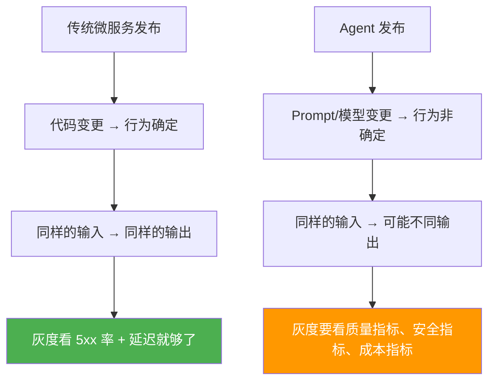
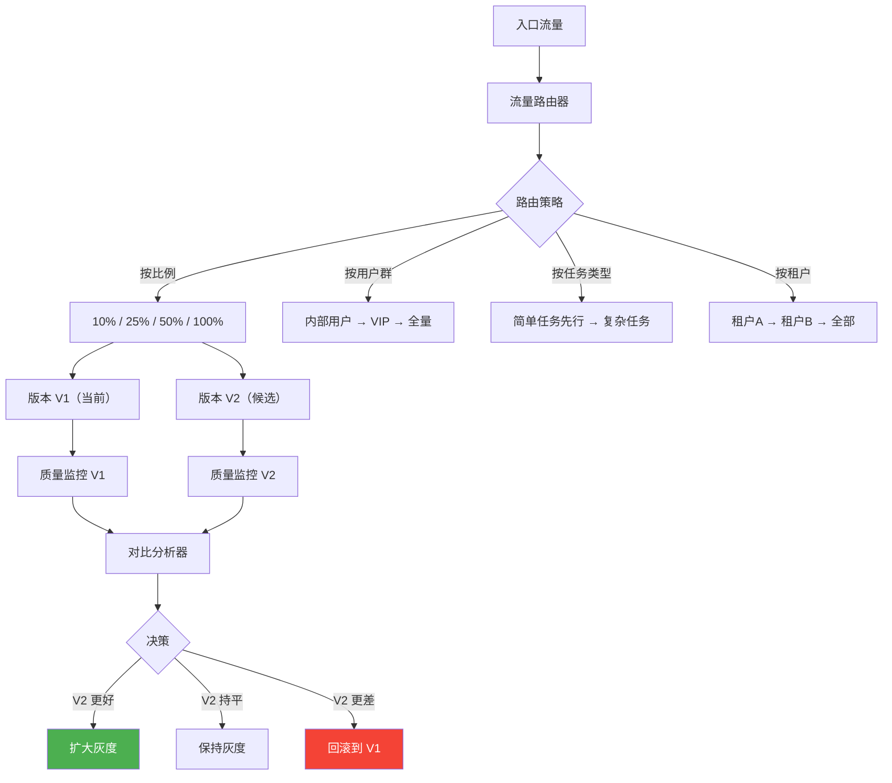
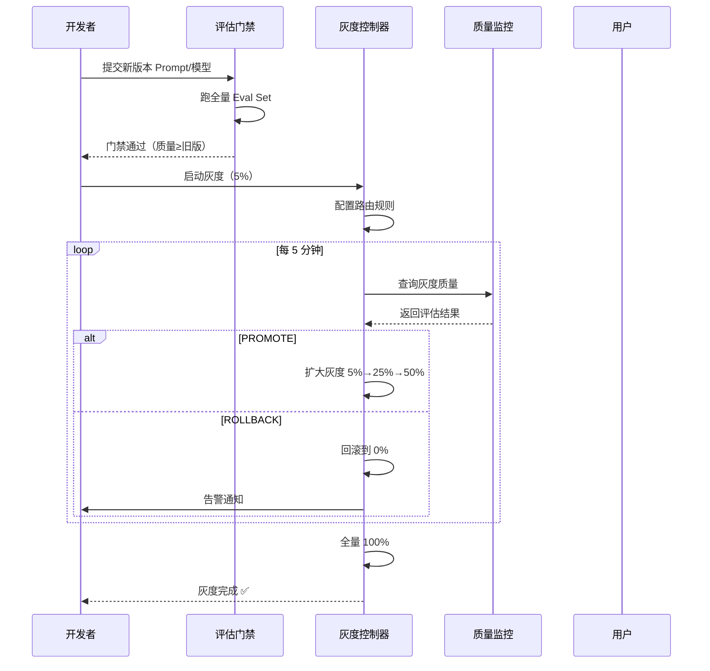
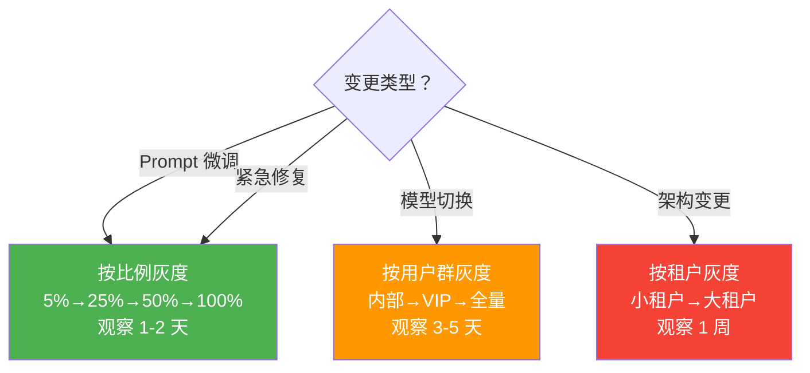

# Agent 灰度发布与流量调度

> **一句话**：Agent 的"非确定性"让发布变成赌命——灰度发布 + 流量调度让你只赌 5% 的流量，赌赢了再放量。

---

## 为什么 Agent 需要特殊灰度策略？



**核心差异**：

| 维度 | 传统微服务 | Agent 服务 |
|------|----------|-----------|
| 输出确定性 | 确定 | 非确定 |
| 质量验证 | 单元测试 | Eval Set + LLM-as-Judge |
| 回退发现时间 | 秒级（5xx） | 分钟级（质量下降） |
| 灰度维度 | 流量比例 | 流量比例 + 用户群体 + 任务类型 |
| 影响范围 | 功能 bug | 可能输出有害内容 |

---

## 灰度发布分层架构



---

## 核心实现

### 1. 多维度流量路由器

```java
package com.enterprise.canary;

import org.springframework.stereotype.Component;
import java.util.*;

/**
 * Agent 灰度流量路由器
 *
 * 支持多维度灰度策略：
 * - 按比例（10% / 25% / 50% / 100%）
 * - 按用户群体（内部 / VIP / 全量）
 * - 按任务类型（简单 / 复杂）
 * - 按租户（逐租户开启）
 */
@Component
public class CanaryRouter {

    private final CanaryConfigStore configStore;

    /**
     * 路由决策：这个请求该走哪个版本？
     */
    public String route(CanaryRequest request) {
        CanaryConfig config = configStore.get(request.agentName());

        // 1. 检查是否命中强制规则
        for (RoutingRule rule : config.rules()) {
            if (rule.matches(request)) {
                return rule.targetVersion();
            }
        }

        // 2. 按比例灰度
        if (config.percentageStrategy() != null) {
            return routeByPercentage(request, config.percentageStrategy());
        }

        // 3. 按用户群体灰度
        if (config.cohortStrategy() != null) {
            String version = routeByCohort(request, config.cohortStrategy());
            if (version != null) return version;
        }

        // 4. 按租户灰度
        if (config.tenantStrategy() != null) {
            String version = routeByTenant(request, config.tenantStrategy());
            if (version != null) return version;
        }

        // 默认走当前稳定版
        return config.stableVersion();
    }

    /**
     * 按比例路由（一致性哈希保证同一用户始终走同一版本）
     */
    private String routeByPercentage(CanaryRequest request,
                                      PercentageStrategy strategy) {
        // 用 sessionId 做一致性哈希
        int hash = Math.abs(request.sessionId().hashCode());
        int bucket = hash % 100;

        if (bucket < strategy.canaryPercentage()) {
            return strategy.canaryVersion();
        }
        return strategy.stableVersion();
    }

    /**
     * 按用户群体路由
     */
    private String routeByCohort(CanaryRequest request,
                                  CohortStrategy strategy) {
        for (CohortRule rule : strategy.rules()) {
            if (matchesCohort(request, rule)) {
                return rule.version();
            }
        }
        return null;
    }

    private boolean matchesCohort(CanaryRequest request, CohortRule rule) {
        return switch (rule.cohort()) {
            case INTERNAL -> request.userEmail().endsWith("@company.com");
            case VIP -> request.userTier() == UserTier.VIP
                     || request.userTier() == UserTier.ENTERPRISE;
            case BETA_TESTERS -> strategy().betaTesters().contains(request.userId());
            case SPECIFIC_TENANTS -> rule.tenantIds().contains(request.tenantId());
        };
    }

    /**
     * 按租户路由
     */
    private String routeByTenant(CanaryRequest request,
                                  TenantStrategy strategy) {
        if (strategy.enabledTenants().contains(request.tenantId())) {
            return strategy.canaryVersion();
        }
        return null;
    }

    // --- Records ---

    public record CanaryRequest(
        String agentName, String sessionId,
        String userId, String userEmail, String tenantId,
        UserTier userTier, String taskType
    ) {}

    public record CanaryConfig(
        String stableVersion,
        PercentageStrategy percentageStrategy,
        CohortStrategy cohortStrategy,
        TenantStrategy tenantStrategy,
        List<RoutingRule> rules
    ) {}

    public record PercentageStrategy(
        String stableVersion, String canaryVersion, int canaryPercentage
    ) {}

    public record CohortStrategy(List<CohortRule> rules) {}

    public record CohortRule(Cohort cohort, String version, Set<String> tenantIds) {}

    public enum Cohort { INTERNAL, VIP, BETA_TESTERS, SPECIFIC_TENANTS }

    public record TenantStrategy(
        String canaryVersion, Set<String> enabledTenants
    ) {}

    public record RoutingRule(
        String condition, String targetVersion, int priority
    ) {
        public boolean matches(CanaryRequest req) {
            // 简化：实际可用 SpEL 或 Drools
            return true;
        }
    }

    public enum UserTier { FREE, PRO, VIP, ENTERPRISE }
}
```

### 2. 灰度质量监控器

```java
package com.enterprise.canary;

import org.springframework.stereotype.Component;
import java.util.*;
import java.util.concurrent.*;

/**
 * 灰度质量监控器
 *
 * 对比新旧版本的质量指标，自动决策是否放量
 */
@Component
public class CanaryQualityMonitor {

    // 每个版本的质量指标滚动窗口
    private final Map<String, QualityWindow> windows = new ConcurrentHashMap<>();

    /**
     * 记录一次请求的质量结果
     */
    public void record(String version, QualityMetric metric) {
        windows.computeIfAbsent(version, k -> new QualityWindow())
               .add(metric);
    }

    /**
     * 评估灰度版本表现
     */
    public CanaryAssessment assess(String stableVersion,
                                    String canaryVersion,
                                    CanaryThresholds thresholds) {
        QualityWindow stable = windows.get(stableVersion);
        QualityWindow canary = windows.get(canaryVersion);

        if (canary == null || canary.size() < thresholds.minSampleSize()) {
            return new CanaryAssessment(
                CanaryVerdict.INSUFFICIENT_DATA,
                "样本不足，继续收集", null, null);
        }

        // 计算各维度指标
        MetricComparison quality = compareMetric(
            stable.avgQualityScore(), canary.avgQualityScore(),
            thresholds.maxQualityRegression());

        MetricComparison safety = compareMetric(
            stable.safetyViolationRate(), canary.safetyViolationRate(),
            thresholds.maxSafetyRegression());

        MetricComparison latency = compareMetric(
            stable.p95LatencyMs(), canary.p95LatencyMs(),
            thresholds.maxLatencyRegression());

        MetricComparison cost = compareMetric(
            stable.avgCostPerRequest(), canary.avgCostPerRequest(),
            thresholds.maxCostRegression());

        // 综合判定
        List<String> issues = new ArrayList<>();
        if (quality.isRegression()) issues.add("质量回退: " + quality);
        if (safety.isRegression()) issues.add("安全回退: " + safety);
        if (latency.isRegression()) issues.add("延迟回退: " + latency);
        if (cost.isRegression()) issues.add("成本增长: " + cost);

        CanaryVerdict verdict;
        if (issues.isEmpty()) {
            verdict = CanaryVerdict.PROMOTE;
        } else if (issues.size() == 1 && !safety.isRegression()) {
            verdict = CanaryVerdict.HOLD;
        } else {
            verdict = CanaryVerdict.ROLLBACK;
        }

        return new CanaryAssessment(verdict,
            issues.isEmpty() ? "可以扩大灰度" : String.join("; ", issues),
            quality, safety);
    }

    private MetricComparison compareMetric(
            double stable, double canary, double threshold) {
        double delta = canary - stable;
        boolean regression = Math.abs(delta) > threshold
                           && delta < 0;  // 越大越好的指标
        return new MetricComparison(stable, canary, delta, regression);
    }

    // --- Records ---

    public record QualityMetric(
        double qualityScore,   // 0-1，LLM-as-Judge 评分
        boolean safetyViolation,
        long latencyMs,
        double costPerRequest
    ) {}

    public record CanaryThresholds(
        int minSampleSize,            // 最少样本量
        double maxQualityRegression,  // 最大允许质量下降
        double maxSafetyRegression,   // 最大允许安全下降
        double maxLatencyRegression,  // 最大允许延迟增长
        double maxCostRegression      // 最大允许成本增长
    ) {}

    public record CanaryAssessment(
        CanaryVerdict verdict,
        String reason,
        MetricComparison quality,
        MetricComparison safety
    ) {}

    public record MetricComparison(
        double stable, double canary,
        double delta, boolean isRegression
    ) {}

    public enum CanaryVerdict {
        PROMOTE,           // 质量持平或更好，扩大灰度
        HOLD,              // 轻微回退，保持观察
        ROLLBACK,          // 严重回退，立即回滚
        INSUFFICIENT_DATA  // 样本不足
    }

    /**
     * 滚动窗口（最近 N 条）
     */
    static class QualityWindow {
        private final Queue<QualityMetric> queue = new LinkedList<>();
        private static final int MAX_SIZE = 1000;

        void add(QualityMetric m) {
            queue.offer(m);
            if (queue.size() > MAX_SIZE) queue.poll();
        }

        int size() { return queue.size(); }

        double avgQualityScore() {
            return queue.stream().mapToDouble(QualityMetric::qualityScore).average().orElse(1.0);
        }

        double safetyViolationRate() {
            return (double) queue.stream().filter(QualityMetric::safetyViolation).count() / queue.size();
        }

        double p95LatencyMs() {
            List<Long> latencies = queue.stream().mapToLong(QualityMetric::latencyMs).sorted().boxed().toList();
            return latencies.get((int)(latencies.size() * 0.95));
        }

        double avgCostPerRequest() {
            return queue.stream().mapToDouble(QualityMetric::costPerRequest).average().orElse(0);
        }
    }
}
```

### 3. 自动放量控制器

```java
package com.enterprise.canary;

import org.springframework.stereotype.Component;

/**
 * 自动放量控制器
 *
 * 5% → 25% → 50% → 100%
 * 每一步都验证质量指标，不合格自动回滚
 */
@Component
public class AutoPromotionController {

    private final CanaryRouter router;
    private final CanaryQualityMonitor monitor;
    private final CanaryConfigStore configStore;

    // 放量阶梯
    private static final int[] STAGES = {5, 25, 50, 100};

    /**
     * 定时检查，自动放量或回滚
     */
    public void tick() {
        for (String agentName : configStore.getActiveCanaries()) {
            CanaryConfig config = configStore.get(agentName);

            CanaryQualityMonitor.CanaryAssessment assessment =
                monitor.assess(
                    config.stableVersion(),
                    config.percentageStrategy().canaryVersion(),
                    config.thresholds()
                );

            switch (assessment.verdict()) {
                case PROMOTE -> promote(agentName, config);
                case ROLLBACK -> rollback(agentName, config, assessment.reason());
                case HOLD -> {} // 保持
                case INSUFFICIENT_DATA -> {} // 等待更多数据
            }
        }
    }

    private void promote(String agentName, CanaryConfig config) {
        int current = config.percentageStrategy().canaryPercentage();
        int nextStage = findNextStage(current);

        if (nextStage == 100) {
            // 完成灰度，新版本成为稳定版
            configStore.completeCanary(agentName,
                config.percentageStrategy().canaryVersion());
            log("[{}] 灰度完成，新版本 {} 已全量上线", agentName,
                config.percentageStrategy().canaryVersion());
        } else {
            configStore.updatePercentage(agentName, nextStage);
            log("[{}] 扩大灰度: {}% → {}%", agentName, current, nextStage);
        }
    }

    private void rollback(String agentName, CanaryConfig config, String reason) {
        configStore.updatePercentage(agentName, 0);
        log("[{}] 灰度回滚！原因: {}", agentName, reason);
        // 发送告警
        alertingService.sendAlert(
            "Agent 灰度回滚: " + agentName,
            "候选版本: " + config.percentageStrategy().canaryVersion()
            + "\n回滚原因: " + reason);
    }

    private int findNextStage(int current) {
        for (int stage : STAGES) {
            if (stage > current) return stage;
        }
        return 100;
    }

    private void log(String format, Object... args) {
        System.getLogger("Canary").log(System.Logger.Level.INFO,
            String.format(format, args));
    }
}
```

---

## 灰度发布完整流程



---

## 灰度策略选择矩阵



---

## 关键指标看板

| 指标 | 说明 | 健康范围 |
|------|------|---------|
| 灰度覆盖率 | canary 版本流量占比 | 按阶梯递增 |
| 质量差值 | canary vs stable 质量分 | > -0.05 |
| 安全违规率 | canary 版本安全违规 | = 0 |
| P95 延迟差值 | canary vs stable 延迟 | < +200ms |
| 单请求成本差值 | canary vs stable 成本 | < +10% |
| 回滚率 | 近 30 天回滚次数 | < 15% |

→ 返回 [阶段4 目录](../00-README.md)
