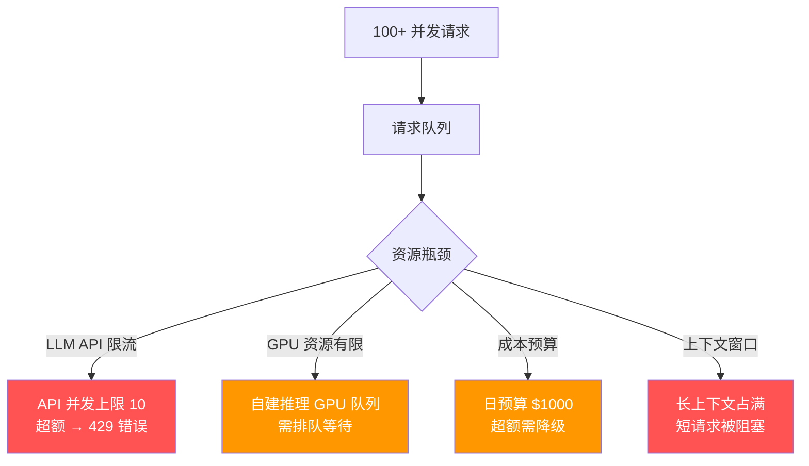
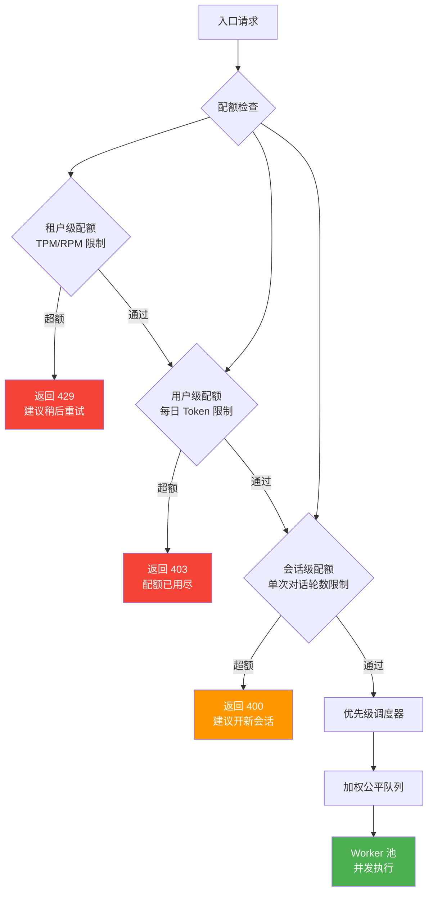

# Agent 资源配额与优先级调度

> **一句话**：当 100 个用户同时调 Agent，你的 LLM API 额度只够 10 个并发——资源配额和优先级调度决定谁先得到服务。

---

## 问题场景



**如果不做配额和调度**：
- VIP 用户和免费用户抢同一个队列
- 一个用户发 100 个请求，阻塞所有其他人
- 简单查询（1s）排在复杂任务（30s）后面
- 成本预算上午用完，下午直接宕机

---

## 多级资源配额架构



---

## 核心实现

### 1. 多级配额管理器

```java
package com.enterprise.quota;

import org.springframework.stereotype.Component;
import java.util.*;
import java.util.concurrent.*;
import java.util.concurrent.atomic.*;

/**
 * 多级资源配额管理器
 *
 * 三级配额：
 * - 租户级：TPM (Tokens Per Minute) / RPM (Requests Per Minute)
 * - 用户级：每日 Token 预算
 * - 会话级：单次对话最大轮数
 */
@Component
public class QuotaManager {

    // 租户 TPM 滑动窗口
    private final Map<String, SlidingWindow> tenantTpmWindows = new ConcurrentHashMap<>();
    // 用户每日 Token 计数器
    private final Map<String, DailyTokenCounter> userDailyCounters = new ConcurrentHashMap<>();
    // 会话轮数计数器
    private final Map<String, AtomicInteger> sessionTurnCounters = new ConcurrentHashMap<>();

    private final QuotaConfigStore configStore;

    /**
     * 检查请求是否通过配额
     */
    public QuotaCheckResult check(QuotaRequest request) {
        // 1. 租户级 RPM 检查
        QuotaConfig tenantConfig = configStore.getTenantConfig(request.tenantId());
        SlidingWindow rpmWindow = tenantTpmWindows.computeIfAbsent(
            request.tenantId() + ":rpm", k -> new SlidingWindow(60));
        if (!rpmWindow.tryAcquire(1, tenantConfig.maxRpm())) {
            return QuotaCheckResult.reject("租户 RPM 超限", 429, 60);
        }

        // 2. 租户级 TPM 检查（预估 Token 数）
        int estimatedTokens = estimateTokens(request);
        SlidingWindow tpmWindow = tenantTpmWindows.computeIfAbsent(
            request.tenantId() + ":tpm", k -> new SlidingWindow(60));
        if (!tpmWindow.tryAcquire(estimatedTokens, tenantConfig.maxTpm())) {
            return QuotaCheckResult.reject("租户 TPM 超限", 429, 60);
        }

        // 3. 用户每日 Token 预算检查
        DailyTokenCounter counter = userDailyCounters.computeIfAbsent(
            request.userId(), k -> new DailyTokenCounter());
        int userLimit = configStore.getUserDailyLimit(request.userId());
        if (counter.getAndCheck() + estimatedTokens > userLimit) {
            return QuotaCheckResult.reject("用户每日 Token 预算用尽", 403, 86400);
        }

        // 4. 会话轮数检查
        AtomicInteger turns = sessionTurnCounters.computeIfAbsent(
            request.sessionId(), k -> new AtomicInteger(0));
        int maxTurns = configStore.getSessionMaxTurns(request.tenantId());
        if (turns.incrementAndGet() > maxTurns {
            return QuotaCheckResult.reject("会话轮数超限", 400, 0);
        }

        return QuotaCheckResult.allow(estimatedTokens);
    }

    /**
     * 记录实际 Token 消耗（修正预估）
     */
    public void recordActual(String userId, String tenantId,
                              int estimatedTokens, int actualTokens) {
        // 修正用户每日计数
        DailyTokenCounter counter = userDailyCounters.get(userId);
        if (counter != null) {
            counter.adjust(estimatedTokens, actualTokens);
        }
    }

    private int estimateTokens(QuotaRequest req) {
        // 粗略估算：输入 Token + 预估输出 Token
        int inputTokens = req.inputText().length() * 2;  // 中文约 2 Token/字
        int estimatedOutput = 500;  // 默认预估 500 输出 Token
        return inputTokens + estimatedOutput;
    }

    /**
     * 滑动窗口限流器
     */
    static class SlidingWindow {
        private final Queue<Long> timestamps = new ConcurrentLinkedQueue<>();
        private final AtomicInteger totalCost = new AtomicInteger(0);
        private final int windowSeconds;

        SlidingWindow(int windowSeconds) {
            this.windowSeconds = windowSeconds;
        }

        synchronized boolean tryAcquire(int cost, int limit) {
            long now = System.currentTimeMillis();
            long cutoff = now - windowSeconds * 1000L;

            // 清理过期
            while (!timestamps.isEmpty()) {
                Long ts = timestamps.peek();
                if (ts < cutoff) {
                    timestamps.poll();
                } else {
                    break;
                }
            }

            // 检查限额
            if (totalCost.get() + cost > limit) {
                return false;
            }

            timestamps.offer(now);
            totalCost.addAndGet(cost);
            return true;
        }
    }

    /**
     * 每日 Token 计数器（每天 UTC 0 点重置）
     */
    static class DailyTokenCounter {
        private final AtomicInteger tokens = new AtomicInteger(0);
        private volatile LocalDate date = LocalDate.now(ZoneOffset.UTC);

        int getAndCheck() {
            resetIfNewDay();
            return tokens.get();
        }

        void adjust(int estimated, int actual) {
            resetIfNewDay();
            tokens.addAndGet(actual - estimated);
        }

        private void resetIfNewDay() {
            LocalDate today = LocalDate.now(ZoneOffset.UTC);
            if (!today.equals(date)) {
                date = today;
                tokens.set(0);
            }
        }
    }

    // --- Records ---

    public record QuotaRequest(
        String tenantId, String userId, String sessionId,
        String inputText, int estimatedInputTokens
    ) {}

    public record QuotaCheckResult(
        boolean allowed, String reason,
        int httpStatus, int retryAfterSeconds
    ) {
        static QuotaCheckResult allow(int estimatedTokens) {
            return new QuotaCheckResult(true, null, 200, 0);
        }

        static QuotaCheckResult reject(String reason, int status, int retryAfter) {
            return new QuotaCheckResult(false, reason, status, retryAfter);
        }
    }

    public record QuotaConfig(int maxRpm, int maxTpm, int maxConcurrent) {}
}
```

### 2. 加权优先级调度器

```java
package com.enterprise.quota;

import org.springframework.stereotype.Component;
import java.util.*;
import java.util.concurrent.*;

/**
 * 加权公平队列调度器
 *
 * 不是先到先服务，而是按优先级和权重分配执行资源
 *
 * VIP 用户 → P0（最高优先级）
 * 付费用户 → P1
 * 免费用户 → P2
 * 内部批处理 → P3（最低优先级）
 */
@Component
public class PriorityScheduler {

    // 四个优先级队列
    private final Map<Priority, BlockingQueue<PrioritizedTask>> queues = new ConcurrentHashMap<>();
    // 每个 Worker 的信号量
    private final Semaphore workerSlots;

    /**
     * 提交任务到调度器
     */
    public <T> CompletableFuture<T> submit(
            String userId, String tenantId,
            Priority priority, Callable<T> task) {

        PrioritizedTask<T> pt = new PrioritizedTask<>(
            userId, tenantId, priority, task);

        queues.computeIfAbsent(priority, k -> new LinkedBlockingQueue<>())
              .offer(pt);

        // 异步执行
        return pt.future;
    }

    /**
     * Worker 线程：按优先级取任务执行
     */
    private void workerLoop() {
        while (!Thread.currentThread().isInterrupted()) {
            try {
                workerSlots.acquire();
                PrioritizedTask task = selectNextTask();

                if (task != null) {
                    CompletableFuture.supplyAsync(() -> {
                        try {
                            return task.task().call();
                        } catch (Exception e) {
                            throw new CompletionException(e);
                        }
                    }, executor).whenComplete((result, error) -> {
                        workerSlots.release();
                        if (error != null) {
                            task.future().completeExceptionally(error);
                        } else {
                            task.future().complete(result);
                        }
                    });
                } else {
                    workerSlots.release();
                    Thread.sleep(50); // 短暂等待
                }
            } catch (InterruptedException e) {
                Thread.currentThread().interrupt();
            }
        }
    }

    /**
     * 按优先级选择下一个任务
     *
     * 策略：严格优先级 + 防饥饿
     * - P0 队列非空 → 总是先执行 P0
     * - P0 连续执行 > 10 次时 → 让 P1 执行 1 次（防饥饿）
     */
    private PrioritizedTask selectNextTask() {
        // 防饥饿：每隔 N 次高优先级任务，执行一次低优先级
        if (consecutiveHighPriority.get() > STARVATION_THRESHOLD) {
            for (int p = 2; p >= 0; p--) {
                PrioritizedTask task = queues.get(Priority.fromValue(p))?.poll();
                if (task != null) {
                    consecutiveHighPriority.set(0);
                    return task;
                }
            }
        }

        // 严格优先级
        for (Priority p : Priority.values()) {
            PrioritizedTask task = queues.get(p).poll();
            if (task != null) {
                if (p.value() <= 1) consecutiveHighPriority.incrementAndGet();
                return task;
            }
        }
        return null;
    }

    private final AtomicInteger consecutiveHighPriority = new AtomicInteger(0);
    private static final int STARVATION_THRESHOLD = 10;
    private final ExecutorService executor;

    public enum Priority {
        P0_CRITICAL(0),   // VIP 用户、安全关键
        P1_HIGH(1),       // 付费用户
        P2_NORMAL(2),     // 免费用户
        P3_LOW(3);        // 批处理、后台任务

        private final int value;
        Priority(int v) { this.value = v; }
        public int value() { return value; }
        public static Priority fromValue(int v) {
            return Arrays.stream(values()).filter(p -> p.value == v).findFirst().orElse(P2_NORMAL);
        }
    }

    record PrioritizedTask<T>(
        String userId, String tenantId,
        Priority priority, Callable<T> task,
        CompletableFuture<T> future
    ) {
        PrioritizedTask(String userId, String tenantId,
                        Priority priority, Callable<T> task) {
            this(userId, tenantId, priority, task, new CompletableFuture<>());
        }
    }
}
```

### 3. 成本预算控制器

```java
package com.enterprise.quota;

import org.springframework.stereotype.Component;
import java.util.concurrent.atomic.*;

/**
 * 成本预算控制器
 *
 * 每日成本预算耗尽前 → 自动降级（从大模型切到小模型）
 * 预算完全耗尽 → 拒绝请求
 */
@Component
public class CostBudgetController {

    private final AtomicDouble dailySpend = new AtomicDouble(0);
    private final AtomicReference<LocalDate> currentDate = new AtomicReference<>(LocalDate.now());
    private volatile DegradationLevel currentDegradation = DegradationLevel.NONE;

    private final BudgetConfig config;

    /**
     * 请求前检查预算状态
     */
    public BudgetDecision checkBudget(String model, int estimatedTokens) {
        resetIfNewDay();
        double estimatedCost = calculateCost(model, estimatedTokens);
        double projectedTotal = dailySpend.get() + estimatedCost;

        return switch (currentDegradation) {
            case NONE -> {
                if (projectedTotal > config.dailyBudget() * config.warningThreshold()) {
                    yield BudgetDecision.warn(estimatedCost);
                }
                yield BudgetDecision.allow(estimatedCost);
            }
            case DEGRADED -> {
                // 强制使用小模型
                if (model.equals(config.cheapModel())) {
                    yield BudgetDecision.allow(estimatedCost);
                }
                yield BudgetDecision.degrade(config.cheapModel(),
                    "成本预警，切换到经济模型");
            }
            case EMERGENCY -> {
                if (projectedTotal > config.dailyBudget()) {
                    yield BudgetDecision.reject("每日预算已耗尽");
                }
                yield BudgetDecision.allow(estimatedCost);
            }
        };
    }

    /**
     * 定时评估降级状态
     */
    public void evaluateDegradation() {
        double spend = dailySpend.get();
        double budget = config.dailyBudget();

        if (spend > budget * config.emergencyThreshold()) {
            currentDegradation = DegradationLevel.EMERGENCY;
        } else if (spend > budget * config.degradationThreshold()) {
            currentDegradation = DegradationLevel.DEGRADED;
        } else {
            currentDegradation = DegradationLevel.NONE;
        }
    }

    private void resetIfNewDay() {
        LocalDate today = LocalDate.now();
        if (!today.equals(currentDate.get())) {
            currentDate.set(today);
            dailySpend.set(0);
            currentDegradation = DegradationLevel.NONE;
        }
    }

    private double calculateCost(String model, int tokens) {
        return tokens / 1_000_000.0 * config.pricePerMillionTokens(model);
    }

    public record BudgetDecision(
        Action action, double estimatedCost,
        String alternativeModel, String reason
    ) {
        static BudgetDecision allow(double cost) {
            return new BudgetDecision(Action.ALLOW, cost, null, null);
        }
        static BudgetDecision warn(double cost) {
            return new BudgetDecision(Action.ALLOW_WITH_WARNING, cost, null,
                "成本预警");
        }
        static BudgetDecision degrade(String altModel, String reason) {
            return new BudgetDecision(Action.DEGRADE, 0, altModel, reason);
        }
        static BudgetDecision reject(String reason) {
            return new BudgetDecision(Action.REJECT, 0, null, reason);
        }
    }

    public enum Action { ALLOW, ALLOW_WITH_WARNING, DEGRADE, REJECT }
    public enum DegradationLevel { NONE, DEGRADED, EMERGENCY }
}
```

---

## 降级策略决策树

```mermaid
flowchart TD
    Req["新请求"] --> Budget{"预算检查"}
    Budget -->|"正常"| Full["完整服务<br/>大模型 + 全功能"]
    Budget -->|"接近阈值 80%"|"降级 Level 1<br/>小模型 + 全功能"
    Budget -->|"超过阈值 90%"|"降级 Level 2<br/>小模型 + 关闭非核心功能"
    Budget -->|"预算耗尽 100%"|"降级 Level 3<br/>只读模式 / 排队等待"

    style Full fill:#4caf50,color:#fff
    style Level1 fill:#ffc107,color:#000
    style Level2 fill:#ff9800,color:#fff
    style Level3 fill:#f44336,color:#fff
```

---

## 优先级分配矩阵

| 用户类型 | 优先级 | 并发配额 | 模型选择 | 特性 |
|---------|--------|---------|---------|------|
| VIP/Enterprise | P0 | 无限制 | 最强模型 | 所有功能 + 优先支持 |
| Pro/付费 | P1 | 10 并发 | 强模型 | 所有功能 |
| Free/免费 | P2 | 3 并发 | 经济模型 | 基础功能 |
| 内部批处理 | P3 | 后台执行 | 小模型 | 低优先级队列 |

→ 返回 [阶段4 目录](../00-README.md)
