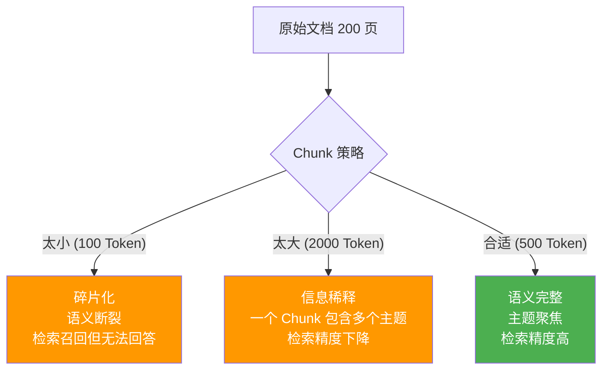
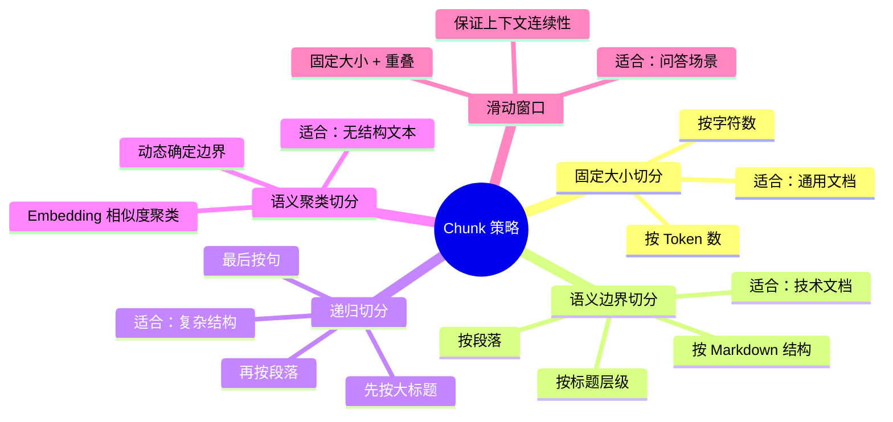
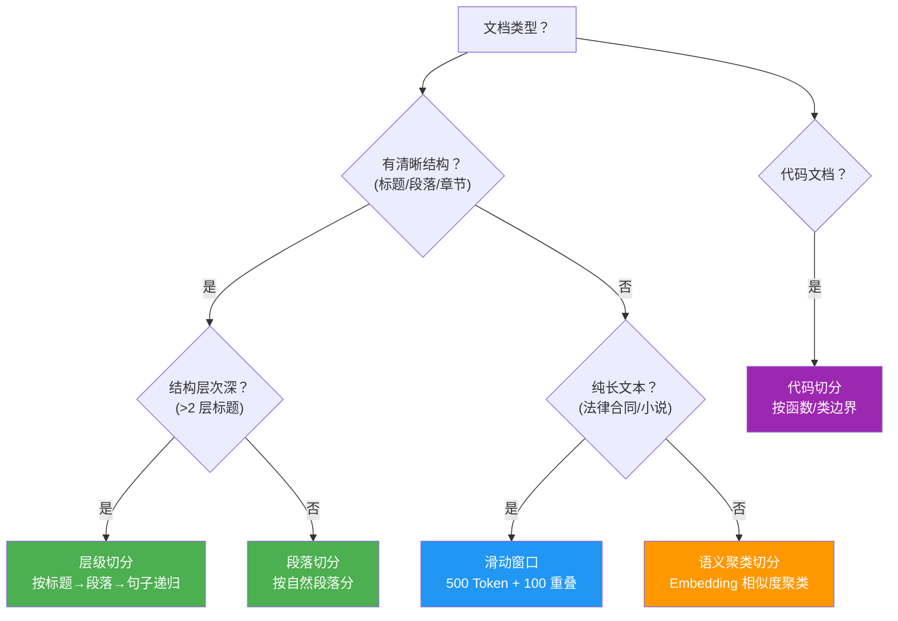

# Agent 长文本处理与 Chunk 策略

> **一句话**：用户丢给你一份 200 页 PDF——直接塞进 LLM 会被 Token 上限拒收，塞不进去就得切——怎么切直接决定了 RAG 的效果。

---

## 为什么 Chunk 策略决定 RAG 生死？



**Chunk 的三重影响**：

| 影响维度 | Chunk 太小 | Chunk 太大 | Chunk 合适 |
|---------|-----------|-----------|-----------|
| 检索召回率 | 高（多个命中） | 低（一个 Chunk 覆盖广） | 适中 |
| 检索精度 | 低（语义碎片） | 低（主题混杂） | 高 |
| 上下文质量 | 差（信息断裂） | 差（噪声太多） | 好 |
| Token 消耗 | 低 | 高 | 适中 |

---

## Chunk 策略全景



---

## 核心实现

### 1. 固定大小切分（最简单）

```java
package com.enterprise.chunk;

import org.springframework.stereotype.Component;
import java.util.*;

/**
 * 固定大小 Token 切分器
 *
 * 简单但有效。核心参数：
 * - chunkSize：每个 Chunk 的目标 Token 数
 * - overlap：相邻 Chunk 的重叠 Token 数（保证上下文连续）
 */
@Component
public class FixedSizeChunker {

    /**
     * 按固定大小 + 重叠切分
     */
    public List<Chunk> chunk(String text, int chunkSize, int overlap) {
        List<Chunk> chunks = new ArrayList<>();

        // 按 Token 分词（简化：按字符）
        String[] tokens = text.split("(?<=\\s)");
        int pos = 0;
        int chunkIndex = 0;

        while (pos < tokens.length) {
            int end = Math.min(pos + chunkSize, tokens.length);

            String content = String.join("", Arrays.copyOfRange(tokens, pos, end));

            chunks.add(new Chunk(
                content,
                chunkIndex++,
                pos,                    // startPos
                end,                    // endPos
                estimateTokens(content)
            ));

            // 下一个 Chunk 的起始位置（后退 overlap）
            pos += chunkSize - overlap;
            if (pos >= tokens.length) break;
        }

        return chunks;
    }

    private int estimateTokens(String text) {
        return (int) (text.length() * 1.5);
    }

    public record Chunk(
        String content, int index,
        int startPos, int endPos, int tokenCount
    ) {}
}
```

### 2. 语义边界切分（推荐）

```java
package com.enterprise.chunk;

import org.springframework.stereotype.Component;
import java.util.*;
import java.util.regex.*;

/**
 * 语义边界切分器
 *
 * 不在句子中间断开，优先在自然边界（段落、标题、句号）处切分
 */
@Component
public class SemanticChunker {

    // 分隔符优先级（从高到低）
    private static final String[] SEPARATORS = {
        "\n## ",     // Markdown 二级标题
        "\n### ",    // Markdown 三级标题
        "\n\n",      // 段落
        "\n",        // 行
        "。",        // 中文句号
        ". ",        // 英文句号
        "；",        // 中文分号
        "; ",        // 英文分号
        "，",        // 中文逗号
        ", ",        // 英文逗号
        " "          // 空格（最后手段）
    };

    /**
     * 递归语义切分
     *
     * 先尝试用最高优先级的分隔符，如果 Chunk 还太大，递归用次级分隔符
     */
    public List<Chunk> chunk(String text, int maxTokens, int overlapTokens) {
        List<Chunk> result = new ArrayList<>();
        List<String> splits = recursiveSplit(text, maxTokens, 0);
        mergeAndCreate(splits, maxTokens, overlapTokens, result);
        return result;
    }

    /**
     * 递归切分
     */
    private List<String> recursiveSplit(String text, int maxTokens, int separatorIdx) {
        // 如果已经够小，直接返回
        if (estimateTokens(text) <= maxTokens) {
            return List.of(text);
        }

        // 用完所有分隔符还是太大 → 硬切
        if (separatorIdx >= SEPARATORS.length) {
            return hardSplit(text, maxTokens);
        }

        String separator = SEPARATORS[separatorIdx];
        String[] parts = text.split(Pattern.quote(separator));

        List<String> result = new ArrayList<>();
        for (String part : parts) {
            if (estimateTokens(part) <= maxTokens) {
                result.add(part + separator);
            } else {
                // 递归用次级分隔符
                result.addAll(recursiveSplit(part, maxTokens, separatorIdx + 1));
            }
        }
        return result;
    }

    /**
     * 合并过小的块 + 添加重叠
     */
    private void mergeAndCreate(List<String> splits, int maxTokens,
                                 int overlapTokens, List<Chunk> result) {
        StringBuilder current = new StringBuilder();
        int currentTokens = 0;
        int index = 0;

        for (String split : splits) {
            int splitTokens = estimateTokens(split);

            // 合并
            if (currentTokens + splitTokens <= maxTokens) {
                current.append(split);
                currentTokens += splitTokens;
            } else {
                // 保存当前 Chunk
                if (currentTokens > 0) {
                    result.add(new Chunk(
                        current.toString().trim(), index++,
                        0, 0, currentTokens));
                }

                // 保留重叠部分
                String overlapText = extractOverlap(current.toString(), overlapTokens);
                current = new StringBuilder(overlapText);
                current.append(split);
                currentTokens = estimateTokens(overlapText) + splitTokens;
            }
        }

        // 最后一个 Chunk
        if (currentTokens > 0) {
            result.add(new Chunk(
                current.toString().trim(), index,
                0, 0, currentTokens));
        }
    }

    private String extractOverlap(String text, int overlapTokens) {
        if (overlapTokens <= 0) return "";
        String[] sentences = text.split("(?<=[。.])");
        StringBuilder sb = new StringBuilder();
        int tokens = 0;
        for (int i = sentences.length - 1; i >= 0; i--) {
            int sentTokens = estimateTokens(sentences[i]);
            if (tokens + sentTokens > overlapTokens) break;
            sb.insert(0, sentences[i]);
            tokens += sentTokens;
        }
        return sb.toString();
    }

    private List<String> hardSplit(String text, int maxTokens) {
        List<String> result = new ArrayList<>();
        int charLimit = (int) (maxTokens / 1.5);
        for (int i = 0; i < text.length(); i += charLimit) {
            result.add(text.substring(i, Math.min(i + charLimit, text.length())));
        }
        return result;
    }

    private int estimateTokens(String text) {
        return (int) (text.length() * 1.5);
    }

    public record Chunk(String content, int index, int startPos, int endPos, int tokenCount) {}
}
```

### 3. Chunk 质量评估器

```java
package com.enterprise.chunk;

import org.springframework.stereotype.Component;
import java.util.*;

/**
 * Chunk 质量评估器
 *
 * 切完后评估 Chunk 质量，发现以下问题：
 * - 碎片化：太多极小 Chunk
 * - 语义断裂：句子被切断
 * - 信息丢失：关键内容被遗漏
 */
@Component
public class ChunkQualityAssessor {

    /**
     * 评估 Chunk 列表的质量
     */
    public ChunkQualityReport assess(List<SemanticChunker.Chunk> chunks) {
        int total = chunks.size();

        // 1. 大小分布
        double avgTokens = chunks.stream()
            .mapToInt(SemanticChunker.Chunk::tokenCount)
            .average().orElse(0);

        int tooSmall = (int) chunks.stream()
            .filter(c -> c.tokenCount() < 50).count();

        int tooLarge = (int) chunks.stream()
            .filter(c -> c.tokenCount() > 1500).count();

        // 2. 语义完整性检查
        int cutSentences = 0;
        for (SemanticChunker.Chunk c : chunks) {
            String content = c.content().trim();
            // 检查是否以句末标点结尾
            if (!content.endsWith("。") && !content.endsWith(".")
                && !content.endsWith("!") && !content.endsWith("?")
                && !content.endsWith("！") && !content.endsWith("？")) {
                cutSentences++;
            }
        }

        // 3. 重复率检查（重叠导致的重复）
        // 通过计算 Chunk 之间的文本相似度
        double avgSimilarity = calculateAvgSimilarity(chunks);

        // 4. 综合评分
        double score = calculateScore(total, avgTokens, tooSmall, tooLarge,
                                       cutSentences, avgSimilarity);

        List<String> issues = new ArrayList<>();
        if (tooSmall > total * 0.2) issues.add("碎片化：超过 20% 的 Chunk 小于 50 Token");
        if (tooLarge > total * 0.1) issues.add("过大 Chunk：超过 10% 的 Chunk 大于 1500 Token");
        if (cutSentences > total * 0.3) issues.add("语义断裂：超过 30% 的 Chunk 句子被切断");
        if (avgSimilarity > 0.5) issues.add("重复率过高：Chunk 之间平均相似度 > 0.5");

        return new ChunkQualityReport(
            total, avgTokens, tooSmall, tooLarge,
            cutSentences, avgSimilarity, score, issues
        );
    }

    private double calculateAvgSimilarity(List<SemanticChunker.Chunk> chunks) {
        // 简化：用 Jaccard 相似度
        // 实际可用 Embedding 余弦相似度
        if (chunks.size() < 2) return 0;
        double totalSim = 0;
        int pairs = 0;
        for (int i = 0; i < chunks.size() - 1; i++) {
            double sim = jaccardSimilarity(
                chunks.get(i).content(),
                chunks.get(i + 1).content());
            totalSim += sim;
            pairs++;
        }
        return totalSim / pairs;
    }

    private double jaccardSimilarity(String a, String b) {
        Set<String> setA = Set.of(a.split("\\s+"));
        Set<String> setB = Set.of(b.split("\\s+"));
        Set<String> intersection = new HashSet<>(setA);
        intersection.retainAll(setB);
        Set<String> union = new HashSet<>(setA);
        union.addAll(setB);
        return union.isEmpty() ? 0 : (double) intersection.size() / union.size();
    }

    private double calculateScore(int total, double avgTokens,
                                   int tooSmall, int tooLarge,
                                   int cutSentences, double avgSim) {
        double score = 100;
        score -= (tooSmall * 5.0 / total) * 20;   // 碎片扣分
        score -= (tooLarge * 5.0 / total) * 15;   // 过大扣分
        score -= (cutSentences * 5.0 / total) * 25; // 断裂扣分
        score -= avgSim * 20;                       // 重复扣分
        return Math.max(0, score);
    }

    public record ChunkQualityReport(
        int totalChunks, double avgTokens,
        int tooSmallChunks, int tooLargeChunks,
        int cutSentences, double avgSimilarity,
        double score, List<String> issues
    ) {}
}
```

---

## Chunk 策略选择决策树



---

## 推荐参数

| 文档类型 | chunkSize (Token) | overlap (Token) | 分隔符策略 |
|---------|-------------------|----------------|-----------|
| 技术文档 | 500-800 | 100-150 | Markdown 标题 + 段落 |
| FAQ/问答 | 200-400 | 50-100 | 问答对 |
| 法律合同 | 800-1200 | 200 | 条款/段落 |
| 新闻文章 | 400-600 | 100 | 段落 |
| 代码文档 | 300-500 | 0 | 函数/类边界 |
| 对话记录 | 300-500 | 100 | 对话轮次 |

→ 返回 [阶段4 目录](../00-README.md)
