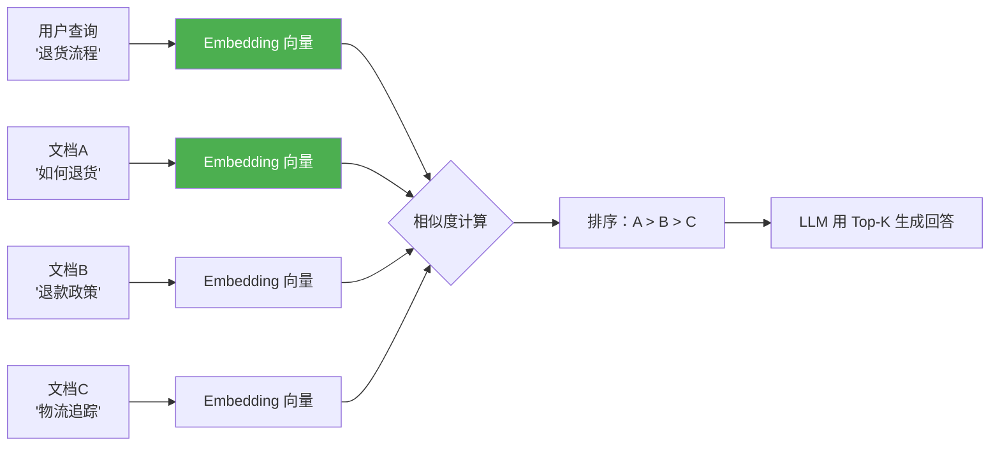
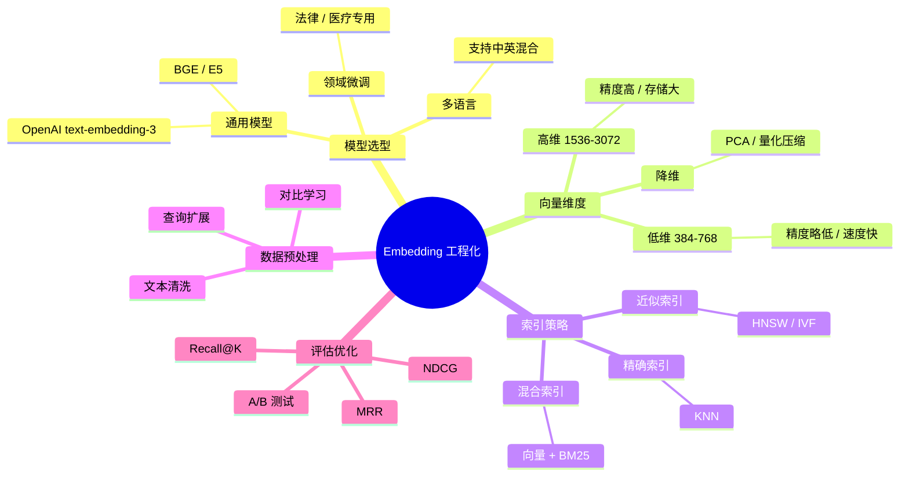
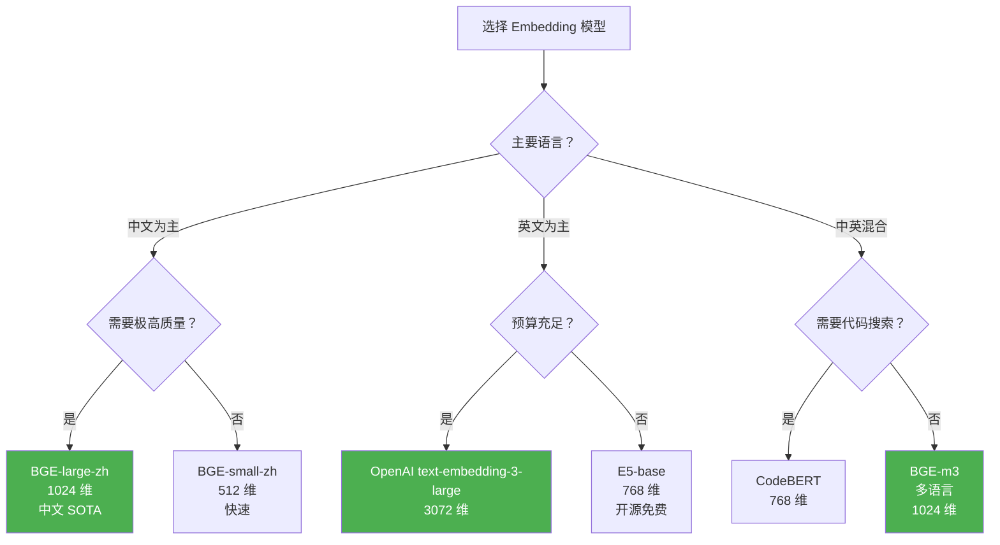
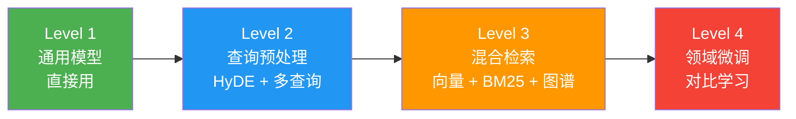

# Agent Embedding 工程化

> **一句话**：Embedding 是 RAG 的地基——地基歪了，检索全是错的，后面的 LLM 再强也白搭。

---

## 为什么 Embedding 工程化很重要？



**Embedding 质量直接决定 RAG 效果**。如果 Embedding 模型分不清"退货"和"物流"的语义距离，检索结果就是垃圾。

---

## Embedding 工程化的五大维度



---

## 核心实现

### 1. 多模型 Embedding 服务

```java
package com.enterprise.embedding;

import org.springframework.stereotype.Component;
import java.util.*;

/**
 * 多模型 Embedding 服务
 *
 * 不同场景用不同 Embedding 模型：
 * - 通用问答：BGE-large（中英双语，768 维）
 * - 代码搜索：CodeBERT
 * - 多语言：LaBSE
 */
@Component
public class EmbeddingService {

    private final Map<String, EmbeddingModel> models;
    private final EmbeddingModel defaultModel;

    /**
     * 生成 Embedding
     */
    public float[] embed(String text, String modelName) {
        EmbeddingModel model = models.getOrDefault(modelName, defaultModel);
        return model.embed(text);
    }

    /**
     * 批量 Embedding（减少 API 调用）
     */
    public List<float[]> embedBatch(List<String> texts, String modelName) {
        EmbeddingModel model = models.getOrDefault(modelName, defaultModel);
        return model.embedBatch(texts);
    }

    /**
     * 计算余弦相似度
     */
    public static double cosineSimilarity(float[] a, float[] b) {
        if (a.length != b.length) {
            throw new IllegalArgumentException("维度不匹配");
        }
        double dot = 0, normA = 0, normB = 0;
        for (int i = 0; i < a.length; i++) {
            dot += a[i] * b[i];
            normA += a[i] * a[i];
            normB += b[i] * b[i];
        }
        double denom = Math.sqrt(normA) * Math.sqrt(normB);
        return denom == 0 ? 0 : dot / denom;
    }

    /**
     * Embedding 模型接口
     */
    public interface EmbeddingModel {
        float[] embed(String text);
        List<float[]> embedBatch(List<String> texts);
        int dimension();
        String name();
    }
}
```

### 2. 查询预处理器

```java
package com.enterprise.embedding;

import org.springframework.stereotype.Component;
import java.util.*;

/**
 * 查询预处理器
 *
 * 用户输入的查询往往很短/模糊，直接 Embed 效果差
 * 预处理：查询扩展 + HyDE + 多查询融合
 */
@Component
public class QueryPreprocessor {

    private final ChatClient chatClient;

    /**
     * 查询扩展：用 LLM 丰富查询
     *
     * "退货" → "退货流程 退货条件 退货时限 退货运费 退货政策"
     */
    public String expandQuery(String originalQuery) {
        String prompt = """
            用户查询：%s
            请将这个简短查询扩展为 3-5 个相关的检索查询，用换行分隔。
            保持简洁，每个查询一行。
            """.formatted(originalQuery);

        String expanded = chatClient.prompt().user(prompt).call().content();
        return expanded;
    }

    /**
     * HyDE (Hypothetical Document Embeddings)
     *
     * 先让 LLM 生成一个"假设的回答"，
     * 然后用这个假设回答做 Embedding 检索
     *
     * 原理：回答和文档的语义更接近（都是陈述句）
     *       而查询（疑问句）和文档的语义距离更远
     */
    public String generateHyDE(String query) {
        String prompt = """
            请为以下问题写一段 100 字左右的假设性回答。
            不需要准确，只需要看起来像真实的文档内容。

            问题：%s
            """.formatted(query);

        return chatClient.prompt().user(prompt).call().content();
    }

    /**
     * 多查询融合检索
     */
    public List<SearchResult> multiQuerySearch(
            String originalQuery, VectorStore vectorStore, int topK) {

        // 1. 生成多个查询变体
        List<String> queries = new ArrayList<>();
        queries.add(originalQuery);
        queries.add(expandQuery(originalQuery));
        queries.add(generateHyDE(originalQuery));

        // 2. 每个查询各自检索
        Map<String, Double> docScores = new HashMap<>();

        for (String query : queries) {
            List<SearchResult> results = vectorStore.search(
                embeddingService.embed(query, "default"),
                topK * 2
            );

            // 3. 融合排序：Reciprocal Rank Fusion
            for (int i = 0; i < results.size(); i++) {
                String docId = results.get(i).docId();
                double rrfScore = 1.0 / (60 + i + 1);  // RRF 公式
                docScores.merge(docId, rrfScore, Double::sum);
            }
        }

        // 4. 按融合分数排序
        return docScores.entrySet().stream()
            .sorted(Map.Entry.<String, Double>comparingByValue().reversed())
            .limit(topK)
            .map(e -> new SearchResult(e.getKey(), e.getValue()))
            .toList();
    }

    public record SearchResult(String docId, double score) {}
}
```

### 3. Embedding 质量评估器

```java
package com.enterprise.embedding;

import org.springframework.stereotype.Component;
import java.util.*;

/**
 * Embedding 质量评估器
 *
 * 用标注数据评估 Embedding 模型的检索质量
 */
@Component
public class EmbeddingEvaluator {

    /**
     * 评估检索质量
     *
     * @param evalSet 标注数据集：每个查询有期望的文档 ID 列表
     * @param searchFn 检索函数
     */
    public EvalReport evaluate(
            List<EvalItem> evalSet,
            java.util.function.Function<String, List<String>> searchFn) {

        double totalRecall = 0;
        double totalMrr = 0;
        double totalNdcg = 0;

        for (EvalItem item : evalSet) {
            List<String> retrieved = searchFn.apply(item.query());

            // Recall@K
            double recall = recallAt(item.expectedDocIds(), retrieved, item.k());
            totalRecall += recall;

            // MRR (Mean Reciprocal Rank)
            double mrr = reciprocalRank(item.expectedDocIds(), retrieved);
            totalMrr += mrr;

            // NDCG@K
            double ndcg = ndcgAt(item.expectedDocIds(), retrieved, item.k());
            totalNdcg += ndcg;
        }

        int n = evalSet.size();
        return new EvalReport(
            totalRecall / n,
            totalMrr / n,
            totalNdcg / n,
            n
        );
    }

    /**
     * Recall@K：前 K 个结果中包含多少期望文档
     */
    private double recallAt(Set<String> expected, List<String> retrieved, int k) {
        Set<String> topK = new HashSet<>(retrieved.subList(0, Math.min(k, retrieved.size())));
        long hits = topK.stream().filter(expected::contains).count();
        return (double) hits / expected.size();
    }

    /**
     * Reciprocal Rank：第一个期望文档的排名倒数
     */
    private double reciprocalRank(Set<String> expected, List<String> retrieved) {
        for (int i = 0; i < retrieved.size(); i++) {
            if (expected.contains(retrieved.get(i))) {
                return 1.0 / (i + 1);
            }
        }
        return 0;
    }

    /**
     * NDCG@K：归一化折损累积增益
     */
    private double ndcgAt(Set<String> expected, List<String> retrieved, int k) {
        // DCG
        double dcg = 0;
        for (int i = 0; i < Math.min(k, retrieved.size()); i++) {
            if (expected.contains(retrieved.get(i))) {
                dcg += 1.0 / (Math.log(i + 2) / Math.log(2));
            }
        }
        // IDCG（理想情况）
        double idcg = 0;
        for (int i = 0; i < Math.min(expected.size(), k); i++) {
            idcg += 1.0 / (Math.log(i + 2) / Math.log(2));
        }
        return idcg == 0 ? 0 : dcg / idcg;
    }

    public record EvalItem(String query, Set<String> expectedDocIds, int k) {}

    public record EvalReport(
        double recallAtK, double mrr, double ndcgAtK, int totalQueries
    ) {}
}
```

---

## Embedding 模型选型矩阵



---

## Embedding 优化路线



| 优化层级 | 投入 | 效果提升 | 适用阶段 |
|---------|------|---------|---------|
| Level 1 通用模型 | 低 | 基线 | MVP |
| Level 2 查询预处理 | 中 | +15-30% | 优化期 |
| Level 3 混合检索 | 高 | +20-40% | 生产期 |
| Level 4 领域微调 | 很高 | +10-20% | 精细化 |

→ 返回 [阶段4 目录](../00-README.md)
