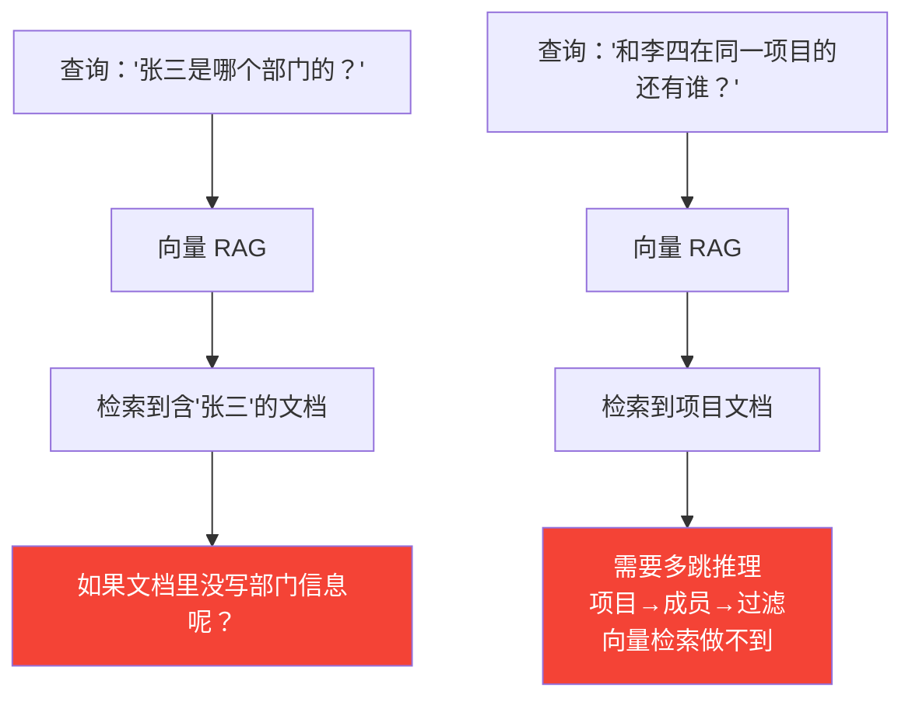
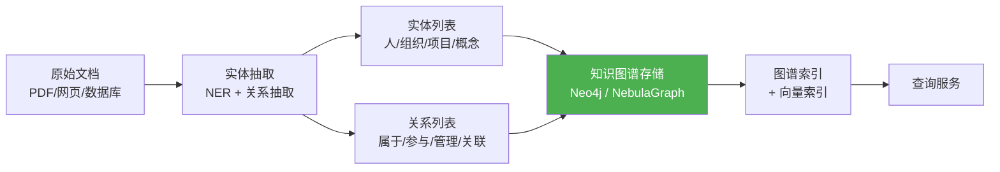
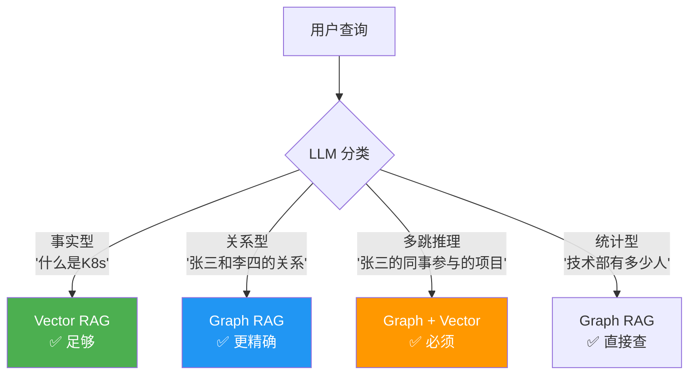

# Agent 知识图谱与 GraphRAG

> **一句话**：向量检索只能找到"相似的文档"，找不到"关联的事实"——知识图谱补上了"实体关系推理"这块拼图。

---

## 向量 RAG 的局限



**向量 RAG 的硬伤**：
- 无法做多跳推理（"A 的领导的领导是谁"）
- 无法做关系查询（"和 A 在同一团队的人"）
- 无法做聚合统计（"有多少人参与了项目X"）
- 容易被相似但无关的文档误导

---

## GraphRAG = 向量检索 + 图谱推理

```mermaid
flowchart TD
    Query["用户查询"] --> Router{"查询类型"}

    Router -->|"事实查询<br/>'XX是什么'"|"向量检索<br/>RAG"
    Router -->|"关系查询<br/>'A和B的关系'"|"图谱查询<br/>Cypher/Gremlin"]
    Router -->|"多跳推理<br/>'A的同事的项目'"|"图谱 + 向量<br/>GraphRAG"}
    Router -->|"聚合统计<br/>'多少人参与'"|"图谱查询<br/>SQL-like"}

    VectorRAG["向量检索"] --> Merge["结果融合"]
    GraphQuery["图谱查询"] --> Merge
    Merge --> LLM["LLM 生成回答"]

    style GraphRAG fill:#4caf50,color:#fff
```

---

## 知识图谱构建流程



---

## 核心实现

### 1. 文档→知识图谱 自动构建

```java
package com.enterprise.graphrag;

import org.springframework.stereotype.Component;
import java.util.*;

/**
 * 知识图谱自动构建器
 *
 * 从非结构化文档中抽取实体和关系，构建知识图谱
 */
@Component
public class KnowledgeGraphBuilder {

    private final ChatClient llm;
    private final GraphStore graphStore;

    /**
     * 从文档构建知识图谱
     */
    public BuildResult buildFromDocument(String document, String source) {
        // 1. 实体 + 关系联合抽取
        ExtractionResult extraction = extractEntitiesAndRelations(document);

        // 2. 写入图谱
        int nodesCreated = 0;
        int edgesCreated = 0;

        for (Entity entity : extraction.entities()) {
            graphStore.upsertNode(
                entity.id(),
                entity.type(),
                entity.properties()
            );
            nodesCreated++;
        }

        for (Relation relation : extraction.relations()) {
            graphStore.upsertEdge(
                relation.sourceId(),
                relation.targetId(),
                relation.type(),
                relation.properties()
            );
            edgesCreated++;
        }

        // 3. 记录来源（溯源）
        graphStore.addSource(source, extraction.entities(), extraction.relations());

        return new BuildResult(nodesCreated, edgesCreated, extraction.entities().size());
    }

    /**
     * LLM 联合抽取实体和关系
     */
    private ExtractionResult extractEntitiesAndRelations(String document) {
        String prompt = """
            从以下文档中抽取实体和关系。

            文档内容：
            %s

            请以 JSON 格式输出：
            {
              "entities": [
                {"id": "唯一标识", "name": "名称", "type": "Person/Organization/Project/Concept/Location", "properties": {}}
              ],
              "relations": [
                {"source": "实体ID", "target": "实体ID", "type": "WORKS_AT/MANAGES/PARTICIPATES/SIMILAR_TO", "properties": {}}
              ]
            }
            """.formatted(document);

        String json = llm.prompt().user(prompt).call().content();
        return parseExtraction(json);
    }

    private ExtractionResult parseExtraction(String json) {
        // 解析 JSON → ExtractionResult
        // 简化：实际用 Jackson
        return new ExtractionResult(List.of(), List.of());
    }

    // --- Records ---

    public record Entity(String id, String name, String type, Map<String, Object> properties) {}

    public record Relation(String sourceId, String targetId, String type,
                           Map<String, Object> properties) {}

    public record ExtractionResult(List<Entity> entities, List<Relation> relations) {}

    public record BuildResult(int nodesCreated, int edgesCreated, int totalEntities) {}
}
```

### 2. GraphRAG 混合检索器

```java
package com.enterprise.graphrag;

import org.springframework.stereotype.Component;
import java.util.*;

/**
 * GraphRAG 混合检索器
 *
 * 融合向量检索 + 图谱遍历，取两者之长
 */
@Component
public class GraphRAGRetriever {

    private final VectorStore vectorStore;
    private final GraphStore graphStore;
    private final ChatClient llm;

    /**
     * 混合检索
     */
    public GraphRAGResult retrieve(String query, int topK) {
        // 1. 向量检索：找到语义相关的文档
        List<VectorSearchResult> vectorResults = vectorStore.search(
            embeddingService.embed(query), topK
        );

        // 2. 从向量结果中提取实体
        Set<String> entityIds = new HashSet<>();
        for (VectorSearchResult r : vectorResults) {
            entityIds.addAll(r.extractedEntityIds());
        }

        // 3. 图谱扩展：找到这些实体的关联实体和关系
        GraphContext graphContext = graphStore.expand(entityIds, 2);  // 2 跳

        // 4. 生成 Cypher 查询（LLM 生成）
        String cypherQuery = generateCypher(query, graphContext);
        List<Map<String, Object>> graphResults = graphStore.query(cypherQuery);

        // 5. 融合排序
        List<MergedResult> merged = merge(vectorResults, graphResults, graphContext);

        return new GraphRAGResult(merged, graphContext, cypherQuery);
    }

    /**
     * LLM 生成 Cypher 查询
     */
    private String generateCypher(String query, GraphContext context) {
        String prompt = """
            用户问题：%s

            已知实体和关系：
            %s

            知识图谱 Schema：
            节点类型：Person, Organization, Project, Department, Concept
            关系类型：WORKS_AT, MANAGES, PARTICIPATES, BELONGS_TO, DEPENDS_ON

            请生成一个 Cypher 查询来回答用户问题。只返回 Cypher 语句。
            """.formatted(query, context.summary());

        return llm.prompt().user(prompt).call().content();
    }

    /**
     * 融合向量检索结果和图谱查询结果
     */
    private List<MergedResult> merge(
            List<VectorSearchResult> vectorResults,
            List<Map<String, Object>> graphResults,
            GraphContext graphContext) {

        List<MergedResult> merged = new ArrayList<>();

        // 向量结果：每条加 1.0 基础分
        for (int i = 0; i < vectorResults.size(); i++) {
            VectorSearchResult r = vectorResults.get(i);
            double score = 1.0 / (i + 1);  // 排名衰减
            merged.add(new MergedResult(
                r.content(), score, SourceType.VECTOR,
                r.docId(), null
            ));
        }

        // 图谱结果：每条加 1.5 加权（关系信息更有价值）
        for (Map<String, Object> row : graphResults) {
            String content = formatGraphResult(row);
            merged.add(new MergedResult(
                content, 1.5, SourceType.GRAPH,
                null, row
            ));
        }

        // 按分数排序
        merged.sort(Comparator.comparingDouble(MergedResult::score).reversed());

        return merged;
    }

    private String formatGraphResult(Map<String, Object> row) {
        StringBuilder sb = new StringBuilder();
        for (Map.Entry<String, Object> e : row.entrySet()) {
            sb.append(e.getKey()).append(": ").append(e.getValue()).append("\n");
        }
        return sb.toString();
    }

    // --- Types ---

    public record GraphRAGResult(
        List<MergedResult> results,
        GraphContext graphContext,
        String cypherQuery
    ) {}

    public record MergedResult(
        String content, double score,
        SourceType source,
        String docId, Map<String, Object> graphRow
    ) {}

    public enum SourceType { VECTOR, GRAPH }

    public record GraphContext(
        Set<String> entityIds,
        List<String> relationships,
        int hops
    ) {
        public String summary() {
            return "Entities: " + entityIds + "\nRelationships: " + relationships;
        }
    }
}
```

### 3. 图谱增量更新

```java
package com.enterprise.graphrag;

import org.springframework.stereotype.Component;
import java.util.*;

/**
 * 知识图谱增量更新管理器
 *
 * 文档更新时，自动更新图谱中的实体和关系
 */
@Component
public class GraphIncrementalUpdater {

    private final KnowledgeGraphBuilder builder;
    private final GraphStore graphStore;

    /**
     * 文档更新时触发
     */
    public UpdateResult onDocumentUpdated(String docId, String newContent) {
        // 1. 删除旧文档关联的实体和关系
        Set<String> oldEntityIds = graphStore.getEntitiesBySource(docId);
        graphStore.deleteBySource(docId);

        // 2. 从新内容重新抽取
        KnowledgeGraphBuilder.BuildResult rebuild =
            builder.buildFromDocument(newContent, docId);

        // 3. 清理孤立节点
        int orphanedNodes = graphStore.deleteOrphanedNodes();

        return new UpdateResult(
            oldEntityIds.size(),
            rebuild.nodesCreated(),
            rebuild.edgesCreated(),
            orphanedNodes
        );
    }

    public record UpdateResult(
        int oldEntitiesRemoved,
        int newNodesCreated,
        int newEdgesCreated,
        int orphanedNodesRemoved
    ) {}
}
```

---

## GraphRAG vs VectorRAG 场景对比



| 查询类型 | 向量 RAG | GraphRAG | 示例 |
|---------|---------|---------|------|
| 事实查询 | ✅ | ✅ | "K8s 是什么？" |
| 关系查询 | ❌ | ✅ | "A 和 B 的关系？" |
| 多跳推理 | ❌ | ✅ | "A 的同事的项目？" |
| 聚合统计 | ❌ | ✅ | "多少人在做项目X？" |
| 模糊搜索 | ✅ | ⚠️ | "关于微服务的最佳实践" |

→ 返回 [阶段4 目录](../00-README.md)
