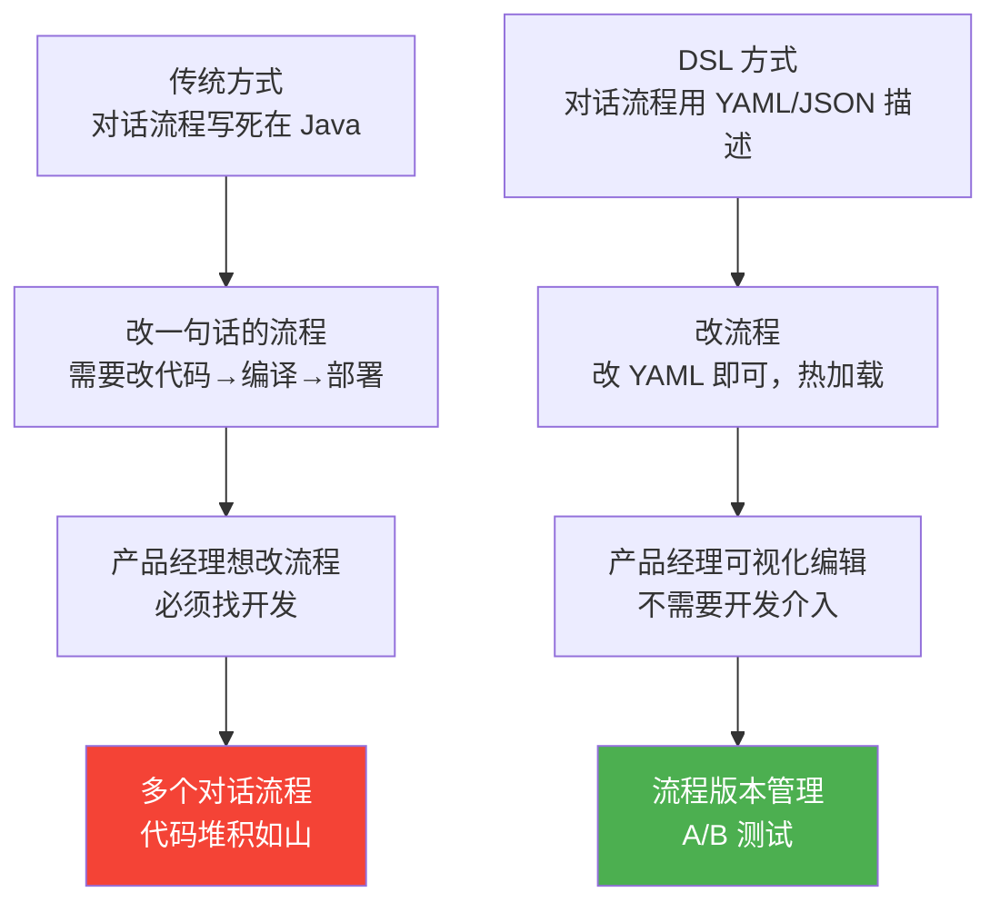
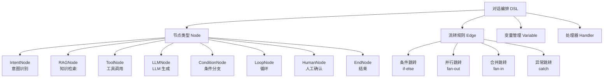
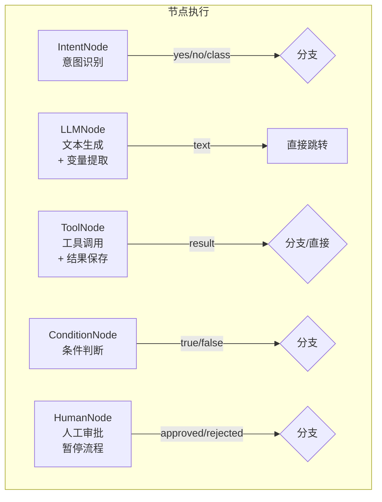

# Agent 对话编排 DSL 设计

> **一句话**：复杂 Agent 对话流程写死在 Java 代码里 = 难维护难修改——DSL 让非技术人员也能定义对话流程。

---

## 为什么需要对话编排 DSL？



---

## DSL 全景



---

## DSL 语法示例

```yaml
# 客服对话编排示例：退货流程
name: refund-flow
version: "2.1.0"
description: 用户发起退货申请的对话流程

variables:
  order_id: null
  refund_reason: null
  refund_amount: null
  refund_eligible: null

nodes:
  # 1. 开始
  - id: start
    type: intent
    description: 识别用户是否要退货
    prompt: |
      判断用户意图是否为"退货/退款"，返回 yes 或 no。
    next:
      yes: collect_order
      no: end_not_refund

  # 2. 收集订单号
  - id: collect_order
    type: llm
    prompt: "请提供您的订单号"
    extract:
      order_id: "{{response}}"
    next: verify_order

  # 3. 验证订单
  - id: verify_order
    type: tool
    tool: checkOrderEligibility
    args:
      orderId: "{{order_id}}"
    save:
      refund_eligible: "{{result.eligible}}"
      refund_amount: "{{result.amount}}"
    next:
      eligible: ask_reason
      ineligible: end_not_eligible

  # 4. 询问退货原因
  - id: ask_reason
    type: llm
    prompt: "请问退货的原因是什么？"
    extract:
      refund_reason: "{{response}}"
    next: human_review

  # 5. 人工审核（金额 > 1000）
  - id: human_review
    type: condition
    condition: "refund_amount > 1000"
    next:
      true: manager_approval
      false: auto_approve

  # 6. 主管审批
  - id: manager_approval
    type: human
    message: "金额超过 1000 元，需要主管审批"
    timeout: 3600
    next:
      approved: process_refund
      rejected: end_rejected

  # 7. 自动批准
  - id: auto_approve
    type: tool
    tool: createRefund
    args:
      orderId: "{{order_id}}"
      reason: "{{refund_reason}}"
    next: end_success

  # 8. 处理退款
  - id: process_refund
    type: tool
    tool: createRefund
    args:
      orderId: "{{order_id}}"
      reason: "{{refund_reason}}"
    next: end_success

  # 结束节点
  - id: end_success
    type: end
    message: "退货申请已提交，退款将在 3-5 个工作日内到账"

  - id: end_not_refund
    type: end
    message: "好的，请问还有什么可以帮您？"

  - id: end_not_eligible
    type: end
    message: "抱歉，您的订单不符合退货条件"

  - id: end_rejected
    type: end
    message: "抱歉，您的退货申请未获批准"
```

---

## 核心实现

### 1. DSL 引擎

```java
package com.enterprise.dsl;

import org.springframework.stereotype.Component;
import java.util.*;

/**
 * 对话编排 DSL 引擎
 *
 * 解析 YAML DSL → 构建执行图 → 按图执行
 */
@Component
public class DialogFlowEngine {

    /**
     * 执行对话流程
     */
    public FlowResult execute(DialogFlow flow, FlowContext context) {
        String currentNodeId = context.currentNodeId() != null
            ? context.currentNodeId()
            : flow.startNodeId();

        int maxSteps = 50;  // 防止无限循环

        while (currentNodeId != null && maxSteps-- > 0) {
            DialogNode node = flow.getNode(currentNodeId);
            if (node == null) {
                throw new IllegalStateException("节点不存在: " + currentNodeId);
            }

            // 执行节点
            NodeResult result = executeNode(node, context);

            // End 节点 → 结束
            if (node.type() == NodeType.END) {
                return FlowResult.completed(context, result.message());
            }

            // 决定下一节点
            String nextNodeId = resolveNext(node, result, context);
            context.setCurrentNodeId(nextNodeId);
            currentNodeId = nextNodeId;
        }

        return FlowResult.maxStepsExceeded(context);
    }

    /**
     * 执行单个节点
     */
    private NodeResult executeNode(DialogNode node, FlowContext context) {
        return switch (node.type()) {
            case INTENT   -> executeIntent(node, context);
            case LLM      -> executeLLM(node, context);
            case TOOL     -> executeTool(node, context);
            case CONDITION -> executeCondition(node, context);
            case HUMAN    -> executeHuman(node, context);
            case END      -> new NodeResult(node.message(), true);
            case LOOP     -> executeLoop(node, context);
        };
    }

    private NodeResult executeIntent(DialogNode node, FlowContext context) {
        String prompt = renderTemplate(node.prompt(), context);
        String response = chatClient.prompt()
            .user(context.lastUserMessage() + "\n" + prompt)
            .call().content();

        // 解析意图（yes/no 或 分类标签）
        return new NodeResult(response, response.trim().toLowerCase());
    }

    private NodeResult executeLLM(DialogNode node, FlowContext context) {
        String prompt = renderTemplate(node.prompt(), context);
        String response = chatClient.prompt()
            .user(prompt)
            .call().content();

        // 提取变量
        if (node.extract() != null) {
            for (Map.Entry<String, String> entry : node.extract().entrySet()) {
                String varName = entry.getKey();
                String template = entry.getValue();
                context.setVariable(varName, renderTemplate(template, Map.of("response", response)));
            }
        }

        return new NodeResult(response, null);
    }

    private NodeResult executeTool(DialogNode node, FlowContext context) {
        // 通过 MCP 或本地工具调用
        Map<String, Object> args = new HashMap<>();
        for (Map.Entry<String, String> entry : node.args().entrySet()) {
            args.put(entry.getKey(), renderTemplate(entry.getValue(), context));
        }

        Map<String, Object> toolResult = toolExecutor.execute(node.tool(), args);

        // 保存结果
        if (node.save() != null) {
            for (Map.Entry<String, String> entry : node.save().entrySet()) {
                context.setVariable(entry.getKey(),
                    renderTemplate(entry.getValue(), Map.of("result", toolResult)));
            }
        }

        return new NodeResult(null, toolResult);
    }

    private NodeResult executeCondition(DialogNode node, FlowContext context) {
        String condition = renderTemplate(node.condition(), context);
        boolean result = evaluateCondition(condition, context);
        return new NodeResult(null, String.valueOf(result));
    }

    private NodeResult executeHuman(DialogNode node, FlowContext context) {
        // 暂停流程，等待人工审批
        context.setPaused(true);
        context.setPauseReason(node.message());
        context.setTimeout(node.timeout());
        return new NodeResult(node.message(), null);
    }

    /**
     * 解析下一节点
     */
    private String resolveNext(DialogNode node, NodeResult result, FlowContext context) {
        if (node.next() == null) return null;

        if (node.next() instanceof Map) {
            // 条件跳转
            @SuppressWarnings("unchecked")
            Map<String, String> conditionalNext = (Map<String, String>) node.next();
            String key = result.branchKey();
            return conditionalNext.getOrDefault(key, conditionalNext.get("default"));
        } else {
            // 直接跳转
            return (String) node.next();
        }
    }

    /**
     * 模板渲染 {{var}}
     */
    private String renderTemplate(String template, Map<String, Object> vars) {
        String result = template;
        for (Map.Entry<String, Object> entry : vars.entrySet()) {
            result = result.replace("{{" + entry.getKey() + "}}",
                String.valueOf(entry.getValue()));
        }
        return result;
    }

    private boolean evaluateCondition(String condition, FlowContext context) {
        // 简化的条件评估引擎
        // 实际可用 SpEL、AviatorScript 等
        if (condition.contains(">")) {
            String[] parts = condition.split(">");
            double left = getVariableAsDouble(parts[0].trim(), context);
            double right = getVariableAsDouble(parts[1].trim(), context);
            return left > right;
        }
        return false;
    }

    private double getVariableAsDouble(String name, FlowContext ctx) {
        try {
            return Double.parseDouble(name);
        } catch (NumberFormatException e) {
            return Double.parseDouble(String.valueOf(ctx.getVariable(name)));
        }
    }

    // --- Types ---

    public record FlowResult(boolean completed, boolean maxStepsExceeded,
                              FlowContext context, String finalMessage) {
        static FlowResult completed(FlowContext ctx, String message) {
            return new FlowResult(true, false, ctx, message);
        }
        static FlowResult maxStepsExceeded(FlowContext ctx) {
            return new FlowResult(false, true, ctx, "流程超过最大步骤数");
        }
    }

    public record NodeResult(String message, Object branchKey) {}

    public record DialogNode(
        String id, NodeType type, String description,
        String prompt, String tool, Map<String, String> args,
        Map<String, String> extract, Map<String, String> save,
        Object next, String condition, String message,
        long timeout
    ) {}

    public record DialogFlow(String id, String name, String version,
                              List<DialogNode> nodes,
                              Map<String, Object> variables) {
        public String startNodeId() { return nodes.get(0).id(); }
        public DialogNode getNode(String id) {
            return nodes.stream().filter(n -> n.id().equals(id)).findFirst().orElse(null);
        }
    }

    public enum NodeType {
        INTENT, LLM, TOOL, CONDITION, HUMAN, END, LOOP
    }
}
```

### 2. 流程上下文

```java
package com.enterprise.dsl;

import java.util.*;

/**
 * 流程执行上下文
 *
 * 保存整个流程执行过程中的状态：变量、当前节点、历史
 */
public class FlowContext {

    private String sessionId;
    private String flowId;
    private String currentNodeId;
    private Map<String, Object> variables = new HashMap<>();
    private List<StepHistory> history = new ArrayList<>();
    private boolean paused = false;
    private String pauseReason;
    private long timeout;
    private String lastUserMessage;

    public void setVariable(String name, Object value) {
        variables.put(name, value);
    }

    public Object getVariable(String name) {
        return variables.get(name);
    }

    public void recordStep(String nodeId, String nodeType, long durationMs,
                           boolean success, String notes) {
        history.add(new StepHistory(nodeId, nodeType, Instant.now(),
            durationMs, success, notes));
    }

    // --- Records ---

    public record StepHistory(
        String nodeId, String nodeType,
        Instant timestamp,
        long durationMs, boolean success, String notes
    ) {}
}
```

---

## 节点类型详解



| 节点类型 | 输入 | 输出 | 跳转方式 |
|---------|------|------|---------|
| Intent | 用户消息 + Prompt | 分类标签 | 条件跳转 |
| LLM | Prompt + 变量 | 文本 + 提取的变量 | 直接跳转 |
| Tool | 工具名 + 参数 | 结果 + 保存的变量 | 条件或直接 |
| Condition | 表达式 | true/false | 条件跳转 |
| Human | 审批消息 | approved/rejected | 条件跳转 |
| End | - | 最终消息 | 流程结束 |

→ 返回 [阶段4 目录](../00-README.md)
