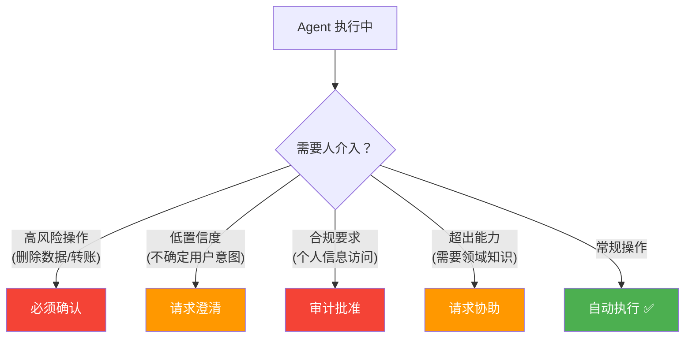
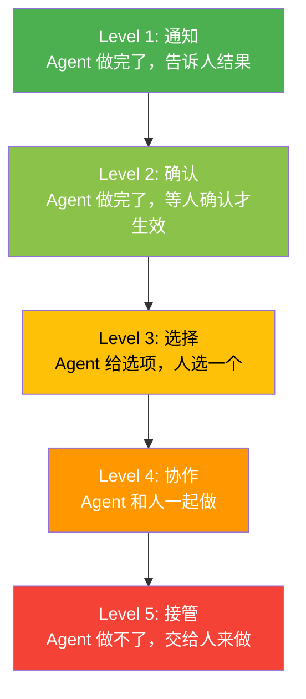
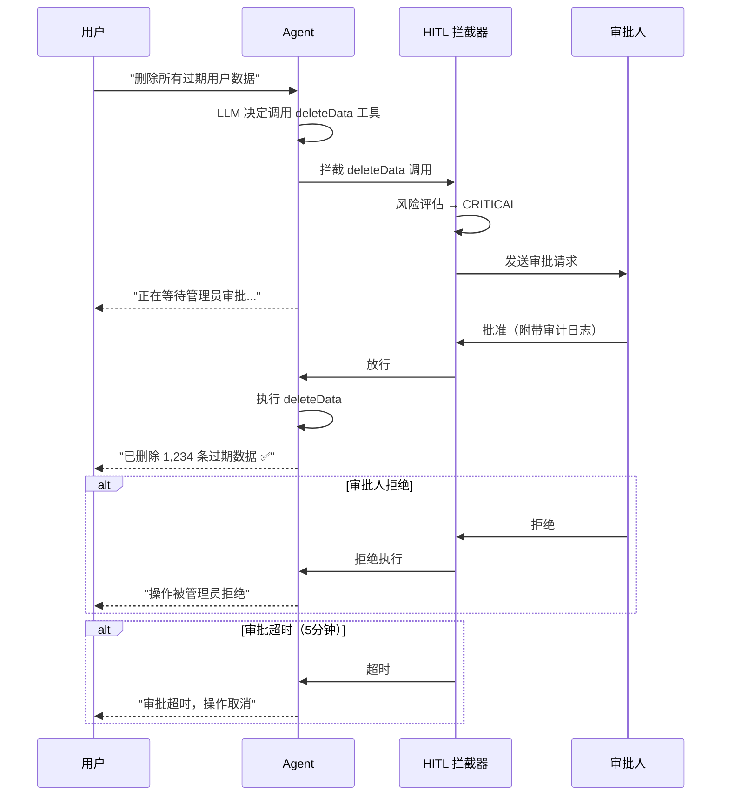
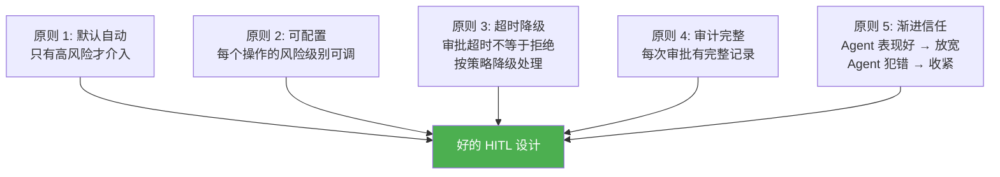

# Agent 人在回路（HITL）工程化

> **一句话**：Agent 不是"全自动"或"全手动"的二选一——好的 Agent 知道什么时候该自己做，什么时候该问人。

---

## 什么时候需要人介入？



---

## HITL 介入级别



| 级别 | 自动化程度 | 延迟 | 适用场景 |
|------|----------|------|---------|
| 通知 | 100% 自动 | 0 | 日志记录、状态更新 |
| 确认 | 90% 自动 | 秒级 | 高危命令执行 |
| 选择 | 70% 自动 | 秒级 | 多选项决策 |
| 协作 | 50% 自动 | 分钟级 | 复杂问题分析 |
| 接管 | 0% 自动 | 不确定 | Agent 能力外任务 |

---

## 核心实现

### 1. HITL 拦截器

```java
package com.enterprise.hitl;

import org.springframework.stereotype.Component;
import java.util.*;

/**
 * HITL 拦截器
 *
 * 在 Agent 执行操作前，检查是否需要人工审批
 */
@Component
public class HitlInterceptor {

    private final HitlPolicyEngine policyEngine;
    private final ApprovalService approvalService;

    /**
     * 拦截工具调用
     *
     * @return true=放行, false=等待审批
     */
    public HitlDecision intercept(ToolCallContext context) {
        // 1. 评估风险等级
        RiskLevel risk = policyEngine.assessRisk(context);

        return switch (risk) {
            case LOW -> HitlDecision.autoApprove();
            case MEDIUM -> HitlDecision.notify(context);
            case HIGH -> {
                // 发起审批请求
                ApprovalRequest req = approvalService.createRequest(
                    context.sessionId(),
                    context.toolName(),
                    context.args(),
                    context.description(),
                    context.riskFactors()
                );
                yield HitlDecision.requireApproval(req);
            }
            case CRITICAL -> {
                // 关键操作需要双人审批
                ApprovalRequest req = approvalService.createDualApprovalRequest(
                    context.sessionId(),
                    context.toolName(),
                    context.args(),
                    context.description()
                );
                yield HitlDecision.requireApproval(req);
            }
        };
    }

    public record HitlDecision(
        HitlAction action,
        ApprovalRequest approvalRequest,
        String message
    ) {
        static HitlDecision autoApprove() {
            return new HitlDecision(HitlAction.AUTO_APPROVE, null, null);
        }
        static HitlDecision notify(ToolCallContext ctx) {
            return new HitlDecision(HitlAction.NOTIFY, null,
                "已通知：执行了 " + ctx.toolName());
        }
        static HitlDecision requireApproval(ApprovalRequest req) {
            return new HitlDecision(HitlAction.REQUIRE_APPROVAL, req,
                "等待审批：" + req.description());
        }
    }

    public enum HitlAction {
        AUTO_APPROVE,      // 自动通过
        NOTIFY,            // 执行后通知
        REQUIRE_APPROVAL   人工审批后才能执行
    }

    public enum RiskLevel {
        LOW,      // 读操作、查询
        MEDIUM,   // 写操作、创建
        HIGH,     // 删除、修改关键配置
        CRITICAL  // 转账、删除大量数据、关闭服务
    }
}
```

### 2. 审批服务

```java
package com.enterprise.hitl;

import org.springframework.stereotype.Component;
import java.util.*;
import java.util.concurrent.*;

/**
 * 审批服务
 *
 * 管理审批请求的生命周期：
 * 创建 → 等待 → 批准/拒绝/超时
 */
@Component
public class ApprovalService {

    // 审批请求存储
    private final Map<String, ApprovalRequest> requests = new ConcurrentHashMap<>();
    // 等待审批的 CompletableFuture
    private final Map<String, CompletableFuture<ApprovalResponse>> pending = new ConcurrentHashMap<>();

    /**
     * 创建审批请求
     */
    public ApprovalRequest createRequest(String sessionId, String toolName,
            Map<String, Object> args, String description,
            List<String> riskFactors) {
        String requestId = UUID.randomUUID().toString();

        ApprovalRequest req = new ApprovalRequest(
            requestId, sessionId, toolName, args,
            description, riskFactors,
            ApprovalStatus.PENDING,
            Instant.now(),
            null,  // expiresAt
            null   // respondedBy
        );

        requests.put(requestId, req);

        // 通知审批人
        notifyApprovers(req);

        return req;
    }

    /**
     * 创建双人审批请求
     */
    public ApprovalRequest createDualApprovalRequest(String sessionId,
            String toolName, Map<String, Object> args, String description) {
        // 需要两个不同的人审批
        ApprovalRequest req = createRequest(sessionId, toolName, args, description,
            List.of("DUAL_APPROVAL_REQUIRED"));
        req.setRequiresDualApproval(true);
        return req;
    }

    /**
     * 等待审批结果（带超时）
     */
    public ApprovalResponse awaitApproval(String requestId, Duration timeout) {
        CompletableFuture<ApprovalResponse> future = new CompletableFuture<>();
        pending.put(requestId, future);

        try {
            return future.get(timeout.toSeconds(), TimeUnit.SECONDS);
        } catch (TimeoutException e) {
            return ApprovalResponse.timeout(requestId);
        } catch (Exception e) {
            return ApprovalResponse.error(requestId, e.getMessage());
        } finally {
            pending.remove(requestId);
        }
    }

    /**
     * 审批人响应
     */
    public void respond(String requestId, String approverId,
                        boolean approved, String comment) {
        ApprovalRequest req = requests.get(requestId);
        if (req == null || req.status() != ApprovalStatus.PENDING) {
            throw new IllegalStateException("审批请求无效");
        }

        req.setStatus(approved ? ApprovalStatus.APPROVED : ApprovalStatus.REJECTED);
        req.setRespondedBy(approverId);
        req.setResponseComment(comment);
        req.setRespondedAt(Instant.now());

        // 唤醒等待的线程
        CompletableFuture<ApprovalResponse> future = pending.get(requestId);
        if (future != null) {
            future.complete(new ApprovalResponse(
                requestId, approved, comment, approverId
            ));
        }

        // 记录审计日志
        auditLog.recordApproval(req, approverId, approved, comment);
    }

    private void notifyApprovers(ApprovalRequest req) {
        // 发送通知（邮件/钉钉/Slack）
        notificationService.sendToApprovers(
            "需要审批: " + req.description(),
            "工具: " + req.toolName() + "\n参数: " + req.args()
        );
    }

    public record ApprovalRequest(
        String id, String sessionId,
        String toolName, Map<String, Object> args,
        String description, List<String> riskFactors,
        ApprovalStatus status,
        Instant createdAt, Instant expiresAt,
        String respondedBy
    ) {
        private boolean requiresDualApproval;
        private String responseComment;
        private Instant respondedAt;
        // setters omitted for brevity
    }

    public record ApprovalResponse(
        String requestId, boolean approved,
        String comment, String approverId
    ) {
        static ApprovalResponse timeout(String id) {
            return new ApprovalResponse(id, false, "审批超时", null);
        }
        static ApprovalResponse error(String id, String msg) {
            return new ApprovalResponse(id, false, "错误: " + msg, null);
        }
    }

    public enum ApprovalStatus { PENDING, APPROVED, REJECTED, EXPIRED }
}
```

### 3. 风险策略引擎

```java
package com.enterprise.hitl;

import org.springframework.stereotype.Component;
import java.util.*;

/**
 * 风险策略引擎
 *
 * 根据操作类型、参数、上下文评估风险等级
 */
@Component
public class HitlPolicyEngine {

    // 工具风险配置
    private final Map<String, ToolRiskConfig> toolRiskConfigs = new HashMap<>();

    public HitlPolicyEngine() {
        // 预配置高风险操作
        toolRiskConfigs.put("deleteData", new ToolRiskConfig(RiskLevel.CRITICAL,
            List.of("数据删除不可恢复")));
        toolRiskConfigs.put("transferFunds", new ToolRiskConfig(RiskLevel.CRITICAL,
            List.of("资金转账")));
        toolRiskConfigs.put("updateConfig", new ToolRiskConfig(RiskLevel.HIGH,
            List.of("修改关键配置")));
        toolRiskConfigs.put("sendEmail", new ToolRiskConfig(RiskLevel.MEDIUM,
            List.of("外发邮件")));
        toolRiskConfigs.put("queryData", new ToolRiskConfig(RiskLevel.LOW,
            List.of()));
        toolRiskConfigs.put("searchDocs", new ToolRiskConfig(RiskLevel.LOW,
            List.of()));
    }

    /**
     * 评估操作风险
     */
    public RiskLevel assessRisk(ToolCallContext context) {
        ToolRiskConfig config = toolRiskConfigs.get(context.toolName());

        if (config == null) {
            // 未知工具默认 MEDIUM 风险
            return RiskLevel.MEDIUM;
        }

        RiskLevel base = config.baseRisk();

        // 动态调整：检查参数中的风险因子
        Map<String, Object> args = context.args();

        // 批量操作加一级风险
        if (args.containsKey("batchSize") && (int) args.get("batchSize") > 100) {
            base = upgrade(base);
        }

        // 生产环境加一级风险
        if ("production".equals(context.environment())) {
            base = upgrade(base);
        }

        // 涉及敏感数据加一级风险
        if (args.containsKey("dataType") && isSensitive(args.get("dataType").toString())) {
            base = upgrade(base);
        }

        return base;
    }

    private RiskLevel upgrade(RiskLevel current) {
        return switch (current) {
            case LOW -> RiskLevel.MEDIUM;
            case MEDIUM -> RiskLevel.HIGH;
            case HIGH, CRITICAL -> RiskLevel.CRITICAL;
        };
    }

    private boolean isSensitive(String dataType) {
        return Set.of("PII", "FINANCIAL", "MEDICAL", "CREDENTIALS")
            .contains(dataType.toUpperCase());
    }

    public record ToolRiskConfig(RiskLevel baseRisk, List<String> riskFactors) {}
}
```

---

## HITL 交互流程



---

## HITL 设计原则



→ 返回 [阶段4 目录](../00-README.md)
