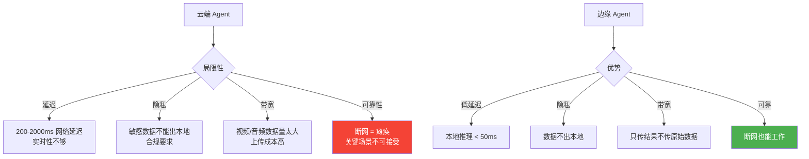
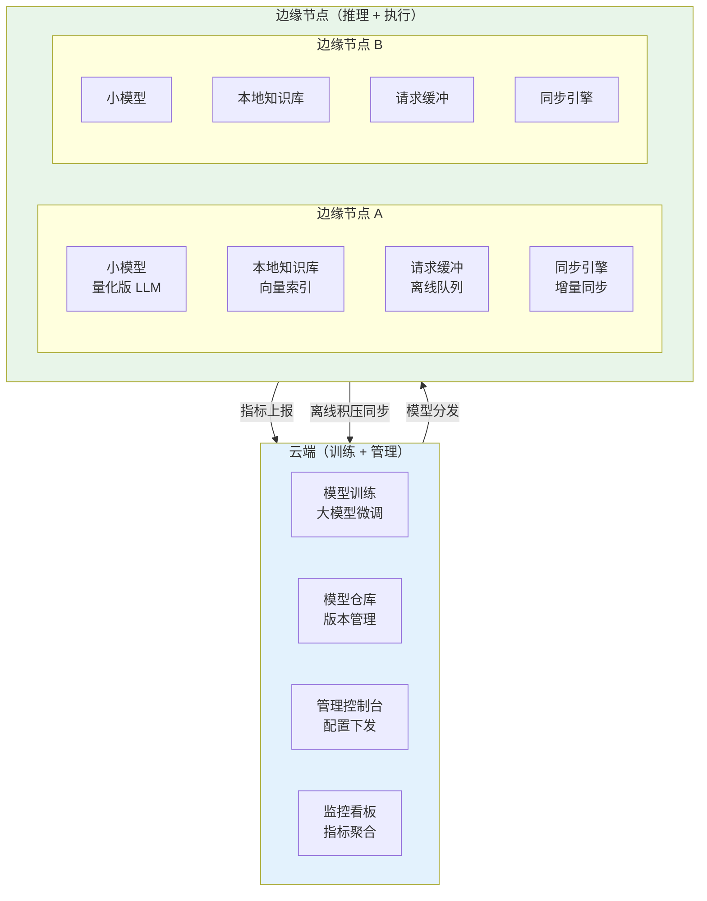
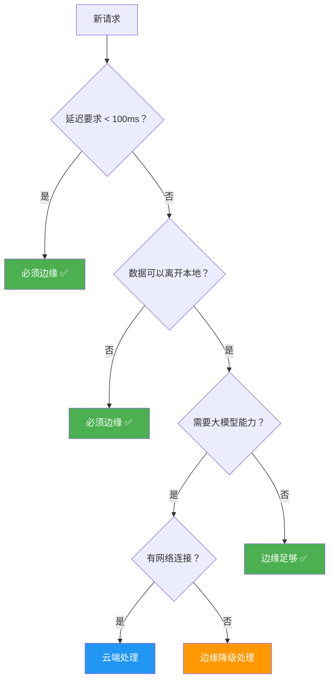
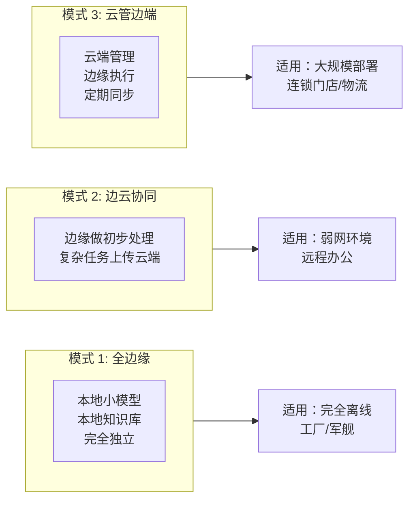

# Agent 边缘部署与离线场景

> **一句话**：不是所有 Agent 都能连着云端跑——工厂车间、远洋货轮、战场前线，Agent 必须在断网时也能工作。

---

## 为什么需要边缘部署？



---

## 边缘部署架构



---

## 核心实现

### 1. 边缘推理引擎

```java
package com.enterprise.edge;

import org.springframework.stereotype.Component;
import java.util.*;

/**
 * 边缘推理引擎
 *
 * 在本地运行量化后的小模型，不依赖云端 API
 */
@Component
public class EdgeInferenceEngine {

    private final LocalModelRunner modelRunner;
    private final LocalVectorStore localKB;
    private final ConnectionMonitor connectionMonitor;

    /**
     * 边缘推理：优先本地，必要时降级
     */
    public InferenceResult infer(InferenceRequest request) {
        // 1. 检查本地模型是否可用
        if (modelRunner.isReady()) {
            // 本地 RAG
            List<Chunk> context = localKB.search(request.query(), 5);

            // 本地推理
            String response = modelRunner.generate(
                request.query(), context, request.maxTokens()
            );

            return InferenceResult.success(response, Source.LOCAL_MODEL);
        }

        // 2. 本地模型不可用 → 尝试云端
        if (connectionMonitor.isOnline()) {
            try {
                String response = cloudInferenceClient.infer(request);
                return InferenceResult.success(response, Source.CLOUD_MODEL);
            } catch (Exception e) {
                // 云端也失败了 → 降级
            }
        }

        // 3. 完全离线 → 返回缓存或预设响应
        return handleOffline(request);
    }

    /**
     * 离线处理策略
     */
    private InferenceResult handleOffline(InferenceRequest request) {
        // 策略 1：检查是否有缓存的相似问答
        Optional<String> cached = semanticCache.lookup(request.query());
        if (cached.isPresent()) {
            return InferenceResult.success(cached.get(), Source.LOCAL_CACHE);
        }

        // 策略 2：纯本地知识库检索（不需要 LLM）
        List<Chunk> docs = localKB.search(request.query(), 3);
        if (!docs.isEmpty()) {
            String answer = formatDocsAsAnswer(docs);
            return InferenceResult.degraded(answer, Source.LOCAL_KB_ONLY,
                "离线模式：仅返回知识库匹配结果");
        }

        // 策略 3：入队等网络恢复后处理
        offlineQueue.enqueue(request);
        return InferenceResult.queued("网络恢复后自动处理");
    }

    private String formatDocsAsAnswer(List<Chunk> docs) {
        StringBuilder sb = new StringBuilder("根据本地知识库：\n\n");
        for (int i = 0; i < docs.size(); i++) {
            sb.append(i + 1).append(". ").append(docs.get(i).content()).append("\n\n");
        }
        return sb.toString();
    }

    // --- Types ---

    public record InferenceRequest(
        String query, int maxTokens, String tenantId
    ) {}

    public record InferenceResult(
        String response, Source source,
        boolean degraded, boolean queued, String note
    ) {
        static InferenceResult success(String resp, Source src) {
            return new InferenceResult(resp, src, false, false, null);
        }
        static InferenceResult degraded(String resp, Source src, String note) {
            return new InferenceResult(resp, src, true, false, note);
        }
        static InferenceResult queued(String note) {
            return new InferenceResult(null, null, false, true, note);
        }
    }

    public enum Source {
        LOCAL_MODEL,    // 本地量化小模型
        CLOUD_MODEL,    // 云端大模型
        LOCAL_CACHE,    // 本地语义缓存
        LOCAL_KB_ONLY   // 仅本地知识库（无 LLM）
    }
}
```

### 2. 离线队列与同步

```java
package com.enterprise.edge;

import org.springframework.stereotype.Component;
import java.util.*;
import java.util.concurrent.*;

/**
 * 离线请求队列
 *
 * 断网时请求入队，网络恢复后自动处理
 */
@Component
public class OfflineRequestQueue {

    private final Queue<QueuedRequest> queue = new ConcurrentLinkedQueue<>();
    private final int maxSize = 10000;

    /**
     * 入队
     */
    public boolean enqueue(EdgeInferenceEngine.InferenceRequest request) {
        if (queue.size() >= maxSize) {
            return false;  // 队列满
        }
        queue.offer(new QueuedRequest(
            UUID.randomUUID().toString(),
            request,
            Instant.now(),
            QueuedStatus.PENDING
        ));
        return true;
    }

    /**
     * 网络恢复后处理积压
     */
    public int flush(CloudInferenceClient cloudClient) {
        int processed = 0;
        QueuedRequest req;
        while ((req = queue.peek()) != null) {
            try {
                String result = cloudClient.infer(req.request());
                req.setStatus(QueuedStatus.COMPLETED);
                req.setResult(result);
                processed++;
            } catch (Exception e) {
                // 云端仍不可用，停止处理
                break;
            }
            queue.poll();
        }
        return processed;
    }

    /**
     * 获取积压请求统计
     */
    public QueueStats getStats() {
        long pending = queue.stream()
            .filter(r -> r.status() == QueuedStatus.PENDING).count();
        long oldest = queue.isEmpty() ? 0 :
            Duration.between(queue.peek().enqueuedAt(), Instant.now()).toMinutes();
        return new QueueStats(queue.size(), (int) pending, oldest);
    }

    public record QueuedRequest(
        String id, EdgeInferenceEngine.InferenceRequest request,
        Instant enqueuedAt, QueuedStatus status
    ) {
        private String result;
    }

    public record QueueStats(int totalSize, int pendingCount, long oldestAgeMinutes) {}

    public enum QueuedStatus { PENDING, COMPLETED, FAILED }
}
```

### 3. 模型热更新

```java
package com.enterprise.edge;

import org.springframework.stereotype.Component;
import java.nio.file.*;

/**
 * 边缘模型热更新
 *
 * 云端推送新模型 → 边缘节点下载 → 验证 → 热切换
 * 全程不停机
 */
@Component
public class ModelHotUpdater {

    private final LocalModelRunner modelRunner;

    /**
     * 检查并下载新模型
     */
    public UpdateResult checkAndUpdate() {
        // 1. 查询最新版本
        ModelVersion latest = modelRegistry.getLatestForDevice(deviceId);
        ModelVersion current = modelRunner.getCurrentVersion();

        if (latest.equals(current)) {
            return UpdateResult.noUpdate();
        }

        // 2. 下载新模型（增量更新）
        Path modelFile = downloadModel(latest);

        // 3. 验证完整性
        if (!verifyChecksum(modelFile, latest.checksum())) {
            return UpdateResult.failed("模型校验失败");
        }

        // 4. 加载新模型（不卸载旧模型）
        LocalModelRunner newRunner = loadModel(modelFile, latest);

        // 5. 冒烟测试
        if (!smokeTest(newRunner)) {
            return UpdateResult.failed("冒烟测试失败");
        }

        // 6. 原子切换
        modelRunner.hotSwap(newRunner);

        // 7. 清理旧模型文件
        cleanupOldModel(current);

        return UpdateResult.success(current, latest);
    }

    private boolean smokeTest(LocalModelRunner runner) {
        // 用预设的测试用例验证
        for (TestCase tc : SMOKE_TEST_CASES) {
            String result = runner.generate(tc.input(), List.of(), 100);
            if (!tc.validate(result)) {
                return false;
            }
        }
        return true;
    }

    public record UpdateResult(
        boolean updated, boolean success,
        String oldVersion, String newVersion, String error
    ) {
        static UpdateResult noUpdate() {
            return new UpdateResult(false, true, null, null, null);
        }
        static UpdateResult success(ModelVersion old, ModelVersion newV) {
            return new UpdateResult(true, true, old.version(), newV.version(), null);
        }
        static UpdateResult failed(String error) {
            return new UpdateResult(true, false, null, null, error);
        }
    }

    public record ModelVersion(String version, String checksum, long sizeBytes) {}
}
```

---

## 边缘 vs 云端决策树



---

## 边缘部署模式



| 部署模式 | 模型大小 | 延迟 | 能力 | 适用场景 |
|---------|---------|------|------|---------|
| 全边缘 | 1-4 GB | < 50ms | 有限 | 完全离线场景 |
| 边云协同 | 1-2 GB + 云端 | 混合 | 完整 | 弱网/低延迟 |
| 云管边端 | 0.5-1 GB | < 30ms | 适中 | 大规模标准化 |

→ 返回 [阶段4 目录](../00-README.md)
