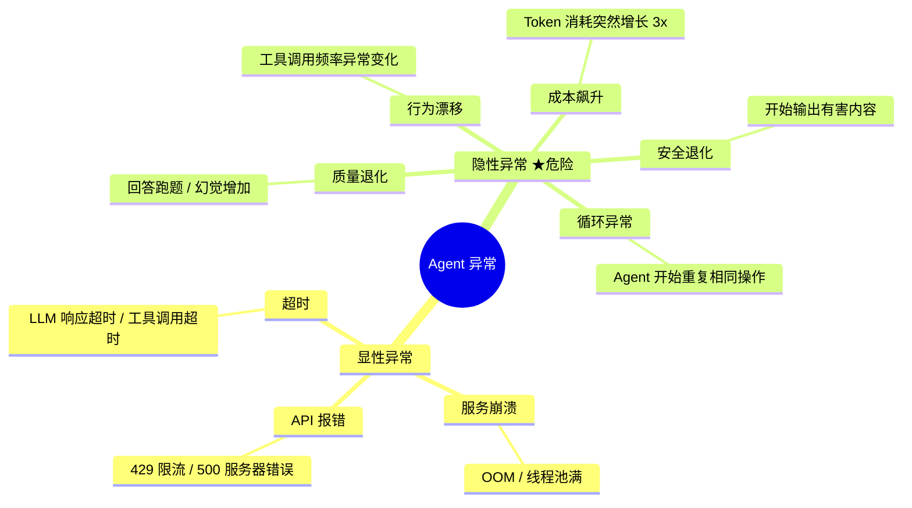
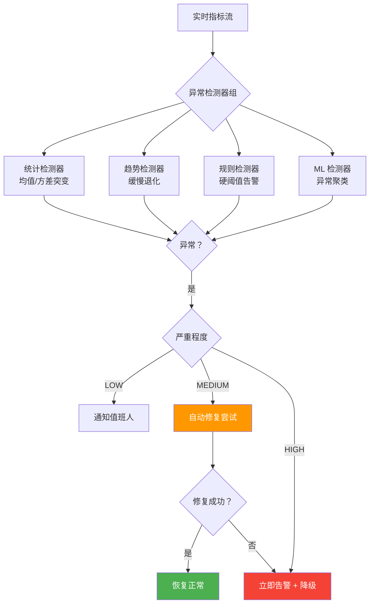
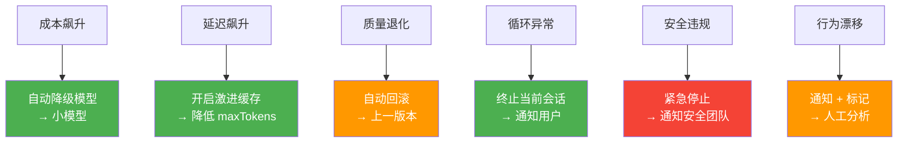
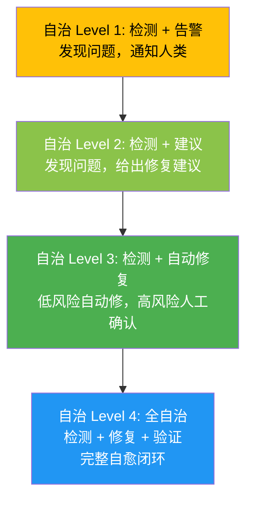

# Agent 异常检测与自治修复

> **一句话**：Agent 上线后最大的问题不是"挂了"——是"没挂但开始输出垃圾"——这种隐性异常比显性崩溃危险 100 倍。

---

## Agent 异常分类



**显性异常**容易被监控发现（5xx 率、超时率）。

**隐性异常**是 Agent 独有的——模型没有挂，但输出质量在悄悄下降。如果不做专门检测，可能几天后才发现。

---

## 异常检测架构



---

## 核心实现

### 1. 多维度异常检测器

```java
package com.enterprise.anomaly;

import org.springframework.stereotype.Component;
import java.util.*;
import java.util.concurrent.*;

/**
 * Agent 异常检测中心
 *
 * 多维度实时检测 Agent 的隐性和显性异常
 */
@Component
public class AnomalyDetectionCenter {

    private final List<AnomalyDetector> detectors;
    private final Map<String, AgentMetrics> metricsHistory = new ConcurrentHashMap<>();

    /**
     * 实时检测
     */
    public List<Anomaly> detect(String agentId, AgentMetrics current) {
        AgentMetrics baseline = getBaseline(agentId);
        List<Anomaly> anomalies = new ArrayList<>();

        for (AnomalyDetector detector : detectors) {
            Anomaly anomaly = detector.check(current, baseline);
            if (anomaly != null) {
                anomalies.add(anomaly);
            }
        }

        // 记录当前指标到历史
        metricsHistory.computeIfAbsent(agentId, k -> new AgentMetrics())
                      .update(current);

        return anomalies;
    }

    private AgentMetrics getBaseline(String agentId) {
        return metricsHistory.getOrDefault(agentId, AgentMetrics.empty());
    }
}
```

### 2. 统计异常检测器

```java
package com.enterprise.anomaly;

import org.springframework.stereotype.Component;
import java.util.*;

/**
 * 统计异常检测器
 *
 * 基于历史均值和标准差检测突变
 * 核心原理：3-Sigma 规则（超出 3 倍标准差 = 99.7% 概率是异常）
 */
@Component
public class StatisticalDetector implements AnomalyDetector {

    @Override
    public Anomaly check(AgentMetrics current, AgentMetrics baseline) {
        List<Anomaly> anomalies = new ArrayList<>();

        // 1. Token 消耗突变
        double tokenZ = zScore(current.avgTokensPerRequest(),
                               baseline.avgTokensPerRequest(),
                               baseline.tokenStdDev());
        if (Math.abs(tokenZ) > 3) {
            return new Anomaly(
                AnomalyType.COST_SPIKE,
                Severity.MEDIUM,
                String.format("Token 消耗突变: z=%.2f (均值 %.0f → %.0f)",
                    tokenZ, baseline.avgTokensPerRequest(),
                    current.avgTokensPerRequest()),
                Map.of("zScore", tokenZ)
            );
        }

        // 2. 延迟突变
        double latencyZ = zScore(current.p95LatencyMs(),
                                 baseline.p95LatencyMs(),
                                 baseline.latencyStdDev());
        if (latencyZ > 3) {
            return new Anomaly(
                AnomalyType.LATENCY_SPIKE,
                Severity.HIGH,
                String.format("P95 延迟突变: z=%.2f (%.0fms → %.0fms)",
                    latencyZ, baseline.p95LatencyMs(), current.p95LatencyMs()),
                Map.of("zScore", latencyZ)
            );
        }

        // 3. 质量评分突变
        double qualityZ = zScore(current.avgQualityScore(),
                                  baseline.avgQualityScore(),
                                  baseline.qualityStdDev());
        if (qualityZ < -3) {
            return new Anomaly(
                AnomalyType.QUALITY_DEGRADATION,
                Severity.CRITICAL,
                String.format("质量评分暴跌: z=%.2f (%.2f → %.2f)",
                    qualityZ, baseline.avgQualityScore(),
                    current.avgQualityScore()),
                Map.of("zScore", qualityZ)
            );
        }

        // 4. 工具调用频率突变
        double toolZ = zScore(current.toolCallsPerRequest(),
                              baseline.toolCallsPerRequest(),
                              baseline.toolCallStdDev());
        if (toolZ > 3) {
            return new Anomaly(
                AnomalyType.BEHAVIOR_DRIFT,
                Severity.MEDIUM,
                String.format("工具调用频率突变: z=%.2f (%.1f → %.1f)",
                    toolZ, baseline.toolCallsPerRequest(),
                    current.toolCallsPerRequest()),
                Map.of("zScore", toolZ)
            );
        }

        return null;  // 正常
    }

    /**
     * Z-Score = (当前值 - 均值) / 标准差
     */
    private double zScore(double current, double mean, double stdDev) {
        if (stdDev == 0) return 0;
        return (current - mean) / stdDev;
    }
}
```

### 3. 自治修复引擎

```java
package com.enterprise.anomaly;

import org.springframework.stereotype.Component;
import java.util.*;

/**
 * 自治修复引擎
 *
 * 检测到异常后，自动尝试修复（不需要人介入）
 */
@Component
public class AutoRemediationEngine {

    private final Map<AnomalyType, RemediationStrategy> strategies = new EnumMap<>(AnomalyType.class);

    public AutoRemediationEngine() {
        strategies.put(AnomalyType.COST_SPIKE, new CostSpikeRemediation());
        strategies.put(AnomalyType.LATENCY_SPIKE, new LatencySpikeRemediation());
        strategies.put(AnomalyType.QUALITY_DEGRADATION, new QualityDegradationRemediation());
        strategies.put(AnomalyType.LOOP_DETECTION, new LoopRemediation());
        strategies.put(AnomalyType.SAFETY_VIOLATION, new SafetyViolationRemediation());
    }

    /**
     * 尝试自动修复
     */
    public RemediationResult remediate(Anomaly anomaly) {
        RemediationStrategy strategy = strategies.get(anomaly.type());
        if (strategy == null) {
            return RemediationResult.noStrategy();
        }

        // 只有 LOW 和 MEDIUM 可以自动修复
        if (anomaly.severity() == Severity.HIGH
            || anomaly.severity() == Severity.CRITICAL) {
            return RemediationResult.escalate("严重程度超过自动修复阈值");
        }

        return strategy.execute(anomaly);
    }

    // --- 修复策略 ---

    /**
     * 成本飙升修复：切换到小模型
     */
    static class CostSpikeRemediation implements RemediationStrategy {
        @Override
        public RemediationResult execute(Anomaly anomaly) {
            // 将模型从 deepseek-reasoner 切换到 deepseek-chat
            configStore.updateModel("deepseek-chat");
            return RemediationResult.fixed(
                "切换到经济模型 deepseek-chat",
                RemeditionAction.MODEL_DOWNGRADE
            );
        }
    }

    /**
     * 延迟飙升修复：增加缓存 + 降级
     */
    static class LatencySpikeRemediation implements RemediationStrategy {
        @Override
        public RemediationResult execute(Anomaly anomaly) {
            // 策略 1: 开启激进缓存
            configStore.setCacheThreshold(0.85);  // 降低相似度阈值
            // 策略 2: 减少最大 Token
            configStore.setMaxTokens(500);  // 从 1000 降到 500

            return RemediationResult.fixed(
                "开启激进缓存 + 减少 maxTokens",
                RemeditionAction.CACHE_AND_LIMIT
            );
        }
    }

    /**
     * 质量退化修复：回滚到上一版本
     */
    static class QualityDegradationRemediation implements RemediationStrategy {
        @Override
        public RemediationResult execute(Anomaly anomaly) {
            String previousVersion = versionManager.getPreviousVersion();
            versionManager.rollback(previousVersion);

            return RemediationResult.fixed(
                "回滚到上一版本: " + previousVersion,
                RemeditionAction.VERSION_ROLLBACK
            );
        }
    }

    /**
     * 循环检测修复：终止当前会话
     */
    static class LoopRemediation implements RemediationStrategy {
        @Override
        public RemediationResult execute(Anomaly anomaly) {
            String sessionId = (String) anomaly.context().get("sessionId");
            sessionManager.forceTerminate(sessionId, "检测到循环异常");

            return RemediationResult.fixed(
                "终止异常会话: " + sessionId,
                RemeditionAction.SESSION_TERMINATE
            );
        }
    }

    /**
     * 安全违规修复：紧急停止 + 隔离
     */
    static class SafetyViolationRemediation implements RemediationStrategy {
        @Override
        public RemediationResult execute(Anomaly anomaly) {
            agentManager.emergencyStop();
            securityTeam.notify(anomaly);

            return RemediationResult.fixed(
                "紧急停止 Agent + 通知安全团队",
                RemeditionAction.EMERGENCY_STOP
            );
        }
    }

    public interface RemediationStrategy {
        RemediationResult execute(Anomaly anomaly);
    }

    public record RemediationResult(
        boolean fixed, boolean escalated,
        String action, RemeditionAction actionType,
        String reason
    ) {
        static RemediationResult fixed(String action, RemeditionAction type) {
            return new RemediationResult(true, false, action, type, null);
        }
        static RemediationResult escalate(String reason) {
            return new RemediationResult(false, true, null, null, reason);
        }
        static RemediationResult noStrategy() {
            return new RemediationResult(false, false, null, null, "无修复策略");
        }
    }

    public enum RemeditionAction {
        MODEL_DOWNGRADE,      // 模型降级
        CACHE_AND_LIMIT,      // 缓存+限制
        VERSION_ROLLBACK,     // 版本回滚
        SESSION_TERMINATE,    // 终止会话
        EMERGENCY_STOP        // 紧急停止
    }
}
```

---

## 异常类型与修复策略矩阵



| 异常类型 | 检测方式 | 严重程度 | 自动修复 |
|---------|---------|---------|---------|
| 成本飙升 | Z-Score > 3 | MEDIUM | 模型降级 |
| 延迟飙升 | Z-Score > 3 | HIGH | 缓存+限制 |
| 质量退化 | Z-Score < -3 | CRITICAL | 版本回滚 |
| 循环异常 | transitionReason 重复 | HIGH | 终止会话 |
| 安全违规 | 内容安全检测 | CRITICAL | 紧急停止 |
| 行为漂移 | 趋势分析 | MEDIUM | 人工分析 |

---

## 渐进式自治模型



→ 返回 [阶段4 目录](../00-README.md)
