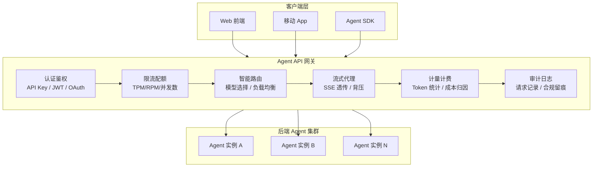
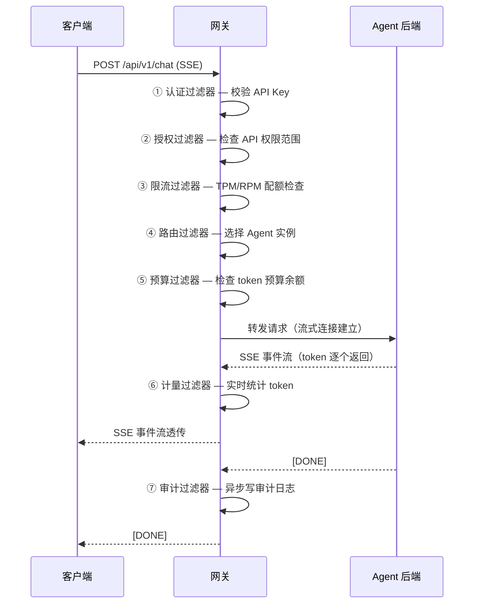

# 53 · Agent API 网关设计

> 阶段：4 生产化 · 难度：⭐⭐⭐⭐ · 预计：3 天
> 前置：[08 管控分离架构](08-管控分离架构.md)
> 产出：设计并实现一个 Agent 专用 API 网关，统一入口、鉴权、限流、路由

---

## 你将学会

- Agent API 网关与传统 API 网关的核心差异
- 统一入口设计：认证 / 授权 / 限流 / 路由 / 协议转换
- 流式响应（SSE）在网关层的透传方案
- 多模型路由的网关层实现

---

## 为什么 Agent 网关不同于传统网关

传统 API 网关（如 Spring Cloud Gateway、Kong、Nginx）处理的是**短请求、同步响应**的 REST/GraphQL API。Agent API 有三个根本差异：

| 特征 | 传统 API | Agent API |
|------|---------|-----------|
| 响应模式 | 同步 JSON | SSE 流式 + 工具调用回调 |
| 延迟 | 毫秒级 | 秒到分钟级 |
| Token 计费 | 无 | 按 token 计费，需精确计量 |
| 上下文管理 | 无状态 | 需管理会话/记忆 |
| 模型路由 | 不涉及 | 按意图/成本/可用性路由到不同 LLM |



---

## 知识讲解

### 1. 网关核心过滤器链

Agent 网关基于过滤器链（Filter Chain）模式，每个请求依次经过：



### 2. SSE 流式透传的关键

传统网关是 **buffer-and-forward** 模式——等完整响应再转发。Agent 流式响应必须 **stream-and-forward**——每收到一个 SSE event 立即转发：

```java
package demo.demo04.gateway;

import org.springframework.cloud.gateway.filter.*;
import org.springframework.core.io.buffer.*;
import org.springframework.http.*;
import org.springframework.web.reactive.function.client.*;
import reactor.core.publisher.*;

import java.time.Duration;

/**
 * SSE 流式代理过滤器
 * 核心：不做缓冲，每个 event 立即透传给客户端
 */
public class SseStreamProxyFilter implements GlobalFilter, Ordered {

    private final WebClient webClient;

    public SseStreamProxyFilter(WebClient.Builder builder) {
        this.webClient = builder.build();
    }

    @Override
    public Mono<Void> filter(ServerWebExchange exchange, GatewayFilterChain chain) {
        ServerHttpRequest request = exchange.getRequest();

        // 非流式请求走默认链
        if (!isStreamRequest(request)) {
            return chain.filter(exchange);
        }

        // 构建到后端 Agent 的请求
        String backendUrl = resolveBackend(request); // 路由选择后的目标地址

        return webClient.post()
                .uri(backendUrl)
                .headers(h -> h.addAll(request.getHeaders()))
                .body(request.getBody(), DataBuffer.class)
                .retrieve()
                .bodyToFlux(String.class) // 逐 event 接收
                .timeout(Duration.ofMinutes(5)) // Agent 可能很慢
                .doOnNext(event -> {
                    // 实时计量（每个 SSE event 都可能包含 token 计数）
                    TokenMeter.record(event);
                })
                .map(this::toSseFormat) // 转为标准 SSE 格式
                .onErrorResume(e -> Flux.just("event: error\ndata: " + e.getMessage() + "\n\n"))
                .doFinally(signal -> {
                    // 审计日志异步写入
                    AuditLogger.logAsync(request, signal);
                })
                // 写入响应（流式输出给客户端）
                .flatMap(sse -> writeSse(exchange, sse))
                .then();
    }

    private boolean isStreamRequest(ServerHttpRequest request) {
        String accept = request.getHeaders().getFirst(HttpHeaders.ACCEPT);
        return accept != null && accept.contains("text/event-stream");
    }

    private String resolveBackend(ServerHttpRequest request) {
        // 简化：实际由路由过滤器决定（轮询/加权/最少连接/模型亲和）
        return "http://agent-backend:8080" + request.getPath().value();
    }

    private String toSseFormat(String event) {
        return "data: " + event + "\n\n";
    }

    private Mono<Void> writeSse(ServerWebExchange exchange, String sse) {
        DataBufferFactory factory = exchange.getResponse().bufferFactory();
        DataBuffer buffer = factory.wrap(sse.getBytes());
        return exchange.getResponse().writeWith(Mono.just(buffer));
    }

    @Override
    public int getOrder() {
        return -1; // 在路由过滤器之后执行
    }
}
```

### 3. 多模型路由策略

网关层根据请求特征路由到不同的 LLM 后端：

```java
package demo.demo04.gateway.router;

import org.springframework.stereotype.Component;

import java.util.*;
import java.util.concurrent.atomic.AtomicInteger;

/**
 * 多模型智能路由器
 */
@Component
public class ModelRouter {

    private final List<ModelEndpoint> endpoints;
    private final AtomicInteger roundRobin = new AtomicInteger(0);

    public ModelRouter() {
        this.endpoints = List.of(
            new ModelEndpoint("gpt-4o", "openai", 0.03, 0.06, true),
            new ModelEndpoint("claude-sonnet", "anthropic", 0.02, 0.04, true),
            new ModelEndpoint("qwen-max", "alibaba", 0.01, 0.02, true),
            new ModelEndpoint("gpt-4o-mini", "openai", 0.0005, 0.001, true),
            new ModelEndpoint("local-llama", "ollama", 0.0, 0.0, true)
        );
    }

    /**
     * 根据路由策略选择模型
     */
    public ModelEndpoint route(RouteContext ctx) {
        return switch (ctx.strategy()) {
            case COST_FIRST -> selectCheapest(ctx);
            case QUALITY_FIRST -> selectBest(ctx);
            case LATENCY_FIRST -> selectFastest(ctx);
            case STICKY -> selectSticky(ctx);
            case ROUND_ROBIN -> selectRoundRobin();
        };
    }

    /**
     * 成本优先：选满足质量要求的最低价模型
     */
    private ModelEndpoint selectCheapest(RouteContext ctx) {
        return endpoints.stream()
                .filter(e -> e.available)
                .filter(e -> e.qualityScore() >= ctx.minQuality())
                .min(Comparator.comparingDouble(e -> e.outputPrice))
                .orElseThrow(() -> new RuntimeException("无可用模型"));
    }

    /**
     * 延迟优先：选响应最快的模型
     */
    private ModelEndpoint selectFastest(RouteContext ctx) {
        return endpoints.stream()
                .filter(e -> e.available)
                .min(Comparator.comparingDouble(e -> e.p90Latency))
                .orElseThrow(() -> new RuntimeException("无可用模型"));
    }

    /**
     * 会话亲和：同一会话路由到同一模型（保持输出风格一致）
     */
    private ModelEndpoint selectSticky(RouteContext ctx) {
        // 实际实现用 Redis 缓存 sessionId → model 映射
        if (ctx.sessionId() != null) {
            // TODO: redis.get("route:" + ctx.sessionId())
        }
        return selectRoundRobin();
    }

    private ModelEndpoint selectRoundRobin() {
        int idx = roundRobin.getAndIncrement() % endpoints.size();
        return endpoints.get(idx);
    }

    /**
     * 健康检查：定期探测模型可用性
     */
    public void healthCheck() {
        for (ModelEndpoint ep : endpoints) {
            try {
                // 发一个轻量级 ping 请求
                boolean ok = pingModel(ep);
                ep.available = ok;
            } catch (Exception e) {
                ep.available = false;
            }
        }
    }

    private boolean pingModel(ModelEndpoint ep) {
        // 简化：实际发一个 "ping" 请求
        return true;
    }
}

record ModelEndpoint(
    String modelId,
    String provider,
    double inputPrice,  // 每 1K token 价格（美元）
    double outputPrice,
    boolean available
) {
    public double qualityScore() {
        return switch (provider) {
            case "openai" -> modelId.contains("4o") && !modelId.contains("mini") ? 0.95 : 0.75;
            case "anthropic" -> 0.90;
            case "alibaba" -> 0.85;
            default -> 0.60;
        };
    }

    public double p90Latency = 0; // 由健康检查更新
}

record RouteContext(
    String strategy,       // COST_FIRST / QUALITY_FIRST / LATENCY_FIRST / STICKY
    String sessionId,      // 会话 ID（用于会话亲和）
    double minQuality,     // 最低质量要求
    int maxCost            // 最大成本（美元）
) {}
```

### 4. Token 实时计量

Agent 网关需要在流式响应中实时统计 token 用量，用于计费和配额扣减：

```java
package demo.demo04.gateway.meter;

import org.springframework.stereotype.Component;

import java.util.Map;
import java.util.concurrent.*;
import java.util.concurrent.atomic.AtomicLong;

/**
 * Token 实时计量器
 * 在 SSE 流式传输过程中，实时解析并累计 token 用量
 */
@Component
public class TokenMeter {

    // 异步聚合：避免阻塞 SSE 流
    private final ExecutorService executor = Executors.newSingleThreadExecutor();

    // 按 API Key 聚合（用于配额扣减）
    private final Map<String, AtomicLong> promptTokensByKey = new ConcurrentHashMap<>();
    private final Map<String, AtomicLong> completionTokensByKey = new ConcurrentHashMap<>();

    /**
     * 记录一次请求的 token 用量
     */
    public void record(String apiKey, long promptTokens, long completionTokens, String model) {
        promptTokensByKey.computeIfAbsent(apiKey, k -> new AtomicLong())
                .addAndGet(promptTokens);
        completionTokensByKey.computeIfAbsent(apiKey, k -> new AtomicLong())
                .addAndGet(completionTokens);

        // 异步写入时序数据库（用于计费和看板）
        executor.submit(() -> {
            // InfluxDB / Prometheus / Redis TS
            double cost = calculateCost(model, promptTokens, completionTokens);
            CostRecorder.record(apiKey, model, promptTokens, completionTokens, cost);
        });
    }

    /**
     * 获取某 API Key 的当前窗口用量
     */
    public UsageSnapshot getUsage(String apiKey) {
        return new UsageSnapshot(
            promptTokensByKey.getOrDefault(apiKey, new AtomicLong()).get(),
            completionTokensByKey.getOrDefault(apiKey, new AtomicLong()).get()
        );
    }

    private double calculateCost(String model, long pt, long ct) {
        // 简化：实际按模型定价表计算
        return pt * 0.001 * 0.01 + ct * 0.001 * 0.02;
    }
}

record UsageSnapshot(long promptTokens, long completionTokens) {}
```

### 5. 认证与授权

```java
package demo.demo04.gateway.auth;

import org.springframework.cloud.gateway.filter.*;
import org.springframework.http.*;
import org.springframework.stereotype.*;
import reactor.core.publisher.*;

import java.util.*;

/**
 * Agent API 认证过滤器
 */
@Component
public class AuthFilter implements GlobalFilter, Ordered {

    // API Key → 权限映射（实际从数据库/配置中心加载）
    private final Map<String, ApiKeyInfo> keyStore = new ConcurrentHashMap<>();

    @Override
    public Mono<Void> filter(ServerWebExchange exchange, GatewayFilterChain chain) {
        String apiKey = extractApiKey(exchange);

        if (apiKey == null) {
            return reject(exchange, 401, "missing_api_key");
        }

        ApiKeyInfo info = keyStore.get(apiKey);
        if (info == null || !info.active) {
            return reject(exchange, 401, "invalid_api_key");
        }

        // 检查权限范围
        String path = exchange.getRequest().getPath().value();
        if (!hasPermission(info, path)) {
            return reject(exchange, 403, "insufficient_permissions");
        }

        // 检查 IP 白名单
        if (!info.ipWhitelist.isEmpty()) {
            String clientIp = exchange.getRequest().getRemoteAddress().getAddress().getHostAddress();
            if (!info.ipWhitelist.contains(clientIp)) {
                return reject(exchange, 403, "ip_not_allowed");
            }
        }

        // 传递身份信息到后端
        exchange.getRequest().mutate()
                .header("X-Api-Key-Id", info.keyId)
                .header("X-Tenant-Id", info.tenantId)
                .build();

        return chain.filter(exchange);
    }

    private String extractApiKey(ServerWebExchange exchange) {
        // 优先从 Header 取
        String header = exchange.getRequest().getHeaders().getFirst("Authorization");
        if (header != null && header.startsWith("Bearer ")) {
            return header.substring(7);
        }
        // 其次从 query param 取
        return exchange.getRequest().getQueryParams().getFirst("api_key");
    }

    private boolean hasPermission(ApiKeyInfo info, String path) {
        return info.scopes.stream().anyMatch(path::startsWith);
    }

    private Mono<Void> reject(ServerWebExchange exchange, int code, String message) {
        exchange.getResponse().setStatusCode(HttpStatus.valueOf(code));
        exchange.getResponse().getHeaders().setContentType(MediaType.APPLICATION_JSON);
        String body = "{\"error\":{\"code\":\"" + message + "\"}}";
        DataBuffer buffer = exchange.getResponse().bufferFactory().wrap(body.getBytes());
        return exchange.getResponse().writeWith(Mono.just(buffer));
    }

    @Override
    public int getOrder() {
        return -100; // 最高优先级
    }
}

record ApiKeyInfo(
    String keyId,
    String tenantId,
    boolean active,
    Set<String> scopes,        // 权限范围：/api/v1/chat, /api/v1/rag 等
    Set<String> ipWhitelist    // IP 白名单
) {}
```

---

## 动手实践

### Step 1：搭建网关骨架

```xml
<dependency>
    <groupId>org.springframework.cloud</groupId>
    <artifactId>spring-cloud-starter-gateway</artifactId>
</dependency>
```

```java
package demo.demo04.gateway;

import org.springframework.boot.SpringApplication;
import org.springframework.boot.autoconfigure.SpringBootApplication;
import org.springframework.context.annotation.*;

@SpringBootApplication
public class GatewayApplication {
    public static void main(String[] args) {
        SpringApplication.run(GatewayApplication.class, args);
    }

    @Bean
    public WebClient.Builder webClientBuilder() {
        return WebClient.builder();
    }
}
```

### Step 2：配置路由规则

```yaml
spring:
  cloud:
    gateway:
      routes:
        - id: agent-chat
          uri: lb://agent-backend
          predicates:
            - Path=/api/v1/chat/**
          filters:
            - name: RequestRateLimiter
              args:
                redis-rate-limiter.replenishRate: 10    # 每秒 10 个请求
                redis-rate-limiter.burstCapacity: 20    # 突发 20
                key-resolver: "#{@apiKeyResolver}"

        - id: agent-rag
          uri: lb://rag-backend
          predicates:
            - Path=/api/v1/rag/**

        - id: agent-admin
          uri: lb://admin-backend
          predicates:
            - Path=/api/admin/**
          filters:
            - name: AdminAuth  # 管理 API 需要额外认证
```

### Step 3：API Key 管理

```java
package demo.demo04.gateway.admin;

import org.springframework.web.bind.annotation.*;
import java.util.*;

@RestController
@RequestMapping("/api/admin/keys")
public class ApiKeyController {

    private final ApiKeyService keyService;

    public ApiKeyController(ApiKeyService keyService) {
        this.keyService = keyService;
    }

    /**
     * 创建 API Key
     */
    @PostMapping
    public Map<String, Object> createKey(@RequestBody CreateKeyRequest req) {
        ApiKeyInfo info = keyService.createKey(req);
        return Map.of(
            "keyId", info.keyId(),
            "apiKey", info.keyId() + "-" + UUID.randomUUID(), // 前缀方便识别
            "scopes", info.scopes(),
            "createdAt", System.currentTimeMillis()
        );
    }

    /**
     * 吊销 API Key
     */
    @DeleteMapping("/{keyId}")
    public Map<String, Object> revokeKey(@PathVariable String keyId) {
        keyService.revoke(keyId);
        return Map.of("status", "revoked", "keyId", keyId);
    }

    /**
     * 查询用量
     */
    @GetMapping("/{keyId}/usage")
    public Map<String, Object> usage(@PathVariable String keyId,
                                     @RequestParam(defaultValue = "24h") String window) {
        UsageSnapshot snapshot = keyService.getUsage(keyId, window);
        return Map.of(
            "keyId", keyId,
            "window", window,
            "promptTokens", snapshot.promptTokens(),
            "completionTokens", snapshot.completionTokens(),
            "estimatedCost", snapshot.estimatedCost()
        );
    }
}

record CreateKeyRequest(
    String tenantId,
    Set<String> scopes,
    Set<String> ipWhitelist,
    long tokenBudget // 月度 token 预算
) {}
```

---

## 常见坑

- ❌ **SSE 被网关缓冲** → 传统网关默认缓冲完整响应再转发。必须配置 `proxy_buffering off` 或使用 Reactive 流式代理
- ❌ **超时太短** → Agent 响应可能需要 30-120 秒。网关超时至少设 5 分钟
- ❌ **未做背压** → 后端 Agent 慢，但客户端断开了，需要传播取消信号避免浪费 token
- ❌ **Token 计量在网关层遗漏** → SSE 流中最后一个 event 通常包含 usage 统计，必须解析
- ❌ **API Key 明文存储** → 用哈希存储，只创建时展示一次明文
- ❌ **没有灰度路由** → 新模型上线没有灰度切换，全量切换风险大

---

## 验收检查

- [ ] 网关能正确代理 SSE 流式响应（客户端能逐 token 收到）
- [ ] API Key 认证生效（无 Key / 无效 Key / 无权限分别返回 401/401/403）
- [ ] 限流配置生效（超过 RPM/TPM 限制返回 429）
- [ ] 多模型路由能根据策略选择不同后端
- [ ] Token 计量在流式响应中准确统计
- [ ] 超时和背压正确传播

---

## 下一步

→ 下一篇：[54 Agent SDK 与客户端工程](54-Agent SDK与客户端工程.md)
