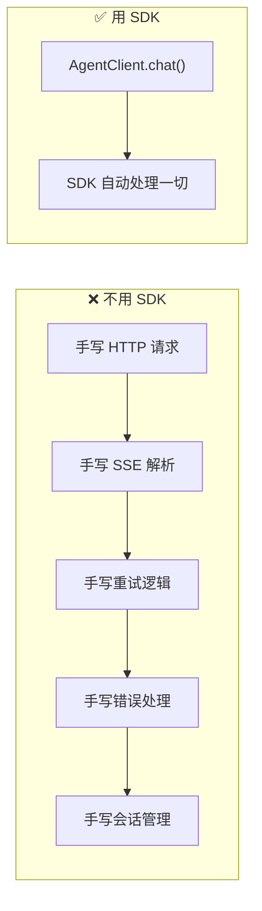
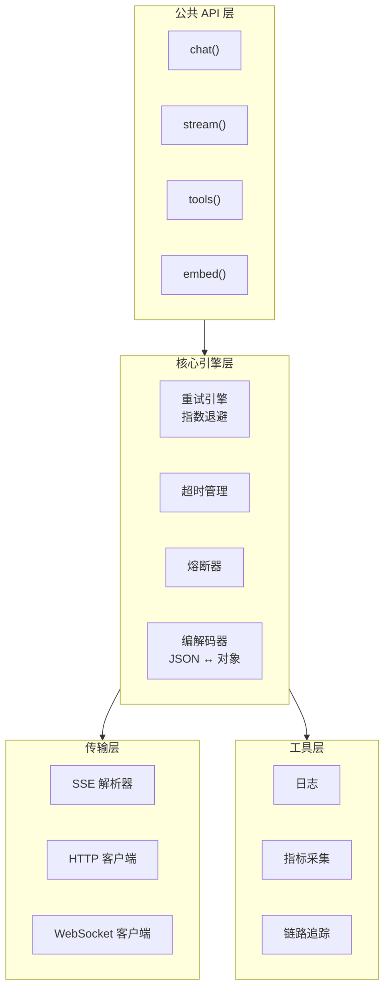

# 54 · Agent SDK 与客户端工程

> 阶段：4 生产化 · 难度：⭐⭐⭐ · 预计：2 天
> 前置：[53 Agent API 网关设计](53-Agent%20API网关设计.md)
> 产出：设计并实现一个 Agent 客户端 SDK，封装重试、流式解析、会话管理

---

## 你将学会

- Agent SDK 的设计原则与核心抽象
- 流式响应的客户端解析（SSE event 解码）
- 自动重试、超时、断线重连的工程实现
- SDK 的版本管理与向后兼容

---

## 为什么需要 SDK

直接用 HTTP 客户端调用 Agent API 需要处理大量样板代码：



好的 SDK 应该让调用方代码极简：

```java
// 理想的 SDK 调用
String reply = agentClient.chat("帮我分析一下这个错误")
    .sessionId("session-001")
    .model("gpt-4o")
    .stream()  // 流式
    .onToken(token -> System.out.print(token))
    .onToolCall(tool -> handleTool(tool))
    .onError(err -> log.error("Agent 错误", err))
    .block();  // 等待完成
```

---

## 知识讲解

### 1. SDK 分层架构



### 2. SSE 流式解析器

```java
package demo.demo04.sdk.core;

import java.io.*;
import java.util.*;
import java.util.function.*;

/**
 * SSE (Server-Sent Events) 流式解析器
 * 按 \n\n 分割 event，按行解析 data: / event: / id:
 */
public class SseParser {

    /**
     * 从输入流解析 SSE 事件
     */
    public void parse(InputStream input, Consumer<SseEvent> onEvent) throws IOException {
        BufferedReader reader = new BufferedReader(new InputStreamReader(input));
        StringBuilder eventBuffer = new StringBuilder();
        String line;

        while ((line = reader.readLine()) != null) {
            if (line.isEmpty()) {
                // 空行 = 一个 event 结束
                if (eventBuffer.length() > 0) {
                    SseEvent event = parseEvent(eventBuffer.toString());
                    if (event != null) {
                        onEvent.accept(event);
                    }
                    eventBuffer.setLength(0);
                }
            } else {
                eventBuffer.append(line).append("\n");
            }
        }
    }

    /**
     * 解析单个 SSE event
     */
    private SseEvent parseEvent(String raw) {
        String eventType = "message";
        String data = "";
        String id = null;

        for (String line : raw.split("\n")) {
            if (line.startsWith("event:")) {
                eventType = line.substring(6).trim();
            } else if (line.startsWith("data:")) {
                data = line.substring(5).trim();
            } else if (line.startsWith("id:")) {
                id = line.substring(3).trim();
            }
            // 忽略注释行（以 : 开头的心跳）
        }

        if (data.isEmpty()) {
            return null; // 忽略无数据的 event（如心跳 ping）
        }

        return new SseEvent(eventType, data, id);
    }

    public record SseEvent(String type, String data, String id) {}
}
```

### 3. AgentClient 核心

```java
package demo.demo04.sdk;

import demo.demo04.sdk.core.*;
import reactor.core.publisher.*;

import java.net.http.*;
import java.net.URI;
import java.time.Duration;
import java.util.*;
import java.util.function.*;

/**
 * Agent 客户端 SDK
 */
public class AgentClient {

    private final String baseUrl;
    private final String apiKey;
    private final HttpClient httpClient;
    private final SseParser sseParser;
    private final RetryPolicy retryPolicy;

    private AgentClient(Builder builder) {
        this.baseUrl = builder.baseUrl;
        this.apiKey = builder.apiKey;
        this.httpClient = HttpClient.newBuilder()
                .connectTimeout(Duration.ofSeconds(builder.connectTimeoutSeconds))
                .build();
        this.sseParser = new SseParser();
        this.retryPolicy = builder.retryPolicy;
    }

    /**
     * 同步对话
     */
    public ChatResponse chat(ChatRequest request) {
        return retryPolicy.execute(() -> {
            HttpResponse<String> resp = httpClient.send(
                    buildRequest(request, false),
                    HttpResponse.BodyHandlers.ofString()
            );
            validateResponse(resp);
            return ChatResponse.fromJson(resp.body());
        });
    }

    /**
     * 流式对话 — 核心 API
     */
    public Flux<ChatChunk> stream(ChatRequest request) {
        return Flux.<ChatChunk>create(sink -> {
            try {
                HttpResponse<InputStream> resp = httpClient.send(
                        buildRequest(request, true),
                        HttpResponse.BodyHandlers.ofInputStream()
                );
                validateResponse(resp);

                // 解析 SSE 流
                sseParser.parse(resp.body(), event -> {
                    if ("done".equals(event.type())) {
                        sink.complete();
                        return;
                    }
                    if ("error".equals(event.type())) {
                        sink.error(new AgentException(event.data()));
                        return;
                    }
                    // 正常 token / 工具调用
                    ChatChunk chunk = ChatChunk.fromSseEvent(event);
                    if (chunk != null) {
                        sink.next(chunk);
                    }
                });
            } catch (Exception e) {
                sink.error(e);
            }
        });
    }

    /**
     * 带回调的流式对话（不依赖 Reactor）
     */
    public void stream(ChatRequest request, StreamCallbacks callbacks) {
        retryPolicy.execute(() -> {
            HttpResponse<InputStream> resp = httpClient.send(
                    buildRequest(request, true),
                    HttpResponse.BodyHandlers.ofInputStream()
            );
            validateResponse(resp);

            sseParser.parse(resp.body(), event -> {
                switch (event.type()) {
                    case "token" -> callbacks.onToken(event.data());
                    case "tool_call" -> {
                        ToolCall tool = ToolCall.fromJson(event.data());
                        callbacks.onToolCall(tool);
                    }
                    case "done" -> {
                        Usage usage = Usage.fromJson(event.data());
                        callbacks.onComplete(usage);
                    }
                    case "error" -> callbacks.onError(new AgentException(event.data()));
                }
            });
            return null;
        });
    }

    private HttpRequest buildRequest(ChatRequest request, boolean stream) {
        String body = request.toJson(stream);
        return HttpRequest.newBuilder()
                .uri(URI.create(baseUrl + "/api/v1/chat"))
                .header("Content-Type", "application/json")
                .header("Authorization", "Bearer " + apiKey)
                .header("Accept", stream ? "text/event-stream" : "application/json")
                .POST(HttpRequest.BodyPublishers.ofString(body))
                .timeout(Duration.ofMinutes(5))
                .build();
    }

    private void validateResponse(HttpResponse<?> resp) {
        if (resp.statusCode() != 200) {
            throw new AgentException("HTTP " + resp.statusCode() + ": " + resp.body());
        }
    }

    // ===== Builder =====

    public static Builder builder() {
        return new Builder();
    }

    public static class Builder {
        private String baseUrl = "http://localhost:8080";
        private String apiKey;
        private int connectTimeoutSeconds = 10;
        private RetryPolicy retryPolicy = RetryPolicy.defaultPolicy();

        public Builder baseUrl(String url) { this.baseUrl = url; return this; }
        public Builder apiKey(String key) { this.apiKey = key; return this; }
        public Builder connectTimeout(int seconds) { this.connectTimeoutSeconds = seconds; return this; }
        public Builder retryPolicy(RetryPolicy policy) { this.retryPolicy = policy; return this; }

        public AgentClient build() {
            Objects.requireNonNull(apiKey, "apiKey 不能为空");
            return new AgentClient(this);
        }
    }
}
```

### 4. 重试策略

```java
package demo.demo04.sdk.core;

import java.time.Duration;
import java.util.concurrent.*;
import java.util.function.*;

/**
 * 指数退避重试策略
 */
public class RetryPolicy {

    private final int maxRetries;
    private final Duration initialDelay;
    private final double backoffMultiplier;
    private final Duration maxDelay;
    private final Predicate<Throwable> retryableCheck;

    public RetryPolicy(int maxRetries, Duration initialDelay,
                       double backoffMultiplier, Duration maxDelay,
                       Predicate<Throwable> retryableCheck) {
        this.maxRetries = maxRetries;
        this.initialDelay = initialDelay;
        this.backoffMultiplier = backoffMultiplier;
        this.maxDelay = maxDelay;
        this.retryableCheck = retryableCheck;
    }

    public static RetryPolicy defaultPolicy() {
        return new RetryPolicy(
            3,
            Duration.ofMillis(500),
            2.0,
            Duration.ofSeconds(30),
            RetryPolicy::isRetryable
        );
    }

    /**
     * 判断异常是否可重试
     */
    private static boolean isRetryable(Throwable e) {
        if (e instanceof AgentException ae) {
            int code = ae.getHttpStatus();
            // 429 限流、500/502/503/504 服务端错误 → 可重试
            return code == 429 || code >= 500;
        }
        // 网络超时、连接重置 → 可重试
        return e instanceof java.net.SocketTimeoutException
            || e instanceof java.net.ConnectException;
    }

    /**
     * 执行带重试的操作
     */
    public <T> T execute(Supplier<T> action) {
        Duration delay = initialDelay;
        Exception lastError = null;

        for (int i = 0; i <= maxRetries; i++) {
            try {
                return action.get();
            } catch (Exception e) {
                lastError = e;
                if (!retryableCheck.test(e) || i == maxRetries) {
                    throw new RuntimeException(e);
                }

                // 指数退避 + 随机抖动
                long jitter = ThreadLocalRandom.current().nextLong(100);
                long sleepMs = delay.toMillis() + jitter;

                // 429 时，优先使用 Retry-After header
                if (e instanceof AgentException ae && ae.getRetryAfter() > 0) {
                    sleepMs = ae.getRetryAfter() * 1000L;
                }

                try {
                    Thread.sleep(sleepMs);
                } catch (InterruptedException ie) {
                    Thread.currentThread().interrupt();
                    throw new RuntimeException(ie);
                }

                delay = Duration.ofMillis(
                    (long) Math.min(delay.toMillis() * backoffMultiplier, maxDelay.toMillis())
                );
            }
        }
        throw new RuntimeException(lastError);
    }
}
```

### 5. 请求与响应模型

```java
package demo.demo04.sdk;

import java.util.*;

/**
 * 对话请求
 */
public class ChatRequest {
    private String sessionId;
    private String model;
    private List<Message> messages;
    private Double temperature;
    private Integer maxTokens;
    private List<ToolSpec> tools;

    public String toJson(boolean stream) {
        // 简化：实际用 Jackson/Gson 序列化
        StringBuilder sb = new StringBuilder("{");
        sb.append("\"model\":\"").append(model).append("\"");
        sb.append(",\"messages\":").append(messagesToJson());
        if (stream) sb.append(",\"stream\":true");
        if (temperature != null) sb.append(",\"temperature\":").append(temperature);
        if (maxTokens != null) sb.append(",\"max_tokens\":").append(maxTokens);
        sb.append("}");
        return sb.toString();
    }

    private String messagesToJson() {
        // 简化
        return "[]";
    }

    // Builder 省略...
    public static Builder builder() { return new Builder(); }
    public static class Builder {
        // 省略...
    }
}

/**
 * 流式响应块
 */
public record ChatChunk(
    ChunkType type,    // TOKEN / TOOL_CALL / USAGE / DONE
    String text,       // 文本内容（TOKEN 类型时）
    ToolCall toolCall, // 工具调用（TOOL_CALL 类型时）
    Usage usage        // token 用量（USAGE 类型时）
) {
    public static ChatChunk fromSseEvent(SseParser.SseEvent event) {
        return switch (event.type()) {
            case "token" -> new ChatChunk(ChunkType.TOKEN, event.data(), null, null);
            case "tool_call" -> new ChatChunk(ChunkType.TOOL_CALL, null, ToolCall.fromJson(event.data()), null);
            case "usage" -> new ChatChunk(ChunkType.USAGE, null, null, Usage.fromJson(event.data()));
            default -> null;
        };
    }

    public enum ChunkType { TOKEN, TOOL_CALL, USAGE, DONE }
}

/**
 * 流式回调接口
 */
public interface StreamCallbacks {
    void onToken(String token);
    void onToolCall(ToolCall toolCall);
    void onComplete(Usage usage);
    void onError(Throwable error);
}
```

---

## SDK 使用示例

```java
// 创建客户端
AgentClient client = AgentClient.builder()
        .baseUrl("https://api.myagent.com")
        .apiKey("sk-xxxxx")
        .connectTimeout(10)
        .build();

// 同步调用
ChatResponse resp = client.chat(ChatRequest.builder()
        .model("gpt-4o")
        .messages(List.of(new Message("user", "你好")))
        .build());
System.out.println(resp.getText());

// 流式调用（Reactor）
client.stream(ChatRequest.builder()
        .model("gpt-4o")
        .messages(List.of(new Message("user", "讲个故事")))
        .build())
        .doOnNext(chunk -> {
            if (chunk.type() == ChatChunk.ChunkType.TOKEN) {
                System.out.print(chunk.text());
            }
        })
        .blockLast();

// 流式调用（回调）
client.stream(request, new StreamCallbacks() {
    @Override public void onToken(String token) { System.out.print(token); }
    @Override public void onToolCall(ToolCall tool) { System.out.println("\n[工具调用] " + tool); }
    @Override public void onComplete(Usage usage) { System.out.println("\n[完成] " + usage); }
    @Override public void onError(Throwable err) { err.printStackTrace(); }
});
```

---

## 常见坑

- ❌ **SSE 解析没处理多行 data** → 标准 SSE 允许一个 event 有多个 `data:` 行，需要拼接
- ❌ **重试不区分错误类型** → 400 参数错误不应重试，只有 429/5xx 才重试
- ❌ **重试没有抖动** → 多个客户端同时重试导致惊群效应
- ❌ **流式连接没有超时** → Agent 卡住无限等待。必须设读超时
- ❌ **SDK 版本不兼容** → 新版本改了接口签名，所有调用方全挂。用语义化版本号
- ❌ **阻塞调用方线程** → 流式回调里做重操作会阻塞 SSE 读取。用异步线程池

---

## 验收检查

- [ ] SDK 能正常发起同步对话并解析响应
- [ ] 流式调用能逐 token 接收并回调
- [ ] 网络错误时自动重试（指数退避 + 抖动）
- [ ] 429 限流时使用 Retry-After header
- [ ] 工具调用事件能正确解析
- [ ] SDK 提供 Builder 模式，易于集成

---

## 下一步

→ 下一篇：[55 Agent 前端集成架构](55-Agent前端集成架构.md)
